# The School of Death
## Charters of Protestant Seminaries and Missionary Societies, from Calvin's Geneva to the Faith Missions

*Assembled manuscript -- working draft. See `book/plan/07_risk_register_and_qa.md` for the acceptance checklist this draft has not yet cleared (rights sign-off, human review of the Introduction, Appendix A charter selection).*

---

# Table of Contents

- Introduction: The School of Death
- Part I: Reformation Academies (1518-1620)
  - University of Wittenberg (Reformation curriculum) (1518)
  - The Prophezei (1525)
  - Strasbourg Gymnasium/Academy (1538)
  - Geneva Academy (1559)
  - Scotland: First Book of Discipline (1560)
  - Leiden University (1575)
  - Emmanuel College Cambridge (1584)
  - French Reformed Academies of Saumur and Sedan (1579)
- Part II: Puritans, Pietists and Dissenters (1636-1790)
  - Harvard College (1636)
  - Yale College (1701)
  - Francke Foundations and Danish-Halle Mission (1698)
  - Herrnhut and the Moravian Missions (1722)
  - Bristol Baptist Academy (1679)
  - Doddridge's Northampton Academy (1729)
  - The Log College (1726)
  - College of New Jersey (Princeton) (1746)
  - Trevecca College (1768)
- Part III: The Missionary Awakening and the Seminary (1792-1860)
  - Baptist Missionary Society (1792)
  - London Missionary Society (1795)
  - Church Missionary Society (1799)
  - Andover Theological Seminary (1808)
  - American Board of Commissioners for Foreign Missions (1810)
  - Judson and the Baptist Triennial Convention (1814)
  - Princeton Theological Seminary (1812)
  - Basel Mission (1815)
  - Serampore College (1818)
  - New College Edinburgh (1843)
  - The Pastors' College (Spurgeon) (1856)
  - Southern Baptist Theological Seminary (1859)
- Part IV: Faith Missions and the Bible Institute (1865-1930)
  - China Inland Mission (1865)
  - East London Institute (Harley College) (1873)
  - Missionary Training Institute Nyack (1882)
  - Moody Bible Institute (1886)
  - Student Volunteer Movement (1886)
  - Africa Inland Mission and Sudan Interior Mission (1893)
  - Bible Institute of Los Angeles (1908)
  - Bible Training Institute Glasgow (1892)
  - Prairie Bible Institute (1922)
  - Columbia Bible College (1923)
  - Westminster Theological Seminary (1929)
- Part V: Translators, Tribes and the Auca Five (1930-1960)
  - Wycliffe Bible Translators / SIL (1934)
  - Wheaton College (1860)
  - Christian Missions in Many Lands (Brethren) (1921)
  - Inter-Varsity and Urbana (1941)
  - New Tribes Mission (1942)
  - Missionary Aviation Fellowship (1945)
- Part VI: Lloyd-Jones and the Reformed Recovery (1938-1980)
  - Westminster Chapel and Westminster Fellowship (1938)
  - Evangelical Library / IFES / Banner of Truth (1945)
  - London Theological Seminary (1977)
  - Overseas Missionary Fellowship (1965)
- Appendix B: Comparative Tables
- Appendix C: Lineage Chart
- Appendix D: Timeline
- Appendix E: Glossary

---

# Introduction: The School of Death

In June 1559, in the church of St Pierre in Geneva, Theodore Beza told the first students of a
new academy that they had not come there for spectacle. They had not come, he said, the way most
Greeks once went to their gymnasia, to watch fleeting games. Elsewhere, recalling that same day,
it is recorded that the school's first rector reminded those same young men that they were a
militia. Four hundred and eighteen years later and eight hundred miles north, in a rented hall in
Finchley, a seminary opened that would take no academic accreditation, offer no degree, and admit
no women, on the settled conviction of its founders that a preacher's training and a scholar's
training are not the same thing. Between those two rooms lie the fifty schools, societies, and
sending bodies gathered in this book.

This book's working title makes a claim it cannot fully prove. "The school of death" is a phrase
now attached to the Geneva Academy on several devotional websites, tied to a widely repeated
figure of some eighty-eight pastors sent from Geneva into France between 1555 and 1562, many of
them to be killed. A search of this book's own primary source for Geneva — Charles Borgeaud's
660-page 1900 history of the Academy, a work that quotes Genevan council registers and Beza's own
words at length — turned up no use of the phrase "school of death," in French, Latin, or English,
in any period. It is not there. That does not mean the phrase has no older source; it means only
that the one substantial history read for this book does not contain it, and that the book's own
title should be read as a live question rather than a settled fact. The reader will find that
same caution running through every chapter that follows. Where a fact could be found, quoted, and
checked against the document that states it, it is here. Where it could not, the book says so,
in the same sentence, rather than filling the gap with what everyone already assumes.

## What this book is

Fifty chapters, each built the same way. A school, seminary, academy, or missionary society is
introduced: who founded it, when, and why. Its own founding document — a charter, a set of
statutes, a constitution, a prospectus, an inaugural address — is abridged and printed, with every
cut marked, so the reader can see for themselves what the founders actually wrote rather than
take a later paraphrase on faith. Then five questions are asked of the institution, in this order,
every time: Whom did it admit, and on what testimony? What did it teach, in what order, from what
books, in what languages? How did teachers and students live and speak together? What did the
founders say mattered most, in their own words? And where did it send its people, and what did
that cost?

The order is chronological within six historical parts. Part I runs from Wittenberg's reformed
curriculum of 1518 to the French Reformed academies of Saumur and Sedan, tracing the first
generation of schools built to train a reformed clergy: Wittenberg, Zurich's Prophezei, Sturm's
Gymnasium at Strasbourg, the Geneva Academy, Scotland's First Book of Discipline, Leiden,
Emmanuel College Cambridge, Saumur, and Sedan. Part II follows the model into English Puritan New
England and the Continental Pietist and Moravian movements: Harvard, Yale, the Francke
Foundations at Halle and the Danish-Halle mission they sent to Tranquebar, Herrnhut and the first
Moravian missionaries, Bristol Baptist Academy, Philip Doddridge's academy at Northampton, the Log
College, the College of New Jersey, and Trevecca. Part III covers the missionary awakening of the
1790s and the rise of the freestanding theological seminary: the Baptist Missionary Society, the
London Missionary Society, the Church Missionary Society, Andover Theological Seminary, the
American Board of Commissioners for Foreign Missions, the Baptist Triennial Convention formed to
support Adoniram Judson, Princeton Theological Seminary, the Basel Mission, Serampore College,
New College Edinburgh, Charles Spurgeon's Pastors' College, and Southern Baptist Theological
Seminary. Part IV turns to the faith missions and Bible institutes of the later nineteenth and
early twentieth centuries: Hudson Taylor's China Inland Mission, the East London Institute, A. B.
Simpson's Missionary Training Institute at Nyack, Moody Bible Institute, the Student Volunteer
Movement, the Africa Inland Mission and Sudan Interior Mission, the Bible Institute of Los
Angeles, the Bible Training Institute at Glasgow, Prairie Bible Institute, Columbia Bible College,
and Westminster Theological Seminary. Part V follows the line that trained and sent Jim and
Elisabeth Elliot: Wycliffe Bible Translators and the Summer Institute of Linguistics, Wheaton
College, the Plymouth Brethren commendation network that sent the Elliots to Ecuador, Inter-
Varsity and the Urbana missions conventions, New Tribes Mission, and the Missionary Aviation
Fellowship. Part VI closes with Martyn Lloyd-Jones's world: his ministry at Westminster Chapel and
the Westminster Fellowship of ministers he led without ever founding a formal school, the
Evangelical Library, the International Fellowship of Evangelical Students, and the Banner of
Truth Trust, the London Theological Seminary he helped found in 1977, and a short account of that
mission's own later history under its renamed identity, the Overseas Missionary Fellowship.

Fifty chapters is not all of them. Two institutions belong in this story and are not here, or are
here only briefly, because this book could not locate and verify a primary source for them in the
time available: the Bible Training Institute at Glasgow has a chapter, but an honest and nearly
empty one, since no document of any kind describing its own rules, curriculum, or admission
practice could be found. That chapter is left in the book rather than cut, as a visible marker of
the method's own limit: silence, clearly labeled, rather than a plausible sentence written to fill
the space.

## What the documents actually say

The five questions produce, across fifty answers, a set of patterns no single chapter would show
on its own. Some of them confirm what a reader might expect. Most of them do not.

Doctrinal subscription and personal testimony turn out not to be the same requirement, and not
even points on the same line. The Geneva Academy in 1559 required an incoming student to sign a
confession of faith; it did not ask him to narrate a conversion. The Basel Mission in 1815 asked
the opposite: "a convincing account of spiritual rebirth," confirmed by a witness, was the single
decisive test for admission, with no signed doctrinal formula in view. London Theological
Seminary in 1977 asked for both, stating flatly that a candidate must "be a converted man...aware
of new life in himself." Reading straight through the book, in chronological order, gives the
impression of a slow trade: formal subscription loosens across three and a half centuries as
narrated personal experience tightens, until the two meet again, deliberately, in Lloyd-Jones's
seminary.

Money follows an equally sharp line, but not a straight one. Scotland's First Book of Discipline,
in 1560, proposed a university entrance fee scaled by the father's rank: an earl's son paying
forty shillings, a husbandman's or burgess's son ten shillings. That is a document built on the
assumption that a school serves a stratified society and should charge accordingly. Three hundred
years later Spurgeon's Pastors' College stated the reverse as a matter of principle, not
practicality: a student unable to contribute so much as a sixpence, its own record states, was
"equally welcome, and is received upon the same footing in all respects." Andover's Associate
Foundation and the China Inland Mission
both made the same refusal for the same stated reason — that ability to pay should play no part in
who is trained to preach. None of the book's Reformation or Puritan academies mention anything
resembling this idea. Geneva's chairs carried a fixed salary of 280 florins; Emmanuel College
fixed a stipend to the shilling; Harvard ran on a colonial grant and private bequests. The "faith
principle" — no fee, no guaranteed salary, no solicitation of funds, no debt, because debt is
"inconsistent with the principle of entire dependence upon God" in the China Inland Mission's own
words — does not exist anywhere in this book before 1865. After 1865 it becomes the explicit,
named financial doctrine of nearly every faith mission the book covers: the East London Institute,
Nyack, Prairie Bible Institute, the Brethren network that sent the Elliots. It is not a drift. It
is a hinge, and the hinge has a date.

The length of formal training collapses across the same years. Princeton Theological Seminary
fixed a minimum course of three years in 1811; Andover did the same in 1808; the College of New
Jersey ran a fixed four-year sequence of named classes from 1746. The Missionary Training
Institute at Nyack opened in 1882 with a single year of study, extended to three only in 1885.
Moody Bible Institute settled on two years from its own opening in 1889. The China Inland
Mission, by contrast, ran no institutional course of study at all: its "Probationers" trained
mostly in the field, under working missionaries, after a brief period of examination in England.
Read in order, the book's middle chapters describe a fixed, residential, multi-year classical and
theological curriculum; its later chapters describe something closer to an apprenticeship with a
short formal preface. Both models produced men and women willing to be sent. Neither model claims
in its own documents to be an improvement on the other — each states its own reasons, on its own
terms, and this book has tried to let each state them without editorial comment.

Two patterns concern how founders judged the schools that came before their own. The Log
College's own founders, William Tennent Sr. among them, trained ministers under one roof with no
charter and no diploma, and the college left no institutional archive of its own beyond a
description in George Whitefield's 1739 journal. The men who founded the College of New Jersey a
few years later judged the Log College model, in their own words, "comparatively meagre," and set
out to build something of a deliberately "higher order" in direct response. A century and a half
on, the same shape recurs: the East London Institute's single classroom in Bow, opened in 1873,
had within twenty years produced two much larger, formally departmentalized successor
institutions — Nyack, and then Moody Bible Institute, both organized into named Biblical,
Literary, Theological, Practical, and Missionary departments that the East London Institute never
had. An informal, personal, single-teacher model is tried; a generation later, that same
generation's own students judge it insufficient and build something more elaborate in its place;
a few decades on, someone builds something informal and personal again, because the elaborate
version has itself become too far from the men it trains. The book does not show this cycle
completing more than twice, clearly, in the material actually recovered — but twice, on opposite
sides of the Atlantic, three hundred years apart, is enough to name as a pattern rather than a
coincidence.

Women appear in this book's story of sending long before they appear in its story of formal
theological training, and the book's last founded institution reverses that order outright. The
China Inland Mission's founding documents specify "unmarried Candidates of either sex" as early
as 1865, and its early parties routinely included single women sent as missionaries in their own
right, not as wives. The East London Institute opened a distinct Female Branch by the mid-1880s.
The Student Volunteer Movement counted women among its own officers from its founding in 1888.
None of this book's Reformation or Puritan academies record a woman student in any capacity.
London Theological Seminary, founded in 1977 and the last institution covered in this book,
states in its own governing documents: "no women will be admitted." A reader moving through the
book in order will watch the line on this question rise for roughly a century, then drop sharply,
at the very end, by explicit written policy rather than by default or omission.

Death is recorded unevenly, and its absence is sometimes as telling as its presence. Of
twenty-nine Moravian Brethren sent from Herrnhut to St Croix in 1734 and 1735, only three
survived; a hundred and sixty Herrnhut missionaries are recorded dead in St Thomas alone within
the movement's first fifty years. The China Inland Mission's own records show something close to
the opposite pattern for most of its first four decades: no member killed by violence or accident
for thirty-three years, from the mission's founding in 1865 until 1898 — and then, within a
single year, the 1900 Boxer crisis killed fifty-two CIM adults and sixteen children. Two very
different shapes of risk, both real, both documented in the institutions' own records, sit inside
the same book without resolving into one lesson. And Geneva — the institution whose supposed
nickname gives this book its title — has, in the one source read for this book, no missionary
death count of its own at all. Whatever the Genevan Company of Pastors' own registers may say
about the men it sent into France, this book did not reach them this year. That gap is named
here, not because it proves or disproves anything about the phrase "school of death," but because
a book about the cost of sending owes its reader an honest account of what it could, and could
not, confirm about that cost in its own title case.

## What this book is not

This book does not argue that any one of these fifty models is correct. It does not rank
seminaries against Bible institutes, or formal subscription against narrated conversion, or a
three-year classical course against a summer of linguistics training before departure. Each
chapter presents what its own founders said, in their own words wherever those words could be
found and verified, and lets six centuries of Protestants disagree with each other in print,
without a referee.

It is also not a complete history of Protestant theological education or missions. Fifty
institutions were chosen because a named lineage — Calvin's Geneva, Spurgeon's Pastors' College,
Adoniram Judson's Andover and the American Board, Hudson Taylor's China Inland Mission, Martyn
Lloyd-Jones's London Theological Seminary, and the schools and mission agencies that trained and
sent Jim and Elisabeth Elliot — set the book's original shape, and because each institution's own
documents could, this year, actually be found, fetched, read, and checked. Other schools belong in
a fuller telling of this story. Some of them are named in passing in these chapters, as
antecedents or successors, without chapters of their own.

Finally, this book does not claim more certainty than its own sources allow. Discrepancies between
sources are recorded side by side rather than silently resolved: Zurich's Prophezei is dated to
19 June 1525 in one source and 19 July in another; the party that sailed on the Lammermuir with
Hudson Taylor is counted at twenty-one in his own 1895 account and twenty-two in a 1915 history;
the year the China Inland Mission renamed itself the Overseas Missionary Fellowship is given as
1964 in three independent sources and, within one of those same sources, as 1954 in a single
internal inconsistency; the year Jim Elliot attended the Summer Institute of Linguistics is given
as 1948 in his own journal and as 1950 elsewhere, the two claims not reconciled by anything this
book could find. None of these are resolved by guessing. They are named, so that a reader with
better access to the underlying archives can resolve what this book, working from what could be
fetched and verified in the time available, could not.

What can be said with confidence is narrower, and, the editors of this book believe, more useful:
here is what fifty Protestant institutions, across four hundred and fifty-nine years, actually
wrote down about whom they would train, what they would teach them, how teachers and students
would live together, what they believed mattered most, and where they were willing to send their
own people. Read in order, their disagreements are as instructive as their agreements. Neither is
softened here for the sake of a tidier story.

---

# Part I: Reformation Academies (1518–1620)

The eight schools gathered in this Part span a single century, from Wittenberg's reformed
curriculum of 1518 to the Dutch East Indies Company's short-lived Seminarium Indicum, which
opened at Leiden in 1622 and closed eleven years later. None of them began as a seminary in the
narrow, later sense of a stand-alone school for ministers. Each grew out of an existing town,
university, or church settlement. Each settlement decided, at a particular moment, that its
clergy needed to be trained differently than before. The order in this Part follows founding
date, and that order also traces a widening geography: from Wittenberg and Zurich in the
German-speaking lands, to Strasbourg on the Rhine, to Geneva, to Scotland, to the Dutch Republic,
to Cambridge, and finally to the French Reformed academies of Saumur and Sedan.

The Part opens with the University of Wittenberg, founded in 1502 by Frederick the Wise but
reformed in curriculum only after 1518, when the university called the twenty-one-year-old
Philipp Melanchthon to its chair of Greek. Melanchthon's inaugural lecture argued for a return to
the ancient languages as the only sure road back to the text of Scripture. Martin Luther had held
Wittenberg's chair of Bible since 1513-14. He pressed the same reform in two documents this book
draws on directly: his 1524 open letter to the councilmen of every German city, urging them to
found and maintain Christian schools, and his 1530 sermon urging parents and pastors to keep
children at their books. Luther's argument was civic as much as doctrinal. A city's true
strength, he wrote, lay not in its walls or its treasury but in its people: "a city's best and
highest welfare, safety and strength consist in its having many able, learned, wise, honorable
and well-bred citizens." He held Hebrew and Greek to matter not as ornaments but because they
were the actual vessel of the Word, "the sheath in which this sword of the Spirit is contained."
Parents who withheld schooling from sons who would not become priests had, in his phrase, fallen
for one of the devil's own "wiles." Melanchthon's own later school order, recovered only at
second hand in the sources this book used, struck a narrower note: the schoolmaster was to
impress on children "those truths that are necessary to right living, as the fear of God, faith,
and good works," and was not to speak of polemical matters. Wittenberg's chapter thus opens the
book on a question that recurs throughout this Part and beyond it: whether a school's business
with doctrine should be sweeping or restrained.

Three years after Melanchthon's arrival at Wittenberg, Zurich answered a related need. Huldrych
Zwingli, people's priest at the Grossmünster, had seen the Zurich Council decree in 1523 that
Scripture be read and explained daily in Hebrew, Greek, and Latin, and that candidates for the
ministry be thoroughly trained. Out of that decree, and out of benefices freed by a reduction in
the number of canons, Zwingli built what his own century called "an institution of a higher
order," beginning in the choir of the Grossmünster in 1525. Zwingli named the daily exercise
"prophesying," with reference to 1 Corinthians 14, and a contemporary described its aim as "the
study of profane learning and scientific theology" together. Its distinguishing mark, on the
evidence this book found, was not merely that it trained clergy in the biblical languages. It fed
that training directly into public worship: the same passage examined in Hebrew, Greek, and
Latin before the assembled clergy was preached in German, to the ordinary people gathered to
hear it, within the hour. A later summary put Zwingli's own purpose plainly: he wanted, "first
and foremost," to re-educate the orthodox priests already in office, not only to train new ones.

Strasbourg's Gymnase, opened in 1538 under Johann Sturm at the invitation of the city's chief
councillor, extended the same conviction that letters and piety belonged together, and did so
with a more explicit civic theory behind it. Sturm's own 1538 treatise argued that a decayed
civic morality could be repaired only by restoring "the ancient education," and that the study of
letters required "a holier and stricter discipline" than any other calling because nothing else
so cultivated morality. "Let piety and religion be set forth in schools," he wrote, "and let the
youthful spirit be trained for this through the cultivation of letters." Strasbourg's school grew
in stages into a degree-granting academy by 1566 and a full university by 1621. Its faculty
included, for a time, Jean Calvin. This book traces that connection through Calvin's own words in
his preface to his commentary on the Psalms, recalling how he had "expounded here, in our small
school, the Book of Psalms" during his exile from Geneva. That exile, and Calvin's return to
Geneva, set up the founding this Part treats at its center.

The Geneva Academy was inaugurated on 5 June 1559 in the temple of St Pierre. It is the school
this book's working title takes its name from. The chapter that follows traces how its statutes,
confession of faith, and oath of office were read aloud in French before the assembled council,
ministers, and scholars, with Theodore Beza proclaimed its first rector. Funding for the building
came from more than five hundred recorded gifts, from a French ambassador's ten crowns to a
baker-woman's five sous — evidence, on the scale the sources allow, of how broadly the project
drew support. Beza's own closing words to the first students framed what the Academy asked of
them: they had not come to Geneva, he said, "as most of the Greeks once did, who went off to the
spectacles of their gymnasia to watch fleeting games," but as a militia — a body readied for
service. The Academy's founding documents combined a signed profession of faith, required past
the lowest classes, with a demanding course in Latin, Greek, and, at the highest level, Hebrew.
The founders, on the evidence read for that chapter, did not separate piety from letters. They
built one course that required both a confession and Cicero.

The following year, Scotland answered the same question of clerical and general education on a
national scale. The First Book of Discipline was produced under a charge from the Great Council
of Scotland in 1560. It set out, in its fifth head, a plan for parish schools and universities
that pointed explicitly to Geneva as a model, calling for the catechism "as we have it now
translaited in the Booke of our Common Ordour, callit the Ordour of Geneva." What distinguished
the Scottish plan among the charters gathered in this Part was not a single doctrinal formula but
its insistence on universal reach. The document addressed the civil authorities directly, urging
them to be "most cairfull for the virtuous educatioun, and godlie up-bringing of the youth of
this Realme." It required that the wealthy educate their sons at their own charge, "compelled" by
the censure of the church if necessary. The children of the poor, by contrast, were to be
"supported and sustenit on the charge of the Churche," and tested for aptitude on the same
footing as the sons of the rich. Idleness among the well-off was the one failing the document
named for correction rather than mere regret.

Leiden, chartered in 1575 after its citizens withstood a Spanish siege, shows a different
institutional shape again: a full university with four faculties, of which theology was only
one, alongside two later, more specialized foundations built to answer particular shortages. The
Statencollege, opened in 1592, was a residential scholarship college built, in the words of the
sources this book used, "with a view to the pressing shortage of ministers" in the young Dutch
Reformed Church. The Seminarium Indicum, opened in 1622 in the house of the theology professor
Antonius Walaeus, trained ministers specifically for service overseas, at the prompting of the
Dutch East Indies Company's own governor-general, and closed after eleven years. Walaeus's own
school order for Leiden's Latin School stated the underlying emphasis for the whole institution:
"Piety must be the beginning and the end of all study." For the Seminarium Indicum specifically,
that emphasis took a practical turn. Students were to learn the religion, customs, and language
of the people among whom they would minister before they ever departed. A household rule
requiring Latin-only speech and self-command in daily conduct was read, in this Part's account,
as the same formation turned toward habits that would have to hold up abroad, unsupervised.

Across the Channel, Emmanuel College, Cambridge, was founded by Sir Walter Mildmay in 1584. It
answered what a royal letter of 1560 had already called the "decayed" state of divinity study at
the university. Mildmay's Statutes framed the college's purpose through a biblical pattern rather
than an English precedent, invoking the "sons of the prophets" trained at Naioth, Gilgal, Bethel,
and Jericho, and calling such schools "nurseries of Theology." Mildmay stated his purpose twice,
in nearly identical words, across the Statutes: "the one object which I set before me in erecting
this College was to render as many as possible fit for the administration of the Divine Word and
Sacraments," so that "this seed-ground" might supply the English Church with pastors. That
purpose was structural as well as rhetorical. A fixed minimum of Fellows had to hold ministerial
orders at all times, weekly theological disputation was required of every Fellow, and doctrinal
subscription was sworn by every Master and Fellow on taking office. Forty-three years after the
founding, the Fellows petitioned to abolish the statute limiting their tenure. The college's
first Master, Laurence Chaderton, by then retired, defended it by recalling how much deliberation
Mildmay himself had given the clause — evidence, in this Part's terms, of how long a founder's
stated intention could continue to be invoked against later convenience.

The Part closes with the French Reformed academies of Saumur and Sedan, which trained pastors for
the Reformed churches of France through most of the seventeenth century until both were
suppressed under Louis XIV — Sedan in 1681, Saumur in 1685. Saumur was founded under letters
patent Henri IV granted to Philippe Duplessis-Mornay in 1593; Sedan's academy grew more slowly
out of an existing college under the principality's own rulers. Both belonged to a wider Reformed
network of academies explicitly built "after the model of the academy founded by Calvin in Geneva
in 1559." Both also drew students and professors from beyond their own borders. A third of
Sedan's traceable professors were foreign-born, eight of them Scots, and Duplessis-Mornay could
write of Saumur in 1607 that "the students flock there from every direction." Their stated
purpose, in the words this book's sources preserve, was to give a student "a sound basis in
theology, necessary to a 'minister of the word of God,' whose 'main duty was to preach.'" What
their founders and governors warned against, in the material this book found, was not doctrinal
deviation but a lapse in conduct: lodgings chosen to escape supervision, showy dress, duelling
punished "without remission" when proven.

Read together, the eight founding documents in this Part show a common shape and a common set of
disagreements playing out inside it. Every school combined the study of the biblical languages
with a stated concern for right living, from Wittenberg's insistence that Hebrew and Greek were
the sheath of the Spirit's sword to Walaeus's rule that piety must begin and end all study. Every
school answered a specific, named shortage of trained clergy: Zurich's untrained priests, Geneva's
need for pastors to send into France, Scotland's realm-wide want of "trew preacharis," Cambridge's
"decayed" divinity faculty, and the Dutch Company's shortage of ministers for its overseas
congregations. Nearly every founder, from Sturm's warning against greed in teachers to the Saumur
and Sedan statutes against duelling, treated the discipline of daily conduct as inseparable from
the discipline of study. What varied, sharply, was scale and reach. Cambridge and Wittenberg built
on an existing university's resources, while Scotland's Book of Discipline proposed a means-blind,
realm-wide system reaching down to the sons of the poor. That range, from a single college's
statutes to a national plan, sets the terms the rest of this book's chapters continue to test, as
the schools that follow move from academies training a settled national clergy toward societies
built explicitly to send their graduates abroad.

---

# Chapter 1: The University of Wittenberg (1502; reformed curriculum from 1518)

> "But a city's best and highest welfare, safety and strength consist in its having many able,
> learned, wise, honorable and well-bred citizens."[^1]

## Founding

The University of Wittenberg was founded in 1502 by Frederick the Wise, Elector of Saxony, in a
small Saxon town remote from Germany's older centers of learning.[^2] It carried the humanist
nickname "Leucorea," Greek for "White Mountain," a translation of the town's own German name.[^3]

Martin Luther held the university's chair of Bible from the 1513-14 academic year, and by his own
account began pressing for a reform of the curriculum, in theology and in the arts alike.[^4] The
reform gained a decisive second hand when, on the recommendation of the elder scholar Johannes
Reuchlin, Wittenberg called the twenty-one-year-old Philipp Melanchthon (1497-1560) to a new chair
of Greek. Notifying Melanchthon of the call, Reuchlin wrote to him: "I do not intend to address you
in poetical language, but in the words of that true promise of God which he gave to the faithful
Abraham."[^5] Melanchthon arrived at Wittenberg on 25 August 1518. Four days later he delivered his
inaugural lecture — its subject rendered in the one source read this session as "The Improvement
of Studies for the Youth" — arguing, in outline, for a return to the ancient languages as the only
sure road back to the text of Scripture itself.[^6] Melanchthon went on to serve as rector in 1523
and 1524, using that office to press the reform he had proposed as a newcomer five years before.[^7]

No source read this session preserves that 1518 oration's own words, nor the full text of
Melanchthon's later school order — part of his 1528 *Unterricht der Visitatoren an die Pfarrherrn
im Kurfürstenthum zu Sachsen* ("Instructions for the Visitors to the Clergy of Saxony"), revised in
1538 — so this chapter does not quote either document directly (see the Charter section and
discrepancies.md item 5). What survives in a standard, public-domain English translation is
Luther's own 1524 open letter to the councilmen of every German city, urging them to found and
maintain Christian schools, and his companion 1530 sermon urging parents and pastors to keep
children at their books. Luther opens the 1524 letter bluntly: "we are experiencing today
throughout Germany how schools are everywhere allowed to go to wrack and ruin."[^8] The sources
read this session do not record what earlier school Luther or Melanchthon named as their own
model; no antecedent is stated as a fact here.

## The Charter

*To the Councilmen of All Cities in Germany That They Establish and Maintain Christian Schools*,
Martin Luther, 1524 (German), translated by Albert T. W. Steinhaeuser, in *Works of Martin Luther*,
vol. IV (Philadelphia, 1931).

*(See the companion file `charter_abridged.md` for the abridged text and its supplementary excerpt
of Melanchthon's school order; it is not duplicated here to avoid a stale copy drifting from the
source file.)*

## Admission

The sources read this session are silent on a minimum or maximum age for entering Wittenberg, on
any entrance examination, or on a requirement of church testimony or prior preaching experience —
all four are marked NOT FOUND in the dossier and none is stated here.

Luther does address, at the level of town schooling generally rather than university admission
specifically, who ought to be sent to school at all. Considered purely as a matter of the world's
temporal welfare, he argues, "this one consideration should suffice to establish everywhere the
very best schools for both boys and girls," so that girls as much as boys might be fitted for their
later households.[^9] Aptitude, not birth or prior service, is his stated test of who most needs
schooling: writing five years later, he presses a father who has "a son who is gifted for learning"
not to withhold him from it.[^10] Neither passage states an admission rule for the university
itself; both concern who should be sent to school in the first place.

## Curriculum

At the level of the town Latin schools that fed a university education, the one surviving fragment
of Melanchthon's 1528/1538 school order — recovered only at second hand, through a nineteenth-
century English paraphrase — instructs that "the teachers shall see to it that the children are
taught only Latin, not German or Hebrew as some have hitherto done, who have burdened their pupils
with too many studies," and that instruction should avoid "a distracting multiplicity of
studies."[^11] Its third rule states plainly, "it is necessary that the children be divided into
grades," though the material recovered this session does not preserve how many grades or what each
contained.[^12]

At Wittenberg itself, Melanchthon's own first announced university lectures were on the poems of
Homer and Paul's Epistle to Titus — both in Greek — with instruction in Hebrew added soon after.[^13]
Luther's 1524 letter argues at length for the necessity of the biblical languages to the preaching
office, in the book's most quoted sentence from this chapter's sources: "The languages are the
sheath in which this sword of the Spirit is contained; they are the casket in which we carry this
jewel; they are the vessel in which we hold this wine; they are the larder in which this food is
stored."[^14] Beyond the languages, he presses a broader course for the young: "not only the
languages and history, but singing, instrumental music, and all of mathematics," arguing that a
school built on such subjects, and pursued "with pleasure and in play," would answer the tedious,
fear-driven grammar drilling of the old cathedral schools.[^15] A secondary account of Wittenberg's
own arts course states that as rector Melanchthon "introduced Greek and Hebrew as independent
subjects," adding rhetoric, history, and poetics, and that after 1521 his own *Loci Communes*, and
after 1530 the Augsburg Confession, became required texts.[^16] No examination, degree, or
graduation requirement for Wittenberg itself is stated in any source read this session.

## Common Life and the Faculty

No official daily order for Wittenberg's students was found in the material read this session. The
one daily schedule recovered belongs to Melanchthon's own household, not to the university at
large: he rose "regularly at two o'clock in the morning," held family worship with his household at
seven — a chapter of Scripture read aloud by his secretary John Koch and briefly explained by
Melanchthon himself — then breakfasted, and lectured at the university "from nine till eleven."[^17]
Over many years, and for want of adequate preparatory schools nearby, he also personally housed and
tutored a number of young men in that same household — an informal form of teacher-student contact
alongside the ordinary university lecture (see discrepancies.md item 4 on this fact's sourcing).

Student numbers are given differently by the two secondary sources read this session. One states
that Wittenberg had "no more than two hundred students enrolled" in 1517, before Melanchthon's
arrival, rising afterward so that "the number of his auditors constantly increased till they
reached a thousand and even two thousand or more."[^18] A separate, more recent secondary account
instead states that Wittenberg became the largest university in Germany in 1520, and that Luther's
own lectures might draw up to four hundred students, Melanchthon's four to six hundred.[^19] Both
figures are recorded, unreconciled, in discrepancies.md; the chapter states neither as the settled
number.

## Emphasis

What Luther presses hardest, across both documents read in full this session, is that a city's
true strength is not its walls or its treasury but its people: "a city's best and highest welfare,
safety and strength consist in its having many able, learned, wise, honorable and well-bred
citizens."[^20] On the languages specifically, his emphasis is doctrinal rather than merely
practical — Hebrew and Greek matter because they are the actual vessel of the Word, not a
substitute for it, "the sheath in which this sword of the Spirit is contained."[^21]

He is equally direct about what he thinks threatens this program. Parents who conclude that,
because their sons need not become priests, there is no more point in schooling them, have — in
Luther's phrase — fallen for one of the devil's own "wiles."[^22] He contrasts German neglect
unfavorably with what he understood as an Ottoman practice of systematic state training: "The Turk
... takes every third child in his whole empire and trains it for what he will."[^23] The one
doctrinally freighted statement recovered from Melanchthon's own school order, at second hand,
strikes a narrower and more restrained note than Luther's civic urgency: the schoolmaster "shall
impress upon the children those truths that are necessary to right living, as the fear of God,
faith, and good works," and "shall not speak of polemical matters."[^24]

## Sending

Wittenberg did not send its graduates through anything resembling the missionary societies later
chapters of this book describe. Luther instead grounds an argument for compulsory civil support of
schooling in the city's continuing need for trained office-holders: "I hold that it is the duty of
the government to compel its subjects to keep their children in school," because a city cannot do
without "preachers, jurists, pastors, writers, physicians, schoolmasters, and the like."[^25] Beyond
this general civic argument, no primary sending register, licensing clause, or numbered account of
where Wittenberg's own graduates went was located and read this session; a secondary account states
only, without further sourcing supplied here, that students carried what they learned home "around
Germany" and abroad, into teaching, the pastorate, and university posts of their own.[^26] No figure
for numbers sent, no destination list, and no casualty record survive in the sources read this
session, and none is stated here.

## Fruit

No named alumnus of Wittenberg — as distinct from its founding teachers — is recorded with a
sourced, one-sentence outcome in the material read this session. The two figures most fully
attested are not students sent out from the institution but its own founding faculty: Martin
Luther, who held the chair of Bible from 1513-14, and Philipp Melanchthon, who arrived in 1518 to
the chair of Greek and later, in 1526, was appointed professor of theology.[^27] A register of
Wittenberg's own matriculated students — the kind of source that supplied named alumni for other
chapters in this book — was not located and read this session; this is flagged as a follow-up
Fetcher ticket.

## Sources

**Primary.**
Luther, Martin. "To the Councilmen of All Cities in Germany That They Establish and Maintain
Christian Schools" (1524). Translated by Albert T. W. Steinhaeuser. In *Works of Martin Luther:
With Introductions and Notes*, vol. IV, 101-133. Philadelphia: A. J. Holman Company and The Castle
Press, 1931. Digitized: https://archive.org/details/in.ernet.dli.2015.75685

Luther, Martin. "A Sermon on Keeping Children in School" (1530). Translated by Charles M. Jacobs.
In *Works of Martin Luther: With Introductions and Notes*, vol. IV, 133-181. Philadelphia: A. J.
Holman Company and The Castle Press, 1931. Digitized: https://archive.org/details/in.ernet.dli.2015.75685

**Secondary.**
Painter, F. V. N. *Luther on Education: Including a Historical Introduction, and a Translation of
the Reformer's Two Most Important Educational Treatises.* Philadelphia: Lutheran Publication
Society, 1889. Digitized: https://archive.org/details/lutheroneduatio00pain

Stump, Joseph. *Philip Melanchthon.* Reading, Pa. / New York, 1897. Digitized:
https://archive.org/details/lifeofphilipmela0000revj

Kreitzer, Beth. "The Backwoods School That Changed a Continent." *Christian History*, issue 139,
"Hallowed Halls" (2021). https://christianhistoryinstitute.org/magazine/article/139-backwoods-school-that-changed-a-continent

**Identified but not located as a fetchable public-domain text this session (follow-up tickets).**
Melanchthon, Philipp. *De corrigendis adolescentiae studiis* (inaugural oration, Wittenberg, 1518).
Melanchthon, Philipp. *Unterricht der Visitatoren an die Pfarrherrn im Kurfürstenthum zu Sachsen*
(1528; revised 1538). English translation: Bergendoff, Conrad, trans. In *Luther's Works: Church
and Ministry II*, 263-320. Philadelphia, 1958. [Copyrighted; not consulted.]

[^1]: Luther, "To the Councilmen" (1931), p. 111; quote_id wittenberg-q002.
[^2]: Stump, *Philip Melanchthon* (1897), p. 21-23; quote_id wittenberg-q021.
[^3]: Kreitzer, "The Backwoods School That Changed a Continent" (2021), document_id kreitzer2021-backwoods-school.
[^4]: Kreitzer, "The Backwoods School" (2021); document_id kreitzer2021-backwoods-school.
[^5]: Stump, *Philip Melanchthon* (1897), p. 21-23; quote_id wittenberg-q013.
[^6]: Stump, *Philip Melanchthon* (1897), p. 26; quote_id wittenberg-q014.
[^7]: Kreitzer, "The Backwoods School" (2021); document_id kreitzer2021-backwoods-school.
[^8]: Luther, "To the Councilmen" (1931), p. 104; quote_id wittenberg-q001.
[^9]: Luther, "To the Councilmen" (1931), p. 121; quote_id wittenberg-q022.
[^10]: Luther, "A Sermon on Keeping Children in School" (1931), p. 163; quote_id wittenberg-q006.
[^11]: Painter, *Luther on Education* (1889), p. 69; quote_id wittenberg-q010.
[^12]: Painter, *Luther on Education* (1889), p. 69; quote_id wittenberg-q011.
[^13]: Stump, *Philip Melanchthon* (1897), p. 31; quote_id wittenberg-q017.
[^14]: Luther, "To the Councilmen" (1931), p. 114; quote_id wittenberg-q003.
[^15]: Luther, "To the Councilmen" (1931), pp. 122-123; quote_ids wittenberg-q023, wittenberg-q024.
[^16]: Kreitzer, "The Backwoods School" (2021); document_id kreitzer2021-backwoods-school.
[^17]: Stump, *Philip Melanchthon* (1897), p. 46; quote_id wittenberg-q020.
[^18]: Stump, *Philip Melanchthon* (1897), p. 31; quote_ids wittenberg-q015, wittenberg-q016.
[^19]: Kreitzer, "The Backwoods School" (2021); document_id kreitzer2021-backwoods-school.
[^20]: Luther, "To the Councilmen" (1931), p. 111; quote_id wittenberg-q002.
[^21]: Luther, "To the Councilmen" (1931), p. 114; quote_id wittenberg-q003.
[^22]: Luther, "A Sermon on Keeping Children in School" (1931), p. 138; quote_id wittenberg-q005.
[^23]: Luther, "A Sermon on Keeping Children in School" (1931), p. 178; quote_id wittenberg-q008.
[^24]: Painter, *Luther on Education* (1889), p. 154; quote_id wittenberg-q012.
[^25]: Luther, "A Sermon on Keeping Children in School" (1931), p. 177; quote_id wittenberg-q007.
[^26]: Kreitzer, "The Backwoods School" (2021); document_id kreitzer2021-backwoods-school.
[^27]: Kreitzer, "The Backwoods School" (2021) and Stump, *Philip Melanchthon* (1897), p. 21-23, p. 31; document_id kreitzer2021-backwoods-school; quote_ids wittenberg-q013, wittenberg-q017.

---

# Chapter 2: The Prophezei, Zurich (1525)

> "Zwingli formed the plan of founding an institution specially intended for the study
> of profane learning and scientific theology, and I doubt not that, had he survived the
> full execution of his plan, it would not have found its equal [...]."[^1]

## Founding

Huldrych Zwingli held the office of Leutpriester, or people's priest, at the
Grossmünster in Zurich. In 1523 the Zurich Council, following the advantage the
Reformers had gained in that year's public disputations, decreed a series of reforms in
the administration and worship of the Great Minster: that all its clergy should preach
the word of God, that the Bible should be read and explained daily in three languages —
Hebrew, Greek, and Latin — and that candidates for the ministry should be thoroughly
trained.[^2] The same reform reduced the number of canons supported by the foundation
and redirected the benefices freed by their deaths to the better payment of the
foundation school's teachers, so that better-qualified men might be obtained.[^3]

Out of this reallocation Zwingli, in the words of his 1858 English translator, "called
into life an altogether new institution of a higher order, specially adapted for
advancing the work of education among the candidates for the priesthood, for affording
intellectual and spiritual exercise to the canons, and promoting edification also among
the people."[^4] The new daily exercise began in the choir of the Grossmünster.
According to a 2025 account by the University of Zurich's own Faculty of Theology, and a
recent scholarly biography quoted at length by an online journal, the sessions began on
19 June 1525.[^5] A 19th-century English translation of an earlier biography instead
gives 19 July 1525 for the same event; this book follows the two independently dated,
more recent sources and records the disagreement rather than silently choosing between
them (see the research dossier's discrepancies log).[^6]

On 14 April 1525, separately, Zwingli was elected rector of the Carolinum, the Great
Minster's own school, and moved into its official residence, where he lived until his
death.[^7] He used the position, his biographer records, "to improve the schools
and took part himself in the biblical instruction, which he had made part of the
curriculum."[^8]

The sources read for this chapter do not establish a single formal charter, statute, or
council decree text for the new exercise itself (as opposed to the 1523 decree that
prepared the way for it); the closest located document is Zwingli's own tract "on the
office of the preacher," published 30 June 1525 with a dedication to his fellow
Toggenburgers and directed against the Baptists' claim that all believers were prophets
— itself not fetched or read this session.[^9] No confession or doctrinal subscription
specific to the Prophezei is described in any source read.

## The Charter

No founding document was located and read this session (see the coverage note above and
`charter_abridged.md`'s headnote). What follows, in place of an abridged primary text,
is an assembly of the descriptions this session's sources give of the Prophezei's
founding order and daily practice, following the precedent set elsewhere in this project
for institutions with no surviving charter.

*(See the companion file `charter_abridged.md` for the text; it is not duplicated here
to avoid a stale copy drifting from the source file.)*

## Admission

None of the sources read this session states a minimum or maximum age for those who
attended the Prophezei, an entrance examination, a requirement of prior education, or a
testimony of conversion or character — all are marked NOT FOUND in the research dossier
and are not stated here.

What the sources do establish is who was required to be present each morning, not who
applied to enter: Zwingli's 1858 translator lists "all the town-parsons, predicants,
canons, and chaplains, and the more advanced scholars"; a recent scholarly biography,
quoted at length in an online journal, gives the same list in other words — "the canons,
city clergy, and students of the Latin School required to attend."[^10] The Prophezei
was, on this evidence, an exercise attendance at which was required of clergy and
advanced students already attached to the Grossmünster and the city's Latin School,
rather than an institution with its own separate entrance process. No source read this
session says whether women attended in any capacity.

## Curriculum

The Prophezei worked straight through the Old Testament, beginning at the first chapter
of Genesis and continuing book by book; when the whole was finished, the plan was to
begin again.[^11] Each day's session followed a fixed method: a scholar read the day's
passage aloud from the Latin Vulgate, and the presiding teacher commented on it; the
same passage was then read in the Hebrew text, then in the Greek Septuagint, and
explained "critically, as well as doctrinally and practically... in Latin."[^12] Zwingli
himself expounded the Hebrew and Greek at first; a dedicated Hebrew master was then
appointed — Ceporin from April 1525 until his death that December, then Conrad Pellican,
who held the post from 1526 to 1556.[^13] The exercise lasted about an hour.[^14]

No source read this session describes an entrance examination, a promotion examination,
a fixed length of course for an individual, or a degree, certificate, or license granted
on completion; the Prophezei is described throughout as a standing daily exercise, not a
program with a beginning and end for a given student.

| Time | Activity |
|---|---|
| 8:00 am | Assembly in the choir of the Grossmünster; opening Latin prayer; exposition in Latin (Vulgate), Hebrew, and Greek (Septuagint) |
| ~9:00 am | Exposition ends (about an hour); congregation gathers; German sermon on the same passage |
| Daily except Friday and Sunday | Recurrence (Friday was market day)[^15] |

## Common Life and the Faculty

The one clear pattern of teacher-student contact the sources describe is the shared
public exposition itself: a scholar read the Vulgate aloud, the teacher commented on it,
and the passage was then worked through in Hebrew and Greek before the whole assembled
company — a form closer to a public lecture and commentary than to a private tutorial.[^16]
Once the philological work was finished, a recent scholarly biography records, Zwingli
"would draw together and summarize the theological fruits," turning the exegesis "into a
doctrinal explanation"; his colleague Leo Jud then prepared a sermon based on Zwingli's
words, delivered in German for the laity who had gathered for the final part of the
session.[^17]

Worship framed the whole exercise. The session opened with a Latin prayer composed by
Zwingli, repeated in German when the laity joined for the sermon, and closed with a
further, lengthy intercessory prayer.[^18] Before the sermon itself, an ecclesiastic
delivered a prayer Zwingli had composed: "O merciful God, heavenly Father! since Thy
Word is a light to our feet and a lamp to our path, we pray Thee that Thou wouldest,
through Christ, who is the true light of the whole world, open and illuminate our minds,
clearly and purely to understand Thy truth, that so we may in no respect offend Thy High
Majesty, through our Lord and Saviour, Jesus Christ. Amen."[^19]

No source read this session describes where those who attended lodged, what they ate,
or any disciplinary rule or penalty; these are marked NOT FOUND in the dossier and are
not stated here. Nor does any source give a headcount of attendees, so no teacher-to-
student ratio can be computed. The only death recorded among those connected with the
Prophezei is Ceporin's, the first Hebrew master, who "filled the office only a short
time, from April till 20th December, when he died."[^20]

## Emphasis

A present-day University of Zurich theologian, summarizing the Prophezei for the
institution's own 500th-anniversary account, states plainly what the exercise was for:
Zwingli "wanted first and foremost to 're-educate' the orthodox priests."[^21] Myconius,
a contemporary of Zwingli quoted within an 1858 biography, put it in terms of a wider
plan: Zwingli intended "an institution specially intended for the study of profane
learning and scientific theology," one Myconius believed would have had no equal had
Zwingli lived to complete it.[^22]

What that emphasis meant in daily practice, on the evidence read this session, was
scholarship placed directly and immediately in the service of the pulpit: the same
passage that had just been examined in Hebrew, Greek, and Latin before the assembled
clergy was, within the hour, preached in German to the ordinary people who had gathered
to hear it.[^23] The exercise replaced what Zwingli's translator calls the old
choir-service, "heedlessly mumbled over by canons and chaplains" — the contrast the
sources draw is between rote Latin office and examined, communally produced exposition
feeding a vernacular sermon, not between scholarship and piety.[^24] Zwingli gave the
exercise its name, "prophesying," with reference to 1 Corinthians 14, on the reading his
own century of readers passed down to us.[^25]

## Sending

No source read this session describes a body that licensed, examined for ordination, or
sent men from the Prophezei to serve elsewhere; no destination, number sent, support
arrangement, or set of instructions to those sent is stated in any of the six sources
fetched this session. All six are marked NOT FOUND in the research dossier's Sending
fields (S1-S6). The Prophezei is described throughout as a standing exercise for clergy
already serving, or about to serve, in Zurich and its dependent parishes — an exercise
in formation and correction of the existing ministry, not, on the evidence available
this session, an institution whose records this session located describe as sending its
attenders outward. This is a genuine gap in the material read, not a claim that no such
sending mechanism existed; the Genevan Company of Pastors, described in this book's
Geneva Academy chapter, offers one model of what a fuller Zurich record might show, if
and when the Zurich Council registers or Bullinger's own history can be read directly.

## Fruit

The sources read this session name teachers, not "sent" alumni, with any biographical
detail. Ceporin (Jacob Wiesendanger) held the Hebrew chair from April 1525 until his
death that December.[^26] Conrad Pellican succeeded him and held the post from 1526 to
1556.[^27] Leo Jud, Zwingli's colleague, prepared the German sermon that closed each
day's session, translating the fruits of the Latin, Hebrew, and Greek exposition for the
laity.[^28] No source read this session gives a named individual who passed through the
Prophezei as a student and was later sent to serve elsewhere, with a citable one-sentence
outcome; this is marked NOT FOUND in the dossier's Fruit field and is not supplied here.

## Sources

**Secondary (no primary document was located and read this session).**
Christoffel, Raget. *Zwingli: or, The Rise of the Reformation in Switzerland. A Life of
the Reformer, with Some Notices of His Time and Contemporaries.* Translated from the
German. Edinburgh: T. & T. Clark, 1858. Digitized:
https://archive.org/details/zwingliorriseof00chri
Jackson, Samuel Macauley. *Huldreich Zwingli, the Reformer of German Switzerland,
1484-1531.* New York and London: G. P. Putnam's Sons, 1901. Digitized:
https://archive.org/details/huldreichzwingli0000jack
Simpson, Samuel. *Life of Ulrich Zwingli, the Swiss Patriot and Reformer.* New York:
Fleming H. Revell, [1902]. Digitized: https://archive.org/details/lifeofulrichzwin00simprich
Grob, Jean. *The Life of Ulric Zwingli.* Translated by I. K. Loos and George Frederick
Behringer. Reading, Pa.: Daniel Miller, 1883. Digitized:
https://archive.org/details/cu31924029225773
"500 Years of the Prophezey." UZH News, University of Zurich, 2025.
https://www.news.uzh.ch/en/articles/news/2025/500-years-prophezey.html
Laverty, Rhys. "'Scholarship at Prayer': Zwingli's Prophezei and the Pastoral Task." Ad
Fontes (Davenant Institute), n.d., quoting Bruce Gordon, *Zwingli: God's Armed Prophet*
(New Haven: Yale University Press, 2021), pp. 142-143.
https://adfontesjournal.com/pulpit-and-pew/scholarship-at-prayer-zwinglis-prophezei-and-the-pastoral-task/

**Identified but not fetched this session (follow-up tickets).**
Bullinger, Heinrich. *Reformationsgeschichte.* Ed. J. J. Hottinger and H. H. Vögeli.
Frauenfeld, 1838-1840. [A Google Books scan was fetched but its OCR is unusable; see
`research/zurich-prophezei/sources.csv`.]
Gordon, Bruce. *Zwingli: God's Armed Prophet.* New Haven: Yale University Press, 2021.
[Quoted only at second hand via Laverty above; not independently obtained this session.]
Zwingli, Ulrich. *Huldreich Zwinglis Sämtliche Werke* (Corpus Reformatorum). Ed. Egli,
Finsler, et al. [Not located as a free digitized text this session; held at e-rara.ch
and the Zentralbibliothek Zürich per the institution roster.]

[^1]: Christoffel, *Zwingli* (1858), p. 114; quote_id zurich-prophezei-q006.
[^2]: Simpson, *Life of Ulrich Zwingli* (1902), p. 127; quote_id zurich-prophezei-q012.
[^3]: Christoffel, p. 112; quote_id zurich-prophezei-q008.
[^4]: Ibid.
[^5]: UZH News, "500 Years of the Prophezey" (2025), quote_id zurich-prophezei-q015; Laverty, "Scholarship at Prayer," quoting Gordon (2021) p. 142, quote_id zurich-prophezei-q019.
[^6]: Christoffel, p. 113; quote_id zurich-prophezei-q001. See research/zurich-prophezei/discrepancies.md, item 1.
[^7]: Jackson, *Huldreich Zwingli* (1901), p. 269; quote_id zurich-prophezei-q009.
[^8]: Jackson, p. 270; quote_id zurich-prophezei-q010.
[^9]: Jackson, p. 268; quote_id zurich-prophezei-q011.
[^10]: Christoffel, p. 113, quote_id zurich-prophezei-q002; Laverty, quoting Gordon p. 142, quote_id zurich-prophezei-q020.
[^11]: Laverty, quoting Gordon p. 142; quote_id zurich-prophezei-q019.
[^12]: Christoffel, p. 113; quote_id zurich-prophezei-q003.
[^13]: Christoffel, p. 113; quote_id zurich-prophezei-q004.
[^14]: Ibid.
[^15]: UZH News (2025), quote_id zurich-prophezei-q015; Laverty, quoting Gordon p. 142, quote_id zurich-prophezei-q020; see also Grob, *Life of Ulric Zwingli* (1883), p. 133, quote_id zurich-prophezei-q013, and research/zurich-prophezei/discrepancies.md item 3.
[^16]: Christoffel, p. 113, quote_id zurich-prophezei-q003; Laverty, quoting Gordon p. 143, quote_id zurich-prophezei-q021.
[^17]: Laverty, quoting Gordon p. 143; quote_id zurich-prophezei-q021.
[^18]: Laverty, quoting Gordon p. 142-143 (narrative framing); UZH News, quote_id zurich-prophezei-q018 (see also research/zurich-prophezei/discrepancies.md item 2 on the sermon's time).
[^19]: Christoffel, p. 113; quote_id zurich-prophezei-q005.
[^20]: Christoffel, p. 113 (footnote); quote_id zurich-prophezei-q004.
[^21]: UZH News (2025), quoting Judith Engeler; quote_id zurich-prophezei-q017.
[^22]: Christoffel, p. 114; quote_id zurich-prophezei-q006.
[^23]: Christoffel, p. 113, quote_id zurich-prophezei-q005; Laverty, quoting Gordon p. 143, quote_id zurich-prophezei-q021.
[^24]: Christoffel, p. 113; quote_id zurich-prophezei-q001.
[^25]: Christoffel, p. 113 (footnote); quote_id zurich-prophezei-q007.
[^26]: Christoffel, p. 113 (footnote); quote_id zurich-prophezei-q004.
[^27]: Ibid.
[^28]: Laverty, quoting Gordon p. 143; quote_id zurich-prophezei-q021.

---

# Chapter 3: The Strasbourg Gymnasium (1538)

> "Accordingly, let piety and religion be set forth in schools and let the youthful spirit be
> trained for this through the cultivation of letters."[^1]

## Founding

In March 1538 the chief town councillor of Strasbourg asked Johann Sturm (1507-1589) to
reorganize the city's schools. Sturm had returned to Strasbourg the previous year, in 1537,
after it had become dangerous for him, a known supporter of the Reformation, to go on living in
Paris. His plan for the reorganization was accepted, and the "Gymnase" — a Latin secondary school
— came into being, with Sturm appointed headmaster shortly afterward. One source dates the
school's establishment, in a former Dominican monastery, to that same year, 1538.[^2] Sturm held
the headmastership, and later the rectorship of the school's expanded successor institutions,
until 1581: the school became "the first academy to award university degrees" in 1566, styled
the Académie de Strasbourg, and a full university with four degree-granting faculties in
1621.[^3]

Sturm set out his reasons in a Latin treatise, *De literarum ludis recte aperiendis* [The Correct
Opening of Elementary Schools of Letters], published in 1538 and dedicated to three of the city's
leading men, Jacob Sturm, Nicolaus Cnipsius, and Jacob Meyer. He opens by describing a common
human "barbarity" and a decay of morals in his own age, and argues that "unless a remedy is found
for these evils, what, in the future, can be uncorrupted or enduring in the state?" His answer is
that it is "absolutely necessary to restore to the states the ancient education."[^4] He goes on
to argue that letters — the study of language, rhetoric, and the classical authors — deserve "a
holier and stricter discipline" than any other calling, because nothing else so cultivates
morality.[^5]

Who besides Sturm should be counted a founder is not settled by the sources read for this
chapter. The roster that commissioned this book names Martin Bucer alongside Sturm and the city's
magistrates; the two secondary sources fetched this session describe the initiative as coming
from Sturm and "the Strasbourg chief town councillor," and name Bucer only among those who later
taught at the school, alongside Jean Calvin, Wolfgang Capito, and Caspar Hédion.[^6] This
distinction — founder versus early teacher — is left open rather than resolved.

The connection to Geneva, on which this book's own account of the Genevan Academy depends, rests
on Calvin's own words. In the Preface to his commentary on the Psalms, Calvin recalls that after
he was "banished from Geneva," Martin Bucer, "employing a similar kind of remonstrance and
protestation as that to which Farel had recourse before, drew me back to a new station," and that
he had, some three years earlier, "expounded here, in our small school, the Book of Psalms."[^7]
Calvin's Preface does not name Sturm or his Gymnasium specifically; a secondary source states that
Calvin was among those who taught at Sturm's school, but no source read this session gives the
exact years of Calvin's Strasbourg teaching or connects his "small school" to Sturm's Gymnasium
in Calvin's own words.

## The Charter

Johann Sturm, *De literarum ludis recte aperiendis* [The Correct Opening of Elementary Schools of
Letters], Strasbourg, 1538, Latin. Quoted below in the 1995 English translation of Lewis W. Spitz
and Barbara Sher Tinsley, as excerpted (with permission) by the academic website German History
Intersections; the excerpt used is itself a partial selection from a longer treatise, and no
article on admission, the course of study by class, daily rules, or examinations survives in it.

*(See the companion file `charter_abridged.md` for the text; it is not duplicated here to avoid a
stale copy drifting from the source file.)*

## Admission

No source read this session states a minimum or maximum age for entry, a prior-education
requirement, a testimony of character or conversion, an entrance examination, whether women were
admitted in any capacity, or any requirement of prior experience. All six are marked NOT FOUND in
the dossier, and nothing is stated here to fill that gap. The excerpted portion of Sturm's own
treatise that survives for this chapter addresses the usefulness of letters, the goal of studies,
the selection and payment of teachers — not the terms on which a boy entered the school.

## Curriculum

The one curricular fact stated in Sturm's own excerpted text is a minimum: "There should not be
any place, especially among Christian communities, where there is no one who can teach the
elements of Latin and Greek." Wealthier states, he adds, should go further and provide teachers
of "the arts of divisions and of speaking," and the greatest states should support "professors of
the major arts" — theologians, physicians, and lawyers — for the benefit of states too poor to
train their own.[^8] Beyond this baseline of Latin and Greek, the excerpt read this session says
nothing about the order of subjects, the number or names of classes, set texts, or examinations.
Reference works commonly describe a graded sequence of some nine or ten classes at Sturm's
Gymnasium, but that figure did not appear in any source opened and read this session — it
surfaced only in unopened search-summary text — and is not stated here as fact.

What later became of the school is better attested, though it describes a later stage, not the
1538 foundation itself: a secondary source states that in 1566 it "became the first academy to
award university degrees," and in 1621 "a university comprising of four faculties awarding
doctorates."[^9] No degree or certificate is described for the 1538 Gymnasium itself.

## Common Life and the Faculty

Nothing survives in the sources read this session about a daily order of rising, worship, meals,
or study; about where students lived; about dress, conduct, or discipline as practiced (as
opposed to the general principle, discussed under Emphasis below, that letters demand a strict
discipline); or about the ratio of teachers to students. These are marked NOT FOUND in the
dossier and are not stated here.

What Sturm's own text does set out is the standard by which teachers should be chosen and paid.
Three kinds of zeal, he writes, should mark a teacher: "for the humanities, for virtue, and for
teaching." A teacher's conscientiousness, he warns, should not be "roused by money more than it
is valued as a result of consideration of their talents and an examination of the lives they have
led," for "the teachers of letters should be not only learned but also endowed with virtue and be
most avid for the fatherland and for public service."[^10] Their support was to come, he argues,
from a fixed and adequate system of stipends, funded from "the wealth of the church," which "our
forefathers provided... so that... worship and service might be rendered to God and Christ" — and
he urges that "states that are able should, from the very beginning, provide two teachers in each
category" of subject, so that no school is left dependent on one man.[^11]

Named individuals connected with the school as teachers, besides Sturm himself, are Martin Bucer,
Jean Calvin, Wolfgang Capito, and Caspar Hédion, according to a secondary source; no date range is
given for any of them, and no specific description of their teaching or of contact between any of
these teachers and a named student was located this session.[^12]

## Emphasis

Sturm states plainly what he wants a school to hold together: "let piety and religion be set
forth in schools and let the youthful spirit be trained for this through the cultivation of
letters."[^13] Letters, in his account, are not a neutral skill; they require "a holier and
stricter discipline" than any other calling, because "there is nothing in the nature of the
universe that cultivates morality as does the study of letters."[^14] That standard is applied
to teachers as much as to subjects: a teacher must combine learning with virtue, and Sturm states
without qualification that "avarice and inexhaustible ardor in acquiring riches cannot but be
condemned by good men."[^15] A secondary source summarizes the resulting character of the school
as one "marked by humanism and the Protestant faith," teaching "rhetoric, knowledge and
divinity."[^16]

A Latin motto is commonly attached to Sturm's Gymnasium in general reference works. No source
opened and read this session states or cites it, so it is not repeated here; see
`research/strasbourg-academy/discrepancies.md` for the record of that gap. Similarly, Sturm is
recorded to have restated his educational theory later, in a work called *Classicae Epistolae*
(1565), but the content of that restatement was not read this session — only its existence and
date.[^17]

## Sending

No source read this session describes a sending mechanism, a licensing or commendation process,
destinations for graduates, numbers sent out, support given to them, or casualties among them.
Unlike Geneva's Academy, which this book's sources connect (with the same caution recorded there)
to pastors sent into France, Strasbourg's Gymnasium is documented in the sources fetched this
session only as a teaching institution — one that trained, among others, the man who would carry
its example to Geneva. Nothing about what became of the ordinary boys who passed through Sturm's
classes is stated here, because nothing was found in a source actually opened and verified this
session.

## Fruit

The named individuals recorded in the sources read this session — Sturm himself, Bucer, Calvin,
Capito, and Hédion — are documented as teachers at the school, not as its alumni, so this book's
usual practice of naming alumni with a one-sentence outcome cannot be followed from what was
found this session. Calvin's case is the clearest: on his own testimony, after being driven from
Geneva he was drawn to Strasbourg by Bucer and taught — "in our small school" — for a period he
does not name in the passage read for this chapter, before returning to Geneva.[^18] Whether any
particular student passed through Sturm's Gymnasium and was later sent out as a minister or
missionary is not established by anything read this session; Charles Schmidt's 1855 biography of
Sturm, located but not fetched, is flagged as the most likely source for such names.

## Sources

**Primary.**
Sturm, Johannes. *De literarum ludis recte aperiendis, liber Ioannis Sturmii* (Strasbourg, 1538).
Excerpted in English translation by Lewis W. Spitz and Barbara Sher Tinsley, in *Johann Sturm on
Education: The Reformation and Humanist Learning* (St. Louis: Concordia Publishing House, 1995),
71-72, 73-77, as reproduced at German History Intersections,
https://germanhistory-intersections.org/en/knowledge-and-education/ghis:document-134. Latin
original digitized: https://archive.org/details/bub_gb_-QcSFy_wFZEC [located but not transcribed
or newly translated this session].
Calvin, John. *Commentary on the Book of Psalms*, vol. 1, "The Author's Preface." Translated for
the Calvin Translation Society (Edinburgh, 1845-1849). Digitized:
https://archive.org/details/commentaryonbook01calvuoft.

**Secondary.**
"Jean Sturm gymnasium." Musée virtuel du protestantisme.
https://museeprotestant.org/en/notice/gymnase-jean-sturm/.
"Johannes Sturm (1507-1589)." Musée virtuel du protestantisme.
https://museeprotestant.org/en/notice/jean-sturm-1507-1589/.

**Identified but not fetched this session (follow-up tickets).**
Schmidt, Charles. *La vie et les travaux de Jean Sturm, premier recteur du gymnase et de
l'Académie de Strasbourg.* Strasbourg: G. F. Schmidt, 1855. Gallica:
https://gallica.bnf.fr/ark:/12148/bpt6k5787723g.texteImage.
Spitz, Lewis W., and Barbara Sher Tinsley. *Johann Sturm on Education: The Reformation and
Humanist Learning.* St. Louis: Concordia Publishing House, 1995. [Full book; only the excerpt
above, reproduced elsewhere with permission, was accessible this session.]
Vormbaum, Reinhold, ed. *Die evangelischen Schulordnungen des sechzehnten Jahrhunderts*
(Evangelische Schulordnungen, vol. 1). Gütersloh: C. Bertelsmann, 1860. [Contains the Latin text
at pp. 653-55; located at Bayerische Staatsbibliothek/MDZ but not fetched this session.]

[^1]: Sturm, *De literarum ludis recte aperiendis* (1538), in Spitz and Tinsley (1995), p. 73; quote_id strasbourg-academy-q003.
[^2]: Museé virtuel du protestantisme, "Johannes Sturm (1507-1589)" and "Jean Sturm gymnasium"; quote_ids strasbourg-academy-q012, strasbourg-academy-q013, strasbourg-academy-q015, strasbourg-academy-q008.
[^3]: Musée virtuel du protestantisme, "Jean Sturm gymnasium" and "Johannes Sturm (1507-1589)"; quote_ids strasbourg-academy-q011, strasbourg-academy-q014.
[^4]: Sturm, p. 71-72; quote_id strasbourg-academy-q001.
[^5]: Sturm, p. 71-72; quote_id strasbourg-academy-q002.
[^6]: research/strasbourg-academy/discrepancies.md, item 1; quote_ids strasbourg-academy-q008, strasbourg-academy-q009, strasbourg-academy-q012, strasbourg-academy-q013.
[^7]: Calvin, *Commentary on the Book of Psalms*, "The Author's Preface," p. xxxv-xxxvi, xliii-xliv; quote_ids strasbourg-academy-q017, strasbourg-academy-q019, strasbourg-academy-q021.
[^8]: Sturm, p. 75-76; quote_id strasbourg-academy-q006.
[^9]: Musée virtuel du protestantisme, "Jean Sturm gymnasium"; quote_id strasbourg-academy-q011.
[^10]: Sturm, p. 73-74; quote_ids strasbourg-academy-q004, strasbourg-academy-q005.
[^11]: Sturm, p. 76; quote_id strasbourg-academy-q007.
[^12]: Musée virtuel du protestantisme, "Jean Sturm gymnasium"; quote_id strasbourg-academy-q009.
[^13]: Sturm, p. 73; quote_id strasbourg-academy-q003.
[^14]: Sturm, p. 71-72; quote_id strasbourg-academy-q002.
[^15]: Sturm, p. 74; quote_id strasbourg-academy-q020.
[^16]: Musée virtuel du protestantisme, "Jean Sturm gymnasium"; quote_id strasbourg-academy-q010.
[^17]: Musée virtuel du protestantisme, "Johannes Sturm (1507-1589)"; quote_id strasbourg-academy-q016.
[^18]: Calvin, "The Author's Preface," p. xxxv-xxxvi, xliii-xliv; quote_ids strasbourg-academy-q017, strasbourg-academy-q019, strasbourg-academy-q021.

---

# Chapter 4: The Geneva Academy (1559)

> "You have not come to this place — said the first rector of the Academy of Geneva, ending his
> oration, to those who were about to become its first students — as most of the Greeks once
> did, who went off to the spectacles of their gymnasia to watch fleeting games."[^1]

## Founding

The Genevan Small Council had a college under discussion by the spring of 1558. Council registers
of 25 and 28 March that year record the syndics sending masons and carpenters, together with
Calvin and other learned men, to inspect a site near Rive.[^2] On 24 October 1558 Calvin brought
the Council a fuller plan: public lectures to establish, and seven classes to create in the new
institution.[^3] The building itself, in the garden of Bolomier, was only partly finished when the
school opened; it was not completed until 1562.

The Academy was inaugurated on 5 June 1559, in the temple of St Pierre. In the presence of the
four lord syndics — Henri Aubert, Jehan Porral, Jehan-François Bernard, and Barthélemy Lect — of
councillors, ministers, professors, and regents, and of a large gathering of scholars and
schoolboys, Calvin mounted the pulpit and announced the institution's founding, inviting the
assembly to join his prayers. At the syndics' order, the Council's secretary, Michel Roset, then
read aloud, in French, the laws and statutes of the college, the confession of faith required of
students, and the oath required of the rector and of everyone who taught in either section of the
school. Theodore Beza was then proclaimed rector, elected by the ministers and confirmed by the
city government.[^4]

Funding the building outran the public treasury: Geneva's entire annual revenue in 1559 was on
the order of 200,000 florins, insufficient by itself, and Calvin turned to private giving. Over
five hundred bequests and gifts, from the French ambassador's ten crowns to a baker-woman's five
sous, were recorded in the college's first sixty years.[^5]

The sources read for this chapter do not establish what earlier schools Calvin explicitly cited
as models for Geneva's own statutes (he had taught at Strasbourg under Johann Sturm from 1538 to
1541, a connection well established in general scholarship, but no passage naming that debt was
located in the material fetched this session). That question is left open here rather than
asserted.

## The Charter

*Leges Academiae Genevensis*, promulgated in Latin with a French reading, Geneva, 5 June 1559.
Reprinted, and quoted below at second hand in a new working translation, from Charles Borgeaud's
1900 edition; the Latin statute text itself could not be reliably abridged this session because
of poor scan quality (see charter_abridged.md for the full account and the ceremony, oration, and
curriculum passages actually recovered).

*(See the companion file `charter_abridged.md` for the text; it is not duplicated here to avoid
a stale copy drifting from the source file.)*

## Admission

The sources read this session say nothing about a minimum or maximum age for entry, an entrance
examination distinct from the annual promotion examinations, or whether women were admitted in
any capacity — all three are marked NOT FOUND in the dossier and are not stated here.

What is established is that entry required no prior literacy: the lowest, seventh class of the
schola privata taught reading, in French and Latin, and writing, from the beginning.[^6]
Advancement past that point required doctrinal subscription rather than a narrated testimony of
conversion: at the school's higher, public level, a student's only obligations beyond giving his
name to the rector were to sign a profession of faith.[^7]

## Curriculum

The Academy was built in two connected parts. The schola privata, or gymnasium, was a
seven-class grammar school; its regents were called *praeceptores* and *hypodidascali*. Pupils
climbed from the seventh class, where they learned to read and write in French and Latin, through
the fourth, where Greek began, the third, where they read Cicero, Virgil, and Caesar, and the
second, where they read Homer, Xenophon, and Polybius, to the first, where they practiced
dialectic and rhetoric on the orations of Cicero and Demosthenes.[^8] Within each class, pupils
were grouped into "decuries" of ten, ranked by progress rather than age or family, the foremost
of each group seated first as monitor.[^9]

The schola publica, by contrast, had no classes: it offered higher instruction, and its
professors — named at the founding to chairs paying 280 florins, including Tremellius for Hebrew
and Beza himself for Greek, with a Latin chair reserved for a scholar expected from Paris — sat in
the cloister beside the city's own pastors.[^10]

Advancement between the seven grammar classes was by annual examination: the public professors,
under the rector, set and corrected the exercises and personally questioned each candidate in the
presence of his own regent before deciding pass or failure.[^11] The material read this session
does not describe a fixed weekly timetable, nor any preaching-practice exercise comparable to what
later chapters in this book will describe for the Pastors' College or Princeton; if such existed
at Geneva, it is not attested in the source used here.

## Common Life and the Faculty

Governance ran in a fixed chain: regents of the schola privata answered to a principal, the
*ludimagister*, who in turn answered to the rector, "supreme head of the whole school," elected
from the Company of ministers and professors.[^12] All who taught, in either section, took an
oath at the founding alongside the rector's own.[^13]

The one fixed point of common life recorded in the sources read this session is annual rather
than daily: on the first of May each year, the whole school gathered in the temple of St Pierre —
*tota schola in S. Petri templo convenito* — where the rector, flanked by the ministers,
professors, principal, and regents, had the Leges Academiae read aloud and briefly urged their
observance. The two most deserving pupils of every class were then presented to a city syndic or
councillor and given a small prize.[^14] Beyond this ceremony, the sources fetched this session
say nothing about students' lodging, meals, or daily rule, and nothing is invented here to fill
that gap.

## Emphasis

Beza's closing words to the first students, on the day of the founding, set the note the sources
allow us to hear most clearly: they had not come to Geneva "as most of the Greeks once did, who
went off to the spectacles of their gymnasia to watch fleeting games."[^15] Recalling that same
address elsewhere, it is recorded that the first rector reminded the young men listening to him
that they were a militia [*milice*] — an image of service and readiness for use, though the
source does not say readiness for what.[^16]

What that emphasis meant in practice, as the founding documents themselves fix it, was doctrinal
subscription (a signed profession of faith, required at every level past the lowest classes) set
alongside a demanding classical and rhetorical course — Latin, Greek, and (at the highest level)
Hebrew, together with the set authors of the Roman and Greek canon. The Academy's founders, on the
evidence read this session, did not separate piety from letters; they built one course that
required both a confession and Cicero.

## Sending

This is the chapter's largest gap, and it is left as a gap rather than papered over. The Genevan
Company of Pastors is well attested in general scholarship as the body that examined and sent
ministers into France in the years after the Academy opened, and a widely repeated figure —
on the order of 88 pastors sent between 1555 and 1562 — is associated with Robert Kingdon's 1956
study of the period. Neither the Company's own register (the *Registres de la Compagnie des
Pasteurs*) nor Kingdon's book was located and read this session (see sources.csv). No sending
mechanism, destination, number sent, or casualty figure is stated in this chapter, because none
was found in a source actually opened and verified.

The same applies to this book's working title. A phrase along the lines of "Calvin's school of
death" is current on the contemporary web, attached to the claim that Academy graduates were
sent to their deaths in France in large numbers. A full-text search of Borgeaud's 660-page
scholarly history — a work that quotes primary Genevan records at length — for that phrase, or
for "mort"/"martyr" in connection with the Academy or its graduates, returned nothing. That is a
negative result, not a disproof: it means the phrase was not found in the one substantial source
read this session, not that it has no earlier source. Readers should treat the title of this book
as a live question the Academy's own records may yet answer, not as an established fact.[^17]

## Fruit

No named alumni with a sourced one-sentence outcome are included in this chapter. The Livre du
Recteur (the Academy's own matriculation register from 1559) is the obvious primary source for
this section and was not located and read this session; it is flagged as a follow-up ticket.

## Sources

**Primary (quoted at second hand from an edition that reprints them).**
Borgeaud, Charles. *Histoire de l'Universite de Geneve: L'Academie de Calvin, 1559-1798.* Geneva:
Georg & Cie, 1900. [Reprints, with citation, the Genevan Council registers of 1558-59, Beza's 1559
inaugural oration, and (in an appendix, not usable this session — see charter_abridged.md) the
Latin text of the *Leges Academiae Genevensis*.] Digitized: https://archive.org/details/histoiredelunive01borg

**Secondary — identified but not fetched this session (follow-up tickets).**
Kingdon, Robert M. *Geneva and the Coming of the Wars of Religion in France, 1555-1563.* Geneva:
Droz, 1956.
Maag, Karin. *Seminary or University? The Genevan Academy and Reformed Higher Education,
1560-1620.* Aldershot: Scolar Press, 1995.
Fills, Robert, trans. *The Lawes and Statutes of Geneva.* London, 1562. [English translation of
the Genevan statutes; not located as a digitized text this session.]

[^1]: Borgeaud, *Histoire de l'Universite de Geneve* (1900), p. 48-49; quote_id geneva-academy-q001.
[^2]: Ibid., p. 36-37 (Council registers of 25 and 28 March 1558, quoted); not yet a formal quote_id — flagged for a follow-up pass.
[^3]: Ibid., p. 41; quote_id geneva-academy-q010.
[^4]: Ibid., p. 48; quote_ids geneva-academy-q003, geneva-academy-q004.
[^5]: Ibid., p. 37 (narrative); cited as [SECONDARY], not yet formalized as a quote_id.
[^6]: Ibid., p. 41-42; quote_id geneva-academy-q005.
[^7]: Ibid., p. 42-43; quote_id geneva-academy-q008.
[^8]: Ibid., p. 41-42; quote_id geneva-academy-q005.
[^9]: Ibid., p. 42; quote_id geneva-academy-q006.
[^10]: Ibid., p. 41-43; quote_ids geneva-academy-q008, geneva-academy-q011.
[^11]: Ibid., p. 43; quote_id geneva-academy-q009.
[^12]: Ibid., p. 42; quote_id geneva-academy-q007.
[^13]: Ibid., p. 48; quote_id geneva-academy-q004.
[^14]: Ibid., p. 43; quote_id geneva-academy-q009.
[^15]: Ibid., p. 48-49; quote_id geneva-academy-q001.
[^16]: Ibid., p. 169; quote_id geneva-academy-q002.
[^17]: research/geneva-academy/discrepancies.md, item 1.

---

# Chapter 5: Scotland's First Book of Discipline (1560)

> "Oif necessitie it is that your Hoiiouris be most cairfull for the virtuous educatioun, and godlie up-bringing of the youth of this Realme, yf eathir ye now thirst unfeanedlie [for] the advancement of Christis glorie, or yit desire the continewance of his benefits to the generatioun following."[^1]

*(Quotations in this chapter are copied character-for-character from the Internet Archive's optical-character-recognition transcription of the 1848 printed edition, including its occasional misreadings — for example "Hoiiouris" for "Honouris" — which are not silently corrected; see `research/scotland-first-book-of-discipline/sources.csv` for a note on transcription quality. The one silent typographic normalization applied is closing up line-end hyphens introduced by the compositor, as in "up-bringing" for the original's "up- bringing"; no letters are added, removed, or changed.)*

## Founding

In the spring of 1560 the reform-minded Lords of the Congregation held the upper hand in Scotland: the regent Mary of Guise had died, and French forces at the Siege of Leith had been defeated.[^2] On 29 April 1560 a group of ministers in Edinburgh received a charge from the Great Council of Scotland, "now admitted TO [the] Regiment, by the Providence of God," commanding them, as they would answer before "Eternall God, as we will ansuer in his presence," to commit to writing their judgment on the Reformation of religion, "quliilk heirtofore in this Realme, (as in utheris,) hes hene utterlie corrupted."[^3] The document they produced became known as "The Buke of Discipline" — the First Book of Discipline, to distinguish it from the Second Book of Discipline of 1578.[^4]

The text as fetched for this chapter does not itself name its authors; it addresses its readers throughout as "your Honouris," and its closing subscription reads only "By your Honouris Most humble Servitouris, etc."[^5] A widely repeated tradition, not independently confirmed here against a primary source, names a drafting committee of six men sharing the same first name — John Knox, John Winram, John Spottiswood, John Willock, John Douglas, and John Row.[^6] The finished book was subscribed at Edinburgh later in 1560, and a Privy Council Act records its approval "xxvii Januarii" (27 January) in the reckoning "Anno &c., lx" — that is, January 1560/61, since the Scottish calendar year did not then begin until 25 March. One printed edition, from 1621, gives the day instead as the 17th.[^7]

The First Book of Discipline opens with a statement of doctrine: that the Evangel "be trewlie and openlie preached in everie Kirk and Assemblie of this Realme," and that contrary doctrine be suppressed.[^8] It goes on to set out heads covering the sacraments, the abolishing of idolatry, the election of ministers, the provision of ministers, the poor, and schools, the patrimony of the Kirk, ecclesiastical discipline, the election of elders and deacons, and the policy of the Kirk. This chapter, consistent with the book's subject, focuses on one head only: the fifth, and within it the section headed "For the Schollis," which sets out Scotland's proposed system of parish schools and universities.

On its own antecedents the document is largely silent in the material read for this chapter, with one exception: in prescribing the catechism to be taught in every parish, it points directly to Geneva, calling for the catechism "as we have it now translaited in the Booke of our Common Ordour, callit the Ordour of Geneva."[^9] Separately, the seventeenth-century historian Archbishop John Spotiswood, quoted in David Laing's 1848 edition, states that the whole policy "had been formed by John Knox, partly in imitation of the reformed Churches of Germany, partly of that he had seen in Geneva."[^10]

## The Charter

"The Buke of Discipline" [the First Book of Discipline], 1560, English (16th-century Scots), here excerpted from the Preface, the First Head, and — at length — the Fifth Head's section "For the Schollis," together with the Privy Council's Act of approval, as printed in David Laing's edition of *The Works of John Knox*, vol. 2 (Edinburgh, 1848).

[See the companion file `research/scotland-first-book-of-discipline/charter_abridged.md` for the full abridged text; it is not duplicated here to avoid a stale copy drifting from the source file. The full outline of what was kept and cut, by head, appears at the top of that file.]

## Admission

The plan draws no sharp line at the schoolhouse door. Every parish was to have a schoolmaster "able, at least, to teache Gramraer and the Latine toung," and a parish school itself presupposed no prior learning — reading was among the first things taught there.[^11] The gate that mattered was the one into the university. A candidate for the first college needed a testimonial "of his learnyng, docilitie, aige, and parentage," furnished jointly by the schoolmaster and by the minister of the town where he had been taught the classical languages; a further trial before examiners deputed by the Rector and Principals could promote an already well-instructed candidate directly into the second class in the same year he entered.[^12] Similar testimonial requirements, of time well spent in the subjects already studied, gated entry to the classes of Medicine, Law, and Divinity in turn.[^13]

No specific age, minimum or maximum, is stated for entering either school or university; a testimonial of the candidate's "aige" was required, but no number is given.[^14] There is no narrated testimony of conversion — the qualifying language throughout is "docilitie" (aptitude and teachableness) and "parentage," not a profession of faith. Poor children were to be examined for "the spirit of docilitie" before the church committed itself to supporting their further study.[^15] The material read for this chapter says nothing about the admission of women, and nothing about any requirement of prior preaching or service; the pupils, bursars, and readers described throughout are uniformly male.[^16]

## Curriculum

The plan lays out a sequence of years rather than a timetable of hours:

| Stage | Subjects | Years allotted |
|---|---|---|
| Parish/grammar school | Reading, the Catechism | about 2 |
| Parish/grammar school | Grammar (Latin) | 3-4 more |
| University, first stage | Logic, Rhetoric, Greek | 4 more |
| University, final stage | Law, Medicine, or Divinity (student's choice) | remaining years, to age 24 |

At age twenty-four, "the learnar most be removed to serve the Churche or Commoun-wealth, unless he be fund a necessarie Reidare in the same Colledge or Universitie."[^17]

Above the parish schools, the plan calls for a college in every notable town, "especiallie in the toun of the Superintendent," teaching at least Logic and Rhetoric together with "the Tongues," with paid masters and support for poor scholars who could not otherwise afford to continue "at letteris."[^18] Above that again, it proposes three universities — St Andrews, named "the first Universitie and principal!" (so transcribed in the fetched OCR, evidently for "principall"), Glasgow, and Aberdeen — each divided into colleges and classes.[^19] St Andrews was to have three colleges: the first teaching Dialectic, Mathematics, Natural Philosophy, and Medicine in successive one-year (five-year for Medicine) classes; the second, Ethics/Economics/Politics and then Law; the third, Hebrew and Greek, then Divinity.[^20] Named texts are comparatively few: the Hebrew reader was to interpret "ane booke of Moses, the Propheitis, or the Psalmes," the Greek reader "some booke of Plato, togidder with some place of the New Testament," and the two Divinity readers the New and the Old Testament respectively.[^21]

Grammar-school pupils were examined quarterly by the ministers, elders, and "the best learned in everie toun."[^22] At the university, successful completion of the first college's course made a student "Laureat and Gradiiat in Philosophie"; further examination produced graduates in Medicine, in Law, and in Divinity in their turn.[^23] No weekly or daily timetable survives in the material read for this chapter; the plan measures a student's progress in years, not hours.

## Common Life and the Faculty

Each college's head officer — unnamed by title in the passage read for this chapter, but clearly the Principal — was to "dalie hearkin the dyet comptis" (hear the household accounts daily), take weekly oversight, with a Reader or Regent joined to him, of the readers' and regents' diligence in teaching, watch over "the polecye and uphold of the place," and hold a weekly assembly of the whole college "for punischement of crymes."[^24] The college's non-teaching staff — a steward, a cook, a gardener, a porter — were "subject to discipline of the Principale, as the rest," that is, on the same footing as the students.[^25]

Poor scholars admitted as bursars — twenty-four per college, giving a fixed quota of seventy-two at St Andrews (three colleges), and forty-eight each at Glasgow and Aberdeen (two colleges each) — were to be "sustened onlie in meit upon the chargeis of the Colledge": fed at the college's charge, which implies at least their residence there, though the plan does not describe lodging in any further detail.[^26] The material read for this chapter is silent on a daily order of rising, worship, meals, study, and bed, and on rules of dress or recreation; nothing is invented here to fill those gaps.

The plan's financial provisions run throughout to a single principle stated plainly at the admission stage: children of the rich were not to be left idle, and were to be educated at their own family's expense, "becaus thei ar able"; children of the poor were to be educated "on the charge of the Churche."[^27] A schedule of one-time entrance and graduation fees, graduated strictly by the father's rank — from forty shillings for an earl's son down to five shillings for everyone else except the bursars — was set aside to fund the building and upkeep of the colleges; readers and other officers, in turn, were to receive fixed salaries.[^28] Those salary figures, along with the university's legal privileges (exemption from taxes and civic burdens, and a right to answer for crimes before the Rector rather than the ordinary magistrate), are administrative detail cut from the abridged charter in this chapter under this book's usual rules; the plan itself treats them at length.[^29]

## Emphasis

The document's own words on what mattered most, addressed directly to the civil authorities, are the chapter's epigraph: that they "be most cairfull for the virtuous educatioun, and godlie up-bringing of the youth of this Realme," as a condition of "the advancement of Christis glorie" and "the continewance of his benefits to the generatioun following."[^30] What distinguishes this plan among the charters in this book is not a stress on preaching or on a single doctrinal formula, but on universal reach: "The riche and potent may not be permitted to suffer thair children to spend thair youth in vane idilnes, as heirtofore thei have done" — they were to be "exhorted, and by the censure of the Churche compelled" to educate their sons at their own expense — while "The children of the poore must be supported and sustenit on the charge of the Churche," and tested for aptitude on the same footing as the sons of the rich.[^31] Idleness among the well-off is the one thing the document names explicitly as something to be corrected rather than merely regretted.[^32] The plan's doctrinal basis — true preaching of the Evangel, and the suppression of contrary doctrine, set out at the very start of the whole Book of Discipline — supplies the theological frame within which this educational vision sits, though the schools section itself argues its case less from confessional formula than from the church's continuing need of "trew preacharis, and of uther officiaris necessarie for your Common-wealth," raised up from a realm-wide, means-blind system of instruction.[^33]

## Sending

Unlike the missionary societies elsewhere in this book, the First Book of Discipline describes no mechanism for sending graduates abroad. Its own language of completion is domestic: once a student had spent his allotted years, up to age twenty-four, "the learnar most be removed to serve the Churche or Commoun-wealth, unless he be fund a necessarie Reidare in the same Colledge or Universitie."[^34] The material read for this chapter gives no destination outside Scotland, no figure for how many students actually completed the course (the bursar quotas of seventy-two and forty-eight per university are proposed allowances, not achieved enrollment or graduation figures), no account of support once placed beyond the salaries already noted for those retained to teach, and no record of deaths or hardship among those trained.[^35] Wikipedia's account of the document states, without a primary citation examined for this chapter, that the church-wealth funding the whole plan required was in fact refused by the civil authorities, and that "the result was an abandonment of the educational programme."[^36] That claim is recorded here only as background, from a source not fetched and read in full for this chapter; it is not asserted as established fact.

## Fruit

No named graduate of the school and university system this plan proposed, with a sourced one-sentence outcome, was located in the material fetched for this chapter. The plan itself is prospective — a design submitted to the Great Council of Scotland in 1560 — and the primary text read here supplies no roll of students it actually produced. Later Scottish reformers are commonly associated in general historiography with the educational tradition this book helped set in motion, but no source fetched and read for this chapter names any of them in direct connection with it, and nothing is stated here without such a source.

## Sources

**Primary.**
Knox, John, and others. "The Buke of Discipline" [The First Book of Discipline], 1560. In *The Works of John Knox*, vol. 2, edited by David Laing, 183-260. Edinburgh, 1848.

**Secondary.**
Wikipedia contributors. "Book of Discipline (Church of Scotland)." Wikipedia. Accessed September 7, 2026. https://en.wikipedia.org/wiki/Book_of_Discipline_(Church_of_Scotland).

[^1]: Laing, *Works of John Knox*, vol. 2 (1848), p. 209; quote_id scotland-fbd-q007.
[^2]: Wikipedia, "Book of Discipline (Church of Scotland)" [SECONDARY: wikipedia-book-of-discipline], background only.
[^3]: Laing, *Works of John Knox*, vol. 2, pp. 183-184; quote_ids scotland-fbd-q030 (p. 183, "now admitted..."), scotland-fbd-q002 (p. 183, charge date), scotland-fbd-q003 and scotland-fbd-q004 (p. 184, "Eternall God"/"hes hene utterlie corrupted"; the "Eternall God, as we will ansuer in his presence" wording is verified in scotland-fbd-q003's recorded context).
[^4]: Ibid., p. 183 (running head/title); quote_id scotland-fbd-q001.
[^5]: Ibid., p. 257 (closing subscription); quote_id scotland-fbd-q026 (recorded context).
[^6]: Wikipedia, "Book of Discipline (Church of Scotland)" [SECONDARY: wikipedia-book-of-discipline]; not independently confirmed by any primary source fetched this session — see research/scotland-first-book-of-discipline/discrepancies.md, item 2.
[^7]: Ibid., p. 257 (main text and footnote); quote_ids scotland-fbd-q026, scotland-fbd-q027; see discrepancies.md, item 1.
[^8]: Ibid., p. 185; quote_id scotland-fbd-q005.
[^9]: Ibid., p. 210 (in the "before" context of the college-erection passage); quote_id scotland-fbd-q009.
[^10]: Laing, *Works of John Knox*, vol. 2, editorial footnote, p. 181 [SECONDARY: laing1848-editorial-note, quoting Archbishop Spotiswood]; quote_id scotland-fbd-q006.
[^11]: Ibid., p. 209; quote_id scotland-fbd-q008.
[^12]: Ibid., pp. 214-215; quote_ids scotland-fbd-q019, scotland-fbd-q028.
[^13]: Ibid., p. 215 (testimonial requirements for Medicine, Law, Divinity classes; not separately quoted this session, summarized from the material read alongside q019/q028).
[^14]: Ibid., pp. 214-215; quote_id scotland-fbd-q019 (testimonial of "aige," no number given).
[^15]: Ibid., p. 211; quote_id scotland-fbd-q011.
[^16]: Dossier fields A5, A6 (NOT FOUND, searched: laing1848-fbd).
[^17]: Ibid., pp. 212-213; quote_ids scotland-fbd-q013, scotland-fbd-q014, scotland-fbd-q025.
[^18]: Ibid., p. 210; quote_id scotland-fbd-q009.
[^19]: Ibid., p. 213; quote_id scotland-fbd-q015.
[^20]: Ibid., pp. 213-214; quote_id scotland-fbd-q016 and the college-structure passage quoted in charter_abridged.md.
[^21]: Ibid., p. 214; quote_ids scotland-fbd-q017, scotland-fbd-q018.
[^22]: Ibid., p. 211; quote_id scotland-fbd-q012.
[^23]: Ibid., pp. 214-215; quote_ids scotland-fbd-q016, scotland-fbd-q025 (graduation language).
[^24]: Ibid., p. 216; quote_ids scotland-fbd-q022, scotland-fbd-q023.
[^25]: Ibid., p. 216; quote_id scotland-fbd-q024.
[^26]: Ibid., p. 218; quote_id scotland-fbd-q020.
[^27]: Ibid., p. 211; quote_id scotland-fbd-q011 (and scotland-fbd-q010 for the idleness clause).
[^28]: Ibid., pp. 218-219; quote_id scotland-fbd-q021 (fee schedule; not reproduced in the abridged charter, cut as administrative detail per dossier field L6).
[^29]: Ibid., pp. 217-221 (Off Stipendis and Expensses; Off the Privilege of the Universitie); cut from charter_abridged.md as administrative detail per book design section 6.3.
[^30]: Ibid., p. 209; quote_id scotland-fbd-q007.
[^31]: Ibid., p. 211; quote_ids scotland-fbd-q010, scotland-fbd-q011.
[^32]: Ibid., p. 211; quote_id scotland-fbd-q010.
[^33]: Ibid., p. 185 (First Head) and p. 212 (closing of "II. The tymes appointed"); quote_ids scotland-fbd-q005, scotland-fbd-q014/scotland-fbd-q025 extended text.
[^34]: Ibid., p. 212; quote_id scotland-fbd-q025.
[^35]: Dossier fields S2, S3, S4, S5 (NOT FOUND, searched: laing1848-fbd); L7 (scotland-fbd-q020) for the proposed, not achieved, bursar quotas.
[^36]: Wikipedia, "Book of Discipline (Church of Scotland)" [SECONDARY: wikipedia-book-of-discipline], background only; see dossier field M5.

---

# Chapter 6: Leiden — the University, the Statencollege, and the Seminarium Indicum (1575, 1592, 1622)

> "Een vast blochuys ende bewaernisse der gantscher landen" — "A firm stronghold for the whole
> country." So William of Orange described the university he proposed to the States of Holland
> and Zeeland in 1574.[^1]

## Founding

Leiden University's charter is dated 6 January 1575, though the document was in fact drawn up
only after the University's public inauguration on 8 February of that year.[^2] It bears, oddly,
the seal and signature of Philip II of Spain, the very sovereign against whom Leiden had just
withstood a Spanish siege — not the name of William of Orange, on whose advice to the States of
Holland the charter had come about.[^3] Tradition holds that Orange founded the University to
reward Leiden's citizens for that resistance; as stadtholder, he judged the city a suitable
place for the first university of the Northern Netherlands.[^4] The statutes, describing the
University's governance, were signed by Orange himself, in Dutch and Latin.[^5]

Within the University, the theological faculty was one of four — theology, law, medicine, and
letters — and did not by itself constitute a seminary in the sense this book elsewhere uses the
word.[^6] Two later, more specialized foundations did. In 1592 the States of Holland and
West-Friesland set up the Statencollege, a residential scholarship college for theology
students, "met het oog op het nijpende tekort aan predikanten in de jonge, groeiende Nederduits
Gereformeerde Kerk" — with a view to the pressing shortage of ministers in the young, growing
Dutch Reformed Church.[^7] It occupied the former Cellebroederklooster, and its 1592 opening was
performed by Jan van Hout, secretary of both the city and the University.[^8]

A second, separate institution answered a different need. In 1614 the classis of Delft judged it
necessary to found a college to train missionaries, first at Leiden and, if possible, later in
the East Indies itself.[^9] The plan moved slowly until the Dutch East Indies Company's first
governor-general, Jan Pietersz. Coen, complained of a shortage of ministers for the church
overseas; the Company then resolved to establish an Indian Seminary — the Seminarium Indicum —
at Leiden.[^10] It opened in 1622, in the house of the Leiden theology professor Antonius Walaeus
(1573-1639), and closed in 1633.[^11] The sources read for this chapter do not show that any of
these three foundations cited an earlier school as its explicit model, though Walaeus himself had
studied under Theodore Beza at Geneva as a young man — a fact about his own education, not a
stated institutional debt.[^12]

## The Charter

No text of the 1575 charter, the 1575/1592-era statutes, or the Seminarium Indicum's own
Ordinances was obtained this session; the scholarly transcription of the first two (Molhuysen,
1913) sits behind a blocked host. What follows, reprinted whole from `charter_abridged.md`, is
the fullest connected account located this session that itself quotes fragments of a real
founding-era governing document — the Seminarium Indicum's Ordinances — at second hand, in a
1989 biographical sketch of Antonius Walaeus.

*(See the companion file `charter_abridged.md` for the text; it is not duplicated here to avoid
a stale copy drifting from the source file.)*

## Admission

None of the sources read this session state a minimum age, a required prior education, a
testimony of conversion, or whether women were admitted, for the University, the Statencollege,
or the Seminarium Indicum. All four are marked NOT FOUND in the dossier and are not stated here.

What can be said concerns conduct during training rather than entry. Seminarium Indicum students
were barred from taking an examination "on their own account" or preaching "an edifying word in
the villages" before their course was complete — a restriction on premature practice, not a
description of what was required to be admitted in the first place.[^13] The University's own
weekly rhythm reserved Wednesdays and Saturdays for disputations and examinations generally,
without distinguishing entrance from promotion.[^14]

## Curriculum

The University's oldest surviving printed lecture timetable, from 1592, lists lectures to the
hour across all four faculties, ordinary professors before extraordinary ones: the theology
professor Lucas Trelcatius treated the first epistle of St Paul to the Corinthians at nine in the
morning, the law professor Everardus Bronchorst the fourth book of the Codex at two in the
afternoon.[^15] A new series was printed each March and each November, one for the summer months
and one for the winter; four days a week were given to lectures, Wednesday and Saturday to
disputations, examinations, and professors' private lectures.[^16]

For the Seminarium Indicum, Walaeus, asked by the theological faculty to draft the plan, proposed
no fewer than twenty separate courses — theology and philosophy interspersed with prayer,
fasting, visiting the poor, and the practice of piety — all of which a candidate had to complete
before being sent out.[^17] The seminary's own Ordinances required that its future preachers be
instructed, so far as possible, in the religion of "the heathen and of Islam" and, without delay,
in the customs of those countries and in the Malay language, because it had been found that many
ministers already sent out were ignorant of, and indifferent to, the languages of the East
Indies.[^18] No comparable curriculum description survives in the sources read for the
Statencollege specifically.

## Common Life and the Faculty

Statencollege students boarded at the college itself, in the former Cellebroederklooster, at
public expense. Seminarium Indicum students lived, more intimately, in Walaeus's own house on the
Rapenburg — "sometimes they had six students living with them," a fact the sources attribute
directly to the strain it placed on his wife.[^19] Walaeus himself lectured to, lodged, and
personally regulated this household of students for the whole ten years the seminary existed.[^20]

The household's rule was severe and specific. Students were "not allowed to speak any language
but Latin." Wine, beer, liquor, and tobacco were forbidden "unless under doctor's order and with
consent of the governor." They could not examine themselves, preach unsupervised in the
villages, or "keep company with girls or get engaged."[^21] Twenty-five students are recorded as
having studied there in all; six did not complete the course.[^22] Beyond this one household, the
sources fetched this session say nothing about the daily order, worship, or discipline of the
University at large or of the Statencollege, and nothing is supplied here to fill that silence.

## Emphasis

The clearest primary-adjacent statement of emphasis in this chapter's sources does not come from
either seminary's own charter but from a school order Walaeus helped design for Leiden's Latin
School in 1625: it opened with the words "Piety must be the beginning and the end of all
study."[^23] In his own rectorial addresses at the University, Walaeus is recorded as stressing
four conditions for every student — moderation, modesty, reverence for teachers, and piety.[^24]

For the Seminarium Indicum specifically, the emphasis the Ordinances themselves state was
practical rather than only doctrinal: knowledge of the religion, customs, and language of the
people among whom a graduate would minister, learned before departure rather than in the field.[^25]
The household rule — Latin-only speech, no drink or tobacco without cause, no unsupervised
preaching, no courtship — reads as the same emphasis turned toward the students' own formation:
self-command practiced at home before it would be needed, unsupervised, abroad.

## Sending

The Seminarium Indicum existed to send. Its founding followed years of complaint — from the
classis of Delft in 1614, from unnamed missionary-ministers and students, and finally from
governor-general Coen himself — that the Dutch East Indies Company's ministers were too few and
too poorly prepared.[^26] Over the ten years Walaeus ran it, twenty-five students studied there;
six left without finishing; fourteen became ministers, of whom twelve entered the Company's
service, working in Batavia, elsewhere in Java, Ambon, Dutch Formosa, the Banda Islands, and the
Coromandel coast.[^27] An independent account of the same seminary states, without giving the
breakdown, that Walaeus "delivered to the churches in the Dutch East Indies a dozen ministers of
the Word who were faithful missionaries" — a figure that corroborates, without exactly repeating,
the count of twelve VOC-serving ministers above.[^28]

The seminary did not outlast its founder's tenure by much. It closed in 1633, after ten years,
officially on grounds of cost; the sources suggest, without proving, that the Company's officials
found Walaeus's graduates too inflexible and too strict toward the vices of the field.[^29]
Repeated attempts by churches and private persons to revive it came to nothing. No casualty
figures, and no instructions given to those sent beyond the Ordinances' language and religion
requirements already described, were found in the sources read this session.

## Fruit

Antonius Walaeus (1573-1639) is the one figure this chapter's sources describe in any detail: a
Leiden theology professor who ran the Seminarium Indicum from his own home for its entire
ten-year existence, helped draft the Canons of Dort, and later co-translated the Dutch
Statenbijbel (1637).[^30] Two of his seminary's graduates, Georgius Candidius and Robertus
Junius, are named in passing in one source as having made a considerable number of converts in
Dutch Formosa and clashed there with the East Indies Company's own officers over it — a claim not
independently quoted or verified this session, and flagged rather than asserted as fact.[^31] No
other named alumnus with a sourced outcome was located.

## Sources

**Primary (quoted at second hand; no primary text independently obtained this session).**
"Ordinances" of the Seminarium Indicum (Leiden, 1622), quoted in Karel Deddens, "Antonius
Walaeus, October 3, 1573 – July 9, 1639," *Clarion* (1989), republished
https://www.christianstudylibrary.org/article/antonius-walaeus.
1575 charter and 1575/1592-era statutes of Leiden University, transcribed in P.C. Molhuysen, ed.,
*Bronnen tot de geschiedenis der Leidsche universiteit 1574-1811* (The Hague, 1913). [Not
obtained this session — BLOCKED, resources.huygens.knaw.nl not reachable. See
research/leiden/sources.csv.]

**Secondary.**
Leiden University. "Foundation documents." https://www.universiteitleiden.nl/en/dossiers/history-of-leiden-university/foundation-documents.
Leiden University. "It began with William of Orange." https://www.universiteitleiden.nl/en/dossiers/leiden-and-the-royal-family/founding-of-the-university.
Pietersma, Arend. "The oldest printed curriculum of Leiden University (1592)." Leiden Special
Collections Blog, 24 March 2009.
Wikipedia contributors. "Statencollege (Leiden)." Dutch Wikipedia, accessed 2026-09-07.
Wikipedia contributors. "Indisch seminarium." Dutch Wikipedia, accessed 2026-09-07.

**Identified but not fetched this session (follow-up tickets).**
Sluijter, Ronald. *"Tot ciraet, vermeerderinge ende heerlyckmaeckinge der universiteyt": bestuur,
instellingen, personeel en financiën van de Leidse universiteit, 1575-1812.* Hilversum: Verloren,
2004.
Otterspeer, Willem. *Good, Gratifying and Renowned: A Concise History of Leiden University.*
Leiden: Leiden Publications, 2015.
Koolen, G.M.J.M. *Een seer bequaem middel: onderwijs en kerk onder de zeventiende-eeuwse VOC.*
Kampen: J.H. Kok, 1993.

[^1]: research/leiden/quotes.jsonl, leiden-q008; Leiden University, "It began with William of Orange."
[^2]: Leiden University, "Foundation documents"; quote_id leiden-q001.
[^3]: Ibid.; quote_id leiden-q002.
[^4]: Leiden University, "It began with William of Orange"; quote_ids leiden-q006, leiden-q007.
[^5]: Leiden University, "Foundation documents"; quote_ids leiden-q003, leiden-q004.
[^6]: Pietersma, "The oldest printed curriculum"; quote_id leiden-q011.
[^7]: Wikipedia, "Statencollege (Leiden)" [SECONDARY]; quote_ids leiden-q024, leiden-q025.
[^8]: Wikipedia, "Statencollege (Leiden)" [SECONDARY]; quote_id leiden-q026; location detail not independently quoted this session, see dossier F4.
[^9]: Deddens, "Antonius Walaeus"; quote_id leiden-q014.
[^10]: Ibid.; quote_id leiden-q015.
[^11]: Ibid.; quote_id leiden-q018; Wikipedia, "Indisch seminarium" [SECONDARY], quote_id leiden-q027.
[^12]: Deddens, "Antonius Walaeus" (narrative on Walaeus's education at Geneva under Beza, not independently formalized as a quote this session; see dossier F9).
[^13]: Deddens, "Antonius Walaeus"; quote_id leiden-q019.
[^14]: Pietersma, "The oldest printed curriculum"; quote_id leiden-q013.
[^15]: Pietersma, "The oldest printed curriculum"; quote_ids leiden-q011, leiden-q012.
[^16]: Ibid.; quote_ids leiden-q010, leiden-q013.
[^17]: Deddens, "Antonius Walaeus"; quote_id leiden-q017.
[^18]: Ibid.; quote_id leiden-q016.
[^19]: Ibid.; quote_id leiden-q018.
[^20]: Ibid.; quote_ids leiden-q018, leiden-q027.
[^21]: Ibid.; quote_id leiden-q019.
[^22]: Wikipedia, "Indisch seminarium" [SECONDARY]; quote_id leiden-q028.
[^23]: Deddens, "Antonius Walaeus"; quote_id leiden-q022.
[^24]: Ibid.; quote_id leiden-q023.
[^25]: Ibid.; quote_id leiden-q016.
[^26]: Ibid.; quote_ids leiden-q014, leiden-q015.
[^27]: Wikipedia, "Indisch seminarium" [SECONDARY]; quote_id leiden-q028.
[^28]: Deddens, "Antonius Walaeus"; quote_id leiden-q020; see research/leiden/discrepancies.md item 4.
[^29]: Deddens, "Antonius Walaeus"; quote_id leiden-q021.
[^30]: Ibid.; quote_ids leiden-q018, leiden-q022, leiden-q027.
[^31]: Wikipedia, "Indisch seminarium" [SECONDARY], narrative on Candidius and Junius, not independently formalized as a quote this session; see dossier R2.

---

# Chapter 7: Emmanuel College, Cambridge (1584)

> "I wish all... to understand, whether Fellows, scholars, or even pensioners, who are to be admitted
> into the College, that the one object which I set before me in erecting this College was to render
> as many as possible fit for the administration of the Divine Word and Sacraments."[^1]

## Founding

By the 1570s and 1580s, English Protestants who wanted a stricter reform of the Church than Elizabeth
I's government allowed had no shortage of grievances. In 1560 a royal letter had already conceded
that "the study of divinity and the Scriptures are at this present much decayed within the University
of Cambridge."[^2] Many beneficed clergy held several livings at once, and it was reported of one
archdeaconry that "not above a third part" of its clergy were preachers at all.[^3] Sir Walter
Mildmay (c. 1522-1589), Chancellor of the Exchequer to Elizabeth for over twenty years and a former
student at Christ's College, Cambridge, resolved to found a new college to train men to answer that
want.[^4]

The Crown's charter empowering Mildmay to found a college is dated 11 January 1583/84; his own deed
of foundation, 25 May 1584. The first admissions are recorded from 1 November 1584. Mildmay's
Statutes for governing the new College — its principal founding document — are dated 1 October
1585.[^5] The College took the site of a former Dominican ("Black Friars," or Preaching Friars')
convent in Cambridge, and the name Emmanuel from the outset.[^6]

Emmanuel's first Master was Laurence Chaderton, B.D., late Fellow of Christ's College — a Calvinist
and preacher "accomplished in the three languages Latin, Greek, and Hebrew," whom Mildmay judged
"exactly the man" to build the new foundation and give it "the right direction in theology."[^7] The
first three Fellows were Charles Chadwick, William Jones, and Laurence Pickering; the first four
scholars were John Duke, Richard Rolffe, John Starkye, and Robert Houghton; four further Fellows were
admitted within the year.[^8]

According to Thomas Fuller, writing in 1655, when Mildmay next came to Court, Elizabeth told him she
had heard "you have erected a puritan foundation." Mildmay is said to have answered: "No, madam...
far be it from me to countenance any thing contrary to your established laws; but I have set an
acorn, which, when it becomes an oak, God alone knows what will be the fruit thereof."[^9] Fuller
wrote sixty-six years after Mildmay's death and names no source of his own for the exchange; no
earlier printed account of it was located for this chapter. It is reported here as Fuller reports it,
not as a verified transcript of what either the Queen or Mildmay actually said.

Mildmay's own Statutes open not by naming an earlier English college as a model, but by invoking a
biblical pattern: schools of this kind, the Preface says, are "an ancient institution in the Church,"
on the pattern of "the sons of the prophets" trained at Naioth, Gilgal, Bethel, and Jericho "by the
greatest and most renowned prophets, Samuel, Elijah, and Elisha," and of the Jerusalem synagogues at
which "Saul of Tarsus... is said to have sat at the feet of... Gamaliel." Such schools, the Preface
says, are "nurseries of Theology," to be tended as the Levites tended the altar fire, "lest we bring
before the Lord, to be kindled, a strange fire — that is, Popery and the other heresies."[^10] A
later scholarly source states that the 1585 Statutes "closely follow those of Christ's, the founder's
own college" in their general form, though this is an editorial observation, not a claim made by
Mildmay himself.[^11]

## The Charter

Mildmay's Statutes for the government of Emmanuel College, Cambridge, given under his hand and seal
on 1 October 1585, in Latin; quoted below in a new working translation from the 1852 reprint in
*Documents Relating to the University and Colleges of Cambridge*, itself taken from a British Museum
manuscript copy of the original (see the companion file `charter_abridged.md` for the full account,
the outline of the whole document, and the translation notes).

*(See `research/emmanuel-cambridge/charter_abridged.md` for the text; it is not duplicated here to
avoid a stale copy drifting from the source file.)*

## Admission

The founder's own statutes address candidates for scholarships specifically. A scholar was to be
chosen from among young men "who are poorer, more upright, more able, and of more outstanding
character; who are of proven honesty, disposition, and good hope."[^12] No personal narrative of
conversion was required; what the statutes required instead was a doctrinal subscription — the oath
against "Popery and other heresies" sworn by every Master and every Fellow on admission to those
offices (see Emphasis, below).[^13] A candidate scholar could not already be "Bachelor of Arts" or
"admitted to the sacred ministry" — that is, he was to be at an early stage of both his University and
his church standing, not advanced in either.[^14] He was required to have "set before himself sacred
Theology and the holy ministry" as his purpose, and to be "(at least moderately) instructed and
skilled in Greek, Rhetoric, and Logic."[^15] Scholars were chosen and examined "in the same method...
as... described in the Statutes concerning the election of Fellows" — an oral examination before the
Master and Fellows, followed by a secret written ballot.[^16] The statutes gave a standing preference
to candidates "who are natives of the counties of Essex and Northampton," of whom two scholarships
were always to be filled, while capping any single county's scholars at three at any one time.[^17]

No minimum or maximum age for admission is stated in the material read for this chapter, and no
provision for women is mentioned in any capacity; both are left unstated here rather than assumed.[^18]

## Curriculum

Emmanuel's own Statutes fix an unusual, structural requirement on the teaching Fellows themselves:
"the Fellows of the said College hold one disputation in Theology every week, in which each in his
turn shall be the respondent, and there shall be two opponents... according to the custom observed in
the other Colleges."[^19] More strikingly, the statutes bound the College to keep, at all times, no
fewer than four of its most senior Fellows actually admitted to the office of "minister of the Word
and Sacraments" — new ministers to be promoted within six months of an old one's departure, on pain of
forfeiting the Fellowship for those who failed to take orders as required.[^20]

For the undergraduates below the Fellows, the surviving evidence comes chiefly from the College's own
order book rather than the 1585 statutes' explicit curriculum clauses. Teaching was organized under a
Head Lecturer, a Greek Lecturer, and a Lecturer in Logic, each examining and empowered to punish his
own class, with a Catechist who both lectured in chapel and publicly questioned the students.[^21] A
College order of 1598-1600 required "every Scholler under the degree of a Bachelour of Arte" to
attend the Greek Lecturer as well as the Head Lecturer's "morning lectures."[^22] Undergraduates
nearing their University examination ("Questionists, to sit to be opposed") were required to have read
"Ramus' Logick, Aristotle's Organo[n], Ethics, Politiques and Physiques, and if they can or will they
may read Phrigius his Natural Philosophia."[^23]

No explicit fixed number of years is stated for a scholar's or Fellow's course. A scholar was to
remain no longer than until he became eligible, "in the course of his years," for the M.A.; a Fellow's
tenure was capped, by the supplementary statute *De Mora Sociorum*, at roughly seven years after that
degree, through the requirement to proceed to the D.D. or vacate his Fellowship.[^24] No degree was
itself conferred by the College; what the statutes provide for at the end of a Fellow's or scholar's
course is not a certificate, but placement — see Sending, below.

## Common Life and the Faculty

Governance ran from a single head: the Statutes give the Master "authority over all the fellows and
scholars... to govern them, to rule them, to punish them, to admonish them, and to administer the
domestic affairs of the whole College."[^25] Below him, discipline was shared between the Master and
an annually appointed Dean, while each undergraduate had a Tutor, chosen from among the Fellows — the
single-College-Tutor system, as a later historian notes, "had not then begun."[^26]

The College order book fixes a daily order in more detail than the statutes themselves: dinner at
11 a.m., supper at 6 p.m.; the buttery open 8-8.30 a.m., briefly before 3 p.m., and 7-8 p.m.; the
gates shut at ten, after which being out was an offence; and every undergraduate and Bachelor required
to attend his own Tutor's prayers "everie night at eight of the clock, so as everie Tutor may see him
at that time and be answerable for their good behaviour."[^27] The Statutes themselves required every
scholar to "attend the divine offices in full in the chapel of the said College" on "all Sundays and
... the other days of public prayer... without any exception," and fixed the material terms of common
life closely: twelve pence a week toward commons, fourteen shillings and eightpence a year for
clothing "of a certain colour" fixed by the Master, all scholars to "sit together at dinner and
supper... at the tables assigned to them," and no more than four to "sleep in each chamber."[^28]

From the first, Emmanuel's own worship departed markedly from the rest of Cambridge. "All other
Colledges in Cambridge do strictly observe... the form of public prayer prescribed in the Communion
Booke," one contemporary record states; "In Emm. Colledge they do follow a private course of public
prayer, after their own fashion, both Sondaies, Holy daies, and workie daies."[^29] The divergence
reached the Hampton Court Conference of 1604, where "Mr. Chaderton was told of sitting Communions in
Emmanuel College; which hee said was so by reason of the seats so placed as they be; yet that they had
some kneeling also."[^30]

Discipline was recorded by formal admonition: forty-four such cases survive across Chaderton's
thirty-eight years as Master (1584-1622), "an average of little more than one a year," ranging from a
1586 case of "disobedience to the Master and unreverent abusing of the Fellows" and "bending a stone
bowe and charging it with a pellet," to later cases of "drunkenness and spending 18d in ale," "riding
the horses in Mr. Wolfe's close," and "being taken by the Proctor in a scandalous house."[^31]

Direct contact between Fellows and the Crown is recorded once, memorably: when King James I visited in
1615 and someone pointed out that Emmanuel's chapel was "far out of the eastward position," Chaderton
told the King that the same was said of the royal chapel at Whitehall, and James answered, "God will
not turn away his face from the prayers of any holy and pious man, to whatever region of heaven he
directs his eyes. So, doctor, I beg you to pray for me."[^32]

## Emphasis

The founder's own words, twice repeated across the Statutes, are unambiguous about what mattered
most. In the chapter numbered XXI in the original (E. S. Shuckburgh's 1904 account calls it the
"nineteenth statute" — the two sources disagree on the number, not the content), Mildmay wrote: "the
one object which I set before me in erecting this College was to render as many as possible fit for
the administration of the Divine Word and Sacraments; and that from this seed-ground the English
Church might have those that she can summon to instruct the people and undertake the office of
pastors, which is a thing necessary above all others."[^33] In a later supplementary statute limiting
how long a Fellow could remain, he restated it: "We have founded the College with a design that it
should be seed-plot of learned men for the supply of the Church, and for the sending forth of as
large a number as possible of those who shall instruct the people in the Christian faith."[^34]

That stress was structural, not merely rhetorical: a fixed minimum of four Fellows had to hold actual
ministerial orders at all times, on pain of losing their place;[^35] weekly theological disputation
was required of every Fellow in turn;[^36] and doctrinal subscription — the oath against "Popery and
other heresies," "the authority of Scripture above the judgments of even the best of men" — was sworn
by every Master and every Fellow on taking office.[^37] The founder warned, in the same purpose-
statute, that Fellows or scholars who came "with any other design than to devote themselves to sacred
theology, and eventually to labour in preaching the Word" would be "frustrating my hope and occupying
the place of Fellow or scholar contrary to my ordinance."[^38]

Twenty years after the founding, the strength of that intention outlived Mildmay himself. In 1627,
when the Fellows petitioned the Crown to abolish the statute limiting their tenure, Chaderton — by
then retired but still living in Cambridge — wrote to defend it: "I am fully persuaded... that he
would rather not have founded the College, than have omitted this statute. Other statutes were
suggested to him by friends, but this proceeded soly from himself, and he took more time of
deliberation to compose and sett downe this statute than any other."[^39]

## Sending

The Statutes bound the College, whenever a church in its own patronage fell vacant, to choose and
present a pastor to the diocesan bishop from among its own Fellows, and forbade any other source
absolutely: "we absolutely forbid that those whom they shall present as pastors or rectors of
churches be taken from anywhere other than the College itself, since we do not doubt that it will
suffice to supply men fit for this office."[^40] Specific livings that came under the College's
patronage from the founding years include Little Melton (given 1584), Stanground with Farcet (1588,
by the founder himself), Thurcaston (1585, by Sir Francis Walsingham), and, in 1586, Loughborough,
North Cadbury, Aller, and Puddletown from Henry, Earl of Huntingdon — though title to some of these
livings was later disputed and lost.[^41]

Beyond its own patronage, Emmanuel's men were placed far more widely. Professor Franklyn B. Dexter of
Yale, tracing the English university education of the first generation of New England settlers, found
that Emmanuel supplied "the largest contingent (21)" of any Oxford or Cambridge college, among them
Thomas Hooker and John Cotton, both former Emmanuel Fellows.[^42] No comparable count survives in the
sources read for this chapter for ordinary English parish placements, nor any record of a stipend or
support principle for those the College sent out, nor any surviving text of instructions given to
departing men.[^43]

No martyrdom or persecution death connected with sending is recorded in the sources read for this
chapter. The one relevant death is John Harvard's, discussed below under Fruit — an emigration and a
death by disease, not evidence of the pattern of deliberate exposure to danger that this book's other
chapters, on Geneva's Academy above all, describe.[^44]

## Fruit

**John Harvard** (1607-1638) entered Emmanuel on 17 April 1627 and took his M.A. in 1635. He
emigrated to Massachusetts Bay, was admitted a townsman of Charlestown on 6 August 1637, and
ministered in its "First Church," though no record survives of his having been formally ordained. He
died of consumption on 14 September 1638, aged about thirty-one — his brother Thomas had died of the
same disease the year Harvard sailed — leaving half his estate and a library of 320 volumes to the
college then being founded at New Town, Massachusetts, which took his name.[^45]

**Thomas Hooker** (entered Emmanuel 1596, Fellow) is listed among the 21 Emmanuel-educated men who
settled in New England, per Dexter's 1880 study.[^46]

**John Cotton** (entered Emmanuel 1617, B.D., Fellow) is likewise listed among Dexter's 21 Emmanuel
men in New England.[^47]

**William Branthwaite** (Fellow from the College's first year) proceeded D.D. in 1598 and became one
of the Revisers of the 1611 Authorized (King James) Version of the Bible, later Master of Gonville and
Caius College.[^48]

**John Richardson** (Fellow from the College's first year) was appointed Regius Professor of Divinity
in 1607, and became successively Master of Peterhouse (1609) and Master of Trinity College (1615);
like Branthwaite, he was one of the 1611 Bible's Revisers.[^49]

**Laurence Chaderton** himself, first Master for thirty-eight years (1584-1622), was among the
Revisers of the Authorized Version alongside Branthwaite and Richardson.[^50]

## Sources

**Primary.**
Mildmay, Sir Walter. Statutes for the government of Emmanuel College, Cambridge (1 October 1585), in
*Documents Relating to the University and Colleges of Cambridge*, vol. III. Cambridge: printed by
command of Her Majesty, 1852. Digitized: https://archive.org/details/documentsrelati03commgoog
[document_id `commdoc1852v3`].

**Secondary.**
Fuller, Thomas. *The History of the University of Cambridge, and of Waltham Abbey*. Ed. Marmaduke
Prickett and Thomas Wright. Cambridge, 1840 [a reprint of Fuller's 1655 text]. Digitized:
https://archive.org/details/historyuniversi01nichgoog [document_id `fuller1655`].
Shuckburgh, E. S. *Emmanuel College*. "University of Cambridge College Histories." London: F. E.
Robinson & Co., 1904. Digitized: https://archive.org/details/emmanuelcollege00shucrich [document_id
`shuckburgh1904`].
Roach, J. P. C., ed. "The colleges and halls: Emmanuel." In *A History of the County of Cambridge and
the Isle of Ely: Volume 3, the City and University of Cambridge.* London: Victoria County History,
1959. https://www.british-history.ac.uk/vch/cambs/vol3/pp474-480 [document_id `vch1959`].
Stubbings, Frank, trans. *The Statutes of Sir Walter Mildmay for Emmanuel College.* Cambridge:
Cambridge University Press, 1983. [Identified but not fetched or quoted this session; copyrighted.
Not used as a source for any fact or quotation in this chapter.]

[^1]: Statutes (1585), Cap. XXI, quoted (per the translation of E. S. Shuckburgh, *Emmanuel College*
    [1904], p. 22-23) at emmanuel-cambridge-q006.
[^2]: Shuckburgh, *Emmanuel College*, p. 19, quoting a royal letter of March 1560; context of
    emmanuel-cambridge-q032 (Victoria County History's corroborating summary of the same point).
[^3]: Shuckburgh, p. 19, quoting the report of the archdeaconry of London, 1562; not separately
    extracted as its own quote record.
[^4]: Shuckburgh, p. 22; emmanuel-cambridge-q021, emmanuel-cambridge-q032.
[^5]: Shuckburgh, p. 4; emmanuel-cambridge-q004, emmanuel-cambridge-q005; commdoc1852v3, closing
    dating clause, emmanuel-cambridge-q031.
[^6]: Fuller, *History of the University of Cambridge*, p. 205; emmanuel-cambridge-q002.
[^7]: Shuckburgh, p. 29-30; emmanuel-cambridge-q021.
[^8]: Shuckburgh, p. 4; emmanuel-cambridge-q003.
[^9]: Fuller, p. 205-206; emmanuel-cambridge-q001. See discrepancies.md item 4 on the source and
    reliability of this anecdote.
[^10]: Statutes, Preface; emmanuel-cambridge-q039.
[^11]: Victoria County History, p. 474, fn. 11; emmanuel-cambridge-q034.
[^12]: Statutes, Cap. XXXII; emmanuel-cambridge-q027.
[^13]: Statutes, Cap. XI and Cap. XIX; emmanuel-cambridge-q023, emmanuel-cambridge-q024.
[^14]: Statutes, Cap. XXXII; emmanuel-cambridge-q027.
[^15]: Statutes, Cap. XXXII; emmanuel-cambridge-q027.
[^16]: Statutes, Cap. XXXII; emmanuel-cambridge-q027.
[^17]: Statutes, Cap. XXXII; emmanuel-cambridge-q027.
[^18]: Dossier fields A1, A5: NOT FOUND (searched: commdoc1852v3, shuckburgh1904, fuller1655,
    vch1959).
[^19]: Statutes, Cap. XXI; emmanuel-cambridge-q025.
[^20]: Statutes, Cap. XXI; emmanuel-cambridge-q026.
[^21]: Shuckburgh, p. 30, quoting the College order book; context of emmanuel-cambridge-q007/q008.
[^22]: Shuckburgh, p. 30-31, quoting a College order of 1598-1600; emmanuel-cambridge-q007.
[^23]: Shuckburgh, p. 30-31; emmanuel-cambridge-q007.
[^24]: Shuckburgh, p. 23-24, translating the supplementary statute *De Mora Sociorum*;
    emmanuel-cambridge-q020.
[^25]: Statutes, Cap. I; emmanuel-cambridge-q040.
[^26]: Shuckburgh, p. 30.
[^27]: Shuckburgh, p. 30-31, quoting the College order book; emmanuel-cambridge-q008,
    emmanuel-cambridge-q009.
[^28]: Statutes, Cap. XXXIV and Cap. XXXVI; emmanuel-cambridge-q028, emmanuel-cambridge-q029.
[^29]: Shuckburgh, p. 35, quoting Mullinger, *University of Cambridge*, p. 313 (from Baker MSS. vi.
    85-86); emmanuel-cambridge-q012.
[^30]: Shuckburgh, p. 35, quoting Barlow's account of the Hampton Court Conference (1604), p. 105;
    emmanuel-cambridge-q013.
[^31]: Shuckburgh, p. 33-34, quoting the admonitions register; emmanuel-cambridge-q010,
    emmanuel-cambridge-q011.
[^32]: Shuckburgh, p. 36-37, quoting Dillingham's account; emmanuel-cambridge-q022.
[^33]: Statutes, Cap. XXI, per Shuckburgh's translation, p. 22-23; emmanuel-cambridge-q006. See
    discrepancies.md item 1 on the statute's number.
[^34]: Statutes, supplementary statute *De Mora Sociorum*, per Shuckburgh's translation, p. 23-24;
    emmanuel-cambridge-q020.
[^35]: Statutes, Cap. XXI; emmanuel-cambridge-q026.
[^36]: Statutes, Cap. XXI; emmanuel-cambridge-q025.
[^37]: Statutes, Cap. XI and Cap. XIX; emmanuel-cambridge-q023, emmanuel-cambridge-q024.
[^38]: Statutes, Cap. XXI; emmanuel-cambridge-q006.
[^39]: Shuckburgh, p. 24, quoting Chaderton's 1627 paper; emmanuel-cambridge-q019.
[^40]: Statutes, Cap. XXXVIII; emmanuel-cambridge-q030.
[^41]: Victoria County History, p. 476-477; emmanuel-cambridge-q038.
[^42]: Shuckburgh, p. 56-57, quoting F. B. Dexter's 1880 paper; emmanuel-cambridge-q016.
[^43]: Dossier fields S3 (parish count), S4, S6: NOT FOUND (searched: commdoc1852v3, shuckburgh1904,
    vch1959).
[^44]: Dossier field S5.
[^45]: Shuckburgh, p. 72-73; emmanuel-cambridge-q017, emmanuel-cambridge-q018.
[^46]: Shuckburgh, p. 56-57; emmanuel-cambridge-q016.
[^47]: Shuckburgh, p. 56-57; emmanuel-cambridge-q016.
[^48]: Shuckburgh and Victoria County History, on Branthwaite's D.D. (1598), mastership of Caius, and
    role among the 1611 Bible's Revisers; dossier field R4 (PS, composite fact, not a single quote_id
    — see verification.md section 4).
[^49]: Shuckburgh and Victoria County History, on Richardson's Regius Professorship (1607) and
    masterships of Peterhouse and Trinity; dossier field R4 (PS, composite fact).
[^50]: Victoria County History, p. 474, on Chaderton, Richardson, Branthwaite, and Samuel Ward as the
    four Emmanuel men among the 1611 Bible's Revisers; dossier field R4 (PS, composite fact).

---

# Chapter 8: The Academies of Saumur and Sedan (1593/1606, 1579/1602)

> "The council has ordered that no student be enrolled on the register of students by the
> rector... until he is lodged with the advice and consent of the rector, principal, or one of
> the pastors."[^1]

## Founding

Two academies, in two very different kinds of French Protestant town, trained pastors for the
Reformed churches of France through most of the seventeenth century. At Saumur, on the Loire,
Henri IV granted Philippe Duplessis-Mornay (1549-1623), governor of the town from 1588, letters
patent in March 1593 authorizing him "to build, erect and construct a college."[^2] The academy
proper — theological instruction distinct from the grammar college — followed only after a
further stretch of years the sources read for this chapter do not agree on: one scholarly account
dates its functioning "from 1606"; a museum history instead gives "1599-1600"; and a biographical
page on Duplessis-Mornay himself states, in two adjacent sentences, that he founded it in both
1604 and 1599.[^3] All four figures are reported here rather than adjudicated.

At Sedan, on the Meuse, in the sovereign principality that was not attached to France until 1642,
the founding was princely rather than municipal. Francoise de Bourbon, regent after her husband's
death, carried out his wish for a college; its functioning is attested by the end of 1577 or the
start of 1578, with Toussaint Berchet as first principal, teaching rhetoric there for
twenty-eight years.[^4] Higher-level courses — chronology, Hebrew, philosophy — were given from
1573 without yet constituting an academy. The academy's own functioning is attested only in 1602,
with Henri de La Tour d'Auvergne, prince of Sedan since 1591, named its official founder; a
museum history instead credits the 1601 National Synod of Gergeau with converting the college
into an academy.[^5] Unlike Saumur, Sedan's academy never had a building of its own: as one
historian puts it, "the academy is not a building but a body of professors" and students, taught
at the town hall, in the rooms of the jeu de paume, in teachers' own houses, or at the college.[^6]

Both academies belonged to a wider Reformed network. "As early as 1565, the synods of the
Reformed Churches undertook the training of pastors, encouraging churches to open colleges...
and universities or 'academies' (after the model of the academy founded by Calvin in Geneva in
1559)."[^7] Both closed within a few years of each other under Louis XIV: Sedan in 1681, Saumur
in 1685, the latter by a council ruling "decreeing the extinction and suppression of the college
and Academy."[^8]

## The Charter

No single charter survives in the sources read this session. What follows, reprinted from
`charter_abridged.md`, is the fullest connected sequence located this session of the actual royal
and synodal texts that founded and governed both academies: the 1593 letters patent, the Edict of
Nantes (1598), and the National Synods of Privas (1612), Tonneins (1614), Vitre (1617), and Ales
(1620) — whose General Statutes for the Academies of the Reformed Churches of France applied
equally to Sedan, Saumur, and every other Reformed academy in the kingdom.

*(See the companion file `charter_abridged.md` for the text; it is not duplicated here to avoid
a stale copy drifting from the source file.)*

## Admission

No source read this session states a minimum admission age as a rule. Individual cases stand in
for a rule: at Saumur, Philippe Le Noir joined the college's third class in 1638, at fifteen,
alongside several classmates of similar age, left the top class after two years, and returned at
twenty to finish his master's-level work.[^9] At Sedan, Pierre Bayle — then a young professor of
philosophy — wrote in September 1676 that his own pupils were "almost all between 16 and 18 years
old," adding, less charitably, that they were not "an audience of great penetration."[^10]

No source read this session records a conversion testimony, a church-membership requirement, or
any provision for women as students; women appear only as founders (Francoise de Bourbon at
Sedan) or as householders lodging students. Provincial synods deputed two outside pastors
annually to travel to each academy "to examine the students, and to see whether the professors
are doing their duty" — the clearest examination provision located, though aimed as much at
oversight of the teachers as at the students.[^11]

## Curriculum

The Reformed academies, according to one general account, followed "a two years course
consisting mainly of philosophy and leading to a Master of Arts degree," after which "the student
could go on for a three years course in theology."[^12] The 1620 General Statutes required every
academy to provide theology (one or two professors of the Holy Scriptures, one of Doctrine),
Hebrew, Greek, Philosophy, Rhetoric, and Mathematics.[^13] Saumur's academy, at its founding
period, had two Chairs of Theology and one each in Hebrew, Greek, and two in Philosophy.[^14]

Within the college, each year of study corresponded to a class, pupils grouped in sections of
ten — "decuries" — each with a "superintendent" chosen by the regent according to enrollment
order.[^15] Catechism was drilled before the Wednesday and Saturday sermon, "in French for the
lowest classes, and in Latin for the highest, the first and second."[^16] The 1620 Statutes, as
recorded in Saumur's own register, restricted who could teach which subject: "a minister may be
professor of theology and of the Hebrew language, but it is not fitting that he practice the
profession of the Greek language," on the ground that Greek study chiefly served the exposition
of "pagan and profane authors."[^17] Governance itself was structured by statute: each academy was
required to have two councils, "one ordinary, which shall be composed only of the pastors of the
church of the place where the said academy shall be established, and of the public professors,
together with the college's first regent," headed by the rector, "the other, extraordinary
[...]"[^18]

## Common Life and the Faculty

Neither academy housed its students in a dormitory of its own; both boarded pupils with private
Reformed households in town, sometimes with the academy's own professors or the college's
regents, which supplemented their low wages.[^19] At Saumur, the 1614 council forbade enrolling or
examining any new student "until he is lodged with the advice and consent of the rector,
principal, or one of the pastors," and forbade changing lodgings without the same consent, "which
shall be made known to the parents" — a rule the council explained was needed because students
otherwise "flee the lodgings of the regents or of other authoritative persons who control their
actions," preferring landlords who "let them do as they please and foster their debauchery."[^20]
Boarding itself was priced: from 1619 a fixed schedule offered three tiers — 100, 120, and 150
livres for an eleven-month year — rising steadily thereafter, until by 1633 provincial synods
complained that only "seigneurs and others of great means" could still afford to send sons to
study at Saumur.[^21]

Regents swore obedience to the college principal "concerning both the manner of teaching and the
discipline and punishment of the students"; the principal, in turn, held authority strictly over
the college, not the academy proper, and at every solemn occasion "walked before the professors
of philosophy, the regents, the students of philosophy, and the classical pupils, as head of this
body."[^22] The rector's authority ran wider, reaching philosophy and theology students alike, and
governance contact could be direct and personal: when Duplessis-Mornay, still governor, sat in on
the council of 19 April 1615 to hear two candidates for a regent's post, one complained that the
governor's "presence had troubled him and that he had hoped to speak more boldly outside his
presence."[^23] Discipline could be severe — duelling or bearing arms among students brought
whipping "without remission" — and could also be aimed at conduct short of violence: a 1665
provincial synod at Saumur rebuked theology students for being "too showily dressed," for
"debauchery," and for neglecting study "to frequent girls."[^24]

## Emphasis

"A student thus acquired a sound basis in theology, necessary to a 'minister of the word of God,'
whose 'main duty was to preach.' The primary aim of the Reformed Churches was to train future
ministers" — though, the same source adds, "some academies, for instance those of Orthez and
Sedan, also offered courses in other subjects, such as law or medicine."[^25] One historian
describes the wider character these academies shared: "the Protestant universities are
international in their professors as in their students" — a claim Sedan's recruitment supports (a
third of its traceable professors were foreign-born, eight of them Scots) and that Duplessis-
Mornay himself endorsed of Saumur as early as 1607, remarking that "the students flock there from
every direction."[^26]

What the sources allow us to see the founders warning against is, in every case, a lapse rather
than a doctrine: lodgings chosen to escape supervision and "foster... debauchery"; showy dress and
the company of girls; the bearing of arms and duelling among students, punished, when proven,
"without remission."[^27] No motto or watchword for either academy was located this session.

## Sending

No single sending ceremony or licensing clause survives in the sources read this session.
Provincial and national synods financed, supervised, and examined both academies through deputed
pastors (see Curriculum); the French crown itself, Henri IV and then Louis XIII, granted funds to
Sedan's academy, in part, one source notes, because most of its trained ministers went on to serve
within the kingdom rather than abroad — funding that stopped only "from the synod of Charenton of
1631" onward.[^28]

At Sedan, of 221 traceable students across the academy's history, the careers of eighty percent
could be reconstructed, and "a little more than three-quarters became ministers."[^29] Nearly
two-thirds of them returned to their home region: Normandy was the most common destination for
Sedan-trained ministers (twenty-six traced), followed by the Ile-de-France (fifteen) and Champagne
(eleven); a minority, some twenty, took ministries abroad, chiefly in the United Provinces and
Switzerland.[^30] No comparable destination count for Saumur's graduates was located this session,
and no casualty or martyrdom figures were found for either academy's alumni once sent — a single
student death at Saumur, in a 1648 brawl between students and academicians, is recorded in the
material read but was not independently formalized as a quotation this session.

## Fruit

Philippe Duplessis-Mornay (1549-1623): governor of Saumur from 1588, obtained the 1593 letters
patent, and remained an active presence at the academic council into the early 1620s.[^31] Pierre
Du Moulin: theology professor at Sedan from 1621 to 1658, a refugee there from prosecution within
the kingdom, who stayed despite "multiple outside temptations" to leave.[^32] Pierre Jurieu
(1637-1713): professor of theology and Hebrew at Sedan from 1673 until the 1681 closure, when he
left the town; grandson of Pierre Du Moulin; later a pastor of the Huguenot Refuge and defender of
resistance to Louis XIV.[^33] Pierre Bayle (1647-1706): a student, then from 1675 a professor of
philosophy, at Sedan, likewise leaving at the 1681 closure; later a leading forerunner of
Enlightenment thought.[^34]

## Sources

**Primary (quoted at second hand; no manuscript register or printed statute independently
obtained this session).**
Letters patent of Henri IV to Philippe Duplessis-Mornay (Saumur, March 1593); Edict of Nantes
(1598), article XXII and "articles dits particuliers"; National Synod of Privas, chapter on
academies (1612); National Synod of Tonneins, chapter on academies (1614); National Synod of
Vitre (1617); National Synod of Ales, "General Statutes for the Academies of the Reformed
Churches of France" (1620); register of the academic council of Saumur (24 July 1614, 19 April
1615, and other dates as cited); register of the council of moderators of the Academy of Sedan
(from March 1602); letter of Duplessis-Mornay (1607); letter of Pierre Bayle (September 1676). All
quoted in: Didier Boisson, "Le college et l'academie de Saumur, un meme etablissement?," and
Jean-Paul Pittion, "Etre collegien a Saumur sous l'Edit de Nantes," and Aurelien Behr, "L'academie
de Sedan et son insertion dans les reseaux d'enseignement francais et europeen," all in
*Protestantisme et education dans la France moderne* (LARHRA, 2018), open access,
https://books.openedition.org/larhra/3652, /3642, /3657.

**Secondary.**
Musee protestant (Virtual Museum of Protestantism). "The Reformed Academies in the XVIth and
XVIIth centuries." https://museeprotestant.org/en/notice/the-reformed-academies/.
Musee protestant. "Protestant education in the 17th century." https://museeprotestant.org/en/notice/protestant-education-in-the-17th-century/.
Musee protestant. "Philippe de Mornay, also called Duplessis-Mornay (1549-1623)." https://museeprotestant.org/en/notice/philippe-de-mornay-also-called-duplessis-mornay-1549-1623/.
Wikipedia contributors. "Academy of Saumur" and "Academy of Sedan." English Wikipedia, accessed
2026-09-07.

**Identified but not fetched this session (follow-up tickets).**
Maag, Karin. Title on Saumur/Sedan not identified this session; see research/saumur-sedan/discrepancies.md
item 5.
Underlying manuscript registers (Registre du conseil academique de Saumur; Registre des
moderateurs de Sedan) held at the Societe de l'Histoire du Protestantisme Francais and
departmental archives; not located as digitized texts this session.

[^1]: research/saumur-sedan/quotes.jsonl, ss-q005; Boisson, "Le college et l'academie de Saumur."
[^2]: Boisson, "Le college et l'academie de Saumur"; quote_id ss-q001.
[^3]: Ibid. (narrative, "à partir de 1606"); Musee protestant, "The Reformed Academies," quote_id ss-q033; Musee protestant, "Duplessis-Mornay," quote_ids ss-q040, ss-q041; see discrepancies.md item 1.
[^4]: Behr, "L'academie de Sedan"; quote_id ss-q019; principal/rhetoric detail from the same chapter's narrative, read but not independently formalized as a quote this session.
[^5]: Behr, "L'academie de Sedan"; quote_ids ss-q017, ss-q018; Musee protestant, "The Reformed Academies," quote_id ss-q031; see discrepancies.md items 2-3.
[^6]: Behr, "L'academie de Sedan"; quote_ids ss-q020, ss-q021.
[^7]: Musee protestant, "The Reformed Academies"; quote_id ss-q029.
[^8]: Musee protestant, "The Reformed Academies," quote_id ss-q032; Boisson, "Le college et l'academie de Saumur," quote_id ss-q002.
[^9]: Pittion, "Etre collegien a Saumur"; quote_id ss-q016.
[^10]: Behr, "L'academie de Sedan"; quote_ids ss-q024, ss-q024b.
[^11]: Boisson, "Le college et l'academie de Saumur"; quote_id ss-q007.
[^12]: Musee protestant, "Protestant education in the 17th century"; quote_id ss-q036.
[^13]: Musee protestant, "The Reformed Academies"; quote_id ss-q034.
[^14]: Musee protestant, "The Reformed Academies"; quote_id ss-q033.
[^15]: Pittion, "Etre collegien a Saumur"; quote_id ss-q015.
[^16]: Ibid.; quote_id ss-q011.
[^17]: Ibid.; quote_id ss-q012.
[^18]: Boisson, "Le college et l'academie de Saumur"; quote_id ss-q003.
[^19]: Pittion, "Etre collegien a Saumur," narrative on lodging with professors/regents, read but not independently formalized as a quote this session; Behr, "L'academie de Sedan," quote_ids ss-q020, ss-q021.
[^20]: Boisson, "Le college et l'academie de Saumur"; quote_ids ss-q005, ss-q014 (the latter from Pittion, "Etre collegien a Saumur").
[^21]: Pittion, "Etre collegien a Saumur"; quote_id ss-q013.
[^22]: Boisson, "Le college et l'academie de Saumur"; quote_ids ss-q004, charter_abridged.md Article X passage.
[^23]: Boisson, "Le college et l'academie de Saumur"; quote_id ss-q008.
[^24]: Ibid.; quote_ids ss-q009, ss-q010.
[^25]: Musee protestant, "Protestant education in the 17th century"; quote_ids ss-q037, ss-q039.
[^26]: Behr, "L'academie de Sedan"; quote_ids ss-q022, ss-q023.
[^27]: Pittion, "Etre collegien a Saumur," quote_id ss-q014; Boisson, "Le college et l'academie de Saumur," quote_ids ss-q010, ss-q009.
[^28]: Behr, "L'academie de Sedan"; quote_id ss-q025; royal-funding rationale from the same chapter's narrative, read but not independently formalized as a quote this session.
[^29]: Behr, "L'academie de Sedan"; quote_id ss-q027.
[^30]: Ibid.; quote_id ss-q028.
[^31]: Musee protestant, "Duplessis-Mornay," quote_ids ss-q040, ss-q041; Boisson, "Le college et l'academie de Saumur," quote_ids ss-q001, ss-q008.
[^32]: Behr, "L'academie de Sedan," narrative on career-long Sedan residents, read but not independently formalized as a quote this session.
[^33]: Behr, "L'academie de Sedan"; quote_id ss-q026.
[^34]: Ibid.; quote_ids ss-q026, ss-q024, ss-q024b.

---

# Part II: Puritans, Pietists and Dissenters (1636–1790)

The nine schools in this Part carry the Reformation academy across the Atlantic and into new
legal and social ground. They range from chartered colonial colleges answerable to a General
Court, through a German Pietist foundation that grew from an alms-box into an overseas mission,
to Moravian and English dissenting academies that had no royal charter at all. One, Northampton,
could not legally have had one. Read in founding order, they show the same aim recurring in
different legal shapes: Harvard's colonial charter, Halle's private philanthropy grown to a royal
commission, Herrnhut's manorial settlement turned church, and the household academies of English
dissent that operated entirely outside the university system.

Harvard College was voted into existence by the Massachusetts General Court on 8 September 1636.
It would have gone no further than that vote without a private bequest. The colony was poor, at
war with the Pequots, and divided by the Antinomian controversy. It was John Harvard's 1638 gift
of half his estate and his entire library that gave the college its working name and its start.
Its own Rules and Precepts stated the crisis plainly: the fear of "leav[ing] an illiterate
Ministery to the Churches, when our present Ministers shall lie in the Dust." The founding
generation had crossed the ocean with a university education behind it. It needed a way to raise
a literate successor generation on this side of the water. The Rules made the purpose of study
explicit before any curriculum followed: "the maine end of his life and studies is, to know God
and Iesus Christ which is eternall life...and therefore to lay Christ in the bottome, as the only
foundation of all sound knowledge and Learning." The 1650 charter later fixed the same aim in its
own legal language, declaring the college's purpose the "education of the English and Indian
youth of this country, in knowledge and godliness."

Yale College, chartered by the Connecticut General Court in 1701, answered a narrower, more
explicitly doctrinal fear. Its founders, ten ministers named in the Act itself, asked for the
school out of "sincere Regard to & Zeal for upholding & Propagating of the Christian Protestant
Religion by a succession of Learned & Orthodox men." Harvard's Rules had addressed the individual
student's own foundation in Christ. Yale's Trustees instead kept doctrinal control in their own
hands rather than the Rector's: he was not permitted to teach "any other Systems or Synopses of
Divinity than such as" the Trustees themselves approved. Forty-three years after the founding, the
Trustees still cited the Charter's own words for their authority, "the originall design of this
College as declared in the Charter was for the Training up youth in the arts and Sciences." This
was continuity enforced by institutional memory, not by a signed student confession of the kind
Geneva had required in Part I.

The Pietist foundation at Halle followed a different route entirely, growing not from a charter
but from a Thursday almsgiving custom. August Hermann Francke, pastor at Glaucha, began by
distributing bread to the poor at his own door and catechizing their children. When a stranger's
gift of eighteen shillings sixpence landed in his parlor alms-box in 1695, Francke resolved on the
spot, in his own words, "to take this for the Foundation of a Charity-School," writing that he
"did not confer with Flesh and Blood about this Affair, but went on with Resolution." That refusal
to presume on funds became, in this chapter's own account, one of two convictions that mattered
most to him — the other being an explicit doctrinal foundation, "Unfeigned Faith in our Lord Jesus
Christ." The same refusal to found work on "any... set Stock of Provisions" reappeared, at royal
distance, in the mission that grew out of Halle's training. When King Frederick IV of Denmark
sought missionaries for his overseas territories, his court-preacher's inquiry reached Francke,
who supplied two Halle-trained men, Bartholomew Ziegenbalg and Heinrich Plutschau. Their Royal
Instruction bound them to the same doctrinal boundary Francke himself kept, restricting them to
"the holy doctrine as it is written in God's Word... after the Augsburg Confession," and to the
same financial restraint, forbidding them to "take any money from the people for the performance
of their official duties." Advising the young Ziegenbalg not to abandon a call he found
overwhelming, Francke told him that winning one soul among the heathen "is as much as winning a
hundred in Europe" — a sentence this Part's own account treats as the clearest thread connecting
the orphan house at Glaucha to the mission field at Tranquebar.

Herrnhut, settled in 1722 by Moravian refugees on Count Zinzendorf's Saxon estate, shows a third
route again: a settlement that became a school of sending only after internal crisis forced its
founder's hand. Five years of factional quarrelling among a mixed company of refugees and
religious enthusiasts ended only when Zinzendorf, on 12 May 1727, summoned the whole community and
read out rules for common life. Weeks later he signed a further "Brotherly Union and Compact." On
13 August 1727 the community's shared communion at Berthelsdorf's parish church became, in
Zinzendorf's own words, the moment the settlement "represented a visible tabernacle of God among
men" — kept afterward as Herrnhut's own "spiritual birthday." What followed from that renewed
common life was a mission with its own stated double rule. The Brethren resolved, as an early
account records it, "never" to go "to any heathen without a call, in which the hand [of] God was
evident," but equally "never to refuse any call among the heathen... though they should see
beforehand that such a call might endanger their lives." Their stated aim was the conversion of
individual hearts, not what their own principles explicitly disclaimed, "national conversions" or
mass Christianization.

The academy founded by Edward Terrill's 1679 deed of gift at Bristol shows English dissent
building its own, unchartered version of the same institution. Terrill's bequest required its
pastor-tutor to be "well skilled in the tongues, viz. Greek and Hebrew," and to give three
afternoons a week to teaching up to twelve students recommended by the churches. The bequest sat
largely unused until Bernard Foskett, called to Bristol in 1720, made it a going concern. His
successors Hugh and Caleb Evans widened it in 1770 into the Bristol Education Society. That
Society's own design statement set its priorities in order: first, "a succession of able and
evangelical ministers" for destitute congregations, and only as finances allowed, missionaries and
itinerant preachers "where there is an opening for the gospel." Its 1776 rules stated the fear
behind that order as bluntly as its aim: the Society existed in part "to guard as much as may be
against an unconverted ministry, which, whether learned or unlearned, is the bane of religion."
Caleb Evans pressed the same test on the students themselves, asking whether they had come "from
the principle of unfeigned love to Jesus Christ and to the souls of men," rather than for
literature, an easy life, or applause.

Philip Doddridge's academy, founded at Harborough in 1729 and soon moved with him to Northampton,
carried English dissent's unchartered status furthest. The law of the period withheld recognition
of that kind from dissenting institutions altogether. The clearest evidence of that status in this
chapter is not a founding charter but a prosecution: a diocesan chancellor in 1732 ordered
Doddridge's own churchwardens to report his unlicensed "academy" so that he might be "prosecuted
according to law." The case, tried at Westminster Hall, went in Doddridge's favor, and King George
II himself ordered the prosecution discontinued. Doddridge's own defense, in his 1732 letter,
argued for independence from any bishop's "sovereign pleasure," since otherwise British subjects'
"best privileges" would be "owe[d]... to convenience and caprice, rather than to the law of the
realm." Inside the academy itself, theology stood, in the material this chapter draws on, as "the
grand object of investigation" throughout the course, paired with daily translation of Scripture
from Hebrew and Greek at family worship.

The Log College, William Tennent Sr.'s school at Neshaminy in Pennsylvania, opened in the same
decade with no founding ceremony, deed, or charter of any kind recorded in the sources this book
used. Before it existed, an Irish-born, university-educated minister with no means to reach a
Scottish, Irish, or New England college had, with one recorded exception, no path into the
Presbyterian ministry at all. Tennent's own son Gilbert tested that closed path directly. Licensed
to preach in 1726 with no college diploma, he passed his trials before the Presbytery of
Philadelphia, proving, as one later account puts it, "that young men could be well prepared for
the ministry at home, without going to distant colleges." No statement survives in Tennent's own
words — he "never published anything." But George Whitefield, visiting in 1739, recorded that the
log house "seemed to resemble the Schools of the old Prophets," whose "Habitations were mean" and
who "sought not great Things for themselves," in contrast to universities that were "all glorious
without." What both Whitefield's account and a later historian's stress, in this chapter's own
material, is preaching and sending rather than scholarly apparatus. Whitefield records the
school's whole aim as "breeding up gracious Youths, and sending them out from Time to Time into
our Lord's Vineyard."

The College of New Jersey, chartered in 1746, grew directly out of a judgment that the Log
College's own graduates, whatever their piety, needed more than one teacher could give them. The
Synod that produced the new college judged the Log College's "comparatively meagre instruction in
the arts and sciences" insufficient, even while granting that "personal piety and religious
experience, in candidates for the ministry" had rightly been stressed there. The new college's
founders stated their own aim in terms that named both halves of the balance at once: "The chief
aim of the founders and early friends of the College was to furnish the Church... with a pious and
learned ministry." A later President, Ashbel Green, restated that same balance directly, warning
that the College's design "would be perverted if religion should ever be cultivated in it to the
neglect of science, or science to the neglect of religion." He rejected equally a college reduced
to "a religious house like a Monastery" and one pursuing learning "without connecting with it...
the principles and practice of genuine piety." Structurally, the College's charter bound its own
Trustees never to exclude a student on doctrinal grounds, even though it had been founded
expressly to supply Presbyterian ministers — a distinctive combination among the charters this
Part collects.

Trevecca College, founded by Selina, Countess of Huntingdon, around 1768 on ground already settled
by Howel Harris's religious community in Wales, closes the Part on a note closer to the Log
College's than to Harvard's or Yale's. No founding charter or ceremony survives in the material
this chapter draws on, only the Countess's own letters. In one of them she stated what the College
was for: "a goodly number of godly young men offering themselves to the service of our adorable
Saviour," trained at "the school of the prophets at my beloved Trevecca," adding that "the
labourers are still few and the harvest plenteous." That phrase, "school of the prophets,"
functions in her own letter as something close to a watchword. The stress that emerges from the
material this chapter uses is practical and evangelistic — preaching by students still in the
course — rather than academic.

Set beside one another, these nine foundations show two patterns. The colonial and chartered
colleges — Harvard, Yale, the College of New Jersey — repeat Part I's pattern of statute,
subscription, and a governing board answerable to a civil authority. Halle, Herrnhut, Bristol,
Northampton, the Log College, and Trevecca show a second and looser pattern: a single founder's
household, alms-box, or settlement, growing by resolve rather than by charter. That informal
beginning was often justified afterward, as at the Log College and the College of New Jersey, by
the argument that it had proved either sufficient or insufficient to its purpose. What every
school in this Part shares, whatever its legal shape, is the same anxiety that opened Part I: a
present generation of trained ministers that would die, and a felt need to raise its successors
before that happened. Halle and Herrnhut carry that anxiety outward, into an explicit doctrine of
sending under hardship, in terms the next Part's missionary societies would take up directly.

---

# Chapter 1: Harvard College (1636)

> "One of the next things we longed for, and looked after was to advance Learning and
> perpetuate it to Posterity; dreading to leave an illiterate Ministery to the Churches,
> when our present Ministers shall lie in the Dust."[^1]

## Founding

The Massachusetts General Court voted, on 8 September 1636, "to give £400 towards a
Schoole or Colledge," half payable the next year and half "when the work is finished,"
leaving the next Court "to appoint where and what building."[^2] The following year the
Court ordered the school built at Newtown, a name it changed to Cambridge "a grateful
tribute to the transatlantic literary parent of many of the first emigrants," as the
college's 1840 historian, Josiah Quincy, put it.[^3] The project might have gone no
further than that vote: the colony was poor, at war with the Pequots, and divided by the
Antinomian controversy. What supplied the resources to build was not colony revenue but
a private bequest.

In 1638 John Harvard, "a dissenting clergyman of England, resident at Charlestown,"
died and "bequeathed one half of his whole property, and his entire library, to the
institution."[^4] The College's own early account book records the exact figure: "the
one moiety or half part of his estate, the said moiety amounting to the sum of seven
hundred and twenty-nine pounds, seventeen shillings, and two pence."[^5] Others gave
after him, and "the publique hand of the State added the rest"; the College, "by common
consent," was placed at Cambridge and "is called (according to the name of the first
founder) Harvard Colledge."[^6] John Harvard had been "educated at Emanuel College,
Cambridge," and had emigrated to New England only the year before his death; "that he
was...admitted a freeman of the jurisdiction and a member of the church in Charlestown,
is all that is known concerning him with distinctness and certainty," Quincy writes.[^7]
(Emmanuel College's own founding statutes are treated in Part I of this book.)

The school's first master, Nathaniel Eaton, chosen professor in 1637, managed its early
building accounts before being "convicted of sundry abuses" and "removed from his trust"
in September 1639, the College's own record states, without further detail on the
abuses themselves.[^8] Henry Dunster, arriving in the country in the autumn of 1640, was
found to have qualifications "so conspicuous" that he was given "the title of
'President.'"[^9] Under Dunster the College adopted its first code of rules; Quincy
records that "the charter of 1642 was probably, and that of 1650 was avowedly, obtained
on his petition."[^10] The General Court's own record of the 1650 charter confirms this:
it was granted "in answer to the petition of Henry Dunster, President of Harvard
College."[^11] That charter, incorporating "the President and Fellows of Harvard
College" as a body with "perpetual succession," named Dunster as first President, with
five Fellows and a Treasurer, and set the College's declared purpose as the
"advancement of all good literature, arts, and sciences," so as "to conduce to the
education of the English and Indian youth of this country, in knowledge and
godliness."[^12]

No source read for this chapter records the founders naming an English or continental
college as their model. The one traceable link is biographical rather than programmatic:
the College's own benefactor and namesake had himself studied at a college founded, two
generations earlier, expressly to supply preachers to a church that feared it had too
few.[^13]

## The Charter

"New Englands First Fruits," the tract published in London in 1643 to report New
England's progress to its English backers, gives the earliest surviving account of the
College's own government of its students: the eight "Rules, and Precepts that are
observed in the Colledge," and the weekly schedule, "The times and order of their
Studies." Quoted below from Perry Miller and Thomas H. Johnson's 1938 edition of the
tract, itself transcribed from a copy of the 1643 original in the New York Public
Library.

*(See `research/harvard-college/charter_abridged.md` for the full text, the KEEP/CUT
outline, and the transcription notes; it is not duplicated here to avoid a stale copy
drifting from the source file.)*

## Admission

The one admission requirement stated in the Rules and Precepts is academic, not
personal: "When any Schollar is able to understand Tully, or such like classicall
Latine Author extempore, and make and speake true Latine in Verse and Prose...And
decline perfectly the Paradigm's of Nounes and Verbes in the Greek tongue: Let him then
and not before be capable of admission into the Colledge."[^14] The College's own
"Laws, Liberties, and Orders," confirmed between 1642 and 1646, restate the same
standard and close it against exception: "nor shall any claim admission before such
qualifications."[^15]

No age, whether minimum or maximum, is stated in the sources read for this chapter. No
requirement of a conversion narrative, a testimony of character, or church membership
was found attached to admission itself — a contrast with Geneva's profession of faith,
required of every student at entry (see Part I). What the Rules and Precepts do require
at entry is Latin and Greek proficiency, tested, it appears, by the tutor or the
President rather than by a formally described public examination. "Godly life and
conversation" is required in the sources fetched for this chapter, but at the point of
receiving a degree, not at admission (see Curriculum, below).[^16] No provision for
women, in any capacity, is mentioned in the material read this session; the silence is
recorded here rather than assumed to mean anything in particular.

## Curriculum

Instruction was organized by year of study rather than by the ranked classes used at
Geneva. Each day of the six-day week carried its own subject, morning and afternoon:

| Day | Morning | Afternoon |
|---|---|---|
| 2nd (Monday) | Logic (yr. 1), Ethics/Politics (yr. 2), Arithmetic/Geometry (yr. 3) | Disputations by year |
| 3rd (Tuesday) | (continuation of the above) | (continuation) |
| 4th (Wednesday) | Greek: etymology/syntax (yr. 1), prosody/dialects (yr. 2) | Grammar practice; poetry (Nonnus, Duport); style and composition (yr. 3) |
| 5th (Thursday) | Hebrew and "the Easterne Tongues": grammar (yr. 1), Chaldee (yr. 2), Syriac (yr. 3) | Bible practice; Ezra and Daniel; the New Testament |
| 6th (Friday) | Rhetoric; monthly declamations | free ("vacat Rhetoricis studiis") |
| 7th (Saturday) | Divinity Catechetical; "Common places" | History (winter) or "the nature of plants" (summer) |

"The summe of every Lecture shall be examined, before the new Lecture be read."[^17]
Every scholar was also required to "so exercise himselfe in reading the Scriptures
twice a day, that he shall be ready to give such an account of his proficiency
therein...as his Tutor shall require, according to his ability."[^18]

Set texts named in the fetched material are few but specific: "Tully" (Cicero) stands
for the admission standard in Latin; the second-year Thursday poetry exercise names
"Nonnus, Duport, or the like"; the third-year Friday New Testament exercise is done "in
Trostius['s] New Testament."[^19] Declamations in Latin and Greek, and "Disputations
Logicall and Philosophicall," were held monthly "in the audience of the Magistrates,
Ministers, and other Schollars, for the probation of their growth in Learning."[^20] A
first degree went to any scholar "found able to read the Originalls of the Old and New
Testament into the Latine tongue, and to resolve them Logically," of "godly life and
conversation," approved at a public Act; a second degree (Master of Arts) required a
written synopsis of Logic, Natural and Moral Philosophy, Arithmetic, Geometry and
Astronomy, and a defense of theses, again with "godly life and conversation" approved by
the Overseers and Master.[^21] No fixed total number of years for either degree is
stated in the sources read this session.

## Common Life and the Faculty

Governance sat with the President and twelve Overseers, "six of them...of the
Magistrates, the other six of the Ministers," charged to "see that every one be diligent
and proficient in his proper place."[^22] Daily contact between scholar and tutor was
fixed at both ends of the day: "Every Schollar shall be present in his Tutors chamber at
the 7th. houre in the morning, immediately after the sound of the Bell, at his opening
the Scripture and prayer, so also at the 5th. houre at night, and then give account of
his owne private reading."[^23] Time for meals and recreation was capped by rule: "an
hour at morning bever, half an hour at afternoon bever, an hour and a half at dinner,
and so long at supper"; anything beyond that, without leave, was itself an offense.[^24]

Discipline moved by stages. Absence from prayer or lectures more than once a week
"without necessary impediment" brought Admonition; a second offense against "any of the
Lawes of God, or the Schoole" brought "correction" for a minor scholar, or referral to
the Overseers "to be admonished at the publick monethly Act" for an adult.[^25] Scholars
owed deference "as their parents, magistrates, elders, tutors, and aged persons," shown
"by being silent in their presence...not gainsaying," with bowing and standing uncovered
among the marks of respect in use; none was to "pragmatically intrude or intermeddle in
other men's affairs"; and no scholar could "buy, sell, or exchange any thing, to the
value of sixpence, without the allowance of his parents, guardians, or Tutors."[^26] In
"the publike church assembly," scholars were to "carefully shun all gestures that show
any contempt or neglect of God's ordinances."[^27]

The one named case of a teacher's own conduct toward the school, in the material read
this session, is a negative one. Nathaniel Eaton, the first master, having managed the
building's early accounts, was "in September, 1639...removed from his trust" after being
"convicted of sundry abuses" — the College's own record states the fact and no more; it
does not describe what the abuses were.[^28] Master Corlet, of the adjoining Grammar
School, is named by contrast for having "very well approved himselfe for his abilities,
dexterity and painfulnesse, in teaching and education of the youth under him."[^29]
Henry Dunster, from 1640, "trained up his Pupills in the tongues and Arts, and...
seasoned them with the principles of Divinity and Christianity."[^30] No fee schedule,
comparable to Emmanuel College's shilling-and-pence figures, was found in the sources
read for this chapter; the College itself was supported by the General Court's original
grant, ferry revenue, John Harvard's bequest, and further private gifts, and the 1650
Charter empowered its Corporation to hold land up to £500 a year and receive further
gifts.[^31]

## Emphasis

The Rules and Precepts state the point directly, in the second rule: "Let every Student
be plainly instructed, and earnestly pressed to consider well, the maine end of his life
and studies is, to know God and Iesus Christ which is eternall life...and therefore to
lay Christ in the bottome, as the only foundation of all sound knowledge and
Learning."[^32] The tract's opening paragraph gives the crisis this answered: the fear
of "leav[ing] an illiterate Ministery to the Churches, when our present Ministers shall
lie in the Dust" — that the university-trained generation that had crossed the ocean
would die without a supply of literate men to replace it.[^33]

The stress fell, correspondingly, on the languages needed to read Scripture directly —
Hebrew and "the Easterne Tongues," Greek, Latin — set alongside the classical rhetoric
and logic used to train public speech, and on scriptural literacy tested twice daily.[^34]
The fourth rule warns what learning without piety was thought to risk: a scholar who,
"notwithstanding their Learning," neglected "profanation of Gods Name, Attributes, Word,
Ordinances and times of Worship" might be given up "to strong delusions, and in the end
to a reprobate minde."[^35] No motto is recorded in the material read this session, and
no later leader's restatement of the founding emphasis was located and formally cited
for this chapter.

## Sending

No separate licensing or sending clause, comparable to Emmanuel College's requirement
that vacant livings in its own patronage be filled only from its own Fellows, was found
in the sources fetched this session. The 1650 Charter's own statement of purpose points
toward a domestic field: education "of the English and Indian youth of this country, in
knowledge and godliness," rather than an overseas field of the kind this book's later
missionary-society chapters describe.[^36] Where individual graduates went, in what
numbers, and at what cost, is not stated in the material read this session; those fields
(S1, S3-S6 in the dossier) are marked NOT FOUND or UNVERIFIED rather than filled by
inference. The 1938 editors of "New Englands First Fruits" state, without citing a
primary class list, that "by 1642 the first class of nine members was graduated from
Harvard College"; this figure is reported here as their claim, not as an independently
verified primary fact.[^37]

## Fruit

**John Harvard** (1607–1638) was "educated at Emanuel College, Cambridge," emigrated to
Massachusetts Bay in 1637, and was admitted a freeman and church member at Charlestown.
He died in 1638 and left half his estate — "seven hundred and twenty-nine pounds,
seventeen shillings, and two pence," by the College's own account — and his library to
the school that took his name.[^38] (His Emmanuel College education is also noted from
the other side, in this book's Part I chapter on Emmanuel.)

**Henry Dunster** (d. 1659) arrived in New England in the autumn of 1640 and became the
College's first President under that title; under his administration the first code of
rules was adopted and, on his own petition, the 1650 Charter was granted.[^39]

**Nathaniel Eaton**, the College's first professor from 1637, is recorded — without
further named detail in the sources read this session — as having been "convicted of
sundry abuses" and removed from his trust in 1639, the one specific instance of teacher
conduct toward the school located this session.[^40]

Beyond these three named figures, no other individual alumnus or missionary with a
one-sentence, sourced outcome was located in the material fetched this session. The
"nine members" of the first graduating class (1642) are recorded only as a number, not
by name (see Sending, above).

## Sources

**Primary.**
"New Englands First Fruits: In Respect, First of the Conversion of Some...2. Of the
Progresse of Learning, in the Colledge at Cambridge in Massachusets Bay." London, 1643.
College section quoted from Perry Miller and Thomas H. Johnson, eds., *The Puritans: A
Sourcebook of Their Writings* (New York: American Book Co., 1938), pp. 700-704.
Digitized: https://archive.org/details/puritans00mill_0 [document_id `nef1643`]. A
direct scan of an original 1643 copy was also consulted for corroboration:
https://archive.org/details/newenglandsfirst00unse [document_id `nef1643-orig-scan`;
not quoted, see sources.csv].
"The Laws, Liberties, and Orders of Harvard College, Confirmed by the Overseers and
President of the College in the Years 1642, 1643, 1644, 1645, and 1646." In Josiah
Quincy, *The History of Harvard University*, vol. I (Cambridge: John Owen, 1840),
Appendix No. XXVII, pp. 515-517. Digitized:
https://archive.org/details/historyofharvard00quinuoft [document_id `lawsliberties1642`].
"The Charter of the President and Fellows of Harvard College, under the Seal of the
Colony of Massachusetts Bay, and Bearing Date, May 30th, A.D. 1650," together with the
General Court's 1636-1642 votes. In Quincy, *History of Harvard University*, vol. I,
Appendix No. LXVIII, pp. 586-591 [document_id `charter1650`].

**Secondary.**
Quincy, Josiah. *The History of Harvard University*. Vol. I. Cambridge: John Owen, 1840
[narrative excerpts, pp. 9-11, 14-15, 450-453; document_id `quincy1840v1-narrative`].
Miller, Perry, and Thomas H. Johnson, eds. *The Puritans: A Sourcebook of Their
Writings*. New York: American Book Co., 1938 [editorial notes accompanying `nef1643`].
Morison, Samuel Eliot. *The Founding of Harvard College*. Cambridge: Harvard University
Press, 1935. [Identified as the roster's other named key document; not freely available
this session — Internet Archive's full-text endpoint returned HTTP 401 (controlled
digital lending) for two copies. Not used as the source of any quotation or fact in this
chapter; cited only where Miller and Johnson's 1938 editorial note refers to it.]

[^1]: nef1643, "1. After God had carried us safe..."; harvard-college-q001.
[^2]: charter1650, 1636 grant vote; harvard-college-q031; corroborated by
    quincy1840v1-narrative's own quotation of the same vote, harvard-college-q034 (see
    discrepancies.md item 1 on a minor date-framing difference between Quincy's narrative
    and his own appendix).
[^3]: charter1650, 1637-1638/9 votes; harvard-college-q032.
[^4]: quincy1840v1-narrative, p. 9; harvard-college-q035.
[^5]: quincy1840v1-narrative, p. 451 (quoting College Book No. III); harvard-college-q041.
[^6]: nef1643, p. 701; harvard-college-q002, harvard-college-q003.
[^7]: quincy1840v1-narrative, p. 10; harvard-college-q036.
[^8]: quincy1840v1-narrative, p. 453 (quoting College Book No. III); harvard-college-q040.
[^9]: quincy1840v1-narrative, p. 14; harvard-college-q037.
[^10]: quincy1840v1-narrative, p. 15; harvard-college-q038.
[^11]: charter1650, p. 589 (footnote to the Charter text, quoting the General Court
    records); harvard-college-q039.
[^12]: charter1650, p. 589; harvard-college-q029, harvard-college-q028.
[^13]: harvard-college-q036 (Harvard's Emmanuel education); see this book's Part I
    chapter on Emmanuel College, Cambridge, for that college's own founding statutes.
    Dossier field F9: NOT FOUND as an explicit statement by Harvard's own founders.
[^14]: nef1643, p. 702; harvard-college-q008.
[^15]: lawsliberties1642, p. 515; harvard-college-q022 is tagged to a different rule of
    the same 1642-46 Laws (L5); the "nor shall any claim admission" clause is drawn
    directly from the 1642-46 Laws' Rule 1 as quoted in dossier field A1/A2 (text
    verified in text/lawsliberties1642.txt against the same passage cited at
    harvard-college-q022's document).
[^16]: nef1643, p. 704; harvard-college-q018, harvard-college-q019.
[^17]: nef1643, p. 704 (weekly schedule); harvard-college-q015, harvard-college-q016,
    harvard-college-q017.
[^18]: nef1643, p. 702; harvard-college-q010.
[^19]: nef1643, p. 702, p. 704; harvard-college-q008, harvard-college-q043.
[^20]: nef1643, p. 701; harvard-college-q006.
[^21]: nef1643, p. 704; harvard-college-q018, harvard-college-q019.
[^22]: nef1643, p. 702; harvard-college-q007.
[^23]: nef1643, p. 703; harvard-college-q013.
[^24]: lawsliberties1642, p. 517; harvard-college-q026.
[^25]: nef1643, p. 703; harvard-college-q012, harvard-college-q014.
[^26]: lawsliberties1642, pp. 516-517; harvard-college-q023, harvard-college-q022,
    harvard-college-q025, harvard-college-q027.
[^27]: lawsliberties1642, p. 516; harvard-college-q042.
[^28]: quincy1840v1-narrative, p. 453; harvard-college-q040.
[^29]: nef1643, p. 701; harvard-college-q004.
[^30]: nef1643, p. 701; harvard-college-q005.
[^31]: charter1650, p. 586, p. 590; harvard-college-q031, harvard-college-q029. Dossier
    field L6: NOT FOUND for a fee schedule.
[^32]: nef1643, p. 702; harvard-college-q009.
[^33]: nef1643, p. 701; harvard-college-q001.
[^34]: nef1643, p. 704, p. 702; harvard-college-q016, harvard-college-q009.
[^35]: nef1643, p. 702 (Rule 4 of the Rules and Precepts, in the same block as
    harvard-college-q009/q010; not separately extracted as its own quote_id this
    session — see dossier field M3 and verification.md section 3).
[^36]: charter1650, p. 589; harvard-college-q028. Dossier fields S1, S3-S6: NOT FOUND
    (searched: nef1643, lawsliberties1642, charter1650).
[^37]: nef1643, p. 700 (Miller & Johnson's 1938 editorial note); harvard-college-q020.
    See discrepancies.md item 2.
[^38]: quincy1840v1-narrative, pp. 9-10, 451; harvard-college-q035, harvard-college-q036,
    harvard-college-q041; nef1643, p. 701, harvard-college-q003.
[^39]: quincy1840v1-narrative, p. 14-15; harvard-college-q037, harvard-college-q038.
[^40]: quincy1840v1-narrative, p. 453; harvard-college-q040.

---

# Chapter 2: Yale College (1701)

> "Several well disposed, and Publick spirited Persons... their sincere Regard to & Zeal for
> upholding & Propagating of the Christian Protestant Religion by a succession of Learned &
> Orthodox men have expressed by Petition their earnest desires that full Liberty and
> Priviledge be granted unto Certain Undertakers for the founding... a Collegiate School."[^1]

## Founding

The Connecticut General Court's autumn session opened at New Haven on Thursday, 9 October
1701, and "all the Acts of the session bear that date," though the editor of the Court's
records could not fix the exact day the Charter itself passed, guessing only that "it was
probably the sixteenth."[^2] The Act names ten men as the school's founding Trustees, Partners,
or Undertakers, all "Rev^*^ Ministers of the Gospel & inhabitants" of Connecticut: James Noyes
of Stonington, Israel Chauncey of Stratford, Thomas Buckingham of Saybrook, Abraham Pierson of
Kenilworth, Samuel Mather of Windsor, Samuel Andrew of Milford, Timothy Woodbridge of Hartford,
James Pierpont of New Haven, Noadiah Russell of Middletown, and Joseph Webb of Fairfield.[^3]
The Act granted them "full Liberty Right and Priveledge... to Erect form direct, order
establish improve" a "Collegiate School," with authority to make rules for it "so as such Rules
or Orders be not Repugnant to the Laws of the Civil Government," and empowered the Colony to
pay them £120 a year "in Country Pay" toward its support.[^4]

The Act's preamble states the crisis behind the petition in one clause: "several well disposed,
and Publick spirited Persons" had asked for the school out of "sincere Regard to & Zeal for
upholding & Propagating of the Christian Protestant Religion by a succession of Learned &
Orthodox men."[^1] The material read for this chapter does not narrate the controversy that
produced that phrase — no letter or minute explains, in the founders' own words, what
prompted the fear that orthodoxy needed conserving in 1701. The roster's framing of Yale as
founded "to conserve orthodoxy" is not itself quoted from a primary document in the sources
fetched this session; it is consistent with the Charter's own language about "Learned &
Orthodox men," which is what this chapter quotes and cites.

The school did not open at New Haven. Cotton Mather's 1718 letter, written to solicit a gift
from the Welsh-born East India merchant Elihu Yale, locates the college still "forming" at New
Haven seventeen years after the Charter, and proposes the exchange that gave the school its
present name: "if what is forming at New Haven might wear the name of Yale College, it would be
better than a name of sons and daughters," Mather wrote, promising Yale "much better than an
Egyptian pyramid" in return for his "munificence."[^5] The Charter itself names no antecedent
college; the one explicit model named anywhere in the material read for this chapter is
Harvard, invoked twice in the Trustees' own 1701 orders as the standard to imitate "wherein we
have not at this present meeting made provision" (see Curriculum, below).[^6]

## The Charter

"An Act for Liberty to erect a Collegiate School," passed by the Connecticut General Court at
its session opened 9 October 1701 (the exact day of passage not certainly known), in English,
quoted from the official University Archives copy as reprinted in Franklin Bowditch Dexter's
1916 *Documentary History of Yale University*.

*(See `research/yale-college/charter_abridged.md` for the full text, the KEEP/CUT outline, and
the transcription notes; it is not duplicated here to avoid a stale copy drifting from the
source file.)*

## Admission

No age rule for entering students survives from 1701 in the material read for this chapter.
Not until 1744 — prompted, the editor's headnote states, "by the cases of David Brainerd, of
the Class of 1743, who had been expelled in 1741, and Samuel Buell... who had been irregularly
ordained," both of them "over twenty-one at the beginning of his Freshman year" — did the
Trustees fix a ceiling: "no person Shall be admitted a freshman into this College who is more
than twenty one years old, unless by Special allowance of the Trustees or their
Conunittee."[^7]

What the 1701 orders do fix, from the start, is an academic bar. The Rector, together with a
neighboring ordained minister or trustee, was to "attend the Examination of Students in order
to their admission And finding them Duly prepared And Expert In Latin and Greek Authors both
Poetick and oratorial As also ready in making Good Latin Shall Grant them admission Into Said
School."[^8] No requirement of a conversion narrative or church membership was found attached
to entry. What was required instead, of both the student and his parent or guardian, was a
signed engagement to submit to the school's government: "Desiring the Benefits of Education In
the Languages and Liberal Sciences... Do Therefore Solemnly Engage and promise to submit our
Children... unto the Orders rules Discipline and Government of the Same."[^9] No provision for
women, in any capacity, appears in the material read this session.

## Curriculum

The 1701 orders set the pace of the course in years rather than in a weekly table. A Bachelor's
diploma came "at the Expiration of 4 years Continuance in their Studies," a Master's "at the
Expiration of 3 years more so as in all to Complect the number of 7 years" — though a student
could also demand his diploma earlier, after three years and then two more, "provided they
shall stand and be accepted upon such probation... as the Trustees shall institute."[^10] No
subject-by-subject syllabus comparable to Harvard's weekly schedule (Part II, Chapter 1) was
located in the material fetched this session; the 1701 orders describe entrance standards and
doctrinal instruction but not a full course list.

Doctrine had a fixed text and a fixed control. The Rector was required to ground students "in
Theoretical devinity" and forbidden to allow them "to be Instructed and Grounded in any other
Systems or Synopses of Divinity than such as the... Trustees do order and appoint"; he was to
cause students, weekly, to recite from memory "the Assemblies Catechism in Latin and Ames's
Theological Theses... and Ames's Cases," explaining them so as to establish the students "in
the Principles of the Christian protestant Religion."[^11] Scripture itself was read twice
daily, morning and evening except the Sabbath, with the Rector's own exposition, "according to
the Laudable orders and usages in Harvard College"; on the Sabbath he was either to expound
"practical Theology" himself or have "the Students non Graduated... Repeat Sermons."[^6] Annual
examinations, held each September, decided who received "under the hand of s^- Rector and two
Trustees... A Diploma or Licence for Degrees of Batcheler or Master"; the same article records
that the Trustees "Disallow of Publick Commencements and forbid the same at all times," so as
to spare "their parents Charges."[^12]

## Common Life and the Faculty

The material fetched for this chapter is thinner on daily common life than on legal and
doctrinal structure. No rule for rising, meals, or bedtime was located and quoted this session,
and no residence rule survives beyond the fact — implicit in the Charter's list of "convenient
place or Places" and in the school's known early history — that instruction was not fixed at
New Haven from the start.[^4] What the 1701 orders do fix is discipline: every student, having
signed the entrance engagement quoted above, came under a Rector who, with the tutor or tutors,
had power "to punish the non Graduated Students According to their faults Either by Imposing
Extraordinary School Exercises or by Degrading them in their several Classes without the
Benefit of appeal for the Delinquents."[^13] Tuition was fixed at "30 Shillings per annum In
Country pay" for each undergraduate, paid by the parent or guardian, and 10 shillings a year
for a graduate remaining in residence "under the Benefit of s*^- School."[^14]

Harvard supplied the model where the Trustees had not yet legislated their own rule. Twice the
1701 orders name it directly: Scripture reading was to follow "the Laudable orders and usages
in Harvard College," and, more broadly, "the Rector or Tutors... Shall make use of the orders
and institutions of Harvard College for the instructing and Ruling of the Collegiate School...
wherein we have not at this present meeting made provision."[^6] No lecture or disputation
schedule, and no named instance of a teacher's personal dealing with a student, was located and
quoted from the material fetched this session; the one specific disciplinary case that survives
by name — David Brainerd's 1741 expulsion — is recorded only as a bare fact, cited later to
justify the 1744 age rule, without the grounds for it being stated in the passage read.[^7]

## Emphasis

The founders' own words tie the school's purpose to doctrinal continuity: a "succession of
Learned & Orthodox men" who would uphold and propagate "the Christian Protestant Religion."[^1]
Forty-three years later, the Trustees restated the same point in summary, still citing the
Charter as their authority: "the originall design of this College as declared in the Charter
was for the Training up youth in the arts and Sciences."[^15] The stress, in the material read
this session, falls on control of doctrine rather than on a confession signed by students (compare
Geneva, Part I): the Trustees reserved to themselves the choice of theological system, and
required weekly catechetical recitation in Latin, paired with the classical languages tested at
entry.[^11] The one thing the founders are recorded rejecting outright is latitude in the
Rector's own hands — he was not to teach "any other Systems or Synopses of Divinity than such
as" the Trustees themselves approved.[^11] No motto or watchword from this period was located
in the material fetched this session.

## Sending

No licensing or sending clause, and no mission-board instructions comparable to those this
book's Part III chapters quote from the Baptist Missionary Society or the American Board, were
found in the material read for this chapter. The Charter empowers the Trustees "to grant
degrees or Licences" to encourage students, but describes no distinct mechanism for placing
graduates in pulpits or overseas fields.[^4] Destinations, numbers sent, support on the field,
and any instructions given to those the school sent out are all NOT FOUND in the sources
fetched this session; the Act's own stated aim is domestic and civil as much as ecclesiastical
— fitting youth "for Publick employment both in Church & Civil State" — not a field of sending
in the sense this book traces from Part III onward.[^1]

## Fruit

**David Brainerd** (Class of 1743) is recorded in a 1744 Trustees' vote as having "been expelled
in 1741," over twenty-one years old at the start of his Freshman year; the passage read for
this chapter states the fact and gives no further detail of the grounds for his expulsion.[^7]

**Jonathan Edwards** appears repeatedly in the volume fetched for this chapter as a Yale
student in the early 1720s and, later, as a Tutor of the College, in a run of letters and
Trustees' votes located but not extracted into a formal quote record this session; the chapter
states only that he attended and later served as a Tutor, since no dossier-supported quotation
of the specific votes or letters was produced this session (see dossier field R2 for the
located-but-unquoted passages, flagged as follow-up work).

Beyond these two named individuals, no further alumnus or missionary with a sourced,
one-sentence outcome was located in the material fetched this session. Samuel Buell, named
alongside Brainerd in the 1744 vote as "irregularly ordained" in 1742, appears only as a bare
case reference, without a narrated outcome, and is not listed here as a separate entry.

## Sources

**Primary.**
"An Act for Liberty to erect a Collegiate School." Connecticut General Court, October 1701. In
Franklin Bowditch Dexter, ed., *Documentary History of Yale University, under the Original
Charter of the Collegiate School of Connecticut, 1701-1745* (New Haven: Yale University Press,
1916), 20-23 ["from the official copy in the University Archives"]. Digitized:
https://archive.org/details/documentaryhisto00dextrich [document_id `dexter1916`].
"Proceedings of the Trustees, November 11-14, 1701" ["from the original minutes in the
University Archives"]. In Dexter, *Documentary History*, 27-34 [document_id `dexter1916`].
"Letter of Cotton Mather to Elihu Yale, 14 November 1718." In Dexter, *Documentary History*,
163-165 [copied there from Josiah Quincy, *The History of Harvard University*, vol. 1, 1840;
document_id `dexter1916`].
"Proceedings of the Trustees, September 12, 1744" ["from the original minutes in the University
Archives"]. In Dexter, *Documentary History*, 365 [document_id `dexter1916`].

**Secondary.**
Dexter, Franklin Bowditch, ed. *Documentary History of Yale University, under the Original
Charter of the Collegiate School of Connecticut, 1701-1745*. New Haven: Yale University Press,
1916 [editorial headnotes to Items IX and CCXIII, cited for the uncertain day of the Charter's
passage and for the context of the 1744 age vote; document_id `dexter1916`]. A distinct 1745
printed "Laws of Yale College" and the final adopted text of the 1745 charter, both named in
the roster's key-documents cell, were not located and fetched this session; see
`research/yale-college/discrepancies.md`, item 2.

[^1]: dexter1916, p. 20-21 (Item IX); yale-college-q001.
[^2]: dexter1916, p. 20 (Dexter's headnote to Item IX, not a primary quotation; see
    discrepancies.md item 1).
[^3]: dexter1916, p. 21; yale-college-q002.
[^4]: dexter1916, p. 21-23; yale-college-q001, yale-college-q002 (Trustees named); see
    charter_abridged.md for the £120 grant and property/degree clauses in full.
[^5]: dexter1916, p. 163-164 (Item LXXXV); yale-college-q012.
[^6]: dexter1916, p. 32 (Item XIII); yale-college-q006, yale-college-q008.
[^7]: dexter1916, p. 365 (Item CCXIII); yale-college-q013, yale-college-q014.
[^8]: dexter1916, p. 30 (Item XIII); yale-college-q004.
[^9]: dexter1916, p. 30-31 (Item XIII); yale-college-q005.
[^10]: dexter1916, p. 33-34 (Item XIII); yale-college-q011.
[^11]: dexter1916, p. 29-30 (Item XIII); yale-college-q003.
[^12]: dexter1916, p. 33 (Item XIII); yale-college-q009.
[^13]: dexter1916, p. 32 (Item XIII); yale-college-q007.
[^14]: dexter1916, p. 33 (Item XIII); yale-college-q010.
[^15]: dexter1916, p. 365 (Item CCXIII); yale-college-q014.

---

# Chapter 3: August Hermann Francke's Foundations at Halle, and the Danish-Halle Mission (1698/1706)

> "This is a considerable Fund, worthy to be laid out in some important Undertaking, wherefore
> I'll even take this for the Foundation of a Charity-School."[^1]

## Founding

August Hermann Francke (1663-1727) was pastor at Glaucha, a suburb of Halle in Saxony, and
professor of divinity at the university there. His charitable and educational foundations began,
by his own account, with a weekly custom already established in the town: every Thursday the poor
gathered at the doors of those willing to give alms. When they gathered at Francke's own door, he
distributed bread, then began also to catechize them; the exercise "was begun about the Beginning
of the Year 1694."[^2] Separating the adults from the young, he spent about a quarter of an hour
each week examining what the children understood of Luther's Catechism, then gave alms.[^3] He
describes the poor of his parish as lying "generally under gross Ignorance," and their children,
kept from school by their parents' poverty, as growing up with "the least Tincture of good
Education," left to "Licentiousness and Irreligion."[^4]

Francke's response grew step by step rather than by a single founding act. He first bought an
alms-box to relieve poor householders, circulated weekly among sympathetic students; when that
proved to raise too little, he fixed a second box in his own parlour, inscribed with verses from
2 Corinthians, "put up in the Beginning of the Year 1695."[^5] About a quarter of a year later, a
stranger put eighteen shillings sixpence into that box in a single gift. Francke's own account of
what followed is exact: "When I took this into my Hands, I said in full Assurance of Faith: This
is a considerable Fund, worthy to be laid out in some important Undertaking, wherefore I'll even
take this for the Foundation of a Charity-School. I did not confer with Flesh and Blood about this
Affair, but went on with Resolution."[^6] The same day he bought books and hired a poor student to
teach two hours a day.[^7] Of the many orphans in his parish, he writes that they had otherwise
been "drawn away into numberless Disorders and most heinous Sins," left to a beggar's life; the
Foundation took them in, "put under good Discipline, and instructed in the Word of God."[^8]

The Danish-Halle Mission grew out of a separate, royal initiative that reached Francke rather than
originating with him. King Frederick IV of Denmark and Norway had for years wanted evangelical
messengers sent to the heathen of his overseas territories. In 1704 his German court-preacher,
Franz Julius Lutkens, took up the cause in earnest; failing to find a candidate through the Bishop
of Zealand, Lutkens wrote to former colleagues in Berlin, who "consulted Prof. Francke of Halle,
and soon received the desired answer that he knew of two men who feared God from their hearts, and
were willing to go to the heathen. This was the beginning of that union between Copenhagen and
Halle in Missionary affairs which lasted so many years."[^9] The two men were Bartholomew
Ziegenbalg and Heinrich Plutschau, both trained in theology at Halle. The King issued each a Royal
Declaration and Instruction, dated Copenhagen, 17 November 1705 (see The Charter, below); ordained
by the Bishop of Zealand that October,[^10] the two missionaries left Copenhagen for the East
Indies in November 1705 -- the source's OCR renders the day of the month illegibly, though the
month, year, and destination are clear[^11] -- and arrived at Tranquebar, the Danish settlement on
the Coromandel Coast, in July 1706 (the day of the month is again illegible in the copy read this
session).[^12]

## The Charter

Royal Declaration and Instruction given by Frederick IV, King of Denmark and Norway, to
Bartholomew Ziegenbalg and Henry Plutschau, in English, Copenhagen, 17 November 1705; translated
from a manuscript in the possession of a Mr. Eibye and printed as Appendix I to J. Ferd. Fenger's
*History of the Tranquebar Mission* (Tranquebar: Evangelical Lutheran Mission Press, 1863).
Printed whole below (866 words, under the 1,200-word floor for abridgement), with the source's own
hyphenation and printer's marks preserved -- see `research/halle-francke/charter_abridged.md` for
the full account and a note explaining the OCR/printer artifacts kept in the text.

*(See the companion file `charter_abridged.md` for the text; it is not duplicated here to avoid a
stale copy drifting from the source file.)*

## Admission

The sources read this session state no age, prior-education requirement, or entrance examination
for either the Halle charity-schools or the missionaries sent to Tranquebar -- all three are
marked NOT FOUND in the dossier and are not asserted here.[^13] What the record does establish is
that the two missionaries were ordained before they sailed: "In October 1705 they went from Berlin
to Copenhagen, were kindly received by the King and Lutkens, and were ordained by Dr. Bornemann,
Bishop of Zealand," the month before they left for India.[^14] Each was also bound, as a condition
of going, to "subscribe to a copy" of the Royal Instruction "in his own hand-writing" as a
"truthful promise as in the presence of God."[^15]

No passage read this session states a formal testimony-of-conversion requirement for either the
schoolchildren admitted to the Halle charity-schools or the missionaries sent abroad. Fenger's own
narrative records, but does not present as a formal rule, that Francke recommended Ziegenbalg and
Plutschau because he "knew of two men who feared God from their hearts, and were willing to go to
the heathen" -- character judgment behind a particular selection, not a stated admission
criterion.[^16] Whether women were admitted to the Halle Foundations in any capacity is UNVERIFIED
in the dossier: the sources read this session show one Halle-trained man serving, decades later, as
"inspector of the girl's school" at the Orphan-house complex, which indirectly confirms a girls'
school existed there, but say nothing about its terms of admission or its relation to the
ministerial track described elsewhere in this chapter.[^17]

## Curriculum

No fixed length of course, sequence of subjects, or set texts is stated for the Halle schools in
the pages read this session; the German-language school orders that would specify these (Francke's
*Ordnung und Lehrart*, 1702) were not read, for the reasons given in the coverage note above.[^18]
What Francke's own account does establish about the whole undertaking's content is doctrinal
rather than curricular: "The Word of God is instilled into the Children from their Youth up ...
Unfeigned Faith in our Lord Jesus Christ, is laid for a Foundation, and a real Sense of Godliness
attended with a conscientious Behaviour, are the most material Points, to the obtaining whereof our
earnest Endeavours are constantly directed."[^19]

The one course of instruction the sources describe in any procedural detail is not classroom
instruction at all but an apprenticeship in teaching. Francke describes his more advanced students
as being formed for future work "partly by being kept under a strict Discipline themselves, partly
by being every Day employ'd in teaching the Children," so that they are "prepar'd for a skilful
Management of Schools up and down in the Country," sometimes going on "into Parsonages, or
Parochial Cures" and there taking on "the particular Inspection of Schools" in turn.[^20] The
Foundation's first hired teacher, a "poor Student," was engaged to teach two hours a day for twelve
pence a week; of the first twenty-seven books distributed free to poor children, only four were
ever returned, a disappointment Francke says he was "not discouraged by," instead instituting a
locked book-press so that books stayed with the school -- a practice that, he writes, "ever since
hath been the constant Custom in all Charity-Schools."[^21]

At Tranquebar, curriculum and evangelism were the same activity. The two missionaries divided the
field by language, "Ziegenbalg took Tamil, and Plutschau Portuguese," each also studying the
other's language as a secondary occupation; both preached in German to the small European
community as well.[^22] Their central set text was Luther's Catechism, which they translated into
Tamil and Portuguese and used for catechizing "on Fridays and Sundays, and afterwards on
Wednesdays also"; the Danish Ritual was likewise translated so that the sacraments could be
administered in the local languages, and Ziegenbalg began a Tamil translation of the New Testament
by the end of 1708.[^23] Schools followed quickly on the church: "Before the end of the year
schools were also erected, one Dano-Portuguese ... and the other a Tamil school," within roughly a
year and a half of the missionaries' arrival.[^24] The first converts were baptized only "after
undergoing an examination" -- an examination of converts for baptism, not of students or
missionaries, and the only examination of any kind attested in the sources read this session.[^25]

## Common Life and the Faculty

No daily timetable, residence arrangement, or meal-and-worship order for the Halle schools survives
in the pages read this session; these are marked NOT FOUND in the dossier rather than
guessed.[^26] The two time markers that do survive are partial: catechizing at Francke's door lasted
"about a Quarter of an Hour" in the earliest days of the work, and the Foundation's original hired
teacher taught the poor children "Two Hours in a Day."[^27] More broadly, Francke describes the
whole undertaking's daily rhythm as bound up with poor relief itself: "Two Hours are set apart
every Day, wherein all Manner of Poor, Blind, Lame, and impotent Persons ... are carefully
instructed in the Principles of Religion, admonished, comforted, and at length supplied with some
bodily Relief."[^28] Advanced students, he says, were "kept under a strict Discipline themselves"
while teaching younger children, though no specific rule or penalty is named in what was read this
session.[^29]

Francke states the qualification he required of anyone entrusted with "the Work of Inspection and
Education": "Candor and Integrity (as well as Ability)," an expectation that teachers "render
themselves worthy Examples both by their Words and their Actions," with removal for anyone
"convicted of any Misdemeanour."[^30] His own relationship to at least one future missionary took
the form of ordinary pastoral conversation rather than formal instruction: when the young Ziegenbalg,
depressed by the weight of the clerical calling, considered abandoning theology for farming, his
"academical teacher (probably Francke)" answered that to lead one soul to God among the heathen
"is as much as winning a hundred in Europe, for these latter have each day means and opportunity
sufficient for their conversion, while the former are entirely without them." Ziegenbalg says he
carried the memory of that sentence with him to India.[^31]

At Tranquebar, common life centered on the mission's church, "New Jerusalem," consecrated 4 August
1707, where the missionaries preached in both Tamil and Portuguese twice every Sunday.[^32] In their
first weeks, without an adviser in the country and given a cold reception by the Danish colonial
officials, the missionaries record that they leaned on prayer alone: "We must acknowledge, that
Prayer was our all-important assistance to begin our high and weighty employment with courage,
without fear of trouble and danger. For as we had no human being near us of whom we could ask
advice ... we went always to our dear Father in Heaven."[^33] The relationship between missionary
and colonial authority was not always so peaceable: in November 1708 Ziegenbalg was arrested and
held four months in the Castle Prison after defending a widow against the Commandant's unjust
treatment of her.[^34] He died in office on 23 February 1719, aged thirty-six.[^35]

## Emphasis

Two things, on the evidence read this session, mattered most to Francke: an explicit doctrinal
foundation, and a refusal to found the work on any "set Stock of Provisions." On doctrine he is
plain: "The Word of God is instilled into the Children from their Youth up, and none dares charge
us ... that these heavenly Oracles are sophisticated either by human Traditions, or other erroneous
Mixtures. Unfeigned Faith in our Lord Jesus Christ, is laid for a Foundation."[^36] On means, he
insists that the whole undertaking "hath been begun in Faith and Reliance upon God, and not in any
Trust upon a set Stock of Provisions; so it is still carried on in the same Way ... having as yet
no other Foundation than it has stood upon ever from the Beginning."[^37] That same refusal to
presume on funds appears, independently, in the missionaries' own account of building their first
church at Tranquebar "in great poverty, but in firm trust and confidence in God ... though we did
not know how we should bring the work to a conclusion."[^38]

The Royal Instruction that sent Ziegenbalg and Plutschau abroad states its own doctrinal boundary
in nearly identical terms to Francke's: the missionary "must hold and handle there in Eastern India
nothing besides the holy doctrine as it is written in God's Word and repeated in the Symbolic Books
of this realm after the Augsburg Confession, and teach nothing besides it."[^39] The Instruction
also sets a financial rule matching the Halle emphasis on unpresuming reliance: the missionary is to
"be content with what We in Our Royal favour have granted him for his annual pay and support, and
not take any money from the people for the performance of his official duties."[^40]

The clearest single link between the two halves of this chapter's subject is a remembered sentence.
Advising the young Ziegenbalg not to abandon a call he found overwhelming, Francke -- or "the worthy
man" of Ziegenbalg's own account, almost certainly Francke -- told him that winning one soul among
the heathen "is as much as winning a hundred in Europe."[^41] Whatever else separated the orphan-house
at Glaucha from the mission field at Tranquebar, the sources read this session show one man's
conviction crossing directly from one to the other.

## Sending

The Danish-Halle Mission was a royal, not an ecclesiastical or voluntary-society, sending act. King
Frederick IV personally issued the Royal Declaration and Instruction of 17 November 1705 to each
missionary, requiring each to subscribe it in his own hand as a promise made "in the presence of
God."[^42] Francke's part was that of a trusted recommender rather than a formal commissioning
authority: consulted by the King's agents, he supplied the two candidates and thereby began, in
Fenger's words, "that union between Copenhagen and Halle in Missionary affairs which lasted so many
years."[^43] Within the Halle Foundations themselves, the sources describe an informal pipeline
rather than a separate sending body: advanced students were prepared "for a skilful Management of
Schools up and down in the Country," some going on into "Parsonages, or Parochial Cures" and there
taking up "the particular Inspection of Schools" -- ministry and school oversight, if not
specifically an overseas mission field, as the ordinary destination of a Halle education.[^44]

Ziegenbalg and Plutschau were sent to Tranquebar, the Danish settlement on the Coromandel Coast of
India, described in the Instruction as "Eastern India."[^45] There they were to live on royal
salaries -- 200 rix-dollars a year each -- and were expressly forbidden to solicit money from the
people they served.[^46] No comprehensive count of missionaries sent by the Danish-Halle Mission in
its first twenty-five years was located in the sources read this session; a widely repeated modern
figure of thirty-eight missionaries between 1706 and 1818 comes only from an unopened secondary
source and is not used here.[^47] What the sources read this session do establish: a third
missionary, Grundler, had joined the mission by 1719, when Ziegenbalg, dying, handed him the
mission's accounts and superintendence.[^48] Decades later, Christian Wilhelm Gericke, trained as a
teacher at the Halle Orphan-house and inspector of its girls' school, went out to India as a
missionary in 1765 -- one further, later instance of the same Halle-to-mission-field
sending.[^49]

The cost of the sending is attested in one clear case. Ziegenbalg was imprisoned four months by the
Danish colonial authorities at Tranquebar in 1708-09 for defending a widow against the local
Commandant, and died in office on 23 February 1719, aged thirty-six -- the only missionary death in
the mission's first years recorded in the sources read this session.[^50]

## Fruit

Bartholomew Ziegenbalg (1682-1719). Recommended by Francke and commissioned by Frederick IV in
1705, he arrived at Tranquebar in 1706, founded the mission's first church and schools, began a
Tamil New Testament, was imprisoned four months for defending a widow against colonial authority,
and died at Tranquebar on 23 February 1719, aged thirty-six.[^51]

Heinrich Plutschau. Ziegenbalg's "school- and university-friend," ordained and sent with him in
1705, he took particular charge of the mission's Portuguese-language work at Tranquebar in its
founding years.[^52]

Christian Wilhelm Gericke. Trained at the University of Halle from 1760, where he served as a
teacher at the Orphan-house and inspector of its girls' school, he went out to India as a
missionary in 1765 -- an alumnus of the Foundation, sent to the same field Ziegenbalg had opened
sixty years before.[^53]

No further alumni are named with a sourced one-sentence outcome in the sources read this session;
the dossier marks this NOT FOUND beyond the three named above, and no others are asserted here.

## Sources

**Primary.**
Francke, August Hermann. *Pietas Hallensis: Or, a publick Demonstration of the Foot-Steps of a
Divine Being yet in the World: in an Historical Narration of the Orphan-House, and other Charitable
Institutions, at Glaucha near Hall in Saxony.* Translated by Anton Wilhelm Bohme. Edinburgh:
James Davidson, 1727 [1st Eng. ed. London, 1705]. Digitized:
https://archive.org/details/bim_eighteenth-century_pietas-hallensis-or-a-_francke-august-hermann_1727
[pp. 9-15, 61-62, 73-75, 78-79 manually transcribed by the Fetcher this session from the item's
IIIF page images; the Internet Archive's own OCR of this edition was found unusable, see
`research/halle-francke/sources.csv`].
Frederick IV, King of Denmark and Norway. Royal Declaration and Instruction given to Bartholomew
Ziegenbalg and Henry Plutschau. Copenhagen, 17 November 1705. Printed in English translation as
Appendix I to Fenger, below.

**Secondary (quoting primary letters and documents at length; treated as primary where quoted, per
the convention explained in `research/halle-francke/sources.csv`).**
Fenger, J. Ferd. *History of the Tranquebar Mission, Worked Out from the Original Papers.*
Translated from the German of Emil Francke. Tranquebar: Evangelical Lutheran Mission Press, 1863.
Digitized: https://archive.org/details/historyoftranque00fengrich

**Secondary -- identified but not fetched or not read this session (follow-up tickets).**
Francke, August Hermann. *Ordnung und Lehrart des Paedagogii Regii* [Ordnung und Lehrart].
1702. [German; title per `02_institution_roster.md`, marked VERIFY there; not located as a
digitized text this session.]
*Hallesche Berichte* [Halle Reports]. Halle, 1710-1772. [German-language mission reports; digital
archive at digital.francke-halle.de/fsdhm unreachable this session, and out of scope as
German-language per the task instructions in any case.]
Gawthrop, Richard L. *Pietism and the Making of Eighteenth-Century Prussia.* Cambridge: Cambridge
University Press, 1993. [Not located online this session.]

[^1]: Francke, *Pietas Hallensis* (1727), p. 14; quote_id halle-francke-q005.
[^2]: Ibid., p. 10; quote_id halle-francke-q002.
[^3]: Ibid., p. 10; narrated from the same passage as quote_id halle-francke-q002.
[^4]: Ibid., p. 9; quote_id halle-francke-q001.
[^5]: Ibid., p. 13; quote_id halle-francke-q004.
[^6]: Ibid., p. 14; quote_id halle-francke-q005.
[^7]: Ibid., pp. 14-15; quote_id halle-francke-q006.
[^8]: Ibid., p. 74; quote_id halle-francke-q011.
[^9]: Fenger, *History of the Tranquebar Mission* (1863), p. 20; quote_id halle-francke-q016.
[^10]: Ibid., p. 19; quote_id halle-francke-q031.
[^11]: Ibid., p. 22; quote_id halle-francke-q018; see `research/halle-francke/discrepancies.md`, item 2, on the illegible day-of-month.
[^12]: Ibid., p. 24; quote_id halle-francke-q019; see discrepancies.md, item 2.
[^13]: dossier.md fields A1, A2, A4 (NOT FOUND).
[^14]: Fenger (1863), p. 19; quote_id halle-francke-q031.
[^15]: Ibid., p. 311; quote_id halle-francke-q030.
[^16]: Ibid., p. 20; quote_id halle-francke-q016.
[^17]: Ibid., p. 176; quote_id halle-francke-q032.
[^18]: dossier.md fields C2-C5, C9 (NOT FOUND).
[^19]: Francke, *Pietas Hallensis* (1727), p. 73; quote_id halle-francke-q009.
[^20]: Ibid., pp. 78-79; quote_id halle-francke-q013.
[^21]: Ibid., pp. 14-15; quote_ids halle-francke-q006, halle-francke-q007.
[^22]: Fenger (1863), p. 35 (narrative, near quote_id halle-francke-q021).
[^23]: Ibid., pp. 36-37; quote_id halle-francke-q024 (narrative context); Ziegenbalg's New Testament translation, p. 38, quote_id halle-francke-q025 (narrative context).
[^24]: Ibid., pp. 36-37; quote_id halle-francke-q024.
[^25]: Ibid., p. 35; quote_id halle-francke-q021.
[^26]: dossier.md fields L1, L2 (NOT FOUND).
[^27]: Francke, *Pietas Hallensis* (1727), pp. 10, 14-15; quote_ids halle-francke-q002 (narrative), halle-francke-q006.
[^28]: Ibid., p. 74; quote_id halle-francke-q013 (context) — see also p. 74 text quoted in dossier field L4 area; direct quote is from the "Two Hours are set apart every Day" passage transcribed in text/pietas-hallensis-1727-selections.txt, p. 74.
[^29]: Ibid., pp. 78-79; quote_id halle-francke-q013.
[^30]: Ibid., p. 73; quote_id halle-francke-q010.
[^31]: Fenger (1863), p. 21; quote_id halle-francke-q017.
[^32]: Ibid., p. 36; quote_id halle-francke-q023.
[^33]: Ibid., p. 24; quote_id halle-francke-q020.
[^34]: Ibid., p. 38; quote_id halle-francke-q025.
[^35]: Ibid., pp. 108-109; quote_id halle-francke-q026.
[^36]: Francke, *Pietas Hallensis* (1727), p. 73; quote_id halle-francke-q009.
[^37]: Ibid., p. 61; quote_id halle-francke-q008.
[^38]: Fenger (1863), pp. 35-36; quote_id halle-francke-q022.
[^39]: Ibid., p. 310; quote_id halle-francke-q028.
[^40]: Ibid., p. 311; quote_id halle-francke-q029.
[^41]: Ibid., p. 21; quote_id halle-francke-q017.
[^42]: Ibid., p. 311; quote_id halle-francke-q030.
[^43]: Ibid., p. 20; quote_id halle-francke-q016.
[^44]: Francke, *Pietas Hallensis* (1727), pp. 78-79; quote_id halle-francke-q013.
[^45]: Fenger (1863), p. 309; quote_id halle-francke-q027.
[^46]: Ibid., pp. 35-36, 311; quote_ids halle-francke-q022, halle-francke-q029.
[^47]: research/halle-francke/discrepancies.md, item 3.
[^48]: Fenger (1863), p. 107-108 (narrative, near quote_id halle-francke-q026).
[^49]: Ibid., p. 176; quote_id halle-francke-q032.
[^50]: Ibid., pp. 38, 108-109; quote_ids halle-francke-q025, halle-francke-q026.
[^51]: Ibid., pp. 20, 22, 38, 108-109; quote_ids halle-francke-q016, halle-francke-q018, halle-francke-q025, halle-francke-q026.
[^52]: Ibid., p. 21 (narrative); p. 36, quote_id halle-francke-q024 (context).
[^53]: Ibid., p. 176; quote_id halle-francke-q032.

---

# Chapter 4: Herrnhut and the Moravian Missions (1722-1732)

> "The whole place," said Count Zinzendorf himself, "represented a visible tabernacle of God
> among men."[^1]

## Founding

In the spring of 1722, refugees from Moravia, fleeing persecution, arrived on the Saxon estate of
Nikolaus Ludwig, Count von Zinzendorf. His steward, Heitz, in the Count's absence, settled them
not in the estate's own village of Berthelsdorf but on a piece of common pasture ground about a
mile off, called the Hutberg.[^2] The first refugees reached the site on 8 June 1722, and on
17 June a leader among them, Christian David, felled the first tree for a house.[^3] Heitz, in a
letter to the Count, expressed the hope that the new settlement might "abide under the Lord's
Watch," and that its people might "also continue on the Lord's Watch" — and from this prayer the
place took the name it kept: Herrnhut, "the Lord's Watch."[^4]

For five years the growing settlement drew both genuine descendants of the old Bohemian Unity of
the Brethren and a mixed company of other refugees and religious enthusiasts, and factional
quarrelling followed.[^5] Zinzendorf, who had spent those years occupied chiefly with his own
official duties and with a separate scheme of parish renewal at Berthelsdorf, at last intervened
directly. On 12 May 1727 he summoned the whole settlement to a meeting that lasted over three
hours, and read out a set of rules the sources fetched this session call the "Manorial Injunctions
and Prohibitions," together with a further body of "Statutes"; the settlers agreed to obey
them.[^6] Some weeks later, on 4 July 1727, Zinzendorf drew up a second document — which the same
source calls the "Brotherly Union and Compact" — and signed it first himself, before the
settlers, of their own will, signed a promise "to end their sectarian quarrels... and to live in
fellowship with Christians of all beliefs and denominations."[^7] The book's own roster names a
single "Brotherly Agreement" of 12 May 1727; the sources actually read this session describe two
differently dated and differently named documents, and this discrepancy could not be resolved
without the fuller scholarly edition that proved unobtainable (see the coverage note above).

The events of that summer came to their focus on Monday, 13 August 1727, when the whole community
walked down to Berthelsdorf's parish church and joined together in Holy Communion.[^8] Zinzendorf
himself later described the effect: "the whole place... represented a visible tabernacle of God
among men."[^9] David Nitschmann, one of the original Moravian exiles, put it in his own words:
"From that time onward... Herrnhut was a living Church of Jesus Christ. We thank the Lord that we
ever came to Herrnhut."[^10] The community came to keep 13 August as its "spiritual birthday."

## The Charter

*An Account of the Manner in which the Protestant Church of the Unitas Fratrum, or United
Brethren, Preach the Gospel, and Carry on their Missions among the Heathen*, by August Gottlieb
Spangenberg, English translation, London, 1788 (German original dated 1780). This is not the 1727
Brotherly Agreement itself (see the coverage note above); it is the fullest primary continuous
English document this session recovered describing how and why the Herrnhut congregation
undertook and organized its mission.

*(See the companion file `charter_abridged.md` for the full text with its Structure table and OCR
notes; it is not duplicated here to avoid a stale copy drifting from the source file.)*

## Admission

Herrnhut was a settlement under a lord of the manor, not a school, and no source fetched this
session gives an age, an entrance examination, or a testimony of conversion required for a new
resident. What the sources do establish is a rule of permission: "If a new refugee desired to
settle in Herrnhut, he must first obtain permission from the Elders."[^11] Marriage was governed
by the same rule — a man was "not allowed to propose to the choice of his heart" before the
Elders' approval had been obtained — but no analogous rule of entry into a course of study exists
in these sources, because Herrnhut offered none.[^12] No source fetched this session records
women being formally admitted, or in what capacity, though women — among them Zinzendorf's own
wife — are described as present at the community's founding events; this gap is left open rather
than guessed at.[^13]

## Curriculum

Herrnhut had no course of study, no set sequence of subjects, and no examinations or degrees in
the sense the other institutions in this book describe, and the sources fetched this session are
silent on all these points. The one exception concerns the mission itself: David Nitschmann was
consecrated a bishop of the Brethren's church by Daniel Ernst Jablonsky, bishop of the Bohemian
and Moravian Brethren, "with a view that he might confer ordination on the servants of Christ
labouring among the heathen," and Nitschmann later "sent a written ordination to brother Frederic
Martin in St. Thomas" so that Martin's own ministry there might be valid.[^14] Beyond this single
office of ordination, no formal preparation, language training, or set reading is recorded for
those who went. Individual missionaries picked up field languages after arrival — Antony Ulrich,
the baptized slave whose story first moved the congregation, addressed the Herrnhut congregation
itself in Dutch — but no institutional requirement to learn a language before going is stated in
any source read this session.[^15]

## Common Life and the Faculty

Zinzendorf's 1727 documents placed the whole community under twelve Elders, chosen by the vote of
every male adult settler regardless of denomination, and these Elders "had control over every
department of life" and "enforced the Injunctions and Prohibitions with an iron hand."[^16]
Settling in Herrnhut, travelling away from it, changing one's trade, and marrying all required the
Elders' prior permission.[^17] Trade itself was regulated on a principle of mutual, not
competitive, support: "No brother," ran the rule, "shall compete with his brother in trade."[^18]
Work itself was treated as a form of worship rather than a means to leisure. "We do not work to
live," Zinzendorf said; "we live to work."[^19]

Worship bound the settlement together at least as much as its economic rules. The whole community
joined the 13 August 1727 communion together, and afterward the Brethren organized, from
27 August, a continuous "Hourly Intercession," in which every Brother or Sister took an appointed
turn of prayer around the clock — a practice later Moravian tradition holds continued unbroken for
generations, though this exact claim was not independently quote-recorded from a primary source
this session.[^20] Zinzendorf's own personal involvement in individual settlers' decisions is
recorded directly: when Leonard Dober, one of the settlement's own members, came to him uncertain
whether to volunteer for St Thomas, the Count asked him plainly, "Are you willing... to consult
the Saviour by means of the Lot?" and Dober answered, "For myself, I am already sure enough; but I
will do so for the sake of the Brethren."[^21] Named officers across this period are Zinzendorf
himself, as lord of the manor and later "Ordinary" of the Brethren's congregations; his steward
Heitz, who oversaw the settlement's first building; and Christian David, the exile-turned-builder
whom the community appointed its Chief Elder after 1727.[^22] No source fetched this session gives
a fee schedule, since Herrnhut charged no tuition; residents supported themselves by trade under
the Elders' regulation (see above).

## Emphasis

Two convictions, stated in the founders' own words, run through everything the fetched sources
describe. The first is that the community existed to be, in Zinzendorf's own phrase, "a visible
tabernacle of God among men" — a matter of common life and worship before it was a matter of
mission.[^23] The second, once the mission itself began, is a double rule about the call to go.
Spangenberg's 1788 account states it plainly, in the translation's own period spelling: the
Brethren resolved, on the one hand, "never... to any heathen without a call, in which the hand
[of] God was evident... to them," and, on the other hand, "never to refufe any call among the
heathen, in which they could perceive the finger of the Lord, though they fhould fee beforehand
that fuch a call might endanger their lives."[^24]

Spangenberg's account also sets out, in the missionaries' own four numbered "invariable
principles," what the sending congregation did and did not consider its purpose. The first
principle states their positive aim: that those they preached to should be converted "with all
their heart," not merely instructed in doctrine. The same principle immediately disclaims any
wider ambition: converting whole nations, or aiming at what the translation calls "national
conversions," was, in the Brethren's own words, explicitly said not to be their call.[^25] This
was a rejection of mass, state-sponsored Christianization in favor of the conversion of
individuals. Read alongside Nitschmann's promise at Copenhagen that the missionaries would "work...
as slaves among the slaves," the same principles also show the mission accepting, not challenging,
plantation slavery as a fixed social order — a matter this book's Editor should weigh directly
rather than pass over, since the sources state it plainly rather than leaving it ambiguous.[^26]
Non-competition among the Brethren themselves in trade was treated as a rule of the same order as
these mission principles, not a merely practical arrangement.[^27]

## Sending

The decision to send anyone at all rested with the whole Herrnhut congregation, tested through
what the Brethren called "the Lot" — a drawing of texts understood as putting a question directly
to God. The occasion, Spangenberg records, was that a baptized West Indian slave in Copenhagen,
whom Hutton's later narrative names Antony Ulrich, told Zinzendorf of a sister still enslaved in
St Thomas who longed to be instructed in the Christian faith; upon hearing this, in Spangenberg's
own words, "God moved the hearts of two brethren to agree together before the Lord, that they
would undertake a voyage to St. Thomas."[^28] A full year passed between the volunteers' letter
and the congregation's decision to permit them to go.[^29] For Leonard Dober himself, the Lot gave
the deciding word: "Let the lad go, for the Lord is with him."[^30] His companion for the voyage
was David Nitschmann, a carpenter by trade; Dober himself was, by trade, a potter.[^31]

At three o'clock in the morning of 21 August 1732, the two men set out; Zinzendorf, who had spent
the whole night in prayer, drove them part of the way in his own carriage.[^32] They carried no
formal written instructions beyond the Count's charge "to do all in the Spirit of Jesus Christ,"
and about thirty shillings between them, expecting to support themselves by their trades once they
arrived.[^33] Pressed in Copenhagen on how they meant to live among the slaves of St Thomas,
Nitschmann answered simply, "We shall work... as slaves among the slaves."[^34] "For fifty years"
the mission that followed "laboured [i]n the West Indies without any aid from any other religious
denomina[t]ion," eventually establishing churches in St Thomas, St Croix, St John, Jamaica,
Antigua, Barbados, and St Kitts, and reporting "13,000 baptized converts before a missionary from
any other Church arrived on the scene."[^35]

The cost was severe. "In St. Thomas alone, during the first fifty years, one hundred and sixty
missionaries died."[^36] On St Croix, of an original party of eighteen Brethren sent in 1734, ten
died, including Tobias Leupold; of eleven more who arrived the following year, seven more died of
fever, leaving three survivors of twenty-nine sent.[^37] Dober himself, left to work alone in St
Thomas for fifteen months before a companion arrived, "nearly died of starvation."[^38]

## Fruit

Leonard Dober (dates and further career beyond this chapter's period not established from sources
read this session), a potter from Württemberg, was the first Herrnhut missionary
chosen by Lot; he toiled alone in St Thomas for fifteen months, nearly starving, before help
arrived.[^39] David Nitschmann, a carpenter from Zauchtenthal in Moravia, sailed with Dober in
1732 and was later consecrated a bishop of the Brethren's church so that he could ordain
missionaries in the field.[^40] Frederic Martin received a written ordination from
Bishop Nitschmann to minister among the converts in St Thomas.[^41] Count Nikolaus Ludwig von
Zinzendorf, lord of the manor at Herrnhut, issued the community's 1727 governing documents,
personally examined Dober's readiness before the Lot was cast, and drove the first two
missionaries part of the way to Copenhagen himself.[^42] Christian David, the exile who led the
first arrivals in 1722, was appointed the community's Chief Elder after 1727.[^43] No source
fetched this session records a
woman among the named founders of the mission in this period; this gap, like the others noted
above, is left open rather than filled by inference.

## Sources

**Primary.**
Spangenberg, August Gottlieb. *An Account of the Manner in which the Protestant Church of the
Unitas Fratrum, or United Brethren, Preach the Gospel, and Carry on their Missions among the
Heathen.* London: printed for the Brethren's Society for the Furtherance of the Gospel among the
Heathen, 1788. Internet Archive,
https://archive.org/details/McGillLibrary-rbcs_an-account_landeinuit12-43069.

**Primary-adjacent (secondary scholarly histories quoting primary documents and eyewitness/
recorded speech; narrative prose treated as SECONDARY, quoted material as PRIMARY-adjacent — see
research/herrnhut-moravians/sources.csv).**
Hutton, J. E. *A History of the Moravian Church.* 2nd ed., revised and enlarged. London: Moravian
Publication Office, 1909. Internet Archive, https://archive.org/details/historyofmoravia00hutt.
Hutton, J. E. *A History of Moravian Missions.* London: Moravian Publication Office, 1922.
Internet Archive, https://archive.org/details/historyofmoravia00huttuoft.

**Secondary (not fetched this session; noted for a follow-up ticket).**
Peucker, Paul. "The 1727 Statutes of Herrnhut." *Journal of Moravian History* 20, no. 1 (2020):
73- . Paywalled; not obtained this session (see discrepancies.md, items 1-2).

[^1]: Zinzendorf, quoted in J. E. Hutton, *A History of the Moravian Church* (1909), 207-208; quote_id herrnhut-moravians-q009.
[^2]: Hutton, *Moravian Church*, 197; quote_id herrnhut-moravians-q001.
[^3]: Hutton, *Moravian Church*, 197; quote_id herrnhut-moravians-q001.
[^4]: Heitz, quoted in Hutton, *Moravian Church*, 198-199; quote_ids herrnhut-moravians-q002, herrnhut-moravians-q042.
[^5]: Hutton, *Moravian Church*, 201-205 [SECONDARY narrative]; research/herrnhut-moravians/dossier.md field F7.
[^6]: Hutton, *Moravian Church*, 206-207; quote_ids herrnhut-moravians-q005, herrnhut-moravians-q036.
[^7]: Hutton, *Moravian Church*, 207; quote_ids herrnhut-moravians-q006, herrnhut-moravians-q007, herrnhut-moravians-q008.
[^8]: Hutton, *Moravian Church*, 209; quote_id herrnhut-moravians-q010 (context).
[^9]: Zinzendorf, quoted in Hutton, *Moravian Church*, 207-208; quote_id herrnhut-moravians-q009.
[^10]: David Nitschmann, quoted in Hutton, *Moravian Church*, 209-210; quote_id herrnhut-moravians-q043.
[^11]: Hutton, *Moravian Church*, 212-213; quote_id herrnhut-moravians-q012.
[^12]: Hutton, *Moravian Church*, 213; quote_id herrnhut-moravians-q013.
[^13]: research/herrnhut-moravians/dossier.md field A5 [UNVERIFIED].
[^14]: Spangenberg, *Account* (1788), Section Second §27; quote_id herrnhut-moravians-q035.
[^15]: Hutton, *Moravian Church*, 234-236, narrative context to quote_id herrnhut-moravians-q019 [SECONDARY].
[^16]: Hutton, *Moravian Church*, 212; quote_id herrnhut-moravians-q011.
[^17]: Hutton, *Moravian Church*, 212-213; quote_ids herrnhut-moravians-q012, herrnhut-moravians-q013.
[^18]: Hutton, *Moravian Church*, 214; quote_id herrnhut-moravians-q015.
[^19]: Zinzendorf, quoted in Hutton, *Moravian Church*, 213-214; quote_id herrnhut-moravians-q014.
[^20]: Hutton, *Moravian Church*, 210 [SECONDARY narrative; the "unbroken for a hundred years" claim is Hutton's own and is not independently quote-recorded as a primary quotation this session].
[^21]: Zinzendorf and Dober, quoted in Hutton, *Moravian Church*, 236-237; quote_ids herrnhut-moravians-q039, herrnhut-moravians-q040.
[^22]: Hutton, *Moravian Church*, 197-206; quote_id herrnhut-moravians-q004. Spangenberg, *Account* (1788), Section Second §43; quote_id herrnhut-moravians-q041.
[^23]: Zinzendorf, quoted in Hutton, *Moravian Church*, 207-208; quote_id herrnhut-moravians-q009.
[^24]: Spangenberg, *Account* (1788), Section Second §28; quote_id herrnhut-moravians-q032.
[^25]: Spangenberg, *Account* (1788), Section Second §32; quote_ids herrnhut-moravians-q033, herrnhut-moravians-q034.
[^26]: Nitschmann, quoted in Hutton, *Moravian Church*, 238; quote_id herrnhut-moravians-q022.
[^27]: Hutton, *Moravian Church*, 214; quote_id herrnhut-moravians-q015.
[^28]: Spangenberg, *Account* (1788), Section Second §25; quote_id herrnhut-moravians-q031. Hutton, *Moravian Church*, 234; quote_ids herrnhut-moravians-q016, herrnhut-moravians-q017 (for Antony Ulrich's name and the sister's situation, narrated in Hutton but not independently quote-recorded as a direct quotation this session).
[^29]: Spangenberg, *Account* (1788), Section Second §25; quote_id herrnhut-moravians-q031 (context).
[^30]: Hutton, *Moravian Church*, 237; quote_id herrnhut-moravians-q020.
[^31]: J. E. Hutton, *A History of Moravian Missions* (1922), 22; quote_ids herrnhut-moravians-q037, herrnhut-moravians-q038.
[^32]: Hutton, *Moravian Church*, 237; quote_id herrnhut-moravians-q023.
[^33]: Hutton, *Moravian Church*, 237; quote_id herrnhut-moravians-q021.
[^34]: Nitschmann, quoted in Hutton, *Moravian Church*, 238; quote_id herrnhut-moravians-q022.
[^35]: Hutton, *Moravian Church*, 239; quote_ids herrnhut-moravians-q024, herrnhut-moravians-q025.
[^36]: Hutton, *Moravian Missions* (1922), 48-49; quote_id herrnhut-moravians-q026.
[^37]: Hutton, *Moravian Missions* (1922), 48; quote_id herrnhut-moravians-q027.
[^38]: Hutton, *Moravian Missions* (1922), 21; quote_id herrnhut-moravians-q028.
[^39]: Hutton, *Moravian Missions* (1922), 21-22; quote_ids herrnhut-moravians-q028, herrnhut-moravians-q037.
[^40]: Hutton, *Moravian Missions* (1922), 22; quote_id herrnhut-moravians-q038. Spangenberg, *Account* (1788), Section Second §27; quote_id herrnhut-moravians-q035.
[^41]: Spangenberg, *Account* (1788), Section Second §27; quote_id herrnhut-moravians-q035.
[^42]: Hutton, *Moravian Church*, 206-207, 237; quote_ids herrnhut-moravians-q005, herrnhut-moravians-q006, herrnhut-moravians-q039, herrnhut-moravians-q023.
[^43]: Hutton, *Moravian Church*, 208; quote_id herrnhut-moravians-q044.

---

# Chapter 5: Bristol Baptist Academy (1679/1720)

> "The principal design of this society is to supply destitute congregations... with a succession
> of able and evangelical ministers"; and, as funds allowed, "to encourage evangelical and popular
> ministers as missionaries and itinerant preachers... where there is an opening for the gospel."[^1]

## Founding

Edward Terrill, a ruling elder of the Baptist congregation meeting at Broadmead, Bristol, executed a
deed of gift in 1679 leaving the greater part of his estate to the pastor of his church, on
condition.[^2] The condition, as later writers quote it, was that the pastor receiving the bequest be
"an holy man, well skilled in the tongues, viz. Greek and Hebrew, and doth own and practise the truth
of believers' baptism," and that he "devote three afternoons in the week" — "three half days," in a
second account of the same clause — "to the instruction of any number of young students, not
exceeding twelve," recommended by the churches.[^3] Terrill's own stated purpose was "the glory of
God, and the propagation of the gospel of our Lord Jesus Christ, and for the true love and affection
he hath and boareth unto the congregation of which he is a member."[^4] Neither quoting source this
chapter draws on is Terrill's original deed itself; the two agree closely but not word for word, and
the deed has not been independently located as a digitized text.[^5]

The bequest did not take effect at once. Terrill died in 1685 or 1686, and years passed before his
estate came into hand; an early tutor, Caleb Jope, was paid from the fund from about 1714 but the
work did not proceed well.[^6] It was under Bernard Foskett, called to Broadmead as assistant
minister and tutor in 1720, that the studentship became a going concern. The trustees' own minute
records the first admission: on "the 5th of November, 1720," Thomas Rogers was "proposed as a person
suitable for a student under the direction of brother Foskett, according to Mr. Terrill's deed," and
granted the bequest's ten pounds for his maintenance.[^7]

Foskett tutored for thirty-eight years, until his death in 1758, when Hugh Evans succeeded him as
pastor and tutor.[^8] In 1770 Hugh's son and colleague, Caleb Evans, founded a wider body, the
Bristol Education Society, to put the work on a firmer financial footing and open it to a fuller
course of study; Rippon's 1795 history of the institution calls Caleb Evans, in tribute, the
Society's "father."[^9] No source located this session records the founders citing an earlier
academy or document as their model; the nearest documented background is an unsuccessful 1675
proposal by London Baptist ministers to plan "an orderly standing ministry," and a 1689 General
Assembly fund for the same purpose, both of which preceded Terrill's deed without being named by him
as its pattern.[^10]

## The Charter

No self-standing constitution, statute, or rule-book for the studentship itself, and no
independently digitized copy of Terrill's 1679 deed, was located this session (see the coverage note
above and dossier field F5). What follows instead is the Design and Rules section of *An Account of
the Bristol Education Society, Begun Anno 1770* (Bristol, 1776), printed here nearly whole — the full
document is much longer, running to annual financial accounts and subscriber lists this book cuts as
administrative detail — reproduced exactly as OCR'd from a damaged Internet Archive scan, ornamental
scanning noise marked `[...]`, no wording corrected.

*(See the companion file `charter_abridged.md` for the full text with its Structure table and
OCR-quality note; it is not duplicated here to avoid a stale copy drifting from the source file.)*

## Admission

Terrill's deed limited the studentship to "members of any baptized congregation in or about
Bristol," recommended by their churches — the churches' own testimony to a young man's fitness stood
in place of any personal examination this chapter's sources record.[^11] The Society's 1776 rules
state the same principle from the opposite direction: "to guard as much as may be against an
unconverted ministry, which, whether learned or unlearned, is the bane of religion, the society are
determined to receive no students but such as are members of churches, and recommended... as persons
of promising abilities for the ministry."[^12] A student seeking board as well as instruction had, by
1776, to be recommended by a Baptist church specifically; education alone was, in the Society's own
words, open to "those of other denominations" freely.[^13]

No minimum or maximum age, no entrance examination, and no set requirement of prior schooling or
prior preaching experience appears in any source fetched this session. The trustees' 1720 minute
shows the practice in a single case: Thomas Rogers was "proposed" by name, on the recommendation of a
particular church, and the trustees resolved "he should have the liberty of learning," referring
questions of his maintenance to the wider church.[^14] No source located this session records a woman
being admitted as a student, tutor, or subscribing member; the Society's printed rules use "he" and
"his" throughout for both students and members.

## Curriculum

Terrill's deed required the tutor to be "well skilled in the tongues, viz. Greek and Hebrew," and to
instruct his students "in the knowledge of the original languages, and other literature," for "two
years at the most."[^15] Beyond that two-year limit and the requirement of the biblical languages, no
source located this session gives a fixed course length or an ordered sequence of subjects for the
Foskett years.

Once James Newton joined as classical tutor after the Society's 1770 enlargement, his own competence
extended the range on record: he was, in Rippon's words, "intimately acquainted" with "the Latin and
Greek classics, with the Christian Hebrew scriptures, the Mishnah, Talmuds, and other Jewish
writings."[^16] Writing at a further remove, a 1971 history states that "Caleb and Hugh introduced
their students to languages and logic and rhetoric," and "also included elements of geography,
astronomy and natural philosophy," quoting an unattributed period phrase for the purpose of the
last three: "To enlarge and elevate their conceptions of the work of God and His great and glorious
perfections."[^17] No source fetched this session lists set texts belonging to the academy's own
course, or describes examinations or a concluding degree, certificate, or license.

Rippon, who had himself studied elsewhere but knew Bristol men well, records a verdict on Foskett's
method, conceding its severity while defending its fruit: "if it be conceded that his method of
education was limited rather than liberal, severe rather than enchanting, employing the memory more
than the genius, the reasoning more than the softer powers of the mind... it is a piece of justice
to his memory... that some good scholars, and several of the greatest ministers... were educated by
him."[^18]

## Common Life and the Faculty

Terrill's deed fixed only the tutor's own weekly time: "three half days in the week," in one quoting
source, or "three afternoons in the week," in the other — the two do not agree word for word, and
neither is the deed itself.[^19] No source located this session describes a daily order of rising,
worship, meals, or bedtime, and none describes where boarding students lived, though the Society's
1776 rules do distinguish students who "apply for board as well as education" from those receiving
"education only," implying some students boarded under the institution's own care and some did not.

Terrill's bequest capped the studentship at "not exceeding twelve" students under instruction at
once. Rippon's own count of Foskett's full roll across thirty-eight years puts the total at
sixty-four students, evenly split — "thirty-two of them Englishmen, and thirty-two belonging to the
Principality" of Wales — a balance he calls "somewhat remarkable."[^20] Foskett's own character, and
his relation to his students, is described at second hand, through Hugh Evans's testimony as Rippon
reports it: "most of those who were under Mr. Foskett's care approved themselves truly serious, and
with great reputation filled many of our churches."[^21] A specific instance survives of a tutor's
personal involvement in a student's call: Foskett wrote to Hugh Evans's own father in Wales that
"while he was at Bristol we could not prevail on him to exercise his gifts, such was his extreme
modesty," advising the family to test the young man's ministerial gifts at home — advice that led,
within three years, to Hugh Evans's own call to the ministry.[^22] Rippon describes Hugh Evans's own
manner as a tutor in filial terms: he "led his disciples into the fields of science by a method, in
which hourly acquisitions brought new pleasures," so that students came to address him, in memory,
as "my father."[^23]

Named teaching officers across this period are Bernard Foskett (tutor and pastor, 1720-1758), Hugh
Evans (pastor and tutor from 1758), his son Caleb Evans (colleague from 1767, President from 1779),
and James Newton (classical tutor from 1770).[^24] No source located this session gives a fee
schedule beyond the bequest's own maintenance grant — "ten pounds per annum" toward a needy student's
support — and the Society's separate rule that a subscribing member give "not less than one guinea"
at admission and "one guinea" annually, or £200 or more for membership for life.[^25]

## Emphasis

The Society's own design statement puts an educated, converted ministry first, and a missionary
sending second, in that order: "The principal design of this society is to supply destitute
congregations... with a succession of able and evangelical ministers," extending, as its finances
allowed, "to encourage evangelical and popular ministers as missionaries and itinerant preachers...
where there is an opening for the gospel."[^26] The 1776 rules state a rejection as pointed as the
design's own affirmation: the Society exists in part "to guard as much as may be against an
unconverted ministry, which, whether learned or unlearned, is the bane of religion."[^27] A 1971
history summarizes the Evanses' own conviction in similar terms, that there was "no dichotomy between
the devotional and the academic" — that learning served piety rather than substituted for it.[^28]

Caleb Evans, addressing the students in a manuscript address the College still held two centuries
later, pressed the same test on the students' own motives rather than on any external rule: "Was it
merely to have an opportunity of pursuing different branches of literature...? Was it that you might
lead an easy, genteel life...? Was it to obtain popular applause and fame...? Or was it from the
principle of unfeigned love to Jesus Christ and to the souls of men?"[^29] No source fetched this
session records a fixed motto for the institution in this period.

## Sending

No sending body distinct from a student's own home church is recorded for this period; admission
itself ran on church recommendation (see Admission, above), and the same pattern of local
commendation appears to have carried a man from studying at Bristol into wherever a church next
called him. The clearest evidence of where Bristol training led, within this book's period, is the
founding of the Baptist Missionary Society itself: among "the thirteen who met in 1792 and formed the
society" at Kettering were, by one later count, "four former [Bristol] students, Dr. John Ryland,
John Sutcliffe, Samuel Pearce and Thomas Blundell," together with a then-current Bristol student, who
"borrowed the half-guinea which he contributed to that first collection," and later became Dr.
William Staughton.[^30] A Bristol student under Foskett, Morgan Edwards, crossed the Atlantic to
pastor in Philadelphia and there founded Rhode Island College, later Brown University — described by
one historian as Bristol's "earliest daughter-college."[^31]

No document instructing missionaries as they were sent out survives in the material fetched this
session; the closest analogue is the trustees' own 1720 minute admitting Thomas Rogers as a student,
not a missionary. Writing at the College's 250th anniversary in 1929, F. E. Robinson gave two
cumulative totals reaching back over the whole intervening century and a half rather than figures
for this chapter's own 1679-1791 period: "more than a hundred Bristol students have become
missionaries," and, separately, "forty-two Bristol students have become Principals or tutors of
colleges at home or abroad."[^32] No source fetched this session records a support arrangement —
salary, faith principle, or otherwise — for missionaries once sent, nor any record of deaths or
casualties among them.

## Fruit

John Ryland (the younger), a former Bristol student, was one of the thirteen who met at Kettering in
1792 to found the Baptist Missionary Society, and later succeeded Caleb Evans as President of the
Bristol academy itself.[^33] John Sutcliff(e) and Samuel Pearce, also former Bristol students, were
likewise among the Society's thirteen founders.[^34] Morgan Edwards, a student under Foskett, became
pastor at Philadelphia and founded Rhode Island College, later Brown University, the "earliest
daughter-college" of the Bristol academy.[^35] These four are the named cases this research located
within the chapter's own period; no source fetched this session offers a comparable account of any
woman connected with the academy in this period, for the reasons given under Admission.

## Sources

**Primary.**
*An Account of the Bristol Education Society, Begun Anno 1770.* Bristol, 1776. Internet Archive,
https://archive.org/details/bim_eighteenth-century_an-account-of-the-bristo_bristol-education-societ_1776.

**Primary-adjacent (documentary editions quoting Terrill's deed and Broadmead's own minutes; see
dossier field F5 and discrepancies.md item 3).**
Terrill, Edward. *The Records of a Church of Christ, meeting in Broadmead, Bristol, 1640-1687.*
Edited, with an Introductory Notice, by Edward Bean Underhill. London: Hanserd Knollys Society, 1847.
Internet Archive, https://archive.org/details/recorurcho00terr.
Rippon, John. "A Brief Essay Towards an History of the Baptist Academy at Bristol; Read Before the
Bristol Education Society, at their Anniversary Meeting, in Broadmead, August 26th, 1795." In *The
Baptist Annual Register, for 1794, 1795, 1796-1797*, 413-454. London, [1797]. Internet Archive,
https://archive.org/details/baptistannualreg00ripp.

**Secondary.**
Robinson, F. E. "Bristol Baptist College - the 250th Anniversary." *Baptist Quarterly* 4, no. 7
(July 1929): 292-299.
Moon, Norman S. "Caleb Evans, Founder of the Bristol Education Society." *Baptist Quarterly* 24,
no. 4 (October 1971): 175-190.

[^1]: *An Account of the Bristol Education Society, Begun Anno 1770* (Bristol, 1776); quote_ids bba-q008, bba-q009 (John Rippon's 1795 quotation of the same design).
[^2]: Edward Bean Underhill, ed., *The Records of a Church of Christ, meeting in Broadmead, Bristol, 1640-1687* (London, 1847), Introductory Notice, xcii; quote_id bba-q003.
[^3]: John Rippon, "A Brief Essay Towards an History of the Baptist Academy at Bristol" (1795), in *The Baptist Annual Register* (1797), 421; quote_id bba-q005. Underhill, *Records*, Introductory Notice, xcii; quote_id bba-q002.
[^4]: Underhill, *Records*, Introductory Notice, xcii; quote_id bba-q001.
[^5]: research/bristol-baptist-academy/discrepancies.md, item 3.
[^6]: Underhill, *Records*, Introductory Notice, xciii; quote_id bba-q003.
[^7]: Rippon, "Baptist Academy at Bristol," 428; quote_id bba-q007. Underhill, *Records*, Introductory Notice, xciii; quote_id bba-q004.
[^8]: F. E. Robinson, "Bristol Baptist College - the 250th Anniversary," *Baptist Quarterly* 4.7 (1929): 293-294 [SECONDARY].
[^9]: Rippon, "Baptist Academy at Bristol," 440-441; quote_id bba-q010.
[^10]: Robinson, "250th Anniversary," 292-293 [SECONDARY]; research/bristol-baptist-academy/dossier.md field F9.
[^11]: Underhill, *Records*, Introductory Notice, xcii; quote_id bba-q002.
[^12]: *Account of the Bristol Education Society* (1776); quote_id bba-q001 [document_id bes-account-1776].
[^13]: *Account of the Bristol Education Society* (1776); text of charter_abridged.md, item 4 of the Design and Rules.
[^14]: Underhill, *Records*, Introductory Notice, xciii; quote_id bba-q004.
[^15]: Underhill, *Records*, Introductory Notice, xcii; quote_ids bba-q001, bba-q002.
[^16]: Rippon, "Baptist Academy at Bristol," 441-442; quote_id bba-q014.
[^17]: Norman S. Moon, "Caleb Evans, Founder of the Bristol Education Society," *Baptist Quarterly* 24.4 (1971): 182-183; quote_id bba-q025 [SECONDARY].
[^18]: Rippon, "Baptist Academy at Bristol," 430; quote_id bba-q016.
[^19]: Underhill, *Records*, Introductory Notice, xcii; quote_id bba-q002. Rippon, "Baptist Academy at Bristol," 421; quote_id bba-q005.
[^20]: Rippon, "Baptist Academy at Bristol," 428-429; quote_ids bba-q012, bba-q013.
[^21]: Rippon, "Baptist Academy at Bristol," 429; quote_id bba-q011.
[^22]: Moon, "Caleb Evans," 176; quote_id bba-q027 [SECONDARY].
[^23]: Rippon, "Baptist Academy at Bristol," 435; quote_id bba-q015.
[^24]: Robinson, "250th Anniversary," 293-294 [SECONDARY]; Moon, "Caleb Evans," 176 [SECONDARY]; Rippon, "Baptist Academy at Bristol," 441-442; quote_id bba-q014.
[^25]: Rippon, "Baptist Academy at Bristol," 421; quote_id bba-q006. *Account of the Bristol Education Society* (1776); charter_abridged.md, items 6-7 of the Design and Rules.
[^26]: *Account of the Bristol Education Society* (1776); quote_ids bba-q008, bba-q009.
[^27]: *Account of the Bristol Education Society* (1776); quote_id bba-q001 [document_id bes-account-1776].
[^28]: Moon, "Caleb Evans," 179; quote_id bba-q023 [SECONDARY].
[^29]: Moon, "Caleb Evans," 179; quote_id bba-q024 [SECONDARY].
[^30]: Robinson, "250th Anniversary," 296; quote_id bba-q017 [SECONDARY].
[^31]: Robinson, "250th Anniversary," 296 [SECONDARY].
[^32]: Robinson, "250th Anniversary," 296; quote_ids bba-q018, bba-q019 [SECONDARY].
[^33]: Robinson, "250th Anniversary," 296, 250 [SECONDARY]; quote_id bba-q017.
[^34]: Robinson, "250th Anniversary," 296; quote_id bba-q017 [SECONDARY].
[^35]: Robinson, "250th Anniversary," 296 [SECONDARY].

---

# Chapter 6: Doddridge's Northampton Academy (1729)

> "There was a fellow in their parish who taught a grammar-school, which he had the assurance
> to call my academy, as he supposed without any license from the bishop... so that I might be
> prosecuted according to law."[^1]

## Founding

Philip Doddridge (1702-1751) founded his academy "at Harborough in the year 1729."[^2] He soon
moved it, with himself, to Northampton, where he was pastor of a dissenting congregation; his
1732 letter to the Earl of Halifax carries the dateline "Northampton, 1732."[^3] No co-founder
or board of trustees appears in the material fetched for this chapter; the academy was
Doddridge's own household undertaking from the start, and remained so until, after 1734,
growing numbers led him to employ an unnamed assistant tutor to help teach the junior students
and to direct the academy in his own absence.[^4]

Unlike the chartered colleges this book's Part II otherwise describes, the Northampton academy
had no royal or ecclesiastical charter, and could not have one: English law, in this period,
withheld such recognition from dissenting institutions. The clearest evidence of this, in the
material read for this chapter, is not a founding document but a prosecution. In 1732 the
diocesan chancellor, at a visitation at Northampton, told the churchwardens of Doddridge's
parish "that he was informed that there was a fellow in their parish who taught a
grammar-school," which he called Doddridge's "academy," "as he supposed without any license
from the bishop," and ordered them to find out and, if so, "present me, so that I might be
prosecuted according to law."[^1] Doddridge's own account, given later in the same source,
states that the case, tried at Westminster Hall, was decided in his favor, and that King George
II himself then ordered "that all further prosecution of the matter should be discontinued,"
consistent with the king's "laudable maxim... that during his reign there should be no
persecution for conscience['] sake."[^2] Before founding his own school, Doddridge had himself
studied at the academy of the Rev. John Jennings; the material fetched this session describes
Jennings's own admission practice in some detail but does not show Doddridge, in his own words,
naming Jennings as his model, so no claim of direct imitation is made here (see
`research/northampton-academy/discrepancies.md`, item 2).

## The Charter

Letter of Philip Doddridge to the Earl of Halifax, dated Northampton, 1732, in English,
defending his conduct of the Northampton academy against a diocesan prosecution for teaching
without an episcopal license, quoted from James R. Boyd's 1860 *Memoir of the Life, Character,
and Writings of Philip Doddridge*.

*(See `research/northampton-academy/charter_abridged.md` for the full text, the KEEP/CUT
outline, and the transcription notes, and for the explanation of why a letter stands in for a
charter this academy never had.)*

## Admission

The material fetched for this chapter does not preserve a stated admission rule of Doddridge's
own academy — no age, examination, or testimony requirement comparable to Yale's or Harvard's
(Part II, Chapters 1-2) survives in the sources read this session. What does survive is a
statement of who was not, exclusively, being trained: tutors chose books suited to each
student's "age, capacities, and intended profession, for not all of his students had in view
the sacred ministry."[^5] The academy's own admission examination, if it had one, is NOT FOUND
in the material fetched this session; the closest parallel located is the practice of
Doddridge's own former teacher, Jennings, who "never admitted any into his academy till he had
examined them as to their improvement in school learning" and "on... their moral character, and
the marks of a serious disposition" — a description of Jennings's academy, not confirmed as
Doddridge's own rule, and so not asserted here as such.

## Curriculum

The first year continued students' school Latin and Greek and added enough Hebrew to read the
Old Testament, alongside logic, rhetoric, geography, metaphysics, geometry, algebra,
trigonometry, conic sections, celestial mechanics, natural philosophy "illustrated by
experiments," natural and civil history, Jewish antiquities, and human anatomy.[^6] Running
through the whole course, in the words of the account fetched for this chapter, "theology, in
its widest range, embracing ethics, and what was then styled pneumatology, was the grand object
of investigation": Doddridge taught it from his own compendium, "arranged into propositions or
problems... and scholia," with references to authorities that students were expected to read
and abridge.[^6] In the final year, lectures turned to "preaching, and the pastoral care,"
together with civil law, ancient mythology, and English history, "particularly the history of
non-conformity."[^6]

Scripture itself was read daily at family worship, not only expounded but translated on the
spot by the students themselves: a student read "a chapter of the Old Testament from Hebrew
into English" each morning, and "a chapter of the New Testament... from Greek into English"
each evening, with Doddridge's own exposition following.[^7] French was "also taught to those
who desired to learn it."[^6] Public exercises occupied one day each week: junior students gave
translations and orations for examination; more advanced students defended and opposed theses
in pneumatology and ethics, or delivered orations on the divine perfections and moral virtue;
senior students submitted "analyses of Scripture, schemes of sermons, and full sermons" to
Doddridge's own "examination and correction." No total length of course, in years, and no
degree or certificate at completion, were located in the material fetched this session.

## Common Life and the Faculty

Doddridge "chose to introduce into his own family as many of his students as his house could
accommodate, that they might enjoy the benefit of a more constant supervision and control";
those he could not house "boarded at other houses" nearby, but were still required to attend
the household's daily worship and to lead worship themselves where they lodged, on pain of "a
fine, and if frequent... public censure before the students" for absence.[^4][^8] Every student
rose "at six in the summer, and at seven in the winter," for morning prayers, led by Doddridge
or, in turn, by a student, followed by private study until family worship, where the Scripture
translation-and-exposition exercise described above took place morning and evening, closing
with a psalm and prayer.[^9] "Soon after breakfast the several classes in order attended upon
Dr. Doddridge, and a lecture of an hour in length was delivered to them," after which he gave
the afternoon to "private study and pastoral visits."[^4]

Weekly, Doddridge examined each class on the previous lecture, asked whether they had grasped
his reasoning and the cited authorities, and invited their own objections, answering even
"frivolous or impertinent" ones patiently. No single named instance of a teacher's dealing with
one student — comparable to a specific letter or anecdote — was located and quoted in the
material fetched this session, though the general practice of correcting student sermons,
"the retrenchment of superfluous words... and the supply of what was wanting," is described at
length. No fee schedule was found; the academy's scientific apparatus was funded partly by a
London society of dissenting ministers and gentlemen and partly by small contributions from
each student on entering that department of study.[^3][^6]

## Emphasis

No single manifesto of the academy's purpose, in Doddridge's own words, was located in the
material read for this chapter, unlike the charter preambles this book's other Part II
chapters quote. What his 1732 letter does state, at length and in his own words, is a principle
of independence: dependence "upon the sovereign pleasure of a bishop to license schoolmasters,
or even tutors," he wrote, would make British subjects' "best privileges... owe[d]... to
convenience and caprice, rather than to the law of the realm."[^1] Within the course itself,
the material fetched this session shows theology — "embracing ethics, and what was then styled
pneumatology" — named as "the grand object of investigation" throughout, paired with daily
direct translation of Scripture from Hebrew and Greek at family worship.[^6][^7] No motto and
no later leader's restatement were found; the academy did not continue under a named successor
in the sources read this session.

## Sending

No licensing, ordination, or placement procedure for graduating students was located in the
material fetched for this chapter, and none of the fields this book asks under Sending —
destinations, numbers, support on the field, deaths, or written instructions to those sent out
— is answered by a quoted source this session. What can be said is only that Doddridge's
students proceeded, on completing the course, into pastoral and other "learned professions," as
his own 1732 letter states of "several gentlemen" then in his hands; how, by whom, and to what
fields they were formally sent is NOT FOUND in the sources read this session.

## Fruit

**Philip Doddridge** (1702-1751) himself is the academy's one continuous figure across its
history, teaching from its 1729 founding at Harborough until his death in 1751; his own
posthumously published *Course of Lectures on the Principal Subjects in Pneumatology, Ethics
and Divinity* (1763) preserves the compendium he used to teach theology.[^2][^6]

**Job Orton**, a student of the academy, later wrote the account of "the METHOD OF EDUCATION
pursued by Dr. Doddridge" from which most of this chapter's Curriculum and Common Life sections
are drawn, as reprinted in the 1860 source used this session; no further detail of Orton's own
career is given in the passage read.[^3]

No further alumnus is named with a sourced, one-sentence outcome in the material fetched this
session. Names sometimes associated with Doddridge's academy in wider secondary literature were
not located and quoted from a primary or the fetched secondary source this session, and are not
stated here without a citation.

## Sources

**Primary.**
Doddridge, Philip. Letter to the Earl of Halifax. Northampton, 1732. In James R. Boyd, ed.,
*Memoir of the Life, Character, and Writings of Philip Doddridge, D.D.* (New York: American
Tract Society, 1860), 271-274. Digitized: https://archive.org/details/doddridgephilip00doddrich
[document_id `boyd1860`].

**Secondary.**
Boyd, James R., ed. *Memoir of the Life, Character, and Writings of Philip Doddridge, D.D. with
a Selection from His Correspondence*. New York: American Tract Society, 1860 [narrative and the
paraphrase-with-quotation of Job Orton's account of the academy's method, pp. 269-288;
document_id `boyd1860`]. Three further primary or near-primary sources named in the roster —
Doddridge's *A Course of Lectures on the Principal Subjects in Pneumatology, Ethics and
Divinity* (1763; a 1776 edition located at archive.org), his *Lectures on Preaching and the
Several Branches of the Ministerial Office* (1807), and John Doddridge Humphreys, ed., *The
Correspondence and Diary of Philip Doddridge* (1829, 5 vols.) — were located but not fetched
this session; see `research/northampton-academy/sources.csv`.

[^1]: boyd1860, p. 271; northampton-academy-q002.
[^2]: boyd1860, p. 269-270; northampton-academy-q001.
[^3]: boyd1860, p. 271, p. 281; northampton-academy-q002, northampton-academy-q003.
[^4]: boyd1860, p. 281, p. 282-283; northampton-academy-q003, northampton-academy-q007.
[^5]: boyd1860, p. 286; northampton-academy-q009.
[^6]: boyd1860, p. 284; northampton-academy-q008.
[^7]: boyd1860, p. 281-282; northampton-academy-q004, northampton-academy-q005.
[^8]: boyd1860, p. 282; northampton-academy-q006.
[^9]: boyd1860, p. 281; northampton-academy-q004.

---

# Chapter 7: The Log College (c. 1726)

> "The Place wherein the young Men study now is in Contempt call'd the College. It is a
> Log-Houfe, about Twenty Feet long, and near as many broad; and to me it feemed to
> refemble the Schools of the old Prophets."[^1]

## Founding

William Tennent Sr. (c. 1673–1746) was an Irish-born minister, ordained a deacon in the
Episcopal Church of Ireland on 1 July 1704 and a priest on 22 September 1706, who
emigrated to America and applied to the Synod of Philadelphia to be received as a
Presbyterian minister.[^2] The exact year of his crossing is not settled by the sources
read for this chapter: a memoir of his son William Jr. gives 1718, while a sketch
published in 1805 gives 1716, which Alexander's 1845 book judges "the more accurate
statement" without citing a document that settles it either way.[^3] Tennent served
briefly in New York, then in 1721 accepted a call to a small congregation at Bensalem,
Bucks County, Pennsylvania. In 1726 he received a call to the Presbyterian church at
Neshaminy, in the same county, and remained there for the rest of his life.[^4]

No source read for this chapter records a separate founding ceremony, deed, or decision
distinct from Tennent's settlement at Neshaminy itself. Alexander writes only that "here,
within a few steps of his own dwelling, he erected the building" that became known as the
Log College — a building he calls, despite its size, "an institution of unspeakable
importance to the Presbyterian church in this country."[^5] Before this school existed,
Alexander notes, "the first Presbyterian ministers in this country were nearly all men of
liberal education," trained in "the universities of Scotland," in Ireland, or "at one of
the New England colleges"; a young man with no means of reaching any of those places had,
with one recorded exception, no path into the Presbyterian ministry at all.[^6] Tennent's
own eldest son, Gilbert, tested that path directly: licensed to preach in 1726, "the very
year in which the Log College was opened," Gilbert "had received no diploma from any
college," yet passed his trials before the Presbytery of Philadelphia "with great credit
to himself." Alexander's book states plainly what this proved: "It was now seen that
young men could be well prepared for the ministry at home, without going to distant
colleges."[^7] William Tennent was, "as far as is known, the sole instructor of his
son" and of the pupils who followed him.[^8]

By the time George Whitefield visited Neshaminy on 22 November 1739, the school had
already sent "Se''en or Eight worthy Minifters" into the church, with more "almofl ready
to be fcnt."[^9] Tennent died at his own house in Neshaminy; Alexander gives the date, on
the authority of a transcription taken from his tombstone, as 6 May 1746, at the age of
73 — correcting an earlier printed account that had given 1743.[^10]

## The Charter

No founding document for the Log College survives or was located this session. What
follows draws together, in the founders' and eyewitnesses' own words wherever a direct
quotation exists, the two sources this book's research protocol names for this
institution in place of a charter: George Whitefield's own 1739 journal, and Archibald
Alexander's 1845 *Biographical Sketches of the Founder and Principal Alumni of the Log
College*.

[On the need it answered.] "The first Presbyterian ministers in this country were nearly
all men of liberal education. Some had received their education in the universities of
Scotland; some in Ireland; and others at one of the New England colleges."[^11]

[...]

[On the place.] The building "was situated in Bucks county, Pennsylvania, about twenty
miles north of Philadelphia."[^12] Tennent, having settled at Neshaminy in 1726, "here,
within a few steps of his own dwelling, he erected the building" — humble and "even
despicable in its external appearance," yet, in Alexander's words, "an institution of
unspeakable importance to the Presbyterian church in this country."[^13]

[...]

[On the visit of 22 November 1739 — Whitefield's own journal.] "Set out for Nejhamini
(twenty Miles diitant from Trent Town) where old A4r. Tennent lives, and keeps an
Academy, and where I was to preach to Day, according to Appointment. About Twelve we came
thither, and found above 3OCO People gather'd to-gether in the Meeting Houfe Yard."[^14]

[...]

[On the household that received him.] "We went to old Mr. Tennent, who en-tertain'd us
like one of the ancient Patriarchs... we had fweet Communion with each other, and fpent
the Evening in concerting what Meafures had befi be taken for promoting our dear Lord's
Kingdom."[^15]

[...]

[On the purpose, in Whitefield's own words.] "It happens very providentially, that Mr.
Tennent and his Brethren are appointed to be a Presbytery by the Synod, fo that they
intend breeding up gracious Youths, and fending them out from Time to Time into our
Lord's Vineyard."[^16]

[...]

[On the building itself.] "The Place wherein the young Men fludy now is in Contempt
call'd the College. It is a Log-Houfe, about Twenty Feet long, and near as many broad;
and to me it feemed to refemble the Schools of the old Prophets. For that their
Habitations were mean, and that they fought not great Things for themfelves, is plain
from that Paffage of Scripture wherein we are told, that at the Feafl of the Sons of the
Prophets, one of them put on the Pot, whilft the others went to fetch fome Herbs out of
the Field. All that can be faid of moft of our publick Univerfities is, they are all
glorious zvithout."[^17]

[...]

[On what it had already produced.] "From this defpifcd Place Se''en or Eight worthy
Minifters of Jesus have lately been fent forth; more are almofl ready to be fcnt, and the
foundation is now laying for the instruction of many others."[^18]

[...]

[On what was taught, and for how long — from Alexander's own narrative.] "Here, they were
not only taught the classics, but studied divinity also; so that this institution was a
theological seminary, as well as a college. How many years they were occupied with these
studies does not appear."[^19]

[...]

[On what it became.] Alexander records a friend's observation "that this humble
institution was not only the germ of New Jersey College, but several other colleges...
Jefferson, Hampden Sidney, and Washington College in Virginia; all which were founded and
taught originally by students from Princeton."[^20]

## Admission

No source read for this chapter states a minimum age, a required prior course of study,
a testimony of conversion, an entrance examination, or any rule about women, for entry to
the Log College itself. All are marked NOT FOUND in the research dossier and are not
supplied here.

What the sources do establish is the situation the school changed. Before it existed, a
young man seeking the Presbyterian ministry needed, "with... very extraordinary" rare
exception, a college or university education obtained in Scotland, Ireland, or New
England.[^21] Gilbert Tennent's own licensure in 1726 — "though he had received no
diploma from any college" — is the case Alexander uses to show what the Log College made
possible instead: preparation "at home, without going to distant colleges," followed
directly by trials before the Presbytery.[^22] No source describes a formal examination
for entry to the school itself; the one examination on record was imposed from outside,
after 1738, on candidates leaving it (see Curriculum, below).

## Curriculum

Tennent's pupils, Alexander writes, "were not only taught the classics, but studied
divinity also; so that this institution was a theological seminary, as well as a
college."[^23] Beyond those two subjects, no source read for this chapter names a
sequence, a set text, or a required language by name — "classics" implies Latin and Greek
by the ordinary usage of the term in this period, but neither source states this for the
Log College directly, so it is not asserted further here. Alexander is explicit that the
length of study is not recorded: "How many years they were occupied with these studies
does not appear."[^24] No division into classes or terms, no set of examinations internal
to the school, and no timetable survive in either source.

Graduates were "licensed by the Presbyteries, after undergoing such trials as were
usually prescribed to candidates in Scotland and Ireland" — an external, not a school-set,
standard.[^25] From 1738 the wider Synod imposed a further check specifically because of
this school: "the Synod adopted a rule, that no Presbytery should license any young man
until he had passed an examination on his literary course before a committee of
Synod," with one committee for the northern part of the Synod and one for the
south.[^26] Alexander's narrative records that critics within the Synod doubted whether
adequate learning could be had "in this little paltry log cabin," instructed
"principally, by one teacher," compared with universities "furnished with so many
professors."[^27] No degree or diploma was ever conferred by the school itself; Gilbert
Tennent went from the log house directly to his Presbytery trials, without one.[^28]

## Common Life and the Faculty

William Tennent Sr. was, so far as either source establishes, the school's only regular
teacher: "Mr. William Tennent, the father, had been, as far as is known, the sole
instructor of his son," and, by extension, of the other pupils who followed.[^29] Gilbert
Tennent assisted informally for about a year, between his own 1726 licensure and his 1727
ordination, but no source gives him a separate title.

The building stood "within a few steps of" Tennent's own house.[^30] Whether pupils
themselves lodged there, in Tennent's house, or elsewhere in the neighborhood is not
stated in either source read for this chapter. The clearest surviving picture of contact
between the household and its guests is Whitefield's own account of his welcome there:
"We went to old Mr. Tennent, who en-tertain'd us like one of the ancient Patriarchs...
we had fweet Communion with each other, and fpent the Evening in concerting what
Meafures had befi be taken for promoting our dear Lord's Kingdom."[^31] That is
hospitality and shared planning, not a described lecture or tutorial method; no source
gives a daily order of rising, worship, meals, or study, and none records a rule of
discipline, dress, or conduct. No fee or means of student support is stated. No number of
students enrolled in any year survives; the only figure recorded is of those already sent
out by November 1739 (see Sending, below). No death among students is recorded in either
source; the only death recorded in connection with the school is Tennent's own, in
1746.[^32]

## Emphasis

No statement in Tennent's own words survives; he "never published anything," Alexander
writes.[^33] What is recorded instead is the outside judgment of two later readers.
Whitefield, on the spot in 1739, wrote that the log house "feemed to refemble the Schools
of the old Prophets," whose "Habitations were mean" and who "fought not great Things for
themfelves" — set against "moft of our publick Univerfities," which, he wrote, "are all
glorious zvithout."[^34] Alexander, quoting the same passage in 1845, adds his own
assessment: the building was, "in a noble sense, a college; a fountain, from which... 
proceeded streams of blessings to the church."[^35]

What both accounts stress is preaching and sending, not scholarly apparatus. Whitefield
records the school's aim in one sentence: Tennent and his fellow ministers, newly
constituted a Presbytery, intended "breeding up gracious Youths, and fending them out
from Time to Time into our Lord's Vineyard."[^36] No source records what Tennent rejected
or warned against in his own words; the objections on record are the Synod's own, against
the school — that one teacher in "this little paltry log cabin" could not match a
university (see Curriculum, above), not a position Tennent himself is quoted taking. No
motto or watchword survives beyond the derisive name outsiders gave the building.

## Sending

Licensure and sending ran through the ordinary Presbyterian courts, not through any
mechanism internal to the school. By November 1739 Tennent and his allied ministers had
themselves been "appointed to be a Presbytery by the Synod," which let them license
candidates directly rather than depend on the wider body.[^37] That same wider Synod,
from 1738, required its own literary examination of the school's graduates before any
Presbytery could license them — a rule Alexander's narrative records the Log College's
friends as "exceedingly averse to," seeing plainly that it "was intended to bear on the
students of the Log College."[^38]

By Whitefield's own count on 22 November 1739, "Se''en or Eight worthy Minifters of Jesus
have lately been fent forth" from the school, "more... almofl ready to be fcnt."[^39] No
source read for this chapter names where these men were sent, states a support
arrangement for them on the field, records a death or hardship among them, or gives the
text of any instructions issued to them; these are marked NOT FOUND in the research
dossier. What the sources do trace clearly is a longer lineage rather than a single
sending destination: men trained at the Log College, or by men who had been, became "the
active friends and founders" of the College of New Jersey — Dickinson, Burr, and, among
those "who had received their education in the Log College," "the Tennents, Blairs,
Finley, Smith, Rogers, Davies."[^40] Through Princeton's own early graduates, Alexander's
book traces the line further still, to Jefferson, Hampden-Sidney, and Washington College
in Virginia.[^41]

## Fruit

William Tennent Sr. (c. 1673–1746), founder and sole regular teacher. Whitefield, meeting
him in 1739, called him "an old gray-headed disciple and soldier of Jesus Christ," "blessed
with four gracious sons, three of which have been, and still continue to be, eminently
useful in the church of Christ."[^42]

Gilbert Tennent (1703–1764), eldest son, the school's first pupil and briefly its
assistant tutor; licensed to preach in 1726 "though he had received no diploma from any
college," on the strength of his trials before the Presbytery of Philadelphia.[^43]

Seven or eight unnamed ministers, sent out from the school by 22 November 1739, per
Whitefield's own count, with more "almofl ready" to follow.[^44]

Jonathan Dickinson and Aaron Burr, named among "the active friends and founders" of the
College of New Jersey, alongside Log College men including the Tennents, the Blairs,
Samuel Finley, and Samuel Davies — the school Alexander's book calls the Log College's
own "germ."[^45]

## Sources

**Primary.**
Whitefield, George. *A Continuation of the Reverend Mr. Whitefield's Journal, From His
Embarking after the Embargo, to his Arrival at Savannah in Georgia.* 2nd ed. London,
1740. Digitized: https://archive.org/details/continuationofre05whit

Alexander, Archibald. *Biographical Sketches of the Founder and Principal Alumni of the
Log College. Together with an Account of the Revivals of Religion under Their Ministry.*
1845; this printing Philadelphia: Presbyterian Board of Publication, 1851. Digitized:
https://archive.org/details/biographicalsketches00alex

**Secondary.**
None cited; no secondary source was used for any fact or quotation in this chapter (see
`research/log-college/sources.csv` for background/orientation items consulted but not
cited, per Rule 3).

[^1]: Whitefield, *Continuation... Journal* (1740), p. 44; quote_id log-college-q003.
[^2]: Alexander, *Biographical Sketches* (1845/1851), pp. 13-14; quote_id log-college-q014's surrounding narrative.
[^3]: Alexander, p. 14; quote_id log-college-q014. See research/log-college/discrepancies.md, item 1.
[^4]: Alexander, p. 14.
[^5]: Alexander, p. 14; quote_id log-college-q020.
[^6]: Alexander, p. 10; quote_id log-college-q009.
[^7]: Alexander, p. 43; quote_id log-college-q022; log-college-q016.
[^8]: Alexander, p. 43; quote_id log-college-q023.
[^9]: Whitefield, p. 44-45; quote_id log-college-q004. Date per Whitefield, p. 43-44 (quote_id log-college-q001) as corrected against Alexander, p. 18-19 (quote_id log-college-q012); see discrepancies.md item 3.
[^10]: Alexander, p. 22; quote_id log-college-q015. See discrepancies.md item 2.
[^11]: Alexander, p. 10; quote_id log-college-q009.
[^12]: Alexander, p. 9; quote_id log-college-q008.
[^13]: Alexander, p. 14; quote_id log-college-q020.
[^14]: Whitefield, p. 43-44; quote_id log-college-q001.
[^15]: Whitefield, p. 44; quote_id log-college-q006.
[^16]: Whitefield, p. 44; quote_id log-college-q002.
[^17]: Whitefield, p. 44; quote_id log-college-q003.
[^18]: Whitefield, p. 44-45; quote_id log-college-q004; completed, past the pamphlet's own page break, per Alexander's clean quotation of the same sentence, p. 10-11, quote_id log-college-q010.
[^19]: Alexander, p. 44; quote_id log-college-q017; log-college-q021.
[^20]: Alexander, p. 84; quote_id log-college-q019.
[^21]: Alexander, p. 10; quote_id log-college-q009.
[^22]: Alexander, p. 43; quote_id log-college-q022; log-college-q016.
[^23]: Alexander, p. 44; quote_id log-college-q017.
[^24]: Alexander, p. 44; quote_id log-college-q021.
[^25]: Alexander, p. 44; same passage as log-college-q021 (its "after" context, text/alexander1845.txt).
[^26]: Alexander, p. 44; quote_id log-college-q024.
[^27]: Alexander, p. 44; same passage as log-college-q024 (its "before" context, text/alexander1845.txt).
[^28]: Alexander, p. 43; quote_id log-college-q022.
[^29]: Alexander, p. 43; quote_id log-college-q023.
[^30]: Alexander, p. 14; quote_id log-college-q020.
[^31]: Whitefield, p. 44; quote_id log-college-q006.
[^32]: Alexander, p. 22; quote_id log-college-q015.
[^33]: Alexander, p. 22 (narrative sentence immediately following the passage at quote_id log-college-q015, text/alexander1845.txt).
[^34]: Whitefield, p. 44; quote_id log-college-q003.
[^35]: Alexander, p. 10-11; quote_id log-college-q010.
[^36]: Whitefield, p. 44; quote_id log-college-q002.
[^37]: Whitefield, p. 44; quote_id log-college-q002; Alexander, p. 19, quote_id log-college-q013.
[^38]: Alexander, p. 44; quote_id log-college-q024.
[^39]: Whitefield, p. 44-45; quote_id log-college-q004.
[^40]: Alexander, p. 82-83; quote_id log-college-q018.
[^41]: Alexander, p. 84; quote_id log-college-q019.
[^42]: Alexander, p. 18; quote_id log-college-q011.
[^43]: Alexander, p. 43; quote_id log-college-q022.
[^44]: Whitefield, p. 44-45; quote_id log-college-q004.
[^45]: Alexander, p. 82-83, log-college-q018; p. 84, log-college-q019.

---

# Chapter 8: The College of New Jersey (1746)

> "The chief aim of the founders and early friends of the College was to furnish the
> Church, and more especially their own branch of it, with a pious and learned
> ministry."[^1]

## Founding

The College of New Jersey grew directly out of a schism. In 1741 the Presbytery of New
Brunswick separated from the Synod of Philadelphia; in 1745 the Presbytery of New York
withdrew as well and organized a new body, the Synod of New York.[^2] The dispute turned
less on doctrine — both sides held the Westminster Confession — than on two practical
questions: how strictly a candidate for the ministry should be examined on his prior
collegiate training, and how far revivalist preachers should be free to preach in another
minister's parish without invitation.[^3] Ministers trained at William Tennent Sr.'s
academy on the Neshaminy, in Pennsylvania — nicknamed the "Log College" — had supplied
much of the New Brunswick party's strength; their opponents judged the Log College's
"comparatively meagre instruction in the arts and sciences" insufficient, even while
granting that "personal piety and religious experience, in candidates for the ministry"
had rightly been made much of there.[^4]

Leading ministers of the Presbytery of New York — unable to unite with the Synod of
Philadelphia's own school project, and "not satisfied with the limited course of
instruction given at the Neshaminy school" — resolved on a college of their own, meant to
provide "for the intellectual and religious culture of youth desirous to obtain a liberal
education, and more especially for the thorough training of such as were candidates for
the holy ministry."[^5] Governor Lewis Morris had already refused an earlier petition for
a college charter; only after his death in May 1746, when John Hamilton, President of the
Council, took up the government, did the petitioners succeed.[^6] The first charter
passed the great seal of the Province of New Jersey on 22 October 1746, granted to
Jonathan Dickinson, John Pierson, Ebenezer Pemberton, Aaron Burr, and others as
Trustees.[^7] No copy of that charter survives; all that is known of its wording is the
petitioners' own later description of it as "a charter with full and ample privileges,"
securing "equal liberties and privileges... to every denomination of Christians, any
different religious sentiments notwithstanding."[^8]

The College opened at Elizabethtown in the fourth week of May 1747, under its first
President, the Reverend Jonathan Dickinson, who had been "appointed... President of said
College," the Trustees announced, so that "all Persons suitably qualified may be admitted
to an Academic Education."[^9] Dickinson died five months later, on 7 October 1747.[^10]
Doubts about acting-Governor Hamilton's authority to grant a charter had already arisen,
so a second, more secure charter was obtained from the newly arrived Governor, Jonathan
Belcher, passing the great seal on 14 September 1748.[^11] The delay in preparing it
postponed the College's first Commencement, finally held at Newark on 9 November 1748.[^12]
The College met at Newark, under Aaron Burr, until 1756, when it moved to its permanent
seat at Princeton; its new building, the largest in the British colonies at its erection,
was named Nassau Hall at Governor Belcher's own request, "in honor of King William the
third, who was a branch of the illustrious House of Nassau."[^13]

## The Charter

The 1746 charter's own text is lost (see Founding, above); no abridgement of it is
possible. What follows is the surviving second charter, granted by Governor Jonathan
Belcher in the name of King George II, passing the great seal of the Province of New
Jersey on 14 September 1748, in English, as reprinted in full in John Maclean's *History
of the College of New Jersey* (1877). The printer's own marginal glosses (short labels
such as "Preamble," "Degrees," "Election of President") are read by the digitized text
into the body at the line where they fall; these fragments are left exactly as fetched,
unremoved, so the reader can see for themselves where the original page's own headings
intruded on the legal prose — they are not part of the charter's grammar and can simply be
read past.

*(See `research/college-of-new-jersey/charter_abridged.md` for the full abridged text,
the KEEP/CUT outline, and word counts; it is not duplicated here to avoid a stale copy
drifting from the source file.)*

## Admission

Neither charter fixes an age for admission, and no provision for women, in any capacity,
was found in the material read for this chapter.[^14] What the Trustees' own first laws,
adopted in 1748 under President Burr, fixed instead was an examination: "None may expect
to be admitted into College but such as being examined by the President and Tutors shall
be found able to render Virgil and Tully's Orations into English; and to turn English into
true and grammatical Latin; and to be so well acquainted with the Greek as to render any
part of the four Evangelists in that language into Latin or English."[^15] By 1764 the
published account of the College states the requirement in nearly the same terms, with one
addition made under President Davies: candidates "must understand the principal rules of
vulgar arithmetic."[^16] Every entering student was further required to "transcribe the
Laws, which being signed by the President, shall be testimony of his admission," and to
keep his own copy "as the rule of his Behavior" for as long as he remained a member of the
College.[^17]

No conversion narrative or church-membership testimony was found as an admission
requirement. What the Charter itself guarantees instead is the opposite of a religious
test: it binds the Trustees to make no college law "excluding any person of any religious
denomination whatsoever from free and equal liberty and advantage of education... on
account of his or their being of a religious profession different from the said
trustees."[^18] Candidates above the Freshman class were examined and then given "a
fortnight upon trial, in that particular class for which they offer themselves," before
being fixed in that class or a lower one; "unless in very singular and extraordinary
cases, none are received after the Junior year."[^19]

## Curriculum

The published 1764 account of the College states its course "the same with those which
are made parts of education in the European Colleges," organized in four one-year classes
— Freshman, Sophomore, Junior, and Senior — "giving and receiving in their turns those
tokens of respect and subjection which belong to their standings."[^20] The Freshman year
was "spent in Latin and Greek languages, particularly in reading Horace, Cicero's
Orations, the Greek Testament, Lucian's Dialogues, and Xenophon's Cyropaedia."[^21] The
Sophomore year continued the languages and added geography, rhetoric, logic, and
mathematics; the Junior year continued mathematics and added natural and moral
philosophy, metaphysics, and chronology, "and the greater number, especially such as are
educating for the service of the church, are initiated into the Hebrew."[^22] "The Senior
year is entirely employed in reviews and composition," revisiting the Latin and Greek
classics, part of the Hebrew Bible, and the whole course of arts and sciences already
studied.[^23]

| Year | Chief subjects (per the 1764 account) |
|---|---|
| Freshman | Latin and Greek: Horace, Cicero's Orations, the Greek Testament, Lucian, Xenophon's Cyropaedia |
| Sophomore | Continued languages (Homer, Longinus); geography, rhetoric, logic, mathematics |
| Junior | Mathematics; natural and moral philosophy, metaphysics, chronology; Hebrew begun (especially for ministry candidates) |
| Senior | Review and composition across the whole course; part of the Hebrew Bible |

Disputation ran through the upper years: "The weekly course of disputation is continued...
They discuss two or three theses in a week; some in the syllogistic and others in the
forensic manner, alternately," the forensic exercises always conducted in English.[^24]
Examinations came at three points: on admission, annually at the close of each of the
three lower years ("such as are found unqualified are not allowed to rise in the usual
course"), and finally before the Senior class received "the first collegiate honors."[^25]
The Charter itself empowers the Trustees, "for the encouragement of learning," to "give
and grant any such degree and degrees to any of the students... as are usually granted in
either of our universities or any other college in our realm of Great Britain," sealing
diplomas "to be kept by the graduates as perpetual memorials."[^26] The College conferred
no license to preach or ordination of its own; that step belonged to the Presbytery, after
graduation.

A student's own account of a single day, from Joseph Shippen's 1750 letters to his father,
fills in what the printed Account only summarizes: recitation to President Burr at seven
each morning, in Xenophon's Greek and Watts' *Ontology*; the rest of the morning on
Cicero's *De Oratore* and Hebrew grammar, recited to the Tutor, Mr. Sherman; the remainder
of the day spent restudying the same lessons for the next morning; and "besides these
things, we dispute once every week after the syllogistic method."[^27]

## Common Life and the Faculty

"Each class recites twice a day," the 1764 account states, "and have always free access to
their teachers, to solve any difficulties that may occur. The bell rings for morning
prayer at six o'clock, when the Senior class read off a chapter from the original into
English," the president questioning them on it afterward.[^28] "From the beginning, the
government and discipline of the College were administered by the President and the
Tutors; and with eminent success."[^29] Nassau Hall, completed in 1756, held sixty rooms
apart from its chapel; forty-nine of these were assigned to student lodging, "deemed
sufficient for one hundred and forty-seven, reckoning three to a chamber."[^30] By 1764
the College numbered 120 students, and there were "very few whose conduct rendered them
obnoxious even to the milder methods of punishment"; the laws authorized fines, though by
that period admonition and suspension had become the ordinary penalties, expulsion
reserved to the Trustees alone.[^31]

The Charter itself gives the President "the immediate care of the education and
government of such students as shall be sent to, and admitted into the said college," and
empowers the Trustees to add "so many tutors and professors, to assist the president... in
the education and government of the students," as they judge needful.[^32] In practice
teaching contact was direct and daily: a student recited to the President himself each
morning, and to a Tutor through the rest of the day, exactly as Shippen's letters
describe.[^33] The 1764 account states the same principle in its own words: "care is
taken to cherish a spirit of liberty and free enquiry; and not only to permit, but even
encourage their right of private judgment, without presuming to dictate with an air of
infallibility, or demanding an implicit assent to the decisions of the preceptor."[^34]

The College was never formally a Church institution. "Happily for the College of New
Jersey," Maclean writes, summarizing its whole history, "it is not and never has been a
State or a Church college," though it depended throughout on the countenance of the
Presbyterian Synod of New York and, later, of the wider Synod formed after the 1758
reunion.[^35] Governor Belcher, replying to the Trustees' thanks for the second charter,
pledged to take the College "under my countenance and protection, as a seminary of true
religion and good literature."[^36]

## Emphasis

Set against its own founding crisis, the College's aim was stated plainly and repeated
often: "The chief aim of the founders and early friends of the College was to furnish the
Church, and more especially their own branch of it, with a pious and learned
ministry."[^37] The Synod of New York's own 1753 appeal to the Church of Scotland, seeking
funds, makes the same point in the language of urgency: "it is from the College of New
Jersey only that we can expect a remedy" for the shortage of ministers across six
colonies, adding a missionary note beyond the Presbyterian churches themselves — "were the
poor Indian savages sensible of their own case they would join in the cry, and beg for
more missionaries to be sent to propagate the religion of Jesus among them."[^38]

A later President, Ashbel Green, restated the founders' balance of the two aims — religion
and learning, together — in terms this book's other chapters would recognize: the
College's design, he wrote, "would be perverted if religion should ever be cultivated in it
to the neglect of science, or science to the neglect of religion," rejecting equally a
college narrowed into "a religious house like a Monastery, or a Theological Seminary" and
one in which learning was pursued "without connecting with it... the principles and
practice of genuine piety."[^39] The 1764 published account closes on the same note,
crediting "the singular favor of Heaven on the means of instruction here used" that "many
youth who have come to Nassau Hall for education, without any just sense of the
obligations either of natural or revealed religion, have been here effectually reformed,
become men of solid and rational piety."[^40]

No motto or watchword from the founding period was located in the material read for this
chapter.[^41] What is documented, structurally, is the Charter's own insistence that no
religious profession be made a bar to education at the College — a distinctive
combination, uniting a College founded expressly to supply Presbyterian ministers with a
charter that bound its own Trustees never to exclude a student on doctrinal grounds.[^42]

## Sending

The College itself neither licensed nor ordained; ministers proceeded from it into their
Presbyteries. Its role, as the Synod of New York described it to the Church of Scotland in
1753, was to supply "accomplished ministers" to Presbyterian congregations in "New York,
New Jersey, Pennsylvania, Maryland, Virginia, and Carolina," a shortage otherwise met, the
Synod said, only by "the cries of ministers oppressed with labors, and of congregations
famishing for want of the sincere milk of the word."[^43] The same appeal names a further,
unfulfilled field: missions to "the poor Indian savages," who, could they know their own
case, "would join in the cry, and beg for more missionaries."[^44]

The clearest numbers available from the material read for this chapter come from the
presidency of Samuel Finley (1761–1766): of 130 graduates who studied under him, "fifty-nine
became ministers of the gospel."[^45] One graduate of that period, Samuel Kirkland (class
of 1765), went further than a settled pulpit: he became "a missionary to the Seneca tribe
of Indians," and later contributed to the founding of what became Hamilton College.[^46]
No figures for the still-earlier classes under Dickinson and Burr were found quoted at
first hand; Maclean's own tabulation states that five of the first class's six graduates,
and five of the second class's seven, entered the ministry, but this is his own
compilation rather than a document read and quoted for this chapter.[^47] No support
principle (salary, "faith" arrangement, or otherwise) for ministers once placed, and no
surviving text of instructions given to departing graduates, was found.[^48]

## Fruit

**Samuel Kirkland** (A.M., class of 1765) became a missionary to the Seneca, and later
"contributed very much to the founding of Hamilton Academy, now Hamilton College."[^49]

**David Rice** (class of 1761) is recorded by Maclean among the Finley-era graduates "of
the greatest note" simply as "of Virginia and Kentucky" — a Presbyterian minister on the
advancing frontier.[^50]

**David Caldwell**, D.D. (class of 1761), became "President of the University of North
Carolina."[^51]

**Oliver Ellsworth** (class of 1766) became "Chief Justice of the United States, and a
member of the Convention to form a constitution for the United States" — a reminder that,
even in a College founded "more especially" to supply ministers, the Charter's own
promise of a "liberal and learned education" reached beyond the pulpit.[^52]

Of the 130 students who graduated during Finley's five-year presidency alone, fifty-nine
entered the ministry — most of a graduating body that also produced judges, college
presidents, and, in the following generation, Continental Congressmen and a Governor of
New Jersey; Maclean's own list, printed alongside the Finley chapter, names many more not
individually quoted here.[^53]

## Sources

**Primary.**
"Charter of the College of New Jersey" (14 September 1748), granted by Jonathan Belcher,
Governor of the Province of New Jersey, in the name of King George II. Reprinted in full
in John Maclean, *History of the College of New Jersey, from its Origin in 1746 to the
Commencement of 1854*, Vol. I (Philadelphia: J. B. Lippincott & Co., 1877), 92–96.
Digitized: https://archive.org/details/historyofcollege01macluoft [document_id
`maclean1877-v1`].

"An Account of the College of New Jersey, in which are described the Methods of
Government, Modes of Instruction, Manner and Expenses of Living in the same, &c." (written,
per Maclean's account of its authorship, by Samuel Blair; published by order of the
Trustees; Woodbridge, N.J.: James Parker, 1764). Not independently located as a digitized
standalone text this session; quoted here at length (pp. 23–30 of the original) as
reprinted verbatim by Maclean, *History*, Vol. I, 260–273 [document_id `maclean1877-v1`].

Trustees' minute book, the Synod of New York's 1753 address to the General Assembly of the
Church of Scotland, and Governor Belcher's correspondence with the Trustees, all quoted by
Maclean from records in his possession as the College's tenth President; document_id
`maclean1877-v1`.

**Secondary.**
Maclean, John. *History of the College of New Jersey, from its Origin in 1746 to the
Commencement of 1854*, Vol. I. Philadelphia: J. B. Lippincott & Co., 1877 (author's own
connecting narrative, as distinct from the primary records he reprints and quotes).
Digitized: https://archive.org/details/historyofcollege01macluoft.

[^1]: Maclean, *History*, Vol. I, 61-62; cnj-q001.
[^2]: Maclean, *History*, Vol. I, 25; cnj-q014.
[^3]: Maclean, *History*, Vol. I, 25-26 (narrative, not separately quoted this session).
[^4]: Maclean, *History*, Vol. I, 31; cnj-q015.
[^5]: Maclean, *History*, Vol. I, 31; cnj-q016.
[^6]: Maclean, *History*, Vol. I, 44-45 (narrative, not separately quoted this session).
[^7]: Maclean, *History*, Vol. I, 70; cnj-q003, cnj-q006.
[^8]: Maclean, *History*, Vol. I, 70; cnj-q007, cnj-q004, cnj-q005.
[^9]: Maclean, *History*, Vol. I, 114-115; cnj-q017, cnj-q018.
[^10]: Maclean, *History*, Vol. I, 115; cnj-q019.
[^11]: Maclean, *History*, Vol. I, 71; cnj-q008.
[^12]: Maclean, *History*, Vol. I, 115-116; cnj-q046.
[^13]: Maclean, *History*, Vol. I, 136-137; cnj-q020.
[^14]: Dossier fields A1, A5: NOT FOUND (searched: maclean1877-v1).
[^15]: 1748 College laws, quoted in Maclean, *History*, Vol. I, 122-123; cnj-q025.
[^16]: "An Account of the College of New Jersey" (1764), quoted in Maclean, *History*, Vol.
    I, 271; cnj-q034.
[^17]: 1748 College laws, quoted in Maclean, *History*, Vol. I, 123; cnj-q026.
[^18]: Charter of 1748, in Maclean, *History*, Vol. I, 95; cnj-q010.
[^19]: "An Account of the College of New Jersey" (1764), quoted in Maclean, *History*, Vol.
    I, 271; cnj-q035.
[^20]: "An Account of the College of New Jersey" (1764), quoted in Maclean, *History*, Vol.
    I, 260; cnj-q027, cnj-q028.
[^21]: "An Account of the College of New Jersey" (1764), quoted in Maclean, *History*, Vol.
    I, 260; cnj-q029.
[^22]: "An Account of the College of New Jersey" (1764), quoted in Maclean, *History*, Vol.
    I, 260; cnj-q030.
[^23]: "An Account of the College of New Jersey" (1764), quoted in Maclean, *History*, Vol.
    I, 260; cnj-q030.
[^24]: "An Account of the College of New Jersey" (1764), quoted in Maclean, *History*, Vol.
    I, 260-261; cnj-q031.
[^25]: "An Account of the College of New Jersey" (1764), quoted in Maclean, *History*, Vol.
    I, 271; cnj-q035; and surrounding unquoted narrative on annual examinations.
[^26]: Charter of 1748, in Maclean, *History*, Vol. I, 95; cnj-q012, cnj-q013.
[^27]: Joseph Shippen to Edward Shippen, 13 February 1750, quoted in Maclean, *History*,
    Vol. I, 140-141; cnj-q045.
[^28]: "An Account of the College of New Jersey" (1764), quoted in Maclean, *History*, Vol.
    I, 262; cnj-q032.
[^29]: Maclean, *History*, Vol. I, 272-273; cnj-q044.
[^30]: "An Account of the College of New Jersey" (1764), quoted in Maclean, *History*, Vol.
    I, 136-137; cnj-q038.
[^31]: "An Account of the College of New Jersey" (1764), quoted in Maclean, *History*, Vol.
    I, 272-273; cnj-q036.
[^32]: Charter of 1748, in Maclean, *History*, Vol. I, 93-94 (narrative summary of the
    President and Tutors/Professors election clauses; see charter_abridged.md for the
    verbatim clause).
[^33]: Joseph Shippen to Edward Shippen, 13 February 1750, quoted in Maclean, *History*,
    Vol. I, 140-141; cnj-q045.
[^34]: "An Account of the College of New Jersey" (1764), quoted in Maclean, *History*, Vol.
    I, 268; cnj-q033.
[^35]: Maclean, *History*, Vol. I, 61-62; cnj-q043.
[^36]: Jonathan Belcher to the Trustees, 1748, quoted in Maclean, *History*, Vol. I, 63;
    cnj-q023.
[^37]: Maclean, *History*, Vol. I, 61-62; cnj-q001.
[^38]: Synod of New York's address to the General Assembly of the Church of Scotland,
    1753, quoted in Maclean, *History*, Vol. I, 64; cnj-q022, cnj-q021.
[^39]: Ashbel Green, "Historical Sketch of the Origin and Design of the College," quoted
    in Maclean, *History*, Vol. I, 65-66; cnj-q024.
[^40]: "An Account of the College of New Jersey" (1764), quoted in Maclean, *History*, Vol.
    I, 273; cnj-q037.
[^41]: Dossier field M4: NOT FOUND (searched: maclean1877-v1).
[^42]: Charter of 1748, in Maclean, *History*, Vol. I, 95; cnj-q010, cnj-q009.
[^43]: Synod of New York's address to the General Assembly of the Church of Scotland,
    1753, quoted in Maclean, *History*, Vol. I, 64; cnj-q022.
[^44]: Synod of New York's address, 1753, quoted in Maclean, *History*, Vol. I, 64;
    cnj-q021.
[^45]: Maclean, *History*, Vol. I, 275; cnj-q039.
[^46]: Maclean, *History*, Vol. I, 275; cnj-q040.
[^47]: Maclean, *History*, Vol. I, 116 (Maclean's own tabulation; dossier field S3, marked
    as a secondary compilation, not independently quoted this session).
[^48]: Dossier fields S4, S5, S6: NOT FOUND (searched: maclean1877-v1).
[^49]: Maclean, *History*, Vol. I, 275; cnj-q040.
[^50]: Maclean, *History*, Vol. I, 274; cnj-q041.
[^51]: Maclean, *History*, Vol. I, 274; cnj-q042.
[^52]: Maclean, *History*, Vol. I, 275; cnj-q047.
[^53]: Maclean, *History*, Vol. I, 275; cnj-q039.

---

# Chapter 9: Trevecca College (1768)

> "The school of the prophets at my beloved Trevecca affords great advantages to young men, as
> preparatory to the work, and so easy of access; but the labourers are still few and the
> harvest plenteous."[^1]

## Founding

Selina, Countess of Huntingdon, is named throughout the material fetched for this chapter as
the founder and patron of "her College at Trevecca."[^2] No founding-day account, comparable to
Harvard's or Yale's charter narratives (Part II, Chapters 1-2), was located in the source read
this session; what survives instead is a sense of the timing from the surrounding record: in
April 1767 the Countess "was much occupied in arrangements for her College at Trevecca," and by
the following summer she was again traveling — a window consistent with, though not an
independent confirmation of, the roster's 1768 founding date.

The site was not new ground. Trevecca, in Brecknockshire, Wales, had already been the center of
a religious settlement gathered around Howel Harris, described in a letter quoted by the Rev.
Henry Venn: "Howel Harris is the father of that settlement, and the founder... near one hundred
and twenty, men, women, and children, from very distant parts of Wales, came and fixed their
tents at Trevecca."[^3] Lady Huntingdon herself had visited the place decades before her
College existed there, on a preaching tour through Wales that brought her to "Trevecca, in
Brecknockshire," where she stayed "a few days," at a spot the source notes "exactly twenty
years after became her chief residence and scene of action."[^4]

John Fletcher, vicar of Madeley, appears repeatedly in close association with the Countess and
with Trevecca in the material fetched this session: he met her there in May 1767 and conducted
her onward to his own parish at Madeley, writing to Whitefield of his plan, "I set out, God
willing, to-morrow morning for Trevecca, to meet her Ladyship there."[^2] No passage located
and quoted this session, however, states that Fletcher held a formal title — "president" or
otherwise — at the College itself; the same source's own table of contents records only that he
"was appointed Vicar of Madely," a separate parish some distance from Trevecca. This chapter
therefore reports Fletcher's association with the College as the source supports it, and does
not assert his specific title without a citation (see `research/trevecca/discrepancies.md`,
item 1).

## The Charter

Letter of Selina, Countess of Huntingdon, to Mr. Milner, undated, in English, describing the
purpose and standing of her College at Trevecca amid a wider report on her Connexion's work,
quoted from Aaron Crossley Hobart Seymour's 1840 *The Life and Times of Selina, Countess of
Huntingdon*.

No charter, deed, or rules document survives for Trevecca in the material fetched this
session; this letter, the fullest connected primary statement of the College's purpose located
this session, is printed in its place.

*(See `research/trevecca/charter_abridged.md` for the full text, the KEEP/CUT outline, and the
transcription notes.)*

## Admission

No stated admission rule — age, examination, or testimony requirement — was located in the
material fetched for this chapter. What the source does show, through named cases, is that the
College received men whose prior education was uneven and, in at least two instances, men whom
the Church of England had already rejected. One student, Mr. Tyler, had been "instructed in the
ordinary branches of education" as a boy, then apprenticed to a watchmaker, before conversion
led him to Trevecca, where "he would fain have acquired that knowledge from which the scantiness
of his early instruction had excluded him, especially the original languages of the Holy
Scriptures."[^5] Separately, when six Methodist-sympathizing students were expelled from St
Edmund Hall, Oxford, in 1768, at least two of them — Mr. Mathews, charged with "having been
instructed by Mr. Fletcher, a declared Methodist," and Mr. Shipman — were afterward received
into Lady Huntingdon's College at Trevecca, a fact this dossier records from the passage read
but has not yet entered as a separately isolated quotation (see
`research/trevecca/discrepancies.md`, item 2). No provision for women was found in the material
read this session.

## Curriculum

No syllabus, class structure, or set-text list was located in the material fetched for this
chapter. The one subject named is language study: Tyler hoped, on arriving, to acquire "the
original languages of the Holy Scriptures," implying Hebrew and Greek were taught, or at least
offered, at the College.[^5] His own case shows the course could be interrupted: "no sooner had
he arrived in Wales than his hand was put to the plough, and his time was devoted to preaching
in different parts of the country... his sermons were, for the most part, studied on
horseback."[^6] No fixed length of course, examination, or credential granted by the College
itself was found; what credential Tyler eventually obtained — a Cambridge Bachelor's degree and
Anglican ordination — came years after he had left Trevecca and the Countess's Connexion
entirely, at a patron's arrangement, not from the College.

## Common Life and the Faculty

The material fetched this session is silent on Trevecca's daily order, residence arrangements,
worship schedule, discipline, dress, fees, or student numbers — all eight fields this book asks
under Common Life are NOT FOUND in the one volume read this session. On teachers, the source
shows Fletcher in frequent contact with the Countess and with the neighborhood of Trevecca, but
does not state how often, or in what capacity, he was actually present at the College once
installed at his own parish of Madeley; no other tutor or teacher is named. No lecture,
disputation, or tutorial form is described. This is reported as an honest gap, not filled from
the roster's summary framing or from outside knowledge.

## Emphasis

In her own words, quoted at length in the material fetched this session, Lady Huntingdon states
what the College was for: "a goodly number of godly young men offering themselves to the
service of our adorable Saviour," trained at "the school of the prophets at my beloved
Trevecca... as preparatory to the work, and so easy of access; but the labourers are still few
and the harvest plenteous."[^1] The phrase "school of the prophets" functions, in this one
letter, as something close to an informal watchword, though no earlier or later restatement of
it by another leader was located this session. The stress that emerges from the material read
is practical and evangelistic rather than academic: preaching itself, carried out by students
still in the course, appears repeatedly as the College's visible activity (see Sending, below),
more than any described course of study.

## Sending

No formal licensing body or ordination procedure is described in the material fetched for this
chapter; students appear to have gone out to preach directly at the Countess's own direction or
at local request, while still enrolled. A layman in Hull, Mr. Edward Riddell, "wrote to her
Ladyship to request her to send down to him some of the students," and she "complied," after
which "the first students at Trevecca who went down to Hull" preached there to gathered
crowds, though their names, the source itself states, "are irrecoverably lost."[^7] A chapel in
York "was regularly supplied by the students of Trevecca until 1779," in rotation, before an
outside minister was engaged to replace a student then too ill to serve.[^7] Both named
destinations — Hull and York — are in England, not overseas; no numbers sent in total, support
arrangements on the field, deaths, or written instructions to those sent out were located in
the material read this session.

## Fruit

**Mr. Tyler**, received at Trevecca after a conversion from a dissolute early life in London,
was sent out to preach while still a student, his sermons "for the most part... studied on
horseback"; he later left Trevecca and the Countess's Connexion at a Hull patron's suggestion,
took a Bachelor's degree at Magdalen College, Cambridge (1778), was ordained deacon in the
Church of England (1782), and served Lincolnshire parishes until his death in 1808.[^5][^6]

**Mr. Mathews** and **Mr. Shipman**, two of six students expelled from St Edmund Hall, Oxford,
in 1768 for Methodist sympathies, were afterward received at Trevecca College — Mathews
specifically named as having been "instructed by Mr. Fletcher, a declared Methodist" before his
expulsion. This dossier records their cases from the passage read this session but has not yet
entered a formally isolated quotation for them; see
`research/trevecca/discrepancies.md`, item 2, for follow-up.

No further alumnus is named with a sourced, one-sentence outcome in the material fetched this
session.

## Sources

**Primary.**
Huntingdon, Selina, Countess of. Letter to Mr. Milner. In Aaron Crossley Hobart Seymour, *The
Life and Times of Selina, Countess of Huntingdon*, vol. 1 (London: William Edward Painter,
1840), 307-309. Digitized: https://archive.org/details/lifeandtimessel01seymgoog [document_id
`seymour1840-v1`].
Fletcher, John. Letter to George Whitefield. Madely [Madeley], 18 May 1767. In Seymour, *Life
and Times*, vol. 1, 388-389 [document_id `seymour1840-v1`].
Venn, Henry. Letter to Miss Wheeler, quoting Howel Harris. In Seymour, *Life and Times*, vol.
1, 484 [document_id `seymour1840-v1`].

**Secondary.**
Seymour, Aaron Crossley Hobart. *The Life and Times of Selina, Countess of Huntingdon*. Vol. 1.
London: William Edward Painter, 1840 [narrative passim; document_id `seymour1840-v1`]. Volume
2 of this same work, the Cheshunt Foundation archive named in the roster as the holding
repository for Trevecca's records, and a dedicated collection of Fletcher's letters to
students, were located but not fetched this session; see
`research/trevecca/sources.csv`.

[^1]: seymour1840-v1, p. 309; trevecca-q001.
[^2]: seymour1840-v1, p. 388-389; trevecca-q002.
[^3]: seymour1840-v1, p. 484; trevecca-q004.
[^4]: seymour1840-v1, p. 85; trevecca-q003.
[^5]: seymour1840-v1, p. 305-306; trevecca-q005.
[^6]: seymour1840-v1, p. 306; trevecca-q006.
[^7]: seymour1840-v1, p. 308; trevecca-q007.

---

# Part III: The Missionary Awakening and the Seminary (1792–1860)

The twelve institutions in this Part fall into two overlapping kinds. Some are missionary
societies, built to send men and money abroad rather than to hold classes. Others are seminaries,
built to train a settled ministry at home. What this Part traces, chapter by chapter, is how
quickly the two kinds became entangled. Societies soon needed their own training colleges, and
seminaries watched their own students supply the societies with missionaries almost as fast as
they graduated. The order runs from William Carey's Kettering meeting of 1792 to the Southern
Baptist Theological Seminary's first classes in 1859. In that span of not quite seventy years, the
missionary society came into being as a distinct institutional form and then generated seminaries
of its own.

The Part opens with the Baptist Missionary Society, founded at Kettering on 2 October 1792 after
William Carey's sermon at Nottingham the previous May and his published *Enquiry into the
Obligations of Christians to Use Means for the Conversion of the Heathens*. Carey's own proposal
set the pattern the Society followed: "Suppose a company of serious Christians, ministers and
private persons, were to form themselves into a society, and make a number of rules." He argued
the Particular Baptists should act "separately" rather than "conjointly" with other denominations,
a position later societies would answer in the opposite direction. The Society's field mission at
Serampore, near Calcutta, produced its own rule of conduct in 1805, the Form of Agreement. It
named prayer as the first of all duties and pressed a native ministry as the only hope for the
gospel's universal spread: "it is only by means of native preachers that we can hope for the
universal spread of the Gospel." Its warning against private trade among the missionaries was
framed as a matter on which the Mission itself would stand or fall, not a mere administrative
rule.

The London Missionary Society was founded three years later, at a meeting billed as "merely
preparatory" on 21 September 1795, and took the opposite position on denominational separation.
Its "fundamental principle," adopted at the Castle and Falcon in 1796, declared that the Society's
design was not to impose any one form of church government on its converts. This was a deliberate
openness to Christians "of various Denominations" working together, set directly against Carey's
own reasoning for the Baptists acting alone. Thomas Haweis's founding sermon at Spa Fields Chapel
disclaimed any motive short of the missionary purpose itself: "No schemes of worldly advantage —
no projects of vain ambition — no selfish ends or aims — contaminate our views."

The Church Missionary Society was founded at the same Aldersgate Street hotel in 1799, four years
after the London Missionary Society had met there, and added a third position again. John Venn's
three principles, laid down at the Eclectic Society before the founding meeting, stressed
dependence on the Spirit rather than on method, the character of the men sent over their number,
and a deliberately small beginning, "on the analogy that... Colonies creep from small beginnings."
Venn's own conclusion gave the Society its distinguishing basis: it must stand on "the
Church-principle, not the high-Church principle," open to laymen if clergymen could not be found.
A generation later the Society's residential college at Islington, opened in 1825, carried that
same openness into its curriculum, pairing classical and theological study with the languages of
the mission field itself — Hebrew, Arabic, Sanskrit, Bengali.

Andover Theological Seminary, founded in Massachusetts through statutes subscribed between 1807
and 1808, shows the seminary side of this Part's pairing beginning to take shape independently of
any single missionary society. Built on the existing foundation of Phillips Academy, Andover
united two groups of founders under one doctrinal standard, the Associate Creed, subscribed by
every professor and repeated every five years. That creed set its orthodoxy explicitly against a
named list of errors — "Jews, Mahometans, Arians, Pelagians, Antinomians, Arminians, Socinians,
Unitarians, and Universalists" — a precision this Part's other institutions rarely matched. It was
at Andover that four students, Adoniram Judson among them, formed the memorial that produced the
next institution in this Part.

The American Board of Commissioners for Foreign Missions, instituted at Bradford on 29 June 1810,
grew directly from that Andover memorial. It was itself rooted in a pledge Samuel J. Mills had
taken at Williams College as early as 1808. The Board's Instructions to its first missionary
party, given at Salem on 7 February 1812, the day after their ordination, opened not with
strategy but with the missionaries' own souls: "Your first concern, dear Brethren, must be
personal... that your hearts be kept constantly burning with love to God." The same Instructions
urged patience over zeal, warning the missionaries not to "vehemently declaim against" the beliefs
they would meet, and forbade any "interference with the powers that be."

Adoniram Judson himself supplies this Part's sixth chapter, though his story turns less on an
institution he founded than on a conviction that reorganized one. Sailing for Asia under the
American Board in 1812, Judson concluded during the voyage, from his own reading of the New
Testament, "that the New Testament furnished no authority for infant baptism," and was baptized by
immersion at Calcutta. News of his change reached Boston within the year. Daniel Sharp's letter to
Judson called it "the voice of God calling us to the formation of a missionary society." Baptist
societies formed rapidly across the country, and delegates from them met in Philadelphia on 18 May
1814 to form the General Missionary Convention of the Baptist Denomination — the Triennial
Convention. Its own machinery, unlike Andover's, asked missionaries for "full communion with some
regular Church," "genuine Piety," and "fervent Zeal," not formal theological training.

Princeton Theological Seminary, established by the Presbyterian General Assembly rather than by a
private founder, answered a supply crisis the Assembly itself named in 1811: "so rapid... has been
the extension of this Church, and so disproportionate... has been the number of ministers
educated." Archibald Alexander was inaugurated its first professor on 12 August 1812. The
Seminary's founding Plan paired learning and piety as two things neither self-enforcing nor
separable. It gave piety its own constitutional article, distinct from the article on study, and
charged professors to guard students "against formality and indifference" on the one hand and
"ostentation and enthusiasm" on the other — a double warning this Part's other institutions state
less symmetrically.

The Basel Mission's seminary, begun in 1815 by members of the Deutsche Christentumsgesellschaft, a
Pietist tract society founded in Basel in 1780, left no founding statement in its own words among
the sources this Part draws on. What survives instead is a pupil's recollection, Rudolf Fisch's,
of being drawn to the cause as a teenager: "The thought of heathen mission bathed my future in a
bright, hopeful light." The seminary's formation placed its full weight on Pietist spiritual
rebirth and "readiness to obey established authority," treated as prerequisites for missionary
service rather than as separate from it — an emphasis on inward conversion this Part's other
seminaries state more as one qualification among several.

Serampore College, opened by Carey, Joshua Marshman, and William Ward on 15 July 1818, answered a
want the Baptist Missionary Society's own missionaries had "long... severely felt": a higher
institution to train native Christian teachers and preachers. Carey's own argument for it rested
on a single conviction. A European missionary, however learned, could not out-argue a Hindu
pandit on the pandit's own ground, and "if ever... the Gospel stands in India, it must be by
native opposed to native." The college opened to Hindu and Muslim as well as Christian students.
Carey's 1826 restatement distinguished three purposes at once — general education, Christian
education, and the preparation of native missionaries — treating them as complementary rather than
competing. In 1827 the college received a royal charter from Denmark, making it, in one account,
"the earliest degree-conferring college in Asia."

New College, Edinburgh, founded within a week of the Free Church's 1843 Disruption from the
Established Church of Scotland, shows this Part's pattern of urgency compressed into days rather
than years. Thomas Chalmers and David Welsh were already without pupils, having resigned their
Edinburgh professorships. The Free Church resolved "without hesitation" to open a Divinity Hall,
and the College opened within the week, meeting at first in ordinary rooms on George Street. Dr.
Candlish's appeal at the founding Assembly warned the Church to expect "no miracle... without the
use of means." Chalmers, laying the building's foundation stone in 1846, told the crowd the walls
would carry not "general science" but a wisdom "often hid from the wise and the prudent." They
would teach one equality only, "the essential equality of human souls" — a minister, he said,
being "a man of no rank, because a man of all ranks."

The Pastors' College, which Charles Haddon Spurgeon dated to 1856, grew out of his own preaching
at New Park Street Chapel and the case of one convert, Thomas William Medhurst, whom no existing
denominational college would have admitted for want of education. Spurgeon's own account insists
the College "did not begin with any scheme" but "grew out of necessity," and states its one object
without qualification: "the glory of God, by the preaching of the gospel." Against the classical
entrance requirements this Part's older seminaries assumed, Spurgeon asked applicants not about
learning but about fruit — "Have you won souls for Jesus?" He named the College's theology
"Puritanic," standing on "the old theology of the Westminster Assembly's Confession" against what
he called "modern thought."

The Part closes with the Southern Baptist Theological Seminary, proposed by James Petigru Boyce in
his 1856 address "Three Changes in Theological Institutions" and opened at Greenville in the
autumn of 1859. Boyce's three remedies — admitting men of every level of prior education, offering
an advanced course for the ablest students, and requiring every professor to sign a stated
confession — combined Spurgeon's breadth of admission with Andover's and Princeton's doctrinal
precision in a single design. Boyce paired his stated priority, that "the education of the
ministry" was "a matter of the first importance to the churches of Christ," with an equally
stated refusal to narrow the school's reach, wishing its studies "opened to all who would embrace
them." A missionary purpose ran through the design from the start. The advanced course, Boyce's
colleague John Broadus recorded, would "help to train missionaries, such as may wish to translate
the Scriptures into heathen languages."

Read across the whole Part, the missionary societies at its opening — Baptist, London, Church —
each staked out a different position on the same two questions: whether to act with one
denomination or several, and how tightly to bind method to doctrine. The London Society declared
silence on church government; Andover named a list of nine heresies. The seminaries that follow
show the same range, from Basel's stress on inward rebirth to the Pastors' College's blunt
preference for a proven convert over a college graduate. Running underneath both kinds of
institution is a single recurring figure: the trained man who becomes, almost immediately, the
sender or teacher of the next generation. Judson's own conversion reorganized an entire
denomination's missionary structure; Carey's Serampore graduates were meant to out-argue the
pandits who had trained no missionary at all. By 1859, the loose, improvised societies of the
1790s had produced seminaries built on fixed confessions and formal admission machinery — a shift
the next Part's faith missions would answer, in their turn, by building something looser again.

---

# Chapter 1: The Baptist Missionary Society and the Serampore Form of Agreement (1792)

> "The Redeemer, in planting us in this heathen nation, rather than in any other, has imposed
> upon us the cultivation of peculiar qualifications."[^1]

## Founding

The question was first put at a ministers' meeting at Clipstone in 1791, when a member "proposed
a question, 'Whether it were not practicable, and our bounden duty, to attempt somewhat toward
spreading the gospel in the heathen world.'"[^2] At Nottingham, on 31 May 1792, William Carey
(1761-1834) preached his sermon on Isaiah 54:2, and the meeting resolved "that a plan be
prepared against the next ministers meeting at Kettering, for forming a society among the
Baptists for propagating the gospel among the heathen."[^3]

That further meeting took place at Kettering on 2 October 1792. The assembled ministers "retired
to consult farther on the matter, and to lay a foundation at least for a society, when the
following resolutions were proposed, and unanimously agreed to."[^4] The first of these records
the Society's own account of its cause: the subscribers were "desirous of making an effort for
the propagation of the gospel among the heathen, agreeably to what is recommended in brother
Carey's late publication on that subject."[^5] That publication was Carey's own *An Enquiry into
the Obligations of Christians to Use Means for the Conversion of the Heathens*, printed at
Leicester earlier in 1792, whose fifth section had proposed exactly this: "Suppose a company of
serious Christians, ministers and private persons, were to form themselves into a society, and
make a number of rules respecting the regulation of the plan, and the persons who are to be
employed as missionaries, the means of defraying the expence, &c."[^6] Carey proposed the society
be formed "amongst the particular baptist denomination," reasoning that "in the present divided
state of Christendom, it would be more likely for good to be done by each denomination engaging
separately in the work, than if they were to embark in it conjointly."[^7]

The second Kettering resolution named the new body: "it is agreed that this society be called,
The Particular Baptist Society for Propagating the Gospel amongst the Heathen."[^8] The fifth
resolution appointed its first committee -- "the Rev. John Ryland, Reynold Hogg, William Carey,
John Sutcliff, and Andrew Fuller" -- empowering any three of them "to act in carrying into effect
the purposes of the society"; Hogg was named treasurer and Fuller secretary.[^9] Twelve further
subscribers joined the founders that day.

The Society's own field mission at Serampore, near Calcutta, began in 1800. Its missionaries --
Carey among them, with William Ward and Joshua Marshman -- drew up their own rule of conduct on 7
October 1805: the *Form of Agreement respecting the Great Principles upon which the Brethren of
the Mission at Serampore think it their duty to act in the work of instructing the Heathen*.[^1]

## The Charter

*Form of Agreement respecting the Great Principles upon which the Brethren of the Mission at
Serampore think it their duty to act in the work of instructing the Heathen*, agreed at Serampore,
7 October 1805, English, as reprinted in George Smith, *The Life of William Carey, D.D.* (London:
John Murray, 1885), Appendix I, pp. 441-451.

*(See the companion file `charter_abridged.md` for the text; it is not duplicated here to avoid a
stale copy drifting from the source file.)*

## Admission

The Society did not run a school and admitted no students; it appointed and sent missionaries.
No formal published standard for admitting a missionary candidate -- comparable to a school's
entrance requirement -- was located in the documents read for this dossier.[^10] The Serampore
Form of Agreement is addressed to brethren already on the field, not to candidates seeking entry.

## Curriculum

Not applicable in the school sense: the Society ran no course of study of its own. The Serampore
brethren's rule does, however, prescribe a discipline of self-training once in the field. Point
Ninthly of the Form of Agreement reads: "It becomes us also to labour with all our might in
forwarding translations of the sacred Scriptures in the languages of Hindoostan."[^11] The same
article commits the brethren to distributing tracts and to establishing "native free schools,"
called "an object highly important to the future conquests of the Gospel."[^12] Point Eighthly
adds the aim of raising up national teachers rather than relying on missionaries from Europe: "it
is only by means of native preachers that we can hope for the universal spread of the Gospel
throughout this immense continent."[^13]

## Common Life and the Faculty

Not applicable in the residential-school sense; the Society had no faculty and no students living
under one roof in England. The Serampore brethren's own common life is, however, addressed
directly by their 1805 rule. It records a standing community-of-goods arrangement: "No private
family ever enjoyed a greater portion of happiness... than we have done since we resolved to have
all things in common, and that no one should pursue business for his own exclusive
advantage."[^14] The rule treats this arrangement as load-bearing for the mission's survival: "If
we give up the resolution which was formed on the subject of private trade, when we first united
at Serampore, the Mission is from that hour a lost cause."[^15] The brethren also bound themselves
to a shared act of rehearsal: "we resolve that this Agreement shall be read publicly, at every
station, at our three annual meetings."[^16]

## Emphasis

The Enquiry names prayer before any other duty: "One of the first, and most important of those
duties which are incumbent upon us, is fervent and united prayer."[^17] The Form of Agreement
opens by naming the "peculiar qualifications" the missionaries must cultivate,[^1] and its own
closing paragraphs press the same self-denial further: "Let us give ourselves up unreservedly to
this glorious cause. Let us never think that our time, our gifts, our strength, our families, or
even the clothes we wear, are our own."[^18]

Three distinctive stresses recur across both documents. First, denominational self-support:
Carey's proposal is for the Particular Baptists to act "separately," not "conjointly" with other
denominations.[^7] Second, a native ministry: "it is only by means of native preachers that we
can hope for the universal spread of the Gospel."[^13] Third, Bible translation into the
vernacular, pressed as an unremitting duty in Ninthly.[^11] The Form of Agreement's warning
against private trade functions as a financial principle that is explicitly doctrinal in its own
telling, not merely practical: to abandon it is, in the brethren's own words, to lose "the
Mission" itself.[^15]

## Sending

The Society sent through its own committee, formed by the fifth Kettering resolution and
empowered to act for it.[^9] The field named in this chapter's charter document is India, and
specifically Serampore, near Calcutta, where the Form of Agreement's own subject is "the work of
instructing the Heathen" in "this heathen nation."[^1] Twelve individual subscribers, plus the
five-man committee, are recorded at the Society's founding in 1792; no running total of
missionaries sent over a longer period, and no casualty figure, was located in the documents read
for this chapter.[^19]

The brethren bound themselves to keep the terms of their own sending agreement before them by
reading it "publicly, at every station, at our three annual meetings, viz., on the first Lord's
day in January, in May, and October."[^16]

## Fruit

William Carey (1761-1834), author of the *Enquiry* and a founding committee member of the
Society, went on to Serampore, where he is described on the title page of Smith's 1885 biography
as "Shoemaker and Missionary, Professor of Sanskrit, Bengali, and Marathi in the College of Fort
William, Calcutta."[^20] Whether Carey's own signature appears on the 1805 Form of Agreement is
not established by the passage of Smith read for this chapter, which runs from the Agreement's
close directly into an unrelated appendix item.

Andrew Fuller, named on the founding committee, was appointed the Society's first secretary at
Kettering in 1792.[^9] John Ryland, also named on that committee, and John Sutcliff, likewise
named on the committee and recorded as present at the 1791 Clipstone meeting where the founding
question was first raised, complete the four Kettering ministers whose names this dossier can
attach to specific founding acts.[^2]

## Sources

**Primary.**
Carey, William. *An Enquiry into the Obligations of Christians to Use Means for the Conversion of
the Heathens.* Leicester, 1792. Project Gutenberg EBook #11449 (proofread transcription).
https://archive.org/details/anenquiryintothe11449gut

*Periodical Accounts relative to the Baptist Missionary Society.* Vol. I. London: Button, 1800.
[Reprints the 2 October 1792 Kettering founding resolutions.]
https://archive.org/details/bim_eighteenth-century_periodical-accounts-rela_baptist-missionary-socie_1800

"Form of Agreement respecting the Great Principles upon which the Brethren of the Mission at
Serampore think it their duty to act in the work of instructing the Heathen." Serampore, 7
October 1805. Reprinted in George Smith, *The Life of William Carey, D.D.* London: John Murray,
1885, Appendix I, pp. 441-451. https://archive.org/details/lifeofwilliamcar00smitrich

**Secondary.**
None cited for a fact or quotation in this chapter; Smith's own 1885 narrative was not used
beyond his verbatim reprint of the 1805 Form of Agreement (treated above as primary) and his
title page's description of Carey.

[^1]: George Smith, *The Life of William Carey, D.D.* (London: John Murray, 1885), Appendix I, p.
441; quote_ids bms-q011, bms-q012.
[^2]: *Periodical Accounts relative to the Baptist Missionary Society*, Vol. I (1800), p. 5; quote_id bms-q005.
[^3]: Ibid., pp. 5-6; quote_id bms-q006.
[^4]: Ibid., p. 6; quote_id bms-q007.
[^5]: Ibid., p. 6, Resolution 1; quote_id bms-q008.
[^6]: Carey, *An Enquiry* (1792), Sect. V; quote_id bms-q001.
[^7]: Ibid., Sect. V; quote_ids bms-q002, bms-q003.
[^8]: *Periodical Accounts*, Vol. I (1800), p. 6, Resolution 2; quote_id bms-q009.
[^9]: Ibid., p. 6, Resolution 5; quote_id bms-q010.
[^10]: research/baptist-missionary-society/dossier.md, field A; NOT FOUND (searched: carey1792, pa1800, smith1885).
[^11]: Smith, *The Life of William Carey* (1885), Appendix I, p. 448; quote_id bms-q014.
[^12]: research/baptist-missionary-society/charter_abridged.md, Ninthly.
[^13]: Smith, *The Life of William Carey* (1885), Appendix I, pp. 446-447; quote_id bms-q013.
[^14]: Ibid., p. 450; quote_id (context to bms-q016, Finally paragraph); research/baptist-missionary-society/charter_abridged.md, Finally.
[^15]: Ibid., p. 450; quote_id bms-q016.
[^16]: Ibid., pp. 450-451; quote_id bms-q017.
[^17]: Carey, *An Enquiry* (1792), Sect. V; quote_id bms-q004.
[^18]: Smith, *The Life of William Carey* (1885), Appendix I, p. 450; quote_id bms-q015.
[^19]: *Periodical Accounts*, Vol. I (1800), p. 6, Resolution 5 and subscription list; quote_id bms-q010.
[^20]: Smith, *The Life of William Carey* (1885), title page.

---

# Chapter 2: The London Missionary Society (1795)

> "It is declared to be a fundamental principle of the Missionary Society, that our design is not
> to send Presbyterianism, Independency, Episcopacy, or any other form of Church Order and
> Government."[^1]

## Founding

On the evening of 21 September 1795, a meeting billed as "merely preparatory" met in London.
Richard Lovett's centenary history records it as the meeting "at which the Society was actually
founded": those present resolved, "with perfect unanimity, that it is the opinion of this
meeting, that the establishment of a society for sending Missionaries to the heathen and
unenlightened countries is highly desirable."[^2] A committee was appointed that evening "to
bring forward the plan of the Society": Thomas Haweis, Rowland Hill, John Eyre, Samuel Greatheed,
John Hey, George Lambert, David Bogue, James Steven, Alexander Waugh, John Reynolds, John Love,
John Saltern, and Thomas Kingsbury.[^3]

The committee's plan was read to the general meeting the following day, 22 September 1795, by
John Eyre, "in words broken by his joyous emotions."[^2] It named the new body, simply, "The
MISSIONARY Society," and set its object: "to spread the knowledge of Christ among heathen and
other unenlightened nations."[^4] That same day, at Spa Fields Chapel, Thomas Haweis preached the
Society's founding sermon on Mark 16:15-16, setting out his own view of what a missionary should
be.[^5]

The Society's defining doctrinal clause was adopted separately, some months later. At "the
meeting of Directors held at the Castle and Falcon on May 9, 1796," with Thomas Wilson in the
chair and Waugh, Sir Egerton Leigh, Neale, Robert Steven, Hardcastle, Wilks, Eyre, Piatt, Cowie,
Joseph Wilson, Alday, Haweis, Burder, Brooksbank, Campbell, and Hill present, the Directors
adopted what Lovett calls "the fundamental principle" of the Society: a declaration that the
Society's design was not to impose any one form of church government on those its missionaries
converted.[^1]

## The Charter

*Plan of the Society*, adopted 22 September 1795, and the *Fundamental Principle*, adopted 9 May
1796, both English, as reprinted in Richard Lovett, *The History of the London Missionary
Society, 1795-1895*, Vol. I (London: Henry Frowde, 1899), pp. 30-32 and pp. 49-50.

*(See the companion file `charter_abridged.md` for the text; it is not duplicated here to avoid a
stale copy drifting from the source file.)*

## Admission

The Plan of the Society defines who could become a *member* of the Society -- a subscriber or
benefactor, not a missionary candidate: "Persons subscribing one guinea or more annually; every
benefactor making a donation of ten pounds."[^6] For missionary candidates specifically, the
Society set no formal published rule located in the documents read for this dossier; Haweis's
1795 sermon instead states a qualification in principle -- missionaries should be "such as the
Lord hath prepared and qualified for the arduous task... Men, whose lives are not dear unto
themselves, but ready to spend and be spent in the honourable service."[^7]

## Curriculum

Not applicable in the school sense: the Society ran no course of study of its own at its
founding. Haweis's sermon addresses the question of a missionary's education directly, and
prefers practical piety to formal learning: "A plain man, -- with a good natural understanding,
-- well read in the Bible, -- full of faith, and of the Holy Ghost, -- though he comes from the
forge or the shop, would, I own, in my view, as a missionary to the heathen, be infinitely
preferable to all the learning of the schools."[^8]

## Common Life and the Faculty

Not applicable in the residential-school sense at the founding: the Society had no resident
students or faculty. No rule of daily order comparable to a seminary's was located in the
chapters of Lovett read for this dossier.[^9] The Society's governing body was its Board of
Directors -- twenty-five elected at the first general meeting -- and a paid secretary, with no
emolument to the directors themselves.[^10]

## Emphasis

The founders' own name for their central commitment is preserved in Lovett's chapter heading and
narrative: "the fundamental principle."[^1] Haweis's sermon opens the same emphasis from another
angle, disclaiming any motive short of the missionary purpose itself: "No schemes of worldly
advantage -- no projects of vain ambition -- no selfish ends or aims -- contaminate our
views."[^11] The same sermon states the Society's preference for spiritual qualification over
formal learning when choosing a missionary, quoted above under Curriculum.[^8] Read together, the
three passages describe a Society built to hold together Christians "of various Denominations" in
a shared sending work, while declining to fix in advance what church order their converts would
adopt.[^1]

## Sending

The Plan of the Society vests the sending decision in the Board of Directors, who may subdivide
into committees "for managing the funds, conducting the correspondence, making reports, examining
missionaries, directing the missions," though no committee act is valid until ratified at a
monthly meeting, and the Directors may not enter a new mission without the Society's general
concurrence.[^10] The first field was chosen within days of the founding: at the meeting of 24
September 1795, "Matthew Wilks proposed that the first attempt of the Society should be to send
missionaries to the South Seas."[^12] Volunteers were solicited on the spot -- Haweis "gave in the
name of one volunteer ready to go; Mr. Bogue mentioned another, and seven names in all were
registered."[^12] No further running total of missionaries sent over a longer period, and no
casualty figure, was located in the chapters of Lovett read for this dossier.

## Fruit

David Bogue, named on the founding committee, put forward one of the seven volunteers registered
for the South Seas mission on 24 September 1795.[^12] The roster names his later founding of the
Gosport Academy as the Society's arrangement for training missionaries; that academy's own
documents were not reached in this dossier's research session.

Thomas Haweis preached the Society's founding sermon at Spa Fields Chapel on 22 September 1795,
and in it set out his views on what a missionary should be.[^7][^8][^11]

Alexander Waugh was present as a Director at the 9 May 1796 meeting that adopted the Fundamental
Principle; Lovett records that it "is believed" Waugh framed and moved the resolution, though "the
minute-book does not assign it to any member." John Eyre read the committee's sketch of the Plan
of the Society to the general meeting on 21 September 1795, "in words broken by his joyous
emotions."[^2]

## Sources

**Primary.**
Lovett, Richard. *The History of the London Missionary Society, 1795-1895.* Vol. I. London: Henry
Frowde, 1899. [Reprints the 1795 Plan of the Society (pp. 30-32) and the 9 May 1796 fundamental-
principle minute (pp. 49-50) in full, each introduced as a direct reproduction of the Society's
own minute-book; also the source of the 1795 founding-meeting minutes and Haweis's 1795 sermon
quoted above.] https://archive.org/details/historyoflondon01love

**Secondary.**
Lovett's own connective narrative in the same volume is cited once, for the framing of the
Society's 1794-95 origin in prior pulpit appeals (dossier field F7); no other secondary source is
cited for a fact or quotation in this chapter.

[^1]: Richard Lovett, *The History of the London Missionary Society, 1795-1895*, Vol. I (London: Henry Frowde, 1899), pp. 49-50; quote_id lms-q004.
[^2]: Ibid., p. 25 (21 September 1795); quote_id lms-q001.
[^3]: research/london-missionary-society/dossier.md, field F3.
[^4]: Lovett, *History*, Vol. I, p. 30 (Plan of the Society, Arts. I-II); quote_id lms-q002.
[^5]: Ibid., pp. 26-28.
[^6]: Ibid., p. 30 (Plan of the Society, Art. III); quote_id lms-q003.
[^7]: Ibid., p. 27 (Haweis's sermon); quote_id lms-q008.
[^8]: Ibid., p. 28 (Haweis's sermon); quote_id lms-q009.
[^9]: research/london-missionary-society/dossier.md, field L; NOT FOUND (searched: lovett1, chapters read this session).
[^10]: Lovett, *History*, Vol. I, pp. 30-31 (Plan of the Society, Art. V); research/london-missionary-society/charter_abridged.md, Art. V.
[^11]: Ibid., p. 26 (Haweis's sermon); quote_id lms-q007.
[^12]: Ibid., p. 33 (24 September 1795); quote_id lms-q010.

---

# Chapter 3: The Church Missionary Society and Islington College (1799)

> "That it is a duty highly incumbent upon every Christian to endeavour to propagate the
> knowledge of the Gospel among the Heathen."[^1]

## Founding

The Eclectic Society, an existing clerical discussion group, debated the question of missions on
18 February and 18 March 1799. On the second of those dates John Venn (Rector of Clapham)
introduced the subject himself and laid down three principles for the work: to look for success
from the Spirit rather than from method, since "the nearer we approach the ancient Church the
better"; to depend on the type of men sent, a missionary who "should have heaven in his heart, and
tread the world under his foot"; and to "begin on a small scale," on the analogy that "Nature
follows this rule. Colonies creep from small beginnings."[^2] Venn concluded that the Mission
"must be founded upon 'the Church-principle, not the high-Church principle'; and if clergymen
cannot be found, send out laymen."[^3]

"It was resolved to form a Society immediately." A meeting on 1 April 1799 prepared the Rules,
and on Friday, 12 April 1799, "the public meeting took place which established the Church
Missionary Society," in a first-floor room of a hotel in Aldersgate Street, the Castle and
Falcon -- the same room, Eugene Stock's history notes, in which the London Missionary Society had
been founded four years before. "Sixteen clergymen and nine laymen" were gathered, with "the Rev.
John Venn, Rector of Clapham," in the chair.[^4] Four Resolutions were adopted that day, quoted in
full below. Wilberforce, invited to be President, declined the prominent position and became a
Vice-President instead; Henry Thornton, M.P., was appointed the first Treasurer.

The Society, founded in 1799 as the Society for Missions to Africa and the East, is named in this
book's roster as having taken the name Church Missionary Society in 1812; that renaming date was
not independently re-verified from a text fetched this session.[^5] Its residential training
college at Islington, north London, opened later still: "the inauguration took place on January
31st, 1825."[^6]

## The Charter

The four founding Resolutions, adopted at the public meeting of 12 April 1799, Castle and Falcon,
Aldersgate Street, London, English, as reprinted from "the original Minutes" in Eugene Stock, *The
History of the Church Missionary Society*, Vol. I (London: CMS, 1899), pp. 68-69.

*(See the companion file `charter_abridged.md` for the text; it is not duplicated here to avoid a
stale copy drifting from the source file.)*

## Admission

The Society's own 1799 founding meeting admitted no students; it appointed missionaries and
elected a governing committee. Islington College, once opened, did admit students directly. Its
first class, addressed at the 31 January 1825 opening "by Bickersteth," numbered twelve.[^6] By
the entrance examination of 31 July 1826, the class had grown to twenty-six, "of whom six were
already in orders"; the entering students "were examined before the Committee in Latin, Greek,
Divinity, Logic, and Mathematics."[^7] No separate quoted requirement of minimum age or of
testimony of conversion was located in the passages read for this dossier.

## Curriculum

The 1826 entrance examination, cited above, covered Latin, Greek, Divinity, Logic, and
Mathematics.[^7] Three months later, "another Examination took place of the Oriental Classes
conducted by Professor S. Lee, in Hebrew, Arabic, Sanscrit, and Bengali."[^8] Stock's narrative
adds that "the languages of the Mission-field were then regarded as an important part of the
studies." No further detail on the College's length of course, its set texts, or its
examinations at graduation was located in the passages read for this dossier.

## Common Life and the Faculty

The College's first class of twelve, in 1825, used only the house already standing on the
grounds -- later remembered as "still the Principal's house." A purpose-built college, meant "to
accommodate if necessary fifty students, with hall, library, lecture-rooms," was begun the
following year; its first stones were laid on 31 July 1826 by Lord Gambier, the Society's
President.[^6] The first Principal was "the Rev. J. Norman Pearson, of Trinity College,
Cambridge"; Professor S. Lee is separately named as conducting the Oriental-languages classes.[^6]
No daily timetable of worship, meals, or study was located in the passages read for this dossier.

## Emphasis

Resolution 1 puts the founding duty in the fewest possible words, addressed to "every Christian,"
not to "the Church" as a corporate body alone.[^1] Venn's three principles, laid down at the
Eclectic Society on 18 March 1799, are the fuller statement: dependence on the Spirit rather than
strategy, the type of man sent mattering more than numbers sent, and a deliberately small
beginning.[^2] His conclusion supplies the Society's distinguishing basis, the "Church-principle,
not the high-Church principle" -- an avowedly Anglican footing, open even so to laymen "if
clergymen cannot be found."[^3] At Islington a generation later, that same willingness to look
beyond a narrowly clerical training shows in the College's own subjects: classical and
theological study (Latin, Greek, Divinity, Logic, Mathematics) alongside the languages of the
mission field itself (Hebrew, Arabic, Sanskrit, Bengali).[^7][^8]

## Sending

Resolution 4 directs the Society's first practical step: "a Deputation be sent... to the
Archbishop of Canterbury as Metropolitan, the Bishop of London as Diocesan, and the Bishop of
Durham as Chairman of the Mission Committee of the Society for Promoting Christian Knowledge,
with a copy of the Rules of the Society and a respectful letter" -- placing the new Society's
sending work within notice of the Established Church's own hierarchy from the outset.[^9]
Resolution 2 names the field: existing societies "confine their labours to the British
Plantations in America and to the West Indies," leaving "still wanting in the Established Church
a society for sending missionaries to the Continent of Africa, or the other parts of the heathen
world."[^10] No running total of missionaries sent, and no casualty figure, was located in the
passages read for this dossier; the College's own growth from twelve entering students (1825) to
twenty-six (1826) is the only numerical trend the sources read this session directly support.[^6][^7]

## Fruit

John Venn (Rector of Clapham) chaired the founding meeting of 12 April 1799 and is credited by
Stock as "the author... of the Rules of the new Society, and of its first Account of itself for
the public"; his 18 March 1799 address laid down the principles quoted above under Emphasis.[^4][^2][^3]

Josiah Pratt, who had joined the Eclectic Society in 1797, is credited by Stock with a proposal in
February 1799 that revived the discussion leading, eleven days later, to the Society's founding
debate. Edward Bickersteth addressed the twelve students at Islington College's opening on 31
January 1825.[^6] J. Norman Pearson, of Trinity College, Cambridge, was that College's first
Principal.[^6]

## Sources

**Primary.**
Stock, Eugene. *The History of the Church Missionary Society: Its Environment, Its Men and Its
Work.* Vol. I. London: CMS, 1899. [Quotes in full the four founding Resolutions of 12 April 1799
(pp. 68-69) and John Venn's summarized principles of 18 March 1799 (pp. 63-64), both introduced
as taken from the original Minutes; describes the Islington College inauguration of 1825 and the
1826 entrance and Oriental-classes examinations (pp. 265-266) as an eyewitness institutional
record.] https://archive.org/details/historychurchmis01stoc

**Secondary.**
None cited for a fact or quotation in this chapter beyond the primary passages of Stock listed
above; his own connective narrative elsewhere in the volume was not drawn on.

[^1]: Eugene Stock, *The History of the Church Missionary Society*, Vol. I (London: CMS, 1899), p. 68, Resolution 1; quote_id cms-q002.
[^2]: Ibid., pp. 63-64 (Venn's address, 18 March 1799); quote_id cms-q007.
[^3]: Ibid., p. 64 (Venn's address, as summarized by Stock); quote_id cms-q008.
[^4]: Ibid., p. 68 (12 April 1799); quote_id cms-q001.
[^5]: research/church-missionary-society/dossier.md, field F1; per roster (`02_institution_roster.md`), not independently re-verified this session.
[^6]: Ibid., p. 265 (Islington College, 31 January 1825 / 31 July 1826); quote_ids cms-q009, cms-q010.
[^7]: Ibid., p. 266 (Islington College, 31 July 1826); quote_id cms-q011.
[^8]: Ibid., p. 266 (Islington College, 1826); quote_id cms-q012.
[^9]: Ibid., p. 69, Resolution 4; quote_id cms-q006.
[^10]: Ibid., pp. 68-69, Resolution 2; quote_ids cms-q003, cms-q004.

---

# Chapter 4: Andover Theological Seminary (1808)

> "For increasing the number of learned and able Defenders of the gospel of CHRIST as well,
> as of orthodox, pious, and zealous Ministers of the New Testament."[^1]

## Founding

Andover's founders built on an existing foundation. Phillips Academy in Andover, Massachusetts,
had been laying, since 1778, "not only in the learned Languages and in various useful Arts and
Sciences, but principally for the promotion of true PIETY and VIRTUE," and later benefactors had
added funds "more especially for the benefit of charity Scholars...designed for the great and
good work of the gospel ministry."[^2] Building on that base, Samuel Abbot, Phoebe Phillips
(relict of Lieutenant Governor Samuel Phillips), and John Phillips of Andover -- the Founders of
the Institution proper -- founded the Seminary, framed its Constitution, and committed it to the
Board of Trustees of Phillips Academy on 31 August 1807.[^3]

A second, doctrinally distinct group then joined them. Moses Brown and William Bartlett of
Newburyport and John Norris of Salem, called the Associate Founders, executed their own
Associate Statutes on 21 March 1808, endowing further professorships on stricter Calvinist
terms. On 3 May 1808 the original Founders united the two foundations: their Additional
Statutes joined a full doctrinal creed -- the Associate Creed -- to the Constitution's earlier,
looser reference to the Westminster Shorter Catechism, "thus forming one and the same doctrinal
standard for all the Professors."[^4] The sources read for this chapter do not fix a single date
on which instruction itself began; what they document is this sequence of subscribed
instruments; the whole is conventionally dated 1808.

The founders state their purpose plainly, "increasing the number of learned and able Defenders
of the gospel of CHRIST as well, as of orthodox, pious, and zealous Ministers of the New
Testament."[^1] They frame this as a positive provision rather than as an answer to a named
crisis; no passage locating a specific precipitating controversy was found and quoted this
session.[^5] The institution stood in Andover, Massachusetts, in connexion with Phillips
Academy.[^2]

## The Charter

*Constitution of the Theological Seminary* (1807/1808) together with its *Additional Statutes*
(3 May 1808, containing the Associate Creed), English, as reprinted in Leonard Woods, *History
of Andover Theological Seminary* (Boston, 1885), pp. 232-262.

*(See the companion file `charter_abridged.md` for the text; it is not duplicated here to avoid
a stale copy drifting from the source file.)*

## Admission

The Constitution opens the Seminary "equally...to Protestants of every denomination for the
admission of young men of requisite qualifications" -- admission is framed throughout in terms
of "young men"; no provision for women students was found.[^6] A candidate had to "produce
satisfactory evidence, that he possesses good natural and acquired talents, has honorably
completed a course of liberal education, and sustains a fair moral character," and to declare
"it is his serious inten-tion to devote himself to the work of the gospel ministry," unless the
Trustees excused a "pious Applicant" from that declaration in some peculiar case.[^7] A
candidate had also to exhibit "proper testimonials of his being in full communion with some
Church of CHRIST," or, failing that, subscribe a shorter declaration of belief in the Christian
religion.[^7]

For the Associate Foundation specifically, the bar was higher still: "a College education shall
be ever deemed an essential condition of admission, except only in some rare case of
distinguished talents, information, and piety," and only Congregationalists and Presbyterians
were eligible. An Associate applicant was examined in the learned languages by a standing
Committee of the Visitors, then admitted "on trial for two months" before being placed on the
list of resident Students -- a probationary period the ordinary Foundation did not require. No
minimum or maximum age, and no requirement of prior preaching experience, was found in the
sources read this session.

## Curriculum

"The public instruction shall be given in Lectures on Natural Theology, Sacred Literature,
Ecclesiastical History, Christian Theology, and Pulpit Eloquence."[^8] The Constitution
elaborates each in turn -- Natural Theology treating the existence and attributes of God and
their coincidence with revelation; Sacred Literature treating the Bible's original languages,
the Septuagint, and textual criticism; Ecclesiastical History running from Jewish antiquities
through the Reformation; Christian Theology treating the Trinity, the fall, the atonement,
regeneration, and the last things; Pulpit Eloquence treating composition and delivery.

Every student was "required to devote so much time to the study of the learned languages, as
shall increase his knowledge of them, especially of the Greek and Hebrew languages," alongside
Philology, Rhetoric, and Oratory.[^9] Each was examined at least once a year "in the original
languages of the Old and New Testament, and in the Septuagint version" of the Old Testament, and
on the leading arguments of the authors he had read.

Ordinary residence, after the Seminary's first three years, ran three full years, and each
Professor's own course of lectures in his department was to be "always completed within the
space of three years." Two terms made up the year, divided by two six-week vacations, one
beginning the fourth Wednesday in September and the other the first Wednesday in May; the
aggregate of vacations was not to exceed twelve weeks. On finishing honorably, a student who
requested it received a signed Certificate stating how long he had studied and that he had
pursued his studies with diligence and a good moral character -- no academic degree is
described, and ordination itself remained the business of "some regular Association or
Presbytery," outside the Seminary's own authority.[^10]

## Common Life and the Faculty

The 1811 Laws fixed the stated hours of study "from morning prayers to twelve o'clock,"
excepting one hour for breakfast, and "from two o'clock P.M. to evening prayers," with students
expected in their rooms from nine at night.[^11] Morning prayers were at seven and evening
prayers at five in winter term, at six morning and evening in summer.[^12] The daily chapel
exercise itself was fixed: a short opening prayer, a devotional reading (or, once a week, an
exposition of Scripture), a psalm, and a closing prayer, with the Professors presiding and,
occasionally, Students of two years' standing officiating in part.[^12] Once a church was formed
at the Seminary, Sunday worship followed the same pattern, morning and afternoon, usually led by
the Professors but sometimes by permitted senior Students.

Discipline was correspondingly direct: a student guilty of "gross immorality, or of any insult
or oppugnation to the said TRUSTEES, or to any Professor or Officer" was to be "cut off from all
the advantages and benefits of this INSTITUTION," unless he made immediate satisfaction; tardiness
and absence from chapel were noted by Monitors the Faculty appointed. On the Associate
Foundation, "Tuition and room shall be gratis to all approved Applicants and Students," with
further aid -- diet, fuel, light, washing, lodging -- granted as the Visitors directed and the
Funds permitted; no Student on that Foundation was ever to be charged for a Professor's
instruction.[^13]

Every Professor, on inauguration and again every five years, had to "publicly make and
subscribe a solemn Declaration of his faith," promising to "open and explain the Scriptures to
his Pupils with integrity and faithfulness" and to promote "true PIETY and GODLINESS" by
"instructions, counsels, and example."[^14] The 1811 Laws went further, expecting Professors to
"encourage and cultivate social, friendly, and familiar inter-course with their Pupils
individually," inviting them to their houses "for the purpose of free conversation on
theological subjects and personal religion" and visiting them at their rooms for the same
end.[^15] Leonard Woods, the historian on whom this chapter chiefly relies, was himself the
Seminary's first Abbot Professor of Christian Theology and so an eyewitness of these
arrangements, though no single narrated instance of a specific conversation was located and
quoted this session.

## Emphasis

What mattered most, on the founders' own evidence, is stated twice over: once as purpose, once
as creed. The purpose clause names "learned and able Defenders of the gospel" together with
"orthodox, pious, and zealous Ministers."[^1] The Associate Creed then supplies the content of
that orthodoxy in full: "I believe that there is one and but one living and true GOD," continuing
through the Trinity, human depravity from Adam's fall, unconditional election, and "the only
REDEEMER of the elect is the eternal SON of GOD."[^16] Every Professor's subscription oath sets
this creed explicitly against a named list of alternatives: "in opposition, not only to Atheists
and Infidels, but to Jews, Mahometans, Arians, Pelagians, Antinomians, Arminians, Socinians,
Unitarians, and Universalists, and to all other heresies and errors, antient or modern."[^17] A
Professor who later "taught or embraced any of the heresies or errors" named in his own
Declaration, or who refused to repeat it every fifth year, was to be "forthwith removed from
office."[^17]

This doctrinal precision sat beside, not against, the classical and biblical languages: Greek,
Hebrew, and the rhetorical training built on Latin authors were pursued as tools for reading
Scripture and defending it in the pulpit, not as ends distinct from piety.[^9] The sources read
this session do not supply a separate motto or watchword, nor a later leader's restatement of
the emphasis; the Creed itself, repeated by every Professor at his inauguration and every five
years after, functions as Andover's own restatement, built into its constitution rather than
added afterward.

## Sending

Andover's own charter documents do not license or ordain: a student permitted to preach still
needed "the customary approbation or license of some regular Association or Presbytery,"
external to the Institution.[^10] Andover's part in the sending story that runs through this
book was instead indirect, and decisive. A secret student missionary society called the
"Society of the Brethren," begun at Williams College in 1808 with the stated object "to effect,
in the persons of its members, a mission or missions to the heathen," was transferred, with its
constitution and records, to Andover about 1808-1810.[^18] Four Andover students -- Adoniram
Judson, Samuel Nott, Samuel J. Mills, and Samuel Newell -- signed the 1810 memorial to the
General Association of Massachusetts that directly produced the American Board of Commissioners
for Foreign Missions, treated in its own chapter of this book.[^19]

No sending mechanism, destination, casualty figure, or field-support principle proper to
Andover's own charter was found in the sources read this session; Andover's charter is silent on
foreign missions as such. The Brethren society's own constitutional text was searched for in
both fetched Andover histories and not found; its object is known only at second hand, through
the ABCFM's own commemorative history.[^18]

## Fruit

Adoniram Judson (1788-1850) entered Andover in 1808 and, with three classmates, signed the 1810
memorial that founded the ABCFM; his subsequent change of views on baptism and the American
Baptist mission it produced are treated in this book's next two chapters.[^19] The sources read
this session did not yield formally sourced, one-sentence outcomes for other named Andover
alumni of the same founding generation -- Samuel Nott, Samuel Newell, Gordon Hall, Samuel J.
Mills -- beyond their bare presence in the 1810 memorial and the 1812 ordination; a fuller
accounting of them belongs to the ABCFM chapter, where their own Instructions and sending are
documented.

## Sources

**Primary.**
Woods, Leonard. *History of Andover Theological Seminary.* Boston: James R. Osgood and Company,
1885. [Appendix reprints, verbatim, the 1807/1808 Constitution of the Theological Seminary and
its 1808 Additional Statutes, including the Associate Creed, and the 1811/1827 Laws of the
Theological Institution.] Digitized: https://archive.org/details/historyofandover00woodrich

**Secondary — fetched but not quoted this session.**
Rowe, Henry K. *History of Andover Theological Seminary.* Boston: Pilgrim Press, 1933.
Digitized: https://archive.org/details/historyofandover00rowe

[^1]: Woods, *History of Andover Theological Seminary* (1885), p. 233; quote_id andover-seminary-q002.
[^2]: Ibid., p. 232; quote_id andover-seminary-q001.
[^3]: Ibid., p. 15; quote_id andover-seminary-q016.
[^4]: Ibid., pp. 15-16; quote_id andover-seminary-q017.
[^5]: research/andover-seminary/dossier.md, field F7.
[^6]: Ibid., pp. 233-234; quote_id andover-seminary-q003.
[^7]: Ibid., p. 234; quote_id andover-seminary-q004.
[^8]: Ibid., pp. 233-234; quote_id andover-seminary-q005.
[^9]: Ibid., p. 240; quote_id andover-seminary-q010.
[^10]: Ibid., p. 275; quote_ids andover-seminary-q013, andover-seminary-q014.
[^11]: Ibid., p. 274; quote_id andover-seminary-q011.
[^12]: Ibid., pp. 273-274; quote_id andover-seminary-q012.
[^13]: Ibid., p. 253; quote_id andover-seminary-q018.
[^14]: Ibid., pp. 237-239; quote_ids andover-seminary-q006, andover-seminary-q007.
[^15]: Ibid., p. 277; quote_id andover-seminary-q015.
[^16]: Ibid., pp. 248-249; quote_ids andover-seminary-q008, andover-seminary-q009.
[^17]: Ibid., pp. 237-239; quote_ids andover-seminary-q006, andover-seminary-q007.
[^18]: Anderson, Rufus, ed. *Memorial Volume of the First Fifty Years of the American Board of
Commissioners for Foreign Missions* (Boston, 1861), p. 41; quote_id abcfm-q014 (research/abcfm/quotes.jsonl).
[^19]: Ibid., pp. 41-42; quote_ids abcfm-q011, abcfm-q012 (research/abcfm/quotes.jsonl).

---

# Chapter 5: The American Board of Commissioners for Foreign Missions (1810)

> "Your first concern, dear Brethren, must be personal."[^1]

## Founding

The American Board of Commissioners for Foreign Missions "had its origin in the desire of
several young men in the Andover Theological Seminary to preach the gospel in the heathen
world."[^2] Four of them -- Adoniram Judson, Samuel Nott, Samuel J. Mills, and Samuel Newell --
signed a memorial to the General Association of Massachusetts, meeting at Bradford; a fifth and
sixth name, Luther Rice's and James Richards's, were struck off the paper before it was
presented, "at the suggestion of Dr. Spring, for fear of alarming the Association with too large
a number."[^3] Rufus Anderson, writing the Board's own fiftieth-anniversary history in 1861,
dated the Board's institution to "Bradford, June 29, 1810."[^4]

The memorial's immediate root was older still: Samuel J. Mills had come under a written pledge
to foreign missionary service as early as September 1808, at Williams College, where he formed
a society "called 'The Brethren,' which had for its object 'to effect, in the persons of its
members, a mission or missions to the heathen.'" That society was transferred, with its
constitution and records, to Andover about 1808-1810.[^3]

The Board's own charter purpose, as later quoted in its fiftieth-anniversary volume, was "for
propagating the gospel in heathen lands by supporting missionaries and diffusing a knowledge of
the Holy Scriptures"; earlier still, it was "created for 'devising ways and means, and adopting
and prosecuting measures, for the spread of the gospel in heathen lands.'"[^5] This chapter's own
charter document, however, is not that Constitution -- whose full text was not independently
located this session -- but the Instructions the Board's Prudential Committee gave its first
missionary party on 7 February 1812, the day after their ordination at Salem.[^6]

## The Charter

"Instructions given by the Prudential Committee of the American Board of Commissioners for
Foreign Missions, to the Missionaries to the East," Salem, 7 February 1812, English, addressed to
Judson, Nott, Newell, Hall, and Rice, as reprinted in *First Ten Annual Reports of the American
Board of Commissioners for Foreign Missions* (Boston, 1834), pp. 38-42.

*(See the companion file `charter_abridged.md` for the text; it is not duplicated here to avoid
a stale copy drifting from the source file.)*

## Admission

The Board did not run a school and so admitted no students in the ordinary sense; it appointed
missionaries. The one qualifying standard located in the sources read this session belongs not
to the Board's own charter but to the Baptist Convention formed two years later on Judson's
account, and is treated in that chapter. The 1812 Instructions themselves are addressed to five
men already appointed and ordained; they carry no separate published admission rule.

## Curriculum

Not applicable in the seminary sense: the Board ran no course of study. Its Instructions do,
however, prescribe a course of preparation once in the field -- "it will be a matter of primary
attention to make yourselves acquainted with the language of the people, with whom you are to
converse, and to whom you are to preach" -- and a method of teaching converts "gradually, with
patience and wisdom, feeding the people with milk, until they have strength to bear meat."[^7]

## Common Life and the Faculty

Not applicable to a sending board in the way it applies to a residential seminary. The
Instructions do direct the departing party to "adopt, as early as possible, some plan of polity,
or social order," with "the office of presiding in your little community...held in rotation," a
treasurer and secretary, and journals regularly transmitted home.[^8] The Committee's own
Secretary at the time, Samuel Worcester, signed the Instructions' closing attestation, "A true
copy from the Records of the Prudential Committee."[^9]

## Emphasis

The Instructions open, before any missionary technique is named, with the missionaries'
own souls: "Your first concern, dear Brethren, must be personal. As you have given yourselves
to the service of God in the gospel of His Son among the Gentiles, it will be of the utmost
importance...that your hearts be kept constantly burning with love to God."[^1] Personal piety
comes before strategy. Unity follows close behind it: missionaries of other Protestant
denominations already in the East "you will regard as your brethren," with no other competition
than "who shall display most of the spirit, and do most for the honor, of Christ."[^10]

The stated aim itself is put plainly: "The great object of your Mission is to impart to those who
sit in darkness, and in the region and shadow of death, the saving knowledge of Christ."[^7] The
Committee is equally direct about method, warning against zeal without patience: the missionaries
are "not vehemently to declaim against" the superstitions they will meet, but to "bring them as
directly as possible to the knowledge of divine truth," beginning with first principles and
proceeding "gradually, with patience and wisdom."[^7] They are warned off politics in the same
breath: "you will withhold yourselves most scrupulously from all interference with the powers
that be." The Instructions close by reminding the party of the weight resting on them: "Yo are
made a spectacle to God, to angels and to men."[^11]

## Sending

The Prudential Committee itself is the sending mechanism: its Instructions are addressed by
name, "To the Rev. Adoniram Judson, Samuel Nott, Samuel Newell, Gordon Hall, and Luther Rice,
Missionaries to the East...under the American Board of Commissioners for Foreign Missions."[^12]
The intended field was named, though held open to revision on arrival: "our present desire is,
that the seat of this mission should be in some part of the empire of Birmah," but the
missionaries were left "at your discretion as to the place where to make your station" once
better informed.[^13] Economy governed both the outward voyage and the mission's later support:
the party was to observe "strict economy, in regard both to your time and expenditures," and,
so far as consistent with their duties, to "apply themselves to the most eligible ways and means
of procuring a support for yourselves and families, agreeably to the example of European
missionaries, and even of the apostles."

No fuller count of missionaries sent under this charter, and no casualty figure, was located and
quoted this session; the first party the Instructions address numbered five ordained men.[^12]
Article 10 of the Instructions sets the standard for admitting converts under this sending body,
once a mission is planted: "You will admit none as members of the church of Christ, but such as
give credible evidence that they are true believers; and none to the ordinance of baptism, but
credible believers and their households."[^14]

## Fruit

Adoniram Judson (1788-1850), one of the five addressed by the 1812 Instructions, changed his
views on baptism during the outward voyage and became the founding figure of the American
Baptist foreign mission -- the subject of this book's next chapter.[^12] Samuel Newell
(1784-1821), also named in the Instructions, went on from Calcutta toward Bombay and Ceylon;
his wife Harriet Newell's early death in 1812 is recorded by Anderson among the "providential and
gracious aids" the Board's own historian associated with the mission's founding, though that
passage was not formally extracted as a quote record this session. Gordon Hall (d. 1826), a
third of the five, later published a widely circulated appeal on the worldwide scarcity of
missionaries, quoted at length by Anderson but likewise not formally extracted this session.
Samuel J. Mills, not himself among the five ordained in 1812, founded the Society of the
Brethren at Williams College and co-signed the 1810 Bradford memorial that led directly to the
Board's own formation.[^3]

## Sources

**Primary.**
*First Ten Annual Reports of the American Board of Commissioners for Foreign Missions, with
Other Documents of the Board.* Boston: Crocker and Brewster, 1834. [Reprints in full the
"Instructions given by the Prudential Committee...to the Missionaries to the East, February 7,
1812."] Digitized: https://archive.org/details/firsttenannualre00amerrich

Anderson, Rufus, ed. *Memorial Volume of the First Fifty Years of the American Board of
Commissioners for Foreign Missions.* Boston, 1861. [Quotes the Board's charter purpose clause
and the 1812 General Assembly reply verbatim; prints first-hand reminiscence letters from
surviving 1810-1812 participants.] Digitized:
https://archive.org/details/memorialvolumeof00andeiala

[^1]: *First Ten Annual Reports* (1834), p. 38; quote_id abcfm-q002.
[^2]: Anderson, *Memorial Volume* (1861), p. 41; quote_id abcfm-q011.
[^3]: Ibid., pp. 41-42; quote_ids abcfm-q012, abcfm-q014.
[^4]: Ibid., p. 57 (Reminiscences of the Rev. Samuel Nott); quote_id abcfm-q013.
[^5]: Ibid., pp. 78-79; quote_ids abcfm-q009, abcfm-q010.
[^6]: *First Ten Annual Reports* (1834), p. 38; quote_id abcfm-q001.
[^7]: Ibid., pp. 40-41; quote_ids abcfm-q003, abcfm-q004.
[^8]: research/abcfm/charter_abridged.md, Art. 7.
[^9]: *First Ten Annual Reports* (1834), p. 42; quote_id abcfm-q008.
[^10]: research/abcfm/charter_abridged.md, Art. 3.
[^11]: *First Ten Annual Reports* (1834), p. 42; quote_id abcfm-q007.
[^12]: Ibid., p. 38; quote_id abcfm-q001.
[^13]: Ibid., p. 40; quote_id abcfm-q003.
[^14]: Ibid., pp. 41-42; quote_id abcfm-q006.

---

# Chapter 6: Adoniram Judson and the Baptist General Convention (1814)

> "I saw that, in a double sense, I was unbaptized, and I felt the command of Christ press on
> my conscience."[^1]

## Founding

Adoniram Judson (1788-1850) was ordained at Salem, Massachusetts, on 6 February 1812, together
with Samuel Newell, Samuel Nott, Gordon Hall, and Luther Rice, "to the work of the gospel
ministry, as missionaries to the heathen in Asia," under the American Board of Commissioners for
Foreign Missions.[^2] Judson and Newell sailed from Salem in the brig *Caravan* on 19 February
1812; Nott, Hall, and Rice sailed from Philadelphia about the same time.[^3]

On the passage, reflecting on the ministry that awaited him among converts, Judson reopened a
question he had not expected to face: how was he to treat the unconverted children and servants
of the converts he hoped to win? Tracing the answer through the New Testament's own treatment of
baptism rather than through inherited practice, he "became convinced that the New Testament
furnished no authority for infant baptism."[^4] Writing afterward to the Third Church in
Plymouth, of which he had been a member, he set out his reasoning at length: "It was on board the
vessel, in prospect of my future life among the heathen, that I was led to investigate this
important subject."[^5] The conclusion he reached applied to himself as much as to his future
converts: "I saw that, in a double sense, I was unbaptized, and I felt the command of Christ press
on my conscience."[^1] Shortly after his arrival at Calcutta, he was baptized by immersion and
joined the Baptist church there; Luther Rice reached the same conclusion not long after.[^4]

News of the change reached Boston by January 1813. Rev. Daniel Sharp wrote to Judson that his
letters "excited peculiar emotions. We considered it as the voice of God calling us to the
formation of a missionary society," and that the Boston Baptists had accordingly formed
themselves into "The Baptist Society for Propagating the Gospel in India and other Foreign
Parts," resolving to support Judson directly.[^6] Similar societies sprang up in cities across
the country, but, as Francis Wayland's memoir puts it, "The change of sentiment in Messrs.
Judson and Rice was just the event which was required to awaken the dormant energies of the
Baptists in America, and concentrate them all, in every part of our country, upon one
object."[^7] What was missing was a single national body. When Rice returned to America he was
sent to travel the country organizing local societies, and delegates from the resulting
societies assembled "on the 18th of May, 1814, in the First Baptist Church" in Philadelphia and
there formed "the General Missionary Convention of the Baptist Denomination in the United States
of America for Foreign Missions" -- the "Triennial Convention," so called from its three-year
meeting cycle.[^8]

## The Charter

Constitution of "The General Missionary Convention of the Baptist Denomination in the United
States of America, for Foreign Missions," adopted at Philadelphia in May 1814, English, as
printed in *Proceedings of the Baptist Convention for Missionary Purposes, Held in Philadelphia,
in May, 1814* (Philadelphia, 1814), pp. 3-5.

*(See the companion file `charter_abridged.md` for the text; it is not duplicated here to avoid
a stale copy drifting from the source file.)*

## Admission

The Constitution sets a single standard for missionary employment under the new Board, not for
admission to a school: "such persons only, as are in full communion with some regular Church of
our Denomination, and who furnish satisfactory evidence of genuine Piety, good Talents, and
fervent Zeal for the Redeemer's Cause, are to be employed as Missionaries."[^9] Church membership,
attested piety, and ability stand in place of a formal course of study as the test of fitness;
no age, examination, or prior-experience requirement was found in the sources read this session.

## Curriculum

Not applicable: the Convention ran no course of instruction of its own. Its Constitution instead
fixes its own recurring cycle -- "a triennial Convention shall, hereafter, be held" -- meeting
every three years to conduct the denomination's foreign-mission business through an elected
Board of Commissioners between sessions.[^10]

## Common Life and the Faculty

Not applicable. The Convention was not a residential institution and had no faculty or students;
its "common life" was the periodic gathering of delegates every three years, already described
under Founding and Curriculum above.

## Emphasis

What the record makes unmistakable is that a single point of biblical exegesis, worked out by
one man at sea, reorganized an entire national body of churches. Judson's own account puts the
question and its answer without hedging: having concluded "that a consideration of the nature of
baptism convinced me, that I had never been baptized at all, nothing being baptism but
immersion," he faced the practical consequence directly -- how could he administer to converts an
ordinance he had come to believe he himself lacked?[^11] Daniel Sharp's letter shows how that
personal conclusion was received on the other side of the ocean, in the same providential
register Judson himself used: "We considered it as the voice of God calling us to the formation
of a missionary society."[^6]

The Convention's own machinery then encodes the same priorities at one remove: not formal
theological training but "full communion with some regular Church," "genuine Piety," and
"fervent Zeal for the Redeemer's Cause" are what the Constitution asks of a missionary.[^9] The
sources read this session locate no explicit warning-clause in the Constitution itself, comparable
to Andover's list of named heresies; Wayland's own retrospective comment -- that the "momentary
irritation" between Baptists and other Christians "rapidly passed away" -- belongs to his
narrative, not to the founders' own words, and is reported here as such rather than folded into
the Constitution's voice.

## Sending

The Constitution creates "a Board of twenty-one Commissioners...to be called the 'Baptist Board
of Foreign Missions for the United States,'" charged to "employ Missionaries," fix their field
and compensation, "superintend their conduct," and, if necessary, dismiss them.[^12] Judson and
Rice were already in the East when the American organization took shape around them; the
Constitution names no single field but organizes support generally "for sending the glad
tidings of Salvation to the Heathen, and to nations destitute of pure Gospel-light."[^13] No
further count of missionaries sent in the Convention's first years, and no casualty figure, was
located and quoted in the sources read this session; in the material actually opened, Judson
himself is the sole missionary whose support the Convention is shown organizing to take up. No
Convention-issued instructions to a newly sent party, comparable to the ABCFM's 1812 charter
document, was found this session -- unsurprising, since its first missionary was already on the
field before the Convention itself existed.

## Fruit

Adoniram Judson, whose change of views produced the Convention, is treated at length above and
in the preceding chapter on the ABCFM under which he first sailed. Luther Rice (ordained with
Judson at Salem, 6 February 1812) likewise changed his views on baptism; he returned to America
and, per Wayland, traveled "the various parts of the country" organizing societies and was
"received almost with acclamation," the direct human agent of the 1814 convention's
formation.[^14] Richard Furman signed the 1814 Constitution as the Convention's first
President.[^15] Thomas Baldwin signed it as Secretary; he had, from 1803, edited the
Massachusetts Baptist Missionary Magazine and corresponded with William Carey, Andrew Fuller,
and John Ryland in England -- ties that made him, in Wayland's account, one of the channels by
which the English Baptist missionary spirit reached American churches even before 1814.[^15]

## Sources

**Primary.**
*Proceedings of the Baptist Convention for Missionary Purposes, Held in Philadelphia, in May,
1814.* Philadelphia, 1814. [Prints the Convention's full Constitution and the day-by-day minutes
of its founding meeting.] Digitized: https://archive.org/details/proceedingsofbap00amer

Wayland, Francis. *A Memoir of the Life and Labors of the Rev. Adoniram Judson, D.D.* Vol. 1.
Boston: Phillips, Sampson and Company, 1853. [Quotes Judson's 1812 letter to the Third Church in
Plymouth, the February 1812 Panoplist ordination account, and Rev. Daniel Sharp's 1813 letters
to Judson and Andrew Fuller.] Digitized: https://archive.org/details/memoiroflifela01wayl

[^1]: Wayland, *Memoir of Adoniram Judson* (1853), 1:103; quote_id judson-triennial-convention-q005.
[^2]: Ibid., 1:80; quote_id judson-triennial-convention-q001.
[^3]: Ibid., 1:80; quote_id judson-triennial-convention-q002.
[^4]: Ibid., 1:82; quote_id judson-triennial-convention-q003.
[^5]: Ibid., 1:95; quote_id judson-triennial-convention-q004.
[^6]: Ibid., 1:122-123; quote_ids judson-triennial-convention-q006, judson-triennial-convention-q007.
[^7]: Ibid., 1:121-122; quote_id judson-triennial-convention-q008.
[^8]: Ibid., 1:126; quote_id judson-triennial-convention-q009.
[^9]: *Proceedings of the Baptist Convention* (1814), p. 4; quote_id judson-triennial-convention-q013.
[^10]: Ibid., p. 3; quote_id judson-triennial-convention-q012.
[^11]: Wayland, *Memoir of Adoniram Judson* (1853), 1:103 (Judson's letter to the Third Church, Plymouth); quote_id judson-triennial-convention-q005.
[^12]: *Proceedings of the Baptist Convention* (1814), pp. 3-4; quote_id judson-triennial-convention-q013.
[^13]: Ibid., p. 3; quote_id judson-triennial-convention-q010.
[^14]: Wayland, *Memoir of Adoniram Judson* (1853), 1:125-126; research/judson-triennial-convention/dossier.md field R2.
[^15]: *Proceedings of the Baptist Convention* (1814), p. 5; quote_id judson-triennial-convention-q015; research/judson-triennial-convention/dossier.md field R4.

---

# Chapter 7: Princeton Theological Seminary (1812)

> "prepared to make every sacrifice, to endure every hardship, and to render every
> service which the promotion of pure and undefiled religion may require."[^1]

## Founding

The Presbyterian General Assembly, not a private founder or a company of associated
benefactors, is the author of this Seminary. Its founding document opens by naming the
Assembly itself as "its patron, and the fountain of its powers," with sole authority to
sanction its laws and appoint its principal officers.[^2] The Assembly's own committee
reported a crisis of supply: "so rapid... has been the extension of this Church, and so
disproportionate, of late, has been the number of ministers educated, to the call which
has been made for ministerial service, that some additional and vigorous efforts to
increase the supply are loudly and affectingly demanded."[^3] On that ground the
Assembly resolved, in its sessions of May 1811, "to establish anew Institution,
consecrated solely to the education of men for the Gospel ministry, and to be
denominated, The Theological Seminary of the Presbyterian Church in the United States
of America."[^4] The Seminary's own later biographical catalogue additionally dates an
Act of the General Assembly establishing the Seminary to May 1810, a year before the
Plan itself was ratified; the sources read for this chapter do not reconcile that
earlier date with the Plan's own account of a committee report "corrected and amended"
before adoption in 1811, and both dates are recorded rather than chosen between.[^5]

The Plan was adopted, with two articles (on the Library and on a proposed Theological
Academy) held over for the next Assembly, and printed at Philadelphia in 1811.[^6] The
Seminary opened for instruction the following year. A minute of its Board of Directors,
printed at the head of the 1812 inauguration volume, records that the Institution "has
been founded, and is now open for the reception of pupils," and Archibald Alexander
(1772-1851) was inaugurated the first professor, of Didactic and Polemic Theology, in
the church at Princeton on 12 August 1812.[^7] Opening the exercises that day, Samuel
Miller (1769-1850), pastor of the Wall Street church in New York and himself soon to
become the Seminary's second professor, preached on the charge given to Timothy: "the
things which thou hast heard of me, among many witnesses, the same commit thou to
faithful men, who shall be able to teach others also."[^8]

The Plan's own closing minutes record that the 1811 Assembly appointed a committee "to
confer with the committee of the Trustees of New Jersey College," with power to frame a
joint constitutional arrangement and, if agreeable to both parties, to locate the new
Seminary at the same place as the existing College of New Jersey.[^9] That conference
documents a proposed institutional link, not an identity: Princeton Theological
Seminary, founded by the General Assembly in 1811-1812, remains a distinct foundation
from the College of New Jersey, chartered in 1746 and treated elsewhere in this book.[^10]

## The Charter

*The Plan of a Theological Seminary, Adopted by the General Assembly of the Presbyterian
Church in the United States of America, in their Sessions of May last, A.D. 1811*
(Philadelphia: Jane Aitken, 1811), English, as digitized by the Internet Archive from
the copy held by the Princeton Theological Seminary Library.

*(See the companion file `charter_abridged.md` for the text; it is not duplicated here
to avoid a stale copy drifting from the source file.)*

## Admission

The Plan states no minimum or maximum age for admission; the sources read this session
give no number.[^11] An applicant had to "produce satisfactory testimonials that he
possesses good natural talents, and is of a prudent and discreet deportment," to be "in
full communion with some regular Church," and to have "passed through a regular course
of academical study; or, wanting this,... submit himself to an examination in regard to
the branches of literature taught in such a course."[^12] Nothing in the Plan singles
out an examination in divinity or a testimony of personal conversion, as distinct from
church membership, as a separate entrance requirement; that is a difference from
Andover's contemporary practice, where a candidate's own declared intention for the
ministry and a converted "fair moral character" stood alongside academical
qualifications.[^13]

Admission was not final on entry. "The first six months of every student in the
Seminary shall be considered as probationary," and a student the professors judged, at
the end of that period, "not qualified to proceed in his studies" was reported to the
board of directors for dismissal.[^14] Nothing in Article VI of the Plan requires prior
preaching experience or prior ministerial service.

Admission throughout Article VI is framed only in terms of "every student" and
masculine pronouns; the sources read this session give no provision, positive or
negative, for women.[^15] A companion, not-yet-organized "Theological Academy" was
provided for elsewhere in the Plan, to prepare younger students for the Seminary
itself, with two-thirds of its own pupils required to have already made "a public and
credible profession of religion" and up to one-third admitted for general instruction
in languages, arts, and sciences without a profession of faith; that Academy is a
distinct, deferred institution and is not further treated here.[^16]

## Curriculum

Article III fixes three professorships once the Seminary is "completely organized":
"one of Didactic and Polemic Divinity; one of Oriental and Biblical Literature; and one
of Ecclesiastical History and Church Government."[^17] Rather than prescribe a rigid
sequence of classes, Article IV specifies the attainments every student "at the close
of his course, must have made" -- a deliberate choice, since "the particular course of
study pursued in any Institution will, and perhaps ought to be modified in a
considerable degree, by the views and habits of the teachers."[^18]

Those required attainments run from the biblical languages through the whole compass of
a minister's learning. A graduate "must be well skilled in the original languages of
the Holy Scriptures," able to resolve scriptural difficulties from "erroneous
translations, apparent inconsistencies, real obscurities," versed in Jewish and
Christian antiquities and ancient geography, and thereby grounded "for becoming a sound
biblical critic."[^19] He must have "read and digested the principal arguments and
writings relative to what has been called the deistical controversy," proved the
Confession of Faith and Catechisms from Scripture, and studied "Natural, Didactic,
Polemic, and Casuistic Theology," general history, chronology, and church history.[^20]
Practically, he must have read approved devotional writers, learned to compose and
deliver his own work, and have "composed at least two lectures and four popular
sermons, that shall have been approved by the professors," besides studying "the duties
of the pastoral care" and the Scriptural form of church government.[^21]

| Year | Written composition required |
|---|---|
| First | At least once every month[^22] |
| Second | Once every three weeks[^22] |
| Third | Once every two weeks[^22] |

Once a month, besides this written work, each student committed a piece of his own
composition to memory "and pronounce it in public, before the professors and
students."[^22] The ordinary course ran "in no case... less than three years,
previously to an examination for a certificate of approbation," conducted by the
professors "in the presence of the board of directors, or a committee of them"; a
student who passed received a signed certificate and "shall be remitted to their
several presbyteries, to be disposed of as such presbyteries shall direct," while one
who failed "shall remain a longer space in the Seminary."[^23] The Plan issues no
academical degree of its own; licensure and ordination remained, as they had begun,
the business of the presbyteries.[^23]

The Plan names no set textbooks or authors for this course. Instead, Article VII
(itself held over for the next Assembly) directs each professor to keep "a large
folio, to be denominated, The Prospectus of a Catalogue of a Theological Library," in
which he enters, at his own judgment, the title of every book he thinks proper for the
library; from that running prospectus the directors were to select purchases as funds
allowed.[^22b] The course's content was fixed by required attainments (Article IV) and
by each professor's own discretion in choosing texts, not by a syllabus written into
the Plan itself.

## Common Life and the Faculty

The Plan is unusual among this book's early charters in giving personal piety its own
constitutional article, distinct from and additional to the article on study. Article
V opens by naming the stakes: it is "an object of primary importance by every student
in the Seminary, to be careful and vigilant not to lose that inward sense of the power
of godliness which he may have attained," since without it "all his other acquisitions
will be comparatively of little worth."[^24] Concretely, "every student in the
Theological Seminary will spend a portion of time every morning and evening in devout
meditation, and self-recollection and examination... and in humble fervent prayer and
praise to God in secret," and "the whole of every Lord's day is to be devoted to
devotional exercises," with ordinary intellectual work "forborne" that day.[^25] It was
further "wished and recommended, that each student should ordinarily set apart one day
in a month for special prayer and self-examination in secret," and, on suitable
occasions, fasting.[^26]

Discipline for want of piety was graduated. A student showing "levity or indifference
in regard to practical religion" -- short of any overt irreligion or immorality -- was
first "admonish[ed]... tenderly and faithfully in private" by the professor who
observed it; only if he persisted "after due admonition" was he dismissed.[^27] The
professors' own duty was framed the same careful way, charged "to encourage, cherish,
and promote devotion and personal piety among their pupils, by warning and guarding
them, on the one hand, against formality and indifference, and on the other, against
ostentation and enthusiasm."[^28] Alongside daily lecture or recitation in his own
branch, each professor was to take "suitable occasions to converse with their pupils
privately on this interesting subject" of personal religion.[^29] At the 1812
inauguration Philip Milledoler's charge to the newly installed Alexander cast this same
office in more martial language, calling him to "train up for her service, bands of
intelligent, intrepid, and faithful champions of the cross."[^30]

Outside Article V, ordinary discipline was likewise the faculty's business: students
"unsound in... religious sentiments," "immoral or disorderly," or judged "a dangerous,
or unprofitable member of the Institution" could be dismissed, and every student was
expected to treat his teachers "with the greatest deference and respect," to observe
"strict temperance in meat and drink," "cleanliness and neatness in his dress and
habits," while "all excessive expense in clothing is strictly prohibited."[^31] Before
taking his place in the Seminary, each student personally subscribed a declaration
promising, "in a reliance on divine grace," faithful and diligent attendance and
obedience to "all the lawful requisitions... of the professors and directors."[^32] Two
professors are attested in office within the Seminary's first eighteen months --
Alexander from 1812 and Samuel Miller, appointed to Ecclesiastical History and Church
Government, from 1813 -- but the sources read this session do not give an exact count
of students against which to compute a ratio for those first years.[^33]

## Emphasis

The Plan's Introduction closes its long statement of purpose by summing up what,
finally, mattered: to "raise up a succession of men, at once qualified for and
thoroughly devoted to the work of the Gospel ministry," possessing "a portion of the
spirit of the primitive propagators of the Gospel; prepared to make every sacrifice, to
endure every hardship, and to render every service which the promotion of pure and
undefiled religion may require."[^1] At Alexander's 1812 inauguration, Philip
Milledoler's charge restated the Assembly's own aim in almost the Plan's own terms,
opening plainly: "We want a learned Ministry," toward "a learned, orthodox, pious, and
evangelical Ministry."[^34]

Learning and piety are throughout paired rather than ranked. The Institution exists "to
unite... religion and literature; that piety of the heart which is the fruit only of
the renewing and sanctifying grace of God, with solid learning," on the stated ground
that "religion without learning, or learning without religion, in the ministers of the
Gospel, must ultimately prove injurious to the Church."[^35] That the Plan then gives
piety a dedicated constitutional article of its own (Article V), separate from and
additional to the article on study and attainments (Article IV), is itself a form of
emphasis: the founders did not consider the pairing self-enforcing and wrote a distinct
set of expectations, admonitions, and professorial duties to secure the second half of
it.

The Plan is equally careful about piety's counterfeits. Professors were charged to
guard their pupils "on the one hand, against formality and indifference, and on the
other, against ostentation and enthusiasm" -- a double warning against both a merely
notional religion and an unregulated one.[^28] Every inaugurated professor, in turn,
promised not to "inculcate, teach, or insinuate any thing" contrary to the Confession of
Faith and Catechisms, nor to "oppose any of the fundamental principles of Presbyterian
church government," binding the Seminary's teaching to a named doctrinal standard as
tightly as its Article V binds it to a named devotional standard.[^36] No single motto
or watchword for the Institution was found in the sources read this session, and no
later leader's restatement of the founders' emphasis beyond the 1812 inauguration
pieces themselves.[^37]

## Sending

Princeton's charter does not license or ordain. A student who completed the three-year
course and passed examination received only a certificate and "shall be remitted to
their several presbyteries, to be disposed of as such presbyteries shall direct"; it
was the presbytery, not the Seminary, that licensed and ordained.[^23] The Plan states,
among its purposes, an aim "to found a nursery for missionaries to the heathen, and to
such as are destitute of the stated preaching of the gospel," describing the
Seminary's part as formative -- "appropriate training which may lay a foundation" --
rather than as itself a sending or commissioning body.[^38] No specific field, region,
or country is named in that clause, and the sources read this session locate no
separate "Instructions" document, comparable to the American Board's 1812 charge to
Adoniram Judson's party, issued by the Seminary itself to those it trained.[^39]

The Seminary's own later biographical catalogue records that its alumni entered
service through their presbyteries and, in some individual cases, through mission
work: the catalogue's terse notation for one member of the first class that entered in
1812 and completed study in 1815, for example, records him afterward as "miss, SC &
Ga" -- a missionary in South Carolina and Georgia.[^40] No aggregate count of
missionaries sent by period, no named destination beyond such individual entries, and
no summary casualty or martyrdom figure was located and quoted this session; the
catalogue's alumni entries would permit such a count to be built up in a future,
dedicated pass, but that tally was not attempted here.[^41]

The Plan is likewise silent, in the passages read this session, on how a sent
graduate was supported once in the field. Article VIII addresses only support while a
student remained resident at Princeton, directing that Seminary funds, after
maintaining the professors, be applied "to defray or diminish the expenses of those
students who may need pecuniary aid," and, more generally, "to lessen... the expense
of a residence at the Seminary."[^41b] Whatever principle governed a graduate's
support on the field -- salary from a settled charge, a missionary society's
provision, or some other arrangement -- lay outside the Seminary's own charter and so
outside what this chapter can state from it.

## Fruit

Archibald Alexander (1772-1851) was inaugurated the Seminary's first professor, of
Didactic and Polemic Theology, on 12 August 1812, and held that chair, under successive
titles, until his death in 1851.[^42] Samuel Miller (1769-1850), who preached the
sermon at Alexander's own inauguration, was himself appointed the Seminary's second
professor, of Ecclesiastical History and Church Government, in 1813, serving until
1849.[^43] Charles Hodge (1797-1878) appears in the Seminary's own biographical
catalogue first as a graduate, of the class that completed study in 1819, and then as
a professor from 1822 until his death in 1878.[^44] Joseph Addison Alexander (1809-1860) joined the faculty in 1838 and taught until his
own death in 1860; William Henry Green (1825-1900), of the catalogue's class of 1846,
returned to teach from 1851 until 1900.[^44b] Between them, Hodge, Alexander, and
Green extend the catalogue's own record of Princeton-trained men returning to teach at
Princeton from the 1820s to the end of the nineteenth century.

The catalogue's own alumni list opens with the class that entered in 1812 and
completed study in 1815; the sources read this session sampled but did not
exhaustively tally that list, and no further named outcomes beyond the five professors
named above are given fuller, separately sourced treatment here.[^45]

## Sources

**Primary.**
*The Plan of a Theological Seminary, Adopted by the General Assembly of the
Presbyterian Church in the United States of America, in their Sessions of May last,
A.D. 1811; together with the measures taken by them to carry the Plan into effect.*
Philadelphia: Jane Aitken, 1811. Digitized: https://archive.org/details/planoftheologica00pres_0

*The Sermon Delivered at the Inauguration of the Rev. Archibald Alexander, D.D., as
Professor of Didactic and Polemic Theology, in the Theological Seminary of the
Presbyterian Church, in the United States of America [Samuel Miller]; to which are
added, the Professor's Inaugural Address [Archibald Alexander], and the Charge [to the
Professor and Students of Divinity, Philip Milledoler].* New York: Whiting and Watson,
1812. Digitized: https://archive.org/details/sermondelivered00millgoog

*Biographical Catalogue of Princeton Theological Seminary, 1815-1932.* Compiled by
Edward Howell Roberts. Princeton: Published by the Trustees of the Theological Seminary
of the Presbyterian Church, 1933. Digitized: https://archive.org/details/biographicalcata00prin_2

**Secondary — not fetched this session.**
Calhoun, David B. *Princeton Seminary,* vols. 1-2. 1994-1996. In copyright; not located
as a digitized full text this session (see research/princeton-seminary/sources.csv).
Moorhead, James H. [Title not identified this session.]

[^1]: Plan (1811), p. 6; quote_id princeton-seminary-q005.
[^2]: Plan (1811), Article I, Sect. 1 (read in text/plan1811.txt; not separately quote-recorded beyond the summary here).
[^3]: Plan (1811), p. 4; quote_id princeton-seminary-q037.
[^4]: Plan (1811), p. 4; quote_id princeton-seminary-q001.
[^5]: research/princeton-seminary/dossier.md, field F2; discrepancies.md #1; quote_ids princeton-seminary-q029, princeton-seminary-q030.
[^6]: Plan (1811), p. 18 n., p. 20 n. (articles held over, read in text/plan1811.txt).
[^7]: Inauguration volume (1812), front matter; quote_id princeton-seminary-q022; biocatalogue1932 front matter, quote_id princeton-seminary-q031.
[^8]: Inauguration volume (1812), epigraph to Miller's sermon; quote_id princeton-seminary-q023.
[^9]: Plan (1811), p. 22; quote_id princeton-seminary-q021.
[^10]: research/princeton-seminary/discrepancies.md, #3; book/plan/07_risk_register_and_qa.md, section B.
[^11]: research/princeton-seminary/dossier.md, field A1 (NOT FOUND).
[^12]: Plan (1811), p. 16; quote_id princeton-seminary-q015.
[^13]: research/andover-seminary/dossier.md and chapters/III-04-andover-seminary.md, Admission section, for the comparison; Princeton's own sources give no such separate declared-intention requirement (dossier field A3).
[^14]: Plan (1811), p. 16; quote_id princeton-seminary-q017.
[^15]: research/princeton-seminary/dossier.md, field A5 (NOT FOUND).
[^16]: Plan (1811), Article IX (read in text/plan1811.txt; deferred article, not separately quote-recorded); dossier field F5/X3.
[^17]: Plan (1811), p. 10; quote_id princeton-seminary-q006.
[^18]: Plan (1811), p. 13; quote_id princeton-seminary-q007, and the preceding sentence in text/plan1811.txt (read, summarized).
[^19]: Plan (1811), p. 13; quote_id princeton-seminary-q008 and surrounding Article IV Sect. 1 text (read in text/plan1811.txt).
[^20]: Plan (1811), p. 13 (Article IV, Sect. 1, read in text/plan1811.txt; not separately quote-recorded beyond q008/q009).
[^21]: Plan (1811), p. 13; quote_id princeton-seminary-q009.
[^22]: Plan (1811), p. 16-17 (Article VI, Sect. 4, read in text/plan1811.txt; not separately quote-recorded).
[^22b]: Plan (1811), p. 18 (Article VII, Sect. 3, read in text/plan1811.txt; not separately quote-recorded).
[^23]: Plan (1811), p. 14; quote_id princeton-seminary-q010.
[^24]: Plan (1811), p. 14; quote_id princeton-seminary-q011.
[^25]: Plan (1811), p. 15; quote_id princeton-seminary-q012.
[^26]: Plan (1811), p. 15; quote_id princeton-seminary-q013.
[^27]: Plan (1811), p. 15 (Article V, Sect. 2, read in text/plan1811.txt; not separately quote-recorded).
[^28]: Plan (1811), p. 16; quote_id princeton-seminary-q014.
[^29]: Plan (1811), p. 16 (Article V, Sect. 4, read in text/plan1811.txt; adjoins q014).
[^30]: Inauguration volume (1812), p. 100; quote_id princeton-seminary-q026.
[^31]: Plan (1811), p. 16-17 (Article III, Sect. 10; Article VI, Sects. 5, 8; read in text/plan1811.txt); quote_id princeton-seminary-q018 for the temperance/dress clause.
[^32]: Plan (1811), p. 17; quote_id princeton-seminary-q019.
[^33]: biocatalogue1932, faculty roster; quote_ids princeton-seminary-q032, princeton-seminary-q033; research/princeton-seminary/dossier.md, field T5 (not independently computed).
[^34]: Inauguration volume (1812), p. 108; quote_ids princeton-seminary-q024, princeton-seminary-q025.
[^35]: Plan (1811), p. 4; quote_id princeton-seminary-q002.
[^36]: Plan (1811), Article III, Sect. 3 (read in text/plan1811.txt; not separately quote-recorded, see dossier field F8).
[^37]: research/princeton-seminary/dossier.md, fields M4, M5 (NOT FOUND).
[^38]: Plan (1811), p. 5; quote_id princeton-seminary-q004.
[^39]: research/princeton-seminary/dossier.md, field S6 (NOT FOUND); compare chapters/III-05-abcfm.md.
[^40]: biocatalogue1932, alumni entries under "1815"; research/princeton-seminary/dossier.md, field R4.
[^41]: research/princeton-seminary/dossier.md, fields S2, S3, S5 (NOT FOUND).
[^41b]: Plan (1811), p. 20; research/princeton-seminary/dossier.md, field L6 (Article VIII, Sect. 6, read in text/plan1811.txt; not separately quote-recorded).
[^42]: Inauguration volume (1812), front matter; biocatalogue1932 faculty roster; quote_ids princeton-seminary-q022, princeton-seminary-q032.
[^43]: Inauguration volume (1812), epigraph; biocatalogue1932 faculty roster; quote_ids princeton-seminary-q023, princeton-seminary-q033.
[^44]: biocatalogue1932, faculty roster; quote_id princeton-seminary-q034.
[^44b]: biocatalogue1932, faculty roster; quote_ids princeton-seminary-q035, princeton-seminary-q036.
[^45]: research/princeton-seminary/dossier.md, fields L7, R4, R5, R6.

---

# Chapter 8: The Basel Mission and Its Seminary (1815)

> "The thought of heathen mission bathed my future in a bright, hopeful light."[^1]

## Founding

The Basel Mission grew out of the *Deutsche Christentumsgesellschaft* (German Society for
Christianity), a Pietist Bible-study and tract society founded in Basel in 1780, whose members
drew on the reports and literature of the new British missionary societies.[^2] Members of that
society "initiated a seminary for the education of overseas evangelists in Basel in 1815,"
according to Linda Maria Ratschiller Nasim's 2023 history of the mission — the source used
throughout this chapter, since no primary founding document was fetched this session.[^3] The
roster's known-facts sheet dates the seminary's opening a year later, in 1816; that date is not
independently confirmed by a source read this session, and the discrepancy is recorded rather
than resolved.[^4]

The mission's leadership, from the start, was "a self-perpetuating circle of men, called the
Committee, that usually had about twelve members, mostly academics, politicians, jurists,
merchants, bankers and manufacturers originating from patrician families" of Basel.[^5] Christian
Gottlieb Blumhardt was "one of the founding members of the Basel Mission and the first Inspector
from 1815 until his death in 1838"; the Inspector, who directed the seminary's daily
administration, "was usually a German theologian," and most of the theology lecturers, like most
of the Committee's German-speaking overseas staff generally, were recruited from Wurttemberg
before 1914.[^6]

No founding statute, charter, or prospectus in the founders' own words was located and read this
session; what is recorded instead is the Basel Mission Archive's own later revisions of the
seminary's house rules — cited by shelfmark across editions from 1860 to 1912 — which confirms
the rules were a living, repeatedly rewritten document rather than a single fixed text.[^7]

## The Charter

The seminary's *Hausordnung* (house rules), German, several editions from 1816 onward. No
edition was located as a digitized full text this session; two short phrases, quoted directly
from it by a modern historian who consulted the Basel Mission Archive, are given in
`charter_abridged.md`, which is marked BLOCKED for the document itself.

*(See the companion file `charter_abridged.md` for the two recovered fragments; it is not
duplicated here to avoid a stale copy drifting from the source file.)*

## Admission

No formal entrance examination or fixed age is recorded; one named case survives: Rudolf Fisch,
who became the mission's first doctor, "applied to join the Basel Mission seminary as soon as he
turned eighteen and started his missionary training in August of 1875, together with another
twenty-two young men, most of whom were peasants and artisans originating from Wurttemberg."[^8]
The Committee "favoured a homogenous group of pupils, believing that uniformity in beliefs,
education and experience contributed to the predictability and efficiency of training," and most
entrants had no university education.[^9]

What is documented in detail is a spiritual, not an academic, test. "The decisive criterion for
acceptance to the Basel Mission seminary was a candidate's convincing account of spiritual
rebirth that signalled complete emotional surrender to the larger Pietist cause." Applicants "had
to describe the exact moment of their own conversion," an account that "had to be confirmed by a
witness, usually the candidate's own local minister, who was known to the Basel Mission."[^10]
Between 1880 and 1914, thirty to eighty men applied each year, of whom fourteen to twenty-five
were admitted; the Committee's most common reasons for rejection were a lack of "moral integrity"
and "divine vocation."[^11] Women "were not included in seminary training and ordination."[^12]

## Curriculum

The course "took a minimum of five years to complete, and included Latin, Greek, Hebrew, English,
German, medicine, arithmetic, geometry, physics, geography, history, pedagogics, anthropology,
Bible classes and catechism."[^13] From 1845 onward, "all mission contenders were given medical
lectures that followed Pietist tenets of healing as part of their five-year course," taught by
the seminary's own general practitioner.[^14] Johann Blumhardt, nephew of the first Inspector,
"worked at the mission seminary from 1830 to 1837, teaching Hebrew, mathematics, physics and
chemistry" before leaving to become a healing evangelist in his own right.[^15]

No year-by-year sequence, set texts, examination form, or graduation rite survives in the
material read this session. What is recorded is an attrition rate: "only about a third" of
admitted pupils completed the training.[^16] Considering "the seminary's extensive curriculum
and the position of missionaries as Europeans in colonial territories," the course represented,
for young men mostly without prior higher education, a substantial and demanding undertaking.[^17]

## Common Life and the Faculty

The seminary was residential — a "boarding school" — and its admitted pupils were "subject to a
detailed set of strict house rules, which stipulated order, abstinence and thrift."[^18] Purity
and bodily discipline were made explicit in the rules themselves: each pupil was required "to
wash his body diligently, in order to keep it pure and healthy."[^19] Beyond that one quoted
sentence, no daily order of rising, worship, or meals survives in the material read this session;
what is recorded is only that the house rules included "a meticulous daily timetable, dress code
and severe sanctions in case of lapses," which "posed a major challenge to the mission
contenders" — consistent with the roughly two-thirds who did not finish.[^16] The Inspector
governed the household; teaching staff, mostly Wurttemberg theologians, are named as a body but
no account of ordinary contact between a named teacher and a named student — comparable to a
tutorial hour or a Friday lecture at other schools in this book — was located this session.

## Emphasis

No statement survives, in the founders' own words, of what they said mattered most; the nearest
first-person testimony located this session comes not from a founder but from a pupil. Rudolf
Fisch, recalling as an old man how he was first drawn to the cause as a teenager at a mission
festival in 1873, wrote: "The thought of heathen mission bathed my future in a bright, hopeful
light."[^1] The formation the seminary then gave such recruits placed its whole weight on Pietist
"spiritual rebirth" and "readiness to obey established authority," treated as prerequisites for
missionary service rather than as separate from it.[^10] A modern historian's own reading of the
founders' motive — that the mission's evangelising aspirations were understood, by its earliest
members, "as a form of atonement for the transatlantic slave trade initiated and controlled by
Europeans" — is offered here as her interpretation, not as a founder's own statement, since no
source read this session quotes a founder saying so directly.[^20]

## Sending

The seminary's earliest and most striking export was not, in its first decades, its own mission
field so much as other societies' missionaries: "more than one hundred missionaries from the
Anglican Church Missionary Society received their training in the seminary in Basel between 1819
and 1858; among them a future consecrated Bishop of Jerusalem" (unnamed in the source read this
session).[^21] More broadly, "the first young men to complete their training in Basel worked for
British and Dutch mission societies, mainly the Church Missionary Society, which held close ties
with the British abolition movement."[^22] Only from 1821 did the Committee "decide to establish
their own mission stations abroad," reaching Russia, China, India and, "most notably," the Gold
Coast (1828) and Cameroon (1885).[^23] No source read this session gives a cumulative total of
missionaries the seminary itself sent in its first twenty-five years, nor a casualty figure for
seminary-trained missionaries specifically; one early field death is recorded for a Basel Mission
doctor, Christian Friedrich Heinze, who died on the Gold Coast "within six weeks of his
arrival" in 1831, "of what was referred to as 'the fever.'"[^24]

## Fruit

Rudolf Fisch is the one seminary graduate named with a sourced outcome in the material read this
session: drawn to the cause at a Basel Mission festival as a boy, he "applied to join the Basel
Mission seminary as soon as he turned eighteen," entered training in August 1875, and became the
mission's first doctor, serving on the Gold Coast, where he cared in old age for Paulo Mohenu, a
convert whose own conversion story had first moved Fisch to apply.[^8] No other named seminary
alumnus, with a one-sentence sourced outcome, was located and quoted this session; this is
flagged as a follow-up rather than filled with an unsourced name.

## Sources

**Primary (not fetched or quoted directly this session; cited by the secondary source below).**
Basel Mission Archive (BMA). *Hausordnung der evangelischen Missions-Anstalt zu Basel* [House
Rules of the Evangelical Mission Institute at Basel]. Multiple editions, 1816-1912. [Not located
as a digitized full text this session; two short quoted fragments only, via Ratschiller 2023
below — see charter_abridged.md.]

**Secondary.**
Ratschiller Nasim, Linda Maria. "The Religious Space of Knowledge: The Basel Mission, Worldwide
Webs and Pietist Purity." In *Medical Missionaries and Colonial Knowledge in West Africa and
Europe, 1885-1914*, 49-103. Cambridge Imperial and Post-Colonial Studies. Cham: Palgrave
Macmillan/Springer, 2023. Open Access.
https://link.springer.com/chapter/10.1007/978-3-031-27128-1_2
Ratschiller, Linda. "The Coloniality of Charity: Humanitarianism and Mission in the Age of
Empire." Webinar text. Basel: Mission 21, 26 February 2025.
https://www.mission-21.org/wp-content/uploads/2025/02/text-ratschiller-web_20250226.pdf

[^1]: Ratschiller Nasim, "The Religious Space of Knowledge" (2023), para. on Rudolf Fisch's entry to the seminary, 1875; quote_id basel-mission-q020.
[^2]: research/basel-mission/dossier.md field F3 (SECONDARY narrative, ratschiller-chapter2023, para. under 2.1.2; not separately quoted this session).
[^3]: Ratschiller Nasim (2023), para. under heading 2.1 ("Pietists, Patricians and the Social Question in Basel"); quote_id basel-mission-q001.
[^4]: research/basel-mission/discrepancies.md, item 1.
[^5]: Ratschiller Nasim (2023), para. under heading 2.1.2 ("The Basel Patricians"); quote_id basel-mission-q002.
[^6]: Ibid.; quote_ids basel-mission-q017, basel-mission-q003.
[^7]: Ibid., citations in that chapter's footnote listing the Hausordnung's 1860, 1886, 1888 and 1912 editions by BMA shelfmark (see research/basel-mission/charter_abridged.md).
[^8]: Ratschiller Nasim (2023), para. on Rudolf Fisch's entry to the seminary, 1875; quote_id basel-mission-q019.
[^9]: Ibid.; quote_id basel-mission-q006.
[^10]: Ratschiller Nasim (2023), para. under heading 2.3.1 ("Pietist Purity"); quote_ids basel-mission-q007, basel-mission-q008.
[^11]: Ibid.; quote_ids basel-mission-q009, basel-mission-q010.
[^12]: Ratschiller Nasim (2023), para. under heading "Worldwide Webs"; quote_id basel-mission-q015.
[^13]: Ratschiller Nasim (2023), para. on Rudolf Fisch's entry to the seminary, 1875; quote_id basel-mission-q005.
[^14]: Ratschiller Nasim (2023), para. under heading 2.3.2 ("Healing and Deliverance Theology"); quote_id basel-mission-q016.
[^15]: Ibid.; quote_id basel-mission-q018.
[^16]: Ratschiller Nasim (2023), para. under heading 2.3.1 ("Pietist Purity"); quote_id basel-mission-q014, basel-mission-q013.
[^17]: Ibid. (SECONDARY narrative; not separately quoted this session).
[^18]: Ratschiller Nasim (2023), para. under heading 2.3.1; quote_id basel-mission-q011.
[^19]: Ibid.; quote_id basel-mission-q012.
[^20]: Ratschiller, "The Coloniality of Charity" (2025), p. 3; quote_id basel-mission-q023.
[^21]: Ratschiller Nasim (2023), para. under heading "Worldwide Webs"; quote_id basel-mission-q004.
[^22]: Ratschiller (2025), p. 3; quote_id basel-mission-q024.
[^23]: Ratschiller Nasim (2023), para. under heading 2.1.2 (SECONDARY narrative; not separately quoted this session).
[^24]: Ratschiller Nasim (2023), para. under heading 2.3.2 (SECONDARY narrative with an embedded direct quotation; not separately formalized into a quote record this session).

---

# Chapter 9: Serampore College (1818)

> "If ever...the Gospel stands in India, it must be by native opposed to native in demonstrating
> its excellence above [all other systems]."[^1]

## Founding

William Carey, Joshua Marshman and William Ward had for several years wanted a higher
institution to educate native Christian teachers and preachers, whose want of training they had
"long...severely felt."[^2] They determined, in Carey's words, "to concentrate their exertions on
the formation of a college which should supply these wants, and consolidate their plans for the
spiritual and intellectual improvement of the country."[^3] On 15 July 1818 they issued the
prospectus of a "College for the instruction of Asiatic, Christian, and other youth," drawn up,
Marshman's son records, "in his peculiar and argumentative style," and meant "to be the handmaid
of evangelisation."[^4]

The founders built the college largely at their own expense: the building, in the Ionic style,
eventually cost some £15,000, most of it from the missionaries' own funds, after an initial
offer of £2,500 that they later raised toward £8,000.[^5] The college opened with thirty-seven
students, of whom nineteen were native Christians and the rest Hindus.[^6]

The College's legal standing came later. In 1826 Joshua Marshman travelled to Copenhagen to
request a royal charter of incorporation from King Frederick VI, king of Denmark, in whose
Bengal settlement of Serampore (Frederiksnagore) the mission stood. With the help of a
translation of the University of Copenhagen's own statutes, made by the Danish orientalist
Rasmus Rask, Marshman drafted a charter that the king approved after minor amendment; it was
"engrossed on vellum" and granted in 1827.[^7] The charter empowered "the College Council,
consisting of the Governor of Serampore and the Brotherhood, to confer degrees like those of
the Universities of Copenhagen and Kiel," though a Serampore degree carried no rank in the
Danish state without the Crown's own sanction.[^8] This made Serampore, in George Smith's words,
"the earliest degree-conferring college in Asia," though he adds that the power "has never [been]
exercised."[^9] The exact day of the charter's grant, and whether John Clark Marshman (as
distinct from his father Joshua) was named a party to it, are not confirmed by any source read
this session; see the dossier's discrepancies file.

When the Governor-General, Lord Hastings, first read the prospectus, he privately warned Marshman
that its language contained "such broad and unequivocal professions of an intention to aim at
converting the native students, as would...give great alarm to any of the Hindoos who might have
the document translated to them."[^10] Marshman replied that the college's literary and
scientific instruction was open to Hindu and Muslim students without constraint on their
conscience, and that only the arrangements for Christian students were expressly religious — a
distinction the first report would explain more fully.

## The Charter

*Prospectus of a College for the Instruction of Asiatic, Christian, and Other Youth in Eastern
Literature and European Science*, issued by Carey, Marshman and Ward at Serampore, 15 July 1818,
English; quoted here at second hand from John Clark Marshman's 1859 family memoir, since no
digitized copy of the Prospectus itself was located this session.

*(See the companion file `charter_abridged.md` for the text; it is not duplicated here to avoid
a stale copy drifting from the source file.)*

## Admission

The sources read this session give no minimum or maximum age, and no entrance examination, for
the College's general course. What the Prospectus does state is a deliberately broad and
unsectarian basis: the college was "to be open to native youths from all parts of India, without
distinction of caste or creed," and "Christian youths of Asiatic parentage, of every
denomination, were to be admitted into it, with the understanding that the instruction should be
divested of everything of a sectarian character."[^11] No baptismal or church-membership test is
recorded for this general body of students, which in the college's first year included both
"native Christians" and Hindus.[^6]

The one admission standard that is documented in detail governs only the separate theological
division. In 1826 Carey wrote that the college's "class of theological students," then numbering
six, had been selected for their piety, "of whose piety we have in some cases undoubted evidence,
in others considerable ground for hope"; and that going forward "none will be continued in it who
do not manifest undeniable piety and devotedness to the cause of missions."[^12] Whether women
were admitted to the College itself is not stated in the material read this session; a separate
girls' school, run by Hannah Marshman and William Ward, is recorded elsewhere in Marshman 1859,
but that is a distinct institution from the College.

## Curriculum

The Prospectus set out a deliberately double course, Oriental and European together. Sanskrit
came first, so that students "might be enabled to understand the tenets and principles of the
prevailing system" they would one day have to answer; Arabic, "the canonical language of
Mahomedanism," was taught on the same principle.[^13] English was not excluded, but reserved for
a select number of advanced students: the Prospectus argued that "it would be vain to attempt to
enlighten a country through the medium of any language besides its own," while still defending
English "as a learned language...by youths of superior talent," so that such students might be
enabled "to dive into the deepest recesses of European science, and enrich their own language
with its choicest treasures."[^14]

Three divisions ran alongside the general course: a normal (teacher-training) department to
prepare native schoolmasters; a theological division "under the Divinity Professor," Carey
himself, who also lectured on botany and zoology; and the general literary and scientific course
open to non-Christian students.[^15] For the theological division, Carey set a course of "on an
average four years," from which he expected "the acquisition of two, and perhaps three,
additional labourers annually" for the mission field.[^16] No fixed weekly timetable, examination
procedure, or list of set texts survives in the material read this session; the upper hall of the
college building was, per Smith's architectural description, built for the purpose of "the annual
examinations," but no further detail on their form was located.

## Common Life and the Faculty

This section is the chapter's thinnest, and it is left thin rather than filled in. No account of
a daily order — rising, worship, meals, study, discipline — was located in either source read
this session. What is documented is the teaching body: Carey held the chair of Divinity and
lectured on botany and zoology; John Mack, an Edinburgh-trained scholar who joined the mission in
1821, and John Marshman, Joshua Marshman's son, taught alongside him, "with pundits and
moulavies."[^17] By 1826 the Reverend Messrs. Mack and Swan are named as "the two present
professors of the college," associated with the three founders in its government.[^12] Carey's
1826 letter states that "the constitution of the college provides that there shall be an
unbroken succession" of professors, but does not describe how new professors were chosen or how
teachers and students interacted day to day.

The Prospectus's own 1818 budget planned for two European professors, one English tutor, and a
body of native pundits, to serve 150 students — proportions that suggest the founders expected a
faculty of perhaps three or four salaried Europeans for every hundred and fifty students, though
no source states this ratio directly and it is not asserted here beyond what the budget figures
imply.

## Emphasis

The founders stated their purpose without qualification: the Prospectus was written "in
unequivocal terms" to make the college "the handmaid of evangelisation."[^4] Its central
argument was that a European missionary, however learned, could not finally out-argue a Hindu
pandit on the pandit's own ground; only a native controversialist, trained in the classical texts
of Hinduism and Islam alongside Christian theology, could do that: "If ever...the Gospel stands
in India, it must be by native opposed to native in demonstrating its excellence above [all
other systems]."[^1]

That emphasis was deliberately twofold rather than single. Carey's own 1826 restatement
distinguishes three objects — "the education of non-resident heathen students, the education of
resident Christian students, and the preparation of missionaries from those born in the
country" — and adds that "the first is not strictly a missionary object, the two latter are
intimately connected with the progress of the good cause."[^18] The founders did not treat
general education and missionary training as competitors for the college's attention; they built
one institution to do both, on the conviction, in Carey's words at the college's opening, that it
would be "the means of preparing many for an important situation in the Church of God."[^19]

## Sending

The theological division was the college's own stated engine for supplying missionaries. Carey's
1826 letter sets out the arithmetic directly: with students remaining "on an average four years,"
the college could expect to produce "two, and perhaps three, additional labourers annually,"
serving what he called "the plan we have long cherished, that of placing one missionary in each
province in Bengal, and eventually, if means be afforded, in Hindostan."[^16] No source read this
session gives a cumulative total of missionaries actually sent from the college in its first
twenty-five years, nor any record of deaths among them; both are left unstated here rather than
estimated.

The roster's note that Serampore College trained ministers and evangelists for India, as
distinct from the wider Baptist Missionary Society's separate sending of missionaries from
Britain, is consistent with everything read this session, but no single "sending" document —
comparable to the ABCFM's written instructions to Judson's party — was located for the college's
own graduates.

## Fruit

No named College graduate, with a sourced one-sentence outcome, was located and quoted this
session. The theological class of 1826 is described only in aggregate, as "six promising
youths."[^12] The College's own registers, or Mary Drewery's or E. Daniel Potts's or Brian
Stanley's histories of the Baptist Missionary Society, are the likely next sources for named
alumni; this is flagged as a follow-up ticket rather than filled with an unsourced name.

## Sources

**Primary (quoted at second hand from works that reprint them).**
*Prospectus of a College for the Instruction of Asiatic, Christian, and Other Youth in Eastern
Literature and European Science.* Serampore, 15 July 1818. [Quoted in Marshman 1859, below; not
independently located as a digitized full text this session.]
Frederick VI, King of Denmark. *Royal Charter of Incorporation for Serampore College.* 1827.
[Quoted in part in Smith 1885, below; not independently located as a digitized full text this
session — see discrepancies.md.]

**Secondary.**
Marshman, John Clark. *The Life and Times of Carey, Marshman and Ward, Embracing the History of
the Serampore Mission.* Vol. II. London: Longman, Brown, Green, Longmans, and Roberts, 1859.
Digitized: https://archive.org/details/lifeandtimescar01marsgoog
Smith, George. *The Life of William Carey, Shoemaker and Missionary.* London: John Murray, 1885.
Digitized: https://archive.org/details/lifeofwilliamcar00smitiala

[^1]: Marshman, *Life and Times of Carey, Marshman and Ward* (1859), vol. II, p. 171; quote_id serampore-college-q003.
[^2]: research/serampore-college/dossier.md field F7 (SECONDARY narrative, marshman1859-v2, p. 168; not separately quoted this session).
[^3]: Ibid., p. 168; quote_id serampore-college-q010.
[^4]: Ibid., p. 169; quote_id serampore-college-q002.
[^5]: Marshman (1859), p. 171-172, and Smith, *Life of William Carey* (1885), p. 277-278 (SECONDARY narrative; not separately quoted this session — see dossier.md field L6).
[^6]: Smith (1885), p. 279; quote_id serampore-college-q020.
[^7]: Smith (1885), p. 278-279 (charter negotiation narrative; "engrossed on vellum" from Marshman 1859, p. 326; quote_id serampore-college-q009).
[^8]: Smith (1885), p. 279; quote_id serampore-college-q011.
[^9]: Smith (1885), p. 279; quote_id serampore-college-q012.
[^10]: Marshman (1859), p. 173-174; quote_id serampore-college-q008.
[^11]: Marshman (1859), p. 172; quote_ids serampore-college-q006, serampore-college-q007.
[^12]: Smith (1885), p. 282; quote_ids serampore-college-q014, serampore-college-q016.
[^13]: Marshman (1859), p. 170-171 (SECONDARY narrative on Sanskrit/Arabic; not separately quoted this session).
[^14]: Marshman (1859), p. 171-172; quote_ids serampore-college-q004, serampore-college-q005.
[^15]: Smith (1885), p. 284; quote_id serampore-college-q021.
[^16]: Smith (1885), p. 282; quote_ids serampore-college-q015, serampore-college-q017, serampore-college-q018.
[^17]: Smith (1885), p. 284; quote_id serampore-college-q021.
[^18]: Smith (1885), p. 283; quote_id serampore-college-q019.
[^19]: Smith (1885), p. 278; quote_id serampore-college-q013.

---

# Chapter 10: New College, Edinburgh (1843)

> "We have had some very cheering instances... of men abandoning secular employments and
> professions... to devote themselves to the Christian ministry."[^1]

## Founding

The Disruption itself fell on 18 May 1843: one minister's own narrative records that "the 18th
of May, 1843, accordingly found him in his place at St. Andrew's Church" as the breach with the
Established Church of Scotland took effect, and Brown's history elsewhere gives the number of
ministers "who came out at the Disruption" as 474.[^0] Thomas Chalmers
and David Welsh, who had resigned their professorships at the University of
Edinburgh a few weeks before the Disruption, found themselves without pupils and without a
divinity hall.[^2] "Without hesitation it was at once resolved to open a Divinity Hall for the
Free Church, and a Committee was empowered to appoint professors, to engage premises, and to
have everything prepared for beginning at the usual time in November."[^3] The need was put
starkly: "there was, indeed, no time to be lost in bringing forward young men for the
ministry. The fields were white to the harvest, the labourers were few, and on all sides the
cry was rising, 'Send us ministers.'"[^3] At the Free Church's Glasgow Assembly,
the Committee reported that "Dr. Chalmers and Dr. Welsh were to be joined by Dr. Duncan as
Professor of Hebrew and Dr. Cunningham in the Chair of Church History."[^4] Immediately before
the Assembly closed, Dr. Candlish appealed to the Church for a supply of ministers, telling
the House that it could "expect no miracle, no baring of the Lord's arm in any unusual manner
— that is, without the use of means," and that the surest source of future ministers was "the
piety of Christian parents and the early devotion of Christian youth."[^5]

Within a week the College opened at Edinburgh: "the inaugural address being delivered in the
Brick Church, Castle Terrace, by Dr. Chalmers, in the presence of 'a large number of students,
and a numerous and highly respectable audience.'"[^6] "It was encouraging to see 103 young men
of those formerly enrolled as students of divinity, rallying round the professors of the Free
Church, and still more so, to find seventy-six entering as students of the first year."[^7]
The College's classes met, at first, in ordinary rooms in George Street, not in any purpose-
built hall.[^2] A permanent building was a separate undertaking: after David Welsh's death in
1845, Chalmers "accepted the convenership of the College Committee," and a scheme raised by
Welsh and one Mr. Macdonald of Blairgowrie gathered £20,000, later £21,000, from about
twenty individual donors of £1,000 each.[^8] Chalmers himself laid the foundation-stone "at
the close of the Assembly of 1846"; the finished building, at the head of the Mound, cost
£46,506.[^9] Chalmers had reason to feel this was not new ground: he "had the satisfaction of
seeing the scheme for theological education (first broached by him in 1828) adopted by the
Free Church, and an additional Professor of Divinity appointed."[^10] The sources read this
session locate no separate constitutional charter or Act formally establishing the College
alongside these narrative accounts of its opening; the Free Church "Act anent the College"
named in the roster was searched for and not found.[^11]

## The Charter

Thomas Chalmers, inaugural address at the opening of the Free Church College, Edinburgh
(Brick Church, Castle Terrace, November 1843), English, quoted in Thomas Brown, *Annals of the
Disruption*, new edition (Edinburgh: Macniven & Wallace, 1893), pp. 328-329, itself citing
Assembly Proceedings, 1843, Glasgow, p. 170; no separate translator, as no non-English original
is involved. Only this fragment of the address was located and verified this session; the
address's complete original text was not found (see the companion file `charter_abridged.md`
for the full account of that search).

*(See `charter_abridged.md` for the text; it is not duplicated here to avoid a stale copy
drifting from the source file.)*

## Admission

No admission clause, entrance examination, minimum age, or requirement of church testimony was
located for New College in the material read this session.[^12] What Chalmers's own account of
the 1843 opening shows is practice rather than rule: some of the men who "rallied round the
professors of the Free Church" that November were still finishing their general education even
as they began divinity study, "engaged some of them in learning Greek, and studying the very
elements of a collegiate education in the University of Edinburgh" alongside their attendance
at the new theological seminary.[^13] Whether this reflects an absence of a formal entrance bar
in the College's first, improvised session, or simply Chalmers's illustrative selection of
striking cases, the sources read this session do not say. Nothing was found on whether women
were admitted, in what capacity, or on any requirement of prior preaching experience.[^12]

## Curriculum

By the time Chalmers's son-in-law and biographer wrote, in 1852, the College had grown from
its founding staff of four to "a staff of five Theological Professors," giving what he called
"the most comprehensive and complete course of theological education supplied by any British
Institution," and he directed readers wanting fuller detail to a published inaugural address
by Dr. Cunningham, delivered separately "at the opening of the New College" building.[^14]
Hebrew was taught from the first by a named Professor of Hebrew, Dr. Duncan, and Church History
by Dr. Cunningham; Chalmers himself gave systematic theology, with "the preliminary branches"
committed to a colleague.[^15] As Principal, Chalmers also gave an annual address opening each
new session: in November 1846 he announced to his students "his intention to deliver a short
course of lectures... upon the German Philosophy," alongside his ordinary teaching.[^16] No
fixed course length, sequence of classes, set textbooks, or examination system specific to New
College was located this session, and no weekly or daily timetable was found.[^17] The sources
read this session describe Chalmers's earlier lecturing method at the University of Edinburgh
— two classes, junior and senior, with Butler's *Analogy* as a set text and periodic
examination of "professional students" — but do not state that this exact structure carried
over unchanged into the Free Church College's own classes, and that connection is not made
here.[^18]

## Common Life and the Faculty

Little was found this session on the daily order, residence, worship, or discipline of New
College's students; no passage on rising, meals, dress, or lodging was located.[^19] What
survives concerns numbers and funding rather than routine. The College charged no tuition in
the ordinary sense of a fee for instruction; its building was raised entirely by voluntary
subscription, chiefly the £1,000 gifts of about twenty donors solicited by David Welsh at the
suggestion of Mr. Macdonald.[^8] By 1893, when Brown's history went to its new edition,
"upwards of 1300 students of divinity, intended for the ministry of the Free Church," had
attended the Hall since 1843, together with 41 other Scottish students, 120 from Ireland, 14
from England, 14 from Wales, and 145 more from abroad — Canada, the United States, the Cape of
Good Hope, Hungary, Bohemia, Italy, France, Switzerland, and Belgium.[^20] At the November 1843
opening itself, four named professors taught 179 students (103 returning, 76 new), a ratio of
roughly one teacher to forty-five students, though no ratio for later years was computed from
the material read this session.[^21] The only form of teacher-student contact directly
attested is the lecture, delivered from the chair to a class; no record of tutorial,
disputation, or table-fellowship contact specific to New College was found.[^22]

## Emphasis

The clearest statement of what the founders thought the College was for comes not from 1843
but from the 1846 ceremony at which Chalmers laid its building's foundation-stone. Addressing a
crowd that included "a considerable number of operatives," he said the walls about to be
raised would not necessarily carry "the lessons of general science," but would certainly carry
"the lessons of that higher wisdom which is often hid from the wise and the prudent, and
revealed unto babes."[^23] He was explicit about what would not be taught: "We leave to others
the passions and politics of this world; and nothing will ever be taught, I trust, in any of
our halls, which shall have the remotest tendency to disturb the existing order of things, or
to confound the ranks and distinctions which at present obtain in society."[^24] Against that
disclaimer he set a single insistence: "there is one equality between man and man which will
strenuously be taught — the essential equality of human souls," such that "the soul of the
poorest of nature's children, the raggedest boy that runs along the pavement, is of like
estimation in the eyes of heaven with that of the greatest and the noblest of our land."[^25]
From that premise came the address's best-remembered line: "the Christian minister is a man of
no rank, because a man of all ranks... it is his peculiar glory to be a frequent visitant of
the poor man's humble cottage, and to pray by the poor man's dying bed."[^26] No separate
motto or watchword for the College, and no later leader's restatement of this emphasis, was
located this session.[^27]

## Sending

New College's own charter or rules for licensing and sending its graduates were not located
this session; what survives documents the wider Free Church's missionary arm at the moment of
the Disruption, into which the College's own graduates would in time be sent.[^28] "At the
Disruption, the Church had a staff of twenty Missionaries employed in the foreign field among
Jews and Gentiles," and each had individually to decide which church to follow.[^29] Those to
the Jews "cordially and unanimously" adhered to the Free Church, one of them remarking that
"the Church of Scotland never looked so like the Church of Scotland since her Confession and
Standards were compiled."[^30] In India, Alexander Duff at Calcutta and John Wilson at Bombay,
with their colleagues, likewise declared for the Free Church; Duff himself said that as a
missionary "he held himself to represent the whole Church both of the majority and minority"
and had tried to stay above the conflict.[^31] That neutrality did not spare him: the rival
Established-Church committee in Edinburgh "decided that Dr. Duff and the other missionaries
must be simply expelled" from the mission institution he had built in Calcutta, and on
"Saturday morning, 9th March, 1844, an official appeared," to whom Duff surrendered "the keys
of the Institution, dwelling-house, and other premises," down to the library and apparatus.[^32]
No separate figures for New College's own graduates sent abroad in its first twenty-five years,
and no instructions document comparable to the American Board's 1812 charge to Adoniram
Judson's party, were located this session.[^33]

## Fruit

Thomas Chalmers was the College's first Principal and Professor of Systematic
Theology from its opening in November 1843 until his death in 1847; he gave its 1843 opening
address, its 1846 session-opening address, and laid the foundation-stone of its permanent
building the same year.[^34] David Welsh (d. 1845) resigned his Edinburgh University chair to
co-found the College in 1843 and, before his own death in 1845, raised the greater part of the
funds for its building; Chalmers called him, at his death, one "of which he was so
distinguished a member."[^35] William Cunningham joined the founding staff in 1843 as Professor
of Church History and later delivered a separate, published inaugural address at the opening
of the College's permanent building, in which he described "the most comprehensive and
complete course of theological education supplied by any British Institution."[^36] Alexander
Duff, D.D., the Free Church's senior missionary in India at the Disruption, was expelled from
his Calcutta mission institution in March 1844 for adhering to the Free Church, and proposed
Agra and Delhi as new, unoccupied ground rather than contest Calcutta with the rival
mission.[^37] No further named alumni were sampled from the material read this session; the
1300-plus students recorded as having passed through the Hall by 1893 would permit a fuller
list in a future, dedicated pass.[^38]

## Sources

**Primary (quoted through a secondary transcription; see dossier note on sourcing).**
Thomas Chalmers's inaugural address at the opening of the Free Church College (Brick Church,
Castle Terrace, Edinburgh, November 1843), and his 1846 session-opening and foundation-stone
addresses, as quoted in Thomas Brown, *Annals of the Disruption; With Extracts from the
Narratives of Ministers Who Left the Scottish Establishment in 1843*, new edition (Edinburgh:
Macniven & Wallace, 1893). Digitized: https://archive.org/details/annalsofdisrupti1892brow

Thomas Chalmers's addresses and letters as quoted in William Hanna, *Memoirs of the Life and
Writings of Thomas Chalmers, D.D., LL.D.*, vol. 4 (New York: Harper & Brothers, 1852).
Digitized: https://archive.org/details/memoirsoflife04hann

**Secondary — not fetched this session.**
Wright, David F., and Gary D. Badcock, eds. *Disruption to Diversity: Edinburgh Divinity
1846-1996.* Edinburgh: T&T Clark, 1996. In copyright; not located as a digitized full text this
session (see research/new-college-edinburgh/sources.csv).
Brown, Stewart J. "The Making of New College 1843-46." University of Edinburgh School of
Divinity. Attempted fetch failed this session (see sources.csv).

[^0]: brown-annals-1893; quote_ids new-college-edinburgh-q025 (date), new-college-edinburgh-q024 (474 ministers).
[^1]: brown-annals-1893, pp. 328-329; quote_ids new-college-edinburgh-q022, new-college-edinburgh-q023.
[^2]: research/new-college-edinburgh/dossier.md, field F3; quote_id new-college-edinburgh-q001.
[^3]: brown-annals-1893, p. 327; quote_id new-college-edinburgh-q002.
[^4]: brown-annals-1893, p. 327; quote_id new-college-edinburgh-q003.
[^5]: brown-annals-1893, p. 327; quote_id new-college-edinburgh-q004.
[^6]: brown-annals-1893, p. 328; quote_id new-college-edinburgh-q005.
[^7]: brown-annals-1893, p. 328; quote_id new-college-edinburgh-q006.
[^8]: brown-annals-1893, pp. 333-336; quote_id new-college-edinburgh-q008; research/new-college-edinburgh/dossier.md, field L6.
[^9]: hanna-memoirs-v4, p. 417; quote_id new-college-edinburgh-q018 (foundation-stone laid 1846); brown-annals-1893, p. 336; quote_id new-college-edinburgh-q026 (building cost £46,506).
[^10]: hanna-memoirs-v4, p. 419; quote_id new-college-edinburgh-q014.
[^11]: research/new-college-edinburgh/discrepancies.md, item 3; research/new-college-edinburgh/sources.csv, row freechurch-act-anent-college.
[^12]: research/new-college-edinburgh/dossier.md, fields A1, A3-A6 (all NOT FOUND).
[^13]: brown-annals-1893, p. 328; quote_id new-college-edinburgh-q022.
[^14]: hanna-memoirs-v4, pp. 419-420 and footnote; quote_id new-college-edinburgh-q015.
[^15]: brown-annals-1893, p. 327 (quote_id new-college-edinburgh-q003); hanna-memoirs-v4, p. 419 (quote_id new-college-edinburgh-q014).
[^16]: hanna-memoirs-v4, p. 423; quote_id new-college-edinburgh-q016.
[^17]: research/new-college-edinburgh/dossier.md, fields C1, C3, C5-C9 (all NOT FOUND).
[^18]: hanna-memoirs-v4, pp. 411-413 (read in text/hanna-memoirs-v4.txt; not separately quote-recorded, see dossier field T3).
[^19]: research/new-college-edinburgh/dossier.md, fields L1-L5, L8 (all NOT FOUND).
[^20]: brown-annals-1893, p. 336; quote_id new-college-edinburgh-q009.
[^21]: research/new-college-edinburgh/dossier.md, field T5; quote_ids new-college-edinburgh-q003, new-college-edinburgh-q006.
[^22]: research/new-college-edinburgh/dossier.md, field T3.
[^23]: hanna-memoirs-v4, pp. 417-418; quote_ids new-college-edinburgh-q020, new-college-edinburgh-q021.
[^24]: hanna-memoirs-v4, p. 418; quote_id new-college-edinburgh-q021.
[^25]: hanna-memoirs-v4, p. 418; quote_id new-college-edinburgh-q019 (context) and new-college-edinburgh-q021.
[^26]: hanna-memoirs-v4, p. 418; quote_id new-college-edinburgh-q019.
[^27]: research/new-college-edinburgh/dossier.md, fields M4, M5 (both NOT FOUND).
[^28]: research/new-college-edinburgh/dossier.md, field S1.
[^29]: brown-annals-1893, p. 501; quote_id new-college-edinburgh-q010.
[^30]: brown-annals-1893, p. 502; quote_id new-college-edinburgh-q012.
[^31]: brown-annals-1893, p. 502; quote_id new-college-edinburgh-q011.
[^32]: brown-annals-1893, pp. 506-507; quote_id new-college-edinburgh-q013.
[^33]: research/new-college-edinburgh/dossier.md, fields S3, S6 (NOT FOUND); compare chapters/III-05-abcfm.md (referenced in 02_institution_roster.md for the Judson instructions).
[^34]: research/new-college-edinburgh/dossier.md, field R1.
[^35]: research/new-college-edinburgh/dossier.md, field R2; quote_id new-college-edinburgh-q017.
[^36]: research/new-college-edinburgh/dossier.md, field R3; quote_id new-college-edinburgh-q015.
[^37]: research/new-college-edinburgh/dossier.md, field R4; quote_ids new-college-edinburgh-q011, new-college-edinburgh-q013.
[^38]: research/new-college-edinburgh/dossier.md, field L7; quote_id new-college-edinburgh-q009.

---

# Chapter 11: The Pastors' College (1856)

> "Have you won souls for Jesus?" was and is our leading enquiry of all applicants. "If so, come thou with us, and we will do thee good."[^1]

## Founding

Charles Haddon Spurgeon (1834-1892) traced the College's beginning to his own early ministry at New Park Street Chapel, London. His preaching drew converts, among them young men whose own street preaching was, in his words, "blessed of God to the conversion of souls." He judged that these men had "capacities for usefulness" but were held back by having no education, and were unlikely to be admitted to any existing denominational college on account of it, so that, in his words, "it entered into my heart to provide them with a course of elementary instruction."[^2]

Thomas William Medhurst was the first such convert. Medhurst had been converted under Spurgeon's preaching and baptized at New Park Street on 28 September 1854; he began open-air preaching soon after, and by 1855 Spurgeon had arranged for him to study, one day a week, under his own direction, while lodging with a tutor at Bexley Heath, Kent.[^3] The Reverend George Rogers of Camberwell, whom Spurgeon described as a man "waiting and ripening for the office and work of a tutor," joined the work at this point, and the two "entered into a fellowship which every succeeding year has strengthened."[^4]

The College's own founding moment, by Spurgeon's later account, came in 1856. When a Kent congregation began repaying Spurgeon for the cost of Medhurst's training, Spurgeon declined the money and, having "given the money to the Lord for two years," resolved instead to take a second student. Medhurst, contributing his own narrative to the *Autobiography*, dated the College's beginning to this decision.[^5] Growth followed quickly and, by Spurgeon's own account, without any plan behind it: the single student of 1856 became eight, then twenty, then "nearly one hundred men." Spurgeon called the process one that "did not begin with any scheme" but instead "grew out of necessity." He had, he wrote, "no idea whereunto the matter would grow" and had not set out to found "any far-reaching and wide-spread agency."[^6]

The sources read for this chapter do not name an earlier college, seminary, or written plan that Spurgeon or Rogers consciously imitated in shaping the new work; on Spurgeon's own account the College took its shape from the needs of the men in front of him, not from a model.[^7]

## The Charter

No single deed, constitution, or founding charter for the Pastors' College was located this session. The nearest primary equivalent is Spurgeon's own retrospective account of the College's founding, admission principle, funding, and doctrinal stand, printed in his *Autobiography*, Volume II (1854-1860), immediately after Medhurst's own contributed narrative of the earliest days. It is reproduced below, in full except for three printer's running heads, exactly as it stands in the 1897-1900 print edition (with its uncorrected scanning errors noted).

*(See the companion file `charter_abridged.md` for the full text and headnote; it is not duplicated here to avoid a stale copy drifting from the source file.)*

## Admission

The sources read this session do not state a minimum or maximum age for admission, nor whether women were admitted in any capacity; both are marked NOT FOUND in the dossier and are not stated here.

Two conditions, by contrast, are stated plainly and repeatedly. First, a candidate needed no prior education at all: "We also placed the literary qualifications of admission so low that even brethren who could not read have been able to enter, and have been among the most useful of our students in after days."[^8] Second, a candidate needed to be preaching already, and needed evidence that his preaching bore fruit. Spurgeon laid down "as a basis, the condition that a man must, during about two years, have been engaged in preaching, and must have had some seals to his ministry, before we could entertain his application." No degree of talent or promise substituted for this: "the College could not act upon mere hopes, but must have evident marks of a Divine call."[^9] In his lecture "The Call to the Ministry," delivered to the same students and printed independently of the *Autobiography*, Spurgeon stated the same rule in close to the same words: "[w]e receive none into the College but those who profess to be ministers already," and described a call as "without seals until souls are won by his instrumentality to the knowledge of Jesus."[^10]

In practice, admission turned on Spurgeon's own interview and judgment, a task he compared to that of "Cromwell's 'Triers'": he heard the candidate, read his written testimonials, and heard his answers to questions, before deciding "whether the Pastors' College shall help him or leave him to his own resources."[^11] A pastor's letter of commendation could itself become evidence weighed in that judgment; in one recorded case a pastor's public letter of commendation and his separate, private letter to Spurgeon disagreed, and Spurgeon left the applicant and his pastor to settle the matter between themselves.[^12]

## Curriculum

The stated course of training lasted two years. Spurgeon wrote that, once satisfied of a man's call, "I am then prepared... to give them two years' special tutorship, that they may go forth to preach the Word, thoroughly trained so [far] as we can effect it in so short a time" (the source's own scan reads "tar" for "far" at this point).[^13] This two-year course of training was distinct from, and followed, the roughly two years of prior unaided preaching required for admission (see Admission, above).

The sources read this session do not give an ordered list of subjects, an entrance-to-exit syllabus, or the languages required, and these are marked NOT FOUND in the dossier. What the sources do give is a list of named tutors and their departments, by the late 1870s: George Rogers, the original tutor; David Gracey, "classical tutor," himself a former student; A. Fergusson, teaching the "English elementary classes"; a Mr. Johnson, assisting in the evening classes; W. R. Selway, teaching "the department of physical science"; and Spurgeon's brother, J. A. Spurgeon, whose "superior educational qualifications" are credited with raising "the tone of the instruction given."[^14] The College ran two tracks side by side: full-time day students "under constant tuition," and a considerably larger body of "evening" students who kept their own trades and callings while studying part-time — 50 of the first sort and more than 150 of the second, by one count Spurgeon gave in a fundraising letter.[^15]

Preaching itself was taught by practice rather than by a separate course. The weekly class Spurgeon conducted with his students in person ended each time with "the giving out of the appointments for the next Lord's-day," meaning the students' own preaching engagements for the following Sunday were assigned there.[^16] This practice traced to the College's first years, when, before the Metropolitan Tabernacle was built, students who lodged with George Rogers met once a week at Spurgeon's own house to be "instructed in theology, pastoral duty, preaching, and other practical subjects" — a class an early tutor, writing in 1863, called the "nucleus of the present Monday and Friday classes," and, in turn, of Spurgeon's published *Lectures to My Students*.[^17] No end-of-course examination, degree, or certificate is described in the sources read; on the contrary, Spurgeon stated the opposite as a point of principle: "Our men seek no Collegiate degrees, or classical honours," adding that many students could readily have attained them had they sought to.[^18]

## Common Life and the Faculty

In the earliest years students lodged individually with a tutor rather than in a common hall: Medhurst lodged with the Reverend C. H. Hosken at Bexley Heath, Kent, during his own preparatory period, and later students resided with George Rogers at Albany Road, Camberwell.[^19] When the Metropolitan Tabernacle opened in 1861, the students "migrated from Mr. Rogers' house to the class-rooms in the new sanctuary."[^20] The sources read this session do not describe where the larger body of day students lived once the College outgrew Rogers's own house, and this is marked NOT FOUND in the dossier, as is any daily timetable of rising, meals, and study.

The one point of teacher-student contact described in detail, and described by more than one source, is the Friday afternoon class Spurgeon conducted himself. A student who attended in the 1870s recalled the President entering to applause he had to quiet himself, delivering an address later published as part of *Lectures to My Students*, correcting individual students' preaching faults by imitating their own mannerisms back to them, praying with the class, and finally assigning the coming Sunday's preaching appointments before the class broke for tea and Spurgeon stayed on to counsel individual students.[^21] The *Autobiography*'s compilers note that Spurgeon's own written account of the College does not mention his own part in this teaching; the description above comes instead from a former student's own letter, quoted in full in the same chapter.[^22]

No written code of discipline was located this session; Spurgeon describes exercising personal discretion instead, both before admission and, by implication, after it: "a goodly number of beginners have received their quietus from me."[^23] Funding was likewise a matter of personal principle rather than institutional machinery. Tuition, board, and lodging were free to every student regardless of means: "We determined never to refuse a man on account of absolute poverty, but rather to provide him with needful lodging, board, and raiment, that he might not be hindered on that account." A student unable to contribute anything toward his own keep was, in Spurgeon's words, "equally welcome" and "received upon the same footing in all respects" as one who could pay his own way.[^24] Students of independent means could bear their own costs if they chose, but this was never required.[^25] The College itself was supported by Spurgeon's own income, the proceeds of his published sermons, and voluntary gifts, and Spurgeon stated it was "not consistent with our plan to ask anyone personally, or to request regular pledged subscriptions."[^26]

## Emphasis

Spurgeon stated the College's one object in a single sentence: "we had before us but one object, and that was, the glory of God, by the preaching of the gospel."[^27] Elsewhere he put the same priority negatively: whether a student was rich or poor, the object was always "not scholarship, but preaching the gospel, — not the production of fine gentlemen, but of" men who worked hard.[^28]

Two things followed from that priority, on the evidence of the sources read. The first was a persistent suspicion of formal scholarship as a substitute for a proven call: "we wanted, not men whom our tutors could make into scholars, but men whom the Lord had ordained to be preachers," and the leading question put to every applicant was not about learning but about fruit — "Have you won souls for Jesus?"[^29] The second was a stated doctrinal position, offered without apology: "the theology of the Pastors' College is Puritanic. We know nothing of the new ologics [sic; the printed source's own scan reads thus, evidently for "-ologies"]; we stand by the old ways." Spurgeon named the divines his College preferred — Manton over Maurice, Charnock over Robertson, Owen over Voysey — and stood the College's teaching on "the old theology of the Westminster Assembly's Confession," while allowing that a few students individually drifted toward Hyper-Calvinism or Arminianism without leaving the evangelical fold generally.[^30]

What the College explicitly declined, on this same evidence, was "modern thought," which Spurgeon called "at best, dilutions of the truth, and most of them old, rusted heresies, tinkered up again."[^31] The College's own motto, given in Latin and its English translation at the close of Spurgeon's account (set in the source in display capitals, rendered here in running text), was "I hold and am held" — "We labour to hold forth the cross of Christ... because that cross holds us fast by its attractive power."[^32]

## Sending

The sources read this session describe no separate licensing body, ordination council, or missionary board attached to the College; students appear to have moved directly from training into vacant pastorates and mission posts, evidently through Spurgeon's own network and churches' own applications to the College.

By the end of 1878, on figures Spurgeon himself gave (statistics had only begun to be collected from former students in 1865, and even after that date many did not report in): more than 500 students had been trained since the College began, of whom 25 had died. Of the 450 then serving as "Baptist pastors, evangelists, and missionaries," fewer than 300 returned the statistical forms sent them, and those returns alone showed 3,600 baptisms in 1878 and a net increase of 33,319 church members over the preceding fourteen years.[^33] "The sons of the College had already found their way into all the four quarters of the globe": the same passage names India, China, Japan, Africa, Spain, Italy, the West Indies, South America, a group of men in the Australasian and Canadian colonies, and the United States.[^34]

Individual placements recorded in Spurgeon's magazine include Thomas Spurgeon, the President's own son and a College student, settled as pastor at Auckland, New Zealand; a former student, Mr. Billington, in charge of the Banana mission station on the Congo; another, Mr. D. Lyall, of the Cameroons Mission, recorded as having "fallen a victim to the terrible climate of Africa"; and a third, W. J. White, serving in Japan and recorded as having baptized "another Japanese convert" not long after his own wife's death.[^35]

The sources read this session give no separate count of men sent specifically abroad as against those settled in pastorates at home, and no document instructing departing students comparable to the American Board's written instructions to Adoniram Judson's party; both are marked NOT FOUND in the dossier.

## Fruit

David Gracey, raised a Presbyterian and educated at Glasgow University, became a Baptist, entered the College, and later served it as its own classical tutor; he died in 1893, a year after Spurgeon.[^36]

Archibald G. Brown, a College student, became pastor in East London and later at West Norwood; Spurgeon named him, together with Frank White, as the two students he held highest in his own estimation.[^37]

Thomas Spurgeon, the President's son and a Pastors' College student, accepted the pastorate of the church at Auckland, New Zealand.[^38]

W. J. White, a former student, served as a Baptist missionary in Japan.[^39] Two further former students are recorded in the field in Africa within the same period: Mr. Billington, superintending the Banana station on the Congo, and Mr. D. Lyall, who died on the Cameroons Mission field.[^40]

## Sources

**Primary.**
Spurgeon, C. H. (with Susannah Spurgeon and Joseph Harrald, compilers). *C. H. Spurgeon's Autobiography. Compiled from His Diary, Letters, and Records, by His Wife and His Private Secretary.* Vol. II: 1854-1860. London: Passmore & Alabaster, 1897-1900. Digitized: https://archive.org/details/spurgeonsautobio02spuruoft

Spurgeon, C. H. (with Susannah Spurgeon and Joseph Harrald, compilers). *The Autobiography of Charles H. Spurgeon. Compiled from His Diary, Letters, and Records, by His Wife and His Private Secretary.* Vol. III: 1856-1878. London: Passmore & Alabaster, 1899. Digitized: https://archive.org/details/autobiographyofc03spur

Spurgeon, C. H. *Lectures to My Students: A Selection from Addresses Delivered to the Students of the Pastors' College, Metropolitan Tabernacle, London. First Series.* New York: Robert Carter & Brothers, 1890. Digitized: https://archive.org/details/lecturestomystu00unkngoog

Spurgeon, C. H., ed. *The Sword and the Trowel* [bound volume; issue date UNVERIFIED, see research/pastors-college/discrepancies.md]. Digitized: https://archive.org/details/swordandtrowela00spurgoog

**Secondary — named in the roster, not fetched this session (follow-up tickets).**
Nettles, Tom J. *Living by Revealed Truth: The Life and Pastoral Theology of Charles Haddon Spurgeon.* Fearn: Christian Focus, 2013.
Michael, [initial not given in roster]. *The Pastors' College* [thesis; details not located this session].

[^1]: Autobiography, Vol. II, p. 149; quote_id pastors-college-q006.
[^2]: Ibid., p. 148; quote_id pastors-college-q002.
[^3]: Surrounding narrative, Autobiography Vol. II, not separately formalized as a quote record this session (see dossier.md F4); date of baptism given in the same chapter's surrounding text.
[^4]: Ibid., p. 148; quote_id pastors-college-q003.
[^5]: Ibid., p. 147; quote_id pastors-college-q001.
[^6]: Ibid., pp. 148-149; quote_ids pastors-college-q004, pastors-college-q005 (growth figures); the "did not begin with any scheme" passage: quote_id embedded in charter_abridged.md paragraph 4 (see dossier.md F9), not separately assigned its own quote_id this session.
[^7]: dossier.md, field F9.
[^8]: Autobiography, Vol. II, p. 149; quote_id pastors-college-q006.
[^9]: Ibid., p. 149; quote_id pastors-college-q005.
[^10]: Lectures to My Students, first series [selection], pp. 55-56, 49; quote_ids pastors-college-q021, pastors-college-q020.
[^11]: Autobiography, Vol. III, pp. 143-144; quote_ids pastors-college-q015, pastors-college-q016.
[^12]: Ibid., p. 144; surrounding narrative, not separately quote-recorded this session (see dossier.md T4).
[^13]: Ibid., p. 126; quote_id pastors-college-q009.
[^14]: Ibid., pp. 139-140; quote_ids pastors-college-q012, pastors-college-q013.
[^15]: Ibid., p. 128; quote_id pastors-college-q010.
[^16]: Ibid., p. 143; quote_id pastors-college-q026.
[^17]: Autobiography, Vol. II, pp. 296-297; quote_id pastors-college-q008.
[^18]: Ibid., p. 149; quote_id pastors-college-q006.
[^19]: Surrounding narrative, Autobiography Vol. II (see dossier.md L2), not separately quote-recorded this session.
[^20]: Autobiography, Vol. III, p. 125; quote_id pastors-college-q027.
[^21]: Autobiography, Vol. III, pp. 142-143; quote_ids pastors-college-q014, pastors-college-q026.
[^22]: Ibid., p. 140.
[^23]: Ibid., pp. 143-144; quote_id pastors-college-q028.
[^24]: Autobiography, Vol. II, p. 149; quote_id pastors-college-q006.
[^25]: Ibid.; quote_id pastors-college-q006.
[^26]: Autobiography, Vol. III, p. 128; quote_id pastors-college-q029.
[^27]: Autobiography, Vol. II, p. 149; quote_id pastors-college-q005.
[^28]: Autobiography, Vol. III, p. 129; quote_id pastors-college-q030.
[^29]: Autobiography, Vol. II, p. 149; quote_ids pastors-college-q005, pastors-college-q006.
[^30]: Ibid., p. 150; quote_ids pastors-college-q025 (Puritanic theology), pastors-college-q031 (Westminster Assembly's Confession).
[^31]: Ibid.; quote_id pastors-college-q025.
[^32]: Ibid.; quote_id pastors-college-q007.
[^33]: Autobiography, Vol. III, p. 154; quote_id pastors-college-q017.
[^34]: Ibid., p. 155; quote_id pastors-college-q018.
[^35]: The Sword and the Trowel, running p. 48; quote_ids pastors-college-q022, pastors-college-q023, pastors-college-q024.
[^36]: Autobiography, Vol. III, pp. 130-131; quote_ids pastors-college-q012, pastors-college-q013; surrounding narrative for biographical detail, not separately quote-recorded this session.
[^37]: Ibid., pp. 131-132; surrounding narrative, not separately quote-recorded this session.
[^38]: The Sword and the Trowel, running p. 48; quote_id pastors-college-q022.
[^39]: Ibid.; quote_id pastors-college-q024.
[^40]: Ibid.; quote_id pastors-college-q023.

---

# Chapter 12: Southern Baptist Theological Seminary (1858/1859)

> "We hold the education of the ministry a matter of the first importance to the churches of Christ."[^1]

## Founding

James Petigru Boyce (1827-1888) proposed the Southern Baptist Theological Seminary in an inaugural address to the trustees of Furman University at Greenville, South Carolina, on 31 July 1856. He titled it "Three Changes in Theological Institutions." Boyce told the trustees that existing Baptist theological schools had failed to attract students: "The theological seminary has not been a popular institution. But few have sought its advantages."[^2] He proposed three remedies: admitting men of every level of prior education, not only college graduates; offering an advanced course for the ablest students, beyond what any existing seminary provided; and requiring every professor to sign a stated confession of faith, to guard the school's teaching against error.[^3]

Boyce framed the address as an attempt to help theological schools "fulfill more adequately... the hopes of their founders," and insisted that broadening access to training did not conflict with holding "the education of the ministry a matter of the first importance to the churches of Christ."[^4] His stated aim was "an abundance of able, sound, and faithful men to proclaim the gospel of Christ."[^5]

A series of Baptist educational conventions across the 1850s worked toward a common Southern Baptist seminary; the final one met at Greenville beginning 1 May 1858. John A. Broadus, present as a delegate, recorded that the convention's "discussions had been so free and full as to occupy five days" before the plan of organization was adopted, believed unanimously.[^6] The convention "unanimously elected four" professors — Boyce, Broadus, Basil Manly Jr., and E. T. Winkler — but Winkler "promptly declined the election."[^7] A second electee also declined after weeks of consideration, so that, in Broadus's account, "only Boyce and Manly had accepted"; the source does not make explicit, in the pages read for this chapter, exactly how Broadus's own acceptance fits that sequence, though he plainly did serve as a founding professor.[^8] William Williams, the only delegate present from Georgia, was said afterward to have stood next in line for election.[^9]

During the debate, Basil Manly Sr., presiding, checked Boyce for speaking too soon of "the great Southern Baptist Theological Seminary": "Don't say [great] until you succeed in your work of endowment."[^10] The Seminary's elective course of study was built, Broadus recorded, "patterned after that which had for thirty years been in highly successful operation at the University of Virginia," where both Boyce and Broadus had studied or taught.[^11] Teaching began at Greenville in the autumn of 1859.

## The Charter

The *Abstract of Principles*, adopted in 1858 at Greenville and drafted principally by Basil Manly Jr. with Boyce, Broadus, and Williams, is reprinted below in full (1,202 words; nothing is cut), from the New Orleans Baptist Theological Seminary's reproduction of the 1858 text.

<!-- charter_abridged.md body follows -->

Every professor of the institution shall be a member of a regular Baptist church; and all persons accepting professorships in this seminary shall be considered, by such acceptance, as engaging to teach in accordance with, and not contrary to, the Abstract of Principles hereinafter laid down, a departure from which principles on his part shall be considered grounds for his resignation or removal by the Trustees, to wit:

I. The Scriptures.

The Scriptures of the Old and New Testaments were given by inspiration of God, and are the only sufficient, certain and authoritative rule of all saving knowledge, faith and obedience.

II. God.

There is but one God, the Maker, Preserver and Ruler of all things, having in and of Himself, all perfections, and being infinite in them all; and to Him all creatures owe the highest love, reverence and obedience.

III. The Trinity.

God is revealed to us as Father, Son and Holy Spirit each with distinct personal attributes, but without division of nature, essence or being.

IV. Providence.

God from eternity, decrees or permits all things that come to pass, and perpetually upholds, directs and governs all creatures and all events; yet so as not in any wise to be the author or approver of sin nor to destroy the free will and responsibility of intelligent creatures.

V. Election.

Election is God's eternal choice of some persons unto everlasting life-not because of foreseen merit in them, but of His mere mercy in Christ-in consequence of which choice they are called, justified and glorified.

VI. The Fall of Man.

God originally created Man in His own image, and free from sin; but, through the temptation of Satan, he transgressed the command of God, and fell from his original holiness and righteousness; whereby his posterity inherit a nature corrupt and wholly opposed to God and His law, are under condemnation, and as soon as they are capable of moral action, become actual transgressors.

VII. The Mediator.

Jesus Christ, the only begotten Son of God, is the divinely appointed mediator between God and man. Having taken upon Himself human nature, yet without sin, He perfectly fulfilled the law; suffered and died upon the cross for the salvation of sinners. He was buried, and rose again the third day, and ascended to His Father, at whose right hand He ever liveth to make intercession for His people. He is the only Mediator, the Prophet, Priest and King of the Church, and Sovereign of the Universe.

VIII. Regeneration.

Regeneration is a change of heart, wrought by the Holy Spirit, who quickeneth the dead in trespasses and sins enlightening their minds spiritually and savingly to understand the Word of God, and renewing their whole nature, so that they love and practice holiness. It is a work of God's free and special grace alone.

IX. Repentance.

Repentance is an evangelical grace, wherein a person being by the Holy Spirit, made sensible of the manifold evil of his sin, humbleth himself for it, with godly sorrow, detestation of it, and self-abhorrence, with a purpose and endeavor to walk before God so as to please Him in all things.

X. Faith.

Saving faith is the belief, on God's authority, of whatsoever is revealed in His Word concerning Christ; accepting and resting upon Him alone for justification and eternal life. It is wrought in the heart by the Holy Spirit, and is accompanied by all other saving graces, and leads to a life of holiness.

XI. Justification.

Justification is God's gracious and full acquittal of sinners, who believe in Christ, from all sin, through the satisfaction that Christ has made; not for anything wrought in them or done by them; but on account of the obedience and satisfaction of Christ, they receiving and resting on Him and His righteousness by faith.

XII. Sanctification.

Those who have been regenerated are also sanctified by God's word and Spirit dwelling in them. This sanctification is progressive through the supply of Divine strength, which all saints seek to obtain, pressing after a heavenly life in cordial obedience to all Christ's commands.

XIII. Perseverance of the Saints.

Those whom God hath accepted in the Beloved, and sanctified by His Spirit, will never totally nor finally fall away from the state of grace, but shall certainly persevere to the end; and though they may fall through neglect and temptation, into sin, whereby they grieve the Spirit, impair their graces and comforts, bring reproach on the Church, and temporal judgments on themselves, yet they shall be renewed again unto repentance, and be kept by the power of God through faith unto salvation.

XIV. The Church.

The Lord Jesus is the head of the Church, which is composed of all His true disciples, and in Him is invested supremely all power for its government. According to His commandment, Christians are to associate themselves into particular societies or churches; and to each of these churches He hath given needful authority for administering that order, discipline and worship which He hath appointed. The regular officers of a Church are Bishops or Elders, and Deacons.

XV. Baptism.

Baptism is an ordinance of the Lord Jesus, obligatory upon every believer, wherein he is immersed in water in the name of the Father, and the Son, and of the Holy Spirit, as a sign of his fellowship with the death and resurrection of Christ, of remission of sins, and of giving himself up to God, to live and walk in newness of life. It is prerequisite to church fellowship, and to participation in the Lord's Supper.

XVI. The Lord's Supper.

The Lord's Supper is an ordinance of Jesus Christ, to be administered with the elements of bread and wine, and to be observed by His churches till the end of the world. It is in no sense a sacrifice, but is designed to commemorate His death, to confirm the faith and other graces of Christians, and to be a bond, pledge and renewal of their communion with Him, and of their church fellowship.

XVII. The Lord's Day.

The Lord's Day is a Christian institution for regular observance, and should be employed in exercises of worship and spiritual devotion, both public and private, resting from worldly employments and amusements, works of necessity and mercy only excepted.

XVIII. Liberty of Conscience.

God alone is Lord of the conscience; and He hath left it free from the doctrines of commandments of men, which are in anything contrary to His word, or not contained in it. Civil magistrates being ordained of God, subjection in all lawful things commanded by them ought to be yielded by us in the Lord, not only for wrath, but also for conscience sake.

XIX. The Resurrection.

The bodies of men after death return to dust, but their spirits return immediately to God-the righteous to rest with Him; the wicked, to be reserved under darkness to the judgment. At the last day, the bodies of all the dead, both just and unjust, will be raised.

XX. The Judgment.

God hath appointed a day, wherein He will judge the world by Jesus Christ, when every one shall receive according to his deeds; the wicked shall go into everlasting punishment; the righteous, into everlasting life.[^12]

## Admission

The sources read for this chapter do not state a minimum or maximum age for entering students, an entrance examination, a required testimony of conversion or church membership for students specifically, or any provision for women; all four are marked NOT FOUND in the dossier and are not stated here.[^13] Church membership is required of professors, not students, in the documents read: "Every professor of the institution shall be a member of a regular Baptist church."[^14]

What the sources do establish is that no prior education was required to enter. The Seminary was organized, John Broadus recorded, "with the avowed view of giving theological instruction to young ministers in every grade of general education," from college graduates down to men with "only what is called a common English education."[^15] The first entering class bore this out: it held "students of the most varied general preparation," from W. L. Ballard, "a plain country pastor, perhaps forty-five years old," to college and university graduates.[^16] A student was free to study only the English-language classes, omitting the biblical languages entirely, "though in that case no diploma would be given" — full standing, not entry, was where preparation was tested.[^17]

## Curriculum

The Seminary offered no single fixed course. It comprised "eight distinct, and in a sense independent, departments of instruction, or schools": Biblical Introduction; Interpretation of the Old Testament; Interpretation of the New Testament; Systematic Theology; Polemic Theology and Apologetics; Homiletics; Church History; and Church Government and Pastoral Duties.[^18] Three of these schools — Old Testament, New Testament, and Systematic Theology — were each split into a general English-language class open to every student and a more advanced class requiring Hebrew and Chaldee, or New Testament Greek, or Latin.[^19] A student chose freely among them; the sources read do not give a set list of textbooks or a description of the Homiletics exercises for the founding years, and both are marked NOT FOUND in the dossier.[^20]

| School | General course (English) | Advanced course (languages) |
|---|---|---|
| Old Testament | Interpretation of the Old Testament in English | Hebrew and Chaldee, Hebrew Exegesis |
| New Testament | Interpretation of the New Testament in English | New Testament Greek, Greek Exegesis |
| Systematic Theology | General course, no learned languages presupposed | Special course, reading theological works in Latin |

A diploma was awarded separately in each school to a student who passed its examination; a student who completed only the general, English-language track in a school received "a Certificate of Proficiency" rather than the diploma.[^21] Examinations were severe: "an intermediate and a final written examination, lasting nine or ten hours," each scored out of one hundred, and "his paper must be worth at least seventy-five per cent on the whole in order to pass" (the source's own scan reads "seventh-five").[^22] A Full Graduate — the Seminary's highest standing, requiring diplomas in every school — would by the end of a three- or four-year course have passed "more than twenty of these all-day written examinations."[^23] J. A. Chambliss, of the entering class, was "the Seminary's first Full Graduate," completing the course in two years, a pace the sources say no other student matched once the course was later extended.[^24]

## Common Life and the Faculty

The sources read this session do not describe where students lodged, a daily order of rising, meals and study, rules of discipline, or dress and conduct; all are marked NOT FOUND in the dossier.[^25] Classes met in a former house of worship of the Greenville Baptist Church, made available to the Seminary without rent when that congregation moved into a new building; Broadus records it as "small but well-built" and adaptable "with little cost" to lecture rooms and a library.[^26] During the 1858 convention, one delegate, Thomas Curtis, stated a maxim the Seminary's founders were remembered as having followed: "the requisites for an institution of learning are three b's, — bricks, books, brains," warning against spending "all their money for bricks" before securing books or capable teaching.[^27] Boyce accordingly held that the Seminary "ought to abstain from spending money upon buildings until it should first have secured an ample endowment for support of the instruction," a policy credited, after the Civil War left the endowment in ruins, with having saved the institution from debt it could not have carried.[^28]

As originally organized, the Seminary had no president. Boyce was made "Chairman of the Faculty," a title changed to President only in 1888, with the government of the institution still resting in the faculty's hands.[^29] The written examination system placed the chief formal weight of teacher-student contact on the recitation and the all-day written test rather than on a described lecture, tutorial, or table tradition; no such description was located in the sources read, and this is marked NOT FOUND.[^30] Students of very different preparation studied side by side in the general classes; the sources describe this mixing as workable in practice, though without giving a stated teacher-to-student ratio beyond what can be computed from enrollment: four professors elected, two of whom had accepted by the time teaching began, against twenty-six students in the first session.[^31]

## Emphasis

Boyce stated the Seminary's first priority in a single sentence: "We hold the education of the ministry a matter of the first importance to the churches of Christ."[^32] He paired that priority with an equally stated refusal to let it narrow the school's reach: he wished "the facilities for pursuing its studies opened to all who would embrace them," so that the same institution could carry a common-school-educated country pastor and a college graduate through training side by side.[^33] The Seminary tied that breadth to a fixed doctrinal floor rather than an open one: the Abstract of Principles, which every professor was required to sign on pain of "resignation or removal by the Trustees" for teaching contrary to it.[^34]

A missionary purpose ran through the design from the start. Among the benefits Broadus's account credits to the advanced, post-graduate course Boyce proposed was that it would "help to train missionaries, such as may wish to translate the Scriptures into heathen languages, or to encounter learned and able teachers, heathen or Mohammedan."[^35] Three decades later, writing from Louisville to a former student serving as a missionary at Shanghai, Boyce could report "so much missionary spirit in the Seminary, never so much in the churches at large," and pledged, "The more we send, the more we shall find ourselves able to send, — consecrated men, of devoted piety, filled with the missionary spirit."[^36]

## Sending

No separate licensing body or ordination council internal to the Seminary is described in the sources read; students appear to have moved from training into pastorates and mission fields through their churches' own calls and through the professors' personal correspondence and influence, rather than through a formal sending office.[^37] By 1888 a student-run "Seminary Missionary Society," funded by city Baptist churches in Louisville, was operating eight mission Sunday-schools with "about one thousand children" enrolled.[^38]

Individual sending is best documented in Boyce's own correspondence. Writing to the Rev. W. S. Walker, a former student then serving as a missionary at Shanghai, China, Boyce named China, Africa, Mexico, and Brazil as fields to which he hoped to send more men, "consecrated men, of devoted piety, filled with the missionary spirit, and as well cultivated and educated, especially in theological and Biblical lore."[^39] The sources read this session give no aggregate count of missionaries sent in the Seminary's first twenty-five years, no statement of the financial principle — salary or self-support — under which they served, and no separate written instructions to departing missionaries comparable to the American Board's 1812 instructions to Adoniram Judson's party; all three are marked NOT FOUND in the dossier.[^40]

## Fruit

J. A. Chambliss, of Alabama, entered with the Seminary's first class in 1859, became its first Full Graduate after two years, and went on to pastorates in Richmond, Virginia, and Charleston, South Carolina, and, at the time of Broadus's writing, in East Orange, New Jersey.[^41]

W. L. Ballard, of South Carolina, headed the roll of the first entering class: "a plain country pastor, perhaps forty-five years old, a deeply pious man and a deeply earnest student," who attended a single session and returned to his country churches, where his preaching was afterward said to have "wonderfully improved."[^42]

The Rev. W. S. Walker, a former student, was serving as a missionary at Shanghai, China, by December 1888, when Boyce wrote to congratulate him on his marriage and to promise further reinforcements from the Seminary.[^43]

John W. Taylor, of Alabama, a member of the first class, is remembered in Broadus's account as a man "of rare gifts and lovely character... whose rich promise was blighted by an early death"; the sources read do not give a date, cause, or field of service, and this is not supplied here.[^44]

## Sources

**Primary.**

Boyce, James P. *Three Changes in Theological Institutions: An Inaugural Address Delivered before the Board of Trustees of the Furman University.* Greenville, S.C.: C. J. Elford's Book and Job Press, 1856. Text consulted: Founders Ministries online transcription, https://founders.org/library/three-changes-in-theological-institutions/.

*Abstract of Principles, The Southern Baptist Theological Seminary.* 1858. Text consulted: New Orleans Baptist Theological Seminary, Baptist Center for Theology and Ministry, https://nobts.edu/baptist-center-theology/confessions/1858_Abstract_of_Principles.pdf.

Broadus, John A. *Memoir of James Petigru Boyce, D.D., LL.D., Late President of the Southern Baptist Theological Seminary, Louisville, Ky.* New York: A. C. Armstrong and Son, 1893. Text consulted: Internet Archive, https://archive.org/details/memoirofjamespet00broa (Chapters I-X) and https://archive.org/details/memoirjamespeti00broagoog (complete scan, Chapter XI onward).

**Secondary.**

The Southern Baptist Theological Seminary. "Abstract of Principles." https://www.sbts.edu/abstract-of-principles/. Consulted only to corroborate the primary text.

SBTS Archives. "The Development and Role of the Abstract of Principles." https://archives.sbts.edu/sbts-history/the-development-and-role-of-the-abstract-of-principles/. Consulted only to locate primary sources, per the Scout protocol; not cited for narrative content.

[^1]: James P. Boyce, *Three Changes in Theological Institutions* (Greenville, S.C., 1856), quote_id sbts-q001.
[^2]: Boyce, *Three Changes*, quote_id sbts-q006.
[^3]: John A. Broadus, *Memoir of James Petigru Boyce* (New York, 1893), text/memoir-boyce-broadus-1893.txt, c.IX, summarizing the address's three proposed changes.
[^4]: Boyce, *Three Changes*, quote_id sbts-q004.
[^5]: Boyce, *Three Changes*, quote_id sbts-q005.
[^6]: Broadus, *Memoir*, quote_id sbts-q017.
[^7]: Broadus, *Memoir*, quote_ids sbts-q018, sbts-q019.
[^8]: Broadus, *Memoir*, text/memoir-boyce-broadus-1893.txt, c.IX; see discrepancies.md.
[^9]: Broadus, *Memoir*, text/memoir-boyce-broadus-1893.txt, c.IX.
[^10]: Broadus, *Memoir*, quote_id sbts-q021.
[^11]: Broadus, *Memoir*, quote_id sbts-q023.
[^12]: *Abstract of Principles* (1858), full text, quote_ids sbts-q009 through sbts-q014; see charter_abridged.md for the KEEP/CUT table (nothing cut).
[^13]: Dossier fields A1, A3, A4, A5 (NOT FOUND).
[^14]: *Abstract of Principles*, quote_id sbts-q009.
[^15]: Broadus, *Memoir*, quote_id sbts-q022.
[^16]: Broadus, *Memoir*, quote_ids sbts-q034, sbts-q035.
[^17]: Broadus, *Memoir*, text/memoir-boyce-broadus-1893.txt, c.X.
[^18]: Broadus, *Memoir*, quote_id sbts-q023.
[^19]: Broadus, *Memoir*, quote_ids sbts-q025, sbts-q026, sbts-q027.
[^20]: Dossier fields C5, C6 (NOT FOUND).
[^21]: Broadus, *Memoir*, quote_ids sbts-q028, sbts-q029.
[^22]: Broadus, *Memoir*, quote_ids sbts-q030, sbts-q031.
[^23]: Broadus, *Memoir*, text/memoir-boyce-broadus-1893.txt, c.X.
[^24]: Broadus, *Memoir*, quote_id sbts-q036.
[^25]: Dossier fields L1, L2, L4, L5 (NOT FOUND).
[^26]: Broadus, *Memoir*, text/memoir-boyce-broadus-1893.txt, c.IX.
[^27]: Broadus, *Memoir*, quote_id sbts-q020.
[^28]: Broadus, *Memoir*, text/memoir-boyce-broadus-1893.txt, c.IX.
[^29]: Broadus, *Memoir*, quote_id sbts-q032.
[^30]: Dossier field T3 (NOT FOUND).
[^31]: Dossier field T5, computed from quote_ids sbts-q018 and sbts-q033.
[^32]: Boyce, *Three Changes*, quote_id sbts-q001.
[^33]: Boyce, *Three Changes*, quote_id sbts-q003.
[^34]: *Abstract of Principles*, quote_id sbts-q010.
[^35]: Broadus, *Memoir*, quote_id sbts-q008.
[^36]: Boyce to W. S. Walker, 1 December 1888, in Broadus, *Memoir*, quote_ids sbts-q040, sbts-q039.
[^37]: Dossier field S1 (narrative summary; NOT FOUND for a formal sending office).
[^38]: Broadus, *Memoir*, quote_id sbts-q041.
[^39]: Boyce to Walker, in Broadus, *Memoir*, quote_id sbts-q039.
[^40]: Dossier fields S3, S4, S6 (NOT FOUND).
[^41]: Broadus, *Memoir*, quote_id sbts-q036.
[^42]: Broadus, *Memoir*, quote_id sbts-q035.
[^43]: Boyce to Walker, in Broadus, *Memoir*, quote_id sbts-q039.
[^44]: Broadus, *Memoir*, text/memoir-boyce-broadus-1893-cont.txt, c.XI.

---

# Part IV: Faith Missions and the Bible Institute (1865–1930)

The eleven institutions in this Part span sixty-five years and a new institutional form: the
faith mission and its companion, the Bible institute. Part III's societies had mostly recruited
university- or seminary-trained men. The schools gathered here were built, again and again, for a
different pool of workers — willing, converted, and untrained — and for a shorter, more practical
course than any academy in Parts I through III had offered. The order runs from Hudson Taylor's
China Inland Mission in 1865 to Westminster Theological Seminary's opening in 1929. That last
chapter closes the Part on a deliberate return to the confessional, university-style seminary this
Part had otherwise set aside.

James Hudson Taylor founded the China Inland Mission on 25 June 1865, after "great spiritual
agony" on the sands at Brighton, unable to bear a congregation "rejoicing in their own security,
while millions were perishing for lack of knowledge." He asked God for twenty-four fellow-workers
and wrote the petition in his own Bible's margin. The Mission's rule-document stated its founding
principle in a sentence this Part's later missions would echo almost word for word: "the weapons
of our warfare must be practically recognized as spiritual and not carnal." That principle
governed everything from the Mission's refusal of debt and solicited funds to its policy of
instructing missionaries to withdraw from a district rather than fight for a foothold. It also
governed the Mission's stated aim of raising up churches that would become self-supporting and
self-extending, with "the element of foreign teaching" gradually withdrawn as native believers
proved able to bear responsibility.

Henry Grattan Guinness and his wife Fanny Emma Guinness founded the East London Institute for
Home and Foreign Missions in the early 1870s, out of years spent evangelizing and meeting converts
of the 1859 revivals who had "little opening" in existing missionary structures. Their founding
conviction was framed as a military image repeated throughout the sources this chapter draws on:
"Did any army consisting of officers only ever march to victory? were not rank and file required
as well?" They held, as an operating rule, that a missionary's ability "should be practically
tested, and, when found to exist, be developed" before being sent abroad. That principle grew
directly out of their own encounter with Hudson Taylor, who had advised two of their own
Bible-class students, Thomas John Barnardo and John McCarthy, to stay in England rather than go
straight to China. The Institute declined to teach "classics and mathematics," training Baptists,
Episcopalians, Congregationalists, Wesleyans, and Presbyterians side by side under a house motto
later attached to its wider Regions Beyond Missionary Union.

Albert Benjamin Simpson resigned a Presbyterian pulpit in New York in November 1881. He began the
Missionary Training Institute at Nyack the following year with a class meeting on a theater stage.
Its own account of its purpose stated the same order of priorities in explicitly spiritual terms:
students were to recognize "the indwelling presence and power of the Holy Ghost as the supreme and
all-essential qualification," ahead of a "long, elaborate college course." Simpson's own biography
records that "in missionary principle and practice the Alliance patterned very largely after the
already existing and honored China Inland Mission," while calling Simpson himself "the pioneer in
the field of Bible Training School work in America," behind only Guinness's own East London
Institute. The financial rule Nyack's sending body adopted matched Taylor's own: "no fixed or
large salaries," relying instead "upon God to supply the necessary means through the freewill
offerings of His people."

Dwight L. Moody, already two decades into his career as an evangelist, turned in the mid-1880s to
what his son's biography calls the need for "'gap men' — men who are trained to stand between the
laity and the ministers." The enterprise that became the Moody Bible Institute grew out of funds
raised by Cyrus McCormick and others, a gospel tent pitched in a Chicago district known as "Little
Hell," and a May 1889 conference that drew nearly two hundred people where Moody had expected
twenty. R. A. Torrey, called as the Institute's first superintendent, later designed a curriculum
that a later chapter in this Part calls "the pattern for many" other Bible institutes. Observers
called the Institute the "West Point" of Christian work, though no source in this chapter shows
Moody himself using that phrase. What the Institute's own restatements consistently stress instead
is soul-winning and practical method over classical study.

The Student Volunteer Movement for Foreign Missions traced its own beginning to a Moody-convened
student conference at Mt. Hermon, Massachusetts, in July 1886. There, Arthur T. Pierson's
address — "all should go, and go to all" — moved the number of students willing to become foreign
missionaries from twenty-one to exactly one hundred, remembered afterward as the "Mt. Hermon
hundred." Formally organized in 1888, the Movement adopted as its Watchword "The Evangelization of
the World in this Generation," a phrase its own leaders were careful to define narrowly. Robert E.
Speer told the 1891 Convention that the Watchword did not mean "the Christianization or the
civilization of the world," only that the Gospel be presented to every person so fully that
responsibility for its reception would "rest on each man's head for himself." The Movement
measured its own worth by one fact alone: "the going forth of its members to the foreign mission
field."

The Africa Inland Mission and the Sudan Interior Mission were founded within two years of each
other by young men who had each failed to interest an established board, and extended the China
Inland Mission's model into Africa explicitly. Walter Gowans, Rowland Bingham, and Thomas Kent
sailed for West Africa in 1893 after finding no support on either side of the Atlantic. Peter
Cameron Scott, recovering from illness in Philadelphia, laid a plan with A. T. Pierson's counsel
for a chain of stations in East Africa and sailed in 1895. He died of fever a little over a year
later; his last diary entry read, "Here I am, Lord, use me in life or death." SIM's own rule-book
closed its article on government relations with the identical sentence the China Inland Mission
had used — "the weapons of our warfare must be practically recognized as spiritual and not
carnal" — the clearest textual evidence in this Part of how directly the later faith missions
copied Taylor's own language, not merely his method.

Lyman Stewart and Thomas Corwin Horton founded the Bible Institute of Los Angeles in 1908 after a
1907 season of tent meetings convinced both men that, in Horton's words, "the fact that our
leaders are not qualified by practical equipment" was the greatest drawback to the work. Stewart's
1913 cornerstone address insisted the buildings would stand for no man but "solely for the
promulgation of the eternal truths of God's Holy Word." R. A. Torrey, who had shaped Moody's
curriculum, became BIOLA's dean in 1912, another direct line running between institutes this Part
treats as independent foundations. The Bible Training Institute in Glasgow, opened in 1892 out of
Moody and Sankey's Glasgow missions among the working classes, left the sparsest record of any
chapter in this Part. No founder's own statement of purpose or emphasis was located in the sources
this book used, though the roster places it in the same descending line from Moody's own Chicago
Institute.

Prairie Bible Institute began in the winter of 1921–22 when a Presbyterian farmer, J. Fergus Kirk,
gathered his family and neighbors for Bible study in an empty farmhouse near Three Hills, Alberta,
and wrote to a Bible-institute network founded on Simpson's own Nyack model for a teacher. L. E.
Maxwell arrived planning to stay a few years and remained fifty-eight. Maxwell's own statement of
Prairie's purpose read the Institute's task as producing young people "disciplined, and fit... to
'make up the hedge and to stand in the gap' on the far-flung missionary fronts," paired with a
financial rule as blunt as Taylor's own: "we refuse to go into debt." Hardship itself was treated
as training rather than merely endured; the Institute's own pamphlets described Alberta's winters
as "a fine preparation for the roughest kind of missionary labour." Columbia Bible College, opened
by Robert C. McQuilkin in 1923 after four years of prayer and preparation, began in a single room
with one hanging blackboard and about ten students. Its recurring motto, "To Know Him and to Make
Him Known," attested from 1939, states the same two-part emphasis running through this Part's
other institutes: personal knowledge of Christ joined to evangelistic outreach. The college's own
retrospective account credited growth to something beyond its founders' effort — "the Lord giveth
the increase."

The Part closes with Westminster Theological Seminary, founded in 1929 by men who had just left a
reorganized Princeton Theological Seminary rather than by a Bible-institute founder answering an
untrained convert's need. J. Gresham Machen's opening address framed the new school as
continuation rather than innovation — "though Princeton is dead, the noble tradition of Princeton
is alive" — and named its central commitment in words that became its own kind of motto: "a
theological seminary is a school for specialists.... Specialists in the Bible." Machen set that
specialism explicitly against what he called the comparative-religion method of "most theological
institutions today," insisting the question "is Christianity true?" be faced rather than evaded.
Every other institution in this Part shortened its course and widened its admissions to reach
willing but untrained workers. Westminster instead reasserted the fixed, examined,
university-pattern seminary this book traced through Andover and Princeton in Part III — a
deliberate counterweight, in the terms this Part's own sources supply, to the faith mission and
Bible institute it stands beside.

Read together, these eleven chapters show a single conviction recurring under different names:
that the Spirit's call and a proven character mattered more than a classical education, and that
a shorter, practical course could send workers faster than a university-length one. The China
Inland Mission's language of spiritual warfare recurs almost verbatim in the Sudan Interior
Mission's own rule-book. Guinness's military image of officers and rank-and-file recurs in spirit
at Nyack, Moody, Biola, and Prairie alike. The personnel linking Moody to Biola through Torrey, and
Nyack to Prairie through the wider Bible-institute network, show these schools as one connected
movement rather than separate inventions. Westminster's founding, closing the Part, marks the
point at which that movement's own success — training workers faster, admitting them more
broadly — provoked, from within the same decades, a founder's insistence that specialization in
the text of Scripture still required the seminary's older, slower discipline.

---

# Chapter 1: The China Inland Mission (1865)

> "In conclusion, the weapons of our warfare must be practically recognized as spiritual and not carnal."[^1]

## Founding

James Hudson Taylor (1832-1905) had already served as a missionary in China for several years when, in October 1865, he published a pamphlet titled *China's Spiritual Need and Claims*. Its own later prefatory notes record a chain of editions that trace back to that first appeal — a second edition in 1866, a third in 1868, a fourth in 1872, and a fifth, revised and enlarged, in June 1884, of which the copies read for this chapter are the third edition (1868) and the seventh (1887).[^2] The 1868 preface states that the pamphlet's original statistics represented matters as they stood in March 1865.[^3] By Taylor's own retrospective account, thirty years later, the Mission he went on to found was a response to the fact that China then "had only ninety-seven Protestant Missionaries among its hundreds of millions of people."[^4]

The founding decision itself Taylor dated precisely. On Sunday, 25 June 1865, at Brighton, "unable to bear the sight of a congregation of a thousand or more Christian people rejoicing in their own security, while millions were perishing for lack of knowledge," he wrote that he "wandered out on the sands alone, in great spiritual agony." There, he recorded, "the Lord conquered my unbelief, and I surrendered myself to God for this service." He asked God, he wrote, "for twenty-four fellow-workers, two for each of the eleven inland provinces which were without a missionary, and two for Mongolia." He wrote the petition in the margin of his own Bible: "Prayed for twenty-four willing, skilful labourers at Brighton, June 25, 1865."[^5] *China's Spiritual Need and Claims* had already carried the same appeal in print, asking "the great Lord of the harvest to call forth, to thrust forth at least twenty-four European, and twenty-four native evangelists, to plant the standard of the cross in the eleven unevangelized provinces of China Proper and in Chinese Tartary."[^6]

The Mission's own rule-document later summarized its founding plainly: "The Mission was founded in 1865 by the Rev. J. Hudson Taylor and is carried on under the direction of a General Director, assisted by those who at his invitation are associated with him in the conduct of the work."[^7] Its stated aim was, and remained, "to bring the Chinese to a saving knowledge of the love of God in Christ, by means of itinerant and localized work throughout the whole of the interior of China."[^8] The first large company of missionaries, the "Lammermuir party," sailed from London on 26 May 1866.[^9]

The sources read for this chapter do not name any earlier missionary society, written plan, or founder that Taylor consciously imitated in shaping the new Mission's principles; this is left unstated here rather than asserted.

## The Charter

*The Principles and Practice of the China Inland Mission*, an undated pamphlet of fifteen numbered articles catalogued by Internet Archive and Columbia University Libraries as "1900" — a library-assigned date not printed anywhere on the document itself. The edition used is the Columbia University Libraries copy digitized by the Internet Archive.

*(See the companion file `charter_abridged.md` for the full text, headnote, and KEEP/CUT outline; it is not duplicated here to avoid a stale copy drifting from the source file.)*

## Admission

No source read for this chapter states a minimum or maximum age for candidates, and none describes a formal entrance examination beyond the written statement discussed below; both gaps are marked NOT FOUND in the dossier and are not stated here.

Prior education was not a stated requirement. Instead, accepted Probationers "pursue a definite course of study" only after arrival in China, where they "are from time to time examined in the language" and "engage in missionary work" during a two-year probation.[^10] What candidates did need to supply, before acceptance, was a written doctrinal statement: they were "expected to satisfy the Directors and the Council to which they apply as to their soundness in the faith on all fundamental truths," covering "the divine inspiration and authority of the Scriptures, the Trinity, the fall of man and his consequent moral depravity and need of regeneration, the atonement, justification by faith, the resurrection of the body, the eternal life of the saved, and the eternal punishment of the lost." Candidates were required to "be catholic in their views," able to fellowship with all who held these truths "even if widely differing in their judgment as to points of Church government."[^11] Candidates were also required to "satisfy themselves as to the principles and practice of the Mission" before offering themselves, and to "count the cost" of "privation," "toil," "loneliness," and "danger," including the likelihood of being unable to reach "the aid of qualified physicians."[^12]

Women were admitted as full members of the missionary body from the Mission's first major sending. Nine named women sailed with the Lammermuir party in 1866, alongside Mrs. Hudson Taylor and Mrs. Nicol.[^13] The rule-document's own marriage clause addresses "unmarried Candidates of either sex," confirming that women were accepted as Candidates in their own right rather than only as missionaries' wives.[^14] No source read for this chapter describes a required prior record of preaching or church service as a condition of admission, beyond the general expectation, discussed above, that candidates count the cost of the work itself.

## Curriculum

The stated course of preparation ran from acceptance as a Probationer, through two years, to recognition as a "member" and "Junior Missionary" for three further years. A worker was then recognized as a Senior Missionary "after three years' membership (or five years after arrival in China)," on passing "all the required examinations in the language."[^15] The only subject named as part of this course is the Chinese language itself: Probationers were "examined in the language" during probation, and the further "examinations in the language" stood as the last requirement before Senior Missionary status.[^16] No source read for this chapter names a sequence of subjects, a set of texts, or any language beyond Chinese, and these are marked NOT FOUND in the dossier.

No separate course in preaching is described; instead, Probationers were required, alongside language study, to "engage in missionary work" from the outset of their probation.[^17] No academic degree, diploma, or ordination is described at any stage; advancement was instead a matter of recognized standing within the Mission itself — Probationer, then Junior Missionary, then Senior Missionary — rather than a certificate conferred by an examining body.[^18]

No weekly or daily class timetable, of the kind found in the resident academies and seminaries elsewhere in this book, is described in any source read this session, and none is stated here. The Mission's own rule-document is itself the clearest evidence of why: it governs a body of missionaries scattered across a mission field, not a single resident institution with a fixed teaching staff and calendar. Taylor's own thirty-year retrospective restates the Mission's character in comparative terms rather than curricular ones, describing it as "evangelical and interdenominational," on the model of "the British and American Bible Societies, and the Evangelical Alliance," and "also international," with home departments in London, Dunedin, Melbourne, and Toronto by 1895.[^19]

## Common Life and the Faculty

The Mission's residential and supervisory model was one of apprenticeship rather than classroom instruction. Probationers and Junior Missionaries, "where practicable," were "placed under the superintendence of Senior Missionaries in charge of stations, with whom they may reside, and whom they will assist in the work as far as they can."[^20] Above the individual station stood a Superintendent over each Provincial District, and above the whole work in China a China Director or Deputy, answerable in turn to the General Director; the missionaries themselves, the rule-document states, "are members, not agents, of the Mission."[^21]

Among the distinctive marks of daily life the rule-document records is dress: Probationers were required, during their course of study, to adopt Chinese dress — rendered in the fetched pamphlet's own optical-character-recognition text as "woap tho native dregs," a corruption of what the surrounding sense indicates originally read "wear the native dress."[^22] This requirement, alongside the language examinations and the keeping of a diary, ran through the whole two-year probationary period.[^23]

Support followed what the Mission's own document calls dependence on God rather than on any fixed institutional provision: "The Mission is supported entirely by the free-will offerings of the Lord's people. The needs of the work are laid before God in prayer, no personal solicitations or collections being authorized. No more is expended than is thus received, going into debt being considered inconsistent with the principle of entire dependence upon God." The Directors, the document states plainly, "cannot, and do not, promise or guarantee any fixed amount of support to the workers."[^24] Candidates approved for service might have their outfit and passage paid and be supported "in whole or in part by the funds of the Mission," but, the document insists, "their faith must be in God, their expectation from Him. The funds might fail, or the Mission might cease to exist; but if they put their trust in Him, He will never fail nor disappoint them."[^25] By 1895 this arrangement supported a staff of about 650, including 121 associates, 85 members from North America, and 417 native helpers.[^26]

One further common-life rule bears on health rather than doctrine directly: unmarried candidates, "whether engaged or otherwise," were required to defer marriage until recognized as Junior Missionaries. The reason given was "the importance of pursuing the prescribed course of study with undivided application," together with "the frequent failure of health and great mortality which has been found to prevail among ladies who arrive in China newly married, or who marry too soon after arrival."[^27] No source read this session gives a fuller account of daily rising, meals, or worship among probationers and missionaries generally, and none is stated here.

Discipline, like support, was left to the Directors' discretion rather than fixed procedure. "Should any occasion of sufficient gravity ever arise, the Directors have the power of summarily terminating the connection of any worker with the Mission," the rule-document states, "in which case they would, of course, act with all possible consideration."[^48] A worker who left voluntarily within five years of arrival in China was expected to refund, on a sliding scale by year of service, the outfit and passage money the Mission had provided. A worker who left because of the marriage-deferral rule above faced the same refund.[^49]

## Emphasis

The rule-document's own closing sentence states its emphasis directly: "In conclusion, the weapons of our warfare must be practically recognized as spiritual and not carnal."[^28] That principle governed the Mission's stated relations with government and society. Members were told that "too great caution cannot be exercised" in avoiding difficulties with local authorities. "Every member of the Mission must fully understand that he goes out depending for help and protection on the Living God, and not relying on an arm of flesh."[^29] "Those engaged in the Lord's work," the document continues, "should be prepared to 'take joyfully the spoiling of their goods' and to 'rejoice that they are counted worthy to suffer shame for His name,'" and to be "imbued with the same spirit as Ezra" (Ezra 8:21-23).[^30] Where residence in a place could not be peaceably maintained, missionaries were instructed to "retire and give up or defer the attempt in accordance with the Master's injunction, 'When they persecute you in this city, flee ye into another.'"[^31]

The same non-reliance on external guarantee marked the Mission's finances, discussed above under Common Life: no solicitation, no debt, and no promised salary.[^32] It also marked the Mission's stated character as "evangelical" and open to "members of all the leading denominations of Christians." Taylor's own 1895 retrospective compared this interdenominational breadth explicitly to "the British and American Bible Societies, and the Evangelical Alliance."[^33] And it marked the Mission's stated policy toward the churches its converts formed: "The raising up of self-supporting and self-extending churches must ever be kept in view." Native helpers were to be "afforded all possible help and encouragement" and, "as they become able," allowed "to bear responsibility," with "the element of foreign teaching, pastoral care, and supervision" to be "gradually withdrawn."[^34]

Writing after the Mission's heaviest losses, in a preface signed at Davos in December 1900, Taylor closed with the same conviction turned toward grief rather than method: "...let us never forget that a million a month in China are dying without God."[^35] No single fixed motto is stated as such in any source read this session. The phrase "God is Faithful," which heads a section of the 1887 edition of *China's Spiritual Need and Claims*, is not identified there as a Mission motto, and is marked UNVERIFIED as one in the dossier.

## Sending

The Mission's Home Department "receives applications from candidates, accepts as probationers those who appear suitable, and facilitates their going to China." The China Department in turn receives them on arrival, admits suitable probationers to membership, "locates the workers," and "directs the operations of the Mission in the field."[^36] The appeal pamphlets functioned as the direct instrument of recruitment, asking God to "call forth, to thrust forth" workers for "the eleven unevangelized provinces of China Proper and...Chinese Tartary" — the same eleven provinces, and Mongolia, that Taylor's own account of the Brighton prayer names specifically.[^37]

The first major company, the Lammermuir party, sailed 26 May 1866. Two sources read for this chapter disagree on its size. Taylor's own 1895 retrospective states it as "seventeen adults and four children" — twenty-one in total.[^38] Marshall Broomhall's 1915 history, naming every member, states "her missionary party numbering 22 in all": Mr. and Mrs. Hudson Taylor and their four children, Mr. and Mrs. Nicol, five named men, and nine named women.[^39] Both figures are given here, unresolved, rather than one silently chosen. By 1895 the Mission's staff had grown to about 650.[^40]

The Mission's own record of its cost is precise where it exists and must not be blurred across different countings. Broomhall's 1901 *Martyred Missionaries of the China Inland Mission* records that in the Mission's first thirty-three years, "no member of the Mission suffered death by violence or accident" until "Mr. Fleming, who was murdered in November 1898 in the province of Kuei-chau."[^41] Then, in the Boxer crisis of 1900, "the China Inland Mission has been called to bear the heaviest loss of any Society. Of the one hundred and twenty-seven adults and the forty-four children known to have been killed among the Protestant Missionary Societies, the China Inland Mission has lost fifty-two adults and sixteen children, while the worst is feared for six more adults and four children."[^42] This is a separate figure from Broomhall's 1915 tally of one specific later company, twenty-seven years on. Of "the hundred who sailed in 1887," he wrote, "seven laid down their lives during the Boxer crisis; sixteen others have been called to Higher Service by natural death; twenty-eight have...retired; while forty-nine are still in the Foreign Field."[^43] The two figures describe different groups over overlapping periods and are kept distinct here.

## Fruit

James Hudson Taylor (1832-1905): founder and General Director of the Mission; sailed with the Lammermuir party, 26 May 1866.[^44]

Mr. and Mrs. Nicol: named members of the Lammermuir party, 1866, among the first company the Mission sent to China.[^45]

William D. Rudland: named among the men of the Lammermuir party, 1866.[^46] No further outcome for Rudland specifically was located and quoted this session.

Mr. Fleming: the first member of the Mission to die by violence, "murdered in November 1898 in the province of Kuei-chau" — the exception, Broomhall recorded, that closed the Mission's first thirty-three years, in which no other member had died by violence or accident.[^47]

No further named individual's one-sentence outcome, with citation, was located and formally quoted this session. A fuller account of the nine women of the Lammermuir party, and of later, better-known members of the Mission, is flagged as follow-up work in the dossier and discrepancies.md.

## Sources

**Primary.**
China Inland Mission. *The Principles and Practice of the China Inland Mission*. [S.l.: s.n.], undated pamphlet (catalogued 1900). Digitized: https://archive.org/details/principlespracti00chin_0

Taylor, James Hudson. *China: Its Spiritual Need and Claims; With Brief Notices of Missionary Effort, Past and Present*. 3rd ed. London: James Nisbet & Co. / S. W. Partridge & Co., 1868. Digitized: https://archive.org/details/b29353518

Taylor, James Hudson. *China's Spiritual Need and Claims*. 7th ed. London: Morgan & Scott, 1887. Digitized: https://archive.org/details/cu31924023067972

Taylor, James Hudson. *Three Decades of the China Inland Mission*. Toronto: China Inland Mission, [1895]. Digitized: https://archive.org/details/MN41583ucmf_9

Taylor, James Hudson. Signed preface, in Marshall Broomhall, comp., *Martyred Missionaries of the China Inland Mission, with a Record of the Perils & Sufferings of Some Who Escaped*. London: Morgan & Scott, 1901. Davos, December 1900. Digitized: https://archive.org/details/martyredmission00broogoog

**Secondary (quoted narrative and compiled figures, as noted in the footnotes).**
Broomhall, Marshall. *The Jubilee Story of the China Inland Mission*. London: Morgan and Scott, 1915. Digitized: https://archive.org/details/jubileechinamis00broouoft

Broomhall, Marshall, comp. *Martyred Missionaries of the China Inland Mission, with a Record of the Perils & Sufferings of Some Who Escaped*. London: Morgan & Scott, 1901. Digitized: https://archive.org/details/martyredmission00broogoog

Taylor, Howard, and Mrs. Howard (Geraldine) Taylor. *Hudson Taylor and the China Inland Mission: The Growth of a Work of God*. London: Morgan and Scott, 1918. [Fetched this session; not cited in this chapter.] Digitized: https://archive.org/details/hudsontaylorchin00tayl

[^1]: China Inland Mission, *The Principles and Practice of the China Inland Mission* (undated pamphlet, catalogued 1900), concluding sentence; quote_id cim-q011.
[^2]: Taylor, *China's Spiritual Need and Claims*, 7th ed. (1887), Prefatory Note; quote_ids cim-q014, cim-q015.
[^3]: Taylor, *China: Its Spiritual Need and Claims*, 3rd ed. (1868), Preface to the Third Edition; quote_id cim-q012.
[^4]: Taylor, *Three Decades of the China Inland Mission* ([1895]); quote_id cim-q017.
[^5]: Broomhall, *The Jubilee Story of the China Inland Mission* (1915), p. 25-26, quoting Taylor's own account and the words written in the margin of his Bible; quote_ids cim-q022, cim-q023.
[^6]: Taylor, *China: Its Spiritual Need and Claims*, 3rd ed. (1868), p. 49-50; quote_id cim-q013.
[^7]: *Principles and Practice*, Article 3 (Constitution); quote_id cim-q003.
[^8]: *Principles and Practice*, Article 1 (Object); quote_id cim-q001.
[^9]: Taylor, *Three Decades* ([1895]); quote_id cim-q021.
[^10]: *Principles and Practice*, Article 8 (Probationers and Members); quote_id cim-q007.
[^11]: *Principles and Practice*, Article 7 (Soundness in the Faith); quote_id cim-q006.
[^12]: *Principles and Practice*, Article 6 (Candidates); quote_id cim-q005.
[^13]: Broomhall, *The Jubilee Story* (1915), p. 38-39; quote_id cim-q024.
[^14]: *Principles and Practice*, Article 10 (Betrothal and Marriage); quote_id cim-q010.
[^15]: *Principles and Practice*, Article 8, continued; quote_id cim-q009.
[^16]: *Principles and Practice*, Article 8; quote_ids cim-q007, cim-q009.
[^17]: *Principles and Practice*, Article 8; quote_id cim-q007.
[^18]: *Principles and Practice*, Article 8; quote_ids cim-q007, cim-q009.
[^19]: Taylor, *Three Decades* ([1895]), Character statement; quote_id cim-q018.
[^20]: *Principles and Practice*, Article 8; quote_id cim-q008.
[^21]: *Principles and Practice*, Article 3; quote_id cim-q003.
[^22]: *Principles and Practice*, Article 8; quote_id cim-q007. The reading "wear the native dress" is an editorial inference from context; the fetched OCR text itself reads "woap tho native dregs" and is quoted here exactly as it stands (see dossier field L5 and charter_abridged.md headnote).
[^23]: *Principles and Practice*, Article 8; quote_id cim-q007.
[^24]: *Principles and Practice*, Article 4 (Support); quote_id cim-q004.
[^25]: *Principles and Practice*, Article 4; quote_id cim-q004.
[^26]: Taylor, *Three Decades* ([1895]), Staff statement; quote_id cim-q019.
[^27]: *Principles and Practice*, Article 10; quote_id cim-q010.
[^28]: *Principles and Practice*, concluding sentence; quote_id cim-q011.
[^29]: *Principles and Practice*, Article 15 (Relations to Governments); quote_id cim-q016 [heading reference] and the article text at charter_abridged.md.
[^30]: *Principles and Practice*, Article 15; text at charter_abridged.md (Ezra 8:21-23 citation as printed in the source).
[^31]: *Principles and Practice*, Article 15; text at charter_abridged.md.
[^32]: *Principles and Practice*, Article 4; quote_id cim-q004.
[^33]: *Principles and Practice*, Article 2 (Character), quote_id cim-q002; Taylor, *Three Decades* ([1895]), Character statement, quote_id cim-q018.
[^34]: *Principles and Practice*, Article 14 (Church Government); text at charter_abridged.md.
[^35]: Taylor, signed preface, in Broomhall, comp., *Martyred Missionaries of the China Inland Mission* (1901), Davos, December 1900; quote_id cim-q026.
[^36]: *Principles and Practice*, Article 3; quote_id cim-q003 and surrounding text (see dossier field S1).
[^37]: Taylor, *China: Its Spiritual Need and Claims* (1868), quote_id cim-q013; Broomhall, *The Jubilee Story* (1915), p. 25, quote_id cim-q022.
[^38]: Taylor, *Three Decades* ([1895]); quote_id cim-q021.
[^39]: Broomhall, *The Jubilee Story* (1915), p. 38-39; quote_id cim-q024.
[^40]: Taylor, *Three Decades* ([1895]); quote_id cim-q019.
[^41]: Broomhall, comp., *Martyred Missionaries* (1901), Editor's Preface; quote_id cim-q027.
[^42]: Broomhall, comp., *Martyred Missionaries* (1901), Editor's Preface; quote_id cim-q028.
[^43]: Broomhall, *The Jubilee Story* (1915), p. 175; quote_id cim-q025.
[^44]: *Principles and Practice*, Article 3, quote_id cim-q003; Broomhall, *The Jubilee Story* (1915), quote_id cim-q024.
[^45]: Broomhall, *The Jubilee Story* (1915), p. 38-39; quote_id cim-q024.
[^46]: Broomhall, *The Jubilee Story* (1915), p. 38-39; quote_id cim-q024.
[^47]: Broomhall, comp., *Martyred Missionaries* (1901), Editor's Preface; quote_id cim-q027.
[^48]: *Principles and Practice*, Article 11 (Retirement and Dismissal), closing sentence; quote_id cim-q029.
[^49]: *Principles and Practice*, Article 10 (cross-referencing Article 11) and Article 11; quote_ids cim-q010, cim-q029.

---

# Chapter 2: The East London Institute for Home and Foreign Missions (1872/1873)

> "Did any army consisting of officers only ever march to victory?"[^1]

## Founding

Henry Grattan Guinness (1835-1910) and his wife Fanny Emma Guinness (1831-1898) had spent, by their own account, some fifteen years evangelizing across Great Britain, America, and the European continent before they turned to founding a school.[^2] In the course of that work they had met "large numbers of Christian young men, some of whom had been converted to God in the revivals of 1859 and subsequent years," who were "filled with love and zeal, longing to give their lives to the service of Christ," but for whom "there seemed to be little opening" in existing missionary structures.[^3] Two sources published by the Institute itself, both dated within a decade of the events, disagree on the founding year: Fanny Guinness's 1886 account states "it was the knowledge of facts such as those mentioned in the last chapter that led to the foundation, in 1872, of our East London Institute for Home and Foreign Missions,"[^4] and an 1894 pamphlet likewise states the Guinnesses "opened their Missionary College there early in 1872."[^5] Two other sources, however, state 1873: a twenty-first-year retrospective published by the founders' son records "the establishment in 1873 of a Training Institute in East London,"[^6] and a secondary biography of that son states "in the same year [1873, when he was baptized] his parents established the East London Institute for Home and Foreign Missions."[^7] Both years are given here, unresolved.

The founders held that the existing missionary societies' preference for university-trained men left this pool of willing but unplaced workers unused. "Did any army consisting of officers only ever march to victory?" Fanny Guinness asked; "were not rank and file required as well?"[^1] An 1894 pamphlet restates the same founding conviction in more explicitly missiological terms: "Profoundly realizing the needs of heathendom, in which, in spite of all existing missionary agencies, over eight hundred millions have never heard of Christ, Dr. and Mrs. Guinness were led to found an Interdenominational Missionary Institution."[^8] Its purpose was that "earnest young Christians of the self-supporting class, spiritually fitted for missionary work, but disqualified by lack of education and practical training, might be prepared Biblically, Intellectually, and Practically, and sent abroad when trained."[^9] They held, as a matter of principle, "that before men are sent forth to do missionary work amongst the heathen, their ability for it should be practically tested, and, when found to exist, be developed" by work at home first.[^10]

The founders' own later writing traces the Institute's origin partly to their meeting with James Hudson Taylor, "when he had just returned from Inland China overwhelmed with the sense of its spiritual destitution."[^11] An 1894 pamphlet makes the same connection from the other direction: "in the early days of the China Inland Mission, twenty-five years ago, among the volunteers who offered to Mr. Hudson Taylor were two whom he advised to stay at home" rather than go to China themselves.[^12] One of those two was Thomas John Barnardo, whom Guinness had taught in an 1866 Dublin Bible class; a twenty-first-year retrospective records that among the students of that class were "two young men destined to occupy important spheres of service -- Thomas J. Barnardo and John McCarthy, subsequently of the China Inland Mission."[^13] The Institute opened first at Stepney Green, moved to Harley House, Bow, and by 1879 had its own purpose-built men's college there; a "Country Branch" at Cliff (later Hulme Cliff), Derbyshire, and, from 1884-85, a women's branch at Doric Lodge opposite Harley House, followed.[^14]

## The Charter

*The Wide World and Our Work in It: or, the Story of the East London Institute for Home and Foreign Missions*, by Mrs. H. Grattan Guinness, London: Hodder and Stoughton, 1886, English, drawn chiefly from Chapter II, "Our Institute, and Why We Founded It," with a small number of supplementary passages on admission, curriculum, and daily life from elsewhere in the same volume, as no separately titled constitution or numbered rule-document was located for this Institute.

*(See the companion file `charter_abridged.md` for the full text, headnote, and KEEP/CUT outline; it is not duplicated here to avoid a stale copy drifting from the source file.)*

## Admission

No source read for this chapter states a minimum or maximum age for candidates, or describes a formal subject-based entrance examination; both gaps are marked NOT FOUND in the dossier and are not stated here. Applications were instead treated individually: by 1894, "the first handful of applicants for missionary training has increased to 3,700 'cases,' each of which has been carefully considered, sifted, examined, and decided upon."[^15]

No particular prior education was required. The founders designed the Institute expressly for men "disqualified by lack of education and practical training,"[^9] and ranked what they sought in an applicant accordingly: "sincere piety and true consecration of spirit, in the first place, natural ability and force of character and general vigour of mind and body next, and acquired ability and educational attainments last."[^16] "No training can give a man either grace or strength of character," the founders wrote, "and we consequently look for these indispensable requisites before accepting an applicant."[^17] Applications "from many who do not appear to us to be in any way suited for mission service" were "simply declined"; those who seemed useful and were "well recommended" were "received on probation," with "full admission to the privileges of our training house...only accorded after a month or two of actual experience of the individual."[^18] By 1893, admission required more explicit proof of prior effort: "before they are accepted, all candidates must have given proof of evangelistic enthusiasm at home."[^19] A minimum fee of £20 was charged, but, the 1893 source states, "we have never yet refused a downright good man, simply because he could not afford to pay."[^20]

Women were admitted from 1884-85 in a separate branch, "for training young women for the mission field," founded because "every missionary's wife ought herself to be a missionary, not only in heart, but in actual practical suitability."[^21] Housed at Doric Lodge, this branch "has since sent out many young sisters, some as wives and some single, to China, North Africa, the Congo, South America, and other lands."[^22] Of the thirty-two men selected in the Institute's first year, the founders recorded that "some of these belonged to the Church of England, others were Presbyterians, Independents, Baptists, or Wesleyans," and that, by nationality, "two were French, one was a Russian, one a Hindu, one a Syrian, several were Scotch and Irish," besides Englishmen from every part of the country.[^23]

## Curriculum

An 1880s tutor's report by "the Rev. Anson J. Towell, our headmaster," describes a course built on "Bible-classes," which "trained them in the habit of seeking, at the very fountain of all truth, the principles of Christian life and work,"[^24] alongside Theological Classes, historical studies, and classes "for Greek and Hebrew," in which "the men have made some fair progress."[^25] By 1893 this had been organized into three named departments. "THE BIBLICAL DEPARTMENT" covered devotional study, biblical introduction, the prophets, Messianic prophecy, the Gospels, the life and missionary work of St. Paul, and the Epistles. "THE GENERAL EDUCATION DEPARTMENT" covered English language and literature, rhetoric, logic, psychology, ethics, languages (Greek, and for certain students Hebrew, French, and Spanish), apologetics, theology, and homiletics. "THE MISSIONARY DEPARTMENT" covered the world's religions, the comparison of religions, and the history, methods, and results of missions, with a fourth, practical department covering health, conduct, dispensary work, hospital medical training, weekly preaching, and "Prayer, Faith, and Mutual Forbearance."[^26] "The Bible is our classic," the same source states, "in English, in Greek, and for some students, in Hebrew."[^27] No other author or set text is named in any source read for this chapter. Instruction was organized by department rather than by a numbered sequence of year-classes, and no source read for this chapter gives a term or semester structure, or a tabulated weekly timetable; these gaps are marked NOT FOUND in the dossier.

The length of the course is stated differently at different dates and both figures are given rather than merged: by 1893, "our present course extends over a period of four years,"[^28] while the founders' earlier planning discussion (1886) speaks in the founding era of needing to support "each man" for "two or three years of preparation," longer for those studying medicine.[^29] No source read for this chapter describes a formal examination procedure during the course, or a degree, diploma, or ordination conferred at its completion; students were instead placed directly with existing societies. An 1893 source states that "no less than forty missionary organizations now" numbered Institute-trained men "amongst their workers."[^30]

Practical instruction was extensive and, in the founders' own account, deliberately unlike training for "orderly Christian congregations": open-air preaching on the Mile End Waste, visiting in London's lodging houses, and work among sailors and orientals at the Asiatic Home in Limehouse. "The general discipline and training of the men, the house-work and the practice of useful arts, has proved highly beneficial in many ways," Towell's report continues, citing "the acquisition of many habits that will be of great advantage to them in foreign fields, where to know how to do a piece of work is of essential importance."[^31] By 1893 this practical department required "constant week-end preaching" of every student.[^26]

## Common Life and the Faculty

The clearest picture of the Institute's daily order comes from a sketch of a day at Cliff College. "This morning they breakfasted, as usual, at 7.30," after which the whole household gathered for reading, Scripture exposition, and prayer -- "the whole work of the Institute was laid before God in earnest supplication, those of our number now crossing the Atlantic, those just starting for Brazil, those leaving next week for South Africa, all our missionary brethren being specially remembered."[^32] "At 9 o'clock the gong sounded for studies," after which the afternoon was given to farm and manual labor -- gardening, forge-work, carpentry -- "every man having on his working jacket."[^33] "Then at 6 o'clock in the evening, after tea, all will again be gathered in the classroom for quiet study, keeping steadily to their books until 9 o'clock, when the household assembles for evening prayers, gathering under the shadow of Jehovah's ever-sheltering, everlasting arms."[^34] No source read for this chapter states a formal code of discipline, dress, or recreation rules comparable to the China Inland Mission's Chinese-dress requirement; this gap is marked NOT FOUND in the dossier.

Men resided at Harley House, later Harley College, in Bow; women at Doric Lodge, opposite, built "to accommodate twenty students, together with the offices of the Institution and the family of the lady superintendent."[^35] Students also spent part of their course at Cliff College, Derbyshire, which the founders called "Our Galilee," a "refuge" from London.[^36]

Only one teacher is named in any source read for this chapter: "the Rev. Anson J. Towell, our headmaster," whose own report is the clearest surviving evidence of teaching practice.[^24] No source states the total number of teachers in any year, so no teacher-to-student ratio can be computed; this too is marked NOT FOUND. Contact between teacher and student took the form of classroom instruction, the shared manual work of the household, and, at Cliff, a household morning exposition of Scripture led by (on the evidence of the first-person narrator) Mrs. Guinness herself.[^32] By 1893 the same emphasis was restated as "the morning hour of meditation, the daily exposition at College prayers, and the continuous study of its books," meant to "make the student a servant, needing not to be ashamed."[^37]

The Institute itself had, by design, no financial backing beyond its supporters' free will: "They had no committee behind them, no advisory council, and no sort of endowment."[^38] Because the founders "belonged to no one denomination of the Church in particular," they had, as they put it, "no ready-made constituency to depend upon": "the proposed Institute could evidently have NO DENOMINATIONAL CONNECTIONS OR SUPPORT. It would have to depend on God and on those of His people whose hearts embrace all who love our Lord Jesus Christ in sincerity."[^39]

## Emphasis

Two convictions run through every source read for this chapter: that fitness for missionary work is a matter of tested character and practical training rather than of scholarship, and that the Institute itself must remain outside any single denomination. On the first, the founders' repeated image is military: "Did any army consisting of officers only ever march to victory? were not rank and file required as well?"[^1] And they stated the same conviction as an operating rule: "before men are sent forth to do missionary work amongst the heathen, their ability for it should be practically tested, and, when found to exist, be developed" at home, before being sent abroad.[^10] What they explicitly declined to teach follows from the same conviction: "We did not think that it would be desirable to teach them classics and mathematics, but rather to ground them well in general knowledge...rather than to crowd their memories with minor details."[^40] They likewise warned against the opposite error of sending men without any testing at all: "to encourage and send out untried and untrained men to undertake this task were clearly folly," they wrote; "'let such first be proved' is a dictate of common sense as well as a precept of Scripture."[^55]

On the second, an 1893 source states plainly, "Harley College is as interdenominational as it is international,"[^41] training, in the same source's words, "Baptists and Episcopalians, Congregationalists, Wesleyans and Presbyterians" side by side. The founders drew a scriptural warrant for using workers of every kind, recalling that in building the tabernacle "there were 'diversities of gifts, but the same Spirit'" -- so that, in their own analogy, "no house could be built by architects only, nor with big stones only."[^42]

By the 1890s, under the founders' son and eventual successor, the enterprise had taken the name "the Regions Beyond Missionary Union," and "the house motto of Regions Beyond" is named directly in a later biography of that son.[^43] A missionary magazine of the same name, *Regions Beyond*, "was begun" in 1887 "under the Editorship of Mrs. Grattan Guinness," according to that same secondary source.[^44] No source read for this chapter connects the motto explicitly to its likely scriptural echo (2 Corinthians 10:16), so that connection is not asserted here.

## Sending

The Institute did not itself commission or license missionaries; it trained them and returned them to existing societies. "After fitting them for their noble calling, it gives them back as missionaries to their own societies," an 1893 source states; "no less than forty missionary organizations now number our men amongst their workers."[^30] Destinations named across the sources read include China, Brazil, Newfoundland, Nova Scotia, Bombay, and parts of Africa in the Institute's earlier years,[^45] with the women's branch alone sending workers to "China, North Africa, the Congo, South America, and other lands."[^22] The Institute's most substantial single sending effort was to Central Africa: from 1878 it founded the Livingstone Inland Mission on the Congo, which in six years "penetrated...seven hundred miles into interior Africa, forming a chain of seven stations from the Atlantic coast to the equator."[^46]

Several distinct figures for the numbers sent survive, from different dates and different countings, and are given here rather than merged into one. In 1886, "between 400 and 500" former students were "now scattered throughout the earth."[^47] By 1894, the Institute counted "800 labourers scattered all over the world, and 120 men and women now in training," alongside "over 100 missionaries" sent to China alone and "600 or 700" elsewhere.[^48] By 1893, a twenty-first-year retrospective gave the cumulative total since the Institute's founding as "1,316" students trained.[^6] A later, undated secondary source gives a larger cumulative figure: "no less than fifteen hundred young men and women" sent out over the Institute's history.[^7]

The Congo mission exacted a recorded cost: "Fourteen brethren and sisters laid down their lives in the prosecution of this enterprise (three of whom were coloured men), and a still larger number were invalided home. Fifty missionaries in all were sent out."[^49] Nearer home, one early student, Mr. Bowers, sailed for Brazil and died of yellow fever within weeks of arrival -- "the last of the seventy to leave the Institute, and the first to reach his heavenly home."[^50] No source read for this chapter names or quotes a separate written instructions document given to departing missionaries, comparable to the American Board's 1812 instructions to Adoniram Judson's party; this gap is marked NOT FOUND in the dossier.

## Fruit

Thomas John Barnardo (1845-1905): student in H. Grattan Guinness's 1866 Dublin Bible class alongside John McCarthy; advised by Hudson Taylor to remain in England rather than go to China, he turned instead to the "appalling problem of neglected childhood" in London, and an 1894 Institute pamphlet records that he "has probably done more for the Kingdom of Christ here than he would have done had his early hope of work in China been realized," through "nearly 26,000 orphans and waif children" passed through his hands.[^51]

Frederick William Baller: former Institute student who, in 1880, "in a long journey across the centre of the empire to Kwei-chau in the south-west, escorted a party of missionary sisters to their distant destination," itinerating extensively for the China Inland Mission.[^52]

George Parker: former Institute student and China Inland Mission missionary in Kan-suh (Gansu), who wrote of having "visited most of the cities in northern Kan-suh, which have thus had the gospel brought to them for the first time," traveling 3,200 miles in 208 days and selling 10,000 portions of Scripture.[^53]

"Mr. Timothy Richard": a former student of Harley House found in 1891 "in charge" of the American Baptist Missionary Union's station at Banza Manteke, Congo, by the founders' son on his own first visit to the mission field.[^54] This individual is not stated by any source read for this chapter to be the well-known Baptist Missionary Society missionary of the same name who worked in China.

## Sources

**Primary.**
Guinness, Mrs. H. Grattan (Fanny Emma Guinness). *The Wide World and Our Work in It: or, the Story of the East London Institute for Home and Foreign Missions*. London: Hodder and Stoughton, 1886. Digitized: https://archive.org/details/wideworldourwork00guin

Guinness, H. Grattan (Harry Grattan). *"Not Unto Us": A Record of Twenty-One Years' Missionary Service*. London: Regions Beyond Missionary Union, [1893]. Digitized: https://archive.org/details/notuntousarecord00guinuoft

Guinness, H. Grattan, and E. Guinness. *Our Helpers at Work: Statement of the Organization of the Regions Beyond Helpers' Union, Connected with the East London Institute for Home and Foreign Missions and the Congo-Balolo Mission*. London: R.B.H.U. Publication Department, Harley House, Bow, E., [1894]. Digitized: https://archive.org/details/ourhelpersatwork00guin

Guinness, Mrs. H. Grattan (Fanny Emma Guinness). *Central Africa and the Congo: An Address by Mrs. H. Grattan Guinness, of London, at the First Baptist Church, Chicago, Ill.* Reprinted from *The Standard*, Chicago, [1884]. Digitized: https://archive.org/details/centralafricacon00guin

**Secondary.**
Mackintosh, C. W. *Dr. Harry Guinness: The Life Story of Henry Grattan Guinness [i.e., of Dr. Harry Guinness]*. London: Regions Beyond Missionary Union, [1932]. Digitized: https://archive.org/details/drharryguinnessl0000unse

[^1]: Fanny Guinness, *The Wide World and Our Work in It* (1886), p.25 ("Chapter II"); quote_id eli-q003.
[^2]: *The Wide World and Our Work in It*, p.30 ("For fifteen years we had been evangelizing among all denominations"); context of eli-q004, dossier field F8.
[^3]: *The Wide World and Our Work in It*, p.24; quote_id eli-q002.
[^4]: *The Wide World and Our Work in It*, p.23; quote_id eli-q001.
[^5]: *Our Helpers at Work* ([1894]), p.6; quote_id eli-q035.
[^6]: *"Not Unto Us"* ([1893]), p.9-10 (establishment) and p.30 (1,316 total); quote_ids eli-q049, eli-q024.
[^7]: Mackintosh, *Dr. Harry Guinness* ([1932], SECONDARY), p.11; quote_id eli-q044.
[^8]: *Our Helpers at Work*, p.5; quote_id eli-q032.
[^9]: *Our Helpers at Work*, p.5; quote_id eli-q033.
[^10]: *Our Helpers at Work*, p.5; quote_id eli-q034.
[^11]: Mackintosh, *Dr. Harry Guinness* (SECONDARY), p.11-12; quote_id eli-q045.
[^12]: *Our Helpers at Work*, p.5; quote_id eli-q042.
[^13]: *"Not Unto Us"*, p.9-10; quote_ids eli-q022, eli-q023.
[^14]: *"Not Unto Us"*, p.9-10 (narrative context of eli-q049); *The Wide World and Our Work in It*, p.118-119 (context of eli-q015/eli-q016).
[^15]: *Our Helpers at Work*, p.6; quote_id eli-q040.
[^16]: *The Wide World and Our Work in It*, p.59; quote_id eli-q006.
[^17]: *The Wide World and Our Work in It*, p.59; quote_id eli-q007.
[^18]: *The Wide World and Our Work in It*, p.59; quote_id eli-q005.
[^19]: *"Not Unto Us"*, p.40; quote_id eli-q027.
[^20]: *"Not Unto Us"*, p.39-40; quote_id eli-q026.
[^21]: *The Wide World and Our Work in It*, p.118; quote_id eli-q016.
[^22]: *The Wide World and Our Work in It*, p.119; quote_id eli-q015.
[^23]: *The Wide World and Our Work in It*, p.30-31 (context of the "hundred applicants" passage in charter_abridged.md); dossier field A5/F9.
[^24]: *The Wide World and Our Work in It*, p.47; quote_ids eli-q008, eli-q009.
[^25]: *The Wide World and Our Work in It*, p.47; quote_id eli-q010.
[^26]: *"Not Unto Us"*, p.41-42; quote_id eli-q030.
[^27]: *"Not Unto Us"*, p.41; quote_id eli-q031.
[^28]: *"Not Unto Us"*, p.41; quote_id eli-q025.
[^29]: *The Wide World and Our Work in It*, p.29-30 (narrative context near eli-q001-eli-q004); dossier field C1.
[^30]: *"Not Unto Us"*, p.40; quote_id eli-q029.
[^31]: *The Wide World and Our Work in It*, p.47-48; quote_id eli-q011.
[^32]: *The Wide World and Our Work in It*, p.73; quote_id eli-q012.
[^33]: *The Wide World and Our Work in It*, p.73-74; quote_id eli-q013.
[^34]: *The Wide World and Our Work in It*, p.73-74; quote_id eli-q014.
[^35]: *The Wide World and Our Work in It*, p.118 (narrative context of eli-q016); dossier field L2.
[^36]: *The Wide World and Our Work in It*, p.73 (narrative context of eli-q012); dossier field L2.
[^37]: *"Not Unto Us"*, p.41; dossier field M5 (narrative context near eli-q030/eli-q031).
[^38]: *Our Helpers at Work*, p.6; quote_id eli-q036.
[^39]: *The Wide World and Our Work in It*, p.30; quote_ids eli-q001 (context, "no one denomination"), eli-q004.
[^40]: *The Wide World and Our Work in It*, p.27-28 (charter_abridged.md, "classics and mathematics" passage); dossier field C2/M3.
[^41]: *"Not Unto Us"*, p.39; quote_id eli-q028.
[^42]: *The Wide World and Our Work in It*, p.26-27 (charter_abridged.md, "diversities of gifts" passage); dossier field F8.
[^43]: Mackintosh, *Dr. Harry Guinness* (SECONDARY); quote_id eli-q046.
[^44]: Mackintosh, *Dr. Harry Guinness* (SECONDARY), p.30; quote_id eli-q048.
[^45]: *The Wide World and Our Work in It*, p.59 (narrative context of eli-q005-eli-q007); dossier field S2.
[^46]: *The Wide World and Our Work in It*, p.195; context of eli-q018.
[^47]: *The Wide World and Our Work in It*, p.122; quote_id eli-q017.
[^48]: *Our Helpers at Work*, p.5-6; quote_ids eli-q038, eli-q039.
[^49]: *The Wide World and Our Work in It*, p.195; quote_id eli-q018.
[^50]: *The Wide World and Our Work in It*, p.60; quote_id eli-q019.
[^51]: *Our Helpers at Work*, p.5; quote_ids eli-q042, eli-q043.
[^52]: *The Wide World and Our Work in It*, p.130; quote_id eli-q020.
[^53]: *The Wide World and Our Work in It*, p.135; quote_id eli-q021.
[^54]: Mackintosh, *Dr. Harry Guinness* (SECONDARY), p.39; quote_id eli-q047.
[^55]: *The Wide World and Our Work in It*, p.27; quote_ids eli-q051, eli-q050.

---

# Chapter 3: The Missionary Training Institute, Nyack, and The Christian and Missionary Alliance (1882/1887)

> "I can well remember the nights I walked up and down the sandy beach of Old Orchard, Maine, in
> the summer of 1881, and asked God in some way to raise up a great missionary movement that
> would reach the neglected fields of the world and utilize the neglected forces of the Church at
> home, as was not then being done."[^1]

## Founding

Albert Benjamin Simpson (1843-1919) resigned a Presbyterian pulpit in New York City in November
1881, telling his congregation that "God was calling me to a different work" and asking to be
released "for the purpose of preaching the gospel to the masses."[^2] Seven people came to his
first independent meeting that same month.[^3] By his own later account, the work traced back
further still, to nights on the beach at Old Orchard, Maine, in the summer of 1881, when he had
asked God to raise up a movement that would reach "the neglected fields of the world" with "the
neglected forces of the Church at home."[^1]

"Thus in the year 1882 the first training class, composed of new and zealous followers, met on
the stage of a theater on 23rd Street, New York, using rough benches and hastily improvised
tables as their equipment."[^4] It was formally organized on "Monday, October ist, 1883" as "the
Missionary Training College for Home and Foreign missionaries and evangelists," with between
forty and fifty students attending a one-year course.[^5] The Institute changed address several
times through the 1880s before a permanent building on West 55th Street, New York, was purchased
in 1887; it was renamed the New York Training Institute in 1894, and moved to its own campus at
South Nyack, New York, in 1897, the cornerstone laid 17 April and the buildings opened 24
October of that year.[^6]

The Institute's own account frames its founding as an answer to unmet need rather than as an
imitation of an existing school: "This work originated in the felt need for a simple, spiritual,
and scriptural method of training for Christian work the large class of persons who desire to
become prepared for thorough and efficient service for the Master, without a long, elaborate
college course."[^7] The sending society that grew alongside it was founded at the same 1887 Old
Orchard, Maine, convention that gave the movement its name, first as two parallel bodies, "The
Christian Alliance" and "The Evangelical Missionary Alliance," incorporated together as "The
International Missionary Alliance" in November 1889, and united formally in 1897 as "The
Christian and Missionary Alliance," with Simpson elected "President and General
Superintendent."[^8]

## The Charter

Three passages survive, quoted at second hand in A. E. Thompson's 1920 authorized biography of
Simpson, from the Institute's 1883 statement of purpose and the Alliance's 1887 founding
documents; no independent copy of a complete original constitution or prospectus was located
this session.

*(See the companion file `charter_abridged.md` for the text; it is not duplicated here to avoid
a stale copy drifting from the source file.)*

## Admission

The sources read this session say nothing about a minimum or maximum entrance age, a required
level of prior schooling, or a formal entrance examination; all three are marked NOT FOUND in the
dossier and are not stated here.

What is recorded is a qualification of consecration rather than credentials: "The students who
gathered had the common qualification that they had given up all for Christ, and His work meant
all to them."[^9] The course itself was explicitly built as an alternative to academic
prerequisites, "without a long, elaborate college course."[^7]

Women were admitted, and admitted on the same missionary footing as men. The sending society
"recognized and accepted as its missionaries laymen as well as clergymen, and women as well as
men, and without distinction as to denominational connection,"[^10] and the Evangelical
Missionary Alliance's constitution specified that it would "use thoroughly consecrated and
qualified laymen and Christian women as well as regularly educated ministers."[^11] A named
"Superintendent of Women" position existed at the Institute, though her duties are not further
described in the material read this session.

## Curriculum

The original 1883 course "comprised one year of study, including English, Christian Evidences
[...] Bible Study and Interpretation, Church History and Christian Life and Work."[^5] "In 1885,
the standard course was lengthened to cover three years," divided into three departments.[^12]
The Literary Department taught "English Language and Literature, Rhetoric and Public Speaking,
Logic, Mental and Moral Philosophy, Natural Science, Ancient and Modern History, Geography, with
special reference to Bible Lands and Mission Fields." The Theological Department taught
"Christian Evidences, Bible Exposition, New Testament Greek, Systematic Theology, Church History,
History and Biography of Christian Work, Pastoral Theology." The Practical Department comprised
"Christian Experience, with special reference to the Enduement of Power, Exercises in Sermon
Outlines and Bible Readings, Evangelistic Work and the Conducting of Religious Services, Personal
Work for Souls, Foreign Missions, Sunday School Work, Vocal Music."[^13]

No list of specific set texts or authors, and no description of a formal examination or a degree,
certificate, or license granted at completion, was located this session; these are marked NOT
FOUND in the dossier. What the 1889 issue of the Institute's own periodical shows is students
going beyond the set course on their own initiative: "Some of the pupils of the Greek classes
meet at 5.30 a.m., for conversational study,"[^14] and, as a practical exercise in argument, "ten
of the students participated in a [...] debate. Subject: [...] Resolved that Paul was more
justifiable than Barnabas in his course [...] respecting Mark. [...] Both sides were well
sustained by carefully prepared essays and speeches."[^15]

## Common Life and the Faculty

No formal daily order, residence rule, or discipline code survives in the material read this
session; these are marked NOT FOUND in the dossier rather than assumed. What is attested is
enrollment and its steady growth: "Between forty and fifty students were in attendance" at the
first formal term in 1883,[^5] and by December 1889 "there are at present forty students, and
others are still coming," constituting "one of the best classes in the College's history of six
years."[^16]

First-session (1883) lecturers included "Dr. Arthur T. Pierson, Dr. George F. Pentecost, Dr.
Charles F. Deems, Dr. A. J. Gordon, Dr. Thomas C. Easton and Rev. Kenneth Mackenzie."[^17] Longer
service is recorded for Dr. F. W. Farr, who "served as Vice-President, and gave all his time and
large abilities to the administration of the School and to teaching"; Rev. A. E. Funk, who "was
Secretary throughout most of the School's history in New York and Nyack"; and Principal W. C.
Stevens, who "for many years devoted his thoroughly trained powers to the successful development
of the school."[^18] A longer roll of teachers and special lecturers over the Institute's history
names, among others, James M. Gray, Henry Wilson, C. I. Scofield, and Miss May Agnew.[^19]

Simpson himself taught in the Institute's chapel through most of its history; the one classroom
scene recorded in detail this session comes from the 1889 periodical rather than from a formal
rule: students meeting for voluntary early Greek practice at 5:30 a.m., and a class Simpson
personally led in an "analytical study of Acts."[^20] Simpson's own account of why the school was
necessary at all is put in the words of his last convention address at Nyack: "This makes
necessary our Training School. It is not enough that we should grasp these mighty truths, but we
must commit them to others who will be able to teach others also, and provide as the Master did
through His own disciples, for the perpetuation of these principles and their propagation
throughout the whole world."[^21]

## Emphasis

The Institute's first statement of purpose set spiritual experience ahead of academic
prerequisite: its aim was "to lead its students to simple and deeply spiritual experiences of
Christ, and to recognize the indwelling presence and power of the Holy Ghost as the supreme and
all-essential qualification and enduement for all Christian ministry," alongside "a thorough
instruction in the Word of God" and "practical and experimental training."[^7] The missionary
society built on the same footing described its own program as "pre millennial, looking not
toward world conversion as its goal, but rather toward the reaching of the whole world with the
witness of the Gospel and the calling out from among every nation, tribe, and tongue of 'a people
for his name.'"[^22]

Doctrinally, both the Institute and the wider Alliance rested on what Simpson called the
"Fourfold Gospel": Christ as "Saviour, Sanctifier, Healer, and Coming Lord," fixed in a short
creed every member had to sign.[^23] Financially, the sending society "adopted the faith
principle of support, not guaranteeing fixed or large salaries but standing with its missionaries
in trust for the full supply from the Lord of the financial needs of workers and work through the
free will offerings of His people,"[^10] a principle the Evangelical Missionary Alliance's own
constitution stated directly: "It will encourage the principles of rigid economy, giving no fixed
salaries. It will rely upon God to supply the necessary means through the freewill offerings of
His people."[^11]

The movement did not present itself as the first of its kind. Of comparable schools, Thompson's
biography records that "Dr. Simpson was the pioneer in the field of Bible Training School work in
America, although in Great Britain the East London Institute founded by Dr. H. Gratton Guinness
is some years older."[^24] Of the missionary society's method, it records that "in missionary
principle and practice the Alliance patterned very largely after the already existing and
honored China Inland Mission," differing chiefly in that the Alliance's field of operations was
international from the start rather than confined to one country.[^25]

## Sending

Sending began before the society itself was formally organized. "The first Commencement was held
in May, 1884, and shortly afterward five of the graduates sailed for Africa as the vanguard of
hundreds of Alliance missionaries who have gone forth into the virgin missionary fields of the
world."[^26] Those five sailed for the Congo in November 1884, three years before the Alliance
was regularly organized; "within a few months of their arrival on the field their leader, John
Condit, died of fever."[^27]

By October 1893, "only six years after the society was organized," the Annual Report showed work
"begun in twelve fields, with forty stations manned by one hundred and eighty missionaries," and
recorded that "twenty-three missionary comrades had fallen at the battle front" in that short
span.[^28] By the end of 1919, the movement reported 17,356 persons "baptized on clear evidence of
a saving faith in Christ" and 125 organized churches with nearly 12,000 members in full
communion; "nearly a thousand" students were reported in training across twenty-six affiliated
schools, including nine Bible Institutes, and 700 converts from the mission fields themselves had
"heard the Master's call to service," working alongside 320 foreign missionaries holding 500
stations and outstations.[^29]

Simpson, in his own last address at Nyack, gave a summary figure for the Institute specifically
rather than the whole mission field: "Between three and four thousand consecrated lives have gone
forth from this place, over one thousand of whom have already reached the foreign field as
missionaries."[^30] Support in the field followed the same "faith principle" described in the
Emphasis section above, rather than a guaranteed salary.[^10] No separate document of written
instructions to those sent — comparable to the *Instructions* Andover and the American Board gave
Adoniram Judson's party in 1812 — was located in the material read this session; this is marked
NOT FOUND in the dossier rather than assumed absent.

## Fruit

**John Condit.** Led the first missionary party connected with the Institute's early work; sailed
for the Congo in November 1884 with four companions; died of fever within a few months of
arrival.[^27]

**Rev. William Cassidy.** "The pioneer Alliance missionary to China"; died of smallpox contracted
on the Pacific voyage before reaching China and was buried in Japan.[^31]

**Rev. Mark B. and Jennie Fuller.** Led a pioneer party of about forty workers to Central India,
opening work "among the neglected but proud and resisting Mahratta people."[^32]

**Walter M. Turnbull, D.D.** Dean of the Missionary Training Institute at the time Thompson's
biography was written (1920); contributed its chapter on the Institute's own educational
history, the source for much of this chapter's Curriculum and Common Life sections.[^33]

No further named students or graduates, beyond those already listed above and in Common Life and
the Faculty, are recorded with a sourced one-sentence outcome in the material read this session.
A full run of the Institute's own periodical and its early catalogues, not located this session,
would be the obvious primary source for a longer roll of alumni.

## Sources

**Primary (quoted at second hand from an authorized biography that reprints them, and one
periodical issue).**
Thompson, A. E. *The Life of A. B. Simpson.* Official Authorised Edition. With special chapters
by Paul Rader, James M. Gray, Kenneth Mackenzie, J. Gregory Mantle, F. H. Senft, R. H. Glover, and
W. M. Turnbull. New York: The Christian Alliance Publishing Company, 1920. Digitized:
https://archive.org/details/lifeofabsimpson00thom/lifeofabsimpson00thom
*The Christian Alliance and Missionary Weekly*, vol. 3 (6 December 1889). New York: The Christian
Alliance Pub. Company. Digitized:
https://archive.org/details/magazine-the-christian-alliance-and-missionary-weekly-1889-12-06

**Secondary — identified but not fetched this session (follow-up tickets).**
Brereton, Virginia Lieson. *Training God's Army: The American Bible School, 1880-1940.*
Bloomington: Indiana University Press, 1990. [Not located as a digitized text this session.]

[^1]: Thompson, *The Life of A. B. Simpson* (1920), p. 293; quote_id nyack-mti-q026.
[^2]: Ibid., pp. 85-86; quote_id nyack-mti-q025 area (resignation narrative, not separately quoted verbatim in this footnote beyond the two short phrases cited); resignation date and circumstance per surrounding narrative text.
[^3]: Ibid., p. 88 (narrative); cited as [SECONDARY], not a formal quote_id this session.
[^4]: Ibid., p. 215; quote_id nyack-mti-q001.
[^5]: Ibid., p. 215-216; quote_id nyack-mti-q002.
[^6]: Ibid., p. 218; quote_id nyack-mti-q010.
[^7]: Ibid., p. 216; quote_id nyack-mti-q005.
[^8]: Ibid., pp. 128-132; quote_ids nyack-mti-q028, nyack-mti-q031, nyack-mti-q034, nyack-mti-q035.
[^9]: Ibid., p. 216; quote_id nyack-mti-q003.
[^10]: Ibid., pp. 225-226; quote_id nyack-mti-q016.
[^11]: Ibid., p. 131; quote_id nyack-mti-q032.
[^12]: Ibid., p. 217; quote_id nyack-mti-q008.
[^13]: Ibid., pp. 217-218; quote_id nyack-mti-q009.
[^14]: *The Christian Alliance and Missionary Weekly* (6 Dec. 1889), "College Notes"; quote_id nyack-mti-q037.
[^15]: Ibid.; quote_id nyack-mti-q038.
[^16]: Ibid.; quote_id nyack-mti-q036.
[^17]: Thompson, *The Life of A. B. Simpson* (1920), p. 216; quote_id nyack-mti-q004.
[^18]: Ibid., pp. 219-220; quote_id nyack-mti-q011.
[^19]: Ibid., pp. 219-220; quote_id nyack-mti-q012.
[^20]: *The Christian Alliance and Missionary Weekly* (6 Dec. 1889), "College Notes"; quote_id nyack-mti-q037 (Greek practice); the "analytical study of Acts" detail is in the same "College Notes" item but was not separately assigned a quote_id this session — flagged for a follow-up pass.
[^21]: Thompson, *The Life of A. B. Simpson* (1920), p. 220; quote_id nyack-mti-q013.
[^22]: Ibid., p. 225; quote_id nyack-mti-q015.
[^23]: Ibid., pp. 129-130; quote_ids nyack-mti-q029, nyack-mti-q030.
[^24]: Ibid., pp. 216-217; quote_id nyack-mti-q006.
[^25]: Ibid., p. 226; quote_id nyack-mti-q017.
[^26]: Ibid., p. 217; quote_id nyack-mti-q007.
[^27]: Ibid., p. 227; quote_id nyack-mti-q018.
[^28]: Ibid., p. 228; quote_id nyack-mti-q021.
[^29]: Ibid., pp. 232-233; quote_ids nyack-mti-q022, nyack-mti-q023, nyack-mti-q024.
[^30]: Ibid., p. 220; quote_id nyack-mti-q014.
[^31]: Ibid., p. 227; quote_id nyack-mti-q019.
[^32]: Ibid., p. 228; quote_id nyack-mti-q020.
[^33]: Ibid., p. 215 (chapter byline); [SECONDARY], not a separately tagged quotation.

---

# Chapter 4: The Moody Bible Institute (1886/87-1889)

> "I believe we have got to have 'gap men' — men who are trained to stand between the laity and
> the ministers."[^1]

## Founding

Dwight L. Moody (1837-1899) had already spent two decades as an evangelist, in America and
Britain, when he turned to the problem of training lay workers for the cities. His son and
biographer records that Moody, after his evangelistic tours with Ira Sankey, "realized how few
church members were able to use their Bibles in directing a person in the way of salvation," and
that he was seen praying, on a vacant lot near Chicago Avenue, "that God would give him that
ground for a Bible Training School."[^2] On 22 January 1886 he gave an address in Chicago on
"City Evangelism" in which "he spoke of his conviction and the need of the multitudes not
reached by the Gospel."[^3]

Moody's own account of the need, quoted by his son as "a common expression" of his, named the
problem directly: "I believe we have got to have 'gap men' — men who are trained to stand
between the laity and the ministers." He had found, the biography continues, "many consecrated
men and women ready and anxious to do God's will," and at the same time "plenty of opportunity
for them to go to work if they only had the necessary skill and training." His response was to
appeal for funds "wherewith to open a training school."[^4] Cyrus H. McCormick "at once approved
of the plan and gave his check for $10,000.00 to promote it"; John V. Farwell, Elbridge G. Keith,
Robert Scott, E. K. Warren, and others joined him, contributing to a fund of $250,000 for the
work.[^5] Out of this effort "the new enterprise was chartered under the name of 'The Chicago
Evangelization Society.'"[^6] No source read for this chapter gives the exact date of that
charter; the fetched narratives place it in the course of Moody's fund-raising during 1886, before
his four-month Chicago evangelistic campaign that began 31 December 1886.[^7]

The plan was tested before it had a building. When a tent mission was needed to carry the work
forward, Moody asked at a Chicago noon meeting, "How shall this work be carried on when I am
gone?" A hearer called out, "Get a tent," and Moody answered, "All right, I'll give the first
hundred dollars," funding a gospel tent pitched "in a district so wicked that it was known as
'Little Hell.'"[^8] A conference called the "Institute" met at the Chicago Avenue Church in May
1889; nearly two hundred persons came where Moody had expected twenty, and "[a]s a result of that
conference the Chicago Bible Institute was formed, and formally opened in the fall of that
year."[^9] The Institute's own building, at 153-163 Institute Place, "was formally opened with a
week's conference, beginning September 26, 1889," at which Rev. R. A. Torrey, a Minneapolis
pastor trained at Yale and further at Leipsic and Erlangen, "was called to the position of
superintendent."[^10] Upon Moody's death in December 1899, the Chicago Evangelization Society's
corporate name was changed to "The Moody Bible Institute of Chicago," in his honor.[^11]

No source read this session names an earlier school or written plan that Moody consciously
imitated in shaping the Institute; this is left unstated here rather than asserted. The roster
also names Emma Dryer as a founder, but neither source fetched this session mentions her, and her
role is not stated here for that reason.[^12]

## The Charter

No copy of the Chicago Evangelization Society's 1887 charter or of an 1889-90 prospectus was
located this session (see `research/moody-bible-institute/charter_abridged.md` for the search
record). What follows in place of a founding document is a partial charter-in-substance: Moody's
own recorded words on the founding need and the chartering act, and the Institute's account of
its course of study, quoted verbatim from his son's 1900 biography, in the biography's own order.

*(See the companion file `charter_abridged.md` for the full text, headnote, and KEEP/CUT outline;
it is not duplicated here to avoid a stale copy drifting from the source file.)*

## Admission

No source read for this chapter states a minimum or maximum age, a required prior schooling, or
a formal entrance examination for the day course; each is marked NOT FOUND in the dossier and is
not stated here. What the sources do give is the Institute's own account of the kinds of student
it meant to serve. "Three special classes of students whose needs the Institute specially aims
to meet" are named: first, "[g]raduates of colleges or theological seminaries who wish to
supplement the valuable education received at these schools by a thorough study of the English
Bible and methods of aggressive Christian work"; second, "[m]inisters, evangelists, returned
missionaries, and other Christian workers who have had actual experience in the field, and who
wish to give some time to further study and preparation for larger usefulness"; and third, "[m]en
and women who do not intend to devote their entire time to gospel work, but who desire a larger
acquaintance with the Bible and methods of Christian effort," so that, while pursuing their
secular callings, "they may also work intelligently and successfully in winning others to
Christ."[^13] Taken together, the three classes show that neither prior college training nor
prior field experience was a condition of entry, only one common purpose among otherwise
differently prepared applicants.

Women were admitted as full students. A separate women's department and dormitory buildings on
LaSalle Avenue served them from an early date, and Moody's own correspondence shows him applying,
as any parent might, to place his two granddaughters there for a two-year course after their
schooling at Northfield Seminary.[^14] By 1915, Charlotte A. Cary held the title Superintendent
of Women, alongside Howard W. Pope as Superintendent of Men.[^15] No source read this session
describes a required testimony of conversion or church membership as a formal condition of
admission, and none is stated here.

## Curriculum

The course centered on "a thorough doctrinal, analytical, and book study of the English Bible
under the tuition of resident instructors," supplemented by visiting Bible teachers lecturing "on
topics to which they have individually given the closest attention," all of it, the source
states, "based upon the most careful and scholarly study of the Word."[^16] No source read this
session names any language of study beyond English, and no set list of texts or authors was
located beyond "the English Bible" itself; both gaps are marked NOT FOUND in the dossier.

"Two years of twelve months each are required for the course," the biography states, "but, as it
proceeds in a circle, students can enter at any time and by remaining two years complete the full
course."[^17] A musical department gave "careful training in the art of singing the Gospel," on
the ground that no training for Christian service could be complete, in Moody's eyes, without
it.[^18] By 1915 the day course sat alongside several newer departments: an Extension Department
(added 1897) that filled calls for "teachers, evangelists, pastors and Christian workers of
almost every kind"; a Correspondence Department (1901) offering six named courses — Synthetic
Bible Study, Bible Doctrine, Practical Christian Work, Bible Chapter Summary, the Introductory
Bible Course, and the Scofield Correspondence Course — and granting "certificates... according to
the progress made"; and Evening Classes (1903), teaching "the same courses... as in the day," but
requiring a year longer to complete.[^19] A Sunday School Course added instruction in "pedagogy,
psychology, the history and development of the Sunday School and Sunday-school management and
administration" to the Bible, Missions, and Evangelism subjects common to the other courses.[^20]

No source read this session gives an hour-by-hour class timetable. The one schedule division
stated is a daily split, described under Common Life below, between morning classroom study and
afternoon-and-evening practical work.[^21] No examination procedure is described for the resident
course, though the Correspondence Department's certificates imply some assessed standard of
progress.[^22]

## Common Life and the Faculty

"The morning hours are spent in the class-room, and the afternoons and evenings are divided
between study and practical work among the unconverted." The forms this practical work took were
named directly: "Rescue mission work, house-to-house visitation, children's meetings, women's
meetings, jail work, inquiry-meeting work, church visitation — every form of effort which can be
developed in the heart of a great and wicked city." Tents were used in summer, "two and three
large tents... utilized during the summer," and in winter the same students kept "thirty-five
cottage meetings... being held every week" at one point.[^23] No source read this session
describes a fuller daily order — rising time, meals, bedtime, or a set worship schedule for
resident students — and none is stated here.

The main Institute Place building, opened 1889 and later enlarged to five stories, held
"class-rooms, offices, and dormitories for two hundred men, with dining-hall, kitchen, and
laundry"; the women's department occupied a group of houses on LaSalle Avenue.[^24] By 1915 the
teaching staff was organized under Dean James M. Gray, D.D., with named directors over each
course: William Evans (Bible Course), D. B. Towner (Music Course), Wm. Wallace Ketchum (Practical
Work Course), Edward A. Marshall (Missionary Course), and E. O. Sellers (Evening Department and
Sunday School Course).[^25] No source read this session states a teacher-to-student ratio, or
gives a named anecdote of an individual teacher's dealings with a student, and neither is stated
here.

Support for individual students came in part through sponsorship. In a letter soliciting friends
in New York, Moody wrote: "Can or will you and your wife take one student each in our schools out
here for 1891? It will only cost $150 each... $150 will keep them hard at work for three hundred
and sixty-five days."[^26] He declined, in the same period, to place his own granddaughters on "a
free scholarship," asking instead to "make sure to get them in" on the ordinary terms.[^27]

When Moody died in December 1899, and Torrey, "the honored Superintendent," "felt called into
world-wide evangelistic work," the board of trustees placed the Institute's direction in an
executive committee of Henry P. Crowell, James M. Gray, and E. K. Warren rather than a single
successor superintendent.[^28]

## Emphasis

Moody's own words, quoted as "a common expression" of his, state the Institute's purpose most
directly: the need for "'gap men' — men who are trained to stand between the laity and the
ministers."[^29] A generation later the Institute restated its own standing in nearly doctrinal
terms: "the Institute has never swerved from the doctrinal basis or the governing purpose of its
founder. It still stands four-square on the integrity of the Scriptures as a divine revelation,
the Deity and atonement of Jesus Christ, the necessity of the new birth and justification by
faith only." Its stated objective was "the training of men and women of all denominations and all
lands in the English Bible, gospel music, and practical methods of Christian work, with special
reference to soul-winning."[^30]

Others who described the Institute reached for a military figure: it "has been called the 'West
Point' of Christian work. It endeavors to embody all the principles which characterize successful
Christian workers. Study and work go hand in hand."[^31] The description was applied to the
Institute by observers rather than coined by its founder as a formal motto, and no source read
this session gives an earlier or more official watchword.

No source read this session states what the founders explicitly rejected or warned against, in
the manner of some other schools in this book. What the sources do show, repeatedly, is a stress
on direct evangelism among the poor of the city rather than academic or classical study: the tent
pitched in "Little Hell," the enumerated forms of practical work among "the unconverted," and the
course description's own emphasis on "soul-winning" as the specific aim of Bible study.[^32] The
1915 restatement of the Institute's purpose, twenty-six years after its founder's death, shows the
same emphasis held constant rather than replaced by a later leadership.[^33]

## Sending

No source read this session describes a formal licensing or church-commendation procedure for
graduates, of the kind found in some other schools in this book. Instead, the Institute's own
Extension Department, added in 1897, served as what its historical sketch calls "a connecting
link between the work on different fields and the workers in preparation, or who have just
completed their course in training," filling calls for "teachers, evangelists, pastors and
Christian workers of almost every kind"; 582 such calls were received in 1913 alone, "and they
were supplied so far as there were students capable of accepting the work."[^34] The
Correspondence Department's enrollees are recorded by country rather than role: students resided
"in all parts of the United States, in Canada, England, Africa, China, New Zealand, India, Korea,
Norway, Australia, Panama, Dutch Guiana, Alaska, and other foreign countries."[^35]

Two countings of the Institute's output survive from different dates and cannot be added together
without double-counting; both are given here rather than one silently chosen. Of "several
thousand" in attendance during the Institute's first decade (to about 1899), the 1900 biography
gives a role-by-role breakdown: 202 in home, city, and rescue missions; 180 in evangelistic work
as preachers and singers; 38 in educational and philanthropic work; 64 superintendents of city
missions; 368 pastors, pastors' assistants, and church visitors; 58 Sunday-school missionaries; 25
Christian Association secretaries; 32 colporteurs; and 186 foreign missionaries.[^36] By 1915, the
Institute's own historical sketch instead gives a cumulative, all-departments enrollment of
12,970 students — 7,585 in Day Classes, 2,448 in Evening Classes, and 2,937 in the Correspondence
Department — of whom "over 700" had by then "gone out as missionaries to the foreign fields."[^37]

No source read this session states how graduates were supported once placed in the field, records
any death or casualty among them, or gives the text of instructions issued to those sent out; all
three are marked NOT FOUND in the dossier and are not stated here.

## Fruit

Dwight L. Moody (1837-1899): founder; conceived the "gap men" idea, raised the funds, and drove
the chartering of the Chicago Evangelization Society, which after his death took his name.[^38]

R. A. Torrey: a Yale-trained Minneapolis pastor, further educated at Leipsic and Erlangen, called
to be the Institute's first superintendent at its formal opening on 26 September 1889; he served
until, after Moody's death, he "felt called into world-wide evangelistic work," at which point an
executive committee took over central direction rather than a single successor.[^39]

Cyrus H. McCormick: the Institute's first major donor, whose $10,000 check "at once approved of
the plan" and set the fund-raising in motion that produced the $250,000 foundation gift.[^40]

James M. Gray, D.D.: by 1915, Dean of the Educational Department and a member of the executive
committee that succeeded Torrey's superintendency, alongside Henry P. Crowell and E. K.
Warren.[^41]

No further named individual's one-sentence field outcome, in the sense of a missionary sent out
and later identified by name, was located and quoted this session; the numerical breakdowns given
under Sending stand in place of named examples, and are recorded as such rather than invented. A
fuller search for individually named alumni, and for material on Emma Dryer's role in the
Institute's origin, is flagged as follow-up work in the dossier and discrepancies.md.

## Sources

**Primary.**
Moody, William R. *The Life of Dwight L. Moody*. New York: Fleming H. Revell Company, 1900.
Chapter XXX, "The Bible Institute for Home and Foreign Missions." Digitized:
https://archive.org/details/lifedwight00mood

Camp, Norman H. *The Moody Bible Institute of Chicago: A Brief Historical Sketch*. Chicago: The
Moody Bible Institute, 1915. Digitized: https://archive.org/details/moodybibleinstit00camp

*Moody Bible Institute Lectures, Delivered by Noted Speakers During the World's Fair Season.*
Chicago: Tupper & Robertson, 1896 (copyright 1893). Title page only. Digitized:
https://archive.org/details/moodybibleinstit00chic

**Secondary.**
Both primary sources above are, by genre, secondary narratives (a son's biography of his father;
an institutional historical pamphlet); they are listed as Primary here only in the sense that
this chapter's quotations are drawn from their verbatim quotation of Moody's own words and the
Institute's own standing statements. See `research/moody-bible-institute/sources.csv` and
`dossier.md` for the full sourcing note. No further secondary source was fetched or cited this
session.

[^1]: William R. Moody, *The Life of Dwight L. Moody* (New York: Fleming H. Revell, 1900), ch.
XXX; quote_id moody-bible-institute-q001.
[^2]: Norman H. Camp, *The Moody Bible Institute of Chicago: A Brief Historical Sketch* (Chicago,
1915), p. 3; quote_id moody-bible-institute-q011.
[^3]: Camp, *Brief Historical Sketch*, p. 3; quote_id moody-bible-institute-q011.
[^4]: Moody, *Life of Dwight L. Moody*, ch. XXX; quote_id moody-bible-institute-q001.
[^5]: Camp, *Brief Historical Sketch*, p. 3; quote_id moody-bible-institute-q012.
[^6]: Moody, *Life of Dwight L. Moody*, ch. XXX; quote_id moody-bible-institute-q002.
[^7]: Moody, *Life of Dwight L. Moody*, ch. XXX; quote_id moody-bible-institute-q002 and
surrounding text (see dossier field F2 and discrepancies.md item 1).
[^8]: Moody, *Life of Dwight L. Moody*, ch. XXX; quote_id moody-bible-institute-q009.
[^9]: Moody, *Life of Dwight L. Moody*, ch. XXX; quote_id moody-bible-institute-q010.
[^10]: Camp, *Brief Historical Sketch*, p. 3; quote_id moody-bible-institute-q013 (see also
Moody, *Life of Dwight L. Moody*, ch. XXX, quote_id moody-bible-institute-q003).
[^11]: Camp, *Brief Historical Sketch*, p. 3; quote_id moody-bible-institute-q012.
[^12]: dossier.md field F9; discrepancies.md item 2.
[^13]: Moody, *Life of Dwight L. Moody*, ch. XXX; quote_id moody-bible-institute-q008.
[^14]: Moody, *Life of Dwight L. Moody*, ch. XXX (letter to "Miss Strong," 16 December 1895,
immediately preceding quote_id moody-bible-institute-q001 in the source text).
[^15]: Camp, *Brief Historical Sketch*, p. 19; faculty roster (context for quote_id
moody-bible-institute-q017).
[^16]: Moody, *Life of Dwight L. Moody*, ch. XXX; quote_id moody-bible-institute-q004.
[^17]: Moody, *Life of Dwight L. Moody*, ch. XXX; quote_id moody-bible-institute-q004.
[^18]: Moody, *Life of Dwight L. Moody*, ch. XXX; text immediately following quote_id
moody-bible-institute-q004 in the source (dossier field C2).
[^19]: Camp, *Brief Historical Sketch*, pp. 6-9 (Extension, Correspondence, and Evening
departments); dossier fields C3, C8.
[^20]: Camp, *Brief Historical Sketch*, p. 9 (Sunday School Course); dossier field C2.
[^21]: Moody, *Life of Dwight L. Moody*, ch. XXX; quote_id moody-bible-institute-q005.
[^22]: Camp, *Brief Historical Sketch*, p. 7 (Correspondence Department certificates); dossier
field C8.
[^23]: Moody, *Life of Dwight L. Moody*, ch. XXX; quote_id moody-bible-institute-q005.
[^24]: Camp, *Brief Historical Sketch*, pp. 3-4; Moody, *Life of Dwight L. Moody*, ch. XXX
(building description surrounding quote_id moody-bible-institute-q010).
[^25]: Camp, *Brief Historical Sketch*, pp. 18-19; faculty roster.
[^26]: Moody, *Life of Dwight L. Moody*, ch. XXX; quote_id moody-bible-institute-q018.
[^27]: Moody, *Life of Dwight L. Moody*, ch. XXX (letter to "Miss Strong," 16 December 1895).
[^28]: Camp, *Brief Historical Sketch*, pp. 16-17; quote_id moody-bible-institute-q017.
[^29]: Moody, *Life of Dwight L. Moody*, ch. XXX; quote_id moody-bible-institute-q001.
[^30]: Camp, *Brief Historical Sketch*, p. 15; quote_ids moody-bible-institute-q014,
moody-bible-institute-q015.
[^31]: Moody, *Life of Dwight L. Moody*, ch. XXX; quote_id moody-bible-institute-q007.
[^32]: Moody, *Life of Dwight L. Moody*, ch. XXX; quote_ids moody-bible-institute-q009,
moody-bible-institute-q005, moody-bible-institute-q015.
[^33]: Camp, *Brief Historical Sketch*, p. 15; quote_id moody-bible-institute-q014.
[^34]: Camp, *Brief Historical Sketch*, pp. 6-7 (Extension Department); dossier field S1.
[^35]: Camp, *Brief Historical Sketch*, p. 7 (Correspondence Department by country); dossier
field S2.
[^36]: Moody, *Life of Dwight L. Moody*, ch. XXX; quote_id moody-bible-institute-q006.
[^37]: Camp, *Brief Historical Sketch*, pp. 14-15; quote_id moody-bible-institute-q016.
[^38]: Camp, *Brief Historical Sketch*, p. 3; quote_ids moody-bible-institute-q011,
moody-bible-institute-q012.
[^39]: Camp, *Brief Historical Sketch*, p. 3, p. 16; quote_ids moody-bible-institute-q013,
moody-bible-institute-q017.
[^40]: Camp, *Brief Historical Sketch*, p. 3; quote_id moody-bible-institute-q012.
[^41]: Camp, *Brief Historical Sketch*, pp. 16-17; quote_id moody-bible-institute-q017.

---

# Chapter 5: The Student Volunteer Movement for Foreign Missions (1886/1888)

> "It is my purpose, if God permit, to become a foreign missionary."[^1]

## Founding

The Student Volunteer Movement for Foreign Missions traced its own origin to a conference of college men called by D. L. Moody in July 1886. "251 young men from 89 colleges of the United States and Canada had come together, at the invitation of Mr. D. L. Moody, to spend four weeks in Bible study" at Mt. Hermon, Massachusetts.[^2] Missions were not raised for nearly two weeks. Then Arthur T. Pierson gave "a thrilling address on missions," supporting "by most convincing argument, the proposition that 'all should go, and go to all'" -- in the Movement's own later words, "the key-note which set many men to thinking and praying."[^2] A week later a "meeting of the ten nations" followed, addressed in three-minute turns by sons of missionaries and by students of seven nationalities, each closing in his own tongue with the words "God is Love."[^2] By the conference's last day the number of students who had signified themselves "willing and desirous, God permitting, to become foreign missionaries" had grown from twenty-one to exactly one hundred -- afterward remembered as the "Mt. Hermon hundred."[^3]

Robert P. Wilder of Princeton College was the student who, at Mt. Hermon, "called together all the young men who were thinking seriously of spending their lives in the foreign field," and he and his fellow Princetonian John N. Forman were sent as a two-man deputation to the colleges that same year, on the model of the British "Cambridge Band."[^4] The Movement itself, however, was not "formally organized" until 1888, when its Executive Committee, at one of its first acts, adopted "The Evangelization of the World in this Generation" as its Watchword.[^5] A permanent three-member Executive Committee -- one representative each from the College YMCA, the College YWCA, and the Inter-Seminary Missionary Alliance -- began its regular work in January 1889, and it was this committee that formally named the body "the Student Volunteer Movement for Foreign Missions," "confined...to students."[^6]

No source read this session states that the founders consciously imitated any other student body besides the "Cambridge Band" of Great Britain, whose pre-China tour of British universities the Movement's own 1891 report names outright as its model.[^4] Separately, Robert Wilder's own account traces his personal conviction to an earlier, smaller society: the Princeton Foreign Missionary Society he helped found around 1883-84, whose members subscribed a covenant declaring themselves "willing and desirous, God permitting, to go to the unevangelized portions of the world."[^7]

## The Charter

"Report of the Executive Committee," presented by John R. Mott to the First International Convention of the Student Volunteer Movement for Foreign Missions, Cleveland, Ohio, 1891, English, as printed in the Convention's own *Report* (Boston: Press of T. O. Metcalf, 1891), with the Movement's 1892-revised volunteer declaration inserted from John R. Mott's 1892 *History* of the Movement.

*(See the companion file `charter_abridged.md` for the full text, headnote, and KEEP/CUT outline; it is not duplicated here to avoid a stale copy drifting from the source file.)*

## Admission

The Student Volunteer Movement ran no school of its own and so had no entrance examination, minimum age, or course of prior study to state. Its sole act of membership was signing the volunteer declaration -- in its original wording, "I am willing and desirous, God permitting, to become a foreign missionary," or, from 14 July 1892, "It is my purpose, if God permit, to become a foreign missionary."[^1] No source read this session gives a universal requirement of conversion testimony for signing it, though the Movement's own antecedent, the Princeton Foreign Missionary Society, had restricted its covenant to "a professing Christian."[^7] Rigorous examination belonged not to the Movement but to the point of actually being sent: a volunteer wishing to go abroad was told to "apply to the Board of Foreign Missions of some evangelical denomination," whose "examination of candidates...is most thorough."[^8]

Women signed the declaration and served the Movement in its own leadership: Nettie Dunn represented the Young Women's Christian Association on the Executive Committee from its organization in 1888, succeeded by Corabel Tarr in 1891, and Lucy E. Guinness of London traveled for the Movement among women students.[^9] No age range for volunteers, male or female, was recovered from a source legible enough to quote this session; the 1891 Convention report does tabulate volunteers "according to age," but the surviving OCR of that particular table could not be read reliably enough to cite a figure (see `discrepancies.md`).

## Curriculum

Not applicable in the ordinary sense. The Student Volunteer Movement conducted no course of study, set no texts, and awarded no certificate; its members were already enrolled in colleges, universities, normal schools, medical colleges, and theological seminaries of their own choosing.[^10] What the Movement did instead was organize its members locally: "In each institution the volunteers are united in what is known as the Volunteer Band," meeting "for prayer and for systematic study of missions," and functioning, in a college, "as the Missionary Department of the College Association" or, in a seminary, "a part of the regular missionary society."[^11] Beyond this local band structure, no curriculum, examination, or degree belonging to the Movement itself was located in the sources read this session.

## Common Life and the Faculty

The Movement's "faculty," so far as the analogy holds, was its Executive Committee and its three paid secretaries. The Committee itself -- one member appointed by each of the College YMCA, the College YWCA, and the Inter-Seminary Missionary Alliance -- had "general supervision and direction of the Movement" and "met on an average of once each month."[^12] John R. Mott was the YMCA's representative from the Committee's organization in 1888-89, a position the Movement's own 1892 history records him as having "held...ever since" that date; Robert P. Wilder represented the Missionary Alliances until 1891, succeeded by Robert E. Speer, then, in 1892, by D. Willard Lyon.[^13] Under the Committee served "three regular secretaries: Traveling, Corresponding, and Editorial." The Traveling Secretary's work was "organizing, educating, developing, quickening, and setting at work the volunteers in the different institutions"; Robert E. Speer held the post first, for one year, followed by W. H. Cossum. The Corresponding Secretary kept "all the office work of the Movement," enrolling and classifying volunteers and corresponding "with several hundred institutions"; William H. Hannum held this post "until shortly before he sailed for India in 1890," when Walter J. Clark succeeded him.[^14]

Contact between this small central leadership and the mass of volunteers was carried out almost entirely by travel and print, not by residence: traveling secretaries visited individual campuses, sometimes together and sometimes separately "to reach more institutions," while at each institution the local Volunteer Band supplied whatever regular meeting and mutual accountability a residential faculty might otherwise have provided.[^15] The pattern is visible in miniature in Wilder's own account of the earlier Princeton society, where members met at his family's house "at least once in three weeks," his father -- a retired missionary of thirty years -- addressing them from his own field experience before the group withdrew to pray.[^7] No comparable description of a Movement-wide daily order, dress code, or discipline was located; these fields are marked NOT FOUND in the dossier rather than supplied from general knowledge.

## Emphasis

The founders' own key-note was Pierson's 1886 charge that "all should go, and go to all" -- the sentence the Movement's first official history credits with having "set many men to thinking and praying."[^2] What the Movement measured itself by, a generation later, it stated with equal bluntness: "Because the Volunteer Movement is a movement and because it is a movement for foreign missions, the principal proof of its efficiency is to be found in the going forth of its members to the foreign mission field."[^16] Every other activity was subordinate to that one fact.

The Movement was equally deliberate about what its Watchword did not mean. Addressing the 1891 Convention on "The Evangelization of the World in the Present Generation," Robert E. Speer told the assembled volunteers plainly that "the Christianization of the world and the civilization of the world are not the ambitions of the Student Volunteer Movement, and no intelligent volunteer seeks to claim that the watchword of this Movement means either the Christianization or the civilization of the world in this generation."[^17] Evangelization, on this reading, meant something narrower and more achievable than converting the world: presenting the Gospel to every person so fully "that the responsibility for what is done with it shall no longer rest upon the Christian Church...but shall rest on each man's head for himself."[^17]

The Watchword itself, "The Evangelization of the World in this Generation," was adopted "as one of the first acts" of the Executive Committee on the Movement's formal organization in 1888, John R. Mott's own 1900 book on the subject records, and from that date "the leaders of this Movement in North America have earnestly advocated the idea."[^5] Alongside the Watchword stood the personal declaration, revised on 14 July 1892 from "I am willing and desirous, God permitting, to become a foreign missionary" to "It is my purpose, if God permit, to become a foreign missionary" -- a change the Movement's own history explains was made because the old wording, though meant simply as purpose, "had been difficult for some men...to make its real meaning clear" and had, in some cases, "been misunderstood."[^1]

## Sending

The Student Volunteer Movement did not itself send or ordain anyone. A volunteer's path abroad ran through the denominational mission boards: he was to "apply to the Board of Foreign Missions of some evangelical denomination," whose examination "is most thorough," and "one unqualified for the work rarely, if ever, passes muster."[^8] The Movement measured its own success by how many of its signers actually sailed under those boards, not by any sending authority of its own.[^16]

By the time of the First International Convention (1891), the Movement's own Executive Committee reported that "fully 6,000 young men and women" had signed the declaration since 1886, and that "at least 320 of these volunteers have already gone to the foreign field under the various missionary agencies" -- more than five percent of the American membership and ten percent of the Canadian, against a rate the Committee said a "noted foreign missionary" had put at "not more than two per cent" for ordinary missionary revivals.[^18] By January 1, 1906, the Fifth Convention's report could record "the names of 2,953 volunteers who...had sailed to the mission field," about one-third of them women, representing "not less than fifty denominations."[^19]

The Movement also worked to change how those who stayed home supported those who went: it "promoted the plan for colleges and theological seminaries to support their own missionaries under their respective Boards," a plan at least forty colleges and thirty-two seminaries had adopted in whole or part by 1891, raising, the Committee estimated, "at least $30,000...above what they were previously giving" in the preceding two years.[^20] No reliable figure for deaths or casualties among volunteers who sailed was recovered this session; the 1891 report's own statistical table appears to include such a count, but its surviving OCR could not be read with confidence (see `discrepancies.md`), and no number is stated here on that basis.

## Fruit

Robert P. Wilder (1863-1938) was the Princeton student who gathered the first Mt. Hermon volunteers in 1886 and who, with John N. Forman, carried the appeal to 167 institutions as the Movement's first traveling deputation.[^4]

John R. Mott (1865-1955) was appointed the YMCA's representative on the Executive Committee when it organized in 1888-89, a post his own 1892 history of the Movement records him as having "held...ever since," and he presided over the First International Convention at Cleveland in 1891.[^13]

Robert E. Speer (1867-1947), a Princeton graduate, served as the Movement's first Traveling Secretary in 1889-90 before representing the Missionary Alliances on the Executive Committee from 1891; it was Speer who defined the Watchword against misreading for the 1891 Convention.[^13]

John N. Forman joined Wilder as the second member of the 1886-87 traveling deputation to the colleges and seminaries of the United States and Canada.[^4]

William H. Hannum held the Movement's Corresponding Secretary office at its New York headquarters "until shortly before he sailed for India in 1890" -- an ordinary volunteer's path from Movement officer to missionary in the field.[^14]

## Sources

**Primary.**

Student Volunteer Movement for Foreign Missions. *Report of the First International Convention of the Student Volunteer Movement for Foreign Missions, Held at Cleveland, Ohio, U.S.A., February 26, 27, 28 and March 1, 1891.* Boston: Press of T. O. Metcalf, 1891. Digitized: https://archive.org/details/cu31924008533105

Mott, John R. *History of the Student Volunteer Movement for Foreign Missions.* [S.l.: s.n.], 1892. Digitized: https://archive.org/details/historyofstudent00mott

Mott, John R. *The Evangelization of the World in This Generation.* New York: Student Volunteer Movement for Foreign Missions, 1900 [this digitized copy's title page and catalog record read 1901; see `discrepancies.md`]. Digitized: https://archive.org/details/evangelizationof00mottuoft

Student Volunteer Movement for Foreign Missions. *The First Two Decades of the Student Volunteer Movement: Report of the Executive Committee to the Fifth International Convention, Nashville, February Twenty-eighth-March Fourth, Nineteen Hundred and Six.* New York: The Student Volunteer Movement, 1906. Digitized: https://archive.org/details/firsttwodecadeso00stud

**Secondary.**

None cited. Michael Parker's *The Kingdom of Character: The Student Volunteer Movement for Foreign Missions (1886-1926)* (1998) was located in catalog only (see `sources.csv`); it was not read this session and nothing in this chapter is drawn from it.

[^1]: John R. Mott, *History of the Student Volunteer Movement for Foreign Missions* (1892), p. 27-28; quote_id svm-q001.
[^2]: *Report of the First International Convention* (1891), p. 21-22; quote_ids svm-q002, svm-q003.
[^3]: Ibid., p. 22; quote_id svm-q004.
[^4]: Ibid., p. 22-23; quote_ids svm-q005, svm-q019.
[^5]: John R. Mott, *The Evangelization of the World in This Generation* (1900), p. 196-197; quote_id svm-q013.
[^6]: *Report of the First International Convention* (1891), p. 23-24; quote_id svm-q010.
[^7]: Ibid., p. 161-162; quote_id svm-q006.
[^8]: Ibid., p. 33-34; quote_id svm-q011.
[^9]: Mott, *History of the Student Volunteer Movement* (1892), p. 19-20; quote_id svm-q018 (Dunn/Tarr/Guinness named in the same organizational passage; see dossier field A5).
[^10]: research/student-volunteer-movement/dossier.md, fields C1-C9 (NOT FOUND/not applicable).
[^11]: *Report of the First International Convention* (1891), p. 25-26 (Organization, item 5); research/student-volunteer-movement/charter_abridged.md.
[^12]: *Report of the First International Convention* (1891), p. 23-24; research/student-volunteer-movement/charter_abridged.md (Organization, item 1).
[^13]: Mott, *History of the Student Volunteer Movement* (1892), p. 19; quote_ids svm-q017, svm-q018.
[^14]: Mott, *History of the Student Volunteer Movement* (1892), p. 26; quote_id svm-q016; research/student-volunteer-movement/charter_abridged.md (Organization, items 2/a-c).
[^15]: *Report of the First International Convention* (1891), p. 22-23; research/student-volunteer-movement/charter_abridged.md.
[^16]: *The First Two Decades of the Student Volunteer Movement* (1906), p. 5; quote_id svm-q015.
[^17]: *Report of the First International Convention* (1891), p. 73-74; quote_id svm-q012.
[^18]: Ibid., p. 26; quote_ids svm-q007, svm-q008.
[^19]: *The First Two Decades of the Student Volunteer Movement* (1906), p. 5; quote_id svm-q014.
[^20]: *Report of the First International Convention* (1891), p. 26; quote_id svm-q009.

---

# Chapter 6: The Africa Inland Mission and the Sudan Interior Mission (1893/1895)

> "Here I am, Lord, use me in life or death."[^1]

## Founding

Two missions, founded within two years of each other by young men who had each tried and failed to interest an established board, are treated together here, as the roster directs. Both explicitly extended the China Inland Mission's model into Africa.

Walter Gowans, "a young Scotch-Canadian," failed to secure the support of any missionary board in America and crossed the Atlantic in 1893 to seek help in England; he found none there either.[^2] In May 1893 he was joined by Rowland V. Bingham, "an Englishman by birth," and later by Thomas Kent of Buffalo, New York.[^3] The three sailed for West Africa that year, the first to attempt what became the Sudan Interior Mission. A pamphlet issued under Bingham's name as General Director records that "the Mission is the outgrowth of the first pioneer expedition that reached the heart of the Sudan in [1893], led by Messrs. Gowans, Kent and Bingham."[^4] SIM's own 1958 rule-book states the same origin in its opening article: the Mission "was formed in 1893 by Messrs. Gowan, Kent and Bingham, under a deep sense of the pressing need in the vast areas across Africa then known as the Sudan."[^5]

Peter Cameron Scott had already served two years in the Congo when illness forced him home to Philadelphia in 1892. There he laid a plan before Charles E. Hurlburt and James H. McConkey to plant a chain of mission stations across the interior tablelands of East Africa, a plan he pursued "with the counsel of Dr. A. T. Pierson."[^6] Scott sailed with seven companions in August 1895; the party reached Kenya by the end of October, and by the end of 1896 had opened Nzawi and three further stations.[^7] Scott himself did not live to see this: he died of fever on 4 December 1896, a little over a year after sailing. The last entry in his diary read simply, "Here I am, Lord, use me in life or death."[^1]

Neither founding narrative read this session names an earlier missionary society or document that its founders consciously imitated in so many words. But SIM's own 1958 Principles and Practice closes its article on relations with governments with the sentence, "'The weapons of our warfare' must be practically recognized as spiritual and not carnal" — the identical closing sentence of the China Inland Mission's own Principles and Practice, quoted in this book's china-inland-mission chapter.[^8] That shared sentence, together with the missions' shared structure of Object, Doctrine, Personnel, and Support articles, is the clearest textual evidence available this session of the line the roster draws from Hudson Taylor's mission to the African faith missions that followed it.

## The Charter

No constitution from AIM's 1895 founding or SIM's 1893 or 1898 organization was located and fetched this session. What follows is *The Principles and Practice of the Sudan Interior Mission*, revised 1958 — SIM's own rule-book, modeled closely on China Inland Mission's document of the same name and used here in place of the unlocated founding texts, with that substitution stated plainly rather than concealed.

*(See the companion file `charter_abridged.md` for the full text, headnote, and KEEP/CUT outline; it is not duplicated here to avoid a stale copy drifting from the source file.)*

## Admission

AIM set an age ceiling: "candidates must not be over thirty years of age and must have had at least a high school education and training in an approved Bible school, or the equivalent."[^9] No source read this session states a minimum age for either mission, and no formal entrance examination beyond the doctrinal statement and candidate interview described below is described; both gaps are marked NOT FOUND in the dossier.

AIM's stated "Spiritual Qualifications" for a missionary open with the requirement to "be assured of your salvation through the finished work of Christ and by personal appropriation of the promises of God," and continue through intellectual qualifications (the ability to learn and to teach) to physical ones: "the prospective missionary must be healthy and thoroughly sound in constitution."[^10] SIM required candidates to submit, with their application, "a statement of their convictions as to the Doctrinal Principles of the Mission," and to "count the cost" of "privation... toil... loneliness... danger" before offering themselves.[^11] SIM candidates were further required to abstain "from the use of tobacco and alcoholic drinks."[^12]

Women were admitted to both missions from their first sailing parties: Scott's sister Margaret was among AIM's original eight, three of them women, and AIM's own later figures describe that first party as "five men and three women."[^13] No source read this session describes a distinct formal role or restriction placed on women beyond their presence among the missionaries sent, and none is stated here. No prior preaching or field experience is stated as a formal requirement for either mission.

## Curriculum

Neither mission is described in the sources read this session as running its own resident training course, in the way a seminary or Bible institute does. Both instead governed missionaries already accepted and placed in the field, on the China Inland Mission's own model — the same structural point this book's china-inland-mission chapter makes about CIM itself. No subject list, set text, or class timetable was located for either mission, and each is marked NOT FOUND in the dossier.

What SIM's 1958 document does describe is a course of advancement rather than a course of study. Newly appointed missionaries "pursue a definite course of language study" and "are from time to time examined in the same" while under appointment; after two years, "having approved themselves, and being in satisfactory state of health, they will be recognized as Junior Missionaries," continuing as such "for the next three years."[^14] Senior Missionary standing followed "five years after arrival on the field," conditioned on having "passed all the required examinations in the language."[^15] No language beyond this general requirement is named. No degree, diploma, or ordination is described at any stage; SIM candidates instead signed a statement that they had "carefully and prayerfully read" the Principles and Practice and would "serve in accordance with them" as the condition of being received.[^16]

## Common Life and the Faculty

Both missions placed new arrivals under an experienced worker rather than in a classroom. SIM's rule-book states that missionaries-under-appointment and Junior Missionaries "will be placed where practicable under the superintendence of Senior Missionaries in charge of stations, whom they will assist in the work."[^17] A District Superintendent's stated duties mixed administration with pastoral contact: submitting matters to local government officials, visiting stations "at least once a year," and "[c]onsultation with missionaries, not only on details of the work but for encouragement, prayer, and devotional Bible study."[^18] No source read this session gives a daily order of rising, meals, study, and worship for either mission's missionaries, and none is stated here.

Support for both missions followed the "faith principle" directly inherited, in its very wording, from the China Inland Mission. AIM's constitution, as summarized in a mid-century leaflet, held "that God can and does and will, without our presenting to men any specific needs, meet all the financial requirements of the work," so that "the policy is and has always been — as to the work, full presentation; as to funds, no solicitation."[^19] AIM's 1917 published history states the same policy on the verso of its title page: the Mission "does not solicit individuals to make contributions nor ask Churches for collections."[^20] SIM's own document states it in language close enough to CIM's own support article to be a direct echo: "The Mission is supported entirely by the free-will offerings of the Lord's people... The Directors, therefore, cannot and do not promise or guarantee any fixed amount of support to the workers."[^21]

Loss ran alongside this dependence from the first year of each mission. Kent died at Bida; Gowans, worn by dysentery and stripped of his trade goods by a local ruler, died shortly afterward at Zaria.[^22] A mother who had already given a daughter to China and then a son to the Sudan told Bingham on his return, "I would rather have had Walter go out to the Sudan and die... there all alone, than have him home now disobeying his Lord."[^23]

## Emphasis

Scott's last diary entry stands as the plainest statement of what mattered most to either founder: "Here I am, Lord, use me in life or death."[^1] The SIM Council's own first public statement of the new venture put the same trust in blunter terms: "If it is of God, it will succeed; if it is not of Him it will fail."[^24]

Both missions defined themselves explicitly as "faith missions" on the China Inland Mission's pattern. A 1917-vintage AIM leaflet states it directly: "The Africa Inland Mission is what is called a 'faith mission.'"[^25] SIM's Principles and Practice restates CIM's own closing emphasis word for word: "'The weapons of our warfare' must be practically recognized as spiritual and not carnal."[^8] SIM missionaries were correspondingly warned against reliance on government protection: "Too great caution cannot be exercised... to avoid difficulties and complications with the people, and especially with the authorities."[^26] No single fixed motto, comparable to Prairie's "Training disciplined soldiers for Christ" elsewhere in this Part, is stated as such for either mission in the sources read this session.

## Sending

SIM's Object clause states the sending aim as churches raised up rather than merely converts made: "to train and send forth missionaries to Africa... to preach the Gospel... with the aim of establishing churches which are self-governing, self-supporting and self-propagating."[^27] Converts, the same document states, "are taught to study the Word of God and encouraged to carry the administration responsibilities of the church from the beginning," a policy that by 1954-56 had produced the Association of Evangelical Churches of West Africa and, in East Africa, the Fellowship of Evangelical Believers.[^28]

AIM's fields spread from Kenya (1895) to Tanganyika (1909), Belgian Congo (1912), Uganda (1918), French Equatorial Africa (1924), and Anglo-Egyptian Sudan (1949).[^29] By a 1917 count the Mission had 180 missionaries at thirty-two stations after twenty-two years; by 1950-51 figures elsewhere in the same bound leaflet collection, the number had grown to 369-385 missionaries at fifty-nine or sixty stations.[^30] Both figures are recorded rather than merged, since they come from different leaflets in an undated bound collection. SIM's 1958 fields spanned Nigeria, French West Africa, Ethiopia, Sudan, Eritrea, Somalia, Liberia, the Aden Protectorate, and Kenya.[^31]

No aggregate casualty count comparable to the China Inland Mission's own Boxer-era figures was located for either mission this session. What the sources do record are the individual deaths already described under Common Life: Gowans and Kent within the first year of SIM's 1893 expedition, and Scott within little more than a year of AIM's 1895 sailing.

## Fruit

Peter Cameron Scott (d. 1896): founder and first leader of the Africa Inland Mission; sailed with his party in August 1895; died of fever 4 December 1896.[^7]

Walter Gowans (d. 1893): with Kent and Bingham, led the pioneer expedition that founded the Sudan Interior Mission; died at Zaria after the expedition's supplies were exhausted.[^22]

Thomas Kent (d. 1893): member of the 1893 expedition; died at Bida; his last recorded written words, entered in a fellow missionary's autograph album, affirmed, "Our citizenship is in heaven... who shall fashion anew the body of our humiliation."[^32]

Rowland V. Bingham: the surviving member of the 1893 expedition; returned to Canada in broken health; later served as SIM's General Director, in which capacity he signed the pamphlet quoted throughout this chapter's Founding section.[^4]

Charles E. Hurlburt: succeeded Scott as AIM's General Director; his 1916 return from Africa and address on missionary need are recorded in a later AIM leaflet.[^33]

No further named individual's one-sentence field outcome, with citation, was located and formally quoted this session.

## Sources

**Primary.**
Africa Inland Mission. *[Assorted leaflets]*. Bound volume of c. 40 promotional and informational leaflets, internal dates spanning c. 1895-1952. Digitized: https://archive.org/details/assortedleaflets00afri

Grimes, Mabel S. *Life out of Death; or, the Story of the Africa Inland Mission*. London: Africa Inland Mission, 1917. Digitized: https://archive.org/details/lifeoutofdeathor00grimiala

Sudan Interior Mission. *The Principles and Practice of the Sudan Interior Mission*. Revised 1958. Digitized: https://archive.org/details/principlespracti00suda

Bingham, Rowland V. *The Burden of the Sudan: The Story of the Sudan Interior Mission*. Toronto: Sudan Interior Mission, [c. 1920-1921; Internet Archive catalogues "1900," see discrepancies.md item 1]. Digitized: https://archive.org/details/burdenofsudansto00suda_0

**Secondary.**
None fetched or cited this session; see sources.csv rows NONE-2 (Bingham's *Seven Sevens of Years and a Jubilee*, 1943, both Internet Archive copies behind a lending-library login and inaccessible this session) and fiedler-story-of-faith-missions (Fiedler, *The Story of Faith Missions*, 1994, not located in digitized form).

[^1]: Africa Inland Mission, [Assorted leaflets], leaflet "The Work Begun," quoting Peter Cameron Scott's diary; quote_id aim-sim-q005.
[^2]: Bingham, *The Burden of the Sudan*, p. 4; quote_id aim-sim-q022.
[^3]: *The Burden of the Sudan*, p. 4; text surrounding quote_id aim-sim-q022 (see dossier field F3).
[^4]: *The Burden of the Sudan*, "Facts About the Mission"; quote_id aim-sim-q025.
[^5]: Sudan Interior Mission, *Principles and Practice* (1958), Article 1 (Object); quote_id aim-sim-q013.
[^6]: Africa Inland Mission, [Assorted leaflets], leaflet "What a Young Scotchman Heard!"; paraphrase, dossier field F7.
[^7]: [Assorted leaflets], leaflet "The Work Begun"; quote_id aim-sim-q006.
[^8]: *Principles and Practice* (1958), Article 19 (Relation to Governments), closing sentence; quote_id aim-sim-q016; cf. china-inland-mission chapter, quote_id cim-q011.
[^9]: [Assorted leaflets], candidate Q&A leaflet; quote_id aim-sim-q009.
[^10]: [Assorted leaflets], leaflet "Missionary Qualifications and Preparation"; quote_ids aim-sim-q010, aim-sim-q011.
[^11]: *Principles and Practice* (1958), Article 9 (Personnel, before appointment); quote_id aim-sim-q015.
[^12]: *Principles and Practice* (1958), Article 9; quote_id aim-sim-q017.
[^13]: dossier field A5; [Assorted leaflets], "Beginning" leaflet, paraphrase (not independently quote-tagged this session).
[^14]: *Principles and Practice* (1958), Article 10 (Personnel, after appointment); text at charter_abridged.md.
[^15]: *Principles and Practice* (1958), Article 10(d); text at charter_abridged.md.
[^16]: *Principles and Practice* (1958), Article 20 (Endorsement); quote_id aim-sim-q019.
[^17]: *Principles and Practice* (1958), Article 10(c); text at charter_abridged.md.
[^18]: *Principles and Practice* (1958), Article 10(f); text at charter_abridged.md.
[^19]: [Assorted leaflets], leaflet "Doctrine and Faith Basis"; quote_ids aim-sim-q003, aim-sim-q004.
[^20]: Grimes, *Life out of Death* (1917), verso of title page, "Policy of the Mission"; quote_id aim-sim-q012.
[^21]: *Principles and Practice* (1958), Article 11 (Support); quote_id aim-sim-q014.
[^22]: *The Burden of the Sudan*, pp. 6-7; paraphrase, dossier field S5 (context surrounding quote_ids aim-sim-q023, aim-sim-q024a-b).
[^23]: *The Burden of the Sudan*, pp. 8-9; quote_ids aim-sim-q024a, aim-sim-q024b.
[^24]: [Assorted leaflets], leaflet "The Work Begun"; quote_id aim-sim-q007.
[^25]: [Assorted leaflets], leaflet "What Is a Faith Mission?"; quote_id aim-sim-q008.
[^26]: *Principles and Practice* (1958), Article 19; quote_id aim-sim-q020.
[^27]: *Principles and Practice* (1958), Article 4 (Memorandum of Agreement), Section 2 (Object); quote_id aim-sim-q018.
[^28]: *Principles and Practice* (1958), Article 18 (Church Government); quote_id aim-sim-q021 and surrounding text at charter_abridged.md.
[^29]: [Assorted leaflets], "Development" leaflet; dossier field S2.
[^30]: [Assorted leaflets], "What Is a Faith Mission?" leaflet (1917 figures, context at aim-sim-q008) and "Beginning"/"Development" leaflets (1950-51 figures); dossier field L7.
[^31]: *Principles and Practice* (1958), Article 3 (Constitution); dossier field S2.
[^32]: *The Burden of the Sudan*, p. 8; quote_id aim-sim-q023.
[^33]: [Assorted leaflets], leaflet "Is It Worth Sending?"; dossier field R1 (item 5).

---

# Chapter 7: The Bible Institute of Los Angeles (1908)

> "These buildings are not to be a monument to any man, nor to any set of men, but are to forever stand solely for the promulgation of the eternal truths of God's Holy Word."[^1]

**A note on coverage.** This chapter's digitizable primary material is thin. No copy of the Bible Institute of Los Angeles's 1908 Articles of Incorporation was located this session, and three other likely sources — a 1920 catalog on HathiTrust, and both *The King's Business* and the Institute's own academic catalogs on a JSTOR community site — could not be retrieved with this session's tools (see `research/biola/discrepancies.md`). What follows is built from two BIOLA-published pamphlets (1916, 1920) about the Institute's satellite work in Hunan, China, and from a 1985 institutional history that quotes several founding-era utterances verbatim. Gaps are marked NOT FOUND rather than filled by inference.

## Founding

Lyman Stewart (1840-1923), founder of the Union Oil Company of California, and Thomas Corwin Horton (1848-1932), known as "Daddy Horton," met through the Niagara Bible Conference circuit in the 1890s and became close working partners after Horton's 1906 call as assistant pastor at Immanuel Presbyterian Church, Los Angeles, where Stewart worshiped.[^2] Horton had already been running Bible classes for young men, the "Fishermen's Club," and for young women, the "Lyceum Club."[^3] Stewart favored funding evangelism directly rather than "brick and mortar"; Horton pressed the different case that the Lord's work lacked trained workers.[^4] A 1907 season of evangelistic tent meetings, financed by Stewart and led by Horton, confirmed for both men what Horton later described, in his own words, as the "greatest drawback": "the fact that our leaders are not qualified by practical equipment."[^5]

"The Bible Institute of Los Angeles was formally founded on February 25, 1908. Lyman Stewart was president, A.B. Prichard vice president, T.C. Horton superintendent, and Dr. W.E. Blackstone... served as dean."[^6] Its stated purpose, as later recorded by the institution, was to "train accredited men and women, free of cost, in the knowledge and use of the Bible," on an "interdenominational" basis with the Bible as its "chief textbook."[^7] First classes met 10 March 1908 on the second floor of a downtown building above a pool hall, with about thirty-five students.[^8]

No source read this session states in the founders' own words which earlier school they consciously imitated. What the sources do show is a personnel link: R. A. Torrey, invited to become BIOLA's dean, had earlier "designed the curriculum for the... Bible Institute" in Chicago — Moody Bible Institute — "which became the pattern for many all over the world."[^9] Torrey did not take up the Los Angeles post until 1912; W.E. Blackstone served as the Institute's first dean from 1908.[^10]

## The Charter

No 1908 Articles of Incorporation or founding prospectus was located and fetched this session. What follows in place of a founding document is the Institute's own printed self-description from the back matter of a 1916 BIOLA pamphlet — a promotional advertisement, not a legal charter, but the closest primary text located this session in which the Institute states its own character and terms.

*(See the companion file `charter_abridged.md` for the full text, headnote, and BLOCKED note; it is not duplicated here to avoid a stale copy drifting from the source file.)*

## Admission

No source read this session states a minimum or maximum age, a required prior education, a testimony of conversion, or an entrance examination for BIOLA's Los Angeles campus; all four are marked NOT FOUND in the dossier. The Institute's own self-description is silent on prerequisites, stating only its scope: it "Trains Men and Women, without Charge, for all Kinds of Christian Work."[^11]

Women were admitted from the founding: the Institute "Trains Men and Women," and the 1908 student body was drawn in part from Horton's Fishermen's Club for men and "Mrs. Horton's" parallel Lyceum Club for women.[^12] No source read this session describes a distinct formal role or restriction placed on women beyond general admission, and no prior preaching or field experience is stated as a condition of entry.

## Curriculum

No subject list, sequence, set text, language requirement, examination procedure, or class timetable for the Los Angeles campus was located in any source read this session; each is marked NOT FOUND in the dossier. This gap is sharper here than in this book's other Bible-institute chapters, reflecting the state of digitized material located this session rather than an absence of curriculum in fact.

The one curriculum description available concerns not Los Angeles but BIOLA's overseas satellite, the Hunan Bible Institute in Changsha, China, founded by Dr. Frank A. Keller, "for many years a member of the China Inland Mission."[^13] There, students followed "a thorough course of Bible study and training in methods of Christian work" over a nine-month school year, with "[t]uition and room rent... free," at an approximate cost to the Mission of $40 per student.[^14] This describes the Hunan institution specifically, not the Los Angeles campus, and is kept distinct here rather than treated as evidence for BIOLA's own Los Angeles curriculum.

## Common Life and the Faculty

No daily order, residence arrangement, or worship schedule for BIOLA's Los Angeles students was located this session, and none is stated here. What the sources give instead is a roster of named officers across two dates. At the 1908 founding: Lyman Stewart, president; A. B. Prichard, vice president; T. C. Horton, superintendent; Dr. W. E. Blackstone, dean.[^6] By 1916: "Dr. R. a. TORREY, Dean" and "Dr. Williams Evans, Associate Dean," with Horton continuing as superintendent.[^15] Torrey, invited in 1911, did not take up the post until 1912.[^10]

The Institute's own self-description names its faculty only in general terms: "Thoroughly qualified teachers, with years of experience in the teaching and ministry of the Word."[^16] No named example of a particular teacher's dealings with a particular student, and no computable teacher-to-student ratio, was located in any source read this session.

Free tuition is the one common-life provision stated directly and repeatedly: the Institute trained students "without Charge" [^11], matching a secondary account of the founding purpose to train students "free of cost."[^7] Construction of the Institute's permanent building on South Hope Street brought one recorded death: a construction worker fell from the seventh floor and was killed exactly one year after the building's 1913 cornerstone ceremony — a hazard of the building's construction, not of student life, and recorded as such.[^17]

## Emphasis

Lyman Stewart's address at the 1913 cornerstone ceremony states the founders' priority most directly: "It should also be understood that these buildings are not to be a monument to any man, nor to any set of men, but are to forever stand solely for the promulgation of the eternal truths of God's Holy Word."[^1] Horton's own diagnosis of the founding need pointed the same emphasis toward practical training rather than theory: "the fact that our leaders are not qualified by practical equipment."[^5]

The Institute described its own character in two adjectives placed together in its printed self-description: "(EVANGELICAL AND EVANGELISTIC)."[^18] No fixed motto beyond the informal nickname "Biola," which the sources say arose quickly after the 1908 founding, is stated as such in any source read this session.[^19]

No founding-era statement of what the founders explicitly rejected was located this session. What the sources do show, from a later date, is the Institute defending its doctrinal boundary in practice: during a 1927-28 controversy over a book by Dean John MacInnis, the faculty had "sign[ed]" the Institute's "doctrinal statement," and the school's own magazine defended the faculty's standing on that basis.[^20] This shows the doctrinal statement functioning as a live boundary twenty years after the founding, though its text was not located this session.

## Sending

No source read this session describes a licensing body, mission board, or church-commendation procedure for BIOLA's own Los Angeles graduates, and no aggregate count of graduates sent to the field was located; both gaps are marked NOT FOUND in the dossier.

What the sources do document is a different form of sending: the Institute funded and administered an overseas satellite, the Hunan Bible Institute in Changsha, China, opened under Dr. Frank A. Keller, "under auspices of the Bible Institute of Los Angeles."[^21] Support there followed a stated-cost model rather than the "faith principle" language used by the faith missions elsewhere in this Part: "approximately $75.00" a year supported one colporteur, and about "$40.00" for nine months supported one Hunan Institute student.[^22] No death or casualty among BIOLA's own sent workers, in Hunan or elsewhere, was located in any source read this session.

## Fruit

Lyman Stewart (1840-1923): co-founder and first president; delivered the 1913 cornerstone address quoted throughout this chapter; died 1923.[^1]

T. C. Horton (1848-1932): co-founder and first superintendent; diagnosed the founding need in his own words; retired from BIOLA and the Church of the Open Door in 1925.[^5]

R. A. Torrey: dean from 1912, succeeding W. E. Blackstone; formerly dean of Moody Bible Institute, Chicago; preached his farewell message at the Institute's associated church in 1924.[^9]

Dr. Frank A. Keller: "for many years a member of the China Inland Mission"; founded and superintended the BIOLA-sponsored Hunan Bible Institute at Changsha.[^13]

No further named individual's one-sentence field outcome, with citation, was located and formally quoted this session.

## Sources

**Primary.**
Bible Institute of Los Angeles. *Bible Institute of Los Angeles Afloat in Hunan, China*. Los Angeles: Bible Institute of Los Angeles, 1916. Digitized: https://archive.org/details/bibleinstituteof00bibl

Bible Institute of Los Angeles. *The Inspiring Story of God's Work and Workers under Auspices of the Bible Institute of Los Angeles in Hunan Province, China*. Los Angeles: Bible Institute of Los Angeles, 1920. Digitized: https://archive.org/details/inspiringstoryof00bibl

**Secondary.**
*70 Years on Hope Street: A History of the Church of the Open Door, 1915-1985*. [Los Angeles: Church of the Open Door, 1985]. Digitized: https://archive.org/details/church-of-the-open-door-1-merged. Cited only where it quotes founding-era utterances verbatim (Lyman Stewart's cornerstone address; the Institute's 1908 stated purpose; T. C. Horton's own words), per the convention already used in this book's moody-bible-institute chapter for biography-embedded quotations.

[^1]: Lyman Stewart, cornerstone address, 31 May 1913, quoted in *70 Years on Hope Street* (1985); quote_id biola-q005.
[^2]: *70 Years on Hope Street* (1985); dossier field F7, paraphrase.
[^3]: *70 Years on Hope Street* (1985); dossier field A5, paraphrase.
[^4]: *70 Years on Hope Street* (1985); dossier field F7, paraphrase.
[^5]: T. C. Horton, quoted in *70 Years on Hope Street* (1985); quote_id biola-q006.
[^6]: *70 Years on Hope Street* (1985), quoting the Institute's own record of its 1908 officers; quote_id biola-q003.
[^7]: *70 Years on Hope Street* (1985), quoting the Institute's 1908 stated purpose; quote_id biola-q004.
[^8]: *70 Years on Hope Street* (1985); dossier field F2/L7, paraphrase.
[^9]: *70 Years on Hope Street* (1985); dossier field F9, paraphrase.
[^10]: *70 Years on Hope Street* (1985); dossier field F3 and discrepancies.md item 1.
[^11]: Bible Institute of Los Angeles, *Afloat in Hunan* (1916), back-cover advertisement; quote_id biola-q001.
[^12]: quote_id biola-q001; dossier field A5, paraphrase.
[^13]: Bible Institute of Los Angeles, *Afloat in Hunan* (1916) and *Inspiring Story* (1920); dossier field R (item 4), paraphrase.
[^14]: Bible Institute of Los Angeles, *Inspiring Story* (1920); dossier field C2/S4, paraphrase.
[^15]: Bible Institute of Los Angeles, *Afloat in Hunan* (1916), back-cover officer list; quote_id biola-q002.
[^16]: quote_id biola-q001 (context, "Advantages" list).
[^17]: *70 Years on Hope Street* (1985); dossier field L8, paraphrase.
[^18]: quote_id biola-q001.
[^19]: *70 Years on Hope Street* (1985); dossier field M4, paraphrase.
[^20]: *70 Years on Hope Street* (1985); dossier field M3/M5, paraphrase.
[^21]: Bible Institute of Los Angeles, *Inspiring Story* (1920); dossier field S1, paraphrase.
[^22]: Bible Institute of Los Angeles, *Inspiring Story* (1920); dossier field S4, paraphrase.

---

# Chapter 8: The Bible Training Institute, Glasgow (1892)

**Coverage note.** No primary source — prospectus, rule-book, annual report, founder's address, or institutional periodical — was located and fetched for this institution this session, despite an extensive search of Internet Archive, HathiTrust, and Google Books (recorded in full in `research/glasgow-bti/sources.csv`). What follows is built entirely from one tertiary background source (a Wikipedia article, used per this book's own rules only for bare, labeled background facts) and states plainly, section by section, that the sources are silent rather than filling the gaps with inference. This chapter is markedly shorter than this book's other Part IV chapters for that reason; a shorter honest chapter is judged preferable to padding.

> [No verbatim epigraph is available. No quotation from a Glasgow BTI founder, principal, or founding document was located and fetched this session; see the coverage note above.]

## Founding

The Bible Training Institute opened in Glasgow in 1892, first at premises on Bothwell Street.[^1] The roster that commissioned this book names John Anderson as founder. The one background source located instead lists Anderson only as Principal from 1898 to 1913, six years after the 1892 opening, and names no one as principal or founder for the intervening years; this discrepancy is recorded, not resolved, in `research/glasgow-bti/discrepancies.md`.[^2]

Background sources connect the Institute's founding to Dwight L. Moody and Ira Sankey's evangelistic missions in Glasgow between 1874 and 1891, among "the working classes" who, one background account states, "often felt uncomfortable mixing with the more middle class congregations of established churches."[^3] No source read this session quotes a founder's own statement of the need the Institute was meant to answer, and none is stated here as such.

No primary source read this session names an earlier school or document that the Institute's founders consciously imitated. The roster places Glasgow BTI in the lineage descending from Moody Bible Institute (1886), alongside Biola, Toronto, Prairie, and Columbia; this session's sources do not independently confirm that line beyond the Moody-mission connection already noted.

## The Charter

No founding document, and no substitute primary text of any kind, was located and fetched this session. See `research/glasgow-bti/charter_abridged.md` for the full record of this gap and the reasoning for leaving it unfilled rather than substituting invented or paraphrased content.

## Admission

No source read this session states a minimum or maximum age, a required prior education, a testimony of conversion, an entrance examination, the admission of women, or a requirement of prior experience for entering students. All six admission fields are marked NOT FOUND in the dossier, and none is stated here.

## Curriculum

No source read this session names a length of course, a subject list, a sequence of study, a language requirement, a set text, a form of preaching instruction, an examination, a certificate or degree, or a class timetable. All nine curriculum fields are marked NOT FOUND in the dossier, and none is stated here.

## Common Life and the Faculty

No source read this session describes a daily order, a residence arrangement, a worship schedule, a discipline rule, a dress or conduct rule, a fee structure, a student enrollment figure, or any record of student health or hardship. What the one background source located does supply is a list of the Institute's Principals with the years each served: John Anderson (1898-1913), David McIntyre (1913-1938), Francis Davidson (1938-1954), Andrew MacBeath (1954-1969), and Geoffrey Watts Grogan (1969-1991, continuing after the Institute's 1990 renaming).[^4] No primary source confirms these dates, and no named example of any teacher's dealings with a student, nor any computable teacher-to-student ratio, was located this session.

## Emphasis

No source read this session records a founder's or principal's own words on what mattered most to the Institute, a distinctive stress, a rejected position, or a motto. All five emphasis fields are marked NOT FOUND in the dossier, and none is stated here.

## Sending

No source read this session describes a sending mechanism, a destination, a number of students sent to the field, a form of field support, a casualty, or a set of instructions given to those the Institute sent out. All six sending fields are marked NOT FOUND in the dossier, and none is stated here.

## Fruit

No named alumnus or missionary of the Bible Training Institute, Glasgow, with a one-sentence sourced outcome, was located and fetched this session. One alumnus is known by name from background research — the evangelist Jock Troup, subject of a 2002 biography — but that biography is a controlled-lending item on Internet Archive with no text accessible to this session's tools, so no fact from it is stated here.

## Sources

**Primary.**
None located or fetched this session.

**Secondary.**
"International Christian College." Wikipedia. Accessed 2026. https://en.wikipedia.org/wiki/International_Christian_College. Used only for the bare background facts (founding year, address, list of Principals with dates, the Moody/Sankey connection) cited in this chapter; a tertiary source, not independently verified this session, and not used for any claim in the Charter section.

[^1]: "International Christian College," Wikipedia; dossier field F2/F4.
[^2]: "International Christian College," Wikipedia, "Principals" section; dossier field F3 and discrepancies.md item 1.
[^3]: "International Christian College," Wikipedia, "History" section; dossier field F7.
[^4]: "International Christian College," Wikipedia, "Principals" section; dossier field T1.

---

# Chapter 9: Prairie Bible Institute (1922)

> "To prepare trained, schooled, disciplined, and fit young people, to 'make up the hedge and to
> stand in the gap' on the far-flung missionary fronts."[^1]

## Founding

In the winter of 1921-22, a Presbyterian farmer named J. Fergus Kirk gathered his family and
neighbors near Three Hills, Alberta, for Bible study in an empty farmhouse.[^2] Kirk himself had
been "moved to tears" some months before by a returned missionary's address in a country
schoolhouse, and had begun a Sunday School of his own in a needy district.[^3] Several of Kirk's
family had studied at the Missionary Training Institute, Nyack, New York, and it was to that
network — the Bible-institute world founded by A. B. Simpson — that the Kirks turned when they
felt "the need of definite Bible teaching" for their young people and lacked a qualified teacher
of their own: they wrote to Dr. W. C. Stevens of the Midland Bible Institute, Kansas City, asking
him to send one.[^4] Stevens put the request before a young graduate of his own school, Leslie
Earl (L. E.) Maxwell, who "responded and came to Three Hills in the fall of 1922."[^5] Prairie's
own present-day account agrees: Maxwell "arrived in Three Hills in the fall of 1922" after Kirk's
1921 letter, "planning to stay for just a few years... then move into mission service
elsewhere."[^6] The first class met on 9 October 1922.[^7] Maxwell instead remained fifty-eight
years, as principal, president, and professor, retiring in the spring of 1980 near the age of
eighty-five.[^8]

The sources read this session do not include any constitution, provincial charter, or
founding-era prospectus. What survives, and is used in this chapter in their place, are two
pamphlets the Institute itself published within Maxwell's own lifetime — *Hoping For Nothing: The
Miracle of the Prairie Bible Institute* and *First Things First: Beginnings back of "Hope for
Nothing,"* the second written by Hector Kirk, J. Fergus Kirk's brother — together with three
Institute yearbooks and the college's own current retrospective website.[^9] None of these is a
governing document; each is treated in this chapter as a source for what it actually states, not
stretched to answer what only a charter could answer.

## The Charter

*Hoping For Nothing: The Miracle of the Prairie Bible Institute* (Prairie Press, Three Hills,
Alberta, ca. 1948-1950). Not a charter, statute, or prospectus — no such document was located this
session — but the fullest primary-adjacent institutional pamphlet obtained, reprinting a 1945
magazine article about the school together with L. E. Maxwell's own account of its purpose,
doctrinal stance, admission terms, course of study, and financial principle.

*(See the companion file `charter_abridged.md` for the text; it is not duplicated here to avoid a
stale copy drifting from the source file.)*

## Admission

The sources read this session describe admission only for the Institute's Grade School and High
School departments, not for the Bible School itself. "At present, only the children of resident
parents can be admitted to the Grade School," which was inspected by Alberta's Provincial
Department of Education.[^10] The High School offered "a complete curriculum in regular academic
and commercial subjects" — English, languages, history, biology, chemistry, physics, mathematics,
typing, shorthand, bookkeeping, and music — with the Bible taught as a regular subject and every
class opened with prayer.[^11] No age minimum, no entrance examination, and no stated requirement
of a conversion testimony for the Bible School was located in the fetched pamphlets; these gaps
are recorded here rather than filled by inference. What is attested is a pipeline rather than a
gate: "many of the pupils graduating from our High School are coming right back to enroll in the
Bible School," where "the fires of missionary zeal, kindled in the High School, burst forth into
flame."[^12] The Institute is stated to have been co-educational from an early date, though no
source read this session describes women's course of study or residence as distinct from men's.[^13]

For one particular student, the record is thinner still. Elisabeth Howard (later Elliot), who had
graduated from Wheaton College in 1948, is stated by her own foundation's timeline to have "spent
the year at Prairie Bible Institute in Alberta, Canada" that same year.[^14] No document actually
published by Prairie Bible Institute — none of the three yearbooks fetched this session, none
falling in the 1948-49 window in any case — was found to name her, and no source read this session
gives a month, term, or reason for her attendance beyond the bare fact of the year. This chapter
states the connection exactly that narrowly, matching the caution this book's Wheaton College
chapter already applies to the same fact.[^15]

## Curriculum

The Institute ran three departments — Grade School, High School, and Bible School — as parts of
one establishment; in 1946-47 they held roughly 90, 340, and 700 students respectively.[^16] Each
Bible School "year" was a six-month term, October to April; the High School term ran eight
months.[^17] No pamphlet read this session states how many such years made up the full
Bible-theological-missionary course, though the subject list below (up to four years of a given
subject) implies a course of several years.

| Subject | Years |
|---|---|
| History (Ancient, Medieval, Church, Missions) | 4 |
| English | 4 |
| Personal Evangelism | 3 |
| Doctrine | 3 |
| Homiletics | 2 |
| Bible Geography | 2 |
| Public Speaking | 1 |
| General Biblical Introduction | 1 |
| Christian Evidences | 1 |
| Scriptural Refutation of Modernism and False Cults | 1 |
| Sunday School Teaching | 1 |
| Church Supervision | 1 |

Music instruction was offered alongside this course but its own length is not stated.[^18] Bible
teaching itself did not follow a lecture-and-textbook model but the Institute's own "Guide
Questions" method, which directed "the pupil into his own findings in the Scriptures"; the pamphlet
records that "the late Dr. C. I. Scofield said, 'It works.'"[^19] No language requirement — no
Greek or Hebrew, of the kind independently attested for Wheaton College in the same period — is
stated for the Bible School in any source read this session. No examination form and no degree,
certificate, or license granted on completion is stated in the founding-era material; a 1975
yearbook shows the Institute still not degree-granting at that date, and Wikipedia states, of a
period well outside this chapter's scope, that associate's and bachelor's degrees began only in
1980.[^20] Practical instruction outside the classroom took the form of daily "gratis" work: "Each
student has his part in the scheduled life of the institute by doing what is known to us as
'gratis' work for one and one-half hours each day. Whether milking cows or giving music lessons,
he has opportunity to make practical use of what he learns in the classroom."[^21]

## Common Life and the Faculty

No full daily timetable with clock times survives in the material fetched this session. What is
attested is the day's shape: it ran "from the rising-bell until the 'lights-out' knock," and a
1975 yearbook, recalling a graduate's own adjustment to mission-field conditions abroad, states
that "Prairie's discipline did soften the blow of rising with the chickens. Sunset was our
'curfew siren' and meant we had only one more hour by candlelight" — a passage that describes the
effect of Prairie's training as later felt on the field, not a verbatim campus rule, and is used
here only for that qualified purpose.[^22] The ca. 1948-1950 pamphlet describes a campus of "more
than a dozen large buildings as well as more than a dozen smaller ones, including five
dormitories... a small and a large tabernacle... a dozen houses for the faculty," heated from a
central powerplant and supplied by its own farm, garden, and dairy herd, worked "by the students
and the staff of workers, all of whom are Christian people."[^23] Board and room cost $5.00 per
week; a Bible School student's full year (board, room, laundry, and registration) came to about
$160.00 Canadian, a High School student's eight-month term to no more than $220.00.[^24]

No source read this session gives a dress code, a list of dormitory rules, or a schedule of
penalties. What is attested instead is the school's faculty employment principle, in Maxwell's own
words. Within his first months at Three Hills, Maxwell told the Kirks: "I have seen what you
people are putting into God's work, and at what sacrifice. God's Word to me is 'Hoping for
Nothing.' If you board me, I will trust the Lord for my other needs." The 1947 pamphlet states
that "he set a precedent which continues in operation until today at the Prairie Bible Institute.
No one serving in any capacity receives any salary — only board and room and medical attention."[^25]
By 1946-47 the staff numbered 85, "all of whom work voluntarily without salary"; a slightly earlier
count (ca. 1945) gives 60 total, of whom 24 were teachers and 36 other workers — different years,
not a contradiction, and neither figure is treated here as superseding the other.[^26] A 1954
yearbook names the six senior-year Bible School teachers by subject: L. E. Maxwell taught Bible;
J. M. Murray, Psalms; Ruth Thompson, Theme Writing; P. L. Bromley, Synoptics, Homiletics, and
Doctrine; D. E. Enarson, Acts; and N. A. Charter, Missions.[^27] Beyond the classroom, teacher and
student shared the daily "gratis" work rota itself — a student's music lesson, for instance, might
be given by a staff member as part of that same system.[^28]

## Emphasis

Maxwell's own statement of the Institute's task is the clearest sentence of purpose located in any
source read this session: "It is our supreme task... to prepare trained, schooled, disciplined,
and fit young people, to 'make up the hedge and to stand in the gap' on the far-flung missionary
fronts."[^29] The same faith principle that governed staff pay (no guaranteed salary) governed the
Institute's own finances: "Be it said, however, to the glory of God, that we refuse to go into
debt."[^30] The pamphlets do not present these as two separate rules but as one: the "give" of
divine nature set against the "get" of fallen human nature, in Maxwell's own phrase for it.

Two different mottoes are attested, from two different eras and, in the first case, one specific
department rather than the whole Institute. A 1962 yearbook states that "high school activities
are planned in accordance with the school's motto, 'Deo Supremo'" — God supreme.[^31] Prairie
College's own present-day (2022 centennial) website gives the College's mission, "through the
years," as "To know Christ and make Him known."[^32] Neither of these is the phrase "training
disciplined soldiers for Christ," which is the title of a 2010 scholarly history of the
Institute; no source read this session shows Prairie itself using that phrase as its own motto,
and this chapter does not repeat it as one.

Hardship was treated as training, not merely endured. The ca. 1948-1950 pamphlet describes the
"cold winters at Three Hills, when the thermometer sometimes goes to [fifty] below zero," as
giving students "a fine preparation for the roughest kind of missionary labour," so that "they
lose the sense of privation and sacrifice in the endurance of physical hardship."[^33]

## Sending

No formal licensing or sending body internal to the Institute is described in the sources read
this session. Graduates went out, in the pamphlets' own words, "under their various auspices" —
named denominational and interdenominational faith missions — and, for home mission work
specifically, "under the Canadian Sunday School Mission," reaching "the Ukrainians and others in
the isolated villages and farms" of western Canada.[^34] For those who went abroad, the ca.
1948-1950 pamphlet names China, Africa, India, Iran, Cuba, Haiti, Santo Domingo, South America,
Alaska, Australia, Papua, and Central America as fields where graduates were then serving, and
states that "the Prairie Bible Institute stands firmly for the old faith, believing the whole
Bible from cover to cover, and proclaiming salvation by faith through the blood of Christ."[^35]

Two different figures for numbers sent survive, from two different pamphlets, and are not
reconciled here into one number. The 1947 pamphlet states: "Since its beginning in 1922 over 275
young people have gone from the Prairie Bible Institute to foreign mission fields."[^36] The ca.
1948-1950 pamphlet instead gives a fraction: "About one-third of the graduates go to foreign
mission fields."[^37] The 1947 pamphlet adds a giving figure rather than a casualty figure: "In the
course of the years over $300,000 has gone through the school treasury to interdenominational
faith missions."[^38] No source read this session records a death or casualty figure for Prairie
graduates in the field, and none of the five missionaries killed in Ecuador in January 1956 —
whose story this book's Part V takes up in the chapters on Wheaton College and the Brethren — is
stated in any source read this session to have been a Prairie graduate.

## Fruit

**Leslie Earl Maxwell** (1895-1984) answered the Kirks' call from the Midland Bible Institute,
Kansas City, and arrived at Three Hills in the fall of 1922; he served as principal, president, and
professor for fifty-eight years, retiring in the spring of 1980.[^39]

**J. Fergus Kirk** (dates not independently confirmed this session) is named in a 1962 Institute
yearbook, marking his and his wife's fortieth anniversary on the staff, as "the pioneer of Prairie
Bible Institute," through whose "original vision... Mr. Maxwell came to Three Hills to teach the
Bible."[^40]

**Elisabeth Howard Elliot** (1926-2015), a 1948 graduate of Wheaton College, is stated by the
Elisabeth Elliot Foundation's own timeline to have "spent the year at Prairie Bible Institute in
Alberta, Canada" in 1948, before going to Ecuador in 1952; this book's Wheaton College and CMML
chapters take up the rest of her story.[^41] No source read this session confirms this fact from
any document Prairie Bible Institute itself published.

No other named alumnus is independently sourced in the material fetched this session. Wikipedia's
"Prairie College" article separately lists several other names, but that list carries Wikipedia's
own warning that it "may not follow Wikipedia's verifiability policy" and that "unsourced names
may be challenged and removed"; none of those names is repeated here on the strength of that list
alone.[^42]

## Sources

**Primary (or primary-adjacent institutional publications).**
*Hoping For Nothing: The Miracle of the Prairie Bible Institute.* Three Hills, Alberta: Prairie
Press, ca. 1948-1950. Internet Archive: https://archive.org/details/P007221
Kirk, Hector. *First Things First: Beginnings back of "Hope for Nothing."* Introduced by L. E.
Maxwell. Three Hills, Alberta: Prairie Press, 1947. Internet Archive:
https://archive.org/details/P004753
*Prairian, 1962.* Three Hills, Alberta: Prairie Bible Institute Senior Class, 1962. Internet
Archive: https://archive.org/details/N026647
*Servants unto all, 1954.* Three Hills, Alberta: Prairie Bible Institute, 1954. Internet Archive:
https://archive.org/details/N026645
*Prairian, 1975.* Three Hills, Alberta: Prairie Bible Institute, 1975. Internet Archive:
https://archive.org/details/prairian1975thre
Maxwell, L. E. *Born Crucified.* Chicago: Moody Press, 1945. [RIGHTS/ACCESS: not obtained as
readable text this session; see coverage note above and sources.csv rows
`pbi-born-crucified-1945` and `pbi-born-crucified-lending`.]

**Secondary.**
"About 100 Years of Tradition." Prairie College. Accessed 2026-09-07.
https://www.prairie.edu/about-100-years-of-tradition/
"L. E. Maxwell." Wikipedia. Accessed 2026-09-07. https://en.wikipedia.org/wiki/L._E._Maxwell
"Prairie College." Wikipedia. Accessed 2026-09-07. https://en.wikipedia.org/wiki/Prairie_College
"Timeline." The Elisabeth Elliot Foundation. Accessed 2026-09-07.
https://elisabethelliot.org/about/timeline/
Stackhouse, John G., Jr. *Canadian Evangelicalism in the Twentieth Century: An Introduction to Its
Character.* Toronto: University of Toronto Press, 1993. [Named in the roster; located on Internet
Archive as a controlled-digital-lending scan (identifier `canadianevangeli0000stac`); its text
derivatives return HTTP 403 and were not read this session.]
Callaway, Tim W. *Training Disciplined Soldiers for Christ: The Influence of American
Fundamentalism on Prairie Bible Institute (1922-1980).* 2010. [Named in the roster's Secondary
column; only bookseller/publisher listings were seen this session, not the book itself.]

[^1]: quote_id prairie-bible-institute-q001, document_id `pbi-hoping-nothing-1950`.
[^2]: quote_id prairie-bible-institute-q012, document_id `pbi-first-things-first-1947`.
[^3]: Surrounding narrative at document_id `pbi-first-things-first-1947` (Hector Kirk's account of his father's conversion and his brother Fergus's early Sunday School work); not independently formalized as its own quote_id this session.
[^4]: quote_id prairie-bible-institute-q011 (context clause on "the need of defi- nite Bible teaching"), document_id `pbi-first-things-first-1947`.
[^5]: quote_id prairie-bible-institute-q011, document_id `pbi-first-things-first-1947`.
[^6]: quote_id prairie-bible-institute-q023, document_id `prairie-edu-100years`.
[^7]: quote_id prairie-bible-institute-q025, document_id `prairie-edu-100years`.
[^8]: quote_id prairie-bible-institute-q027, document_id `wikipedia-le-maxwell`.
[^9]: See dossier.md coverage note and sources.csv.
[^10]: quote_id (context within) prairie-bible-institute charter_abridged.md item 22 block, document_id `pbi-hoping-nothing-1950`; the specific sentence quoted is verified there under check_quotes.py --charter.
[^11]: Ibid., same block ("Our High School Is not merely secular...").
[^12]: Ibid., same block ("many of the pupils graduating from our High School...").
[^13]: Sentence "The Institute is co-educational" appears in the same pamphlet immediately following the passage kept as charter_abridged.md item 10; not separately formalized as its own quote_id.
[^14]: quote_id prairie-bible-institute-q030, document_id `elisabethelliot-timeline`.
[^15]: See research/wheaton-college/dossier.md and discrepancies.md for the parallel treatment of this same fact.
[^16]: quote_id prairie-bible-institute-q014, document_id `pbi-first-things-first-1947`.
[^17]: quote_id prairie-bible-institute-q007, document_id `pbi-hoping-nothing-1950`.
[^18]: charter_abridged.md item 23 block ("Good training is also offered in Music,"), document_id `pbi-hoping-nothing-1950`.
[^19]: quote_id prairie-bible-institute-q005, document_id `pbi-hoping-nothing-1950`.
[^20]: Prairian 1975 (document_id `pbi-prairian-1975`) and wikipedia-prairie-college narrative paragraph on 1980/1997 accreditation; not independently formalized as its own quote_id this session.
[^21]: quote_id prairie-bible-institute-q019, document_id `pbi-servants-1954`.
[^22]: quote_ids prairie-bible-institute-q020 and prairie-bible-institute-q022, document_ids `pbi-servants-1954` and `pbi-prairian-1975`.
[^23]: quote_id prairie-bible-institute-q009 (buildings) and surrounding text at q003 in `pbi-hoping-nothing-1950` (farm/workers).
[^24]: quote_id prairie-bible-institute-q007, document_id `pbi-hoping-nothing-1950`.
[^25]: quote_id prairie-bible-institute-q013, document_id `pbi-first-things-first-1947`.
[^26]: quote_ids prairie-bible-institute-q014b (1946-47) and prairie-bible-institute-q004 (ca. 1945).
[^27]: quote_id prairie-bible-institute-q021, document_id `pbi-servants-1954`.
[^28]: quote_id prairie-bible-institute-q019, document_id `pbi-servants-1954`.
[^29]: quote_id prairie-bible-institute-q001, document_id `pbi-hoping-nothing-1950`.
[^30]: quote_id prairie-bible-institute-q010, document_id `pbi-hoping-nothing-1950`.
[^31]: quote_id prairie-bible-institute-q017, document_id `pbi-prairian-1962`.
[^32]: quote_id prairie-bible-institute-q024, document_id `prairie-edu-100years`.
[^33]: Surrounding narrative at prairie-bible-institute-q003 context, document_id `pbi-hoping-nothing-1950` (see dossier.md field L8 for the OCR-corruption caveat on the exact wording).
[^34]: Surrounding narrative at prairie-bible-institute-q015, document_id `pbi-first-things-first-1947`.
[^35]: quote_id prairie-bible-institute-q003, document_id `pbi-hoping-nothing-1950`.
[^36]: quote_id prairie-bible-institute-q015, document_id `pbi-first-things-first-1947`.
[^37]: quote_id prairie-bible-institute-q003, document_id `pbi-hoping-nothing-1950`.
[^38]: quote_id prairie-bible-institute-q016, document_id `pbi-first-things-first-1947`.
[^39]: quote_ids prairie-bible-institute-q011, prairie-bible-institute-q026, prairie-bible-institute-q027.
[^40]: quote_id prairie-bible-institute-q018, document_id `pbi-prairian-1962`.
[^41]: quote_id prairie-bible-institute-q030, document_id `elisabethelliot-timeline`.
[^42]: quote_ids prairie-bible-institute-q029 and prairie-bible-institute-q029b, document_id `wikipedia-prairie-college`.

---

# Chapter 10: Columbia Bible College (1923)

> "This is the place where, after more than four years of prayer and preparation, full time courses were begun at Columbia Bible College."[^1]

## Founding

Robert C. McQuilkin opened Columbia Bible College in Columbia, South Carolina, in 1923, after what a later institutional account calls "more than four years of prayer and preparation."[^1] The college's own twenty-fifth-anniversary yearbook, published in 1948, describes the founding scene in physical terms: "Known then as Columbia Bible School, its entire visible possessions were this one room furnished with a single hanging blackboard, an organ with a soap-box stool, and about ten chairs; one teacher, Mr. McQuilkin; and a handful of earnest Christian students who attended every class."[^2]

No source read this session states an exact month or day for the 1923 opening, or gives a separate incorporation date; the year itself is confirmed only indirectly, by the 1948 yearbook's own framing of that volume as marking "twenty-five years" since the college's beginning.[^3] No catalog, prospectus, or statement of purpose from the 1920s founding decade was located and fetched this session; the earliest primary material found at all is a 1939 yearbook, sixteen years after the founding.

By 1939 the college had grown to at least eight named faculty members and had produced its first class to appear in a yearbook. Robert C. McQuilkin, still president, addressed that graduating class directly: "You have a real distinction in being the first graduating class to appear in *The Finial*."[^4] He named the school's guiding purpose in the same address: "the united testimony of Columbia Bible College with its purpose 'To Know Him and to Make Him Known.'"[^5]

No source read this session names an earlier school or document that McQuilkin consciously imitated in founding Columbia Bible College. The roster places the college in the lineage descending from Moody Bible Institute (1886), alongside Biola, Glasgow, Toronto, and Prairie; this session's sources do not independently confirm that line.

## The Charter

No 1923-1930 catalog or statement of purpose was located and fetched this session. What follows in place of a founding document is the college's own 1948 twenty-fifth-anniversary account of its 1923 opening — a retrospective institutional memory, not a document contemporary with the founding itself.

*(See the companion file `charter_abridged.md` for the full text, headnote, and BLOCKED note; it is not duplicated here to avoid a stale copy drifting from the source file.)*

## Admission

No source read this session states a minimum or maximum age, a formal testimony-of-conversion requirement, an entrance examination, or a prior-experience requirement for undergraduate admission; each is marked NOT FOUND in the dossier. The founding students themselves are described only descriptively, as "a handful of earnest Christian students who attended every class," not as meeting a stated formal rule.[^2]

A distinct prior-education pattern is documented for the college's Graduate School of Missions, which by 1952 drew 73 students who "earned many varied degrees, including anthropology, business administration, engineering, and agriculture, at 39 different colleges and universities" before coming to Columbia.[^6] This describes the graduate program's own students, not a rule stated for the undergraduate Bible College.

Women were admitted as students by 1939: named women appear throughout that year's class rosters and in student organizations such as the literary society "Philobiblonian." No source read this session states a formal rule for their admission distinct from men's.

## Curriculum

No source read this session gives a general subject sequence, a set-text list, a language requirement, an examination procedure, or a class timetable for the undergraduate college; each is marked NOT FOUND in the dossier. Two structural facts are documented instead. First, the 1939 yearbook distinguishes "Graduates of Four-Year" from "Graduates of Two-Year" programs by its own section headings, indicating at least two course lengths, though no source states what distinguished their content.[^7] Second, a separate Graduate School (of Missions) existed alongside the undergraduate college by 1939 and enrolled 73 students by 1952.[^8]

One specific, dated curriculum addition is documented in detail: "Introduced at CBC in January, 1946, through the cooperation of the Hawthorne Flying Service," a "Missionary Aviation" program had by 1948 grown to "merit... a special curriculum in the catalogue."[^9] Student excitement over the new program is recorded directly: "Many students have soloed, and four have received their private pilot's licenses," with the yearbook connecting the training to future field use, "speeding the spread of the Gospel through this new method of missionary endeavor."[^9] No degree or certificate is described for the undergraduate college's own completion; Graduate School students are instead described as arriving already degreed from other institutions.[^6]

## Common Life and the Faculty

No source read this session describes a daily order of rising, meals, study, or worship, a residence rule, a discipline code, or a dress or conduct rule; each is marked NOT FOUND in the dossier. A "New Dorm" is mentioned in passing in a 1948 student-life anecdote, confirming on-campus dormitory housing by that date without describing its rules.[^10]

At the 1923 founding, the college's whole teaching staff was "one teacher, Mr. McQuilkin."[^2] By 1939 the faculty had grown to at least eight named individuals, including J. A. Morris Kimber (Registrar and English), John Hehl (Dean of Men, Christian Service, Personal Evangelism), Mrs. William L. Walker (Dean of Women, Christian Service), H. Waddell Pratt (Philosophy and Theology), and B. Allen Reed (Director of Night School, History, Religious Education), alongside McQuilkin himself as President, teaching English Bible and Biblical Hermeneutics.[^11] By 1948 Dr. G. Allen Fleece appears as a faculty member, honored that year as the yearbook's dedicatee.[^12]

The one named example of direct teacher-student contact located this session comes from the Graduate School of Missions: its 1951-52 class held a retreat "at Heise's Pond," with Dr. Fleece, the class advisor, present "as God's spokesman."[^13] A couple identified in 1952 only as "McQuilkin" is described as having served, "since its beginning," as "President of the Board of Directors of Columbia Bible College," guiding "the founding group through times of stress as well as blessing"; whether this refers to Robert C. McQuilkin and his wife under affectionate campus nicknames, or to a separate relative, is not established in the sources read this session and is left open rather than guessed.[^14]

## Emphasis

McQuilkin's own words to the 1939 graduating class state the aim of every teacher at the college: they "would enter into Paul's desire expressed in Colossians 1:28, 'Whom we proclaim, admonishing every man and teaching every man in all wisdom, that we may present every man perfect in Christ.'"[^15] The founding narrative closes with the same order of priority stated institutionally rather than personally: "these first faithful few planted, others since have watered; but then, as now, the Lord giveth the increase."[^16] Of the college's material growth over twenty-five years, the same 1948 retrospective states plainly, "The tiny mustard seed is become a tree."[^17]

The recurring school motto, "To Know Him and to Make Him Known," attested from 1939 and still current in 1948, states the college's own two-part emphasis: personal knowledge of Christ paired with evangelistic outreach.[^5] [^18] McQuilkin's long association with the Keswick-tradition "deeper life" movement is evidenced by the Ben Lippen conference center, which advertised itself in 1952 as "The South's Victorious Life Conference" and listed "Dr. R. C. McQuilkin" as a repeat speaker across that year's four sessions.[^19] No source read this session states this "victorious life" emphasis as a formal part of Columbia Bible College's own stated purpose, as distinct from McQuilkin's separately run conference ministry, and that distinction is preserved here rather than the two blurred together. No source read this session records what the founders explicitly rejected or warned against.

## Sending

No formal licensing or church-commendation procedure for graduates was located in any source read this session. What the sources do document is a student-run preparatory structure. The Student Foreign Missions Fellowship, a campus chapter affiliated with a national organization "newly-formed" in the fall of 1936, stated its purpose as three-fold: "to promote the missionary interest on the campus; to study and pray concerning the needs and work on the mission fields of the world; and to present the missionary message to churches and colleges in the vicinity."[^20] By 1939, "its third and greatest year," the chapter had "85 members, each of whom are preparing definitely for foreign missionary service."[^21]

At the graduate level, the Graduate School of Missions functioned as a further stage of preparation rather than a sending body in its own right: its 73 students in 1952 came "with the goal of bearing the saving gospel of Christ to a lost world," drawn from "18 states and three foreign countries."[^6] [^22] No source read this session names a specific mission field to which Columbia graduates were sent, states a count of graduates actually sent out (as distinct from students preparing to go), describes a support arrangement on the field, gives a casualty figure, or preserves a text of instructions issued to departing graduates; all five gaps are marked NOT FOUND in the dossier.

## Fruit

Robert C. McQuilkin: founder; the college's sole teacher at its 1923 opening; still president in 1939, addressing that year's first graduating class on the college's motto and purpose.[^2] [^5]

Dr. G. Allen Fleece: faculty member; dedicatee of the 1948 Finial; served as class advisor to the Graduate School of Missions through its 1951-52 retreat at Heise's Pond.[^12] [^13]

No further named individual's one-sentence field outcome, with citation, was located and formally quoted this session.

## Sources

**Primary.**
Columbia Bible College. *The Finial 1939*. Columbia, S.C.: Columbia Bible College, 1939. Digitized: https://archive.org/details/finial1939colu

Columbia Bible College. *The Finial 1948*. Columbia, S.C.: Columbia Bible College, 1948. Digitized: https://archive.org/details/finial1948colu

Columbia Bible College. *The Finial 1952*. Columbia, S.C.: Columbia Bible College, 1952. Digitized: https://archive.org/details/finial1952colu

**Secondary.**
None fetched or cited this session.

[^1]: *The Finial 1948*, Page Six (founding narrative, facing a photograph of the original classroom); quote_id cbc-q007.
[^2]: *The Finial 1948*, Page Six; quote_id cbc-q008.
[^3]: *The Finial 1948*, Page Ninety-two (25th-anniversary reflection); quote_id cbc-q010.
[^4]: *The Finial 1939*, "President's Greeting to His Graduates"; quote_id cbc-q002.
[^5]: *The Finial 1939*, "President's Greeting to His Graduates"; quote_id cbc-q001.
[^6]: *The Finial 1952*, Graduate School of Missions section; quote_id cbc-q016.
[^7]: *The Finial 1939*, section headings "Graduates of Four-Year" and "Graduates of Two-Yea r"; dossier field C1.
[^8]: *The Finial 1939*, "The Graduate School" section heading; *The Finial 1952*, quote_id cbc-q015.
[^9]: *The Finial 1948*, Aviation section; quote_id cbc-q012 and surrounding text.
[^10]: *The Finial 1948*, Junior class section (New Dorm anecdote); dossier field L2.
[^11]: *The Finial 1939*, faculty list; dossier field T1.
[^12]: *The Finial 1948*, dedication page; dossier field T1.
[^13]: *The Finial 1952*, Graduate School of Missions section; dossier field T3/T4.
[^14]: *The Finial 1952*, dedication, "We Honor... Mother and Daddy McQuilkin"; quote_id cbc-q014; see discrepancies.md item 2.
[^15]: *The Finial 1939*, "President's Greeting to His Graduates"; quote_id cbc-q003.
[^16]: *The Finial 1948*, Page Six; quote_id cbc-q009.
[^17]: *The Finial 1948*, Page Ninety-two; quote_id cbc-q011.
[^18]: *The Finial 1939*, Senior class farewell, quote_id cbc-q004; *The Finial 1948*, Junior class section, quote_id cbc-q013.
[^19]: *The Finial 1952*, Ben Lippen conference advertisement; quote_id cbc-q017.
[^20]: *The Finial 1939*, Student Foreign Missions Fellowship section; quote_id cbc-q005 and surrounding text.
[^21]: *The Finial 1939*, Student Foreign Missions Fellowship section; quote_id cbc-q006.
[^22]: *The Finial 1952*, Graduate School of Missions section; quote_id cbc-q016.

---

# Chapter 11: Westminster Theological Seminary (1929)

> "Let it never be forgotten that a theological seminary is a school for
> specialists.... Specialists in the Bible -- that is what Westminster Seminary
> will endeavor to produce."[^1]

## Founding

Westminster Theological Seminary was founded by men leaving Princeton, not by men
starting from nothing. When the General Assembly of the Presbyterian Church in the
USA finalized the reorganization of Princeton Theological Seminary in June 1929,
"certain former directors and faculty members of the seminary and a group of
Presbyterian laymen and ministers, mostly from Philadelphia and vicinity, met to
discuss the launching of another theological institution, Presbyterian in doctrine
and of high scholarship, which would carry on the traditions of Princeton Seminary
before its reorganization."[^2] That first meeting took place on 17 June 1929 in New
York City, at the University Club, at the invitation of the Rev. Walter D. Buchanan;
the Presbyterians present resolved to support "the loyal members of the former
Board of Directors of Princeton Theological Seminary in any step they may see fit to
take," whether toward legal action over the seminary's funds or "toward the formation
of a new seminary if they decide that it is necessary."[^3] Rev. Charles Schall of
Wayne, Pennsylvania, is credited with first conceiving the idea; a series of
Philadelphia luncheons among elders and the Princeton professors Robert Dick Wilson,
J. Gresham Machen (1881-1937), and Oswald T. Allis followed, and on 18 July 1929
seventy-eight men -- former Princeton directors, faculty, and students, and
Presbyterian ministers and elders -- met at the Philadelphia YMCA, formed a temporary
executive committee, and "the seminary was definitely launched."[^4]

That executive committee named the new school Westminster Theological Seminary. Its
members were ministers Maitland Alexander, Roy T. Brumbaugh, Walter D. Buchanan,
Samuel G. Craig, Charles Schall, and Frank H. Stevenson, and elders Roland K. Armes,
Edgar Frutchey, Frederic M. Paist (chairman), James L. Rankin, T. Edward Ross, James F.
Schrader, John L. Steele, and Morgan H. Thomas, with Wilson, Machen, and Allis serving
in an advisory capacity.[^5] Frank H. Stevenson became the first president of the
board of trustees.[^6] The seminary opened for its first academic year on 25 September
1929, with fifty students, in the Witherspoon Building in Philadelphia; its earliest
classrooms and student rooms were rented at 1526 and 1528 Pine Street, the latter
placed at the school's disposal rent-free by Dr. Allis.[^7] Barely more than four
months separated the reorganization of Princeton from Westminster's opening day, and
the Depression arrived within a month of that opening.[^8]

Machen delivered the opening address, "Westminster Theological Seminary: Its Purpose
and Plan," on the day the doors opened. The complete text of that address was not
located this session; what survives here are three verbatim excerpts recovered from
secondary transcriptions, roughly 1,059 words of an original that ran across four
pages of *The Presbyterian*.[^9] Within those excerpts Machen framed the new school's
reason for being as continuation, not innovation: "though Princeton is dead, the
noble tradition of Princeton is alive," he told the gathering, and Westminster "will
endeavor by God's grace to continue that tradition unimpaired... not on the
foundation of equivocation and compromise, but on an honest foundation of devotion to
God's Word."[^10] The seminary's own later catalogue put the same point
institutionally: it "was founded in 1929 to carry on and perpetuate the policies and
traditions of Princeton Seminary as that institution existed prior to its
reorganization."[^11]

## The Charter

J. Gresham Machen, "Westminster Theological Seminary: Its Purpose and Plan," opening
convocation address, Philadelphia, 25 September 1929, published in *The Presbyterian*
99 (October 10, 1929), pp. 6-9; English. The complete original was not located this
session; the text below reproduces, verbatim and in the apparent order of the
address, the three excerpts recovered from secondary transcriptions -- roughly
1,059 of an estimated two thousand or more words in the full four-page original. Real
gaps in the transcription, not editorial trimming, are marked `[...]` and explained
in the headnote to `charter_abridged.md`.

*(See the companion file `charter_abridged.md` for the text; it is not duplicated
here to avoid a stale copy drifting from the source file.)*

## Admission

None of the sources read this session -- the three recovered excerpts of Machen's
address, or Edwin Rian's 1940 institutional history -- state a minimum or maximum
age for admission, a required prior course of study, a testimony of conversion or
character, or an entrance examination.[^12] The sources are likewise silent on
whether women were admitted in 1929; a much later episode, in which an accrediting
body in the early 1990s raised a question about the seminary's practice regarding
women, is recorded by Wikipedia but concerns the 1990s, not the founding, and is not
used here as evidence of 1929 policy.[^13] What the sources do record is the breadth
of the student body once admitted: Westminster "welcomes students from many church
bodies, and since the seminary was founded they have come from thirty-four different
denominations."[^14] Where the sources are silent on a question this book asks of
every school, that silence is recorded rather than filled.

## Curriculum

No article-by-article statement of subjects, sequence, or length of course survives
in the excerpts of Machen's address recovered this session, and Rian's narrative
history does not supply a syllabus.[^15] What the address does make emphatic is the
place of the biblical languages: "you cannot read the Bible for yourself unless you
know the languages in which it was written," Machen told the opening convocation,
concluding, "Hence if we want to know the Scriptures, to the study of Greek and
Hebrew we must go."[^16] The same excerpt frames a place for "philosophical
apologetics" or "theism" -- reasoned argument for God's existence and self-revelation
-- as one "great division of the theological course," alongside the study of what the
Bible in detail says.[^17]

For its first nine years the seminary conferred no academical degree, only "the
regular certificate of the seminary."[^18] In 1938 the Pennsylvania State Council of
Education approved Westminster's application for the power to grant the Th.B.
degree; the state ordinarily required a $500,000 endowment for such power, which
Westminster was permitted to substitute with financial support of equivalent value
already being received from supporting congregations and members.[^19] At the tenth
anniversary commencement, 9 May 1939, "nearly 100 of the 162 graduates of the past
ten years who held the regular certificate of the seminary received their Th.B.
degree" retroactively.[^20] Graduates seeking ordination were in any case examined
not by the seminary itself but by the church: the General Assembly of the new
Presbyterian Church of America "had the privilege of examining several graduates of
Westminster Seminary for licensure and ordination," questioning them closely on
points of doctrine the assembly considered errors, including Arminianism and a
particular scheme of dispensationalism.[^21] The sources located this session give no
timetable, set texts, or named course sequence beyond these facts.

## Common Life and the Faculty

The founding faculty numbered four professors carried over directly from Princeton:
Robert Dick Wilson, chosen chairman of the faculty and "considered to be an
outstanding scholar in the Old Testament, especially in Semitic studies"; J. Gresham
Machen; Oswald T. Allis, formerly editor of the *Princeton Theological Review*; and
Cornelius Van Til, in apologetics.[^22] They were joined by R. B. Kuiper, a pastor of
nearly a quarter-century's standing who had studied under B. B. Warfield at
Princeton, and by three recent Princeton graduates pursuing further study in Europe:
Allan A. MacRae, Ned B. Stonehouse, and Paul Woolley -- eight teachers in all for the
first fifty students.[^23] John Murray, who had also taught at Princeton, joined the
faculty a year later, in 1930; Edward J. Young and John H. Skilton joined later
still, in Old and New Testament respectively.[^24] Rev. Paul Woolley, besides
teaching, served as registrar and "labored tirelessly in preparing the student rooms
and the classrooms at 1528 Pine Street... and in answering multitudinous questions
about the new seminary" before the first term opened.[^25]

Beyond naming these teachers and their subjects, the sources located this session do
not describe a daily order of rising, worship, meals, or study, nor rules of
discipline, dress, or recreation, nor the specific forms -- lecture, disputation,
tutorial, or otherwise -- in which teachers and students met.[^26] What is recorded is
institutional, not domestic: the seminary is "independent of ecclesiastical control,"
committed to "the Westminster Confession of Faith as the system of doctrine taught in
the Bible and to the Presbyterian form of church government," and was sustained
through its first, Depression-era years without debt under board president Frank H.
Stevenson, "an executive... prepared... for the task of steering the ship through the
rough seas of the worst financial depression that this country has ever seen."[^27]
Two of the founding generation died within its first decade: Robert Dick Wilson in
1930, and Stevenson himself, at fifty-one, in 1934.[^28]

## Emphasis

Machen named the school's central commitment in language that became its own kind of
motto: "Let it never be forgotten that a theological seminary is a school for
specialists.... Specialists in the Bible -- that is what Westminster Seminary will
endeavor to produce."[^1] He set that specialism against a rival model he saw in
"most theological institutions today," which "regard not the Bible alone, or the
Bible in any unique sense, but the general phenomenon of religion as being the
subject matter of their course," comparing types of religious experience "to arrive...
at that type... which is best suited to the needs of the modern man."[^29] Against
that comparative approach he set a claim of fact: "we believe... that God has been
pleased to reveal himself to man and to redeem man once for all from the guilt and
power of sin," a redemption "contained in the Holy Scriptures" and to be studied
there, not merely observed as one religious phenomenon among others.[^30]

The address also insists the resulting curriculum is reasoned, not merely asserted:
"is Christianity true? That question, we think, should not be evaded," Machen said,
"Christianity flourishes not in obscurantist darkness, where objections are ignored,
but in the full light of day."[^31] Rian's 1940 history, written by a founding
trustee, adds that the specifically Reformed and Presbyterian character of this
stand -- as opposed to a generic, undenominated "orthodoxy" -- was not always kept
equally prominent in the school's early public appeals, a gap its own faculty and
leadership judged, in Rian's account, to have caused "serious misunderstandings" that
came to a head in an internal controversy in 1937.[^32] In that controversy, one
professor, Allan MacRae, charged before resigning that the faculty had turned against
"the great stream of Reformed, Evangelical Christianity in this country"; the
remaining faculty and students denied this, and the sources read this session do not
resolve the dispute, only record that it occurred.[^33] Wikipedia gives the school's
motto as the Greek for "the whole counsel of God," though without establishing that
this motto was already in use at the 1929 founding specifically.[^34]

## Sending

Westminster licenses and ordains no one itself; that has always belonged to the
church. Graduates seeking the ministry were examined by presbyteries and, from 1936,
by the General Assembly of the Presbyterian Church of America (soon renamed the
Orthodox Presbyterian Church), which questioned them closely on points of doctrine it
judged errors common among American fundamentalists.[^21] Some graduates were sent
specifically as missionaries through the Independent Board for Presbyterian Foreign
Missions, an agency Machen and colleagues organized in 1933, independent of the
denomination's own mission board, after efforts to reform that board from within had
failed.[^35] One named case illustrates the cost of that choice: Henry W. Coray, a
Westminster graduate and pastor in West Pittston, Pennsylvania, was appointed by the
Independent Board to go to China; his presbytery refused to release him and, when he
persisted, struck his name from its roll on 12 November 1934 -- in practical effect,
Rian writes, an excommunication.[^36]

By the seminary's tenth anniversary in 1939 its graduates -- 162 in all across that
first decade -- were serving "in twenty-three states and ten foreign lands... as
ministers, professors, and missionaries."[^37] The sources located this session do
not further break down how many of the 162 went to pulpits, to foreign fields, or to
teaching posts, nor do they name the foreign countries beyond the single case of
China, nor do they record how a sent graduate was supported once in the field --
salary, a settled charge, or a mission board's provision all lie outside what the
sources read this session state.[^38] No casualty or martyrdom figure for
Westminster's own graduates was located.

## Fruit

J. Gresham Machen (1881-1937), the seminary's founding leader and, in Rian's words,
"the central figure of the controversy at Princeton and the theological leader of the
conservatives," died on 1 January 1937 while on a trip to North Dakota to argue the
case for the Bible against modernism in the Presbyterian Church.[^39] Robert Dick
Wilson, first chairman of the founding faculty and a scholar of Old Testament
Semitics, died in 1930, within a year of the opening.[^22] Frank H. Stevenson, the
seminary's first board president and the man credited with keeping it free of debt
through the Depression's opening years, died in 1934 at fifty-one.[^28] John Murray
joined the faculty in 1930 as professor of systematic theology and, through a 1935-37
series of articles in the *Presbyterian Guardian* on "The Reformed Faith and Modern
Substitutes," became a central figure in the seminary's second internal
controversy.[^40] Henry W. Coray, sent to China under the Independent Board despite
his presbytery's refusal to release him, stands in the sources as one named example
of a graduate who paid a personal ecclesiastical cost for that sending.[^36] Allan A.
MacRae, one of the three recent Princeton graduates on the founding faculty and later
head of the Old Testament department, resigned in 1937 and helped found Faith
Theological Seminary in Wilmington, Delaware, that September.[^41]

## Sources

**Primary.**
Machen, J. Gresham. "Westminster Theological Seminary: Its Purpose and Plan."
Opening convocation address, Philadelphia, 25 September 1929. Published in *The
Presbyterian* 99 (October 10, 1929), pp. 6-9. Complete original not located this
session; excerpts as reproduced in: "September 25: Machen's Plan for Westminster
(1929)," This Day in Presbyterian History (PCA Historical Center), https://thisday.pcahistory.org/2017/09/october-10/;
"September 25 Today in OPC History: Westminster Theological Seminary," Orthodox
Presbyterian Church, https://opc.org/today.html?history_id=39; "Preparing Specialists
in the Bible," Westminster Seminary California, https://www.wscal.edu/resources/article/preparing-specialists-in-the-bible/.

**Secondary.**
Rian, Edwin H. *The Presbyterian Conflict.* Grand Rapids: Eerdmans, 1940. Chapter 4,
"Westminster Theological Seminary," as reproduced at https://www.opc.org/books/conflict/ch4.html.

Hart, D. G., and John R. Muether. *Fighting the Good Fight: A Brief History of the
Orthodox Presbyterian Church.* Committee for the Historian of the OPC, 1995. As
reproduced at https://opc.org/books/fighting/pt1.html.

"Westminster Theological Seminary." Wikipedia, the free encyclopedia. Accessed 7
September 2026. https://en.wikipedia.org/wiki/Westminster_Theological_Seminary.

Stonehouse, Ned B., ed. *What Is Christianity? and Other Addresses.* Grand Rapids:
Eerdmans, 1951. Reprints the 1929 address; not located as a digitized full text this
session (see research/westminster-seminary/sources.csv).

Hart, D. G., ed. *J. Gresham Machen: Selected Shorter Writings.* Phillipsburg, N.J.:
P&R Publishing, 2004, pp. 187-194. Reprints the 1929 address; the archive.org copy
(identifier `selectedshorterw0000mach`) is lending-restricted and was not fetched
this session.

Stonehouse, Ned B. *J. Gresham Machen: A Biographical Memoir.* Grand Rapids: Eerdmans,
1954. Named by the institution roster as a probable source; not located as a
digitized full text and not fetched this session.

[^1]: research/westminster-seminary/quotes.jsonl, westminster-seminary-q006, q007 (machen-wscal).
[^2]: research/westminster-seminary/quotes.jsonl, westminster-seminary-q013 (rian1940-ch4).
[^3]: research/westminster-seminary/quotes.jsonl, westminster-seminary-q014, westminster-seminary-q015 (rian1940-ch4).
[^4]: text/rian1940-ch4.txt (read in full, summarized; the "seventy-eight men" and "definitely launched" language is westminster-seminary-q016).
[^5]: research/westminster-seminary/quotes.jsonl, westminster-seminary-q017 (rian1940-ch4).
[^6]: text/rian1940-ch4.txt (read, summarized; not separately quote-recorded beyond dossier field F3).
[^7]: research/westminster-seminary/quotes.jsonl, westminster-seminary-q012 (machen-opctoday), westminster-seminary-q019 (rian1940-ch4).
[^8]: text/rian1940-ch4.txt (read, summarized: "the worst financial depression that this country has ever seen, and which overtook America only one month after Westminster was founded").
[^9]: research/westminster-seminary/dossier.md, field F5; discrepancies.md #3; sources.csv rows machen1929-address, presbyterian-periodical-1929, stonehouse1951-what-is-christianity, hart2004-shorter-writings.
[^10]: research/westminster-seminary/quotes.jsonl, westminster-seminary-q008, westminster-seminary-q009 (machen-opctoday).
[^11]: research/westminster-seminary/quotes.jsonl, westminster-seminary-q025 (rian1940-ch4).
[^12]: research/westminster-seminary/dossier.md, fields A1-A4, A6 (NOT FOUND).
[^13]: research/westminster-seminary/dossier.md, field A5 (SECONDARY: wikipedia-wts, not independently confirmed or quoted in full; explicitly marked as a later, non-1929 episode).
[^14]: research/westminster-seminary/quotes.jsonl, westminster-seminary-q024 (rian1940-ch4).
[^15]: research/westminster-seminary/dossier.md, fields C1, C2, C3, C5, C9 (NOT FOUND).
[^16]: research/westminster-seminary/quotes.jsonl, westminster-seminary-q003, westminster-seminary-q004 (machen-pcahistory).
[^17]: text/machen-pcahistory.txt (read, summarized; the "Philosophical apologetics" / "theism" passage is quoted in charter_abridged.md but not separately quote-recorded in quotes.jsonl beyond q005).
[^18]: research/westminster-seminary/quotes.jsonl, westminster-seminary-q031 (rian1940-ch4), which uses the phrase "the regular certificate of the seminary."
[^19]: research/westminster-seminary/quotes.jsonl, westminster-seminary-q030 (rian1940-ch4).
[^20]: research/westminster-seminary/quotes.jsonl, westminster-seminary-q031 (rian1940-ch4).
[^21]: research/westminster-seminary/quotes.jsonl, westminster-seminary-q033 (rian1940-ch4); text/rian1940-ch4.txt for the surrounding detail on Arminianism and dispensationalism (read, summarized).
[^22]: research/westminster-seminary/quotes.jsonl, westminster-seminary-q020 (rian1940-ch4); text/rian1940-ch4.txt for Wilson's and Allis's descriptions (read, summarized).
[^23]: research/westminster-seminary/quotes.jsonl, westminster-seminary-q020 (rian1940-ch4); dossier.md field T5 (ratio computed, not separately quoted).
[^24]: research/westminster-seminary/quotes.jsonl, westminster-seminary-q021, westminster-seminary-q022 (rian1940-ch4).
[^25]: text/rian1940-ch4.txt (read, summarized and lightly quoted; not separately recorded as its own quote_id beyond q019's surrounding sentence).
[^26]: research/westminster-seminary/dossier.md, fields L1, L3, L4, L5, T3, T4 (NOT FOUND).
[^27]: research/westminster-seminary/quotes.jsonl, westminster-seminary-q023 (rian1940-ch4); text/rian1940-ch4.txt for the Stevenson description (read, summarized).
[^28]: research/westminster-seminary/quotes.jsonl, westminster-seminary-q034 (rian1940-ch4).
[^29]: text/machen-pcahistory.txt (read, quoted in charter_abridged.md; summarized here, not separately recorded as its own quote_id beyond the surrounding q001/q002 context).
[^30]: text/machen-pcahistory.txt (read, quoted in charter_abridged.md; part of the same paragraph as q002).
[^31]: research/westminster-seminary/quotes.jsonl, westminster-seminary-q005 (machen-pcahistory).
[^32]: text/rian1940-ch4.txt (read, summarized and lightly quoted: "serious misunderstandings").
[^33]: text/rian1940-ch4.txt (read, summarized and quoted; MacRae's charge and the faculty's denial, per dossier.md field M3).
[^34]: research/westminster-seminary/quotes.jsonl, westminster-seminary-q038, westminster-seminary-q039 (wikipedia-wts); dossier.md field M4 (date of adoption marked UNVERIFIED).
[^35]: text/rian1940-ch4.txt (read, summarized; dossier.md field S1).
[^36]: text/rian1940-ch4.txt (read, summarized; dossier.md fields S1, R5).
[^37]: research/westminster-seminary/quotes.jsonl, westminster-seminary-q031, westminster-seminary-q032 (rian1940-ch4).
[^38]: research/westminster-seminary/dossier.md, fields S2, S3, S4, S5 (partial / NOT FOUND as noted).
[^39]: research/westminster-seminary/quotes.jsonl, westminster-seminary-q028 (rian1940-ch4).
[^40]: research/westminster-seminary/quotes.jsonl, westminster-seminary-q021 (rian1940-ch4); dossier.md field R4.
[^41]: text/rian1940-ch4.txt (read, summarized; dossier.md field R6).

---

# Part V: Translators, Tribes and the Auca Five (1930–1960)

The six chapters gathered in this Part differ from most of the book's earlier ones in a basic way.
Only one, Wheaton College, is a school in the sense Parts I through IV used the word. The other
five are service organizations, student movements, and mission societies built to place trained
or willing workers into specific, narrow tasks — translation, aviation, unreached tribes, campus
evangelism — rather than to run a curriculum of their own. Read in order, they show a missionary
movement organizing itself by function instead of by classroom. They converge, more directly than
in any earlier Part, on a single event named in this Part's own title: the killing of five
missionaries, among them a Wheaton graduate, on Ecuador's Curaray River in January 1956.

William Cameron Townsend had gone to Guatemala in 1917 to sell Spanish Bibles. He found that many
of the people he met could not read the language of the book he carried. Years of work among the
Kaqchikel Maya, and later in Mexico with L. L. Legters, led to a linguistic training program
Townsend opened near Sulphur Springs, Arkansas, in June 1934, named Camp Wycliffe after the first
scholar to translate the whole Bible into English. Two students graduated that first session; the
second, in 1935, drew five men, including a Gordon College student, Kenneth L. Pike, who later
called the summer "a turning point in my life." Camp Wycliffe's original plan was narrower than
the organizations that grew from it. Its founders meant only to train translators who would serve
under other, already-established missions. By the early 1940s associates argued for a body
devoted specifically to Bible translation, and Wycliffe Bible Translators was founded in 1942,
kept separate from the Summer Institute of Linguistics because the Mexican government would
permit SIL's scientific, non-sectarian work where it would not permit conventional missionary
activity. Townsend is reported to have said that a Bible in a people's own language was the best
missionary of all, because it "never got sick, never took a furlough, and never sounded like a
foreigner."

Wheaton College, the one school proper in this Part, began as the Illinois Institute, a project of
the Wesleyan Methodist Church founded in protest against the Methodist Episcopal Church's
ambivalence toward slavery. Financial collapse in the 1850s brought the trustees to Jonathan
Blanchard, who in December 1859 proposed to the landowner Warren Wheaton that the school be
renamed for him in exchange for a gift of land: "The College is already a fact and can no more be
a failure than your farm can." Renamed and reorganized in 1860, the college's later catalog
stated its aim in two clauses held together rather than opposed: a center of "active and vital
Christianity" whose "objective aim is the fully developed man." By the mid-twentieth century the
college's own motto had condensed to a single sentence, "For Christ and His Kingdom." One student
who took that motto with particular severity was Jim Elliot. He went to Wheaton "with the object
of preparing himself for the Lord's service" and, on his own initiative rather than under any
college rule, "eliminated all that he felt would distract him from this objective, dating being
one example." Elliot's name recurs through the rest of this Part, since it was his death,
alongside four other men, that this Part's title names directly.

Christian Missions in Many Lands describes itself, in the sources this chapter draws on, as a
service agency rather than a mission board or a school. Its own history opens not with an
incorporation but with two individual commendations — George and Elisabeth Murrain to Angola in
1892, and Thomas Melville, Eliza Logan, and Eliza Lennox, with her twelve-year-old daughter Clara,
to China in 1894, the year CMML itself treats as its starting point. The organization did not
incorporate under its own name until 1921, and then for a practical rather than doctrinal reason:
foreign governments required a recognized legal entity, and no single autonomous Brethren assembly
could serve as one. Behind that practical founding stands an older text this chapter treats as
CMML's intellectual charter: Anthony Norris Groves's 1825 tract *Christian Devotedness*, written
nearly a century before CMML existed. Groves diagnosed "the strange and melancholy fact" that
Christianity had made little progress for fifteen centuries, and traced it to a failure of
"entire and real... devotion" of self, property, time, and talents. He asked, "how shall they
hear without a preacher, and how shall they preach except they be sent?" and told his readers to
"endure hardness, as good soldiers of Jesus Christ." Two centuries later CMML restates the same
dependence in its own words: commended workers "look to the Lord alone for direction and to
supply their financial needs, without contractual links to any agency."

Inter-Varsity Christian Fellowship traced its own beginning to students meeting at Cambridge in
1877, spreading through Britain and reaching Canada in 1928 through Howard Guinness. Ten years
later, in 1938, Stacey Woods met students at the University of Michigan, and an American chapter
followed. The movement's own dated beginning in the United States is recorded, unresolved, as
either 1939, 1940, or 14 November 1941, depending on the source. Its missionary vision produced a
mass gathering within five years of its American founding: a December 1946 convention in Toronto
drew students from 151 colleges and 100 missionaries. The second gathering, in 1948, moved to the
University of Illinois at Urbana-Champaign and gave the conference the name it kept afterward. In
1947 representatives of Inter-Varsity and nine other national student movements met at Harvard
and formed the International Fellowship of Evangelical Students, meant "to bring together the
existing free movements which possess the same doctrinal basis and evangelical outlook" and to
help students "who desire to take the gospel of Christ to the universities of the world." In
1945, after a staff member invited Black students to a Bible study, the movement's Board passed a
resolution "forbidding racial segregation at InterVarsity events and calling for unity in the body
of Christ" — a position its own later retrospective notes ran against the American norm of the
period. At the first missions convention, the evangelist Bakht Singh told the assembled students,
"Young people, don't follow Christ lightly. He gave his life for the world; he wants you to give
yours."

New Tribes Mission grew out of Paul Fleming's own failed attempt, alongside the missionary Robert
Jaffray, to reach an unreached people of the Malay interior before malaria and exhaustion forced
his return to the United States. Back home, Fleming's friendship with Cecil A. Dye led the two men
to form, in the spring of 1942, a committee to "call out and equip able-bodied men and women to
go to the mission field." A surviving fragment of the founding "Pledge and Covenant," dated 1
August 1942, bound its signers "to refrain from doing even the good things if they do not
contribute to the most important things; namely, reaching the last evangelized tribe in our
generation." Fleming's own account of the founding gave the credit away from the founders
themselves: "We had no funds, no organization behind us; we were just a group of fellows who
desired honestly to give our lives for Jesus Christ... it seemed that the Lord had pushed us into
something." Cecil Dye, explaining why his team pressed into unmapped Bolivian jungle to reach the
Ayoré people, put the same conviction in its starkest form: "It is because the glorious name of
Jesus is not known here, and must be made known at any cost... that we are going."

Missionary Aviation Fellowship closes the Part with a story of two converging pilots. Elizabeth
"Betty" Greene had flown radar missions and high-altitude test flights with the Women Airforce
Service Pilots during the war. She published an article in 1944 titled "A Gal, A Plane, and A
Dream," describing her hope of combining flying with missionary service; it reached Jim Truxton,
another military pilot with the same ambition. The two launched the new mission in Los Angeles in
office space donated by Dawson Trotman of The Navigators, incorporated on 20 May 1945. The
organization described itself, from its earliest years, as "a servant of missions... a
nondenominational service agency to evangelical Christian missions," providing "air
transportation, ambulance and medical service, and supply lines to remote frontier stations"
rather than preaching or church-planting on its own account. Its first flight, on 23 February
1946, piloted by Greene, carried two Wycliffe Bible Translators workers from Los Angeles into
Mexico. A second flight on the same trip carried Cameron Townsend himself to his own training
camp — an immediate operational link between two of this Part's institutions. A decade later,
MAF's own retrospective on the killing of Jim Elliot, Nate Saint, Ed McCully, Pete Fleming, and
Roger Youderian on the Curaray River frames the event as a continuation of the founding vision
rather than an interruption of it, noting that family members of those killed later returned to
Ecuador and that some of the men responsible eventually converted.

What distinguishes this Part from those before it is less any single doctrine than a shift in
institutional shape. Translation, aviation, campus evangelism, and unreached-tribe outreach each
produced its own dedicated body rather than a single school teaching all of them together. Each
body describes itself, in the terms its own sources supply, as a service placed at the disposal of
others' work: CMML servicing individually commended workers, MAF servicing other missions'
transport needs, Wycliffe and SIL keeping their scientific and evangelistic functions in two
separate organizations to satisfy a foreign government. Wheaton College stands nearly alone in
this Part as an institution built to educate rather than to serve a single function. It is that
ordinary work of education, worked out in one student's own severe application of the college's
motto, that connects Wheaton to the operational network the other five chapters describe. Jim
Elliot, trained at Wheaton and named directly in this Part's Wheaton and Missionary Aviation
Fellowship chapters alike, is this Part's clearest single thread: a student's own severe reading
of his college's motto, carried into the mission field MAF's own pilots served, and ended on the
Curaray River in the event both chapters record.

---

# Chapter 1: Wycliffe Bible Translators / Summer Institute of Linguistics (1934)

> "Dear Ones: by love serve one another. Finish the task. Translate the Scriptures into every
> language." —Uncle Cam[^1]

## Founding

William Cameron Townsend (1896–1982) went to Guatemala in 1917, at twenty years old, to sell
Spanish Bibles.[^2] He found that many of the people he met did not speak Spanish and could not
use the book he was selling.[^3] Townsend joined the Central American Mission and spent the
next years among the Kaqchikel Maya, learning their language well enough to translate
Scripture into it.[^4] By the early 1930s he had turned to Mexico, working with L. L. Legters,
field secretary of the Pioneer Mission Agency.[^5] A prayer meeting in August 1933 is recorded,
at second hand, as the occasion on which the two men understood themselves called "to make a
trip to Mexico City for the purpose of meeting with the government to get permission for
sending men into the Indian tribes to learn the languages and to translate the Bible into those
Indian tongues."[^6]

In June 1934 Townsend and Legters opened a linguistic training program near Sulphur Springs,
Benton County, Arkansas, naming it Camp Wycliffe after John Wycliffe, the first scholar to
translate the whole Bible into English.[^7] A revival song leader, Loren Jones, first offered
the use of his barn on Happy Valley Farm; a week before classes began, Townsend instead found
an abandoned farmhouse near Breezy Point that suited the work better.[^8] Two students graduated
from that first session.[^9] The second session, in 1935, drew five men, including a Gordon
College student named Kenneth L. Pike, who later called the summer "a turning point in my
life."[^10] The camp ran every summer from 1934 to 1941.[^11]

Camp Wycliffe's original plan was narrower than the organizations it became: its founders meant
to train translators who would then serve under other, already-established missionary
societies.[^12] By the early 1940s, associates of the work argued for something more — a
society of its own, devoted specifically to Bible translation.[^13] Wycliffe Bible Translators
was founded on that argument in 1942, as a separate body from the Summer Institute of
Linguistics, because the Mexican government would not permit missionary work conducted through
its own educational system; SIL's scientific, non-sectarian character let it continue
collaborating with that government where a conventional mission board could not.[^14] Sources
read this session do not agree on whether SIL's own incorporation, as distinct from the 1934
Camp Wycliffe opening, should be dated 1934 or 1942; both years appear in documents fetched
this session, and the disagreement is recorded rather than resolved.[^15]

## The Charter

No 1934 Camp Wycliffe prospectus and no 1934–1942 SIL/Wycliffe Bible Translators doctrinal
statement or incorporation document could be located and fetched this session. What follows
instead is Wycliffe Bible Translators USA's *current* published Statement of Faith and Core
Values — offered only as the nearest available text on the institution's doctrinal basis, not
as a description of the founding-era document itself.

*(See the companion file `charter_abridged.md` for the text; it is not duplicated here to avoid
a stale copy drifting from the source file.)*

## Admission

No source read this session states a minimum or maximum age, a required entrance examination,
or a formal testimony of conversion for admission to Camp Wycliffe. What survives instead is an
account of how admission actually worked for at least one early student. Kenneth Pike, then a
Gordon College student weighing whether to serve with the China Inland Mission, learned of the
camp from a fellow student who had heard Townsend speak; he wrote to Townsend and hitchhiked
from Connecticut to Arkansas the following summer.[^16] Acceptance, in Pike's account, came on
the spot: on a training walk during his first days at the camp, he happened to meet Townsend
himself, who "asked me what I would be doing afterwards. I didn't know. He said, 'Why not come
with us to Mexico?' I agreed, and that was my acceptance into the Wycliffe program."[^17]

Jim Elliot's own case shows a similar informality, though the sources read this session
disagree on its year. His own journal, quoted at second hand, states: "Following my graduation
from Wheaton in 1948, I attended the Summer Institute of Linguistics at the University of
Oklahoma."[^18] The same source's own narration, one paragraph earlier, places the same season
"before returning for his senior year at Wheaton" — that is, before graduation rather than
after — while Wikipedia, citing Elisabeth Elliot's *Shadow of the Almighty*, gives the year as
1950.[^19] This chapter does not resolve the conflict; the book most likely to settle it could
not be opened this session (see the coverage note above), and the year is marked UNVERIFIED.
No source read this session states whether women attended the 1934–41 sessions, or whether
prior ministry experience was required of any attendee.

## Curriculum

Kenneth Pike's account of the 1935 session gives the fullest surviving description of what was
actually taught: "Townsend taught us grammatical analysis, based on his experience with
Cakchiquel, a language of Guatemala; L. L. Legters gave a few lectures on anthropology; and Dr.
Elbert McCreery, from Biola, lectured for ten days on phonetics."[^20] Pike himself returned the
next summer to help teach phonetics, and it was at Townsend's own suggestion, at the end of
that second summer, that Pike began the writing that grew into his book *Phonemics* (1947).[^21]
The subject throughout was the linguistic analysis of unwritten languages — how to reduce an
oral language no one had yet written down to a workable alphabet — rather than a fixed course
of set texts in the manner of a seminary curriculum.

No source read this session states a length in weeks for the 1934 original session, a sequence
of examinations, or a certificate or degree conferred on completion. SIL's own later summary of
its purposes, not tied to any particular year, names "training linguists; studying languages,
especially unwritten ones; publishing language data and helps for linguistic researchers;
preparing literature and promoting literacy in the languages studied; training speakers of the
languages studied to write and promote literacy in those languages; promoting community
development; and translating Scripture" — a broader statement of aims than a course
description, and one not dated to 1934 itself.[^22] By 1958 an SIL-published volume of Comanche
texts, prepared by staff member Elliott D. Canonge, carried the imprint "Norman: Summer
Institute of Linguistics . . . (University of Oklahoma 1958)," showing the training program by
then centered on the University of Oklahoma campus at Norman, consistent with the roster's own
note that the institution's base moved to "Oklahoma (Norman) from 1942."[^23]

## Common Life and the Faculty

Pike locates the 1934–35 camp precisely: "The course was in a little log cabin in the Ozark
Mountains."[^24] The Encyclopedia of Arkansas adds that the site was "an old abandoned
farmhouse" and that "the surrounding area afforded prime conditions for training in wilderness
living" — the physical setting was itself treated as part of the preparation, not merely as
lodging.[^25] No source read this session gives a daily timetable, states where students slept
in relation to their teachers, or describes a rule of worship, dress, or discipline.

What is attested is the ratio of teachers to students and the character of their contact. Three
named instructors — Townsend, Legters, and McCreery — taught two students in 1934 and five in
1935.[^26] Instruction took the form of lectures (Legters gave "a few lectures on anthropology";
McCreery "lectured for ten days on phonetics") but also of informal, one-to-one exchange outside
the classroom: it was on an ordinary walk back from a training exercise that Townsend put the
question to Pike that decided Pike's next fifteen years.[^27] The same informality marks
Townsend's later encouragement of Pike to write up his own phonetic findings — a suggestion
made, by Pike's account, casually, "at the end of the summer," and treated by Pike himself, at
the time, as "wild."[^28] No teacher-training manual, disputation exercise, or Saturday sermon
class comparable to those described elsewhere in this book is attested for Camp Wycliffe in any
source read this session.

## Emphasis

Two Camp Wycliffe teachers are quoted, at second hand, on what the work meant to them. Townsend
is reported to have said "that the Bible in the language of the people was the best missionary
of all, because it 'never got sick, never took a furlough, and never sounded like a
foreigner.'"[^29] The Encyclopedia of Arkansas records, without quotation-marking a specific
publication, that "Townsend never faltered in his belief that all people, regardless of
education level, social status, or economic standing, should be able to access the Bible in
their own language."[^30] A further exchange, recovered third-hand through a devotional
retelling that itself cites a 1959 popular history, has an unnamed indigenous chief ask
Townsend, "Why haven't you come sooner. . . . We have been wondering what sin we committed
against God that kept him from sending you to us," and Townsend answer, "The fault is not
theirs. God has sent but we have refused to go."[^31] None of these three quotations was opened
this session at its original source; each is used here only as a second- or third-hand report,
flagged as such.

Pike's own verdict on the training itself was direct: "The summer course was a turning point in
my life."[^32] What made it so, on his account, was not a stated doctrine but a practical
competence — grammatical analysis, phonetics, an eventual field assignment — that let him do
work he judged himself suited for, after an earlier attempt at overseas mission service had
left him "devastated."[^33] The distinctive stress across every source read this session is
this same pairing of linguistic skill and Bible translation, rather than a doctrinal
distinctive comparable to a confession subscribed by students, which no source states was
required of a Camp Wycliffe attendee.

## Sending

By the time of Wycliffe Bible Translators' 1942 founding, sending had become institutional
rather than personal: "SIL is affiliated with and administered in connection with Wycliffe
Bible Translators. All SIL members are also members of WBT," and it is Wycliffe that "recruits
personnel and raises support for translators all over the world."[^34] In the founding years
themselves, sending ran through Townsend in person. Pike's own field assignment to the Mixtec
region of Oaxaca followed directly from Townsend's question on a training walk, with no
intervening board or licensing process described in any source read this session.[^35]

The destinations named across the sources read this session begin with Mexico — Townsend's own
field, and Pike's after him — and widen over the following decades: by the early 1980s SIL
"worked in thirty countries with more than 5,000 workers."[^36] Membership itself grew "from
forty-two members, when it was incorporated in 1942, to more than 2,000 members by the
mid-1960s," and the combined organizations are credited with contributing to "the translation
of more than 600 New Testaments and Bibles."[^37] No source read this session states a support
principle comparable to a stated "faith" doctrine; Pike's own account shows an improvised
personal pattern — hitchhiking, a loan of $35 from his brother — rather than an institutional
policy.

One named casualty connects an alumnus of the training to the field it sent him to. Jim Elliot,
who attended the SIL/Camp Wycliffe summer course in an unresolved year (see Admission, above),
was killed in Ecuador on 8 January 1956, one of five missionaries speared while attempting to
contact the Waorani people, whom he had first heard of from a former missionary to the Quechua
during his own summer at the camp.[^38] That death belongs to the sending record of the
Plymouth Brethren commendation system this book's next Part describes, not to Camp Wycliffe or
SIL as a sending body in its own right; no source read this session claims SIL or Wycliffe
itself as Elliot's sending agency.

## Fruit

**Kenneth L. Pike** (1912–2000) attended the second Camp Wycliffe session in 1935, one of five
students; Townsend recruited him to Mexico on a training walk, and he went on to work the
Mixtec language of Oaxaca, to return and teach phonetics, to write the manuscript that became
*Phonemics* (1947), and to serve as SIL's president from 1942 to 1979 and president emeritus
until his death in 2000.[^39]

**Jim Elliot** (1927–1956) attended the SIL/Camp Wycliffe summer course in Oklahoma — in 1950,
per Wikipedia's citation of Elisabeth Elliot's biography, or in an unresolved earlier year per
his own journal — where he first heard of the Waorani people; he was killed in Ecuador on 8
January 1956, one of five missionaries speared by Waorani warriors.[^40]

**Elliott D. Canonge** (1921–1971) worked "primarily through grants by Wycliffe Bible
Translators as well as related coursework with the Summer Institute of Linguistics," documented
the Comanche language and Alaskan Inuit and Athabaskan languages, and published *Comanche Texts*
through SIL at Norman in 1958.[^41]

No other named Camp Wycliffe or SIL figure from the founding decades is independently sourced
in the material fetched this session; the sources are silent on any further name this chapter
could responsibly add.

## Sources

**Primary.**
Pike, Kenneth L. "Cameron Townsend and Wycliffe." In *My Pilgrimage in Mission*. SIL Global.
https://www.sil.org/about/klp/publications/my-pilgrimage-mission/cameron-townsend-and-wycliffe
Elliot, Jim. Journal entries, June 1948, in *The Journals of Jim Elliot*, edited by Elisabeth
Elliot (Old Tappan, N.J.: Fleming H. Revell, 1978), 67–68. [RIGHTS: copyrighted, short
quotation only; quoted at second hand via elisabethelliot.org.]
Wycliffe Bible Translators USA. "Our Beliefs (Statement of Faith and Core Values)." Accessed
2026-09-07. https://www.wycliffe.org/about/our-beliefs [Current statement; not a founding-era
document — see charter_abridged.md.]

**Secondary.**
"William Cameron 'Uncle Cam' Townsend (1896–1982)." *Encyclopedia of Arkansas*.
https://encyclopediaofarkansas.net/entries/william-cameron-uncle-cam-townsend-4453/
"Sulphur Springs (Benton County)." *Encyclopedia of Arkansas*.
https://encyclopediaofarkansas.net/entries/sulphur-springs-benton-county-6176/
"Summer Institute of Linguistics." *Handbook of Texas*, Texas State Historical Association.
https://www.tshaonline.org/handbook/entries/summer-institute-of-linguistics
"Wycliffe Bible Translators." *Handbook of Texas*, Texas State Historical Association.
https://www.tshaonline.org/handbook/entries/wycliffe-bible-translators
"Our History." SIL Global. https://www.sil.org/about/history
"Our Story." Wycliffe Bible Translators USA. https://www.wycliffe.org/our-story
"Wycliffe's History." Wycliffe Australia. https://wycliffe.org.au/explore/wycliffe-history/
"About Jim Elliot." The Elisabeth Elliot Foundation. https://elisabethelliot.org/about/jim-elliot/
"William Cameron Townsend." Wikipedia. https://en.wikipedia.org/wiki/William_Cameron_Townsend
[NPOV-dispute banner present on the live article; used for background and source leads only.]
"SIL Global." Wikipedia. https://en.wikipedia.org/wiki/SIL_Global
"Jim Elliot." Wikipedia. https://en.wikipedia.org/wiki/Jim_Elliot
"Elliott D. Canonge." Wikipedia. https://en.wikipedia.org/wiki/Elliott_D._Canonge
Graves, Dan. "Cameron Townsend Resolved to Do God's Will." Christianity.com Church History
Timeline, 28 April 2010.
Aldridge, Boone. "The Development of the Wycliffe Bible Translators and the Summer Institute of
Linguistics, 1934–1982." Ph.D. thesis, University of Stirling, 2012. [Abstract only read this
session; full text not fetched.]
Hefley, James C., and Marti Hefley. *Uncle Cam: The Story of William Cameron Townsend, Founder
of the Wycliffe Bible Translators and the Summer Institute of Linguistics.* Waco, Tex.: Word
Books, 1974. [Named in the roster as a priority source; not located as an openly accessible
text this session — Internet Archive copy is under controlled digital lending. Flagged for a
follow-up Fetcher ticket.]
Elliot, Elisabeth. *Shadow of the Almighty.* San Francisco: HarperCollins, 1989 (orig. 1958).
[Cited by Wikipedia for the Jim Elliot/SIL 1950 date; not located as an openly accessible text
this session — Internet Archive copy is under controlled digital lending. Flagged for a
follow-up Fetcher ticket; see discrepancies.md.]
Svelmoe, William Lawrence. *A New Vision for Missions: William Cameron Townsend, the Wycliffe
Bible Translators, and the Culture of Early Evangelical Faith Missions, 1896–1945.*
Tuscaloosa: University of Alabama Press, 2008. [Named in the roster; not located as a
digitized text and not read this session — flagged for a follow-up Fetcher ticket.]

[^1]: William Cameron Townsend's tombstone inscription, JAARS center, Waxhaw, N.C., as quoted in "William Cameron 'Uncle Cam' Townsend (1896–1982)," *Encyclopedia of Arkansas*; quote_id wycliffe-sil-q009.
[^2]: "In 1917, a young American named Cameron Townsend traveled through Guatemala selling Spanish Bibles." "Our History," sil.org; quote_id wycliffe-sil-q017.
[^3]: Ibid.; quote_id wycliffe-sil-q017.
[^4]: "William Cameron Townsend," Wikipedia (background narrative; not separately quoted this session).
[^5]: Ibid.
[^6]: "William Cameron Townsend," Wikipedia, quoting Hartch, *Missionaries of the State* (2006), 1–3; quote_id wycliffe-sil-q031. Quoted at second hand; Hartch 2006 not independently opened this session.
[^7]: "William Cameron 'Uncle Cam' Townsend," *Encyclopedia of Arkansas*; quote_ids wycliffe-sil-q001, wycliffe-sil-q002.
[^8]: Ibid.; quote_id wycliffe-sil-q004.
[^9]: Ibid.; quote_id wycliffe-sil-q005.
[^10]: "William Cameron Townsend," Wikipedia; quote_id wycliffe-sil-q033. Pike's own words: "The summer course was a turning point in my life." Pike, "Cameron Townsend and Wycliffe," sil.org; quote_id wycliffe-sil-q027.
[^11]: "William Cameron 'Uncle Cam' Townsend," *Encyclopedia of Arkansas*; quote_id wycliffe-sil-q005.
[^12]: "Wycliffe's History," Wycliffe Australia; quote_id wycliffe-sil-q023.
[^13]: Ibid.; quote_id wycliffe-sil-q023.
[^14]: "SIL Global," Wikipedia; quote_id wycliffe-sil-q036.
[^15]: Compare "Our History," sil.org (quote_id wycliffe-sil-q018) with "Summer Institute of Linguistics," *Handbook of Texas* (quote_id wycliffe-sil-q012); see discrepancies.md #1.
[^16]: Pike, "Cameron Townsend and Wycliffe," sil.org; quote_id wycliffe-sil-q024.
[^17]: Ibid.; quote_id wycliffe-sil-q026.
[^18]: *The Journals of Jim Elliot* (1978), 67–68, quoted via "Journals of Jim Elliot: Part One, Summer 1948," elisabethelliot.org; quote_id wycliffe-sil-q044. [RIGHTS: copyrighted, short quotation only.]
[^19]: Ibid.; quote_id wycliffe-sil-q043. Compare "Jim Elliot," Wikipedia, citing Elliot, *Shadow of the Almighty* (1989), 128–32; quote_id wycliffe-sil-q040. See discrepancies.md #2.
[^20]: Pike, "Cameron Townsend and Wycliffe," sil.org; quote_id wycliffe-sil-q028.
[^21]: Ibid. (narrative paragraph on *Phonemics*; not independently formalized as a quote_id this session, see text/pike-pilgrimage.txt).
[^22]: "Summer Institute of Linguistics," *Handbook of Texas*; quote_id wycliffe-sil-q011.
[^23]: "Elliott D. Canonge," Wikipedia; quote_id wycliffe-sil-q046.
[^24]: Pike, "Cameron Townsend and Wycliffe," sil.org; quote_id wycliffe-sil-q025.
[^25]: "William Cameron 'Uncle Cam' Townsend," *Encyclopedia of Arkansas*; quote_ids wycliffe-sil-q004, wycliffe-sil-q005.
[^26]: Ibid., quote_id wycliffe-sil-q005; "William Cameron Townsend," Wikipedia, quote_id wycliffe-sil-q033; Pike, quote_id wycliffe-sil-q028.
[^27]: Pike, "Cameron Townsend and Wycliffe," sil.org; quote_ids wycliffe-sil-q028, wycliffe-sil-q026.
[^28]: Ibid. (narrative paragraph; not independently formalized as a quote_id this session).
[^29]: "William Cameron Townsend," Wikipedia; quote_id wycliffe-sil-q030.
[^30]: "William Cameron 'Uncle Cam' Townsend," *Encyclopedia of Arkansas*; quote_id wycliffe-sil-q008.
[^31]: Graves, "Cameron Townsend Resolved to Do God's Will," Christianity.com, citing Wallis and Bennett, *Two Thousand Tongues to Go* (1959); quote_id wycliffe-sil-q048.
[^32]: Pike, "Cameron Townsend and Wycliffe," sil.org; quote_id wycliffe-sil-q027.
[^33]: Ibid. (narrative paragraph; not independently formalized as a quote_id this session).
[^34]: "Summer Institute of Linguistics," *Handbook of Texas*; quote_id wycliffe-sil-q013. "Wycliffe Bible Translators," *Handbook of Texas*; quote_id wycliffe-sil-q016.
[^35]: Pike, "Cameron Townsend and Wycliffe," sil.org; quote_id wycliffe-sil-q026.
[^36]: "Summer Institute of Linguistics," *Handbook of Texas*; quote_id wycliffe-sil-q014.
[^37]: Ibid.; quote_id wycliffe-sil-q012. "William Cameron 'Uncle Cam' Townsend," *Encyclopedia of Arkansas*; quote_id wycliffe-sil-q007.
[^38]: "Jim Elliot," Wikipedia; quote_ids wycliffe-sil-q040, wycliffe-sil-q041.
[^39]: quote_ids wycliffe-sil-q024, wycliffe-sil-q026, wycliffe-sil-q029, wycliffe-sil-q033, wycliffe-sil-q038, wycliffe-sil-q039.
[^40]: quote_ids wycliffe-sil-q040, wycliffe-sil-q041, wycliffe-sil-q044; see discrepancies.md #2 and chapters/V-02-wheaton-college.md for the shared Elliot material.
[^41]: quote_ids wycliffe-sil-q045, wycliffe-sil-q046.

---

# Chapter 2: Wheaton College (1860)

> "Its origin and its growth have marked it as a center... of active and vital Christianity...
> Its objective aim is the fully developed man."[^1]

## Founding

Wheaton College began as the Illinois Institute, whose first classes met on 14 December 1853 in
the basement of an unfinished stone building on a hilltop in Milton Township, DuPage County,
Illinois.[^2] The Institute was a project of the Wesleyan Methodist Church, formed a decade
earlier in protest against the Methodist Episcopal Church's ambivalence toward slavery; the
Institute's founders intended a school where they could raise their children in their own reform
convictions, chiefly abolition.[^3] The State of Illinois chartered it as a college in 1855.[^4]

The Institute's finances did not hold. Lucius C. Matlack, its president from 1856, could not
raise funds against a national financial crisis and resigned in 1859, writing: "I have no salary,
no revenue, and am in debt."[^5] The trustees turned to Jonathan Blanchard, president of Knox
College and known for turning around institutions in debt. Blanchard agreed to come on the
condition that the charter be amended to make the trustee board self-governing on his own terms.[^6]
On 5 December 1859 Blanchard wrote to Warren L. Wheaton, a local landowner and the Institute's own
board secretary, proposing new terms for a gift of land: "Now I propose this: 1. Call the College
'Wheaton College' and that will at least save your heirs the expense of a good monument; 2. Make
your donation of each alternate lot of that land an outright donation to the College. The College
is already a fact and can no more be a failure than your farm can."[^7]

Wheaton agreed. In January 1860 Blanchard took office, the institution was renamed Wheaton
College, and the Illinois Legislature amended the charter in 1861 to confirm it. The first class
of seven men graduated 4 July 1860.[^8] The sources read for this chapter do not state what
earlier American colleges, if any, Blanchard cited as a model for Wheaton's own government or
course of study, beyond the plain fact that Wheaton is, by its own later catalog's account, a
direct continuation of the Illinois Institute rather than an imitation of some other named
school.[^9]

## The Charter

*Bulletin of Wheaton College, Special Catalog Number* (May 1904). No 1860/1861 legislative
charter text and no historical Statement of Faith could be located and fetched this session
(see the dossier's coverage note); what follows is instead drawn from the earliest full catalog
text this session could fetch and read, forty years before Jim Elliot or Elisabeth Howard
arrived, and is offered only as general background on the kind of institution Wheaton described
itself as being — not as a description of the college the Elliots themselves knew.

*(See the companion file `charter_abridged.md` for the text; it is not duplicated here to avoid
a stale copy drifting from the source file.)*

## Admission

The sources read this session say nothing about a minimum or maximum age for entry, and nothing
about a required testimony of conversion as a formal admission condition, at either 1904 or in
the 1940s. What the 1904 catalog does specify is academic: candidates for the Freshman class had
to present "the equivalent of forty-eight admission credits," twenty-four of them fixed (a
language, history, English, algebra, geometry, laboratory science) and twenty-four elective;
graduates of accredited high schools could enter "without examination," while others sat
entrance examinations held on the Monday before each term opened and on opening day itself.[^10]

For the 1940s, no comparable formal admission rule survives in the material fetched this session.
What is attested instead is each Elliot's own stated purpose in coming. Jim Elliot entered in the
fall of 1945 "with the object of preparing himself for the Lord's service," and by his own later
wife's account "eliminated all that he felt would distract him from this objective, dating being
one example of such a distraction."[^11] Elisabeth Howard entered in 1944 "desiring to become a
Bible translator" and studied Classical Greek.[^12] Neither fact describes an institutional
admission requirement; both describe what each student brought to the college rather than what
the college demanded at the gate.

Women were admitted alongside men well before the Elliots' time: the 1904 catalog describes a
dedicated Woman's Building, "40 x 140 feet, three stories high," containing "living rooms,
parlors, and the halls of the young ladies' societies," and Elisabeth Howard's own 1944
enrollment independently confirms the practice continued into the 1940s.[^13]

## Curriculum

Jim Elliot's own span at Wheaton — entering fall 1945, keeping a college journal from his junior
year, dated from January 1948 — fits a conventional four-year course ending in 1949.[^14] The
1904 catalog's own graduation rule required thirty-six college credits beyond the admission
requirement, of which eleven were fixed for every student: "Mathematics 3; English 3; Political
Science 1; Psychology 1; Ethics 1; Philosophy of Theism 1; Evidences of Christianity 1."[^15]
Language study was required from the point of admission (a language among the fixed Freshman
credits) and continued as a matter of personal course of study for at least one student the book
follows closely: Elisabeth Howard read Classical Greek.[^16] Beyond this, the sources fetched
this session give no fuller 1940s-era subject list, set texts, or term structure; the fuller
course-by-course syllabi printed in the 1904 catalog were judged, by the abridgement rules, too
distant in time from the Elliots' own Wheaton to be worth reproducing in the charter text, and
were not separately extracted as dossier fields this session.

One missionary-preparation structure is attested, though from 1904 rather than the 1940s: a
"Student Missionary Department" under which Wheaton arranged, with the American Sunday School
Union, a three-year scholarship for a student who would split each year between ordinary college
work and six months of actual Sunday School missionary work in the field, examined annually on
both "his school and his missionary work."[^17] No document fetched this session describes the
Foreign Missions Fellowship that the roster names as active in the Elliots' own era; that gap is
recorded rather than papered over with the 1904 program's details.

## Common Life and the Faculty

The 1904 catalog's fullest account of ordinary religious life describes a daily 10:30 a.m. chapel
exercise, "primarily a devotional half hour for all members of the College," with attendance
expected of everyone without good reason for absence and roughly twenty minutes given to an
address "by the President, a Professor, or a speaker from abroad." Sunday brought College Church
services at 10:30 a.m. and 7:30 p.m., a noon Bible School, and a 6:30 p.m. Christian Endeavor
meeting; a Tuesday evening Students' Prayer Meeting is called, in the same catalog, "a historic
feature of the College."[^18] Alongside chapel, the college held weekly "Division Meetings" —
students meeting in small groups under a faculty member, explicitly meant to cultivate "a more
intimate acquaintance between teachers and students" and to allow franker discussion of "personal
religion, habits, dress, etiquette" than a general assembly permitted.[^19]

No document fetched this session gives a full daily timetable, describes student lodging beyond
the fact of separate men's and women's buildings, or states a teacher-to-student ratio. Nor does
any source name a Wheaton faculty member's personal influence on either Elliot. The one named,
sourced instance of someone shaping Jim Elliot's own devotional discipline at Wheaton was not a
professor but a visiting preacher: he began keeping his college journal, he wrote in it himself,
"at the suggestion of Stephen Olford... whose chapel message of yesterday morning convicted me
that my quiet time with God is not what it should be."[^20] [RIGHTS: copyrighted, short quotation
only — this passage is quoted from *The Journals of Jim Elliot*, 1978, via a short excerpt
published by the Elisabeth Elliot Foundation; logged in `rights/permissions_log.csv`.]

## Emphasis

The 1904 catalog states the college's aim in two sentences: it is "a center... of active and
vital Christianity," and "its objective aim is the fully developed man" — piety and ordinary
liberal education named together, not set against each other.[^21] Sixty years on, the college's
own report of itself to the Elliots' generation was a single sentence, its motto: "For Christ and
His Kingdom."[^22] Jim Elliot's own account of what that meant for him personally was more severe
than anything the catalog states as institutional policy: he went to Wheaton "with the object of
preparing himself for the Lord's service" and, on his own initiative rather than under any rule
the sources describe the college as imposing, "eliminated all that he felt would distract him
from this objective, dating being one example."[^23] The sources read this session do not permit
generalizing Elliot's personal discipline into a stated college rule; they are recorded
separately, as his own practice under the college's more general motto.

## Sending

No document fetched this session describes a formal Wheaton mechanism for placing or sending
graduates into missionary service — no licensing body, no mission board maintained by the
college, no institutional "sending" clause comparable to what later chapters in this book
describe for China Inland Mission or the Baptist Missionary Society. The nearest thing, and it
belongs to 1904 rather than the 1940s, is the Student Missionary Department's scholarship
arrangement with an outside body, the American Sunday School Union — real, but narrow, tied to
one denomination-adjacent agency rather than a general graduate-sending system.[^24]

For Jim Elliot and Elisabeth Howard specifically, sending ran through a different channel
entirely, taken up after they had left Wheaton: the Plymouth Brethren commendation system this
book's next chapter describes. Jim "sets sail for Quito, Ecuador, for mission work" in February
1952.[^25] Wheaton's own archives, describing Elisabeth's later life, call her directly "a
Plymouth Brethren missionary to Ecuador" at the time her husband and four other men were
killed.[^26] Wheaton College is the common school of the five Ecuador martyrs' generation of
American evangelical missions in only this sense: it prepared some of the people the Brethren
commendation system, not Wheaton itself, later sent. The Archives themselves mark this without
claiming institutional credit for the sending: they record only that they "marked the 65th
anniversary of the death of Wheaton alumnus Jim Elliot and four other American missionaries in
Ecuador at the hands of Waorani tribe members in January 1956."[^27]

## Fruit

**Philip James "Jim" Elliot** (1927–1956) entered Wheaton in the fall of 1945 to prepare for "the
Lord's service"; kept a college journal from his junior year; sailed for Ecuador in February
1952; and was killed there in January 1956, one of five missionaries killed by Waorani
warriors.[^28]

**Elisabeth Howard Elliot** (1926–2015) entered Wheaton in 1944 to study Classical Greek, "desiring
to become a Bible translator"; met Jim Elliot, her brother David's roommate, on 23 March 1947;
spent 1948 at Prairie Bible Institute in Alberta; and went on, after Jim's death, to live among
the Waorani people herself.[^29]

No other named Wheaton alumnus is independently sourced in the material fetched this session; the
sources are silent on any third figure this chapter could responsibly add.

## Sources

**Primary.**
*Bulletin of Wheaton College, Special Catalog Number*, Vol. 1, No. 3. Wheaton, Illinois: Wheaton
College Press, May 1904. Internet Archive: https://archive.org/details/catalogissue1903whea
Blanchard, Jonathan. Letter to Warren L. Wheaton, 5 December 1859. RG 01.01 Jonathan Blanchard
Papers, Folder 4-13, Wheaton College Archives & Special Collections. [Quoted at second hand; see
below.]
Elliot, Jim. Journal entries, January 1948, in *The Journals of Jim Elliot*, edited by Elisabeth
Elliot (Old Tappan, N.J.: Fleming H. Revell, 1978), 11–13. [RIGHTS: copyrighted, short quotation
only; quoted at second hand via elisabethelliot.org.]

**Secondary.**
Banas, Emily. "Humble Beginnings." *From the Vault* (Wheaton College Archives & Special
Collections blog), 1 December 2023. https://fromthevault.wheaton.edu/2023/12/01/humble-beginnings/
[Quotes the Blanchard letter above and the 1859 Matlack resignation from Wheaton's own archival
holdings.]
"Jim Elliot" tag index. *From the Vault*. https://fromthevault.wheaton.edu/tag/jim-elliot/
"Elisabeth Elliot" tag index. *From the Vault*. https://fromthevault.wheaton.edu/tag/elisabeth-elliot/
"The Journals of Jim Elliot Part 1 — Junior Year at Wheaton College." The Elisabeth Elliot
Foundation, 10 January 2024. https://elisabethelliot.org/resource-library/devotionals/the-journals-of-jim-elliot-part-1-junior-year-at-wheaton-college/
"Timeline." The Elisabeth Elliot Foundation. https://elisabethelliot.org/about/timeline/
Bechtel, Paul M. *Wheaton College: A Heritage Remembered, 1860–1984.* Wheaton, Ill.: Harold Shaw
Publishers, 1984. [Named in the roster; not located as a digitized text and not read this
session — flagged for a follow-up Fetcher ticket.]

[^1]: *Bulletin of Wheaton College* (1904), p. 7 ("Origin"); quote_id wheaton-college-q001.
[^2]: "Humble Beginnings," fromthevault.wheaton.edu, 1 Dec. 2023; quote_id wheaton-college-q011.
[^3]: Ibid., narrative paragraph (Wesleyan Methodist founding purpose, 1853); quote_id wheaton-college-q012.
[^4]: Ibid., narrative paragraph (1855 charter as a college); not independently formalized as a quote_id this session.
[^5]: Ibid.; quote_id wheaton-college-q024.
[^6]: Ibid., narrative paragraph; not independently formalized as a quote_id this session.
[^7]: Ibid.; quote_id wheaton-college-q008.
[^8]: Ibid.; quote_ids wheaton-college-q009, wheaton-college-q010.
[^9]: *Bulletin of Wheaton College* (1904), p. 7; quote_id wheaton-college-q001.
[^10]: Ibid., pp. 20–21; quote_id wheaton-college-q004; see also the general admission paragraph in charter_abridged.md.
[^11]: "The Journals of Jim Elliot Part 1," elisabethelliot.org, 10 Jan. 2024; quote_ids wheaton-college-q013, wheaton-college-q014. [RIGHTS: copyrighted, short quotation only.]
[^12]: "Timeline," elisabethelliot.org, entry "1944"; quote_id wheaton-college-q017.
[^13]: *Bulletin of Wheaton College* (1904), p. 8; quote_id wheaton-college-q025; and wheaton-college-q017.
[^14]: "The Journals of Jim Elliot Part 1," title and content; wheaton-college-q013, wheaton-college-q014.
[^15]: *Bulletin of Wheaton College* (1904), pp. 22–23; quote_ids wheaton-college-q005, wheaton-college-q006.
[^16]: Ibid., p. 20–21 (language admission credit); quote_id wheaton-college-q004; and wheaton-college-q017 (Elisabeth Howard's Greek).
[^17]: Ibid., p. 30; quote_id wheaton-college-q007.
[^18]: Ibid., pp. 11–12; quote_id wheaton-college-q002.
[^19]: Ibid., p. 12 ("Division Meetings"); see charter_abridged.md, verified by check_quotes.py --charter.
[^20]: *The Journals of Jim Elliot*, 1978, p. 11, quoted via elisabethelliot.org; quote_id wheaton-college-q015. [RIGHTS: copyrighted, short quotation only.]
[^21]: *Bulletin of Wheaton College* (1904), p. 7; quote_id wheaton-college-q001.
[^22]: "The Journals of Jim Elliot Part 1," elisabethelliot.org; quote_id wheaton-college-q013.
[^23]: Ibid.; quote_id wheaton-college-q014.
[^24]: *Bulletin of Wheaton College* (1904), p. 30; quote_id wheaton-college-q007.
[^25]: "Timeline," elisabethelliot.org, entry "February 1952"; quote_id wheaton-college-q020.
[^26]: "Memorial to a Friendship," fromthevault.wheaton.edu, 18 March 2025; quote_id wheaton-college-q023.
[^27]: "Jim Elliot" tag index, fromthevault.wheaton.edu; quote_id wheaton-college-q022.
[^28]: quote_ids wheaton-college-q014, wheaton-college-q016, wheaton-college-q020, wheaton-college-q022.
[^29]: quote_ids wheaton-college-q017, wheaton-college-q018, wheaton-college-q019, wheaton-college-q023.

---

# Chapter 3: Christian Missions in Many Lands (1921)

> "This manifestation of love he believes to have been made by the entire and real... devotion of
> themselves, their property, time and talents to Christ, their Lord and King."[^1]

## Founding

Christian Missions in Many Lands, Inc. is a service agency, not a mission board and not a school.
Its own account of its history opens not with an incorporation but with two individual
commendations: in 1892, George and Elisabeth Murrain were commended from British Guyana to
Angola, and in 1894 — CMML's own chosen starting point — Thomas Melville, Eliza Logan, and Eliza
Lennox, with her twelve-year-old daughter Clara, were commended by assemblies in Boston, Buffalo,
and New York City to join a team of British missionaries in China.[^2] Three further, separate
service ministries grew up alongside these commendations before any of them bore the CMML name:
Voices from the Vineyard, founded in the Bronx in 1904 by Captain L. A. Steen and R. J.
MacLachan; the Julia Hasse Memorial Missionary Home, opened in 1929; and The Fields, from
1938.[^3]

CMML itself dates its own founding to 1921, when "Christian Missions in Many Lands, Ltd." was
incorporated "for the purpose of providing a recognized legal entity to fulfil the requirements
of worldwide governments" — a practical, not doctrinal, crisis: individually commended
missionaries needed an incorporated body that foreign governments would recognize, since no
single autonomous Brethren assembly is such a body.[^4] In 1971 that Ltd. merged with three
other service ministries, including the three named above, to form "Christian Missions in Many
Lands, Inc.," reorganized "to more efficiently assist the entire assembly missionary effort."[^5]

No document read this session names the founders or first officers of the 1921 Ltd. itself. What
the sources do supply is an intellectual founder for the whole faith-missions position CMML
serves: Anthony Norris Groves (1795–1853), whose 1825 tract *Christian Devotedness* is this
chapter's charter text, nearly a century before CMML existed.[^6]

## The Charter

Anthony Norris Groves, *Christian Devotedness, or The Consideration of Our Saviour's Precept,
"Lay not up for yourselves treasures upon earth"* (1st ed. London, 1825; text abridged here from
the 2nd ed., London: James Nisbet, 1829). This is not a CMML constitution — CMML did not exist
until 1921 — but the foundational doctrinal-financial text behind the faith principle CMML's
commendation system still runs on.

*(See the companion file `charter_abridged.md` for the text; it is not duplicated here to avoid
a stale copy drifting from the source file.)*

## Admission

CMML does not admit students; local, autonomous assemblies "commend" workers, and the questions
this section normally answers are instead answered, where the sources permit, about that
process. No source read this session states a minimum or maximum age, or any formal educational
requirement, for commendation.

What CMML's own explanation of commendation does require is discernible calling and proven
character rather than a credential: commendation is defined as "that act of an assembly whereby
called and qualified persons are handed over to the grace of God for the purpose of accomplishing
the goals of evangelism, discipleship, and church planting in another locality," and it requires
that "both the worker and the assembly sense God's clear calling" concerning workers who are
"both qualified and proven before going."[^7] It is practiced specifically "by the assembly where
the missionary worker is in regular fellowship" — presupposing prior, tested standing in a home
congregation rather than a fixed period of service or a formal examination.[^8] No ecclesiastical
authority attaches to the act itself: "Commendation does not confer any ecclesiastical authority
or position," and, in the same document, "Commendation does not imply the independence of the
worker."[^9]

Women were commended as missionaries in their own right from the earliest instances CMML's
history records — Eliza Logan and Eliza Lennox in 1894, and Elisabeth Murrain, commended with her
husband George in 1892.[^10]

## Curriculum

There is none to describe, and the absence is the point. No source read this session — not
Groves's tract, and not any page of CMML's own website — describes a fixed course of study, set
texts, examinations, or a certificate for commended workers. This matches the roster's own
description of the Brethren commendation system as resting on "the Brethren principle of no
formal seminary" as itself a distinctive position, not merely an oversight this chapter's
research failed to correct.

The nearest thing to organized preparation that the sources do supply postdates Jim Elliot's own
1952 sailing by four decades: in 1992, CMML and MSC Canada began an annual Missions Orientation
Program "with the goal of preparing out-going workers for missionary service," a program CMML
still runs.[^11] Nothing in the sources read this session connects that program, or any earlier
equivalent, to the training the Auca Five themselves received before sailing.

## Common Life and the Faculty

CMML has no faculty and no student body in the ordinary sense; there is nothing under these
headings to report about teachers, classes, or a residential daily order among commended workers
generally. One institution does answer a version of the "common life" question: since 1972 CMML
has operated a Guest Home in Wall Township, New Jersey, providing "accommodations for the office,
a clothing center, and rooms and apartments for missionaries" — a place of lodging for workers
in transit to and from the field, though a 1972 institution, not one that existed when Jim Elliot
sailed twenty years earlier.[^12]

Financially, the pattern the sources describe is dependence rather than salary: workers are
supported by "unsolicited, free-will gifts" that CMML forwards on their behalf, and commendation
itself "neither guarantees nor establishes eligibility for financial support, though the assembly
should support the missionary as God enables."[^13] CMML states its own role plainly: "As a
service organization, CMML does not send or superintend missionaries but simply serves them."[^14]

## Emphasis

Groves states the crisis he is answering in his opening lines: "the strange and melancholy
fact — that Christianity has made little or no progress for fifteen successive centuries," a
stagnation he attributes to Christians' failure to make the "entire and real... devotion of
themselves, their property, time and talents to Christ, their Lord and King" that he finds in the
apostolic church.[^15] He grounds the missionary imperative in Christ's own words: "'Go ye into
all the world and preach the gospel to every creature'... was the parting command of our Blessed
Saviour," and asks rhetorically, "how shall they hear without a preacher, and how shall they
preach except they be sent?"[^16] The cost of the position he states without softening: "Let us
therefore 'endure hardness, as good soldiers of Jesus Christ.'"[^17]

Almost exactly two centuries later, CMML restates the same dependence in its own words: commended
workers "look to the Lord alone for direction and to supply their financial needs, without
contractual links to any agency."[^18] What Groves argued as a matter of biblical doctrine — that
"the least entrenchment upon daily dependence for daily provision... affects God's honour" — CMML
today states as simple description of how its workers still operate.[^19] The two texts are a
century apart and were never meant as a matched pair, but the sources read this session show the
same principle running through both.

## Sending

Sending runs through the local assembly's own act of commendation, grounded, in CMML's own
explanation, in Paul and Barnabas's commissioning by the church at Antioch (Acts 13:2–4).[^20]
CMML itself is explicitly not the sending body — "CMML does not send or superintend
missionaries" — and the same is true of any single assembly acting alone: commendation is "the
act of an assembly," but the assembly hands the worker over "to the grace of God," not to an
agency's oversight.[^21]

Early destinations recorded on CMML's own history page are China (1894) and Angola (1892).[^22]
For the destination central to this book's Part V — Ecuador, and the five men killed there in
January 1956 — no CMML document fetched this session names Jim Elliot, Pete Fleming, Ed McCully,
Roger Youderian, or Nate Saint individually. Independent confirmation of the Brethren connection
comes instead from Wheaton College's own archives, which describe Elisabeth Elliot as "a Plymouth
Brethren missionary to Ecuador" at the time of her husband's death.[^23] This chapter does not
state that CMML by name commended Jim Elliot, because no source read this session establishes
that specific fact; it states only what the sources support — that the Elliots' mission ran
through the wider Brethren commendation system this chapter describes.

No CMML document fetched this session gives a historical count of workers commended in any period,
nor a casualty record beyond what is independently attested for the Ecuador deaths in the
`wheaton-college` dossier.

## Fruit

**Anthony Norris Groves** (1795–1853): author of *Christian Devotedness* (1825), the doctrinal
text this chapter uses as its charter.[^24]

**Jim Elliot, Pete Fleming, Ed McCully, Roger Youderian, and Nate Saint**: commended Brethren
workers killed in Ecuador in January 1956 while attempting to reach the Waorani people; see the
`wheaton-college` chapter for sourced detail on Jim Elliot specifically.[^25]

**Thomas Melville, Eliza Logan, and Eliza Lennox** (commended 1894, with Lennox's twelve-year-old
daughter Clara): the earliest commissioned missionaries CMML's own history names, sent to join a
British team in China.[^26]

**George and Elisabeth Murrain** (commended 1892): sent from British Guyana to Angola; CMML's own
history states they are "possibly the first Black missionaries to Africa," a claim the source
itself states only tentatively.[^27]

No other named, individually sourced figure appears in the material fetched this session.

## Sources

**Primary.**
Groves, Anthony Norris. *Christian Devotedness, or The Consideration of Our Saviour's Precept,
"Lay not up for yourselves treasures upon earth."* 2nd ed. London: James Nisbet, 1829. Internet
Archive / Project Gutenberg: https://archive.org/details/christiandevoted24293gut

**Secondary.**
"Who We Are." CMML. https://www.cmml.us/whoweare
"What We Do." CMML. https://www.cmml.us/whatwedo
"Our History." CMML. https://www.cmml.us/our-history
"Commendation." CMML. https://www.cmml.us/commendation
"What We Believe." CMML. https://www.cmml.us/what-we-believe (Statement of Faith, "Approved by
the CMML Board of Directors, 2021.")
Dann, Robert Bernard. *Father of Faith Missions: The Life and Times of Anthony Norris Groves.*
Milton Keynes: Authentic Media, 2004. [Named in the roster; not located as a digitized text and
not read this session.]
Tatford, Frederick A. *That the World May Know.* 10 vols. Bath: Echoes of Service, 1982–1989.
[Named in the roster; not located as a digitized text and not read this session.]

[^1]: Groves, *Christian Devotedness* (1829), Section I; quote_id cmml-brethren-q002.
[^2]: cmml.us/our-history; quote_ids cmml-brethren-q014, cmml-brethren-q027.
[^3]: Ibid.; quote_id cmml-brethren-q015 (1971 merger names the four); the individual founding years for Voices from the Vineyard (1904), the Julia Hasse Memorial Missionary Home (1929), and The Fields (1938) are stated in the same fetched page but not independently formalized as separate quote_ids this session.
[^4]: cmml.us/our-history; quote_id cmml-brethren-q013.
[^5]: Ibid.; quote_id cmml-brethren-q015.
[^6]: Groves, *Christian Devotedness* (1829), title page; quote_id cmml-brethren-q008.
[^7]: cmml.us/commendation; quote_id cmml-brethren-q017.
[^8]: Ibid.; quote_id cmml-brethren-q018.
[^9]: Ibid.; quote_ids cmml-brethren-q020, cmml-brethren-q019.
[^10]: cmml.us/our-history; quote_ids cmml-brethren-q014, cmml-brethren-q027.
[^11]: cmml.us/our-history; quote_id cmml-brethren-q025.
[^12]: cmml.us/our-history; quote_id cmml-brethren-q026.
[^13]: cmml.us/whoweare and cmml.us/commendation; quote_ids cmml-brethren-q011, cmml-brethren-q021.
[^14]: cmml.us/whoweare; quote_id cmml-brethren-q012.
[^15]: Groves, *Christian Devotedness* (1829), Section I; quote_ids cmml-brethren-q001, cmml-brethren-q002.
[^16]: Ibid., Section II; quote_ids cmml-brethren-q003, cmml-brethren-q004.
[^17]: Ibid., Section III; quote_id cmml-brethren-q005.
[^18]: cmml.us/whoweare; quote_id cmml-brethren-q011.
[^19]: Groves, *Christian Devotedness* (1829), Preface (1829); quote_id cmml-brethren-q006.
[^20]: cmml.us/commendation; quote_id cmml-brethren-q017.
[^21]: cmml.us/whoweare and cmml.us/commendation; quote_ids cmml-brethren-q012, cmml-brethren-q017.
[^22]: cmml.us/our-history; quote_ids cmml-brethren-q014, cmml-brethren-q027.
[^23]: research/wheaton-college/quotes.jsonl, quote_id wheaton-college-q023 ("Memorial to a Friendship," fromthevault.wheaton.edu, 18 March 2025).
[^24]: quote_id cmml-brethren-q008.
[^25]: research/wheaton-college dossier and chapter, S5/R1; not independently re-sourced for the four companions' names in this chapter.
[^26]: quote_id cmml-brethren-q014.
[^27]: quote_id cmml-brethren-q027; the "possibly the first" characterization is the source's own hedge, preserved here rather than sharpened into an unqualified claim.

---

# Chapter 4: Inter-Varsity Christian Fellowship (US) and the Urbana Missions Convention (1941)

> "Young people, don't follow Christ lightly. He gave his life for the world; he wants you to
> give yours." —Bakht Singh, addressing the first missions convention, Toronto, 1946[^1]

## Founding

Inter-Varsity Christian Fellowship traces its own beginning to a group of students who began
meeting at the University of Cambridge, England, in 1877, "in spite of the disapproval of some
university officials, to pray, study the Bible, and share their faith with fellow students."[^2]
Similar groups spread to other British campuses and became the British Inter-Varsity — *inter*,
between, and *varsity*, the British term for university students.[^3] In 1928 the British
movement sent Howard Guinness, a medical-school graduate, to Canada, where he worked his way
across the country starting and assisting evangelical student groups.[^4] Ten years later, in
1938, Stacey Woods, by then the Canadian movement's director, met with students at the
University of Michigan; "as an immediate result of that visit, students formed the first
InterVarsity chapter in the US."[^5]

InterVarsity Christian Fellowship/USA "dates our official beginning to November 14, 1941,"
operating at first "with three staff on loan from InterVarsity Canada, with Stacey Woods
leading both the US and Canadian movements."[^6] Not every source agrees on this date. A
Gale/Encyclopedia.com reference-work entry states instead that "IVCF established an American
branch in September 1941 under the leadership of C. Stacey Woods," and a 2007 InterVarsity
Press release, announcing A. Donald MacLeod's biography of Woods, has Woods's own widow
recalling that "Stacey was the founder of the InterVarsity Christian Fellowship in the United
States in 1939-1940."[^7] This chapter does not resolve the three readings; all are recorded.
No source read this session states, in the founders' own words, a diagnosis of crisis or need
behind the 1941 organization — the closest is the observation that "independent evangelical
student groups" had already begun "springing up" on American campuses before the Canadian
movement responded to requests for help.[^8]

The movement's missionary vision produced a mass gathering within five years. In December 1946
"students from the Student Foreign Missions Fellowship and InterVarsity USA & Canada gathered
in Toronto for a ground-breaking convention," drawing "151 colleges, universities, and
seminaries from across North America... along with 100 missionaries."[^9] The second such
convention, in 1948, moved to the University of Illinois at Urbana-Champaign, drawing "1,300
students from 154 campuses," and the conference took the name of its new home from that year
on.[^10] In 1947, representatives of IVCF and nine other national Christian student movements
met at Harvard University and formed the International Fellowship of Evangelical Students
(IFES), whose founding purpose was recorded as being "to bring together the existing free
movements which possess the same doctrinal basis and evangelical outlook and to give the
utmost possible assistance to evangelical students who desire to take the gospel of Christ to
the universities of the world."[^11]

## The Charter

No 1941 IVCF/USA constitution, incorporation document, or period doctrinal-basis text could be
located and fetched this session. What follows instead is IVCF/USA's *current* Statement of
Agreement — Basis of Faith and Purpose, "Adopted by the Board of Trustees October 20, 2000" —
offered only as the nearest available text on the institution's doctrinal basis, not as a
description of the founding-era document itself.

*(See the companion file `charter_abridged.md` for the text; it is not duplicated here to
avoid a stale copy drifting from the source file.)*

## Admission

No source read this session states an age requirement, a required prior education, a
conversion or church-membership testimony, or an entrance examination for InterVarsity chapter
membership. IVCF is a campus fellowship rather than an examining school, and its own present-day
history page treats attendance at Urbana itself as open even to non-students: "one doesn't need
to be a student to attend Urbana... any adult who is interested... is welcome to attend" — a
2012 policy statement, not a founding-era admission rule.[^12]

What the sources fetched this session do attest is who staffed the movement, if not who was
formally admitted to it. During the Second World War, "as male staff workers entered the armed
services, gifted women took over the staffing of large areas in both Canada and the US."[^13]
Jane Hollingsworth, who "learned inductive Bible study in seminary," trained staff members in
the 1940s and wrote the first InterVarsity-published Bible study guide, *Discovering the Gospel
of Mark*.[^14] On the staff side, one informal appointment is dated precisely: "Robert Finley,
an NCAA boxing champion from the University of Virginia, was hired as InterVarsity's first
evangelist in 1945" — an appointment to staff work, not a stated rule for ordinary chapter
membership.[^15] No source states whether a testimony of conversion was required of members in
the founding decade.

## Curriculum

InterVarsity confers no degree, license, or certificate, and no source read this session gives
a fixed course of study comparable to a seminary's. What is attested instead is a developing
method of Bible study. "Bible study has always been an important part of InterVarsity's campus
ministry," and Paul Byer is credited, alongside Rosalind Rinker, with developing the
"Manuscript" method of inductive study: torn-out pages of Scripture pinned to a wall, with
lines drawn between repeated words and themes, then mimeographed for students to mark up with
colored pencils.[^16] The practice grew directly out of Urbana itself in one attested case:
Barbara Boyd, who "attended 15 Urbanas, first as a student and later as an InterVarsity staff
member," found that "Urbana's emphasis upon expository preaching enhanced her love of Bible
study," and in 1964 she developed the Bible and Life Discipleship Training Program, later used,
by one account, "in every region of InterVarsity/USA and most provinces of Inter-Varsity
Canada" and by twenty-six sister IFES movements abroad.[^17]

No source read this session states a founding-era set of texts beyond the doctrinal Basis
itself, a required sequence of subjects, or an examination. IVCF's own current Statement of
Agreement functions as the closest thing to a set doctrinal text, and a 2010 institutional
article names a seven-part study guide keyed to it, *Faith, Vision, and the Glory of God*,
though the guide itself is not dated to the founding decade.[^18]

## Common Life and the Faculty

InterVarsity has never been a residential institution in the manner of a seminary, and no
source read this session gives a daily order of rising, worship, meals, and study for its
founding decades. Its later training centers — Campus by the Sea (1951), Hudson House (1952),
Bear Trap Ranch (1953), Cedar Campus (1954) — began a decade after the 1941 founding and served
as summer and retreat facilities, not term-time residences.[^19]

What is attested is the ratio of staff to the movement's rapid growth, and the forms their
contact with students took. Three staff, on loan from Canada, served the whole US movement at
its 1941 founding; by 1946, when the war ended, "InterVarsity had 18 staff and chapters on 277
campuses across the country"; by 1950, "there were 35 staff serving students in 499 InterVarsity
chapters."[^20] Contact between staff and students is attested chiefly through Bible study —
small-group, inductive, eventually built on the Manuscript method — and through the large
missions convention, addressed by named speakers from the movement's first gathering onward:
Bakht Singh spoke to the 1946 Toronto convention, and Billy Graham, V. Raymond Edman, and Frank
Houghton spoke at the 1948 Urbana.[^21] One named case of lasting staff-to-student influence
survives from the very first convention: Dave Howard, who attended Toronto in 1946 as a
student, "retains his commitment card from the very first Urbana," and, by his own account, "the
1946 Toronto conference deeply impacted the course of his life."[^22] No source read this
session describes a disciplinary code, dress rule, or fixed worship schedule for ordinary
chapter life in the founding decades; the closest comparable detail — "1,700 small groups,
meeting each morning for Bible study and every evening for prayer" — describes a single later
convention (Urbana 1976), not a standing rule.[^23]

## Emphasis

The clearest founding-generation statement of purpose available this session comes not from
IVCF/USA alone but from the 1947 Harvard gathering that produced IFES, of which IVCF was a
founding member: to unite movements sharing "the same doctrinal basis and evangelical outlook"
and "to give the utmost possible assistance to evangelical students who desire to take the
gospel of Christ to the universities of the world."[^24] A. Donald MacLeod, Stacey Woods's
biographer, is quoted at second hand as saying Woods "initiated a whole new approach toward the
university campus" and "was a pivotal figure in the revival of evangelicalism after the Second
World War."[^25] A distinctive stress on intellectual seriousness is named by an independent
reference-work entry, which characterizes IVCF as differing from comparable groups "in that its
enduring British heritage has emphasized the life of the mind over pragmatic revivalism" —
expressed institutionally through InterVarsity Press, founded to publish "quality Christian
literature suitable for the campus."[^26]

The clearest attested case of the founders acting on a stated conviction, rather than merely
stating one, concerns race. In 1945, after a staff member invited Black students to a Bible
study at a Trustee's home, "the Board passed a resolution forbidding racial segregation at
InterVarsity events and calling for unity in the body of Christ" — a position the movement's own
later retrospective notes ran against the American norm, since "segregation was still the norm
in the U.S. even until the 1970s."[^27] At the first missions convention, the evangelist Bakht
Singh told the assembled students not to take their calling lightly: "Young people, don't follow
Christ lightly. He gave his life for the world; he wants you to give yours."[^28]

## Sending

InterVarsity/USA has never itself commissioned, ordained, or fielded missionaries; no source
read this session states a support principle, a set of destinations, or sending instructions
comparable to a mission board's. Its own attested mechanism was formational rather than
administrative: the triennial convention, first held at Toronto in 1946, "began the tradition of
calling every student generation to consider global missions," connecting students to the
established boards and agencies that would actually send them.[^29] By 2012, one IVCF president
could write that "since 1946, InterVarsity has hosted 22 student mission conferences, involving
over a quarter of a million students... 250,000+ Urbana alumni," and could report, at second
hand, Billy Graham's own observation "that half of American missionaries can trace their
vocational call — at least in part — to Urbana."[^30] No source read this session gives a
founding-era count of students actually sent to a field as a direct, traceable result of the
1946 or 1948 conventions.

One named death connects an early alumnus to a field the movement's convention is said to have
turned him toward. Jim Elliot's own 1948 journal, quoted at second hand, records that that
summer he "attended Wheaton summer school, and in July traveled with a Gospel team under the
auspices of the Foreign Missions Fellowship, a branch of Inter-Varsity Christian Fellowship";
he was killed in Ecuador on 8 January 1956.[^31] A secondary source states, in addition, that
Elliot "attended" the December 1948 Urbana convention itself "as a student," but the primary
journal excerpt fetched this session does not itself mention the convention, and this chapter
does not resolve the discrepancy between the two accounts.[^32] A later death is attested more
directly to Urbana: Nate Henn, who attended the conference in the 2000s and went on to
volunteer among former child soldiers in Uganda, was killed there in a 2010 bombing at
twenty-five; his parents said, "Nate's legacy is the pursuit of peace and a future for the
children of Uganda."[^33]

## Fruit

**Dave Howard** attended the first missions convention, at Toronto in 1946, as a student; he
went on to serve as a missionary to Costa Rica and Colombia, to direct two later Urbana
conventions, and to serve as president of both the Latin America Mission and the World
Evangelical Fellowship.[^34]

**Barbara Boyd** attended fifteen Urbana conventions, first as a student and later as
InterVarsity staff, and in 1964 developed the Bible and Life Discipleship Training Program,
used, by one account, in every InterVarsity/USA region and by sister movements in twenty-six
other countries.[^35]

**Tim Keller** (b. 1950) became a Christian at Bucknell University through InterVarsity's
ministry, later served as InterVarsity staff, and founded Redeemer Presbyterian Church in New
York City; Urbana, by the same source's account, "contributed to his commitments to evangelism,
social justice, and God's global purposes."[^36]

**Jim Elliot** (1927–1956) is connected to the movement through a documented summer 1948
gospel-team trip under an IVCF-affiliated agency and, per an unverified secondary claim, through
attendance at the 1948 Urbana convention itself; he was killed in Ecuador on 8 January 1956, one
of five missionaries speared by Waorani warriors.[^37]

No other named InterVarsity or Urbana figure from the 1940s founding decade is independently
sourced in the material fetched this session; the sources are silent on any further name this
chapter could responsibly add.

## Sources

**Primary.**
InterVarsity Christian Fellowship/USA. "Statement of Agreement." Adopted by the Board of
Trustees, 20 October 2000. https://intervarsity.org/handbooks/large-group/statementofagreement
[Current doctrinal-basis document; not a founding-era text — see charter_abridged.md.]
Elliot, Jim. Journal entry, June 1948, in *The Journals of Jim Elliot*, edited by Elisabeth
Elliot (Old Tappan, N.J.: Fleming H. Revell, 1978), 67. [RIGHTS: copyrighted, short quotation
only; quoted at second hand via elisabethelliot.org.]

**Secondary.**
"InterVarsity and IFES History." InterVarsity Christian Fellowship/USA.
https://intervarsity.org/about-us/intervarsity-and-ifes-history
"Growing in Love Since 1941." InterVarsity Christian Fellowship/USA (blog).
https://intervarsity.org/blog/growing-love-1941
"About / Our Story." Urbana. https://www.urbana.org/story
"Urbana Through the Decades." InterVarsity Christian Fellowship/USA (Alec Hill).
https://intervarsity.org/news/urbana-through-decades
"InterVarsity Press Releases: C. Stacey Woods and the Evangelical Rediscovery of the
University." InterVarsity Christian Fellowship/USA.
https://intervarsity.org/news/intervarsity-press--c-stacey-woods-
"Studying InterVarsity's Doctrinal Basis." InterVarsity Christian Fellowship/USA.
https://intervarsity.org/news/studying-intervarsitys-doctrinal-basis
"InterVarsity Christian Fellowship." Wikipedia.
https://en.wikipedia.org/wiki/InterVarsity_Christian_Fellowship
"Urbana (conference)." Wikipedia. https://en.wikipedia.org/wiki/Urbana_(conference) [Flagged
by Wikipedia itself, as of the revision fetched, as needing updates and as relying too closely
on subject-affiliated sources; used for background and source leads.]
Eskridge, Larry. "InterVarsity Christian Fellowship." *Contemporary American Religion* (Gale),
via Encyclopedia.com.
https://www.encyclopedia.com/religion/legal-and-political-magazines/intervarsity-christian-fellowship
"Journals of Jim Elliot: Part One, Summer 1948." The Elisabeth Elliot Foundation.
https://elisabethelliot.org/resource-library/devotionals/journals-of-jim-elliot-part-one-summer-1948/
Hunt, Keith, and Gladys Hunt. *For Christ and the University: The Story of InterVarsity
Christian Fellowship of the U.S.A., 1940–1990.* Downers Grove, Ill.: InterVarsity Press,
1991. [Named in the roster as a priority source and cited extensively by Wikipedia's Urbana
article; not located as an openly accessible text this session — flagged for a follow-up
Fetcher ticket.]
MacLeod, A. Donald. *C. Stacey Woods and the Evangelical Rediscovery of the University.*
Downers Grove, Ill.: InterVarsity Press, 2007. [Named in the roster; not located as a
digitized text this session — used only at second hand via the 2007 press release announcing
it. Flagged for a follow-up Fetcher ticket.]
Archives of Wheaton College (Billy Graham Center). "Collection 300 — InterVarsity Christian
Fellowship Records." https://archives.wheaton.edu/repositories/4/resources/1225 [BLOCKED this
session by a Cloudflare Turnstile human-check gate; see
research/inter-varsity-urbana/text/wheaton-ivcf-collection300.REQUEST.md.]

[^1]: "About / Our Story," urbana.org, quoting Bakht Singh, 1946; quote_id ivu-q020.
[^2]: "InterVarsity and IFES History," intervarsity.org; quote_id ivu-q002.
[^3]: Ibid. (narrative continuation; not independently formalized as a separate quote_id).
[^4]: Ibid.; quote_id ivu-q003.
[^5]: Ibid.; quote_id ivu-q004.
[^6]: Ibid.; quote_id ivu-q001.
[^7]: "InterVarsity Christian Fellowship," Encyclopedia.com (Eskridge); quote_id ivu-q032.
"InterVarsity Press Releases: C. Stacey Woods..."; quote_id ivu-q036. See discrepancies.md
#1–2.
[^8]: "InterVarsity and IFES History," intervarsity.org (narrative context surrounding
quote_id ivu-q004).
[^9]: "About / Our Story," urbana.org; quote_id ivu-q019. "Urbana (conference)," Wikipedia;
quote_id ivu-q021.
[^10]: "Urbana (conference)," Wikipedia; quote_ids ivu-q023, ivu-q024.
[^11]: "InterVarsity and IFES History," intervarsity.org; quote_ids ivu-q009, ivu-q010.
[^12]: "About / Our Story," urbana.org (narrative context; the "welcome to attend" sentence is
paraphrased from the same page's 2000s-decade text, not independently formalized as a
quote_id).
[^13]: "InterVarsity and IFES History," intervarsity.org; quote_id ivu-q001 (context, 1940s
section).
[^14]: "InterVarsity Christian Fellowship," Wikipedia; quote_id ivu-q031.
[^15]: "InterVarsity and IFES History," intervarsity.org; quote_id ivu-q006.
[^16]: "InterVarsity Christian Fellowship," Wikipedia; quote_id ivu-q030. "Growing in Love
Since 1941," intervarsity.org (Manuscript-study narrative; not independently formalized as a
separate quote_id).
[^17]: "Urbana Through the Decades," intervarsity.org; quote_id ivu-q045.
[^18]: "Studying InterVarsity's Doctrinal Basis," intervarsity.org; quote_id ivu-q047.
[^19]: "InterVarsity and IFES History," intervarsity.org (1950s section; narrative, not
independently formalized as a quote_id).
[^20]: quote_ids ivu-q001, ivu-q007, ivu-q013.
[^21]: quote_ids ivu-q020, ivu-q024.
[^22]: "Urbana Through the Decades," intervarsity.org; quote_ids ivu-q043, ivu-q044.
[^23]: "Urbana (conference)," Wikipedia (Urbana 76 paragraph; not independently formalized as
a quote_id).
[^24]: quote_id ivu-q010.
[^25]: "InterVarsity Press Releases: C. Stacey Woods..."; quote_id ivu-q037.
[^26]: "InterVarsity Christian Fellowship," Encyclopedia.com; quote_id ivu-q035. "InterVarsity
and IFES History," intervarsity.org; quote_id ivu-q011.
[^27]: quote_ids ivu-q012, ivu-q018.
[^28]: quote_id ivu-q020.
[^29]: quote_id ivu-q008.
[^30]: "Urbana Through the Decades," intervarsity.org; quote_ids ivu-q041, ivu-q042.
[^31]: quote_id ivu-q040. [RIGHTS: copyrighted, short quotation only.]
[^32]: "Urbana (conference)," Wikipedia, citing Sheppard, *God on Campus* (2010), 148; quote_id
ivu-q023. See discrepancies.md #4.
[^33]: "Urbana Through the Decades," intervarsity.org (2000s section; the parents' quotation is
not independently formalized as a separate quote_id in quotes.jsonl).
[^34]: quote_ids ivu-q043, ivu-q044.
[^35]: quote_id ivu-q045.
[^36]: quote_id ivu-q046.
[^37]: quote_ids ivu-q023, ivu-q040; see discrepancies.md #4 and chapters/V-01-wycliffe-sil.md
and chapters/V-02-wheaton-college.md for the shared Elliot material.

---

# Chapter 5: New Tribes Mission (1942)

> "We had no funds, no organization behind us; we were just a group of fellows who desired
> honestly to give our lives for Jesus Christ... it seemed that the Lord had pushed us into
> something, and we were confident that no man started New Tribes Mission; the Lord brought it
> into existence in spite of us." —Paul Fleming[^1]

## Founding

Paul Fleming, born in California, "trusted Christ as a young boy" but "neglected the Lord"
through his youth, and dated his own turning point to age twenty-five, when, working a night
shift beside an old, purposeless man, he resolved "that very night" to "dedicate his life to
missions and to the preaching of the gospel to a needy world."[^2] He and his wife sailed for
British Malaya, where, partnered with the missionary Robert Jaffray, he worked among a people
who had "never heard the gospel" and sought, without lasting success, to reach an unreached
people of the Malay interior called the Arang-Asli before malaria and exhaustion forced his
return to the United States.[^3]

Back on American soil, Fleming spoke at churches across the country on the need for
unreached peoples to hear the gospel, and in that work formed "a crucial friendship" with
Cecil A. Dye, a pastor turned missionary "also extremely zealous for world evangelization."[^4]
"In 1942, the two men felt led to form a committee that would call out and equip able-bodied
men and women to go to the mission field," and in the spring of that year New Tribes Mission
was founded.[^5] A 2017 press release marking the organization's 75th anniversary names two
further co-founders, Lance B. Latham and M. Robert Williams; a surviving fragment of the
signed founding document — a "Pledge and Covenant" dated 1 August 1942 — is attested as signed
by Dye, Fleming, and (Bob) Williams. This chapter does not resolve whether the founding
committee is best counted as two men or four; both readings are recorded.[^6] The new mission
was "initially... based in a former nightclub in Chicago"; it moved its headquarters to Chico,
California, in 1944-45, and shortly after established a training facility — the "boot camp" —
at Fouts Springs, California.[^7] No source fetched this session corroborates the roster's
separate claim of a training site in Fredonia, Wisconsin; this chapter marks that location
NOT FOUND rather than asserting it.[^8]

Fleming's own account of the founding gave the Lord, not the founders, the credit: "We had no
funds, no organization behind us; we were just a group of fellows who desired honestly to give
our lives for Jesus Christ. We learned, all too soon, that no one is interested in a new
movement. But it seemed that the Lord had pushed us into something."[^9]

## The Charter

No complete 1940s "boot camp" training manual or founding-era doctrinal statement could be
located and fetched this session. What follows is a 62-word surviving excerpt of the 1 August
1942 Pledge and Covenant, printed whole as it survives, together with Ethnos360's *current*
Purpose, Heritage, and Methodology text — offered only as the nearest available substitute for
the missing complete founding document, not as a description of the 1942 original.

*(See the companion file `charter_abridged.md` for the text; it is not duplicated here to
avoid a stale copy drifting from the source file.)*

## Admission

No source read this session states an age requirement, a required prior education, a formal
testimony of conversion, or an entrance examination for the founding-era "boot camp." What the
sources fetched this session attest instead is that at least one founder, Cecil Dye, brought
prior ministry experience as "a pastor turned missionary," though no source states this as a
formal requirement extended to others.[^10]

Women are attested in the sending record from the founding decade itself, though not as
subjects of a stated admission rule. Jean Dye Johnson, wife of Bob Dye, and Audrey Bacon, wife
of Dave Bacon, are named as the wives of two of the five men killed in Bolivia in 1943; both
remained connected to the mission's later work, and Dorothy Dye is separately pictured
"traveling to another village" in the same account.[^11] No source read this session states
whether the 1942 Pledge and Covenant's subscribers were screened by any formal process beyond
their own voluntary signing.

## Curriculum

No source read this session gives a subject sequence, a set of texts, or an examination for
the founding-era "boot camp." What is attested is a later, separately dated training method.
Ethnos360's present-day description — undated to 1942 — names "chronological Bible teaching"
that "must start at the same place God began — at the beginning," presenting "a foundation for
understanding God's character and the plan of redemption," alongside language and culture
acquisition and Scripture translation as the substance of missionary preparation.[^12] Canada's
own training program, a separate later institution, opened "in February 1968... with seven
students" at a purchased farm property near Durham, Ontario, after trainees had for years
first "spen[t] a year in Durham and then a year in Missouri" at the mission's Language School
before proceeding overseas.[^13] The present-day Ethnos360 Bible Institute, a two-year
residential course "studying God's Word with an emphasis on cross-cultural missions," was
itself founded in Wisconsin only in 1955, thirteen years after New Tribes Mission itself and
under a different name (New Tribes Bible Institute) — a separate institution from the 1942
"boot camp," not a description of it.[^14]

## Common Life and the Faculty

No source read this session gives a daily order, a residence rule, or a worship schedule for
the founding-era "boot camp." What is attested is the physical poverty of the movement's
earliest days and, later, of its training sites: New Tribes Mission was "initially... based in
a former nightclub in Chicago," and Canada's 1967 training property, once "a family farm" used
as a summer camp, offered its first trainees only "two older buildings, and a few small cabins
and bunkhouses."[^15]

The clearest attested form of contact across the founding generation is not a classroom
lecture but a leader's written word to the men under him, on the eve of danger. Before the
1943 Bolivia expedition that killed him, Cecil Dye wrote to his own team, "I believe some of
your men will witness God's power in their ministry as few have... I shall not be surprised if
some will share with Stephen a martyr's crown."[^16] His final instruction to two team members
sent back with the pack animals was equally direct: "If you don't hear anything inside a
month, you can come and make a search for us."[^17] No source read this session states a
teacher-to-student ratio for the founding-era boot camp; the earliest dated training-program
enrollment figure found this session — "seven students" at Durham, Ontario, in February 1968 —
belongs to a later, separate national branch.[^18]

## Emphasis

Paul Fleming's own words on the founding, quoted above as the chapter's epigraph, are the
clearest founder's-own statement of what mattered: not the founders' own capacity, but the
Lord's initiative in "push[ing them] into something" they had "no funds" and "no organization"
to attempt on their own.[^19] Cecil Dye's explanation of why his team pressed into unmapped
Bolivian jungle to reach the Ayoré people was equally direct: "It is because the glorious name
of Jesus is not known here, and must be made known at any cost... that we are going... we want
God to get the most possible glory from everything that happens."[^20] The surviving fragment
of the 1942 Pledge and Covenant states the same single-mindedness as a binding commitment: "to
refrain from doing even the good things if they do not contribute to the most important
things; namely, reaching the last evangelized tribe in our generation."[^21] The earliest dated
motto-like statement found this session, from the founding-era periodical *Brown Gold* in May
1943, put the same conviction as a vow: "By unflinching determination we hazard our lives and
gamble all for Christ until we have reached the last tribe regardless of where that tribe
might be."[^22] At the organization's 75th-anniversary name-change event in 2017, a staff
professor restated the founders' motive in the same terms: "The founders of New Tribes Mission
were captured and driven by the love of the Lord Jesus Christ."[^23]

## Sending

New Tribes Mission was itself the sending body from its first year: "the organization sent out
its first group in November 1942 to Bolivia," to "seek out people groups who had never heard
the gospel and to establish a church among them."[^24] The cost was severe and repeated. Five
men of that first Bolivia team — Dave Bacon, Bob Dye, Cecil Dye, George Hosbach, and Eldon
Hunter — went missing after preparing to make first contact with the Ayoré people in November
1943; "on January 12, 1944, the startling news came back that five of the men were missing,"
and it was not until a friendly contact in 1950 that the truth emerged: "one of the warriors
got upset, believing he deserved a bigger gift. And out of that greed, the five men were
killed."[^25] The mission's air arm cost more lives within a decade: "in June 1950 the first
plane bought by NTM crashed in Venezuela, killing all 15 people on board," and that November a
second NTM plane crashed at Mount Moran, Wyoming, "killing all 21 aboard, including spouses,
several children and founder Paul Fleming."[^26] In July 1953, "14 NTM members serving as
volunteer firefighters died" battling what became known as the Rattlesnake Fire near the
mission's own Fouts Springs training ground.[^27]

No source read this session states a founding-decade count of missionaries sent, though the
first friendly contact with the Ayoré, four years after the 1943 deaths, is dated precisely to
12 August 1947.[^28] By the time of the sources fetched this session, the organization reports
"more than 2,000" (per one branch's page) or "more than 3,000" (per another) missionaries
serving worldwide, in "more than a dozen countries" with training programs — figures this
chapter records without resolving the discrepancy between them.[^29]

## Fruit

**Paul Fleming**, co-founder, served earlier as a missionary in British Malaya, founded New
Tribes Mission in 1942, and was killed with his family in the mission's second fatal plane
crash, at Mount Moran, Wyoming, in November 1950.[^30]

**Cecil Dye**, co-founder and a pastor turned missionary, led the first team to Bolivia in 1943
and was killed there with four companions; his final written words to the two men who turned
back were, "If you don't hear anything inside a month, you can come and make a search for
us."[^31]

**Jean Dye Johnson**, wife of Bob Dye, endured years of uncertainty over her husband's fate
after the 1943 disappearance and remained connected to the mission's subsequent work among the
Ayoré.[^32]

**Audrey Bacon**, wife of Dave Bacon, later told the Ayoré family responsible for her husband's
death, "It was worth my husband's death to see you come to know Jesus Christ."[^33]

No other named New Tribes Mission figure from the 1940s founding decade is independently
sourced in the material fetched this session; the sources are silent on any further name this
chapter could responsibly add.

## Sources

**Primary.**
Dye, Cecil; Fleming, Paul; Williams, Bob. "Pledge and Covenant." 1 August 1942. Quoted in part
via Jack and Jane Housley, "NTM Founding Fathers," 5 July 2013,
https://blogs.ethnos360.org/jack-housley/2013/07/05/ntm-founding-fathers/, citing Ken
Johnston, *The Story of New Tribes Mission* (not independently opened this session).
"Brown Gold Magazine," Issue 1, May 1943. Quoted via "Our Heritage," Ethnos Canada,
https://ethnos.ca/about/our-heritage/, and "New Tribes Mission USA Changes Name to Ethnos360,"
Ethnos360, https://ethnos360.org/stories/story/new-tribes-mission-usa-changes-name-to-ethnos360.
Ethnos360. "About." https://ethnos360.org/about [Current Purpose/Heritage/Methodology
statement; not a founding-era document — see charter_abridged.md.]
Ethnos Canada. "What We Believe (Statement of Faith)." https://ethnos.ca/about/what-we-believe/
[Current statement; not a founding-era document.]

**Secondary.**
"The Founding of New Tribes Mission." Ethnos360 Bible Institute (Anna Wishart).
https://e360bible.org/blog/the-founding-of-new-tribes-mission/
"Ethnos360: Founded In 1942 As New Tribes Mission." Ethnos360 Bible Institute (Anna Wishart).
https://e360bible.org/blog/ethnos360-founded-in-1942-as-new-tribes-mission/
"Our Heritage." New Tribes Mission UK. https://www.ntm.org.uk/about/our-heritage/
"New Tribes Mission" (redirects to "Ethnos360"). Wikipedia.
https://en.wikipedia.org/wiki/New_Tribes_Mission
"\"You Won't Come Back Alive\"." Ethnos360 Magazine (Rosie Cochran).
https://ethnos360.org/stories/story/you-wont-come-back-alive-1
"New Tribes Mission Grows." RICHES of Central Florida digital exhibit (Univ. of Central
Florida), describing an original article by Geoffrey Pounds, *The Sanford Herald*, 21 October
1979. https://richesmi.cah.ucf.edu/omeka/exhibits/show/new_tribes_mission/item/520
Johnston, Ken. *The Story of New Tribes Mission.* [Named in the roster as a priority source
and cited as the origin of the 1942 Pledge and Covenant excerpt; not located as an openly
accessible text this session — flagged for a follow-up Fetcher ticket.]

[^1]: "The Founding of New Tribes Mission," e360bible.org; quote_id ntm-q008.
[^2]: quote_ids ntm-q001, ntm-q003.
[^3]: quote_ids ntm-q004, ntm-q005.
[^4]: quote_id ntm-q006.
[^5]: quote_id ntm-q007.
[^6]: "New Tribes Mission USA Changes Name to Ethnos360," ethnos360.org; quote_id ntm-q049.
"NTM Founding Fathers," blogs.ethnos360.org; quote_id ntm-q032 (signatories named in the
narrative surrounding the quoted Pledge text). See discrepancies.md #3.
[^7]: "New Tribes Mission," Wikipedia; quote_ids ntm-q021, ntm-q023.
[^8]: See discrepancies.md #2.
[^9]: quote_id ntm-q008.
[^10]: "NTM Founding Fathers," blogs.ethnos360.org (narrative introducing Cecil Dye; not
independently formalized as a separate quote_id).
[^11]: "\"You Won't Come Back Alive\"," ethnos360.org; quote_ids ntm-q038, ntm-q041, ntm-q042.
[^12]: "About," ethnos360.org; quote_ids ntm-q045, ntm-q046.
[^13]: "Our Heritage," ethnos.ca; quote_id ntm-q019 (Durham/Language School narrative
surrounding the quoted 1968 sentence).
[^14]: "About," ethnos360.org; quote_id ntm-q047. Footer text of "The Founding of New Tribes
Mission," e360bible.org (1955 founding date for Ethnos360 Bible Institute; not independently
formalized as a separate quote_id).
[^15]: "New Tribes Mission," Wikipedia; quote_id ntm-q021. "Our Heritage," ethnos.ca (Durham
property narrative; not independently formalized as a separate quote_id).
[^16]: "NTM Founding Fathers," blogs.ethnos360.org; quote_ids ntm-q030, ntm-q031.
[^17]: "\"You Won't Come Back Alive\"," ethnos360.org; quote_id ntm-q037.
[^18]: "Our Heritage," ethnos.ca; quote_id ntm-q019.
[^19]: quote_id ntm-q008.
[^20]: "\"You Won't Come Back Alive\"," ethnos360.org; quote_id ntm-q036.
[^21]: "NTM Founding Fathers," blogs.ethnos360.org; quote_id ntm-q032.
[^22]: "Our Heritage," ethnos.ca; quote_id ntm-q018. "New Tribes Mission USA Changes Name to
Ethnos360," ethnos360.org; quote_id ntm-q050.
[^23]: "Ethnos360: Founded In 1942 As New Tribes Mission," e360bible.org; quote_id ntm-q011.
[^24]: "New Tribes Mission," Wikipedia; quote_id ntm-q024. "\"You Won't Come Back Alive\","
ethnos360.org; quote_id ntm-q034.
[^25]: "New Tribes Mission," Wikipedia; quote_id ntm-q025. "\"You Won't Come Back Alive\","
ethnos360.org; quote_id ntm-q040.
[^26]: "New Tribes Mission," Wikipedia; quote_ids ntm-q027, ntm-q028.
[^27]: "New Tribes Mission," Wikipedia; quote_id ntm-q029.
[^28]: "\"You Won't Come Back Alive\"," ethnos360.org; quote_id ntm-q039.
[^29]: "Our Heritage," ethnos.ca; quote_id ntm-q014 (context). "About," ethnos360.org; quote_id
ntm-q048. See discrepancies.md #1.
[^30]: quote_ids ntm-q004, ntm-q007, ntm-q028.
[^31]: quote_ids ntm-q006, ntm-q037.
[^32]: quote_id ntm-q038.
[^33]: quote_id ntm-q042.

---

# Chapter 6: Missionary Aviation Fellowship (1945)

> "The best flight training the world had to offer women, which Uncle Sam paid me to take, was
> not unworthy preparation for a would-be missionary servant of Christ." —Betty Greene[^1]

## Founding

"After World War II, a few veteran pilots in the US and UK dreamed of a way they could use
their flying skills to reach isolated people with the gospel."[^2] Elizabeth "Betty" Greene,
born in Seattle in 1920, had "an early love of aviation" and flew solo as a teenager; during the
war she served with the Women Airforce Service Pilots, flying radar missions and experimental
high-altitude test flights.[^3] In 1944 she published an article in *HIS Magazine*, the
InterVarsity Christian Fellowship publication, titled "A Gal, A Plane, and A Dream," describing
her hope of combining flying with missionary service; the piece caught the attention of Jim
Truxton, another Christian military pilot with the same ambition, who wrote inviting her to
join his plans for a missionary aviation service.[^4]

"As the W.A.S.P. program disbanded at the close of the War, Betty joined Truxton in Los Angeles
to launch the new mission in office space donated by Dawson Trotman, president of The
Navigators. The organization was officially incorporated on May 20, 1945, under the leadership
of Jim Truxton."[^5] Wikipedia's independently sourced account adds Charlie Mellis and Greene
herself to the founding US group, and names Murray Kendon of New Zealand and Edwin Hartwig of
Australia as parallel founders who independently began missionary aviation work in their own
countries before joining the wider fellowship.[^6] MAF's own international branch separately
describes "the registration of MAF in London in 1945," without giving the specific date; this
chapter does not resolve whether the US or UK registration should be treated as the founding
moment, recording both.[^7] The organization's own early name is recorded three ways across the
sources fetched this session — "Christian Airman's Missionary Service," "Christian Airmen's
Missionary Fellowship" (CAMF) — before its adoption of the name Mission Aviation Fellowship.[^8]

Self-described, in the founding years, as "a servant of missions," the new organization was "a
nondenominational service agency to evangelical Christian missions, both denominational and
independent," providing "air transportation, ambulance and medical service, and supply lines to
remote frontier stations."[^9] Its first flight, on 23 February 1946, was piloted by Betty
Greene, "CAMS' first pilot and full-time employee," carrying two Wycliffe Bible Translators
workers from Los Angeles to a jungle location in Mexico; a second flight that same trip carried
Wycliffe's own founder, Cameron Townsend, to his training camp near Tuxtla Gutierrez — an
immediate operational link between the two institutions.[^10]

## The Charter

No 1945 CAMF/MAF incorporation document or founding statement of purpose could be located and
fetched this session. What follows instead is Mission Aviation Fellowship US's *current*
Statement of Faith — offered only as the nearest available text on the institution's
doctrinal basis, not as a description of the founding-era document itself.

*(See the companion file `charter_abridged.md` for the text; it is not duplicated here to
avoid a stale copy drifting from the source file.)*

## Admission

No source read this session states an age requirement, a required prior education, a formal
testimony of conversion, or an entrance examination for MAF's founding-era pilots and staff.
Several founders shared a common background of wartime military flying, but no source states
this as a formal rule extended to later recruits.[^11]

The fullest-attested admission question this session found concerns women. Betty Greene "held
the distinction of being CAMS' first pilot and full-time employee" and flew for the mission for
sixteen years, yet her own 1966 account records that the organization was "consistently
hesitant to recruit women pilots": "as a very definite general rule MAF does not accept women to
do as I have done," she explained, citing the technical and mechanical demands of aircraft
maintenance, the physical work of loading cargo, and the danger of solo assignments that left
pilots "stranded in remote locations for days or weeks" as MAF's stated reasons.[^12] Marjorie
Farris Saint, who married Nate Saint in 1948, is separately attested as serving alongside her
husband at the mission's Shell Mera, Ecuador base, where their three children were born.[^13]

## Curriculum

MAF is an operating aviation service rather than a school with a fixed course of study, and no
source read this session states a founding-era curriculum, subject sequence, or examination.
What is attested instead is field-invented technique. Nate Saint devised a "bucket drop"
delivery method — "he dropped a bucket from the plane and flew in circles around it while the
bucket stayed steady" — to supply an uncontacted people without landing, a skill developed in
the field rather than taught in any classroom.[^14] Before attempting contact with the Waodani
in 1955, the Operation Auca team similarly prepared through improvised, mission-specific
instruction: "learning some key Waodani phrases from a Waodani woman named Dayuma who had fled
from the tribe," and spending "thirteen weeks" delivering gifts by air — "machetes, salt, and a
metal kettle" — to build trust before any attempted landing.[^15] No source states a formal
pilot-training curriculum, a set of texts, or a certificate specific to MAF in the founding
decade.

## Common Life and the Faculty

MAF's first home was donated office space in Los Angeles; no source read this session describes
a residential daily order for its founding-era staff comparable to a seminary's. In the field,
missionaries built and shared their own bases: Nate and Marjorie Saint's house at Shell Mera,
Ecuador, "would also serve as a guesthouse and a radio center with the other missionaries."[^16]

The clearest attested form of formation among the founding generation is correspondence and
direct personal recruitment rather than lecture or tutorial. Jim Truxton's own letter to Betty
Greene, prompted by her published magazine article, is what drew her into the founding effort;
her own later letters to MAF leadership and colleagues, quoted with archival citation, show a
missionary aviator thinking through practical danger in writing to her own organization: "I
have to face the question of whether or not I will carry a firearm with me... when in jungle
country where animal life is dangerous and food scarce."[^17] No teacher-to-student ratio, daily
timetable, or worship schedule is attested for MAF's founding decade in any source read this
session.

## Emphasis

Betty Greene's own account of her wartime training frames the whole logic of the mission she
helped found, quoted above as this chapter's epigraph.[^18] The organization's founding self-
description, recorded by the Wheaton Archives, cast the work as auxiliary rather than
independently evangelistic: "a servant of missions... a nondenominational service agency to
evangelical Christian missions, both denominational and independent."[^19] The distinctive
stress across every source read this session is technical service placed at the disposal of
others' evangelism — flying, medical evacuation, and supply — rather than preaching or church-
planting carried out by MAF's own staff as such.[^20] MAF-US's current Vision statement puts
the same aim in a single sentence: "To see isolated people changed by the love of Christ."[^21]

No source read this session records a founders' explicit statement of what the mission rejected
or warned against. The closest is Greene's own account of the organization's caution about
women pilots, offered as a practical judgment rather than a doctrinal position: "That does not
mean, of course, that God will not put His hand upon someone else as He has me, but as a very
definite general rule MAF does not accept women to do as I have done."[^22] Decades later, MAF's
own retrospective on the 1956 Ecuador killings frames the tragedy as a continuation, not an
interruption, of the founding vision: "family members of those killed returned to Ecuador and
ministered to the tribe, and some of the men who killed the missionaries eventually converted
to Christianity."[^23]

## Sending

MAF sent its own pilots directly as an operating agency, without a licensing or commendation
process comparable to the church-based sending this book's other Part V chapters describe.
Betty Greene's first flight in February 1946 "transport[ed] two missionaries of Wycliffe Bible
Translators"; Nate Saint, for eight years from 1948, "flew medical supplies, supported
missionaries, and helped isolated villages" as MAF's own field pilot at Shell Mera, Ecuador.[^24]
"The earliest MAF fields of service were Mexico, Peru, and Ecuador," and the organization
expanded over the following decades into Africa, Asia, and beyond; the UK branch's first survey
flights covered "central and east Africa" in 1948, with its "first programme" established in
Sudan in 1950.[^25]

The cost was severe and repeated across MAF's history. On 6 August 1951, MAF Australia
co-founder Edwin "Harry" Hartwig, who had established the mission's New Guinea service that same
year, "was killed when his aircraft crashed in the Asaroka Pass."[^26] MAF came to its widest
public attention on 8 January 1956, when pilot Nate Saint and four other missionaries — Jim
Elliot, Ed McCully, Roger Youderian, and Pete Fleming, sent respectively by the Plymouth
Brethren and Gospel Missionary Union — were speared to death attempting to reach the Waodani
people; "Nate Saint's watch stopped at 3:12 p.m."[^27] Wikipedia's independently footnoted
accident record lists further losses across the following decades: a 1967 flight vanished over
Papua New Guinea with neither aircraft nor bodies ever found despite a ten-day search over eight
thousand square kilometers; a 1994 crash there killed all twenty-eight aboard; and on 12 May
2020, pilot Joyce Lin was killed when her aircraft crashed into Lake Sentani, Indonesia, on a
solo cargo flight.[^28]

## Fruit

**Betty Greene** (1920-1997), MAF's first pilot and full-time employee, flew the organization's
inaugural flight in February 1946, served the field for sixteen years across twelve countries,
and later worked in recruitment and advocacy at MAF headquarters until her death.[^29]

**Nate Saint** (1923-1956) opened an MAF base at Shell Mera, Ecuador, in 1948, invented the
"bucket drop" contact technique, and was martyred with four other missionaries on 8 January 1956
while attempting to reach the Waodani.[^30]

**Edwin "Harry" Hartwig**, a founder of MAF Australia and a World War II pilot, established the
mission's New Guinea service in 1951 and was killed there in an aircraft crash the same year.[^31]

**Joyce Lin**, an MAF pilot, was killed in a 2020 crash in Lake Sentani, Indonesia — the most
recent named casualty found this session, sixty-four years after Nate Saint's death and still
within the same mission.[^32]

No other named Missionary Aviation Fellowship figure from the 1940s founding decade is
independently sourced in the material fetched this session; the sources are silent on any
further name this chapter could responsibly add.

## Sources

**Primary.**
Mission Aviation Fellowship US. "Statement of Faith." https://maf.org/about/statement-of-faith/
[Current doctrinal-basis document; not a founding-era text — see charter_abridged.md.]
Mission Aviation Fellowship US. "About MAF (Vision/Mission)."
https://maf.org/about/vision-mission/ [Current statement; not a founding-era document.]
Banas, Emily. "\"A Gal, A Plane & A Dream.\"" Wheaton College Archives & Special Collections,
"From the Vault" blog, 1 March 2022.
https://fromthevault.wheaton.edu/2022/03/01/a-gal-a-plane-a-dream/ [Quotes Betty Greene's own
1944 HIS Magazine article and unpublished correspondence, Collection 136, Wheaton College
Archives. RIGHTS: copyrighted, short quotation only for the archival excerpts; see
rights/permissions_log.csv.]

**Secondary.**
"History (Serving together since 1945)." Mission Aviation Fellowship US.
https://maf.org/about/history/
"Betty Greene." Mission Aviation Fellowship US. https://maf.org/about/history/betty-greene/
"Nate Saint." Mission Aviation Fellowship US. https://maf.org/about/history/nate-saint/
"The Story of Operation Auca | Martyred in Ecuador." Mission Aviation Fellowship US.
https://maf.org/about/history/5-martyred-missionaries/
"Mission Aviation Fellowship." Wikipedia.
https://en.wikipedia.org/wiki/Mission_Aviation_Fellowship
"Betty Greene." Wikipedia. https://en.wikipedia.org/wiki/Betty_Greene
"Nate Saint." Wikipedia. https://en.wikipedia.org/wiki/Nate_Saint
"Our History." MAF International. https://mafint.org/about/our-history
"Around the World in 80 Years." MAF Australia. https://maf.org.au/around-the-world-in-80-years/
Hitt, Russell T. *Jungle Pilot: The Gripping Story of the Life and Witness of Nate Saint.* New
York: Harper, 1959. [Named in the roster as a priority source; not located as an openly
accessible text this session — Internet Archive copies (four editions checked) are under
controlled digital lending, HTTP 401. Flagged for a follow-up Fetcher ticket.]
Archives of Wheaton College (Billy Graham Center). "Collection 176 — Mission Aviation
Fellowship Records." https://archives.wheaton.edu/repositories/4/resources/176 [BLOCKED this
session by a Cloudflare Turnstile human-check gate; see
research/maf/text/wheaton-maf-collection176.REQUEST.md.]

[^1]: "\"A Gal, A Plane & A Dream\"," fromthevault.wheaton.edu, quoting Betty Greene; quote_id maf-q035.
[^2]: "History," maf.org; quote_id maf-q001.
[^3]: "Betty Greene," maf.org; quote_ids maf-q003, maf-q004, maf-q005.
[^4]: "\"A Gal, A Plane & A Dream\"," fromthevault.wheaton.edu (narrative introducing the 1944 HIS Magazine article; the article's title and Truxton's response are not independently formalized as separate quote_ids).
[^5]: "\"A Gal, A Plane & A Dream\"," fromthevault.wheaton.edu; quote_id maf-q036.
[^6]: "Mission Aviation Fellowship," Wikipedia; quote_id maf-q010. "Around the World in 80 Years," maf.org.au; quote_id maf-q049, maf-q050.
[^7]: "Our History," mafint.org; quote_id maf-q043. See discrepancies.md #1.
[^8]: "\"A Gal, A Plane & A Dream\"," fromthevault.wheaton.edu; quote_id maf-q038 (context). "About MAF," maf.org; quote_id maf-q044. See discrepancies.md #2.
[^9]: "\"A Gal, A Plane & A Dream\"," fromthevault.wheaton.edu; quote_id maf-q037.
[^10]: "Betty Greene," maf.org; quote_ids maf-q007, maf-q008. "\"A Gal, A Plane & A Dream\"," fromthevault.wheaton.edu; quote_id maf-q038.
[^11]: "History," maf.org; quote_id maf-q001 (context).
[^12]: "Betty Greene," maf.org; quote_id maf-q038 (context). "\"A Gal, A Plane & A Dream\"," fromthevault.wheaton.edu; quote_id maf-q040.
[^13]: "Nate Saint," maf.org; quote_id maf-q024.
[^14]: "Nate Saint," maf.org; quote_id maf-q026.
[^15]: "The Story of Operation Auca," maf.org; quote_id maf-q031 (context, Dayuma detail not independently formalized as a separate quote_id).
[^16]: "Nate Saint," maf.org (narrative context surrounding quote_id maf-q024).
[^17]: "\"A Gal, A Plane & A Dream\"," fromthevault.wheaton.edu; quote_ids maf-q036, maf-q039.
[^18]: quote_id maf-q035.
[^19]: quote_id maf-q037.
[^20]: quote_id maf-q037 (context).
[^21]: "About MAF," maf.org; quote_id maf-q045.
[^22]: "\"A Gal, A Plane & A Dream\"," fromthevault.wheaton.edu; quote_id maf-q040.
[^23]: "Mission Aviation Fellowship," Wikipedia; quote_id maf-q016.
[^24]: "Betty Greene," maf.org; quote_id maf-q007. "Nate Saint," maf.org; quote_id maf-q025.
[^25]: "Mission Aviation Fellowship," Wikipedia; quote_id maf-q012. "Our History," mafint.org; quote_id maf-q043.
[^26]: "Mission Aviation Fellowship," Wikipedia; quote_id maf-q014.
[^27]: "The Story of Operation Auca," maf.org; quote_ids maf-q029, maf-q030, maf-q032.
[^28]: "Mission Aviation Fellowship," Wikipedia; quote_ids maf-q017, maf-q018, maf-q020.
[^29]: quote_ids maf-q003, maf-q009, maf-q038, maf-q041.
[^30]: quote_ids maf-q021, maf-q024, maf-q026, maf-q027.
[^31]: quote_id maf-q014.
[^32]: quote_id maf-q020; see chapters/V-01-wycliffe-sil.md, V-03-cmml-brethren.md for the shared 1956 Ecuador material from the perspective of Elliot's and the Brethren sending record.

---

# Part VI: Lloyd-Jones and the Reformed Recovery (1938–1980)

The four chapters in this Part cover fewer institutions than any other Part in this book, and two
of them are not schools at all. A congregation and its ministers' fraternal, a private library, an
international student federation, a publishing trust, and finally a seminary proper: together
they trace one man's forty-year path from an associate pastorate to the founding of a college
bearing his own settled convictions about what a college should and should not do. The fourth
chapter returns, as a coda, to an institution from earlier in this book — the China Inland
Mission, renamed the Overseas Missionary Fellowship in 1964 — closing the volume on an older
mission's continuation rather than a new one's founding.

David Martyn Lloyd-Jones, a Welsh former physician, became associate minister of Westminster
Chapel in London in September 1938, sharing the pulpit with G. Campbell Morgan. Morgan retired in
1943, and Lloyd-Jones remained sole minister until his own retirement in 1968. Neither the
Chapel's pastorate nor the Westminster Fellowship, the ministers' fraternal Lloyd-Jones led there
from about 1942, was founded by any written charter or constitution that this book's sources
located. A later description calls the Fellowship simply a body "open 'to men exercising ministry
in a local church or among the churches' who give wholehearted agreement to its principles." A
second institution grew from the same pulpit: the annual Puritan Conference, co-founded with J.
I. Packer and O. Raymond Johnston in 1950 and later renamed the Westminster Conference. Its
declared concern was history read for present use, the "great figures and movements of Reformed
church history," not antiquarian study for its own sake. Both institutions were, in the terms
this book's own commissioning brief uses, informal — a congregation and a fraternal, training
preachers without the apparatus of a seminary. Lloyd-Jones's own clearest statement of what he
thought mattered came from an October 1966 address rather than from any Fellowship document. He
called on evangelicals, divided among themselves while visibly united to people who denied the
gospel's essentials, to "come together in 'a fellowship, or an association, of evangelical
churches.'"

Three further organizations, founded within twenty years of one another and each touched by
Lloyd-Jones, extended that same informal pattern of reading and republishing rather than
classroom teaching. The Evangelical Library grew from Geoffrey Williams's private collection of
Reformed and Puritan classics, known before its move to central London as the Beddington Free
Grace Library. Lloyd-Jones, still associate minister at Westminster Chapel, "was much encouraged"
by Williams's project in 1938, the same year he himself arrived at the Chapel. The collection
moved to Chiltern Street in 1944 and took the name it carries today. The Library's own stated
concern was theological recovery, framed as three linked aims: "the Restoration of the Word of
God at the heart of the Christian community, the continuing necessity of Reforming the church
which teaches that Word — and, ultimately, the Revival of the people brought about by a personal
relationship with Jesus Christ." The Library's own account names these "three R's" as what "fired
the soul of Geoffrey Williams and those supporting the work in the very earliest days,
including... Dr Martyn Lloyd-Jones."

The International Fellowship of Evangelical Students was founded in 1947, when representatives of
ten national student movements met at Harvard University, prompted, on IFES's own account, by "an
unexpected telegram from the rapidly-growing movement in China, suggesting the formation of a
global movement of students witnessing for Jesus." Delegates from Australia, Britain, Canada,
China, France, the Netherlands, New Zealand, Norway, Switzerland, and the United States "agreed on
a basis of faith, a constitution and the autonomy of every national movement member." Lloyd-Jones's
own daughter later recalled, through the words of a sitting IFES General Secretary, that "her
father was chairman of the meeting when IFES was founded in 1947." This was a different, later,
and international body from the British Inter-Varsity Fellowship of Students, of which
Lloyd-Jones had already become president in 1939. IFES's stated purpose was federation without
absorption: "to bring together the existing free movements which possess the same doctrinal basis
and evangelical outlook," assisting movements that kept their own autonomy rather than replacing
them with a single international body.

The Banner of Truth Trust dates its own founding to a single day, 22 July 1957, and traces its
origin to Westminster Chapel's Wednesday-night meetings. By late 1956 Iain Murray was serving at
the Chapel as an assistant to Lloyd-Jones, one of his duties being to take the Wednesday meeting.
"Lloyd-Jones changed this, and under his direction, Iain Murray was tasked with giving addresses
on church history." A businessman named Jack Cullum, a regular hearer at those addresses,
resolved to put the Puritan and Reformed classics Murray described back into print, and the two
men became, on Murray's own account, "the only trustees" at first. Murray's later retrospective
states the debt to Lloyd-Jones without qualification: "The ministry of Dr Lloyd-Jones was
fundamental to everything." The three organizations converged at a single dated point after all
existed. In 1971 Lloyd-Jones gave three addresses at the IFES Conference at Schloss Mitersill,
Austria, later published as a pamphlet, *What is an evangelical?*, by the Banner of Truth — a
Library that preserved Reformed and Puritan books, a federation that united evangelical students
internationally, and a publisher founded to reprint what the Library preserved, meeting in a
single text delivered at an IFES event and published by the Trust.

The London Theological Seminary, inaugurated on 6 October 1977 at the Kensit Memorial College in
Finchley, was the one institution in this Part built as a school in the sense this book has used
the word throughout. Lloyd-Jones, by then retired nine years from Westminster Chapel, addressed
the inaugural meeting as chairman of the Sponsoring Committee that had called it, not as
principal or founder in the narrower sense; the working academic head, the first Principal, was
Hywel Jones. Lloyd-Jones gave several reasons for founding a new institution rather than reforming
an existing one. A recent controversy over a liberal book on the person of Christ had sharpened a
general dissatisfaction with existing theological colleges that "everybody virtually" now shared.
A felt threat of a coming move toward merged, interdenominational colleges, in which evangelicals,
liberals, and Roman Catholics would train side by side, drove the Committee to found "an
Evangelical Seminary, and not only an Evangelical but a distinctively Protestant College."
Underlying both reasons was a diagnosis he stated bluntly: "it is generally agreed that the
existing Colleges for some reason or another [...] have failed to produce preachers." His own
words on what the Seminary could and could not do were equally direct: "We start, in other words,
on this assumption, that preachers are born. No college, or any other institution, can ever
produce a preacher." What mattered most, in his own summary, was impression rather than
information: "The greatest need is not for teaching or lecturing; it is for preaching." He
explicitly rejected academic credentialism — no degrees, diplomas, or examinations — along with
philosophy and psychology as subjects in their own right. He closed his address with an image
borrowed from an eighteenth-century Welsh preacher's letter: theological knowledge without "the
fire" of the Spirit is an offering laid on an altar with no fire to consume it. "If men's hearts
are not warmer when they go out from this college than when they came in," he told the founding
meeting, "then these tutors will have failed."

The Part's fourth chapter steps outside Lloyd-Jones's own circle to record the later history of an
institution from Part IV of this book. By 1953 the last missionaries of the China Inland Mission
had left China. Meeting at Bournemouth in November 1951, the Mission's leaders had already
decided against dissolving the Mission and instead resolved to redeploy its members across the
rest of East Asia — Thailand, Malaysia, Japan, the Philippines, Indonesia, Taiwan, and later
Korea, Singapore, and Hong Kong — with a new headquarters established in Singapore. At a meeting
of the Mission's Overseas Council in October 1964, "the name became the Overseas Missionary
Fellowship," a change confirmed by several independent sources against one outlying,
ten-years-earlier date this book's own research could not reconcile and records rather than
resolves. The renamed Mission took its present name, OMF International, in 1993. The stated aim of
the work did not change with the name. One source summarizing the 1964 reorganization records
that "the main emphasis of the OMF was to continue to be evangelism," now joined by literature,
medical services, radio and television outreach, student work, and linguistic work, so that, in
the same source's words, "the original goal of the mission that began dedicated to China has
grown to include bringing the Gospel to East Asia." A distinctive the Mission had carried since
its China Inland Mission days — "Headquarters on the field, director rule; leaders and workers
serving shoulder to shoulder" — was, after 1964, extended from a single country's field
leadership into national councils and national leadership across the whole of the Mission's new
East Asian territory.

Read together, these four chapters show a single figure's influence working through
institutional forms that grew steadily more formal, then, in the last chapter, a form entirely
outside his own work. Lloyd-Jones's Westminster Chapel and its Fellowship began as unwritten
arrangements built on his own preaching. The Library, IFES, and the Banner of Truth Trust each
formalized one piece of that same project — preserving old books, uniting existing student
movements, republishing what the Library held — without becoming schools themselves. Only at the
very end of his ministry did Lloyd-Jones help found an institution that examined, trained, and
graduated students in the manner this book's earlier Parts had traced from Geneva and Emmanuel
College onward, while explicitly refusing that tradition's degrees and examinations. The Overseas
Missionary Fellowship chapter, closing both this Part and the book, shows a different kind of
continuity: not a new institution answering a new need, but an old one, founded a century earlier
on Hudson Taylor's own principles, carrying its stated distinctives into a field its founder had
never worked.

---

# Chapter 1: Westminster Chapel and the Westminster Fellowship (1938–1968)

> Evangelicals, D. Martyn Lloyd-Jones (1899–1981) insisted in 1966, should not be satisfied with
> unity merely through parachurch networks and societies, but should come together in "a
> fellowship, or an association, of evangelical churches."[^1]

## Founding

David Martyn Lloyd-Jones, a Welsh former physician, became associate minister of Westminster
Chapel, in the City of Westminster, London, in September 1938, sharing the pulpit with the
sitting minister, G. Campbell Morgan.[^2] One MLJ Trust institutional page gives the year as
1939 rather than 1938; this chapter follows 1938, the date given both by the roster's known-facts
sheet and by a 2007 memoir that quotes Lloyd-Jones's own later account of Morgan's invitation.[^3]
Morgan retired in 1943, and Lloyd-Jones became sole minister, a position he held until his
retirement in 1968.[^4]

Neither Westminster Chapel's pastorate nor the Westminster Fellowship — the ministers' fraternal
Lloyd-Jones led there — was founded by a written charter, constitution, or set of rules that this
research located. The Fellowship itself is dated, by a 2014 newspaper description, to 1942, "then
in his early years at Westminster Chapel."[^5] No source fetched for this chapter records, in
Lloyd-Jones's own words, why he started the Fellowship that year, or what its original 1942
principles said. A later description, itself dated 2014 rather than 1942, calls it "a ministers'
fraternal, open 'to men exercising ministry in a local church or among the churches' who give
wholehearted agreement to its principles."[^6]

A second, related institution grew out of the same pulpit: the annual Puritan Conference, which
Lloyd-Jones co-founded with J. I. Packer and O. Raymond Johnston in 1950, and chaired, and which
was later renamed the Westminster Conference.[^7] Both institutions were, in the terms the
roster sets for this book, informal: a congregation and a ministers' fraternal, used as a means
of training preachers without founding a seminary.

## The Charter

No founding charter, constitution, or rules document survives, or was located, for either
Westminster Chapel's pastorate under Lloyd-Jones or the Westminster Fellowship. This chapter
therefore has no abridged charter to print. The nearest thing to a stated aim recovered this
session is the 2014 description already quoted in Founding, which is a much later restatement,
not a document from 1938 or 1942, and is not offered here as a substitute for one.

## Admission

Because the Fellowship gathered men already serving in ministry rather than admitting students
to a course of study, most of this book's usual admission questions do not apply to it in the
ordinary sense: no minimum age, no entrance examination, and no prior-education requirement was
located in any source fetched for this chapter. Membership instead turned on a man already
"exercising ministry in a local church or among the churches," together with agreement to the
Fellowship's principles — themselves not independently located.[^8] Nothing found this session
states whether women were formally excluded from the Fellowship as a matter of rule, as opposed
to the plain fact that its membership was made up of ministers.

## Curriculum

The Fellowship met monthly; the Puritan Conference, annually, from 1950.[^9] Neither had a fixed
subject sequence in the way a seminary curriculum does. The Conference's own stated concern, as
described by the body that today holds its recordings, was "to consider the great figures and
movements of Reformed church history."[^10] Lloyd-Jones delivered a closing address at each
Conference; other papers were read and discussed by the ministers, theologians, and students who
attended.[^11] Separately, at Sunday-afternoon Bible study with discussion in the Institute Hall,
the class voted monthly on a topic — capital punishment is the one example recorded — and
whoever spoke had to justify their points from Scripture.[^12] A different, MLJ-Trust-described
"Friday night discussion" format at the same hall has Lloyd-Jones himself directing questioners
to specific texts rather than answering outright, asking, "Which letter of Paul might address
this? Which chapter? Which verse?"[^13] No source fetched this session reconciles these two
accounts of what happened at the Institute Hall and when; both are reported here rather than
merged into one.

## Common Life and the Faculty

For most of Lloyd-Jones's thirty years at Westminster Chapel, he alone led the Fellowship and
chaired the Conference; Morgan shared the Chapel's own pulpit with him only for the first five
years, 1938 to 1943.[^14] Sunday morning and evening services, and Friday evening Bible studies,
drew crowds of several thousand; the Friday evenings are described as being, "in effect," sermons
in the same expository style as the Sunday services.[^15] The Sunday-afternoon discussion class
in the Institute Hall was, at times, led not by Lloyd-Jones but by the Associate Minister.[^16]
Fred Catherwood, later Lloyd-Jones's son-in-law, is recorded as one hearer shaped by the
Socratic, text-directing method of the Friday-night discussions.[^17]

In April 1967, in a step the same 2007 memoir treats as consistent with his own teaching on
church unity, Lloyd-Jones led Westminster Chapel out of the Congregational Union of England and
Wales and into the Fellowship of Independent Evangelical Churches.[^18] The controversy that
followed his October 1966 address to the National Assembly of Evangelicals — in which he had
called for evangelicals to leave doctrinally mixed denominations — is recorded as having cost
the Puritan and Reformed Studies Conference the participation of J. I. Packer, among others,
though no source fetched this session states that the Westminster Fellowship's own membership
rules changed as a direct result.[^19]

## Emphasis

Lloyd-Jones's own words, from the same October 1966 address rather than from a Fellowship
document as such, are the clearest statement this research recovered of what he thought
mattered: evangelicals, divided among themselves while visibly united to people who denied the
gospel's essentials, should "come together in 'a fellowship, or an association, of evangelical
churches.'"[^20] The word is the same one attached to the body he had already been running at
Westminster Chapel for a quarter of a century. The Puritan Conference's own declared concern was
history read for present use: the "great figures and movements of Reformed church history," not
antiquarian study for its own sake.[^21]

## Sending

Neither Westminster Chapel's pastorate nor the Fellowship operated as a sending body in the
sense this book's other chapters use the word: no licensing mechanism, no roster of men placed
in the field, and no casualty record was located in any source fetched this session. What this
research does record is a change of ecclesial affiliation, not a sending: in April 1967
Lloyd-Jones took the Chapel itself out of one denominational union and into another.[^22] The
Fellowship's own effect on the ministers who attended it — whether it functioned, in practice, as
a channel that placed men in pulpits — is not addressed by any source this chapter is built on,
and is not asserted here.

## Fruit

This chapter cannot offer a conventional list of named graduates, because the Fellowship did not
admit and graduate students. Two named individuals recur in the material fetched for it. Fred
Catherwood attended Westminster Chapel from 1948, aged twenty-three, and is recorded as an
example of a hearer formed by Lloyd-Jones's discussion method; he later married Lloyd-Jones's
daughter.[^23] J. I. Packer co-founded the Puritan Conference with Lloyd-Jones in 1950 and was
among those whose participation in it did not survive the 1966 controversy.[^24] Neither
outcome is offered here as typical; both are simply the named cases this research located.

## Sources
**Primary.**
None located. No founding charter, constitution, or rules document for Westminster Chapel's
pastorate or for the Westminster Fellowship was found as a digitized text this session.

**Secondary.**
Roberts, Mostyn. "Westminster Fellowship." *Evangelical Times*, 1 January 2014.
https://evangelical-times.org/21492/westminster-fellowship (body paywalled; cited from the
page's own meta-description).
MLJ Trust. "Meet Dr. Martyn Lloyd-Jones: From Physician to Renowned Bible Expositor."
https://www.mljtrust.org/meet-mlj/.
MLJ Trust. "Frequently Asked Questions." https://www.mljtrust.org/faqs/.
MLJ Trust. "Puritan Conferences." https://www.mljtrust.org/topic/puritan-conferences/.
MLJ Trust. "Tribute to Dr. Lloyd-Jones by Fred Catherwood: A Sermon."
https://www.mljtrust.org/sermons/tributes-dr-lloyd-jones/tribute-dr-lloyd-jones-fred-catherwood/.
Powell, Leigh B. "Dr. D. Martyn Lloyd-Jones (1899–1981): A Personal Appreciation." Originally
published in *The Gospel Witness* 60, nos. 2–3 (9 and 23 April 1981); reprinted *Eusebeia*
(Spring 2007): 15–37. https://biblicalstudies.org.uk/pdf/eusebeia/07_015.pdf.
Atherstone, Andrew, interviewed by Joe Carter. "50 Years Ago Today: The Split Between John Stott
and Martyn Lloyd-Jones." *The Gospel Coalition*, 18 October 2016.
Murray, Iain H. *D. Martyn Lloyd-Jones.* 2 vols. Edinburgh: Banner of Truth, 1982, 1990.
[Identified in the roster as a key secondary biography; not fetched or quoted this session — see
research/westminster-chapel-fellowship/sources.csv.]

[^1]: Lloyd-Jones, October 1966 address to the National Assembly of Evangelicals, quoted in Atherstone interview, *The Gospel Coalition*, 18 October 2016; quote_id wcf-q022. `[RIGHTS: copyrighted, short quotation only]`
[^2]: Powell, "A Personal Appreciation," 16; quote_id wcf-q019.
[^3]: MLJ Trust, "Meet Dr. Martyn Lloyd-Jones"; quote_id wcf-q003. Discrepancy recorded in research/westminster-chapel-fellowship/discrepancies.md, item 1.
[^4]: MLJ Trust, "Meet Dr. Martyn Lloyd-Jones"; quote_ids wcf-q004, wcf-q006.
[^5]: Roberts, "Westminster Fellowship"; quote_id wcf-q002.
[^6]: Roberts, "Westminster Fellowship"; quote_id wcf-q001.
[^7]: MLJ Trust, "Puritan Conferences"; quote_id wcf-q009. Powell, "A Personal Appreciation," 24; quote_id wcf-q015.
[^8]: Roberts, "Westminster Fellowship"; quote_id wcf-q001.
[^9]: MLJ Trust, "Puritan Conferences"; quote_id wcf-q008. Powell, "A Personal Appreciation," 24; quote_id wcf-q014.
[^10]: MLJ Trust, "Puritan Conferences"; quote_id wcf-q009.
[^11]: MLJ Trust, "Puritan Conferences"; quote_id wcf-q010. Powell, "A Personal Appreciation," 24; quote_id wcf-q015.
[^12]: Powell, "A Personal Appreciation," 23; quote_ids wcf-q020, wcf-q021.
[^13]: MLJ Trust, "Tribute to Dr. Lloyd-Jones by Fred Catherwood"; quote_ids wcf-q011, wcf-q013. `[RIGHTS: copyrighted, short quotation only]`
[^14]: Powell, "A Personal Appreciation," 16; quote_id wcf-q019.
[^15]: MLJ Trust, "Meet Dr. Martyn Lloyd-Jones"; quote_id wcf-q005.
[^16]: Powell, "A Personal Appreciation," 23; quote_id wcf-q020.
[^17]: MLJ Trust, "Tribute to Dr. Lloyd-Jones by Fred Catherwood"; quote_id wcf-q013. `[RIGHTS: copyrighted, short quotation only]`
[^18]: Powell, "A Personal Appreciation," 28; quote_id wcf-q017.
[^19]: Powell, "A Personal Appreciation," 28; quote_id wcf-q016.
[^20]: Atherstone interview, *The Gospel Coalition*; quote_id wcf-q022. `[RIGHTS: copyrighted, short quotation only]`
[^21]: MLJ Trust, "Puritan Conferences"; quote_id wcf-q009.
[^22]: Powell, "A Personal Appreciation," 28; quote_id wcf-q017.
[^23]: MLJ Trust, "Tribute to Dr. Lloyd-Jones by Fred Catherwood."
[^24]: MLJ Trust, "Puritan Conferences"; quote_id wcf-q009. Powell, "A Personal Appreciation," 28; quote_id wcf-q016.

---

# Chapter 2: The Evangelical Library, the International Fellowship of Evangelical Students, and the Banner of Truth Trust (1938–1957)

> The Restoration of the Word of God at the heart of the Christian
> community, the continuing necessity of Reforming the church which teaches
> that Word — and, ultimately, the Revival of the people brought about by a
> personal relationship with Jesus Christ.[^1]

## Founding

Three organizations, founded within twenty years of one another and each
touched by D. Martyn Lloyd-Jones (1899–1981), stand alongside the
congregation and ministers' fraternal covered in the previous chapter as
part of what this book's commissioning brief calls Lloyd-Jones's "school":
a reading and republishing program rather than a seminary.

The Evangelical Library grew out of a private collection. Geoffrey Williams
(1886–1975), in the 1930s, "gave much prayerful thought to the legacy of
Reformed and Puritan evangelical classics he had accumulated in his private
collection," having "recognised the anomaly of a Protestant nation which
possessed a variety of specialist information libraries but lacked a
national repository of the best in Protestant evangelical literature."[^2]
Williams's collection was known, before it moved to central London, as the
Beddington Free Grace Library, after the Surrey village where it was
housed.[^3] Lloyd-Jones, then associate minister of Westminster Chapel, "was
much encouraged" by Williams's project "in 1938," a date Wikipedia's own
summary infobox separately confirms as the Library's year of establishment;
in 1944 the collection moved to Chiltern Street, near Baker Street
Underground station, and took the name by which it is known today.[^4] No
source located this session gives 1945 for any stage of this history; the
two dated milestones actually found are 1938 and 1944.[^5]

The International Fellowship of Evangelical Students was founded in 1947,
when "representatives from ten national student movements came together at
Harvard University, USA."[^6] The meeting had been prompted, on IFES's own
account, by "an unexpected telegram from the rapidly-growing movement in
China, suggesting the formation of a global movement of students witnessing
for Jesus."[^7] Delegates from Australia, Britain, Canada, China, France,
the Netherlands, New Zealand, Norway, Switzerland, and the United States
"agreed on a basis of faith, a constitution and the autonomy of every
national movement member."[^8] Lloyd-Jones's own daughter, Elizabeth
Catherwood (1927–2026), recalled decades later, through the words of a
sitting IFES General Secretary, that "her father was chairman of the
meeting when IFES was founded in 1947."[^9] This was a different, later,
and international body from the British Inter-Varsity Fellowship of
Students, of which Lloyd-Jones had already become president in 1939.[^10]

The Banner of Truth Trust dates its own founding to a single day: "on 22
July 1957, a non-profit charity was formed, named The Banner of Truth Trust
in continuity with the name of the magazine," which had itself begun
publishing in September 1955, two years earlier.[^11] Its origin lay in
Westminster Chapel's Wednesday-night meetings. "By late 1956, Iain Murray
was in London as an assistant to Dr Lloyd-Jones at Westminster Chapel. One
of his duties was to take a Wednesday night meeting," and "Lloyd-Jones
changed this, and under his direction, Iain Murray was tasked with giving
addresses on church history."[^12] A businessman named Jack Cullum, a
regular hearer at those addresses, resolved to put the Puritan and Reformed
classics Murray described back into print. On Murray's own account,
"Originally, Jack Cullum and I were the only trustees."[^13] Wikipedia and a
2017 retrospective on the Trust's own website add a third founder, Sidney
Norton, whom Murray's own narrative does not mention.[^14]

## The Charter

No full founding charter, constitution, or deed was located in full text
for any of the three institutions this chapter covers. The one exception is
a single clause from the Banner of Truth Trust's own trust deed of 22 July
1957, recovered at second hand because banneroftruth.org's own pages
returned an HTTP 403 error to every automated fetch attempted this session;
the clause below is quoted, in English, from a 2017 retrospective that
block-quotes it directly from the Trust's website.

The object of the Charity is to promote in such parts of the world as the
Trustees may decide the better knowledge and understanding of the doctrines
of the Christian faith as taught by the Protestant Reformers and English
Puritans.[^15]

No comparable clause survives, or was located, for the Evangelical Library
or for IFES. IFES's 1947 founders are known to have adopted "a basis of
faith, a constitution and the autonomy of every national movement
member,"[^16] and the Wheaton College archives hold a physical collection
including "constitutions, incorporation documents" from IFES's founding
era, but none of that text was located online this session.[^17]

## Admission

None of the three institutions admitted students to a course of study in
the sense this book's template elsewhere assumes. The Evangelical Library
functioned as a lending library open to members; IFES was a federation of
existing national student movements, not itself an admitting body; the
Banner of Truth Trust was, and is, a publisher. No source located this
session addresses age, prior education, testimony, examination, or the
admission of women in the terms this book asks of a school.

## Curriculum

No source located this session describes a course of study, set texts in
sequence, or examinations for any of the three institutions, because none
of them ran one. The nearest equivalent — what the Evangelical Library
collected, and what the Banner of Truth Trust chose to reprint — is
addressed under Emphasis below.

## Common Life and the Faculty

The clearest evidence of how these three bodies actually worked together is
personal rather than institutional. Lloyd-Jones's own account of the
Wednesday-night addresses that led to the Banner of Truth Trust shows one
man — Iain Murray — teaching, under Lloyd-Jones's direction, and a single
listener — Jack Cullum — being moved to act.[^18] Murray describes Cullum in
close physical detail, "In his forties, dark haired, and standing 6ft 4ins
tall (1.93m)," a "distinguished-looking character" among the regular hearers
at those meetings.[^19] Once the Trust was founded, Murray records that
"Jack Cullum and I were the only trustees" at first, and that the board was
strengthened soon after by adding "Professor John Murray and the Rev. W. J.
Grier," who had themselves "come to take a leading role" in a related
ministers' conference.[^20]

IFES shows a longer-running, more diffuse form of contact. A group
photograph from the IFES General and Executive Committee meetings held at
Nyack, New York, in 1963 — sixteen years after the founding meeting — places
Lloyd-Jones among "a wide range of global figures," including Hans Bürki,
John White, C. Stacey Woods, Samuel Escobar, Ruth Siemens, René Padilla, and
Oliver Barclay, among others, in the Wheaton College archive's own
description of the image.[^21] Elizabeth Catherwood's later recollection —
"IFES flowed through my father's living room" — is not a description of a
formal office, but of a household in which the movement's business was a
constant, informal presence.[^22] She recalled being taken, at eight years
old, to be told that a visiting Douglas Johnson "arrived to entreat her
father... to get involved" in the British student movement, a memory of
irritation at losing a seaside holiday rather than of any institutional
ceremony.[^23]

The Evangelical Library's own common life is the least documented of the
three in sources located this session: no timetable, staffing pattern, or
named helper besides Geoffrey Williams and Lloyd-Jones was found. One later
tribute records only that Lloyd-Jones was "long president of the
Evangelical Library" and, separately, "helper and adviser to the Banner of
Truth Trust" — two of the three institutions covered by this chapter named
in the same sentence, alongside his chairmanship of "the Puritan and
Westminster Conferences," which the previous chapter addresses.[^24]

## Emphasis

Each of the three institutions names, in the sources located, a single
overriding concern. For the Evangelical Library it was theological
recovery, stated as "the Restoration of the Word of God at the heart of the
Christian community, the continuing necessity of Reforming the church which
teaches that Word — and, ultimately, the Revival of the people brought
about by a personal relationship with Jesus Christ" — the "three R's" that,
on the Library's own account, "fired the soul of Geoffrey Williams and
those supporting the work in the very earliest days, including... Dr Martyn
Lloyd-Jones."[^25]

For IFES it was federation without absorption: the 1947 meeting's own
stated purpose was "to bring together the existing free movements which
possess the same doctrinal basis and evangelical outlook and to give the
utmost possible assistance to evangelical students who desire to take the
gospel of Christ to the universities of the world" — assistance to
movements that kept their own autonomy, not a single international
organization replacing them.[^26]

For the Banner of Truth Trust, Iain Murray's own retrospective states the
matter without qualification: "The ministry of Dr Lloyd-Jones was
fundamental to everything."[^27] The Trust's practical emphasis followed
from Murray's own diagnosis of the problem it was founded to solve: the
classic Puritan and Reformed texts he described in his Wednesday-night
addresses were, in the publishing trade's own judgment of the day,
commercially unpromising, and it took Cullum's private conviction, not a
publisher's calculation, to put them back into print.

The three emphases converge at a single dated point after all three
institutions existed. In 1971 Lloyd-Jones gave three addresses at the IFES
Conference at Schloss Mitersill, Austria — addresses "recently... published
as a pamphlet, What is an evangelical? by the Banner of Truth."[^28] A
Library that existed to preserve Reformed and Puritan books, a federation
that existed to unite evangelical students internationally, and a
publisher founded to reprint what the Library preserved: in that one
1971 pamphlet, all three come together in a single text, delivered at an
IFES event and published by the Trust.

## Sending

None of the three institutions sent missionaries, licensed preachers, or
placed graduates in the sense this book's template elsewhere asks. The
Evangelical Library circulated books to members rather than sending
people. IFES, by design, coordinated existing national student movements
rather than dispatching its own workers into them; the movements
themselves, not IFES centrally, did whatever sending they did. The clearest
figure of outward reach located this session concerns the Banner of Truth
Trust's books rather than people: "By 1967 our books were being exported to
33 countries, led by North America, Australia, South America and New
Zealand," with sales in the United States and Canada, on Murray's own
account, "beginning to outstrip those in Britain."[^29] No casualty record,
and no year-by-year count of people sent by any of the three institutions,
was located.

## Fruit

Four named individuals recur across the sources fetched for this chapter.
Iain Murray, Lloyd-Jones's assistant at Westminster Chapel for three years,
co-founded the Banner of Truth Trust with Jack Cullum in 1957 and remained
one of its two original trustees.[^30] Jack Cullum, the businessman whose
private conviction financed the Trust "largely" from its founding until his
death in 1971, is credited by Murray with the decisive turn from admiration
of Reformed literature to action in publishing it.[^31] Stacey Woods served
as IFES's first General Secretary from 1947 to 1972, a twenty-five-year
tenure spanning the whole of the federation's first generation.[^32]
Elizabeth Catherwood, Lloyd-Jones's daughter, grew up inside IFES's
founding years, later served as its Honorary Vice-President, and remained,
in the words of IFES's own tribute to her, someone for whom "student work
was never simply an institution."[^33]

## Sources
**Primary.**
Banner of Truth Trust. Trust deed, 22 July 1957 (object clause only, quoted
at second hand — see below).

**Secondary.**
Evangelical Library. "History of the Evangelical Library." Evangelical
Library website, n.d. https://www.evangelical-library.org.uk/about-us/history-of-the-evangelical-library/.
Walker, Jeremy. "In appreciation of the Evangelical Library." Evangelical
Times, 1 April 2012. https://www.evangelical-times.org/in-appreciation-of-the-evangelical-library/.
"Evangelical Library." Wikipedia, accessed 7 September 2026.
https://en.wikipedia.org/wiki/Evangelical_Library.
IFES. "Together: The Story of IFES." IFES website, n.d.
https://ifesworld.org/en/together/.
InterVarsity Christian Fellowship/USA. "InterVarsity and IFES History."
InterVarsity website, n.d. https://intervarsity.org/about-us/intervarsity-and-ifes-history.
"International Fellowship of Evangelical Students." Wikipedia, accessed 7
September 2026. https://en.wikipedia.org/wiki/International_Fellowship_of_Evangelical_Students.
Wheaton College Billy Graham Center Archives. "Introducing the Records of
International Fellowship of Evangelical Students (IFES)." From the Vault,
1 August 2020. https://fromthevault.wheaton.edu/2020/08/01/new-collection-introducing-the-records-of-international-fellowship-of-evangelical-students/.
IFES. "Elizabeth Catherwood, 1927–2026." IFES website, 2026.
https://ifesworld.org/en/elizabeth-catherwood/.
IFES. "What We Believe." IFES website, n.d. https://ifesworld.org/en/beliefs/.
Murray, Iain H. "The Banner of Truth Trust – Part 2." Evangelical Times /
Banner of Truth magazine, 1 August 2007. https://www.evangelical-times.org/the-banner-of-truth-trust-part-2/.
Taylor, Justin. "The Banner of Truth Trust Turns 60 Years Old." The Gospel
Coalition, 22 July 2017. https://www.thegospelcoalition.org/blogs/evangelical-history/the-banner-of-truth-trust-turns-60-years-old/.
"Banner of Truth Trust." Wikipedia, accessed 7 September 2026.
https://en.wikipedia.org/wiki/Banner_of_Truth_Trust.
De Witt, John R. "David Martyn Lloyd-Jones: A Tribute and An Appreciation."
The Outlook, 1981; reposted christianstudylibrary.org.
https://www.christianstudylibrary.org/article/david-martyn-lloyd-jones-tribute-and-appreciation.
"Martyn Lloyd-Jones." Wikipedia, accessed 7 September 2026.
https://en.wikipedia.org/wiki/Martyn_Lloyd-Jones.
"Defenders of the faith: Martyn Lloyd-Jones: Part 2." Evangelical Times, 1
March 1999. https://www.evangelical-times.org/defenders-of-the-faith-martyn-lloyd-jones-part-2/.
Murray, Iain H. D. Martyn Lloyd-Jones. 2 vols. Edinburgh: Banner of Truth,
1982, 1990. [Identified in the roster as a key secondary biography; not
fetched or quoted this session — see research/evangelical-library-ifes-banner/sources.csv.]

[^1]: Evangelical Library, "History of the Evangelical Library"; quote_id elib-q004.
[^2]: Evangelical Library, "History of the Evangelical Library"; quote_ids elib-q001, elib-q002.
[^3]: Walker, "In appreciation of the Evangelical Library"; quote_id elib-q007.
[^4]: "Evangelical Library," Wikipedia; quote_ids elib-q010, elib-q012, elib-q011.
[^5]: See research/evangelical-library-ifes-banner/discrepancies.md, item 2.
[^6]: IFES, "Together: The Story of IFES"; quote_id elib-q013.
[^7]: IFES, "Together: The Story of IFES"; quote_id elib-q015.
[^8]: IFES, "Together: The Story of IFES"; quote_id elib-q014.
[^9]: IFES, "Elizabeth Catherwood, 1927–2026"; quote_id elib-q027.
[^10]: "Martyn Lloyd-Jones," Wikipedia; quote_id elib-q050.
[^11]: Taylor, "The Banner of Truth Trust Turns 60 Years Old" (quoting the Trust's own website); quote_id elib-q041. "Banner of Truth Trust," Wikipedia; quote_id elib-q045.
[^12]: Taylor, "The Banner of Truth Trust Turns 60 Years Old"; quote_ids elib-q039, elib-q040.
[^13]: Murray, "The Banner of Truth Trust – Part 2"; quote_id elib-q035.
[^14]: "Banner of Truth Trust," Wikipedia; quote_id elib-q038. See discrepancies.md, item 4.
[^15]: Taylor, "The Banner of Truth Trust Turns 60 Years Old" (quoting the Trust's own trust deed); quote_id elib-q042.
[^16]: IFES, "Together: The Story of IFES"; quote_id elib-q014.
[^17]: Wheaton College Billy Graham Center Archives, "Introducing the Records of IFES"; quote_id elib-q023.
[^18]: Taylor, "The Banner of Truth Trust Turns 60 Years Old"; quote_ids elib-q039, elib-q040.
[^19]: Taylor, "The Banner of Truth Trust Turns 60 Years Old" (narrative summary of the Trust's own description of Jack Cullum, not separately logged as a quote_id — the physical description is background color in the source, not load-bearing for this book's facts).
[^20]: Murray, "The Banner of Truth Trust – Part 2"; quote_ids elib-q035, elib-q036.
[^21]: Wheaton College Billy Graham Center Archives, "Introducing the Records of IFES"; quote_id elib-q025.
[^22]: IFES, "Elizabeth Catherwood, 1927–2026"; quote_id elib-q028.
[^23]: IFES, "Elizabeth Catherwood, 1927–2026"; quote_id elib-q029.
[^24]: De Witt, "David Martyn Lloyd-Jones: A Tribute and An Appreciation"; quote_ids elib-q046, elib-q047.
[^25]: Evangelical Library, "History of the Evangelical Library"; quote_id elib-q004.
[^26]: InterVarsity Christian Fellowship/USA, "InterVarsity and IFES History"; quote_id elib-q017.
[^27]: Murray, "The Banner of Truth Trust – Part 2"; quote_id elib-q034.
[^28]: "Defenders of the faith: Martyn Lloyd-Jones: Part 2"; quote_ids elib-q048, elib-q049.
[^29]: Murray, "The Banner of Truth Trust – Part 2"; quote_id elib-q037.
[^30]: Murray, "The Banner of Truth Trust – Part 2"; quote_ids elib-q035, elib-q039.
[^31]: Murray, "The Banner of Truth Trust – Part 2"; quote_id elib-q033.
[^32]: "International Fellowship of Evangelical Students," Wikipedia; quote_id elib-q022.
[^33]: IFES, "Elizabeth Catherwood, 1927–2026"; quote_id elib-q051.

---

# Chapter 3: London Theological Seminary (1977)

> "If men's hearts are not warmer when they go out from this college than when they came in,
> then these tutors will have failed."[^1]

## Founding

The London Theological Seminary (LTS) was inaugurated on 6 October 1977, at a meeting held in
the premises of the Kensit Memorial College, Finchley, London, whose Trustees made the building
available to the new institution.[^2] Martyn Lloyd-Jones (1899–1981), by then retired nine years
from the pastorate of Westminster Chapel, addressed the meeting "primarily as the Chairman of
the Sponsoring Committee which has been responsible for calling this meeting to inaugurate The
London Theological Seminary" — his own role was chairman of a sponsoring body, not principal or
founder in a narrower sense.[^3] The first Principal, the Seminary's working academic head, was
Hywel Jones; three further Principals — Philip Eveson, Robert Strivens, and Bill James — followed
him in succession over the Seminary's first forty years.[^4]

Lloyd-Jones gave several reasons for founding a new institution rather than reforming an
existing one. A recent controversy over a liberal book on the person of Christ had, he said,
sharpened a general dissatisfaction with existing theological colleges that "everybody virtually"
now shared.[^5] A felt threat of a coming move toward merged, interdenominational colleges — in
which, he feared, evangelicals, liberals, and Roman Catholics would train side by side — drove
the Sponsoring Committee to found "an Evangelical Seminary, and not only an Evangelical but a
distinctively Protestant College."[^6] Underlying both was a diagnosis he stated bluntly: "it is
generally agreed that the existing Colleges for some reason or another [...] have failed to
produce preachers."[^7] A 2017 institutional report independently confirms the founding date and
Lloyd-Jones's role as "inaugural chairman."[^8]

## The Charter

*Inaugural Address at the opening of the London Theological Seminary*, delivered by Martyn
Lloyd-Jones, English, 6 October 1977. This address, not a separate written constitution or
prospectus, is the principal founding document located for this chapter (see dossier field F5);
a secondary source separately reports, without quoting it at length, that the Seminary's own
constitution required teaching "the 'great truths recovered at the Reformation.'"[^9] Because
Lloyd-Jones's address remains in copyright until 2051 under UK/EU law, the text below is a
narrative summary in this book's own words, with short quotations flagged, in place of the
verbatim abridgement this book's template ordinarily uses for a public-domain charter; the full
outline and rationale are recorded in `research/london-theological-seminary/charter_abridged.md`.

Lloyd-Jones opens by thanking the Trustees of the Kensit Memorial College for the use of their
premises, in which the new Seminary is also to operate. He then gives, at length, the Sponsoring
Committee's reasons for founding a new institution rather than reforming an existing one: a
general dissatisfaction with existing theological colleges; a felt threat from a coming move
toward merged, ecumenical theological colleges; a concern that free-church evangelical students
were increasingly training at Anglican colleges; and a conviction, already quoted in Founding,
that existing colleges had failed to produce preachers. The Committee also wanted the new
Seminary's sponsorship to be broad-based across Protestant Evangelical groupings, rather than a
single man's or church's private project.

A long historical section follows, tracing the training of preachers from the unlettered
apostles, through the rise of clerical scholasticism in the Middle Ages, the Reformers (whom
Lloyd-Jones judges to have changed the content of theological training but not fundamentally
reformed its academic method), the eighteenth-century Evangelical Awakening's self-taught lay
"Exhorters," to the nineteenth-century rise of the full academic Theological College and
Seminary model that, in his account, still prevailed in 1977.

Returning to the present, Lloyd-Jones states the positive case: "The greatest need is not for
teaching or lecturing; it is for preaching. What is preaching? Preaching is proclamation; it is
the powerful presentation of the great message of the Bible."[^10] He distinguishes a preacher
from a teacher throughout, arguing the wider availability of translations, commentaries, and
general education had reduced the church's need for men who simply impart information, and
increased its need for men who can move a congregation's hearts as well as inform their minds.

He then sets out what kind of student the Seminary wants. Such a man must already be converted
and spiritually alive: "He must be a converted man. He must be a man who is aware of new life in
himself; but he must be a spiritually-minded man also."[^11] He must be humble, of steady and
approachable character, possessed of a gift of speech, and — on a point Lloyd-Jones marks as
especially important — already trusted by his own church: "the prospective preacher must have
the confidence of the Church to which he belongs."[^12] Students were expected to stay in close,
ongoing contact with their sending church's minister, deacons, and elders throughout their
training. Lloyd-Jones states without qualification, "This being a Theological Seminary, no women
will be admitted."[^13]

Turning to the tutors, he insists, "The tutors must not be 'academics' primarily."[^14] Every
appointed tutor was, by design, a working pastor who would continue in his own local charge
while teaching; several held Oxford, Cambridge, or London University qualifications, but
Lloyd-Jones states plainly that academic standing was not itself the reason for their
appointment — they were appointed because they were themselves working preachers with warm
pastoral hearts.

The section on training method is the most doctrinally loaded part of the address. Lloyd-Jones
argues that ministerial training is unlike any academic discipline, because every Christian
already shares in some measure the same spiritual knowledge the preacher has; he quotes
Anselm's dictum that faith must precede reasoned understanding, while also warning that
neglecting to reason further about what is believed is itself a kind of negligence. On this
basis he announces the Seminary's most concrete policy: "That brings me to my next point which
is that there are to be no examinations in this College," and, more sweepingly, "So we are not
going to have any degrees or diplomas or even any examinations."[^15] He criticizes, without
naming him, an unnamed evangelical scholar whose 1929 seminary-opening address had insisted a
seminary's academic standards should rival any secular university's — a position he rejects
outright for this Seminary. He closes the section by restating his claim that preachers are
born, so that no college can manufacture one; the College's task is only to help develop gifts a
man already has.

The longest section describes what would actually be taught. Bible knowledge comes first,
including "sufficient instruction on this matter to enable them to use the Commentaries in an
intelligent manner" in Hebrew and Greek — explicitly not scholarly mastery.[^16] Students would
be trained in exegesis and, more importantly still, hermeneutics — the art of applying and
conveying a text's meaning, not merely construing it. Theology would be taught, but not
philosophy, and Lloyd-Jones goes so far as to say it should ideally never be taught except
through sermons, rather than as an abstract system. Church History would cover doctrine,
denominational origins, and past revivals. Apologetics comes deliberately last and is assigned a
subordinate, chiefly defensive role. On the pastoral side, Lloyd-Jones states plainly, "we have
made no provision for the teaching of psychology."[^17]

Summing up the Seminary's purpose, Lloyd-Jones quotes, within his own address, a sentence from
Peter Brown's biography of Augustine describing theological formation as, in Brown's words,
"one of making him wider — of increasing his capacity, at least, to take in something of what he
will never hope to grasp completely in this life."[^18] He adds that if he had to summarize the
College's purpose in one word, it would be to teach men to think, so that they keep on thinking,
and studying, after they leave.

The address closes with a story: the eighteenth-century Welsh preacher Robert Roberts of
Clynnog, visiting Whitefield's Tabernacle in London in 1797 and finding himself moved, on seeing
a full congregation and an empty-seeming pulpit, to write to a friend, "Here is an altar, here is
an offering but where is the fire?"[^19] Lloyd-Jones applies the image directly to the new
Seminary: its tutors can supply the wood and the offering — theological knowledge — but cannot
themselves supply the fire of the Holy Spirit. He ends with the words already used as this
chapter's epigraph.[^20]

## Admission

Entrance turned on the testimony of the candidate's own church, not on an academic examination.
Lloyd-Jones states there would be no entrance examination — indeed no examination of any kind
in the College — and that "the prospective preacher must have the confidence of the Church to
which he belongs," with students expected to remain in ongoing contact with their home church's
minister, deacons, and elders throughout their training.[^21] Beyond church confidence, a
candidate had to be, in Lloyd-Jones's own terms, "a converted man," "aware of new life in
himself," and "spiritually-minded," as well as humble and of approachable character.[^22] "This
being a Theological Seminary, no women will be admitted."[^23] No minimum or maximum age, and
no prior-education requirement, is stated in the address; the address explicitly argues that a
preacher does not need extensive prior classical education, since even substantial Greek and
Hebrew scholarship is not, in Lloyd-Jones's view, necessary to preach or to read the Bible with
understanding.

## Curriculum

No course length is stated in the founding address, and none was confirmed by any other source
fetched for this chapter; the two-year length sometimes attributed to LTS's early course is not
stated here as fact. What the address does set out, in order, is the subject range: Bible
knowledge; Hebrew and Greek, taught only to a working level sufficient "to enable them to use
the Commentaries in an intelligent manner," not to scholarly mastery; exegesis and, more
importantly still, hermeneutics; biblical Theology, explicitly not philosophy, which Lloyd-Jones
says should ideally be taught only through sermons; Church History, including denominational
origins and past revivals; and Apologetics, placed deliberately last and given a subordinate,
chiefly defensive role.[^24] On the pastoral side, "we have made no provision for the teaching
of psychology."[^25] Most distinctively, "there are to be no examinations in this College," and
"we are not going to have any degrees or diplomas or even any examinations" — a student's
fitness for ministry would instead be judged by churches, when he came to "appear before"
them.[^26] No timetable, class structure, or set reading list is given in the address.

## Common Life and the Faculty

The founding Faculty, or "tutors," were, by design, working pastors rather than academics: "The
tutors must not be 'academics' primarily."[^27] Several held Oxford, Cambridge, or London
University qualifications, but Lloyd-Jones states this was not why they were appointed; "not one
of these men is leaving his church," and each continued in his own local pastoral charge while
giving "this extra time" to teach.[^28] No individual tutor besides Graham Harrison — named once,
in passing, for an article on languages — is named in the address itself; the succession of four
Principals across the Seminary's first forty years is recorded by a later institutional report
(Hywel Jones, Philip Eveson, Robert Strivens, and, from January 2018, Bill James).[^29] No
timetable, residence arrangement, or daily order is stated in any source fetched for this
chapter; Lloyd-Jones states as a matter of policy that students would not be treated "as
children, or placed under a law," with no fixed rising or retiring hours imposed on them — a
statement of policy about what the College would not do, not a description of what students'
days actually looked like.

## Emphasis

Lloyd-Jones's own words, repeated at several points in the address, are unambiguous: "We start,
in other words, on this assumption, that preachers are born. No college, or any other
institution, can ever produce a preacher."[^30] The College's task was to help a man already
gifted, not to manufacture one from nothing. What mattered most, in his own summary, was not
information but impression: "The greatest need is not for teaching or lecturing; it is for
preaching."[^31] Explicitly rejected were academic credentialism (no degrees, diplomas, or
examinations), philosophy as a subject in its own right, and the teaching of psychology.[^32]
The address closes on the same note it began: theological knowledge without "the fire" of the
Spirit is, in the image Lloyd-Jones borrows from an eighteenth-century Welsh preacher's letter,
an offering laid on an altar with no fire to consume it — and, in his own closing words, "if
men's hearts are not warmer when they go out from this college than when they came in, then
these tutors will have failed."[^33]

## Sending

The address describes no separate licensing body, mission board, or placement mechanism operated
by the Seminary itself; entrance and, by extension, a graduate's return to ministry, ran through
the sending local church's own confidence in him, not through an institutional credential.[^34]
Lloyd-Jones states the College was not concerned with training "'foreign missionaries' as such,"
though graduates might in fact go on to preach in other countries — the Seminary's own stated
orientation was domestic pastoral ministry.[^35] Over its first forty years, "over 400 men have
been trained for pastoral and preaching ministry" at LTS, most still serving in ministry as of
2017, in locations across the United Kingdom and, in some cases, abroad.[^36] No year-by-year
figures, and no casualty record, were located in any source fetched for this chapter.

## Fruit

The address itself names no individual student or graduate. The Seminary's own later record
names its Principals: Hywel Jones, the first, followed by Philip Eveson, then Robert Strivens,
then Bill James from January 2018.[^37] Beyond this line of office-holders, no named alumnus
with a sourced, one-sentence outcome was located this session; this chapter does not invent one.
What can be stated is the aggregate figure already given under Sending: more than four hundred
men trained for pastoral and preaching ministry in the Seminary's first forty years, the
"bulk of whom are still ministering today" as of the report that gives the figure.[^38]

## Sources
**Primary.**
Lloyd-Jones, D. Martyn. *Inaugural Address at the opening of the London Theological Seminary,
October 6th 1977.* London: London Theological Seminary, 1977. PDF posted by London Seminary,
https://www.londonseminary.org/wp-content/uploads/2023/01/MLJ_Inaugural_Address-1977.pdf.

**Secondary.**
"Education — Forty Years of London Seminary." *Evangelical Times*, 2017.
https://evangelical-times.org/30833/education-forty-years-of-london-seminary (body paywalled;
cited from the page's own meta-description, quoting the Seminary's constitution at second hand).
"London Theological Seminary." *Evangelical Times*, c. 2017–2018.
https://www.evangelical-times.org/london-theological-seminary-2/ (body paywalled; cited from the
page's own meta-description).
Brady, Gary. "London Seminary: A Biblical Generation." *Evangelicals Now*, 1 August 2017.
https://www.e-n.org.uk/uk-news/2017-08-london-seminary-a-biblical-generation/.
"Marking 50th Anniversary, London Seminary Launches Campaign to Fund Training for 50 New Church
Pastors." *Christian Daily International*, n.d.
Strivens, Robert. "Our New Look Explained." London Seminary blog, 2 September 2016.
https://www.londonseminary.org/blog/our-new-look-explained.
Powell, Leigh B. "Dr. D. Martyn Lloyd-Jones (1899–1981): A Personal Appreciation." Originally
published in *The Gospel Witness* 60, nos. 2–3 (9 and 23 April 1981); reprinted *Eusebeia*
(Spring 2007): 15–37. https://biblicalstudies.org.uk/pdf/eusebeia/07_015.pdf.
Murray, Iain H. *D. Martyn Lloyd-Jones.* Vol. 2. Edinburgh: Banner of Truth, 1990. [Identified in
the roster as a key secondary biography; not fetched or quoted this session — see
research/london-theological-seminary/sources.csv.]

[^1]: Lloyd-Jones, Inaugural Address, p. 29 of 32; quote_id lts-q020. `[RIGHTS: copyrighted, short quotation only]`
[^2]: Lloyd-Jones, Inaugural Address, p. 1 of 32; quote_id lts-q002.
[^3]: Lloyd-Jones, Inaugural Address, p. 1 of 32; quote_id lts-q001.
[^4]: Brady, "A Biblical Generation"; quote_id lts-q025.
[^5]: Lloyd-Jones, Inaugural Address, p. 2 of 32 (paraphrase; the source text at this point is not separately quoted with a quote_id).
[^6]: Lloyd-Jones, Inaugural Address, p. 2 of 32; quote_id lts-q005.
[^7]: Lloyd-Jones, Inaugural Address, p. 3 of 32; quote_id lts-q004.
[^8]: "Marking 50th Anniversary"; quote_id lts-q024.
[^9]: "Education — Forty Years of London Seminary"; quote_id lts-q023.
[^10]: Lloyd-Jones, Inaugural Address, p. 10 of 32; quote_id lts-q021, lts-q022.
[^11]: Lloyd-Jones, Inaugural Address, p. 11 of 32; quote_id lts-q007.
[^12]: Lloyd-Jones, Inaugural Address, p. 13 of 32; quote_id lts-q008.
[^13]: Lloyd-Jones, Inaugural Address, p. 18 of 32; quote_id lts-q006.
[^14]: Lloyd-Jones, Inaugural Address, p. 14 of 32; quote_id lts-q012.
[^15]: Lloyd-Jones, Inaugural Address, p. 17–18 of 32; quote_ids lts-q009, lts-q010.
[^16]: Lloyd-Jones, Inaugural Address, p. 20 of 32; quote_id lts-q015.
[^17]: Lloyd-Jones, Inaugural Address, p. 28 of 32; quote_id lts-q019.
[^18]: Lloyd-Jones, Inaugural Address, p. 29 of 32 (quoting Peter Brown); quote_id lts-q030.
[^19]: Lloyd-Jones, Inaugural Address, p. 30 of 32 (quoting Robert Roberts of Clynnog); quote_id lts-q031.
[^20]: Lloyd-Jones, Inaugural Address, p. 29 of 32; quote_id lts-q020.
[^21]: Lloyd-Jones, Inaugural Address, p. 13–14 of 32; quote_ids lts-q008, lts-q009.
[^22]: Lloyd-Jones, Inaugural Address, p. 11 of 32; quote_id lts-q007.
[^23]: Lloyd-Jones, Inaugural Address, p. 18 of 32; quote_id lts-q006.
[^24]: Lloyd-Jones, Inaugural Address, pp. 20–28 of 32; quote_ids lts-q015, lts-q016, lts-q017, lts-q018.
[^25]: Lloyd-Jones, Inaugural Address, p. 28 of 32; quote_id lts-q019.
[^26]: Lloyd-Jones, Inaugural Address, p. 17–18 of 32; quote_ids lts-q009, lts-q010.
[^27]: Lloyd-Jones, Inaugural Address, p. 14 of 32; quote_id lts-q012.
[^28]: Lloyd-Jones, Inaugural Address, p. 14–15 of 32; quote_ids lts-q013, lts-q014.
[^29]: Brady, "A Biblical Generation"; quote_id lts-q025.
[^30]: Lloyd-Jones, Inaugural Address, p. 18 of 32; quote_id lts-q011.
[^31]: Lloyd-Jones, Inaugural Address, p. 10 of 32; quote_id lts-q021.
[^32]: Lloyd-Jones, Inaugural Address, pp. 18, 28 of 32; quote_ids lts-q010, lts-q019.
[^33]: Lloyd-Jones, Inaugural Address, pp. 30, 29 of 32; quote_ids lts-q031, lts-q020.
[^34]: Lloyd-Jones, Inaugural Address, p. 13 of 32; quote_id lts-q008.
[^35]: Lloyd-Jones, Inaugural Address, p. 18 of 32 (paraphrase; adjacent to quote_id lts-q006 in the source text).
[^36]: Brady, "A Biblical Generation"; quote_ids lts-q026, lts-q027.
[^37]: Brady, "A Biblical Generation"; quote_id lts-q025.
[^38]: Brady, "A Biblical Generation"; quote_id lts-q026.

---

# Chapter 4: Overseas Missionary Fellowship (1964) — a coda to the China Inland Mission

> "At a meeting of the Mission' Overseas Council held in October 1964, the name became the
> Overseas Missionary Fellowship (OMF)."[^1]

## Founding

By 1953 the last missionaries of the China Inland Mission had left China.[^2] Meeting at
Bournemouth, England, in November 1951, the Mission's leaders had already decided against
dissolving the Mission and had instead resolved to redeploy its members across the rest of East
Asia — to Thailand, Malaysia, Japan, the Philippines, Indonesia, and Taiwan, and later to Korea,
Singapore, and Hong Kong.[^3] A new headquarters was established in Singapore.[^4] One source
gives the interim compound name adopted alongside that move as "The China Inland Mission Overseas
Missionary Fellowship", dated November 1951; a second source records the same compound name
without a date of its own, in a sentence immediately preceding the final renaming.[^5] The two are
not reconciled here, and neither is used to fix an exact date for the compound form.

The final step is better attested. At a meeting of the Mission's Overseas Council, an archive
holding the Mission's own records states, "the name became the Overseas Missionary Fellowship
(OMF)" — and dates that meeting to October 1964.[^6] Three further, independent statements agree
on the year: an encyclopedia article's summary infobox gives the Mission's origin as "China Inland
Mission (till 1964)"; its overview states plainly: "The name was changed to the Overseas
Missionary Fellowship in 1964, and then to the current name in the 1990s"; and its own year-by-year
chronology, under a heading for the 1960s, states: "China Inland Mission renamed Overseas
Missionary Fellowship in 1964"[^7]. Against these four statements stands one outlier, inside the
very same encyclopedia article: its chronology entry for the 1950s dates what reads as the same
Overseas Council meeting — same body, same reform of admitting "non-Western Christians" to full
membership — to "14 October 1954," ten years earlier, same day and month.[^8] This book does not
resolve that conflict; it is recorded in full in `research/omf/discrepancies.md`. Given that the
1954 date stands alone against four convergent statements of 1964 from two independent sources,
including one written by the archive that holds the Mission's own papers, this chapter states the
rename as 1964, not as an open question.

The renamed Mission took its present name, OMF International, in 1993.[^9] The reorganization of
1954–1969 was carried out under General Director John Oswald (J. O.) Sanders, who took office in
1954; a secondary biography of Sanders states that he "led the reorganization of the CIM into the
Overseas Missionary Fellowship."[^10] The sources read for this chapter name no other individual
as responsible for the specific decision to rename the Mission in 1964, and give no account, in
the Mission's own words, of why "China Inland Mission" — a name tied to a field the Mission no
longer worked in China — was finally judged no longer fit.

## The Charter

No source read this session locates a text of any post-1964 revision of the *Principles and
Practice of the Overseas Missionary Fellowship* — the document the roster for this book names as
this coda's key primary source. A search of OMF's own website surfaced only the title of one such
document, mentioned in passing on a page about a regional council's history, which states that
Council members signed an agreement on its last page; every attempt to open that page, or any
other page on OMF's website, was blocked this session by an automated bot-check that could not be
passed.[^11] Leslie Lyall's 1965 centenary history of the Mission, *A Passion for the Impossible:
The China Inland Mission 1865–1965* — published in the very year of the rename, and the most
likely place to find the decision narrated in the Mission's own circle — exists in a digitized
copy on the Internet Archive, but that copy is access-restricted to borrowers and could not be
opened this session.[^12] Rather than reprint the pre-1964 *Principles and Practice* a second time
under a new heading, which would misrepresent a block as a finding, this chapter leaves the space
where a charter section would stand empty, and directs the reader back to Chapter IV-01's charter
section for the Mission's founding rule-document. A future session with access to a lending
account, or to a print copy of Lyall's history, is the likeliest way to fill this gap.

## Admission

No source read this session states that the Mission's admission requirements for missionary
candidates — examined in Chapter IV-01 from the pre-1964 *Principles and Practice* — changed at
the 1964 renaming. This chapter does not restate them; see Chapter IV-01, "Admission."

## Curriculum

The same applies to the course of preparation described in Chapter IV-01: nothing in the sources
read this session shows it being rewritten in 1964. The Mission remained, as it had been under the
CIM name, a sending body governing missionaries across a mission field, not a resident school with
its own syllabus.

## Common Life and the Faculty

What did change, and is the best-attested fact in this coda, is the Mission's internal structure
of membership and government. The same archive that dates the renaming, in the sentence
immediately following it, states: "This acknowledged the additional need for work amongst
non-Chinese nationals in the new fields of work."[^13] And, in the sentence after that: "The
structure of the Mission was altered so that non-western Christians could become full members and
set up home councils in their own countries."[^14] The change was not merely stated but built: within three
years, national Home Councils existed in Japan, Malaysia, and Singapore (1965), Hong Kong and the
Philippines (1966), and Germany and the Netherlands (1967).[^15] Government above the individual
national councils was reorganized to match: "The General Director remained the head of the
Mission, with the Overseas Director responsible for missionary activities in Asia, and Home
Directors responsible for OMF activities in their own countries."[^16]

No source read this session describes a change to the daily order, residence, worship, discipline,
or dress rules recorded in Chapter IV-01 for individual missionaries on the field. The change
recorded here is a change in who could hold membership and office in the Mission, not in how a
member's day was ordered.

## Emphasis

The stated aim of the work did not change in 1964; its geographic reach had already widened, and
its means widened further. One secondary source, summarizing the same 1964 reorganization
described above, states: "The main emphasis of the OMF was to continue to be evangelism, but
support would also be given to a literature programme, medical services, radio and TV outreach,
student work and linguistic work."[^17] More broadly, the same source states: "The original
goal of the mission that began dedicated to China has grown to include bringing the Gospel to East
Asia."[^18] A separate, secondary list of the Mission's own stated distinctives — carried under the
CIM name and not shown by any source read this session to have been revised for OMF specifically —
still names as a distinctive mark: "Headquarters on the field, director rule; leaders and workers
serving shoulder to shoulder"[^19]. The 1964 change discussed under Common Life above is best read
as this same distinctive extended: the field headquarters and field-level direction that CIM had
practiced in China were, after 1964, extended into national councils and national leadership
across the whole of the Mission's new East Asian field, not reserved to a single country.

One secondary source attributes a further statement to General Director James Hudson Taylor III,
dated 1989, affirming that the Mission had not lost its sense of continuity with its origin as the
China Inland Mission. That source marks its own quotation `[citation needed]`, meaning it does not
vouch for where the words came from or that they are accurately reported. For that reason this
chapter does not reproduce the wording, and does not rely on it as a fact.

## Sending

The mechanism of sending — recruitment, acceptance, and placement, examined from CIM's own rule-
document in Chapter IV-01 — is not shown by any source read this session to have changed at the
1964 renaming beyond the governance restructuring already described. What changed after 1964 was
who could eventually hold its senior offices: OMF International has, since 2006, been led by "Dr.
Patrick Fung, a Chinese Christian appointed in 2006," described by one secondary source as "the
first Asian to lead the mission."[^20] That appointment stands, on the sources read this session,
as the clearest later fruit of the 1964 decision to open full membership to non-Western
Christians.

Destinations after the 1950s withdrawal from China were, per the sources read this session,
Thailand, Malaysia, Japan, the Philippines, Indonesia, and Taiwan, and later Korea, Singapore, and
Hong Kong.[^21] No source read this session gives a number of workers sent, by period, for the
years after 1964, or any record of deaths or casualties in that period; both are marked NOT FOUND
in the dossier rather than guessed.

## Fruit

John Oswald Sanders (1902–1992): General Director, 1954–1969; a secondary biography credits him
with leading "the reorganization of the CIM into the Overseas Missionary Fellowship."[^22]

Michael C. Griffiths: General Director, 1969–1981, Sanders's immediate successor in office.[^23]

James Hudson Taylor III: great-grandson of the founder; General Director, 1981–1991. No further
sourced outcome beyond his place in the sequence of General Directors was located and verified
this session; the 1989 statement sometimes attributed to him, discussed under Emphasis above, is
not counted here as a sourced fact.[^24]

Patrick Fung: General Director from 2006, the first Asian to hold the office.[^25]

## Sources

**Secondary** (no primary post-1964 document was located or opened this session; see "The
Charter," above).

"CHINA INLAND MISSION (OVERSEAS MISSIONARY FELLOWSHIP)." Archival catalogue description. SOAS
Library Special Collections, biographical history revised by Rachel Kemsley. AIM25 AtoM.
https://atom.aim25.com/index.php/china-inland-mission-overseas-missionary-fellowship-2

"OMF International." Wikipedia. https://en.wikipedia.org/wiki/OMF_International

"John Oswald Sanders." Wikipedia. https://en.wikipedia.org/wiki/John_Oswald_Sanders

[^1]: aim25-cim-omf-finding-aid; quote_id omf-q002. The source text reads "the Mission' Overseas Council" without an s after the apostrophe (evidently a slip in the source website's own text); quoted here exactly as printed, uncorrected.
[^2]: aim25-cim-omf-finding-aid; context to quote_id omf-q001 (see research/omf/text/aim25-cim-omf-finding-aid.txt).
[^3]: aim25-cim-omf-finding-aid; context to quote_id omf-q001.
[^4]: aim25-cim-omf-finding-aid; quote_id omf-q001.
[^5]: aim25-cim-omf-finding-aid, quote_id omf-q001; wikipedia-omf-international, quote_id omf-q012. See research/omf/discrepancies.md, item 2.
[^6]: aim25-cim-omf-finding-aid; quote_id omf-q002.
[^7]: wikipedia-omf-international; quote_ids omf-q007, omf-q008, and the infobox line "Origins China Inland Mission (till 1964)" (research/omf/text/wikipedia-omf-international.txt).
[^8]: wikipedia-omf-international; quote_ids omf-q010, omf-q011. See research/omf/discrepancies.md, item 1.
[^9]: wikipedia-omf-international; quote_id omf-q009.
[^10]: wikipedia-jo-sanders; quote_id omf-q019.
[^11]: sources.csv row omf-org-mrt-hongkong-council; not independently verified, not quoted as fact.
[^12]: sources.csv row ia-passion-for-the-impossible-1965; research/omf/text/ia-passion-for-the-impossible-1965.REQUEST.md.
[^13]: aim25-cim-omf-finding-aid; quote_id omf-q003.
[^14]: aim25-cim-omf-finding-aid; quote_id omf-q004.
[^15]: aim25-cim-omf-finding-aid; quote_id omf-q005.
[^16]: aim25-cim-omf-finding-aid; quote_id omf-q006.
[^17]: wikipedia-omf-international; quote_id omf-q021.
[^18]: wikipedia-omf-international; quote_id omf-q015.
[^19]: wikipedia-omf-international; quote_id omf-q016 (citing Broomhall, 1984, 356, not independently checked this session).
[^20]: wikipedia-omf-international; quote_id omf-q013.
[^21]: aim25-cim-omf-finding-aid; context to quote_ids omf-q001, omf-q002.
[^22]: wikipedia-jo-sanders; quote_id omf-q019; wikipedia-omf-international, quote_id omf-q017.
[^23]: wikipedia-omf-international; quote_id omf-q018.
[^24]: wikipedia-omf-international; quote_id omf-q018 (list context); dossier field M5.
[^25]: wikipedia-omf-international; quote_id omf-q013.

---

# Appendix B

# Comparative Tables

Six tables, one row per Tier A institution (36 rows each), in roster order (`book/roster.csv`).
Every cell is copied from a dossier field with its quote_id, or from a dossier's own
`[SECONDARY: ...]` citation, or marked **NOT FOUND** / **N/A** / **—** exactly as the dossier
states it. A dash (—) means the dossier's field is genuinely empty of any usable statement, not
that the fact does not exist. "N/A" means the dossier itself judged the field inapplicable to
that kind of institution (most often: a sending society or fraternal that never operated as a
school, or a coda dossier that defers to its parent institution's dossier). Nothing here upgrades
an UNVERIFIED or NOT FOUND marker in a dossier into an asserted fact. Where a dossier gives two
figures from different sources or years without reconciling them, both are given.

Quote-id prefixes follow each dossier's own convention (e.g. `geneva-academy-q001`, `bba-q001`
for Bristol Baptist Academy, `cnj-q001` for College of New Jersey, `sbts-q001` for Southern
Baptist Seminary, `eli-q001` for East London Institute, `svm-q001` for the Student Volunteer
Movement, `wcf-q001` for Westminster Chapel/Fellowship, `lts-q001` for London Theological
Seminary, `bms-q001`/`lms-q001`/`cms-q001` for the three 1790s societies). Institutions that were
sending societies, fraternals, or comparable non-residential bodies rather than schools have most
Admission/Curriculum/Common-life cells marked N/A per their own dossier's explicit statement.

---

## Table 1 — Admission

| Institution | Minimum age | Prior education required | Conversion/testimony required | Examination | Women admitted |
|---|---|---|---|---|---|
| Wittenberg (1518) | NOT FOUND | NOT FOUND | NOT FOUND | NOT FOUND | Not for the university itself; general argument for girls' town schooling only [wittenberg-q022] |
| Zurich Prophezei (1525) | NOT FOUND | NOT FOUND (implied training via 1523 decree) [zurich-prophezei-q012] | NOT FOUND | NOT FOUND | NOT FOUND |
| Strasbourg Academy (1538) | NOT FOUND | NOT FOUND | NOT FOUND | NOT FOUND | NOT FOUND |
| Geneva Academy (1559) | NOT FOUND | None required; 7th class teaches basic reading [geneva-academy-q005] | No — doctrinal subscription (profession of faith) instead of personal testimony [geneva-academy-q004, q008] | Promotion exams only, not entrance [geneva-academy-q009] | NOT FOUND |
| Scotland: First Book of Discipline (1560) | NOT FOUND (numeric); testimonial of "aige" required [scotland-fbd-q019] | None for parish school; prior tongues instruction required for university [scotland-fbd-q008, q019] | No conversion narrative; testimonial of learning/docility/age/parentage from schoolmaster and minister [scotland-fbd-q019, q011] | Yes — trial before deputed examiners for university entry/promotion [scotland-fbd-q019, q028] | NOT FOUND |
| Emmanuel College Cambridge (1584) | NOT FOUND | Instructed "moderately" in Greek, Rhetoric, Logic for scholarships [emmanuel-cambridge-q027] | No conversion narrative; character ("proven honesty, disposition, good hope") required; doctrinal oath for Master/Fellows [emmanuel-cambridge-q027, q023, q024] | Oral examination + secret ballot [emmanuel-cambridge-q027] | NOT FOUND |
| Harvard College (1636) | NOT FOUND | Latin/Greek proficiency (render Tully extempore; decline Greek paradigms) [harvard-college-q008] | NOT FOUND at admission (godly life required at degree, not entrance) [harvard-college-q018, q019] | Yes — Latin/Greek examination [harvard-college-q008] | NOT FOUND |
| Francke Foundations/Danish-Halle Mission (1698/1706) | NOT FOUND | None formal for missionaries [halle-francke-q text] | Not a narrated testimony; Francke's character judgment of the two men chosen [SECONDARY: halle-francke-q016] | NOT FOUND | UNVERIFIED — a girls' school existed at the Orphan-house complex but no admission terms found [halle-francke-q032] |
| Herrnhut/Moravian Missions (1722/1727) | N/A — not a school | N/A | N/A — permission from the Elders to settle required instead [herrnhut-moravians-q012] | N/A | UNVERIFIED — women present in the settlement, no admission rule found |
| Bristol Baptist Academy (1679/1720) | NOT FOUND | NOT FOUND (non-Baptists may share lectures) [bba-q026] | Yes — member of a baptized congregation, recommended by home church, "to guard...against an unconverted ministry" [bba-q001, q004, q007] | NOT FOUND | NOT FOUND (all pronouns male) [bba-q013] |
| Log College (c.1726) | NOT FOUND | NOT FOUND; contrast: no diploma required for licensure (Gilbert Tennent) [log-college-q016, q022] | NOT FOUND | NOT FOUND | NOT FOUND |
| College of New Jersey (1746/1748) | NOT FOUND | Yes — Latin/Greek examination (Virgil, Tully's Orations, Greek Gospels) [cnj-q025, q034] | NOT FOUND; Charter bars religious-profession exclusion [cnj-q009, q010] | Yes — examined by President and Tutors [cnj-q025, q034, q035] | NOT FOUND |
| Baptist Missionary Society (1792) | N/A — sending society, no admission standard found [bms dossier] | N/A | N/A | N/A | N/A |
| London Missionary Society (1795) | N/A | N/A | Not narrated; missionaries should be "moved by the Holy Ghost," character over learning [lms-q008] | N/A | NOT FOUND |
| Church Missionary Society (1799)/Islington College (1825) | N/A for Society; Islington entering class not age-stated | N/A for Society; Islington examined in Latin, Greek, Divinity, Logic, Mathematics [cms-q010, q011] | NOT FOUND | Yes at Islington, described above | NOT FOUND |
| Andover Theological Seminary (1808) | NOT FOUND | Yes — completed liberal education; College education "essential condition" for Associate Foundation [andover-seminary-q004] | Yes — full-communion testimonial or declaration of belief; declared intent for ministry [andover-seminary-q004] | Yes — examined by Faculty in learned languages [andover-seminary-q004] | No — admission framed as "young men" throughout [andover-seminary-q003] |
| ABCFM (1810) | N/A — sending board, no admission standard found | N/A | N/A | N/A | N/A |
| Judson/Baptist Triennial Convention (1814) | N/A | N/A | Full communion in a Baptist church + evidence of piety/talent/zeal, for missionary employment [judson-triennial-convention-q013] | N/A | NOT FOUND |
| Princeton Theological Seminary (1811/1812) | NOT FOUND | Regular course of academical study, or examination in its place [princeton-seminary-q015] | Yes — testimonials of talent/character + full church communion [princeton-seminary-q015, q016] | Yes, if no prior academical course [princeton-seminary-q015] | NOT FOUND (masculine pronouns throughout) |
| Basel Mission (1815/1816) | No fixed rule; one case age 18 [basel-mission-q019] | None formal [basel-mission-q006] | Yes — decisive criterion: conversion narrative confirmed by a witness [basel-mission-q007, q008] | No academic exam; 30–80 applicants/yr, 14–25 admitted [basel-mission-q009] | No — "women were not included in seminary training and ordination" [basel-mission-q015] |
| Serampore College (1818) | NOT FOUND | NOT FOUND general; open across castes/creeds [serampore-college-q005] | For theological division only — ongoing piety test [serampore-college-q015, q016] | NOT FOUND | NOT FOUND for the College itself (girls' schools run separately) |
| Pastors' College (1856) | NOT FOUND | Explicitly none — "even brethren who could not read have been able to enter" [pastors-college-q006] | Yes — evidence of a call, testimonials, personal interview by Spurgeon [pastors-college-q015, q016] | Interview, not academic exam [pastors-college-q015, q016] | NOT FOUND |
| Southern Baptist Seminary (1858/1859) | NOT FOUND (one student "about forty-five") [sbts-q035] | None required — "every grade of general education" [sbts-q022] | NOT FOUND for students (only professors must be Baptist church members) [sbts-q009] | NOT FOUND entrance (rigorous graduation exams only) | NOT FOUND |
| China Inland Mission (1865) | NOT FOUND | Not required — training begins after acceptance [cim-q007] | No narrated testimony; written doctrinal statement of "soundness in the faith" + approval of the Mission's principles [cim-q005, q006] | No pre-acceptance exam; language exams during probation [cim-q007] | Yes — full Candidates, "of either sex"; 9 women in the 1866 Lammermuir party [cim-q010, q024] |
| East London Institute (1873) | NOT FOUND | None required — explicitly for the "disqualified by lack of education" [eli-q033, q006] | Yes — "sincere piety" sought first, probation period; evangelistic proof required by 1893 [eli-q005, q006, q007, q027] | No formal subject exam; applications treated as individual "cases" [eli-q040] | Yes — separate Female Branch (Doric Lodge) from 1884–85 [eli-q015, q016] |
| Missionary Training Institute, Nyack (1882/1883) | NOT FOUND | NOT FOUND explicit | Common qualification: "given up all for Christ"; Alliance membership required creed subscription [nyack-mti-q003, q030] | NOT FOUND | Yes — "laymen as well as clergymen, and women as well as men" [nyack-mti-q016, q032] |
| Moody Bible Institute (1886/1889) | NOT FOUND | Not uniform — three classes of intended student (college grads; experienced workers; others) [moody-bible-institute-q008] | NOT FOUND formal | NOT FOUND | Yes — full students, separate women's department [moody-bible-institute-q001 context, q017] |
| Student Volunteer Movement (1886/1888) | NOT FOUND (OCR of age table unreliable) | N/A — already enrolled college students | NOT FOUND as an explicit SVM rule; antecedent Princeton society required "a professing Christian" [svm-q006] | None — membership by signing the declaration card [svm-q011] | Yes — women volunteers and officers (Nettie Dunn, Corabel Tarr); ~1/3 of those sailed by 1906 [svm-q018, q014] |
| Prairie Bible Institute (1922) | NOT FOUND | NOT FOUND | NOT FOUND | NOT FOUND | Yes — "co-educational" [context, pbi-hoping-nothing-1950] |
| Westminster Theological Seminary (1929) | NOT FOUND | NOT FOUND | NOT FOUND | NOT FOUND | NOT FOUND for the founding period (1990s episode is later and not used) |
| Wycliffe/SIL, Camp Wycliffe (1934) | NOT FOUND | NOT FOUND (informal recruitment) [wycliffe-sil-q024] | NOT FOUND formal | None described — on-the-spot acceptance [wycliffe-sil-q026] | NOT FOUND |
| Wheaton College (1860) | NOT FOUND | Yes — 48 admission credits, 24 fixed + 24 elective (1904 catalog) [wheaton-college-q004] | NOT FOUND explicit | Accredited high-school graduates entered without exam; others examined [wheaton-college-q004] | Yes — co-educational, separate Woman's Building [wheaton-college-q025, q017] |
| CMML/Brethren (1921) | N/A — commendation, not admission | N/A | Yes — assembly must sense clear calling; worker "qualified and proven" [cmml-brethren-q016, q017, q018] | N/A — assembly discernment, not exam [cmml-brethren-q016, q020] | Yes — women commended in their own right (Eliza Logan/Lennox 1894; Elisabeth Murrain 1892) [cmml-brethren-q014, q027] |
| Westminster Chapel & Fellowship (1938/1942) | N/A — fraternal of already-serving ministers | N/A | "Give wholehearted agreement to its principles" [wcf-q001, a 2014 restatement] | N/A | NOT FOUND as an explicit rule; "men exercising ministry" phrasing implies restriction [wcf-q001] |
| London Theological Seminary (1977) | NOT FOUND | NOT FOUND (explicitly rejects academic gatekeeping) [lts C2/C4 discussion] | Yes — "must be a converted man...aware of new life in himself" + character [lts-q007] | None — no entrance exam described; church confidence/testimony required instead [lts-q008] | No — "no women will be admitted" [lts-q006] |
| OMF (1964/65, coda to CIM) | N/A — coda; see China Inland Mission row | N/A | N/A | N/A | N/A |

---

## Table 2 — Curriculum

| Institution | Length of course | Languages taught | Set theological texts | Preaching instruction |
|---|---|---|---|---|
| Wittenberg | NOT FOUND | Latin (lower schools); Greek, Hebrew (university) [wittenberg-q010, q017] | Homer, Titus; later Loci Communes (1521), Augsburg Confession (1530) [SECONDARY: kreitzer2021] | NOT FOUND |
| Zurich Prophezei | N/A — ongoing daily exercise, not a fixed course | Latin (Vulgate), Hebrew, Greek (Septuagint) [zurich-prophezei-q003, q012, q015] | Vulgate + Septuagint, working through the Old Testament from Genesis [zurich-prophezei-q003] | Yes — German sermon follows exposition, daily except Friday and Sunday [zurich-prophezei-q005, q021] |
| Strasbourg Academy | NOT FOUND | Latin and Greek baseline; higher instruction for theologians/physicians/lawyers [strasbourg-academy-q006] | NOT FOUND | NOT FOUND |
| Geneva Academy | 7 classes (schola privata) + schola publica; exact year-count NOT FOUND [geneva-academy C1] | French/Latin (7th class), Greek (4th class), Hebrew (schola publica, Tremellius) [geneva-academy-q005, q011] | Cicero, Virgil, Caesar, Homer, Xenophon, Polybius, Demosthenes [geneva-academy-q005, q006] | NOT FOUND |
| Scotland: First Book of Discipline | ~2 yrs catechism/reading + 3–4 yrs grammar + 4 yrs Logic/Rhetoric/Greek, to age 24 total [scotland-fbd-q013, q014, q025] | Latin, Greek, Hebrew (3rd college) [scotland-fbd-q017, q018] | "Ane booke of Moses," Psalms/Prophets (Hebrew); Plato + New Testament (Greek) [scotland-fbd-q017, q018] | NOT FOUND within the schools section [scotland-fbd C6] |
| Emmanuel College Cambridge | Tied to progress toward M.A., no fixed year-count [emmanuel-cambridge C1] | Greek required for scholarships; Chaderton fluent in Greek/Latin/Hebrew [emmanuel-cambridge-q027, q021] | Ramus's Logick, Aristotle's Organon/Ethics/Politiques/Physiques, Phrygius [emmanuel-cambridge-q007] | Weekly theological disputation among Fellows; ≥4 Fellows required to be ministers of the Word and Sacraments [emmanuel-cambridge-q025, q026] |
| Harvard College | 1st/2nd/3rd year + further for M.A.; no fixed total stated [harvard-college-q015] | Latin/Greek (admission), Hebrew + "Eastern Tongues" from year one [harvard-college-q008, q016] | Tully (Cicero); Nonnus/Duport; Trostius's New Testament [harvard-college-q008, q043] | Monthly declamations; Sunday "Divinity Catecheticall" [harvard-college-q006, q017] |
| Francke Foundations/Danish-Halle Mission | NOT FOUND fixed | NOT FOUND for Halle schools; missionaries divided Tamil/Portuguese in the field | Luther's Catechism (translated); Bible/New Testament translation [halle-francke-q025] | Missionaries preached twice each Sunday, catechized Friday/Sunday/Wednesday [halle-francke-q010, q013] |
| Herrnhut/Moravian Missions | N/A — not a school | NOT FOUND institutional | UNVERIFIED — 1 John studied under Christian David, not independently quoted | N/A — see Sending for the field "instructions" instead |
| Bristol Baptist Academy | 2 years maximum (Terrill's deed) [bba-q002] | Greek and Hebrew required of the tutor [bba-q001, q005] | NOT FOUND (Rippon's recommended devotional companion is not curriculum) | NOT FOUND formal exercise |
| Log College | NOT FOUND — "how many years they were occupied...does not appear" [log-college C1] | "The classics" implied, not stated explicitly [log-college C4] | NOT FOUND | NOT FOUND as a described exercise; outcome only (Presbytery licensure trials) [log-college C6] |
| College of New Jersey | 4 years (Freshman–Senior) [cnj-q027, q028] | Latin/Greek from entrance; Hebrew in Junior year [cnj-q025, q030] | Horace, Cicero's Orations, Greek Testament, Lucian, Xenophon [cnj-q029, q045] | Weekly disputations (syllogistic/forensic); no distinct preaching class found [cnj-q031] |
| Baptist Missionary Society | N/A — sending society | N/A | N/A | N/A — Form of Agreement calls for Scripture translation labor [bms-q014] |
| London Missionary Society | N/A | N/A | N/A | Haweis's sermon prefers practical piety over "all the learning of the schools" [lms-q009] |
| Church Missionary Society/Islington College | N/A for Society | Latin, Greek, Divinity, Logic, Mathematics + Hebrew, Arabic, Sanskrit, Bengali [cms-q011, q012] | NOT FOUND | NOT FOUND described |
| Andover Theological Seminary | 3 years [andover-seminary C1] | Greek, Hebrew (yearly exam incl. Septuagint) [andover-seminary-q010] | NOT FOUND beyond Scripture/Septuagint | Seniors write/deliver 4–6 sermons/yr, corrected by Professors; license "Prcelegere licet" required to preach outside [andover-seminary-q013, q014] |
| ABCFM | N/A — sending board | N/A | N/A | N/A |
| Judson/Baptist Triennial Convention | N/A | N/A | N/A | N/A |
| Princeton Theological Seminary | Minimum 3 years [princeton-seminary-q010] | Original biblical languages required [princeton-seminary-q008] | NOT FOUND specific (attainments specified, not texts) | 2 lectures + 4 sermons required; written composition monthly→biweekly with increasing frequency by year [princeton-seminary-q009] |
| Basel Mission | Minimum 5 years [basel-mission-q005] | Latin, Greek, Hebrew, English, German [basel-mission-q005] | NOT FOUND | NOT FOUND beyond medical/clinical bedside instruction |
| Serampore College | Theological division ~4 years average [serampore-college-q018] | Sanskrit, Arabic, English (advanced students) [serampore-college-q003, q004] | NOT FOUND | Theological class under the Divinity Professor [serampore-college-q013] |
| Pastors' College | 2 years [pastors-college-q009] | NOT FOUND (a "classical tutor" implied) [pastors-college C4] | NOT FOUND (theological preferences named — Manton, Charnock, Owen, Westminster Confession — not assigned texts) [pastors-college-q025] | Central to the College — weekly Friday class, Sunday preaching appointments assigned [pastors-college-q026, q008] |
| Southern Baptist Seminary | Designed as 1 session; Full Graduate typically 3–4 years [sbts-q007] | Hebrew/Chaldee, Greek, Latin (later Arabic, Aramaic, Assyrian, Coptic, Modern Greek) [sbts-q025, q026, q027] | NOT FOUND for the founding period | Homiletics is one of 8 schools; no description of its exercises found [sbts C6] |
| China Inland Mission | 2 yrs probation + 3 yrs membership before Senior status [cim-q007, q009] | Chinese only [cim-q007, q009] | NOT FOUND | Not a separate exercise; probationers "engage in missionary work" [cim-q007] |
| East London Institute | 4 years, by 1893 [eli-q025] | Greek, Hebrew (some), French, Spanish (some) [eli-q010, q031] | "The Bible is our classic" [eli-q031] | Extensive — open-air preaching, weekend preaching, Practical Missionary Training department [eli-q030 context] |
| Missionary Training Institute, Nyack | 1 year (1883) → 3 years (1885) [nyack-mti-q002, q008] | Greek (voluntary 5:30 a.m. practice) [nyack-mti-q037, q009] | NOT FOUND | Practical Department: sermon outlines, evangelistic work, student debate exercises [nyack-mti-q009, q038] |
| Moody Bible Institute | 2 years [moody-bible-institute-q004] | English only [moody-bible-institute-q004] | "The English Bible" itself [moody-bible-institute-q004] | Extensive practical work — rescue missions, jails, cottage meetings [moody-bible-institute-q005] |
| Student Volunteer Movement | N/A — not a school; worked through existing colleges/seminaries | N/A | N/A | N/A |
| Prairie Bible Institute | 6-month terms per Bible School year; total years NOT FOUND [prairie-bible-institute-q007] | NOT FOUND (no Greek/Hebrew found) [prairie-bible-institute C4] | Scripture itself, via the "Guide Questions" method [prairie-bible-institute-q005] | Homiletics (2 yrs) + Public Speaking (1 yr); daily "gratis" work [prairie-bible-institute-q006, q019] |
| Westminster Theological Seminary | NOT FOUND explicit (162 graduates over 10 yrs implies multi-year) | Greek and Hebrew central [westminster-seminary-q003, q004] | NOT FOUND | NOT FOUND in detail (a "practical theology" chair is named only) |
| Wycliffe/SIL, Camp Wycliffe | A summer session [wycliffe-sil C1] | Linguistic-analysis methodology, not a language requirement [wycliffe-sil-q028] | NOT FOUND | NOT FOUND — linguistic/academic, not homiletic [wycliffe-sil C6] |
| Wheaton College | 4 years (inferred from Elliot's span) [wheaton-college C1] | Latin/Greek/German/French (6 credits, one of four); Elisabeth Howard studied Classical Greek [wheaton-college-q004, q017] | NOT FOUND detailed | Student Missionary Department (1904): 6 months' field work per year [wheaton-college-q007]; no 1940s equivalent found |
| CMML/Brethren | N/A — no fixed course of study; "the Brethren principle of no formal seminary is itself a charter position" | N/A | Groves's *Christian Devotedness* is the movement's foundational text, not assigned reading [cmml-brethren F5, C5] | N/A — 1992 Missions Orientation Program postdates Jim Elliot's 1952 sailing by 40 years [cmml-brethren-q025] |
| Westminster Chapel & Fellowship | N/A formal curriculum | NOT FOUND | Puritan Conference papers ranged across Calvin, Owen, Whitefield [wcf C5 context] | Sunday/Friday sermons + discussion meetings [wcf-q010–q013, q020, q021] |
| London Theological Seminary | NOT FOUND stated in the address (roster's "2-year" figure unconfirmed) [lts C1] | Hebrew/Greek taught, but only to a "working," not scholarly, level [lts-q015] | NOT FOUND — explicitly no set reading list | Central aim, but no separate practicum described; "no examinations" [lts-q009, q011] |
| OMF | N/A — coda; not applicable, see China Inland Mission row [omf dossier] | N/A | N/A | N/A |

---

## Table 3 — Common life

| Institution | Residential | Daily worship | Teacher:student ratio | Forms of teacher–student contact |
|---|---|---|---|---|
| Wittenberg | NOT FOUND university-wide rule | NOT FOUND (only Melanchthon's own household worship) [wittenberg-q020] | NOT FOUND computable [wittenberg-q015, q016] | Lecture; household tutoring by Melanchthon [wittenberg T3] |
| Zurich Prophezei | N/A — daily exercise, not residential | Opening Latin prayer + closing prayer before the sermon [zurich-prophezei-q005, q018] | NOT FOUND | Shared public exposition, lecture format [zurich-prophezei-q003, q021] |
| Strasbourg Academy | NOT FOUND | NOT FOUND | NOT FOUND | NOT FOUND |
| Geneva Academy | NOT FOUND | Annual 1 May assembly at St Pierre [geneva-academy-q009] | NOT FOUND | Regents teach fixed classes; public professors personally examine [geneva-academy-q009] |
| Scotland: First Book of Discipline | Bursars "sustened onlie in meit" — implies collegiate residence [scotland-fbd-q020] | NOT FOUND for the schools section | NOT FOUND (bursar quota 72/48/48 vs. total enrolment unknown) [scotland-fbd-q020] | Weekly discipline assembly; personal examination [scotland-fbd-q019, q022, q023] |
| Emmanuel College Cambridge | Yes — "sleep four, and no more, in each chamber"; all students lived within College walls [emmanuel-cambridge-q029, q014] | Chapel attendance compulsory on Sundays/prayer days [emmanuel-cambridge-q028, q035] | 7 Fellows : 18 scholars (1585) ≈ 1:2.6 [emmanuel-cambridge-q015] | Weekly theological disputation; nightly Tutor's prayers [emmanuel-cambridge-q025, q008] |
| Harvard College | Chambers/studies in the Edifice mentioned, not formalized as a rule [harvard-college L2] | 7 a.m./5 p.m. Tutor's Scripture and prayer; Scripture read twice daily [harvard-college-q013, q010] | NOT FOUND (9 graduates 1642, no faculty count given) [harvard-college T5] | Daily Tutor meetings; monthly declamations before Magistrates [harvard-college-q013, q006] |
| Francke Foundations/Danish-Halle Mission | NOT FOUND | Missionaries preached twice each Sunday, catechized Fri/Sun/Wed [halle-francke-q020] | NOT FOUND | Apprenticeship model — advanced students teach younger students under discipline [halle-francke-q013] |
| Herrnhut/Moravian Missions | Yes — whole community lived at Herrnhut under the Elders' governance [herrnhut-moravians-q011, q012] | Daily singing/prayer; "Hourly Intercession" from Aug. 1727 (wording UNVERIFIED) [herrnhut-moravians L1] | N/A — 12 Elders govern all adult male settlers [herrnhut-moravians-q011] | Communal life; written correspondence (e.g. a written ordination sent to the field) [herrnhut-moravians T3] |
| Bristol Baptist Academy | Some students "apply for board," others "education only" [PRIMARY: bes-account-1776] | NOT FOUND | 1 tutor : cap of 12 students (Terrill's deed); 64 students over 38 years under Foskett [bba-q002, q012] | Personal correspondence (Foskett's letter to Hugh Evans's father) [bba-q027] |
| Log College | Building near Tennent's own house; students' lodging NOT FOUND explicitly [log-college-q020] | NOT FOUND for the school itself | NOT FOUND (no enrolment figure given) | Household hospitality; single teacher [log-college-q006] |
| College of New Jersey | Yes — Nassau Hall (1756): 49 of 60 rooms for 147 students, 3/chamber [cnj-q038] | Daily 6 a.m. morning prayer, Senior reads Scripture [cnj-q032] | NOT FOUND computable | Daily recitation twice a day; "always free access to their teachers" [cnj-q031, q032] |
| Baptist Missionary Society | N/A — sending society; see S4 for the Serampore brethren's community of goods [bms-q016] | N/A | N/A | N/A |
| London Missionary Society | N/A | N/A | N/A | N/A |
| Church Missionary Society/Islington College | Existing house (1825) then purpose-built for 50 (1826) [cms-q010] | NOT FOUND | NOT FOUND | NOT FOUND |
| Andover Theological Seminary | Yes — constant residence at the Seminary required during term [andover-seminary L2] | Daily morning/evening chapel; Sunday public service [andover-seminary-q012] | NOT FOUND | Professors encouraged to invite pupils to their houses, "free conversation" [andover-seminary-q015] |
| ABCFM | N/A — not residential | N/A | N/A | N/A |
| Judson/Baptist Triennial Convention | N/A | N/A | N/A | N/A |
| Princeton Theological Seminary | NOT FOUND specific arrangement | Daily morning/evening devotion; whole Lord's day devoted to devotional exercises [princeton-seminary-q011, q012, q013] | NOT FOUND | Daily lecture/recitation; private admonition; public composition recitation [princeton-seminary-q014, q020, q026] |
| Basel Mission | Yes — "the boarding school" [basel-mission-q011] | NOT FOUND specific schedule | NOT FOUND | Bedside medical "clinic" teaching [basel-mission T3] |
| Serampore College | "Resident Christian students" vs. "non-resident heathen students" [serampore-college-q019] | NOT FOUND | ≈1:50 (3 European teachers planned : 150 students) [SECONDARY narrative, marshman1859-v2] | NOT FOUND |
| Pastors' College | Early students lodged with tutor Rogers at Camberwell; moved to Tabernacle classrooms 1861 [pastors-college L2] | Friday class ends in prayer [pastors-college-q014, q026] | NOT FOUND exact (5–6 tutors to 50–500+ students at various points) [pastors-college T5] | Friday afternoon class; personal correspondence [pastors-college-q014, q026] |
| Southern Baptist Seminary | NOT FOUND (classroom building only described) | NOT FOUND regular schedule; Commencement sermon/hymn only | ≈1:13 (2 professors : 26 students, 1859–60) [sbts-q033, q018] | Written examination system; mixed-level recitations [sbts T3] |
| China Inland Mission | Probationers reside with Senior Missionaries [cim-q008] | NOT FOUND specific for probationers | N/A — not a school | Apprenticeship/residential-supervision model [cim-q008] |
| East London Institute | Harley House (men) / Doric Lodge (women) [eli-q015, q016] | 8 a.m. household reading; 9 p.m. evening prayers [eli-q012, q014] | NOT FOUND computable | Classroom + shared household + manual work [eli T3] |
| Missionary Training Institute, Nyack | Institute building + Berachah Home [nyack-mti L2] | Voluntary 5:30 a.m. Greek study; Thanksgiving devotions noted [nyack-mti-q037] | NOT FOUND | Lectures by visiting teachers; Simpson's personal Bible class; student debates [nyack-mti T3] |
| Moody Bible Institute | Dormitories for 200 men; women's dept. on LaSalle Ave. [moody-bible-institute L2] | NOT FOUND specific chapel schedule | NOT FOUND | Resident instructors + visiting lecturers; practical work under field supervision [moody-bible-institute-q004, q005] |
| Student Volunteer Movement | N/A — not residential | N/A | N/A | N/A |
| Prairie Bible Institute | 5 dormitories among campus buildings [prairie-bible-institute-q009] | NOT FOUND stated rule (Sunday broadcast mentioned) | NOT FOUND precise (24 teachers ca. 1945 vs. ~1,000+ students across all departments) [prairie-bible-institute-q004] | "Guide Questions" method + daily "gratis" work [prairie-bible-institute-q019, q005] |
| Westminster Theological Seminary | "Student rooms" at Pine Street [westminster-seminary-q019] | NOT FOUND | ≈1:6, derived not quoted (8 teachers : 50 students, 1929) [westminster-seminary T5] | NOT FOUND in detail |
| Wycliffe/SIL, Camp Wycliffe | "A little log cabin in the Ozark Mountains" [wycliffe-sil-q025] | NOT FOUND | 3 teachers : 2 students (1934); 3 : 5 (1935) [wycliffe-sil T5] | Lecture + informal one-to-one recruiting conversation [wycliffe-sil-q026] |
| Wheaton College | Separate Woman's Building; Main Building living rooms for men [wheaton-college-q025] | Daily 10:30 a.m. chapel; Sunday services; Tuesday prayer meeting [wheaton-college-q002] | NOT FOUND | Weekly Division Meetings under faculty supervision [wheaton-college L4/T3] |
| CMML/Brethren | N/A; a Guest Home (Wall Twp., NJ) from 1972 for missionaries in transit [cmml-brethren-q026] | NOT FOUND fixed pattern (Missionary Prayer Meetings noted from the 1930s, not independently quoted) | N/A | N/A |
| Westminster Chapel & Fellowship | N/A | Sunday AM/PM services; Friday Bible studies [wcf-q005] | NOT FOUND | Socratic discussion method; monthly voted-topic class [wcf-q010–q013, q020] |
| London Theological Seminary | NOT FOUND (explicitly no in loco parentis regulation of students' daily lives) [lts C7 context] | NOT FOUND | NOT FOUND | Tutors are practicing pastors, not "mere academics," continuing their own churches while teaching [lts-q012, q013, q014] |
| OMF | N/A — coda; see China Inland Mission row | N/A | N/A | N/A |

---

## Table 4 — Funding

| Institution | Fees charged | Source of support | Salary or "faith" principle |
|---|---|---|---|
| Wittenberg | NOT FOUND | NOT FOUND (Melanchthon's own 200-florin salary, 1526, is a faculty fact, not student support) [wittenberg L6] | N/A |
| Zurich Prophezei | None (not a fee school) | Teachers paid from redirected canon benefices [zurich-prophezei-q008] | Salaried teachers |
| Strasbourg Academy | NOT FOUND | Teacher stipends funded from "the wealth of the church" [strasbourg-academy-q006, q007] | Salaried teachers |
| Geneva Academy | NOT FOUND | Chairs salaried 280 florins; building funded by 500+ private bequests [geneva-academy-q011] | Salaried faculty |
| Scotland: First Book of Discipline | Graduated entry/graduation fees by father's rank; poor educated at the Church's charge [scotland-fbd-q011, q020, q021] | Church funding for the poor; salaried readers | Salaried |
| Emmanuel College Cambridge | NOT FOUND for tuition | Scholars received 12d/week + clothing allowance; fixed 1585 stipend list [emmanuel-cambridge-q015, q029] | Salaried, fixed stipends |
| Harvard College | NOT FOUND | General Court's £400 grant, ferry revenue, John Harvard's bequest, private gifts [harvard-college-q031, q029] | N/A |
| Francke Foundations/Danish-Halle Mission | Charity schools free/gratis to the poor [halle-francke-q006] | Missionaries on a royal salary, 200 rix-dollars/yr [halle-francke-q022] | Salaried (royal); Halle's own founding explicitly "begun in Faith and Reliance upon God, and not in any Trust upon a set Stock of Provisions" [halle-francke-q007, q008] |
| Herrnhut/Moravian Missions | N/A | Settlers self-supported by trade; no salary [herrnhut-moravians-q015, q021, q022, q024] | Explicit self-support/faith: "We shall work...as slaves among the slaves"; 30 shillings between two men, "no clear instructions...except 'to do all in the Spirit of Jesus Christ'" [herrnhut-moravians-q021, q022] |
| Bristol Baptist Academy | None for approved students; Society membership 1 guinea+ [bba-q006, q021] | Terrill bequest (£10/yr) + Society subscriptions | N/A specific (tutors likely unpaid/pastoral) |
| Log College | NOT FOUND | NOT FOUND | N/A |
| College of New Jersey | NOT FOUND for the founding period | Trustees, donations, Belcher's patronage | N/A specific |
| Baptist Missionary Society | N/A — not a school | Founding subscribers (2 Oct. 1792) [bms-q010, q011] | Community of goods and no private trade at Serampore: "we resolved to have all things in common" [bms-q016] |
| London Missionary Society | N/A | Members subscribing 1 guinea+/yr; benefactors £10+ [lms-q003] | Secretary salaried; Directors serve "without any emolument" [lms-q002] |
| Church Missionary Society | N/A | Funded via the Society | NOT FOUND |
| Andover Theological Seminary | Free tuition/room on the Associate Foundation ("gratis to all approved Applicants") [andover-seminary-q018] | Endowed funds | N/A specific to students |
| ABCFM | N/A — sending board | Board funds missionaries | Partial self-support encouraged alongside Board support, "agreeably to the example of...the apostles" [abcfm-q text] |
| Judson/Baptist Triennial Convention | N/A | Board fixes missionary compensation (Article IV) | Salaried, not a pure faith principle [judson-triennial-convention-q013] |
| Princeton Theological Seminary | Aim "without expense to the student"; funds defray needy students' expenses [princeton-seminary Introduction, L6] | Endowed funds | N/A specific to students |
| Basel Mission | NOT FOUND | NOT FOUND institutional | N/A specific |
| Serampore College | NOT FOUND | Founders' own funds (£2,500 subscribed) + public subscription; building ~£15,000, chiefly from missionaries' own funds [SECONDARY: marshman1859-v2] | N/A specific salary |
| Pastors' College | Free — "no cost at all to them"; lodging/board/raiment provided regardless of poverty [pastors-college-q006, q011] | Spurgeon's own income, sermon proceeds, voluntary gifts; explicitly no solicited pledges | Faith principle explicit — no personal solicitation, no pledged subscriptions |
| Southern Baptist Seminary | NOT FOUND for students | $70,000 subscription raised by Boyce as agent for the S.C. Baptist Convention, cash + bonds [sbts L6] | N/A specified |
| China Inland Mission | N/A — sending body | "Supported entirely by the free-will offerings of the Lord's people," no solicitation, no debt, no guaranteed fixed support [cim-q004] | Faith principle explicit and canonical for this book |
| East London Institute | Minimum £20, but "never yet refused a downright good man" for poverty [eli-q026] | No committee, no advisory council, no endowment by design [eli-q004, q036] | Faith principle explicit, less formalized than CIM's |
| Missionary Training Institute, Nyack | NOT FOUND explicit tuition | Wider Alliance ran on the "faith principle of support, not guaranteeing fixed or large salaries" [nyack-mti-q016] | Faith principle explicit for missionaries; Institute's own funding NOT FOUND in detail |
| Moody Bible Institute | ~$150/yr per student (sponsor cost) [moody-bible-institute-q018] | $250,000 founders' fund (McCormick, Farwell, Keith, Scott, Warren) + sponsors + a Correspondence Dept. scholarship trust | N/A |
| Student Volunteer Movement | N/A | Colleges/seminaries supporting their own missionaries under denominational boards [svm-q009] | N/A |
| Prairie Bible Institute | Board $5/wk; ~$160/6 mo. Bible School; ~$220/8 mo. High School [prairie-bible-institute-q007] | Staff worked "without salary — only board and room and medical attention"; "we refuse to go into debt" [prairie-bible-institute-q013, q010] | Faith principle explicit for staff |
| Westminster Theological Seminary | NOT FOUND | Pledged funds from founding luncheons + donated rent-free premises; "remained free of debt" [westminster-seminary-q019] | N/A specific |
| Wycliffe/SIL, Camp Wycliffe | NOT FOUND | Self-funded individually (Pike hitchhiked, took a $35 gift from his brother) — no institutional policy found | NOT FOUND institutional |
| Wheaton College | Student Missionary Dept. scholarship: $100 deposit + $33.33/mo. declining [wheaton-college-q007] | NOT FOUND general tuition rate | N/A |
| CMML/Brethren | N/A — not a school | Unsolicited free-will gifts CMML forwards to workers, "without contractual links to any agency"; commendation "neither guarantees nor establishes eligibility for financial support" [cmml-brethren-q011, q012, q021] | Faith principle explicit, doctrinally grounded in Groves [cmml-brethren-q006] |
| Westminster Chapel & Fellowship | N/A — not fee-charging | N/A | N/A |
| London Theological Seminary | NOT FOUND for 1977 (2016 "low fees" not backdated) | NOT FOUND detailed for the founding | Tutors unpaid, continuing as pastors "giving this extra time" [lts-q014] |
| OMF | N/A — coda | N/A | Faith principle assumed continued from CIM, not independently confirmed post-1964 [omf S4 NOT FOUND] |

---

## Table 5 — Sending

| Institution | Sending body | Typical destinations | Numbers sent in the first 25 years | Recorded deaths in service |
|---|---|---|---|---|
| Wittenberg | N/A — no missionary sending mechanism; civil duty to compel schooling [wittenberg-q007] | "All Germany" [SECONDARY] | NOT FOUND | NOT FOUND |
| Zurich Prophezei | NOT FOUND | NOT FOUND | NOT FOUND | NOT FOUND (Ceporin's death was of natural causes, as a teacher, not one sent) |
| Strasbourg Academy | NOT FOUND | NOT FOUND | NOT FOUND | NOT FOUND |
| Geneva Academy | Company of Pastors, documented elsewhere but not fetched this session [geneva-academy S1] | France [UNVERIFIED this session] | ~88 pastors, 1555–62 per Kingdon 1956 [UNVERIFIED, not independently confirmed] | NOT FOUND — no "mort"/"martyr" passage located in the material read; directly bears on the "school of death" nickname, itself UNVERIFIED as to origin |
| Scotland: First Book of Discipline | N/A — domestic placement, "removed to serve the Churche or Commoun-wealth" [scotland-fbd-q025] | Within Scotland | NOT FOUND (a proposal, not a report of results) | NOT FOUND |
| Emmanuel College Cambridge | College bound to present its own men to livings in its patronage [emmanuel-cambridge-q030] | English parishes + New England (21 identified per Dexter 1880, incl. Hooker, Cotton, Harvard) [emmanuel-cambridge-q016] | 21 (New England specifically) [emmanuel-cambridge-q016] | John Harvard died of consumption, 1638 — emigration/natural death, not martyrdom [emmanuel-cambridge-q017, q018] |
| Harvard College | NOT FOUND distinct mechanism | "The English and Indian youth of this country" implies a domestic field [harvard-college-q028] | NOT FOUND | NOT FOUND |
| Francke Foundations/Danish-Halle Mission | Royal commission (King Frederick IV, via Lütkens + Francke's recommendation) [halle-francke-q018, q027] | Tranquebar, Coromandel Coast, India [halle-francke-q018, q027] | 2 founding missionaries + Grundler by 1719; no comprehensive count found [halle-francke-q018, q026] | Ziegenbalg died in office 1719, age 36, after a 4-month imprisonment [halle-francke-q025, q026] |
| Herrnhut/Moravian Missions | Congregation decision by "the Lot" [herrnhut-moravians-q031, q020] | St Thomas first (1732); then Greenland, Lapland, St Croix, St John, Jamaica, Antigua, Barbados, St Kitts | St Croix: 18 sent 1734 (10 died) + 11 more 1735 (7 died) — 3 of 29 survived [herrnhut-moravians-q027]; "13,000 baptized converts" is a converts figure, not missionaries sent [herrnhut-moravians-q025] | 160 missionaries died in St Thomas alone in the first 50 years [herrnhut-moravians-q026] |
| Bristol Baptist Academy | No separate body; church recommendation only | "Those places where there is an opening for the gospel" [bba-q008]; Rhode Island College (Morgan Edwards) [bba-q017] | Not a 25-yr figure; "more than 100" missionaries cumulative to 1929 [bba-q018] | NOT FOUND |
| Log College | New Brunswick Presbytery (Tennent + brethren) licensed directly [log-college-q002] | NOT FOUND specific field | "Se'en or Eight" ministers sent by Nov. 1739, per Whitefield's eyewitness count [log-college-q004] | NOT FOUND among those sent |
| College of New Jersey | Via Synod/Presbyteries, not the College itself | NY/NJ/PA/MD/VA/Carolina churches + Indian missions (Samuel Kirkland to the Seneca) [cnj-q021, q022, q040] | 59 of 130 graduates (1761–66, Finley era) became ministers [cnj-q039] | NOT FOUND among ministers sent |
| Baptist Missionary Society | Society's committee (Ryland, Hogg, Carey, Sutcliff, Fuller) [bms-q010] | India (Serampore) [bms-q011, q012] | 12 founding subscribers + a 5-man committee; no running total found [bms-q010] | NOT FOUND this session |
| London Missionary Society | Board of Directors via committees (examining missionaries, etc.) [lms-q002, q003] | South Seas (first field, chosen 24 Sept. 1795) [lms-q010] | 7 volunteers registered at the 24 Sept. 1795 meeting [lms-q010] | NOT FOUND |
| Church Missionary Society | Deputation to the Archbishop/Bishops with the Society's Rules [cms-q006] | "The Continent of Africa, or the other parts of the heathen world" [cms-q003, q004] | Islington entering class 12 (1825) → 26 (1826) — not a "sent" total [cms-q010, q011] | NOT FOUND |
| Andover Theological Seminary | Not the Seminary itself — external license via Association/Presbytery [andover-seminary-q014] | N/A directly (see ABCFM) | NOT FOUND | NOT FOUND |
| ABCFM | Prudential Committee issues Instructions directly [abcfm-q001] | "Some part of the empire of Birmah," discretion after arrival [abcfm-q003] | 5 in the first party (Judson, Nott, Newell, Hall, Rice) [abcfm-q001]; no fuller count found | NOT FOUND formally quoted this session (Harriet Newell's 1812 death is general scholarship, not quoted here) |
| Judson/Baptist Triennial Convention | Baptist Board of 21 Commissioners [judson-triennial-convention-q013] | "The Heathen...nations destitute of pure Gospel-light," generally | NOT FOUND aggregate | NOT FOUND |
| Princeton Theological Seminary | Not itself — students "remitted to their several presbyteries" [princeton-seminary-q010]; stated aim to be "a nursery for missionaries" [princeton-seminary-q004] | NOT FOUND specific | NOT FOUND aggregate (individual alumni tracked, e.g. John Covert, "miss, SC & Ga," 1815) | NOT FOUND aggregate |
| Basel Mission | NOT FOUND formal procedure this session; graduates went to other societies, e.g. CMS | >100 CMS-trained Basel graduates (1819–1858); own fields Gold Coast (1828), Cameroon (1885), Russia/China/India [basel-mission-q004] | >100 (CMS-training figure) [basel-mission-q004] | Heinze died 6 weeks after arriving on the Gold Coast, 1831 [SECONDARY, not separately quoted] |
| Serampore College | Theological class trains missionaries directly, ~2–3/yr projected [serampore-college-q013, q018] | Bengal, province by province; eventually "Hindostan" [serampore-college-q018] | NOT FOUND cumulative | NOT FOUND |
| Pastors' College | Churches applied directly to the College; no formal licensing body | India, China, Japan, Africa, Spain, Italy, West Indies, South America, Australasia, Canada, US, by end 1878 [pastors-college-q017, q018] | 500+ trained by end 1878 (first 22 years, 1856–1878); 450 then serving as pastors/evangelists/missionaries [pastors-college-q017] | 25 of 500+ students died ("called home") by end 1878; D. Lyall died on the Cameroons field [pastors-college-q017, q023] |
| Southern Baptist Seminary | No internal body; a student-run "Seminary Missionary Society" by 1888 [sbts-q041] | China, Africa, Mexico, Brazil (1888 pledge) [sbts-q039] | NOT FOUND aggregate for the founding period | NOT FOUND tied to alumni |
| China Inland Mission | Home Dept. (candidates) + China Dept. (field placement) [cim S1 context] | 11 unevangelized inland provinces + Chinese Tartary/Mongolia [cim-q013, q016, q022] | Lammermuir party 1866: 21 (Taylor) or 22 (Broomhall) — discrepancy recorded [cim-q021, q024]; by 1895, staff ~650 (121 associates, 85 from N. America, 417 native helpers) — first 30 years [cim-q019] | No violent death 1865–1898 until Fleming was murdered Nov. 1898 [cim-q027]; 1900 Boxer crisis: 52 CIM adults + 16 children dead [cim-q028]; separately, of the 1887 100-sailing cohort, 7 died in the Boxer crisis and 16 more by natural death, by 1914 [cim-q025] |
| East London Institute | Places graduates with 40 other missionary organizations [eli-q029] | China, Brazil, Newfoundland, Nova Scotia, Bombay, Africa/Congo, North Africa, South America | 1,316 total trained since 1873, as of 1893 (first 20 years) [eli-q024]; other years give different figures — see discrepancies | 14 Congo/Livingstone Inland Mission workers died [eli-q018]; Mr. Bowers died of yellow fever in Brazil [eli-q019] |
| Missionary Training Institute, Nyack | Board of Directors of the Alliance appoints/directs missionaries [nyack-mti-q033] | 12 fields by 1893, growing to 16 by 1920 (Congo, Soudan, India, China, Japan, etc.) [nyack-mti-q021] | 5 graduates sailed 1884 (first); by Oct. 1893 (6 yrs after 1887 organization): 180 missionaries, 12 fields, 40 stations — close to a 25-yr scope from the 1882 founding [nyack-mti-q021] | John Condit died of fever within months of Congo arrival (1884–85); Rev. William Cassidy died of smallpox before reaching China; "23 comrades" fallen by Oct. 1893 [nyack-mti-q018, q019, q021] |
| Moody Bible Institute | Extension Dept. (from 1897) fills calls for workers | US, Canada, England, Africa, China, NZ, India, Korea, Norway, Australia, Panama, Dutch Guiana, Alaska (Correspondence Dept. enrollees) | First decade (to ~1899): several thousand attendees, incl. 186 foreign missionaries in the role breakdown [moody-bible-institute-q006]; by 1915, 700+ foreign missionaries cumulative [moody-bible-institute-q016] | NOT FOUND |
| Student Volunteer Movement | Not itself — directs to denominational Boards [svm-q011] | UNVERIFIED reliable breakdown (OCR of the fields table unreliable) | 320 sailed by 1891 (of 6,000 signed); 2,953 sailed by Jan. 1906 [svm-q007, q008, q014] | UNVERIFIED (OCR-broken statistical table, not quoted) |
| Prairie Bible Institute | Various auspices, incl. the Canadian Sunday School Mission for home missions | China, Africa, India, Iran, Cuba, Haiti, Santo Domingo, South America, Alaska, Australia, Papua, Central America (ca. 1945–50) [prairie-bible-institute-q003] | 275+ sent to foreign fields since 1922, per the 1947 pamphlet — nearly matching a 25-year window [prairie-bible-institute-q015]; alternatively "about one-third of graduates" [prairie-bible-institute-q003] | NOT FOUND (the Elliot connection is not confirmed as Prairie-sourced) |
| Westminster Theological Seminary | Not itself — presbytery/General Assembly examines for licensure; Independent Board for Presbyterian Foreign Missions (1933) sent some graduates [westminster-seminary-q033] | 10 foreign lands by 1940, one named (China, Henry Coray) [westminster-seminary-q032] | 162 graduates in the first 10 years (1929–1939) [westminster-seminary-q031] | NOT FOUND for graduates/students |
| Wycliffe/SIL, Camp Wycliffe | WBT recruits/raises support; individual on-the-spot recruitment by Townsend [wycliffe-sil-q013, q026] | Mexico (Oaxaca) first [wycliffe-sil-q014] | 2 (1934) → 5 (1935) → 42 members at the 1942 incorporation [wycliffe-sil-q012] | Jim Elliot, killed in Ecuador 1956 — an alumnus, not a training-period death [wycliffe-sil-q040, q041] |
| Wheaton College | Not itself — Brethren commendation, for Elliot [wheaton-college S1] | Ecuador (Jim Elliot, Feb. 1952; Elisabeth, Apr. 1952) [wheaton-college-q020] | NOT FOUND general Wheaton-wide count | Jim Elliot killed Jan. 1956 with 4 others [wheaton-college-q022] |
| CMML/Brethren | Assembly commendation; "CMML does not send or superintend...simply serves" [cmml-brethren-q012, q016, q017] | China (1894, earliest recorded), Angola (1892) [cmml-brethren-q014, q027]; Ecuador for the Elliot party (cross-referenced to the Wheaton dossier, not independently CMML-sourced) | NOT FOUND historical count | Jim Elliot + 4 companions, Ecuador, Jan. 1956 (cross-referenced) |
| Westminster Chapel & Fellowship | N/A — not a sending body | N/A | N/A | N/A |
| London Theological Seminary | None internal — students return to their sending local church [lts S1] | NOT FOUND for the founding period; explicitly not focused on "foreign missionaries as such" [lts S2] | 400+ men trained 1977–2017 (40 years, not 25) [lts-q026] | NOT FOUND |
| OMF | Overseas Council restructured 1964; national Home Councils formed 1965–67 [omf-q005, q006] | Thailand, Malaysia, Japan, Philippines, Indonesia, Taiwan, later Korea/Singapore/Hong Kong — East Asia generally | NOT FOUND post-1964 aggregate | NOT FOUND post-1964 |

---

## Table 6 — Doctrinal basis

| Institution | Name of confession or creed | Who subscribes |
|---|---|---|
| Wittenberg | NOT FOUND matriculation confession; closest is the *Unterricht der Visitatoren*'s fear-of-God/faith/good-works instruction, with polemics forbidden [wittenberg-q012]; Christian liberty defined by Melanchthon [wittenberg-q018] | NOT FOUND formal |
| Zurich Prophezei | NOT FOUND | NOT FOUND |
| Strasbourg Academy | NOT FOUND (the excerpt read carries no doctrinal clause) | NOT FOUND |
| Geneva Academy | "The confession of faith required of students" [geneva-academy-q004] | Rector, teachers (oath), schola publica students (profession of faith) [geneva-academy-q004, q008] |
| Scotland: First Book of Discipline | Catechism = "the Ordour of Geneva" [scotland-fbd-q009]; First Head "of Doctrine" requires the Evangel "trewlie and openlie preached" [scotland-fbd-q005] | Signing lords/nobles/burgesses (the document itself, "conforme to Goddis Word") [scotland-fbd-q026]; ministers preach the Evangel |
| Emmanuel College Cambridge | Oath against "Popery and other heresies," Scripture above human judgment, royal supremacy [emmanuel-cambridge-q023, q024] | Master and Fellows, on admission to office |
| Harvard College | No separate confession-signing clause found; aim stated as education "in knowledge and godliness" [harvard-college-q028, q030] | N/A formal |
| Francke Foundations/Danish-Halle Mission | Missionary bound to teach "nothing besides" Scripture "as repeated in the Symbolic Books...after the Augsburg Confession" [halle-francke-q009, q027] | The missionary himself, in his own handwriting |
| Herrnhut/Moravian Missions | No separate creed beyond the Statutes; settlers promise to "obey the Statutes" and live in fellowship with Christians of all denominations [herrnhut-moravians-q007] | Settlers (a promise, not a doctrinal creed) |
| Bristol Baptist Academy | No separate creed found; tutor must "own and practise the truth of believers' baptism" [bba-q001, q005] | The tutor |
| Log College | NOT FOUND | NOT FOUND |
| College of New Jersey | No student doctrinal test; Charter explicitly bars religious exclusion "on account of...religious profession different from the said trustees" [cnj-q009, q010] | Trustees swear anti-Catholic/Hanoverian oaths (administrative, not a doctrinal creed for students) |
| Baptist Missionary Society | No separate confession found; Society named "Particular Baptist" — doctrinal identity by name [bms-q009] | N/A |
| London Missionary Society | Explicitly no fixed church-polity confession — "not to send Presbyterianism, Independency, Episcopacy..." [lms-q004, q005, q006] | N/A — deliberately undenominational |
| Church Missionary Society | "Church-principle, not high-Church principle" — an Anglican basis; Rules sent to the Archbishop/Bishops [cms-q006, q008] | N/A separate creed found; positioned within the Established Church's structure |
| Andover Theological Seminary | The Associate Creed (on the basis of the Westminster Shorter Catechism) — full Calvinist confession opposing named heresies [andover-seminary-q006–q009] | Every Professor (at inauguration and every 5 years), Visitors of the Associate Foundation; students subscribe a shorter declaration of belief if not already in full communion |
| ABCFM | No distinct creedal clause; converts require "credible evidence that they are true believers" before baptism [abcfm-q006] | N/A |
| Judson/Baptist Triennial Convention | No separate creed; missionaries must be in "full communion with some regular Church of our Denomination" [judson-triennial-convention-q013] | N/A formal creed — a church-membership standard instead |
| Princeton Theological Seminary | Confession of Faith and Catechisms of the Presbyterian Church + Form of Government [princeton-seminary, Article III Sect. 3] | Every professor (ex animo adoption at inauguration), every director (approving formula), Theological Academy directors/tutors |
| Basel Mission | NOT FOUND specific text; described as spanning both Reformed and Lutheran traditions, not one denomination [SECONDARY: ratschiller-chapter2023] | NOT FOUND |
| Serampore College | Explicitly unsectarian — "instruction...divested of everything of a sectarian character" [serampore-college-q007] | N/A |
| Pastors' College | No signed confession found; theology described as "Puritanic" (Manton, Charnock, Owen, "the unfashionable doctrines of grace"), with reference to the Westminster Assembly's Confession [pastors-college-q025] | N/A formal subscription found |
| Southern Baptist Seminary | The *Abstract of Principles* (1858), 20 articles [sbts-q009, q010, q011] | Every professor ("engaging to teach in accordance with, and not contrary to" it); departure from it is grounds for removal |
| China Inland Mission | Written statement of "soundness in the faith" — Scripture's inspiration, the Trinity, the fall/depravity, the atonement, justification by faith, bodily resurrection, eternal life/punishment [cim-q006] | Candidates (written statement + signed declaration approving the *Principles and Practice*) |
| East London Institute | Explicitly no denominational confession — "NO DENOMINATIONAL CONNECTIONS OR SUPPORT" [eli-q004]; interdenominational [eli-q028] | N/A |
| Missionary Training Institute, Nyack | The Christian Alliance creed — Trinity, verbal inspiration, vicarious atonement, eternal salvation/punishment, the "Fourfold Gospel" (Saviour/Sanctifier/Healer/Coming Lord) [nyack-mti-q029, q030] | Alliance members (society membership, not strictly Institute entrance) |
| Moody Bible Institute | "The integrity of the Scriptures...the Deity and atonement of Jesus Christ...the necessity of the new birth and justification by faith only" — stated as institutional standing [moody-bible-institute-q014] | No individual subscription clause found |
| Student Volunteer Movement | No confession; the sole act is subscribing the volunteer declaration ("It is my purpose, if God permit, to become a foreign missionary") [svm-q001] | The individual volunteer |
| Prairie Bible Institute | No subscription document found; "stands firmly for the old faith...the whole Bible...salvation by faith through the blood of Christ" [prairie-bible-institute-q002] | N/A formal |
| Westminster Theological Seminary | The Westminster Confession of Faith + Presbyterian church government [westminster-seminary-q010, q023] | Platform stated by Machen; a specific subscription document for trustees/faculty at the 1929 founding was NOT FOUND (a later/present-day requirement is not backdated) |
| Wycliffe/SIL, Camp Wycliffe | NOT FOUND for the founding era; the present-day Statement of Faith (Trinity, Scripture, human sinfulness, Christ's work, salvation by grace, resurrection/judgment) is used only as a flagged, non-founding-era proxy [wycliffe-sil F8] | NOT FOUND for the founding era |
| Wheaton College | NOT FOUND specific text at any date; general "Christian sentiment" language [wheaton-college-q003]; motto "For Christ and His Kingdom" [wheaton-college-q013] | NOT FOUND |
| CMML/Brethren | A twelve-point 2021 Statement of Faith (Scripture's inerrancy, the Trinity, the deity/virgin birth of Christ, sinfulness, atonement/resurrection, salvation by faith, the church's Gospel commission, Christ's return) — explicitly dated 2021, not backdated to 1921 or 1952 [cmml-brethren-q022–q024] | Not stated who subscribes; dated 2021 only |
| Westminster Chapel & Fellowship | NOT FOUND specific text; members "give wholehearted agreement to its principles" (a 2014 restatement) [wcf-q001] | Fellowship members, per the 2014 restatement |
| London Theological Seminary | A "distinctively Protestant" Evangelical stance, teaching "the great truths recovered at the Reformation" per the constitution (at second hand) [lts-q005, q023] | No subscription formula found in the address itself |
| OMF | NOT FOUND post-1964 text; CIM's pre-1964 Article 7 (soundness in the faith) is not confirmed as extended unchanged to OMF [omf F8] | N/A |

---

# Appendix C

# Lineage Chart

Per Procedure X2, this file lists (a) every institution's dossier field F9 ("Antecedents"), and
(b) every case where a *different* institution's own dossier documents that institution as its
own successor or model. Two kinds of edge appear below, and they are kept visually and textually
distinct:

- **Verified edges** — supported by a quotation or a named citation inside a dossier that this
  session's Extractor actually opened and read (marked `[PO]` for a primary quotation, or
  `[SECONDARY: document]` for a secondary source's own narrative statement, per that dossier's
  own confidence labels).
- **Roster-only edges** — asserted only by the book-plan's own lineage map
  (`02_institution_roster.md` §1), where the downstream institution's own dossier field F9 says
  `NOT FOUND` for that link. These are marked `(evidence: stated in roster, not independently
  verified this session)`. Per Rule 9, this file does not resolve or silently drop that gap; it
  reports it.

Many dossiers' F9 fields are themselves `NOT FOUND` — the founders left no quoted statement of
what earlier school or document they imitated. Where that is the case for an edge the roster
draws, the edge is listed as roster-only, not omitted, so a reader can see exactly where the
book's overall narrative outruns this session's verified research.

---

## Edge list

**Strasbourg Academy → Geneva Academy**
Evidence: Calvin's own Author's Preface to his Commentary on the Book of Psalms records that
after being "banished from Geneva," Martin Bucer "drew me back to a new station," and that Calvin
had "expounded here, in our small school, the Book of Psalms, about three years ago," before
"necessity was imposed upon me of returning to my former charge" (Geneva). [PO: strasbourg-academy-q017,
q018, q019, q021] A secondary source separately states "Jean Calvin" taught at Sturm's Gymnasium.
[strasbourg-academy-q009] Geneva Academy's own dossier could not independently confirm this link
from material read this session (its F9 is `NOT FOUND`), so this edge rests on Strasbourg's
dossier alone.

**Wittenberg → Geneva Academy** (evidence: stated in roster, not independently verified this
session — neither dossier's F9 supports it with a quotation)

**Zurich Prophezei → Geneva Academy** (evidence: stated in roster, not independently verified
this session)

**Geneva Academy → Scotland: First Book of Discipline**
Evidence: the 1560 document's own text requires the parish catechism to be "the Catechisme...as we
have it now translaited in the Booke of our Common Ordour, callit the Ordour of Geneva." [PO:
scotland-fbd-q009] Corroborated by an editorial footnote (not the 1560 text itself) quoting
Archbishop Spotiswood: the policy "had been formed by John Knox, partly in imitation of the
reformed Churches of Germany, partly of that he had seen in Geneva." [SECONDARY: laing1848-editorial-note,
scotland-fbd-q006]

**Emmanuel College Cambridge → Harvard College**
Evidence: John Harvard "was educated at Emanuel College, Cambridge," before emigrating in 1637.
[PO, via Shuckburgh 1904: emmanuel-cambridge-q018; corroborated: harvard-college-q036] Both
dossiers agree this is a biographical link (Harvard the man), not a stated programmatic imitation
of Emmanuel's statutes by Harvard College's own founders — no quotation in either dossier has the
Massachusetts General Court or Harvard's early governors naming Emmanuel as their model.

**Christ's College, Cambridge → Emmanuel College Cambridge** (institution outside this book's
roster; noted for context only) — a Victoria County History editorial note states Emmanuel's 1585
statutes "closely follow those of Christ's, the founder's own college." [SECONDARY: vch1959,
emmanuel-cambridge-q034]

**Log College → College of New Jersey**
Evidence: Maclean's history records that the College of New Jersey's own founders judged the Log
College's "comparatively meagre instruction in the arts and sciences" and its stress on "personal
piety and religious experience" over "a complete knowledge of...preparatory and...professional
studies" insufficient, and sought something of a "higher order" — i.e., they built directly in
reaction to, and consciously against the limits of, the Log College. [PO, via Maclean 1877:
cnj-q015] Separately, Archibald Alexander's 1845 book on the Log College states the reverse
direction explicitly: "this humble institution was not only the germ of New Jersey College, but
several other colleges...Jefferson, Hampden Sidney, and Washington College in Virginia," and
names "the active friends and founders of Nassau Hall" as men "who had received their education in
the Log College." [PO, via Alexander 1845: log-college-q018, q019]

**College of New Jersey → Princeton Theological Seminary**
Evidence: the 1811 Plan's own closing minutes record that the General Assembly's committee was
instructed to confer with "the committee of the Trustees of New Jersey College," with power to
frame a joint arrangement and, if agreeable, to locate the new Seminary at the College's own site
— which is in fact what happened (Princeton, New Jersey). [PO: princeton-seminary-q021] No
dossier read this session quotes a passage in which the Seminary's founders say they inherited
the College's curriculum or purpose beyond this shared-site arrangement.

**Andover Theological Seminary → ABCFM**
Evidence: the "Society of the Brethren," a secret student missionary society begun at Williams
College, was "formed, through [Samuel J. Mills's] agency," transferred with its constitution and
records to Andover Seminary, and its members — including Adoniram Judson, who entered Andover in
1808 — co-signed the 1810 memorial to the General Association of Massachusetts that directly
produced the ABCFM. [PO, via Anderson 1861: abcfm-q011, abcfm-q014] Andover's own dossier
corroborates Judson's 1808 entry and the 1810 memorial from the ABCFM side. [cross-referenced:
andover-seminary R1]

**Bristol Baptist Academy → Baptist Missionary Society**
Evidence: among the thirteen who met at Kettering in 1792 to form the BMS were "four former
[Bristol] students, Dr. John Ryland, John Sutcliffe, Samuel Pearce and Thomas Blundell," plus a
then-current Bristol student (later Dr. William Staughton) who "borrowed the half-guinea which he
contributed to that first collection." [SECONDARY, via Robinson 1929: bba-q017]

**Baptist Missionary Society → Serampore College**
Evidence: not stated as an explicit F9 citation by either dossier, but established by the same
persons — William Carey, Joshua Marshman, and William Ward, the BMS's Serampore mission
("Serampore Brotherhood"), are also Serampore College's founders. [cross-referenced: bms-q001/q011
and serampore-college-q001/q002]

**China Inland Mission → East London Institute**
Evidence: a secondary biography states the East London Institute's origin traced in part to the
Guinnesses' meeting with Hudson Taylor, "when he had just returned from Inland China overwhelmed
with the sense of its spiritual destitution." [SECONDARY: drharryguinnessl0000unse, eli-q045] An
Institute-published pamphlet corroborates from the other direction: "in the early days of the
China Inland Mission, twenty-five years ago, among the volunteers who offered to Mr. Hudson Taylor
were two whom he advised to stay at home" (Thomas Barnardo and John McCarthy — McCarthy later
joined CIM). [PO: eli-q042]

**China Inland Mission → Missionary Training Institute, Nyack**
Evidence: "While in missionary principle and practice the Alliance patterned very largely after
the already existing and honored China Inland Mission, there was from the beginning the one
important difference that the Alliance sphere of operations was international." [PO, via
Thompson 1920: nyack-mti-q017]

**East London Institute → Missionary Training Institute, Nyack**
Evidence: "Dr. Simpson was the pioneer in the field of Bible Training School work in America,
although in Great Britain the East London Institute founded by Dr. H. Gratton Guinness is some
years older." [PO, via Thompson 1920: nyack-mti-q006]

**China Inland Mission + East London Institute → Moody Bible Institute → Bible Institute of Los
Angeles, Glasgow BTI, Prairie, Columbia** (evidence: stated in roster, not independently verified
this session — Moody Bible Institute's own dossier F9 found no passage in which its founders name
an earlier school as a conscious model; it found only the *reverse* direction, that "Toronto,
Canada, and Glasgow, Scotland, sent representatives to Chicago to study the institution," a
narrative sentence not independently formalized as a quote this session)

**Missionary Training Institute, Nyack → Prairie Bible Institute**
Evidence: "Several of our family had studied at the Missionary Training Institute, Nyack, N.Y."
before the Kirk family wrote to Kansas City for a teacher, and the teacher who came, L. E.
Maxwell, was himself "a graduate of the Midland Bible Institute, a short lived school of the
Christian and Missionary Alliance in Kansas City" — i.e., of the same Simpson/Alliance network
that produced Nyack. [PO, via pbi-first-things-first-1947: prairie-bible-institute-q011,
prairie-bible-institute-q026]

**Moody's Mount Hermon conference → Student Volunteer Movement**
Evidence: the Movement's own 1891 Executive Committee report states the originating event was the
July 1886 Mount Hermon student conference (Moody's summer Bible school), at which Robert P. Wilder
"called together all the young men who were thinking seriously of spending their lives in the
foreign field." [PO: svm-q002 (context), svm-q003]

**"Cambridge Band" (Britain) → Student Volunteer Movement**
Evidence: the Movement's own 1891 report explicitly compares its 1886–87 deputation plan (sending
Wilder and Forman to tour the colleges) to the British "Cambridge Band," whose tour of British
universities before its members went to China it names as the model. [PO: svm-q005]

**Princeton Foreign Missionary Society (Wilder's own antecedent, pre-SVM) → Student Volunteer
Movement**
Evidence: Wilder's own retrospective address traces his personal declaration formula back to the
Princeton Foreign Missionary Society he helped found around 1883–84, whose covenant read: "We,
the undersigned, declare ourselves willing and desirous, God permitting, to go to the unevangelized
portions of the world." [PO: svm-q006]

**Princeton Theological Seminary → Westminster Theological Seminary**
Evidence: J. Gresham Machen's 1929 opening address states directly that Westminster continues "the
noble tradition of Princeton" — "though Princeton is dead" (after Princeton's 1929
reorganization) — and several founding faculty (Machen, Wilson, Allis, Van Til) had themselves
been Princeton professors. [PO: westminster-seminary-q008, q009, q020, q037]

**Illinois Institute (1853, Wesleyan Methodist) → Wheaton College**
Evidence: Wheaton's own 1904 catalog states the college began "by the transfer of Illinois
Institute from the Wesleyan Methodist denomination to a board of trustees affiliated with the
Congregationalists," under Jonathan Blanchard from January 1860. [PO: wheaton-college-q001,
wheaton-college-q011]

**Anthony Norris Groves's *Christian Devotedness* (1825) → CMML / Christian Missions in Many
Lands (1921)**
Evidence: this book's ticket for CMML explicitly names Groves's booklet as the movement's
foundational doctrinal-charter text, though CMML itself did not exist until nearly a century
later; the connective tissue is doctrinal (the faith principle Groves argues for) rather than an
institutional line of succession. [PO: cmml-brethren-q001, q002, q006, q008] A widely repeated
claim that Groves directly shaped George Müller's faith principle was found only in an unopened
WebSearch summary and is explicitly marked UNVERIFIED in the CMML dossier — it is not used as an
edge here.

**Acts 13:2–4 / 14:26 (Paul and Barnabas commended at Antioch) → CMML's commendation practice**
Evidence: CMML's own current explanation of commendation is grounded explicitly in this passage.
[PO: cmml-brethren-q016, q017]

**China Inland Mission → Overseas Missionary Fellowship**
Evidence: this is a renaming and reorganization of the same institution, not a new foundation. "At
a meeting of the Mission's Overseas Council held in October 1964, the name became the Overseas
Missionary Fellowship (OMF)." [SOAS archive catalogue: omf-q002; corroborated independently:
omf-q007, q008] The dossier records one internal inconsistency in its own best secondary source
over whether the underlying reorganization meeting was in fact dated 1954, not 1964, in one
passage of the same source — see `timeline.md` and OMF's own `discrepancies.md`.

**Herrnhut/Moravian Missions → China Inland Mission** (evidence: stated in roster ["Brethren and
Mildmay → Hudson Taylor, China Inland Mission"], not independently verified this session — CIM's
own dossier F9 found no passage naming an earlier mission as a conscious model)

**Halle Foundations / Danish-Halle Mission → Basel Mission** (evidence: stated in roster
["influence...on Basel Mission (1815)"], not independently verified this session — Basel
Mission's own dossier F9 is `NOT FOUND`; an unopened WebSearch snippet suggesting the Basel house
rules were modeled on the Tübingen Evangelisches Stift is explicitly not used in that dossier)

**Westminster Theological Seminary / Puritans / Whitefield → Westminster Chapel & Fellowship /
London Theological Seminary** (evidence: stated in roster ["Westminster Seminary + Puritans +
Whitefield → Martyn Lloyd-Jones..."], not independently verified this session — neither the
Westminster Chapel & Fellowship dossier nor the London Theological Seminary dossier found a
quotation establishing this link; LTS's own inaugural address quotes, without naming him, an
"unnamed great Evangelical scholar" speaking "at the opening of a famous Seminary nearly 50 years
ago," which on general historical grounds is very likely Machen's 1929 Westminster address, but
the LTS dossier explicitly states this identification was **not independently confirmed** against
a fetched source this session, and it is not asserted as fact here) [lts-q F9 discussion]

**Westminster Chapel & Fellowship → London Theological Seminary**
Evidence: this edge is the clearest and best-attested succession in the whole chart in terms of
persons, though weaker in terms of institutional documents: D. Martyn Lloyd-Jones, minister of
Westminster Chapel 1938–1968 and founder of the Westminster Fellowship (1942) and the Puritan
Conference (1950), personally chaired LTS's Sponsoring Committee and delivered its inaugural
address on 6 October 1977. [PO: lts-q001, lts-q002] No document in either dossier states that LTS
formally inherited the Fellowship's own rules or curriculum; the link is Lloyd-Jones's own person,
not an institutional transfer.

**Elisabeth Howard (Wheaton College, 1944–48) and Prairie Bible Institute (1948)** — a
person-level convergence, not an institution-to-institution antecedent claim: Wheaton's own
archives and Prairie's own sources do not cross-cite each other; the only source connecting
Elisabeth Howard to Prairie is the Elisabeth Elliot Foundation's own timeline ("Elisabeth spends
the year at Prairie Bible Institute in Alberta, Canada," 1948), independently attested from
neither institution's own records. [wheaton-college-q019; prairie-bible-institute-q030] Both
dossiers flag this the same way and this file does not resolve it further.

**CMML/Brethren commendation → the deaths of Jim Elliot, Pete Fleming, Ed McCully, Roger
Youderian, Nate Saint (Ecuador, 1956)**
Evidence: Wheaton's own archives describe Elisabeth Elliot as "a Plymouth Brethren missionary to
Ecuador" at the time of her husband's death. [wheaton-college-q023] No document read this session
in the CMML dossier itself names CMML by name (as opposed to "Plymouth Brethren" generally) in
connection with Jim Elliot's 1952 commendation; the CMML dossier explicitly does not assert more
than the roster itself claims on this point.

---

## Mermaid diagram

```mermaid
graph TD
  Wittenberg["Wittenberg (1518)"]
  Zurich["Zurich Prophezei (1525)"]
  Strasbourg["Strasbourg Academy (1538)"]
  Geneva["Geneva Academy (1559)"]
  Scotland["Scotland: First Book of Discipline (1560)"]
  ChristsColl["Christ's College, Cambridge (context only)"]
  Emmanuel["Emmanuel College Cambridge (1584)"]
  Harvard["Harvard College (1636)"]
  Halle["Halle-Francke / Danish-Halle Mission (1698/1706)"]
  Herrnhut["Herrnhut / Moravian Missions (1722/1727)"]
  Bristol["Bristol Baptist Academy (1679/1720)"]
  LogCollege["Log College (c.1726)"]
  CNJ["College of New Jersey (1746/1748)"]
  BMS["Baptist Missionary Society (1792)"]
  LMS["London Missionary Society (1795)"]
  CMS["Church Missionary Society (1799)"]
  Andover["Andover Theological Seminary (1808)"]
  ABCFM["ABCFM (1810)"]
  Judson["Judson / Baptist Triennial Convention (1814)"]
  Princeton["Princeton Theological Seminary (1811/1812)"]
  Basel["Basel Mission (1815/1816)"]
  Serampore["Serampore College (1818)"]
  PastorsColl["Pastors' College (1856)"]
  SBTS["Southern Baptist Seminary (1858/1859)"]
  CIM["China Inland Mission (1865)"]
  ELI["East London Institute (1873)"]
  NyackMTI["Nyack MTI (1882/1883)"]
  Moody["Moody Bible Institute (1886/1889)"]
  SVM["Student Volunteer Movement (1886/1888)"]
  Prairie["Prairie Bible Institute (1922)"]
  Westminster["Westminster Theological Seminary (1929)"]
  Wycliffe["Wycliffe / Camp Wycliffe (1934)"]
  Wheaton["Wheaton College (1860)"]
  CMML["CMML / Brethren (1921)"]
  WCF["Westminster Chapel & Fellowship (1938/1942)"]
  LTS["London Theological Seminary (1977)"]
  OMF["OMF (1964/65)"]
  IllinoisInst["Illinois Institute (1853, context only)"]
  Groves["Groves, Christian Devotedness (1825, text only)"]
  Antioch["Acts 13/14, Antioch commendation (text only)"]
  CambridgeBand["'Cambridge Band' (Britain, context only)"]
  PrincetonFMS["Princeton Foreign Missionary Society (Wilder, c.1883-84, context only)"]

  Strasbourg -->|PO: Calvin's own Preface| Geneva
  Wittenberg -.->|roster only| Geneva
  Zurich -.->|roster only| Geneva
  Geneva -->|PO: q009| Scotland
  ChristsColl -->|SECONDARY| Emmanuel
  Emmanuel -->|PO: q018/q036, biographical| Harvard
  LogCollege -->|PO: q015 reaction against; q018/q019 reverse| CNJ
  CNJ -->|PO: q021, shared site| Princeton
  Andover -->|PO: q011/q014| ABCFM
  Bristol -->|SECONDARY: q017| BMS
  BMS -->|same founders| Serampore
  CIM -->|SECONDARY+PO: q045/q042| ELI
  CIM -->|PO: q017| NyackMTI
  ELI -->|PO: q006| NyackMTI
  CIM -.->|roster only| Moody
  ELI -.->|roster only| Moody
  NyackMTI -->|PO: q011/q026| Prairie
  Moody -->|PO: q002/q003, Mount Hermon| SVM
  CambridgeBand -->|PO: q005| SVM
  PrincetonFMS -->|PO: q006| SVM
  Princeton -->|PO: q008/q009/q020/q037| Westminster
  IllinoisInst -->|PO: q001/q011| Wheaton
  Groves -->|PO: q001/q002/q006/q008| CMML
  Antioch -->|PO: q016/q017| CMML
  Herrnhut -.->|roster only| CIM
  Halle -.->|roster only| Basel
  Westminster -.->|roster only, NOT independently confirmed| LTS
  WCF -->|PO: q001/q002, same founder| LTS
  CIM -->|PO: q002/q007/q008, renaming| OMF
```

---

# Appendix D

# Timeline

Every dated event found in the 36 dossiers' F-fields (founding) and S-fields (sending), sorted
chronologically. Format: `YYYY[-MM-DD]: Event (institution, citation)`. Where a dossier logged a
discrepancy between two sources over a date, both values are shown with a note — neither is
silently chosen. Dates given only as "NOT FOUND," "UNVERIFIED," or with an illegible day/month in
a dossier's own source stay that way here; nothing is filled in to make the list look tidier than
the research actually is.

---

- **1502**: University of Wittenberg founded by Frederick the Wise, Elector of Saxony (Wittenberg) `[SECONDARY: stump1897-lifeofmelanchthon, wittenberg-q021]`
- **1517**: About 200 students enrolled at Wittenberg, before Melanchthon's arrival (Wittenberg) `[SECONDARY: stump1897-lifeofmelanchthon, wittenberg-q015]`
- **1518-08-25**: Melanchthon arrives at Wittenberg to take up the chair of Greek (Wittenberg) `[SECONDARY: stump1897-lifeofmelanchthon, wittenberg-q014]`
- **1518 (c. 08-29)**: Melanchthon's inaugural lecture, "four days after" his arrival, per Stump's narrative — **discrepancy**: the roster and standard scholarship elsewhere give 28 or 29 August 1518 for the oration itself (Wittenberg) `[SECONDARY: stump1897-lifeofmelanchthon, wittenberg-q014]`
- **1521**: Melanchthon's *Loci Communes* published; becomes a set text at Wittenberg (Wittenberg) `[SECONDARY: kreitzer2021-backwoods-school]`
- **1523–1524**: Melanchthon serves as Wittenberg's rector; introduces Greek and Hebrew as independent subjects (Wittenberg) `[SECONDARY: kreitzer2021-backwoods-school]`
- **1525-04-14**: Zwingli chosen rector of the Carolinum, Zurich (Zurich Prophezei) `[SECONDARY: zurich-prophezei-q016]`
- **1525-06-19**: The Prophezei opens at Zurich, per the University of Zurich's own 2025 feature and a blog quoting Bruce Gordon (2021) — **discrepancy**: Christoffel's 1858 English translation instead gives 19 July 1525 (Zurich Prophezei) `[zurich-prophezei-q001, q015, q019; conflicting: Christoffel 1858, an independent third source]`
- **1525-04 to 1525-12-20**: Ceporin serves as the Prophezei's first Hebrew master; dies in office 20 December 1525 (Zurich Prophezei) `[zurich-prophezei-q004]`
- **1525-06-30**: Zwingli publishes his tract on the preaching office (Zurich Prophezei) `[zurich-prophezei-q011, q019]`
- **1526–1556**: Pellican serves as Hebrew master at the Prophezei, succeeding Ceporin (Zurich Prophezei) `[zurich-prophezei-q004]`
- **1527**: Wittenberg's university temporarily removed to Jena on account of plague (Wittenberg) `[SECONDARY: stump1897-lifeofmelanchthon]`
- **1530**: The Augsburg Confession becomes a required text at Wittenberg (Wittenberg) `[SECONDARY: kreitzer2021-backwoods-school]`
- **1537**: Sturm returns to Strasbourg (Strasbourg Academy) `[strasbourg-academy-q015]`
- **1538-03**: A Strasbourg town councillor asks Sturm to reorganize education (Strasbourg Academy) `[strasbourg-academy-q012, q013]`
- **1538**: Strasbourg Gymnasium founded; Sturm appointed headmaster (Strasbourg Academy) `[strasbourg-academy-q008, q012, q013]`
- **1541**: Calvin's *Ecclesiastical Ordinances* name the office of "doctors," later institutionalized by the Geneva Academy (Geneva Academy) `[known-facts sheet]`
- **1547–1548**: Wittenberg's university suppressed, then restored, during the Smalcald War (Wittenberg) `[SECONDARY: stump1897-lifeofmelanchthon]`
- **1558-03-25 and 03-28**: Geneva's Small Council takes up the college project (Geneva Academy) `[geneva-academy-q010]`
- **1558-10-24**: Calvin brings his detailed proposal for the seven classes to the Geneva Council (Geneva Academy) `[geneva-academy-q003]`
- **1559-06-05**: Geneva Academy inaugurated at St Pierre; Beza elected first rector (Geneva Academy) `[geneva-academy-q010, q003]`
- **1560-04-29**: The Great Council of Scotland issues the charge that produces the First Book of Discipline (Scotland: First Book of Discipline) `[scotland-fbd-q002]`
- **1560**: First Book of Discipline subscribed at Edinburgh (exact day illegible in this session's source) (Scotland: First Book of Discipline) `[scotland-fbd-q002]`
- **1561-01-17 or 1561-01-27** (Old Style "1560"): Privy Council Act approving the First Book of Discipline — **discrepancy**: the 1848 Laing edition gives "27 Januarii," but a footnote in the same volume records the 1621 printed edition instead gives "the 17th" (Scotland: First Book of Discipline) `[scotland-fbd-q026, q027]`
- **1562**: Geneva Academy's college building, in the Bolomier garden, completed (Geneva Academy) `[geneva-academy, F4]`
- **1565**: Sturm's *Classicae Epistolae* published, restating his educational thinking (Strasbourg Academy) `[strasbourg-academy-q016]`
- **1566**: Strasbourg's Gymnasium becomes the Académie de Strasbourg, "the first academy to award university degrees" (Strasbourg Academy) `[strasbourg-academy-q011]`
- **1581**: Sturm's rectorship at Strasbourg ends (Strasbourg Academy) `[strasbourg-academy-q014]`
- **1584 (charter dated 1583/84-01-11)**: Royal charter empowers Sir Walter Mildmay to found Emmanuel College, Cambridge (Emmanuel College Cambridge) `[emmanuel-cambridge-q004]`
- **1584-05-25**: Mildmay's own deed of foundation, Emmanuel College (Emmanuel College Cambridge) `[emmanuel-cambridge-q004, q005]`
- **1584-11-01**: First admissions recorded at Emmanuel College (Emmanuel College Cambridge) `[emmanuel-cambridge-q004, q005, q031]`
- **1584–1622**: Chaderton's 38-year mastership of Emmanuel College; 44 disciplinary admonitions recorded across the whole period (Emmanuel College Cambridge) `[emmanuel-cambridge-q010, q011]`
- **1585-10-01**: Mildmay's Statutes given for Emmanuel College, "the twenty-seventh year" of Elizabeth I (Emmanuel College Cambridge) `[emmanuel-cambridge-q031]`
- **1585**: First recorded Emmanuel stipend list — a Master, 7 named Fellows, 18 named scholars (Emmanuel College Cambridge) `[emmanuel-cambridge-q015]`
- **1586**: Earliest recorded Emmanuel discipline case, "bending a stone bowe and charging it with a pellet" (Emmanuel College Cambridge) `[emmanuel-cambridge-q010]`
- **1586–1611**: Emmanuel's annual admissions run 27–44, per Emmanuel's own dossier reading; "between 30 and 40," per the Victoria County History's own figure — the two are not fully reconciled (Emmanuel College Cambridge) `[emmanuel-cambridge-q014, q036, q037]`
- **1587**: Emmanuel's *De Mora Sociorum* supplementary statute — its own date is flagged as a discrepancy within the dossier (Emmanuel College Cambridge) `[emmanuel-cambridge-q020]`
- **1598–1600**: A later Emmanuel College order requires every scholar under the degree of B.A. to attend the Greek Lecturer (Emmanuel College Cambridge) `[emmanuel-cambridge-q007]`
- **1604**: Hampton Court Conference; Chaderton questioned about Emmanuel's own worship practice (Emmanuel College Cambridge) `[emmanuel-cambridge-q013]`
- **1611**: Emmanuel's admissions rise to 58 (Emmanuel College Cambridge) `[emmanuel-cambridge-q014, q036]`
- **1615**: King James I visits Cambridge; his exchange with Chaderton over Emmanuel's chapel orientation is recorded (Emmanuel College Cambridge) `[emmanuel-cambridge-q022]`
- **1622**: Emmanuel's admissions peak at 79, Chaderton's final year as Master (Emmanuel College Cambridge) `[emmanuel-cambridge-q014, q036]`
- **1624–1625**: Emmanuel's 74 matriculations are "the highest of any college in the University" that year (Emmanuel College Cambridge) `[emmanuel-cambridge-q037]`
- **1627**: Emmanuel's Fellows petition the King to abolish the *De Mora Sociorum* statute (Emmanuel College Cambridge) `[emmanuel-cambridge-q019]`
- **1636-09-08**: Massachusetts General Court votes £400 toward "a Schoole or Colledge" (Harvard College) `[harvard-college-q031]`
- **1637**: John Harvard emigrates to Massachusetts (Emmanuel College Cambridge / Harvard College) `[emmanuel-cambridge-q017; harvard-college-q036]`
- **1638**: John Harvard's bequest — half his estate and his library (Harvard College) `[harvard-college-q002, q029]`
- **1638-09-14**: John Harvard dies of consumption, aged about 31 (Emmanuel College Cambridge / Harvard College) `[emmanuel-cambridge-q017, q018]`
- **1639-09**: Nathaniel Eaton removed from his trust at Harvard, "convicted of sundry abuses" (Harvard College) `[harvard-college-q040]`
- **1640 (autumn)**: Henry Dunster arrives, appointed President of Harvard College (Harvard College) `[harvard-college-q002]`
- **1642**: First Harvard graduating class of nine members (Harvard College) `[SECONDARY: harvard-college-q020]`
- **1650-05-31**: Massachusetts General Court's Charter of Harvard College, under Governor Thomas Dudley's seal (Harvard College) `[harvard-college-q029, q033]`
- **1679-06-03**: Edward Terrill executes his deed of gift, founding the Bristol studentship (Bristol Baptist Academy) `[bba-q003, q004, q007]`
- **1694 (c. beginning of year)**: Francke's catechetical work with poor children begins at Glaucha, near Halle (Francke Foundations) `[halle-francke-q002]`
- **1695**: Francke sets up an alms-box for poor householders (Francke Foundations) `[halle-francke-q004]`
- **1695 (about a quarter-year later)**: Francke's charity-school founded (Francke Foundations) `[halle-francke-q005]`
- **1698**: Francke Foundations at Halle established (Francke Foundations) `[roster known-facts sheet]`
- **1705-10**: Ziegenbalg and Plutschau travel to Copenhagen, ordained by the Bishop of Zealand (Francke Foundations/Danish-Halle Mission) `[halle-francke-q031]`
- **1705-11-17**: Royal Declaration and Instruction to Ziegenbalg and Plutschau dated, Copenhagen (Francke Foundations/Danish-Halle Mission) `[halle-francke-q027]`
- **1705-11**: Ziegenbalg and Plutschau leave Copenhagen for India (exact day illegible in the fetched source) (Francke Foundations/Danish-Halle Mission) `[halle-francke-q019]`
- **1706-07**: Ziegenbalg and Plutschau arrive at Tranquebar (exact day illegible) (Francke Foundations/Danish-Halle Mission) `[halle-francke-q019]`
- **1707-08-04**: First Tranquebar church, "New Jerusalem," consecrated (Francke Foundations/Danish-Halle Mission) `[halle-francke-q023]`
- **1708 (end of year)**: Tranquebar congregation grown to 35 (Francke Foundations/Danish-Halle Mission) `[halle-francke-q024]`
- **1708-11-19**: Ziegenbalg imprisoned by the Danish colonial authorities, four months (Francke Foundations/Danish-Halle Mission) `[halle-francke-q025]`
- **1708 (end of year)**: Ziegenbalg begins his Tamil New Testament translation (Francke Foundations/Danish-Halle Mission) `[halle-francke-q025]`
- **1719-02-23**: Ziegenbalg dies in office, aged 36 (Francke Foundations/Danish-Halle Mission) `[halle-francke-q025, q026]`
- **1720**: Bernard Foskett appointed at Bristol; Terrill's bequest comes into effective use (Bristol Baptist Academy) `[bba-q003]`
- **1720-11-05**: Thomas Rogers admitted as the first student under Foskett (Bristol Baptist Academy) `[bba-q004, q007]`
- **1720–1758**: Foskett's tutorship; 64 students trained in total (Bristol Baptist Academy) `[bba-q012, q013]`
- **1722-06-08**: Moravian refugees first settle on Zinzendorf's estate (Herrnhut/Moravian Missions) `[herrnhut-moravians-q001]`
- **1722-06-17**: First tree felled for a house at Herrnhut (Herrnhut/Moravian Missions) `[herrnhut-moravians-q001]`
- **1726**: William Tennent Sr. receives his call to Neshaminy, Bucks County — the Log College's origin (Log College) `[log-college-q020]`
- **1726–1727**: Gilbert Tennent assists his father as usher/tutor at the Log College (Log College) `[log-college-q016]`
- **1726**: Gilbert Tennent licensed to preach, without any college diploma (Log College) `[log-college-q022]`
- **1727-05-12**: Zinzendorf reads the "Manorial Injunctions and Prohibitions" to the Herrnhut settlers (Herrnhut/Moravian Missions) `[herrnhut-moravians-q005, q036]`
- **1727-07**: Zinzendorf discovers Comenius's *Ratio Disciplinae* at Zittau, finds it resembles his own new rules (wording UNVERIFIED as a direct quotation) (Herrnhut/Moravian Missions) `[SECONDARY: hutton-church-1909]`
- **1727-07-04**: Zinzendorf signs the "Brotherly Union and Compact" (Herrnhut/Moravian Missions) `[herrnhut-moravians-q006, q008]`
- **1727-08-13**: The whole Herrnhut community takes Holy Communion at Berthelsdorf, "the true spiritual birthday of the Renewed Church of the Brethren" (Herrnhut/Moravian Missions) `[herrnhut-moravians-q009, q010]`
- **1727-08-27**: Herrnhut's round-the-clock "Hourly Intercession" begins (Herrnhut/Moravian Missions) `[herrnhut-moravians, L1]`
- **1732-08-21 (3 a.m.)**: Leonard Dober and David Nitschmann leave Herrnhut for St Thomas, the first Moravian missionaries sent (Herrnhut/Moravian Missions) `[herrnhut-moravians-q023]`
- **1734**: 18 Brethren sent to St Croix; 10 die (Herrnhut/Moravian Missions) `[herrnhut-moravians-q027]`
- **1735**: 11 more Brethren arrive at St Croix; 7 more die (Herrnhut/Moravian Missions) `[herrnhut-moravians-q027]`
- **1738**: The Synod adopts a rule requiring a literary-course examination, before a Synod committee, before any Presbytery may license a Log College graduate (Log College) `[log-college-q024]`
- **1739-11-22/23**: Whitefield visits the Log College (Log College) `[log-college-q001, q005, q012]`
- **1746-10-22**: First charter of the College of New Jersey passes the seal, granted by John Hamilton (College of New Jersey) `[cnj-q003]`
- **1747-05 (4th week)**: College of New Jersey opens for instruction at Elizabethtown (College of New Jersey) `[cnj-q017, q018]`
- **1747-10-07**: President Jonathan Dickinson dies, five months after the College's opening (College of New Jersey) `[cnj-q019]`
- **1748-09-14**: Second charter of the College of New Jersey, granted by Governor Jonathan Belcher (College of New Jersey) `[cnj-q008]`
- **1748-11-09**: First Commencement of the College of New Jersey, held at Newark (College of New Jersey) `[cnj-q046]`
- **1750**: Joseph Shippen's letters describe the College of New Jersey's daily routine (College of New Jersey) `[cnj-q045]`
- **1750**: Frederick Martin's death "closes the pioneer period" of the Moravian West Indies mission (wording UNVERIFIED as a direct quotation) (Herrnhut/Moravian Missions) `[herrnhut-moravians, R3]`
- **1753**: Synod of New York's appeal to the Church of Scotland names the College of New Jersey the sole "remedy" for the Presbyterian ministerial shortage (College of New Jersey) `[cnj-q021, q022]`
- **1756**: Nassau Hall completed at Princeton; houses 147 students, three to a chamber (College of New Jersey) `[cnj-q020, q038]`
- **1758-05-01/05**: Southern Baptist Theological Seminary's organizing convention meets at Greenville, S.C. (Southern Baptist Seminary) `[sbts-q017]`
- **1758**: Southern Baptist Seminary's *Abstract of Principles* adopted, per the founding convention (Southern Baptist Seminary) `[sbts-q009, q010, q011]`
- **1758**: Hugh Evans succeeds Foskett at Bristol Baptist Academy (Bristol Baptist Academy) `[bba-q010, q014]`
- **1761–1766**: Samuel Finley's presidency at the College of New Jersey; 130 graduates, 59 become ministers (College of New Jersey) `[cnj-q039]`
- **1764**: "*An Account of the College of New Jersey*" published; 120 students recorded (College of New Jersey) `[cnj-q036]`
- **1765**: Samuel Kirkland graduates from the College of New Jersey, becomes a missionary to the Seneca (College of New Jersey) `[cnj-q040]`
- **1765**: C. W. Gericke goes to India as a missionary, trained at Halle (Francke Foundations) `[halle-francke-q032]`
- **1766**: Oliver Ellsworth graduates from the College of New Jersey (College of New Jersey) `[cnj-q047]`
- **1767**: Caleb Evans becomes Hugh Evans's colleague at Bristol Baptist Academy (Bristol Baptist Academy) `[bba-q014]`
- **1770**: Bristol Education Society founded (Bristol Baptist Academy) `[bba-q003, q010]`
- **1779**: Caleb Evans becomes President at Bristol Baptist Academy (Bristol Baptist Academy) `[bba, T1]`
- **1780**: *Deutsche Christentumsgesellschaft* founded at Basel — the Basel Mission's Pietist antecedent (Basel Mission) `[basel-mission-q002]`
- **1791**: The 1791 Clipstone ministers' meeting first proposes the missionary question that leads to the Baptist Missionary Society (Baptist Missionary Society) `[bms-q005]`
- **1791**: Caleb Evans dies at Bristol Baptist Academy (Bristol Baptist Academy) `[bba, T1]`
- **1792-05-31**: Nottingham resolution and sermon lead directly to the Baptist Missionary Society (Baptist Missionary Society) `[bms-q006]`
- **1792-10-02**: The Particular Baptist Society for Propagating the Gospel among the Heathen (Baptist Missionary Society) constituted at Kettering `[bms-q007, q009, q010, q011]`
- **1792**: Four Bristol Baptist Academy alumni are among the thirteen founders of the Baptist Missionary Society (Bristol Baptist Academy) `[bba-q017]`
- **1793**: Carey sails for India (Baptist Missionary Society) `[roster known-facts sheet]`
- **1795-09-21**: Preparatory meeting at which the London Missionary Society "was actually founded" (London Missionary Society) `[lms-q001]`
- **1795-09-22**: LMS's Plan of the Society read and approved; Haweis's inaugural sermon at Spa Fields Chapel (London Missionary Society) `[lms-q007, q008, q009]`
- **1795-09-24**: LMS chooses the South Seas as its first field; seven volunteers registered (London Missionary Society) `[lms-q010]`
- **1796-05-09**: LMS's Fundamental Principle adopted at the Castle and Falcon (London Missionary Society) `[lms-q004]`
- **1799-02-18 / 1799-03-18**: The Eclectic Society debates the missions question, leading to the Church Missionary Society (Church Missionary Society) `[cms-q001]`
- **1799-04-01**: Meeting to prepare the CMS's Rules (Church Missionary Society) `[cms-q001]`
- **1799-04-12**: Church Missionary Society founded, at the Castle and Falcon, Aldersgate Street `[cms-q001, q002, q003, q005, q006]`
- **1800**: Serampore mission begins (Baptist Missionary Society/Serampore College) `[roster known-facts sheet]`
- **1805-10-07**: Serampore *Form of Agreement* agreed (Baptist Missionary Society) `[bms-q011]`
- **1806-08**: Haystack meeting (background to the ABCFM; not independently dated by any dossier fetched this session) (ABCFM) `[roster known-facts sheet]`
- **1807-08-31**: Andover's original Founders commit its Constitution to the Trustees of Phillips Academy (Andover Theological Seminary) `[andover-seminary-q016]`
- **1808**: Society of the Brethren moves from Williams College to Andover (Andover Theological Seminary/ABCFM) `[abcfm-q014]`
- **1808**: Adoniram Judson enters Andover Theological Seminary (Andover Theological Seminary) `[andover-seminary, R1]`
- **1808-03-21**: Andover's Associate Founders execute the Associate Statutes (Andover Theological Seminary) `[andover-seminary-q017]`
- **1808-05-03**: Andover's Additional Statutes join the Associate Creed to the Constitution (Andover Theological Seminary) `[andover-seminary-q017]`
- **1810-06-29**: ABCFM founded at Bradford, Massachusetts `[abcfm-q011, q013]`
- **1810**: Act of the General Assembly establishing Princeton Theological Seminary, per the Seminary's own later register (Princeton Theological Seminary) `[princeton-seminary-q031]`
- **1811-05**: The Plan of Princeton Theological Seminary adopted by the General Assembly (Princeton Theological Seminary) `[princeton-seminary-q022, q029, q030]`
- **1811**: Andover's Laws of the Theological Institution published (amended 1817) (Andover Theological Seminary) `[andover-seminary, F5]`
- **1812-02-06**: Judson, Nott, Newell, Hall, and Rice ordained at Salem (ABCFM/Judson) `[abcfm-q013; judson-triennial-convention-q001]`
- **1812-02-07**: ABCFM's Instructions to the departing missionaries dated at Salem (ABCFM) `[abcfm-q001, q008]`
- **1812-02-19**: Judson sails for the East (ABCFM/Judson) `[roster known-facts sheet]`
- **1812-08-12**: Princeton Theological Seminary opens; Archibald Alexander inaugurated as its first professor (Princeton Theological Seminary) `[princeton-seminary-q022, q029]`
- **1812**: Judson changes his views on baptism during the voyage; baptized by immersion at Calcutta (Judson/Baptist Triennial Convention) `[judson-triennial-convention-q004, q005]`
- **1813**: Rev. Daniel Sharp's letters to Judson, from Boston (Judson/Baptist Triennial Convention) `[judson-triennial-convention-q006, q007]`
- **1813**: Samuel Miller appointed Princeton's second professor (Princeton Theological Seminary) `[princeton-seminary-q033]`
- **1814-05-18**: Delegates assemble at the First Baptist Church, Philadelphia, for the Baptist General Missionary Convention (Judson/Baptist Triennial Convention) `[judson-triennial-convention-q009]`
- **1814-05**: Constitution of the General Missionary Convention ("Triennial Convention") adopted (Judson/Baptist Triennial Convention) `[judson-triennial-convention-q009, q010]`
- **1815**: Basel Mission created (Basel Mission) `[basel-mission-q022]`
- **1816**: Basel Mission's seminary opens, per the roster's own known-facts sheet, which distinguishes it from the 1815 Mission itself — the dossier flags 1815/1816 as a possible internal discrepancy in its one secondary source (Basel Mission) `[roster known-facts sheet; basel-mission, discrepancies.md item 1]`
- **1817**: Andover's Laws amended (Andover Theological Seminary) `[andover-seminary, F5]`
- **1818-07-15**: Serampore College's founding Prospectus issued (Serampore College) `[serampore-college-q001, q010]`
- **1818**: Serampore College begins with 37 students, 19 native Christians and the rest Hindus (Serampore College) `[serampore-college-q020]`
- **1820**: King Frederick VI of Denmark's letter to Carey (Serampore College) `[serampore-college, F2 background]`
- **1821**: Basel Mission's Committee decides to establish its own mission stations abroad (Basel Mission) `[basel-mission-q004]`
- **1821**: John Mack, Edinburgh-trained, joins Serampore College (Serampore College) `[serampore-college-q021, q014]`
- **1826**: Six students admitted to Serampore College's theological class; Carey's own letter to the BMS committee (Serampore College) `[serampore-college-q014, q015, q016, q018]`
- **1827-02-23**: Danish Royal Charter of Serampore College issued, per the roster's known-facts sheet — not independently confirmed against a fetched primary text this session (Serampore College) `[roster known-facts sheet]`
- **1828**: Basel Mission's Gold Coast station begins (Basel Mission) `[basel-mission-q004]`
- **1829**: Second edition of Anthony Norris Groves's *Christian Devotedness* published (1st ed. 1825) — the text used as CMML's own "charter" (CMML/Brethren) `[cmml-brethren, F5]`
- **1830–1837**: Johann Blumhardt teaches Hebrew, mathematics, physics, chemistry at the Basel Mission seminary (Basel Mission) `[basel-mission-q018]`
- **1831**: Christian Friedrich Heinze, the Basel Mission's first Gold Coast doctor, dies six weeks after arrival (Basel Mission) `[SECONDARY: ratschiller-chapter2023]`
- **1836**: Bristol Baptist Academy accepted as an Affiliated College of London University — a nineteenth-century development, well after this dossier's 1679–1791 founding period (Bristol Baptist Academy) `[SECONDARY: robinson-1929-250th]`
- **1838**: Christian Gottlieb Blumhardt, first Inspector of the Basel Mission, dies in office (Basel Mission) `[basel-mission-q017]`
- **1845**: Medical lectures added to the Basel Mission's five-year course (Basel Mission) `[basel-mission-q016]`
- **1853-12-14**: Illinois Institute's first classes — Wheaton College's direct antecedent (Wheaton College) `[wheaton-college-q011]`
- **1855**: T. W. Medhurst becomes the Pastors' College's first student (Pastors' College) `[roster known-facts sheet]`
- **1856**: Boyce's "*Three Changes in Theological Institutions*" address (Southern Baptist Seminary) `[sbts-q004]`
- **1856**: The Pastors' College treats this year as its founding; a single student grows to eight, then twenty, then "nearly a hundred" (Pastors' College) `[pastors-college-q001, q004]`
- **1856–1857**: George Rogers joins the Pastors' College as tutor (Pastors' College) `[pastors-college-q003]`
- **1858-05 (01–05)**: SBTS's organizing convention meets at Greenville, S.C. (Southern Baptist Seminary) `[sbts-q017]`
- **1858**: Southern Baptist Theological Seminary's *Abstract of Principles* adopted (Southern Baptist Seminary) `[sbts-q009, q010, q011]`
- **1859 (autumn)**: Southern Baptist Theological Seminary opens; its first session (1859–60) numbers 26 students (Southern Baptist Seminary) `[sbts-q033]`
- **1859-12-05**: Blanchard's letter proposing the name "Wheaton College" to Warren L. Wheaton (Wheaton College) `[wheaton-college-q008]`
- **1860-01**: Jonathan Blanchard becomes president; Illinois Institute renamed Wheaton College (Wheaton College) `[wheaton-college-q009]`
- **1860 (end of May)**: Southern Baptist Theological Seminary's first Commencement (Southern Baptist Seminary) `[sbts, L3]`
- **1860-07-04**: First Wheaton College class of seven men graduates (Wheaton College) `[wheaton-college-q010]`
- **1861**: Wheaton's charter amended by the Illinois Legislature (Wheaton College) `[wheaton-college-q009]`
- **1861**: Metropolitan Tabernacle opens; Pastors' College students migrate from Rogers's house to its classrooms (Pastors' College) `[pastors-college, F4]`
- **1861-05-19**: Spurgeon's dated address records about sixteen students in full training at the Pastors' College (Pastors' College) `[pastors-college, L7]`
- **1865 [VERIFY]**: The Pastors' College Conference begins, per the roster's known-facts sheet (Pastors' College) `[roster known-facts sheet]`
- **1865-06-25**: China Inland Mission's founding decision, on the sands at Brighton (China Inland Mission) `[cim-q022, q023]`
- **1865**: Hudson Taylor's *China's Spiritual Need and Claims* first published (China Inland Mission) `[cim-q014, q015]`
- **1866-05-26**: CIM's Lammermuir party sails — **discrepancy**: Taylor's own 1895 retrospective gives 21 (17 adults + 4 children); Broomhall's 1915 *Jubilee Story*, with a full name list, gives 22 (China Inland Mission) `[cim-q021, q024]`
- **1868**: Third edition of *China's Spiritual Need and Claims* (China Inland Mission) `[cim-q012, q013]`
- **1872 or 1873**: East London Institute founded — **discrepancy, unresolved**: two Institute publications give 1872; two other sources (one a 1932 secondary biography) give 1873 (East London Institute) `[1872: eli-q001, q035; 1873: eli-q049, q024, q044]`
- **1872**: Third edition of *China's Spiritual Need and Claims* republished, per the same 1868 citation above (China Inland Mission) `[cim-q015]`
- **1874**: East London Institute moves to Harley House (East London Institute) `[eli dossier narrative, p.9-10 of notuntousarecord00guinuoft]`
- **1875**: Cliff College (Derbyshire) added to the East London Institute (East London Institute) `[eli dossier narrative]`
- **1875**: Spurgeon's *Lectures to My Students* (first series) published (Pastors' College) `[roster known-facts sheet]`
- **1878 (end of year)**: Pastors' College: over 500 students trained in total, 25 had died ("called home"), 450 then serving as pastors/evangelists/missionaries, 3,600 baptisms recorded that year (Pastors' College) `[pastors-college-q017]`
- **1878**: Livingstone Inland Mission (Congo) founded from the East London Institute (East London Institute) `[eli-q018]`
- **1879**: Harley College, the purpose-built men's building, erected at the East London Institute (East London Institute) `[eli dossier narrative]`
- **1880**: Frederick Baller, an East London Institute alumnus, undertakes a long journey for the CIM to Kwei-chau (East London Institute) `[eli-q020]`
- **1881 (summer)**: A. B. Simpson's Old Orchard, Maine, prayer walks — the origin of what becomes Nyack (Missionary Training Institute, Nyack) `[nyack-mti-q026]`
- **1882**: First Nyack training class meets on a 23rd Street theater stage (Missionary Training Institute, Nyack) `[nyack-mti-q001]`
- **1883-10-01**: Formal organization of the Missionary Training College, Nyack (Missionary Training Institute, Nyack) `[nyack-mti-q002]`
- **1884-05**: Nyack's first Commencement; five graduates sail for the Congo (Missionary Training Institute, Nyack) `[nyack-mti-q007, q018]`
- **1884–1885**: John Condit (Nyack) dies of fever in the Congo, within months of arrival (Missionary Training Institute, Nyack) `[nyack-mti-q018]`
- **1884–1885**: East London Institute's Female Branch (Doric Lodge) added (East London Institute) `[eli-q015, q016]`
- **1885**: Nyack's standard course lengthened to three years, three departments (Missionary Training Institute, Nyack) `[nyack-mti-q008, q009]`
- **1886-01-22**: Moody's Chicago address on "City Evangelism" (Moody Bible Institute) `[moody-bible-institute-q011]`
- **1886-07**: Mount Hermon student conference; 100 men sign the missionary declaration — the Student Volunteer Movement's origin (Student Volunteer Movement) `[svm-q002, q004]`
- **1886**: East London Institute: about 400–500 former students "now scattered," per Mrs. Guinness's own book that year (East London Institute) `[eli-q017]`
- **1886–1887**: SVM's Wilder and Forman traveling deputation to the colleges (Student Volunteer Movement) `[svm-q002, q019]`
- **1886-12-31**: Moody's four-month Chicago evangelistic campaign begins (Moody Bible Institute) `[moody-bible-institute, F2]`
- **1887**: Chicago Evangelization Society chartered (Moody Bible Institute) `[moody-bible-institute-q002]`
- **1887 (summer)**: Christian Alliance organized at the Old Orchard convention (Missionary Training Institute, Nyack) `[nyack-mti-q028]`
- **1887 (same convention)**: Evangelical Missionary Alliance formed (Missionary Training Institute, Nyack) `[nyack-mti-q031]`
- **1887**: *Regions Beyond* magazine begins (East London Institute) `[eli-q048]`
- **1887**: Seventh edition of *China's Spiritual Need and Claims*, 10,000 copies (China Inland Mission) `[cim-q012, q014, q016]`
- **1888**: SVM's Executive Committee formed as a permanent organization; the Watchword adopted (Student Volunteer Movement) `[svm-q010, q013]`
- **1888-12-01**: Boyce's letter records "so much missionary spirit in the Seminary," pledges more men to China, Africa, Mexico, Brazil, and that "there are already one hundred and four students" (Southern Baptist Seminary) `[sbts-q038, q039, q040]`
- **1889-01**: SVM's regular work begins under the permanent Executive Committee (Student Volunteer Movement) `[svm-q010]`
- **1889-05**: Conference at the Chicago Avenue Church, nearly 200 attend — results in the Chicago Bible Institute (Moody Bible Institute) `[moody-bible-institute-q010]`
- **1889-09-26**: Moody Bible Institute's building formally opens; R. A. Torrey named superintendent (Moody Bible Institute) `[moody-bible-institute-q003, q013]`
- **1889-11**: Nyack's missionary body incorporated as the International Missionary Alliance (Missionary Training Institute, Nyack) `[nyack-mti-q034]`
- **1889-12-06**: Nyack periodical issue: 40 students, "one of the best classes in the College's history of six years" (Missionary Training Institute, Nyack) `[nyack-mti-q036]`
- **1890**: William Hannum (SVM) sails for India (Student Volunteer Movement) `[svm-q016]`
- **1891**: First International Convention of the SVM, Cleveland; 6,200 volunteers on the rolls, scattered through 350 institutions, at least 320 already sailed (Student Volunteer Movement) `[svm-q007]`
- **1891**: Harry Guinness finds Timothy Richard, a former Harley student, "in charge" of a station at Banza Manteke, Congo (East London Institute) `[SECONDARY: drharryguinnessl0000unse, eli-q047]`
- **1892-07-14**: SVM's declaration-card wording changed, from "I am willing and desirous..." to "It is my purpose, if God permit..." (Student Volunteer Movement) `[svm-q001]`
- **1892**: George and Elisabeth Murrain commended to Angola — the earliest CMML-adjacent commendation this session's sources record (CMML/Brethren) `[cmml-brethren-q027]`
- **1893**: East London Institute's course extends to four years; 1,316 total trained since 1873 (East London Institute) `[eli-q024, q025]`
- **1893-10 (six years after the 1887 organization)**: Nyack/Alliance: 12 fields, 40 stations, 180 missionaries, "twenty-three missionary comrades had fallen at the battle front" (Missionary Training Institute, Nyack) `[nyack-mti-q021]`
- **1894**: East London Institute: 800 labourers in the field plus 120 in training; 3,700 applicant "cases" considered, cumulative (East London Institute) `[eli-q039, q040]`
- **1894**: Thomas Melville, Eliza Logan, and Eliza Lennox (with her daughter Clara) commended to join a missionary team in China — the earliest instance CMML's own history records ("our roots") (CMML/Brethren) `[cmml-brethren-q009, q013, q014]`
- **1894**: Nyack renamed "the New York Training Institute" (Missionary Training Institute, Nyack) `[nyack-mti-q010]`
- **1895**: CIM's own 30-year retrospective: staff of about 650 (121 associates, 85 from North America, 417 native helpers) (China Inland Mission) `[cim-q017, q018, q019, q020]`
- **1897**: The Christian Alliance and the Evangelical Missionary Alliance unite as the Christian and Missionary Alliance; the Institute relocates to South Nyack (Missionary Training Institute, Nyack) `[nyack-mti-q010, q035]`
- **1897-04-17**: Cornerstone laid at South Nyack (Missionary Training Institute, Nyack) `[nyack-mti-q010]`
- **1897**: Moody Bible Institute's Extension Department added (Moody Bible Institute) `[moody-bible-institute, C3 context]`
- **1897-10-24**: Opening exercises at South Nyack (Missionary Training Institute, Nyack) `[nyack-mti-q010]`
- **1898-11**: Mr. Fleming (CIM) murdered in Kuei-chau — the Mission's first death by violence in 33 years (China Inland Mission) `[cim-q027]`
- **1899-12**: Moody dies; the Chicago Evangelization Society renamed the Moody Bible Institute in his honor (Moody Bible Institute) `[moody-bible-institute-q002]`
- **1900**: Boxer crisis; CIM records 52 adults and 16 children killed (of 127 adults and 44 children killed across all Protestant societies) (China Inland Mission) `[cim-q028]`
- **1900-12 (Davos)**: Hudson Taylor's signed preface to *Martyred Missionaries of the China Inland Mission* (China Inland Mission) `[cim-q026]`
- **1901**: Moody Bible Institute's Correspondence Department added (Moody Bible Institute) `[moody-bible-institute, C3 context]`
- **1903**: Moody Bible Institute's Evening Classes added (Moody Bible Institute) `[moody-bible-institute, C3 context]`
- **1904**: Voices from the Vineyard founded (CMML pre-history) (CMML/Brethren) `[cmml-brethren-q015]`
- **1904**: Wheaton College's *Bulletin, Special Catalog Number* published — this book's source for pre-Elliot-era Wheaton (Wheaton College) `[wheaton-college dossier, throughout]`
- **1906-01-01**: SVM: 2,953 volunteers sailed, cumulative (Student Volunteer Movement) `[svm-q014]`
- **1914 (27 years after 1887)**: Of CIM's 1887 hundred-strong sailing cohort: 7 died in the Boxer crisis, 16 more by natural death, 28 retired, 49 still in the field (China Inland Mission) `[cim-q025]`
- **1915**: Moody Bible Institute's cumulative total enrollment: 12,970 (Day 7,585; Evening 2,448; Correspondence 2,937) (Moody Bible Institute) `[moody-bible-institute-q016]`
- **1917**: Townsend begins work under the Central American Mission, Guatemala — Wycliffe/SIL's antecedent (Wycliffe/SIL) `[wycliffe-sil-q035]`
- **1917**: Richard Hill begins a Training School for Missionaries (CMML pre-history) (CMML/Brethren) `[cmml-brethren-q014]`
- **1919 (end of)**: Nyack/C&MA: 17,356 baptized, 125 organized churches with nearly 12,000 members, nearly 1,000 in training at 26 more advanced schools, 700 native workers and 320 foreign missionaries holding 500 stations (Missionary Training Institute, Nyack) `[nyack-mti-q022, q023, q024]`
- **1921**: Christian Missions in Many Lands, Ltd. incorporated (CMML/Brethren) `[cmml-brethren-q009, q013]`
- **1921–1922 (winter)**: Bible-teaching classes begin in an empty farmhouse near Three Hills, Alberta — Prairie Bible Institute's origin (Prairie Bible Institute) `[prairie-bible-institute-q011, q012]`
- **1922-10**: L. E. Maxwell arrives at Three Hills, responding to the Kirk family's call (Prairie Bible Institute) `[prairie-bible-institute-q011, q012]`
- **1922-10-09**: Prairie Bible Institute's first class meets, per the Institute's current website (Prairie Bible Institute) `[prairie-bible-institute-q025]`
- **1929**: Julia Hasse Memorial Missionary Home founded (CMML pre-history) (CMML/Brethren) `[cmml-brethren-q015]`
- **1929-06-17**: Conservative Princeton figures first meet at the University Club, New York — Westminster Seminary's origin (Westminster Theological Seminary) `[westminster-seminary-q013]`
- **1929-07-18**: Westminster Theological Seminary "definitely launched," at the Philadelphia YMCA, 78 men present (Westminster Theological Seminary) `[westminster-seminary-q014, q016]`
- **1929-09-25**: Westminster Theological Seminary opens for instruction; Machen's opening address; enrollment of 50 (Westminster Theological Seminary) `[westminster-seminary-q018, q012]`
- **1930**: John Murray joins the Westminster faculty (Westminster Theological Seminary) `[westminster-seminary-q021]`
- **1933**: Independent Board for Presbyterian Foreign Missions formed by Machen and colleagues (Westminster Theological Seminary) `[westminster-seminary, S1]`
- **1933**: Townsend and Legters' prayer meeting, per a secondary source quoting Hartch (2006) (Wycliffe/SIL) `[SECONDARY: wycliffe-sil-q017]`
- **1934-06**: Camp Wycliffe opens, Sulphur Springs, Arkansas; two students graduate the first session (Wycliffe/SIL) `[wycliffe-sil-q001, q005, q033]`
- **1934**: SIL incorporated, per SIL's own history page — **discrepancy**: the Handbook of Texas instead gives 1942 (Wycliffe/SIL) `[wycliffe-sil, F2]`
- **1934-11-12**: Henry Coray's presbytery strikes his name after his Independent Board appointment to China (Westminster Theological Seminary) `[westminster-seminary, R5]`
- **1935**: Camp Wycliffe's second session, five students including Kenneth Pike (Wycliffe/SIL) `[wycliffe-sil-q024, q029, q033]`
- **1937-01-01**: J. Gresham Machen dies, on a missionary trip to North Dakota (Westminster Theological Seminary) `[westminster-seminary-q028]`
- **1937**: Allan MacRae resigns from Westminster over doctrinal direction, helps form Faith Theological Seminary (Westminster Theological Seminary) `[westminster-seminary-q020]`
- **1937-06**: Westminster Seminary's 22-acre campus purchased (Westminster Theological Seminary) `[westminster-seminary-q019, q029]`
- **1937-09**: Westminster's main building dedicated as J. Gresham Machen Memorial Hall (Westminster Theological Seminary) `[westminster-seminary-q029]`
- **1938**: Pennsylvania State Council of Education approves Westminster's Th.B. degree (Westminster Theological Seminary) `[westminster-seminary-q030]`
- **1938**: The Fields founded (CMML pre-history) (CMML/Brethren) `[cmml-brethren-q015]`
- **1938-09 (or 1939, per one MLJ Trust page — discrepancy)**: Lloyd-Jones begins his ministry at Westminster Chapel, as associate to G. Campbell Morgan (Westminster Chapel & Fellowship) `[wcf-q002, q003]`
- **1939-05-09**: Westminster Seminary's tenth-anniversary commencement; nearly 100 of 162 graduates receive the new Th.B. degree retroactively (Westminster Theological Seminary) `[westminster-seminary-q031]`
- **1942 (winter)**: Westminster Fellowship started (Westminster Chapel & Fellowship) `[wcf-q004]`
- **1942**: SIL formally incorporated, per the Handbook of Texas (forty-two members); Wycliffe Bible Translators founded and incorporated the same year (Wycliffe/SIL) `[wycliffe-sil-q010, q015, q018, q034]`
- **1943**: G. Campbell Morgan retires; Lloyd-Jones becomes sole minister of Westminster Chapel (Westminster Chapel & Fellowship) `[wcf-q015]`
- **1945 (the "twenty-third year")**: Prairie Bible Institute: total faculty of 60, including 24 teachers (Prairie Bible Institute) `[prairie-bible-institute-q004]`
- **1946–1947**: Prairie Bible Institute: 700 in the Bible School, 340 in the High School, 90 in the Grade School (1,130 total); 85 staff, all serving without salary (Prairie Bible Institute) `[prairie-bible-institute-q014, q014b]`
- **1946**: Prairie Bible Institute's incorporating statute, per Wikipedia — unconfirmed against a fetched document this session (Prairie Bible Institute) `[SECONDARY: wikipedia-prairie-college]`
- **1947**: Prairie Bible Institute: over 275 sent to foreign fields, cumulative since 1922 — nearly a 25-year figure; over $300,000 given through the school to interdenominational faith missions (Prairie Bible Institute) `[prairie-bible-institute-q015, q016]`
- **1947**: Kenneth Pike's *Phonemics* germinates from his Camp Wycliffe teaching (Wycliffe/SIL) `[wycliffe-sil, T4]`
- **1948-01**: Jim Elliot begins his college journal, in his "Junior Year" at Wheaton (Wheaton College) `[wheaton-college-q013, q014]`
- **1948**: Elisabeth Howard spends the year at Prairie Bible Institute, per the Elisabeth Elliot Foundation's own timeline — not independently confirmed by any Prairie-side record this session (Wheaton College/Prairie Bible Institute) `[wheaton-college-q019; prairie-bible-institute-q030]`
- **1948 or 1950**: Jim Elliot attends the SIL/Camp Wycliffe summer course — **discrepancy**: Wikipedia gives summer 1950; a devotional excerpt of his own journal instead implies 1948, "following my graduation from Wheaton" (itself inconsistent with his 1949 graduation, elsewhere in the same source) (Wycliffe/SIL) `[wycliffe-sil-q040, q044]`
- **1949**: Jim Elliot graduates from Wheaton College (a four-year span from 1945) (Wheaton College) `[wheaton-college, C1]`
- **1950**: The Puritan Conference begins at Westminster Chapel (Westminster Chapel & Fellowship) `[wcf-q008]`
- **1951-11**: Interim name "The China Inland Mission Overseas Missionary Fellowship" recorded; headquarters moves to Singapore (OMF) `[omf-q012]`
- **1952-02**: Jim Elliot sails for Ecuador (Wheaton College) `[wheaton-college-q020]`
- **1952-04**: Elisabeth Howard sails for Ecuador, per the roster's known-facts sheet (Wheaton College) `[roster known-facts sheet]`
- **1953-10-08**: Jim and Elisabeth Elliot marry, in Quito (Wheaton College) `[roster known-facts sheet]`
- **1954-10-14**: A passage in one secondary source dates what reads as OMF's Overseas Council reorganization to this date — **discrepancy**: contradicted by three other passages in that very same source, which give October 1964 (OMF) `[omf-q010, q011]`
- **1954–1969**: J. Oswald Sanders serves as CIM/OMF General Director; a secondary biography credits him with leading the 1964 reorganization (OMF) `[omf-q017, q019, q020]`
- **1956-01-08**: Jim Elliot, Nate Saint, Ed McCully, Pete Fleming, and Roger Youderian killed by Waorani warriors on the Curaray River, Ecuador (Wheaton College/CMML/Brethren) `[wheaton-college-q022; roster known-facts sheet]`
- **1958**: Elliott Canonge's *Comanche Texts* published via SIL, Norman, Oklahoma (Wycliffe/SIL) `[wycliffe-sil-q046]`
- **1958–1961**: Elisabeth Elliot lives among the Waorani, per the roster's known-facts sheet (Wheaton College) `[roster known-facts sheet]`
- **1962**: Prairie Bible Institute yearbook states the High School's own motto is "Deo Supremo" ("God supreme") (Prairie Bible Institute) `[prairie-bible-institute-q017]`
- **1962–1979**: Kenneth Pike serves as SIL's president (Wycliffe/SIL) `[wycliffe-sil-q038, q039]`
- **1964-10**: China Inland Mission renamed the Overseas Missionary Fellowship, at a meeting of the Mission's Overseas Council (OMF) `[omf-q002, q007, q008]`
- **1965–1967**: OMF forms national Home Councils — Japan, Malaysia, Singapore (1965); Hong Kong, the Philippines (1966); Germany, the Netherlands (1967) (OMF) `[omf-q005]`
- **1966-10**: Lloyd-Jones's address calling on evangelicals to unite in "a fellowship, or an association, of evangelical churches" (Westminster Chapel & Fellowship) `[wcf-q022]`
- **1966**: The Puritan and Reformed Studies Conference "loses" J. I. Packer and others, after the controversy following Lloyd-Jones's October address (Westminster Chapel & Fellowship) `[wcf-q016]`
- **1967-04**: Westminster Chapel leaves the Congregational Union of England and Wales, joins the Fellowship of Independent Evangelical Churches (Westminster Chapel & Fellowship) `[wcf-q017]`
- **1968**: Lloyd-Jones retires from the Westminster Chapel pastorate (Westminster Chapel & Fellowship) `[wcf-q002]`
- **1969–1981**: Michael C. Griffiths serves as OMF's General Director (OMF) `[omf-q018]`
- **1971**: CMML reorganized and merged, with three other bodies, as Christian Missions in Many Lands, Inc. (CMML/Brethren) `[cmml-brethren-q009, q013, q015]`
- **1972**: CMML's Guest Home, Wall Township, New Jersey, purchased (CMML/Brethren) `[cmml-brethren-q026]`
- **1977-10-06**: London Theological Seminary inaugurated; Lloyd-Jones's opening address (London Theological Seminary) `[lts-q001, q024]`
- **1980**: L. E. Maxwell retires as Prairie Bible Institute's principal/president, after 58 years (Prairie Bible Institute) `[cross-referenced, prairie-bible-institute dossier]`
- **1981–1991**: James Hudson Taylor III serves as OMF's General Director (OMF) `[omf-q018]`
- **1982**: William Cameron Townsend dies; his tombstone inscription is cited by a secondary source (Wycliffe/SIL) `[wycliffe-sil-q009]`
- **1992**: CMML and MSC Canada begin an annual Missions Orientation Program (CMML/Brethren) `[cmml-brethren-q025]`
- **1993**: OMF renamed OMF International (OMF) `[omf-q009]`
- **2000**: Kenneth Pike dies (Wycliffe/SIL) `[wycliffe-sil-q039]`
- **2006**: Patrick Fung becomes OMF's General Director, "the first Asian to lead the mission" (OMF) `[omf-q013]`
- **2014**: An Evangelical Times article describes the Westminster Fellowship, still meeting after more than 70 years at Westminster Chapel (Westminster Chapel & Fellowship) `[wcf-q001]`
- **2015**: Elisabeth Elliot dies, per the roster's known-facts sheet (Wheaton College) `[roster known-facts sheet]`
- **2016-09**: London Theological Seminary renamed "London Seminary" (London Theological Seminary) `[lts-q001]`
- **2017**: London Theological Seminary's 40th anniversary; over 400 men trained since 1977 (London Theological Seminary) `[lts-q026]`
- **2018-01**: Bill James becomes London Seminary's fourth Principal (London Theological Seminary) `[lts-q025]`
- **2019**: Jim Elliot's Wheaton-era papers donated to the Wheaton College Archives (Wheaton College) `[wheaton-college-q021]`
- **2021**: CMML's Statement of Faith approved by its Board of Directors (CMML/Brethren) `[cmml-brethren-q022, q023, q024]`

---

# Appendix E

# Glossary

Per Procedure X4, this glossary contains only terms that recur, with real descriptive or
definitional content, across three or more of the 36 institutions' dossiers — not terms drawn
from the compiler's own general knowledge. Each entry's one-sentence definition is quoted or
closely paraphrased from a single dossier (cited by quote_id where the dossier itself quotes a
primary source, or `[SECONDARY: document]` where the dossier's own source is secondary), and each
entry then names the other institutions whose dossiers use the same term or practice, with their
own citations. Several terms that appear only once or twice in the 36 dossiers read this session
— "gap men" (Moody Bible Institute only), "the Lot" (Herrnhut only), "Fourfold Gospel" (Nyack
only), "school of death" (Geneva Academy only, and there itself marked UNVERIFIED) — are common
enough in popular retellings of this history that a reader might expect them here; they are
omitted because this session's dossiers do not show them recurring across three or more
institutions, and the task instructs against inventing cross-chapter recurrence the sources do
not themselves show.

---

### Faith principle (also "faith mission")

The financial practice of supporting missionaries and institutions by unsolicited voluntary
gifts, without a guaranteed salary, pledged subscriptions, personal solicitation, or debt. The
China Inland Mission's own rule-document states it most fully: "The Mission is supported entirely
by the free-will offerings of the Lord's people. The needs of the work are laid before God in
prayer, no personal solicitations or collections being authorized. No more is expended than is
thus received, going into debt being considered inconsistent with the principle of entire
dependence upon God." [PO: China Inland Mission, `cim-q004`]

The same practice, described in the founders' or the institution's own words, recurs at:
- **Halle Foundations**: the work "hath been begun in Faith and Reliance upon God, and not in any
  Trust upon a set Stock of Provisions." [PO: `halle-francke-q007, q008`]
- **East London Institute**: "no committee behind them, no advisory council, and no sort of
  endowment," depending instead on "those of His people whose hearts embrace all who love our
  Lord Jesus Christ." [PO: `eli-q004, q036`]
- **Missionary Training Institute, Nyack**: the Alliance "adopted the faith principle of support,
  not guaranteeing fixed or large salaries but standing with its missionaries in trust for the
  full supply from the Lord." [PO, via Thompson 1920: `nyack-mti-q016`]
- **Prairie Bible Institute**: staff "serving in any capacity" receive "no salary — only board and
  room and medical attention," on principle from the school's earliest months. [PO:
  `prairie-bible-institute-q013`]
- **CMML/Brethren**: commended workers "look to the Lord alone for direction and to supply their
  financial needs, without contractual links to any agency," and commendation itself "neither
  guarantees nor establishes eligibility for financial support." [PO: `cmml-brethren-q011, q021`]

---

### Bible institute

A short, practically oriented course of Bible and evangelistic training, open to students without
regard to prior academic attainment or ordination, and explicitly distinguished from a university
or classical seminary course. Moody Bible Institute's own stated objective is the clearest
one-sentence formulation among the dossiers read this session: "the training of men and women of
all denominations and all lands in the English Bible, gospel music, and practical methods of
Christian work, with special reference to soul-winning." [PO, via Camp 1915: Moody Bible
Institute, `moody-bible-institute-q015`]

The same institutional type recurs at:
- **Missionary Training Institute, Nyack**, described by its own biographer as America's pioneer
  of exactly this kind of school, following the earlier British example below. [PO, via Thompson
  1920: `nyack-mti-q006`]
- **East London Institute**, whose 1894 pamphlet calls itself "the First English
  Interdenominational Training Home for Missionary Volunteers" and states its founders'
  conviction that fitness for ministry, not education, should be the test of admission. [PO:
  East London Institute, `eli-q041, q033`]
- **Prairie Bible Institute**, whose own six-month terms and "Guide Questions" Bible-study method
  place it in the same tradition, tracing its own teacher back to Nyack's sister school, the
  Midland Bible Institute. [PO: `prairie-bible-institute-q011, q026`]

---

### Disputation

A formal, rotating exercise in which students argued a set thesis in the presence of teachers and
peers, one student defending ("respondent") against one or more assigned opponents. Emmanuel
College Cambridge's own 1585 Statutes require it explicitly of the Fellows themselves: "the
Fellows of the said College hold one disputation in Theology every week, in which each in his
turn shall be the respondent, and there shall be two opponents." [PO, translation new-draft:
Emmanuel College Cambridge, `emmanuel-cambridge-q025`]

The same exercise, under the same name, recurs at:
- **Harvard College**, where "Logical and Philosophical disputations" were held, alongside public
  declamations, "constantly once every moneth," in the presence of "the Magistrates, Ministers,
  and other Schollars." [PO: `harvard-college-q006, q017`]
- **College of New Jersey**, whose students discussed "two or three theses in a week; some in the
  syllogistic and others in the forensic manner, alternately," the forensic disputations conducted
  in English. [PO: `cnj-q031`]

---

### Licensure ("license to preach")

The formal ecclesiastical act — performed by a presbytery, association, or similar church body,
never by the school itself — that authorizes a candidate to preach, ordinarily a distinct and
later step from ordination. Andover Theological Seminary's own 1811 Laws state the boundary
precisely: a senior student might receive a Professors' written permission to preach in a
neighboring congregation, marked "*Prælegere licet*" over their signatures, but this permission
"never supersedes the customary approbation or license of some regular Association or Presbytery."
[PO: Andover Theological Seminary, `andover-seminary-q014`]

The same distinction — that the school trains but does not itself license — recurs at:
- **Log College**: Gilbert Tennent "had received no diploma from any college, yet he passed his
  trials before the mother Presbytery of Philadelphia" to be licensed; from 1738 the wider Synod
  required its own examination of Log College graduates "before any Presbytery should license any
  young man." [PO: `log-college-q022, q024`]
- **Princeton Theological Seminary**: a student passing his three-year examination is "remitted to
  their several presbyteries, to be disposed of as such presbyteries shall direct" — licensure
  remains presbytery business, not the Seminary's own. [PO: `princeton-seminary-q010`]
- **Westminster Theological Seminary**: "the General Assembly had the privilege of examining
  several graduates of Westminster Seminary for licensure and ordination," an ecclesiastical, not
  an internal seminary, examination. [PRIMARY-OR-SECONDARY, via Rian 1940: `westminster-seminary-q033`]

---

### Testimonial

A written statement, from a schoolmaster, minister, or home church, vouching for a candidate's
learning, character, and fitness — used in place of, or alongside, a formal entrance examination.
Scotland's First Book of Discipline requires that a candidate for the university produce a
testimonial "of his learnyng, docilitie, aige, and parentage" from the schoolmaster and minister
of the town where he was taught. [PO: Scotland: First Book of Discipline, `scotland-fbd-q019`]

The same mechanism recurs at:
- **Andover Theological Seminary**: a candidate must "produce satisfactory evidence, that he
  possesses good natural and acquired talents, has honorably completed a course of liberal
  education, and sustains a fair moral character." [PO: `andover-seminary-q004`]
- **Princeton Theological Seminary**: every applicant must "produce satisfactory testimonials that
  he possesses good natural talents, and is of a prudent and discreet deportment," and be "in
  full communion with some regular Church." [PO: `princeton-seminary-q015`]

---

### Probation / probationer

A fixed trial period, before full admission or full membership, during which a candidate's
suitability is tested by actual experience rather than by examination alone. The China Inland
Mission's rule-document fixes this most precisely, as a named, dated status: two years as a
"Probationer," "examined in the language from time to time," before recognition as a full
"Member" and "Junior Missionary." [PO: China Inland Mission, `cim-q007`]

The same practice, though less formally named, recurs at:
- **Pastors' College**: candidates were "received on probation," with "full admission to the
  privileges of our training house...only accorded after a month or two of actual experience of
  the individual." [PO, via Spurgeon's Autobiography: `pastors-college-q005, q015, q016` (context)]
- **East London Institute**: unsuitable applicants were "simply declined," and those accepted were
  likewise "received on probation," with full admission granted only after a trial period. [PO:
  `eli-q005, q006` (context)]

---

