STATUS: DONE
TICKET: X2 (Synthesis — Lineage chart)
ROLE: Synthesis
INPUTS READ: research/<slug>/dossier.md field F9 (and, where a dossier documents its own
downstream influence, its F3/R/S fields) for all 36 Tier A institutions; book/plan/02_institution_roster.md
section 1 (the book-plan's own lineage map, cited only as itself, never as independent evidence)

# Lineage Chart

Per Procedure X2, this file lists (a) every institution's dossier field F9 ("Antecedents"), and
(b) every case where a *different* institution's own dossier documents that institution as its
own successor or model. Two kinds of edge appear below, and they are kept visually and textually
distinct:

- **Verified edges** — supported by a quotation or a named citation inside a dossier that this
  session's Extractor actually opened and read (marked `[PO]` for a primary quotation, or
  `[SECONDARY: document]` for a secondary source's own narrative statement, per that dossier's
  own confidence labels).
- **Roster-only edges** — asserted only by the book-plan's own lineage map
  (`02_institution_roster.md` §1), where the downstream institution's own dossier field F9 says
  `NOT FOUND` for that link. These are marked `(evidence: stated in roster, not independently
  verified this session)`. Per Rule 9, this file does not resolve or silently drop that gap; it
  reports it.

Many dossiers' F9 fields are themselves `NOT FOUND` — the founders left no quoted statement of
what earlier school or document they imitated. Where that is the case for an edge the roster
draws, the edge is listed as roster-only, not omitted, so a reader can see exactly where the
book's overall narrative outruns this session's verified research.

---

## Edge list

**Strasbourg Academy → Geneva Academy**
Evidence: Calvin's own Author's Preface to his Commentary on the Book of Psalms records that
after being "banished from Geneva," Martin Bucer "drew me back to a new station," and that Calvin
had "expounded here, in our small school, the Book of Psalms, about three years ago," before
"necessity was imposed upon me of returning to my former charge" (Geneva). [PO: strasbourg-academy-q017,
q018, q019, q021] A secondary source separately states "Jean Calvin" taught at Sturm's Gymnasium.
[strasbourg-academy-q009] Geneva Academy's own dossier could not independently confirm this link
from material read this session (its F9 is `NOT FOUND`), so this edge rests on Strasbourg's
dossier alone.

**Wittenberg → Geneva Academy** (evidence: stated in roster, not independently verified this
session — neither dossier's F9 supports it with a quotation)

**Zurich Prophezei → Geneva Academy** (evidence: stated in roster, not independently verified
this session)

**Geneva Academy → Scotland: First Book of Discipline**
Evidence: the 1560 document's own text requires the parish catechism to be "the Catechisme...as we
have it now translaited in the Booke of our Common Ordour, callit the Ordour of Geneva." [PO:
scotland-fbd-q009] Corroborated by an editorial footnote (not the 1560 text itself) quoting
Archbishop Spotiswood: the policy "had been formed by John Knox, partly in imitation of the
reformed Churches of Germany, partly of that he had seen in Geneva." [SECONDARY: laing1848-editorial-note,
scotland-fbd-q006]

**Emmanuel College Cambridge → Harvard College**
Evidence: John Harvard "was educated at Emanuel College, Cambridge," before emigrating in 1637.
[PO, via Shuckburgh 1904: emmanuel-cambridge-q018; corroborated: harvard-college-q036] Both
dossiers agree this is a biographical link (Harvard the man), not a stated programmatic imitation
of Emmanuel's statutes by Harvard College's own founders — no quotation in either dossier has the
Massachusetts General Court or Harvard's early governors naming Emmanuel as their model.

**Christ's College, Cambridge → Emmanuel College Cambridge** (institution outside this book's
roster; noted for context only) — a Victoria County History editorial note states Emmanuel's 1585
statutes "closely follow those of Christ's, the founder's own college." [SECONDARY: vch1959,
emmanuel-cambridge-q034]

**Log College → College of New Jersey**
Evidence: Maclean's history records that the College of New Jersey's own founders judged the Log
College's "comparatively meagre instruction in the arts and sciences" and its stress on "personal
piety and religious experience" over "a complete knowledge of...preparatory and...professional
studies" insufficient, and sought something of a "higher order" — i.e., they built directly in
reaction to, and consciously against the limits of, the Log College. [PO, via Maclean 1877:
cnj-q015] Separately, Archibald Alexander's 1845 book on the Log College states the reverse
direction explicitly: "this humble institution was not only the germ of New Jersey College, but
several other colleges...Jefferson, Hampden Sidney, and Washington College in Virginia," and
names "the active friends and founders of Nassau Hall" as men "who had received their education in
the Log College." [PO, via Alexander 1845: log-college-q018, q019]

**College of New Jersey → Princeton Theological Seminary**
Evidence: the 1811 Plan's own closing minutes record that the General Assembly's committee was
instructed to confer with "the committee of the Trustees of New Jersey College," with power to
frame a joint arrangement and, if agreeable, to locate the new Seminary at the College's own site
— which is in fact what happened (Princeton, New Jersey). [PO: princeton-seminary-q021] No
dossier read this session quotes a passage in which the Seminary's founders say they inherited
the College's curriculum or purpose beyond this shared-site arrangement.

**Andover Theological Seminary → ABCFM**
Evidence: the "Society of the Brethren," a secret student missionary society begun at Williams
College, was "formed, through [Samuel J. Mills's] agency," transferred with its constitution and
records to Andover Seminary, and its members — including Adoniram Judson, who entered Andover in
1808 — co-signed the 1810 memorial to the General Association of Massachusetts that directly
produced the ABCFM. [PO, via Anderson 1861: abcfm-q011, abcfm-q014] Andover's own dossier
corroborates Judson's 1808 entry and the 1810 memorial from the ABCFM side. [cross-referenced:
andover-seminary R1]

**Bristol Baptist Academy → Baptist Missionary Society**
Evidence: among the thirteen who met at Kettering in 1792 to form the BMS were "four former
[Bristol] students, Dr. John Ryland, John Sutcliffe, Samuel Pearce and Thomas Blundell," plus a
then-current Bristol student (later Dr. William Staughton) who "borrowed the half-guinea which he
contributed to that first collection." [SECONDARY, via Robinson 1929: bba-q017]

**Baptist Missionary Society → Serampore College**
Evidence: not stated as an explicit F9 citation by either dossier, but established by the same
persons — William Carey, Joshua Marshman, and William Ward, the BMS's Serampore mission
("Serampore Brotherhood"), are also Serampore College's founders. [cross-referenced: bms-q001/q011
and serampore-college-q001/q002]

**China Inland Mission → East London Institute**
Evidence: a secondary biography states the East London Institute's origin traced in part to the
Guinnesses' meeting with Hudson Taylor, "when he had just returned from Inland China overwhelmed
with the sense of its spiritual destitution." [SECONDARY: drharryguinnessl0000unse, eli-q045] An
Institute-published pamphlet corroborates from the other direction: "in the early days of the
China Inland Mission, twenty-five years ago, among the volunteers who offered to Mr. Hudson Taylor
were two whom he advised to stay at home" (Thomas Barnardo and John McCarthy — McCarthy later
joined CIM). [PO: eli-q042]

**China Inland Mission → Missionary Training Institute, Nyack**
Evidence: "While in missionary principle and practice the Alliance patterned very largely after
the already existing and honored China Inland Mission, there was from the beginning the one
important difference that the Alliance sphere of operations was international." [PO, via
Thompson 1920: nyack-mti-q017]

**East London Institute → Missionary Training Institute, Nyack**
Evidence: "Dr. Simpson was the pioneer in the field of Bible Training School work in America,
although in Great Britain the East London Institute founded by Dr. H. Gratton Guinness is some
years older." [PO, via Thompson 1920: nyack-mti-q006]

**China Inland Mission + East London Institute → Moody Bible Institute → Bible Institute of Los
Angeles, Glasgow BTI, Prairie, Columbia** (evidence: stated in roster, not independently verified
this session — Moody Bible Institute's own dossier F9 found no passage in which its founders name
an earlier school as a conscious model; it found only the *reverse* direction, that "Toronto,
Canada, and Glasgow, Scotland, sent representatives to Chicago to study the institution," a
narrative sentence not independently formalized as a quote this session)

**Missionary Training Institute, Nyack → Prairie Bible Institute**
Evidence: "Several of our family had studied at the Missionary Training Institute, Nyack, N.Y."
before the Kirk family wrote to Kansas City for a teacher, and the teacher who came, L. E.
Maxwell, was himself "a graduate of the Midland Bible Institute, a short lived school of the
Christian and Missionary Alliance in Kansas City" — i.e., of the same Simpson/Alliance network
that produced Nyack. [PO, via pbi-first-things-first-1947: prairie-bible-institute-q011,
prairie-bible-institute-q026]

**Moody's Mount Hermon conference → Student Volunteer Movement**
Evidence: the Movement's own 1891 Executive Committee report states the originating event was the
July 1886 Mount Hermon student conference (Moody's summer Bible school), at which Robert P. Wilder
"called together all the young men who were thinking seriously of spending their lives in the
foreign field." [PO: svm-q002 (context), svm-q003]

**"Cambridge Band" (Britain) → Student Volunteer Movement**
Evidence: the Movement's own 1891 report explicitly compares its 1886–87 deputation plan (sending
Wilder and Forman to tour the colleges) to the British "Cambridge Band," whose tour of British
universities before its members went to China it names as the model. [PO: svm-q005]

**Princeton Foreign Missionary Society (Wilder's own antecedent, pre-SVM) → Student Volunteer
Movement**
Evidence: Wilder's own retrospective address traces his personal declaration formula back to the
Princeton Foreign Missionary Society he helped found around 1883–84, whose covenant read: "We,
the undersigned, declare ourselves willing and desirous, God permitting, to go to the unevangelized
portions of the world." [PO: svm-q006]

**Princeton Theological Seminary → Westminster Theological Seminary**
Evidence: J. Gresham Machen's 1929 opening address states directly that Westminster continues "the
noble tradition of Princeton" — "though Princeton is dead" (after Princeton's 1929
reorganization) — and several founding faculty (Machen, Wilson, Allis, Van Til) had themselves
been Princeton professors. [PO: westminster-seminary-q008, q009, q020, q037]

**Illinois Institute (1853, Wesleyan Methodist) → Wheaton College**
Evidence: Wheaton's own 1904 catalog states the college began "by the transfer of Illinois
Institute from the Wesleyan Methodist denomination to a board of trustees affiliated with the
Congregationalists," under Jonathan Blanchard from January 1860. [PO: wheaton-college-q001,
wheaton-college-q011]

**Anthony Norris Groves's *Christian Devotedness* (1825) → CMML / Christian Missions in Many
Lands (1921)**
Evidence: this book's ticket for CMML explicitly names Groves's booklet as the movement's
foundational doctrinal-charter text, though CMML itself did not exist until nearly a century
later; the connective tissue is doctrinal (the faith principle Groves argues for) rather than an
institutional line of succession. [PO: cmml-brethren-q001, q002, q006, q008] A widely repeated
claim that Groves directly shaped George Müller's faith principle was found only in an unopened
WebSearch summary and is explicitly marked UNVERIFIED in the CMML dossier — it is not used as an
edge here.

**Acts 13:2–4 / 14:26 (Paul and Barnabas commended at Antioch) → CMML's commendation practice**
Evidence: CMML's own current explanation of commendation is grounded explicitly in this passage.
[PO: cmml-brethren-q016, q017]

**China Inland Mission → Overseas Missionary Fellowship**
Evidence: this is a renaming and reorganization of the same institution, not a new foundation. "At
a meeting of the Mission's Overseas Council held in October 1964, the name became the Overseas
Missionary Fellowship (OMF)." [SOAS archive catalogue: omf-q002; corroborated independently:
omf-q007, q008] The dossier records one internal inconsistency in its own best secondary source
over whether the underlying reorganization meeting was in fact dated 1954, not 1964, in one
passage of the same source — see `timeline.md` and OMF's own `discrepancies.md`.

**Herrnhut/Moravian Missions → China Inland Mission** (evidence: stated in roster ["Brethren and
Mildmay → Hudson Taylor, China Inland Mission"], not independently verified this session — CIM's
own dossier F9 found no passage naming an earlier mission as a conscious model)

**Halle Foundations / Danish-Halle Mission → Basel Mission** (evidence: stated in roster
["influence...on Basel Mission (1815)"], not independently verified this session — Basel
Mission's own dossier F9 is `NOT FOUND`; an unopened WebSearch snippet suggesting the Basel house
rules were modeled on the Tübingen Evangelisches Stift is explicitly not used in that dossier)

**Westminster Theological Seminary / Puritans / Whitefield → Westminster Chapel & Fellowship /
London Theological Seminary** (evidence: stated in roster ["Westminster Seminary + Puritans +
Whitefield → Martyn Lloyd-Jones..."], not independently verified this session — neither the
Westminster Chapel & Fellowship dossier nor the London Theological Seminary dossier found a
quotation establishing this link; LTS's own inaugural address quotes, without naming him, an
"unnamed great Evangelical scholar" speaking "at the opening of a famous Seminary nearly 50 years
ago," which on general historical grounds is very likely Machen's 1929 Westminster address, but
the LTS dossier explicitly states this identification was **not independently confirmed** against
a fetched source this session, and it is not asserted as fact here) [lts-q F9 discussion]

**Westminster Chapel & Fellowship → London Theological Seminary**
Evidence: this edge is the clearest and best-attested succession in the whole chart in terms of
persons, though weaker in terms of institutional documents: D. Martyn Lloyd-Jones, minister of
Westminster Chapel 1938–1968 and founder of the Westminster Fellowship (1942) and the Puritan
Conference (1950), personally chaired LTS's Sponsoring Committee and delivered its inaugural
address on 6 October 1977. [PO: lts-q001, lts-q002] No document in either dossier states that LTS
formally inherited the Fellowship's own rules or curriculum; the link is Lloyd-Jones's own person,
not an institutional transfer.

**Elisabeth Howard (Wheaton College, 1944–48) and Prairie Bible Institute (1948)** — a
person-level convergence, not an institution-to-institution antecedent claim: Wheaton's own
archives and Prairie's own sources do not cross-cite each other; the only source connecting
Elisabeth Howard to Prairie is the Elisabeth Elliot Foundation's own timeline ("Elisabeth spends
the year at Prairie Bible Institute in Alberta, Canada," 1948), independently attested from
neither institution's own records. [wheaton-college-q019; prairie-bible-institute-q030] Both
dossiers flag this the same way and this file does not resolve it further.

**CMML/Brethren commendation → the deaths of Jim Elliot, Pete Fleming, Ed McCully, Roger
Youderian, Nate Saint (Ecuador, 1956)**
Evidence: Wheaton's own archives describe Elisabeth Elliot as "a Plymouth Brethren missionary to
Ecuador" at the time of her husband's death. [wheaton-college-q023] No document read this session
in the CMML dossier itself names CMML by name (as opposed to "Plymouth Brethren" generally) in
connection with Jim Elliot's 1952 commendation; the CMML dossier explicitly does not assert more
than the roster itself claims on this point.

---

## Mermaid diagram

```mermaid
graph TD
  Wittenberg["Wittenberg (1518)"]
  Zurich["Zurich Prophezei (1525)"]
  Strasbourg["Strasbourg Academy (1538)"]
  Geneva["Geneva Academy (1559)"]
  Scotland["Scotland: First Book of Discipline (1560)"]
  ChristsColl["Christ's College, Cambridge (context only)"]
  Emmanuel["Emmanuel College Cambridge (1584)"]
  Harvard["Harvard College (1636)"]
  Halle["Halle-Francke / Danish-Halle Mission (1698/1706)"]
  Herrnhut["Herrnhut / Moravian Missions (1722/1727)"]
  Bristol["Bristol Baptist Academy (1679/1720)"]
  LogCollege["Log College (c.1726)"]
  CNJ["College of New Jersey (1746/1748)"]
  BMS["Baptist Missionary Society (1792)"]
  LMS["London Missionary Society (1795)"]
  CMS["Church Missionary Society (1799)"]
  Andover["Andover Theological Seminary (1808)"]
  ABCFM["ABCFM (1810)"]
  Judson["Judson / Baptist Triennial Convention (1814)"]
  Princeton["Princeton Theological Seminary (1811/1812)"]
  Basel["Basel Mission (1815/1816)"]
  Serampore["Serampore College (1818)"]
  PastorsColl["Pastors' College (1856)"]
  SBTS["Southern Baptist Seminary (1858/1859)"]
  CIM["China Inland Mission (1865)"]
  ELI["East London Institute (1873)"]
  NyackMTI["Nyack MTI (1882/1883)"]
  Moody["Moody Bible Institute (1886/1889)"]
  SVM["Student Volunteer Movement (1886/1888)"]
  Prairie["Prairie Bible Institute (1922)"]
  Westminster["Westminster Theological Seminary (1929)"]
  Wycliffe["Wycliffe / Camp Wycliffe (1934)"]
  Wheaton["Wheaton College (1860)"]
  CMML["CMML / Brethren (1921)"]
  WCF["Westminster Chapel & Fellowship (1938/1942)"]
  LTS["London Theological Seminary (1977)"]
  OMF["OMF (1964/65)"]
  IllinoisInst["Illinois Institute (1853, context only)"]
  Groves["Groves, Christian Devotedness (1825, text only)"]
  Antioch["Acts 13/14, Antioch commendation (text only)"]
  CambridgeBand["'Cambridge Band' (Britain, context only)"]
  PrincetonFMS["Princeton Foreign Missionary Society (Wilder, c.1883-84, context only)"]

  Strasbourg -->|PO: Calvin's own Preface| Geneva
  Wittenberg -.->|roster only| Geneva
  Zurich -.->|roster only| Geneva
  Geneva -->|PO: q009| Scotland
  ChristsColl -->|SECONDARY| Emmanuel
  Emmanuel -->|PO: q018/q036, biographical| Harvard
  LogCollege -->|PO: q015 reaction against; q018/q019 reverse| CNJ
  CNJ -->|PO: q021, shared site| Princeton
  Andover -->|PO: q011/q014| ABCFM
  Bristol -->|SECONDARY: q017| BMS
  BMS -->|same founders| Serampore
  CIM -->|SECONDARY+PO: q045/q042| ELI
  CIM -->|PO: q017| NyackMTI
  ELI -->|PO: q006| NyackMTI
  CIM -.->|roster only| Moody
  ELI -.->|roster only| Moody
  NyackMTI -->|PO: q011/q026| Prairie
  Moody -->|PO: q002/q003, Mount Hermon| SVM
  CambridgeBand -->|PO: q005| SVM
  PrincetonFMS -->|PO: q006| SVM
  Princeton -->|PO: q008/q009/q020/q037| Westminster
  IllinoisInst -->|PO: q001/q011| Wheaton
  Groves -->|PO: q001/q002/q006/q008| CMML
  Antioch -->|PO: q016/q017| CMML
  Herrnhut -.->|roster only| CIM
  Halle -.->|roster only| Basel
  Westminster -.->|roster only, NOT independently confirmed| LTS
  WCF -->|PO: q001/q002, same founder| LTS
  CIM -->|PO: q002/q007/q008, renaming| OMF
```

