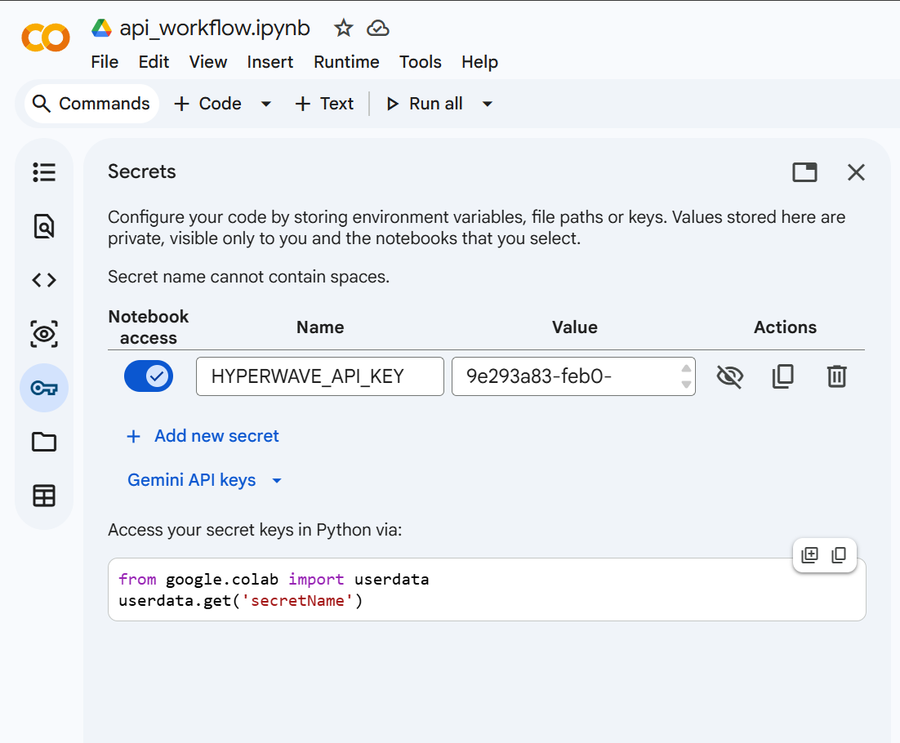

Setting Up Your API Key in Google Colab
========================================

Google Colab Secrets is the recommended way to store your Hyperwave API key. Secrets are encrypted, persist across sessions, and keep your key out of notebook cells where it could be accidentally shared.

This guide walks through the setup process step by step.

Adding Your Secret
------------------

1. Open your notebook in `Google Colab <https://colab.research.google.com>`_.

2. Click the **key icon** in the left sidebar (labeled "Secrets").

3. Click **"+ Add new secret"**.

4. Set the **Name** field to ``HYPERWAVE_API_KEY``.

5. Paste your API key into the **Value** field.

6. Toggle **"Notebook access"** to **ON** for the current notebook.

   The Secrets panel with ``HYPERWAVE_API_KEY`` added and Notebook access toggled on.

That is all. The secret is now available to your notebook code.

Using the Secret in Your Notebook
---------------------------------

The example notebooks use the following pattern to load the API key from Colab Secrets:

.. code-block:: python

   from google.colab import userdata
   import hyperwave_community as hwc

   hwc.configure_api(api_key=userdata.get('HYPERWAVE_API_KEY'))
   hwc.get_account_info()

``userdata.get()`` retrieves the secret by name at runtime. Your key is never written into the notebook file itself.

Where to Get an API Key
-----------------------

* **New users**: `Sign up <https://spinsphotonics.com/signup>`_ to create an account and receive your API key.
* **Existing users**: Find your API key on your `dashboard <https://spinsphotonics.com/dashboard>`_.

Troubleshooting
---------------

**SecretNotFoundError**
   The secret name is misspelled or has not been added yet. Verify that the name is exactly ``HYPERWAVE_API_KEY`` (case-sensitive) in the Secrets panel.

**NotebookAccessError**
   Notebook access is not enabled for this secret. Open the Secrets panel and toggle "Notebook access" to ON for the current notebook.

**Invalid API key**
   The key exists but is not recognized by the server. Log in to your `dashboard <https://spinsphotonics.com/dashboard>`_ to confirm your key is correct and has not been revoked.

**Still having trouble?**
   Contact support at support@spinsphotonics.com.
